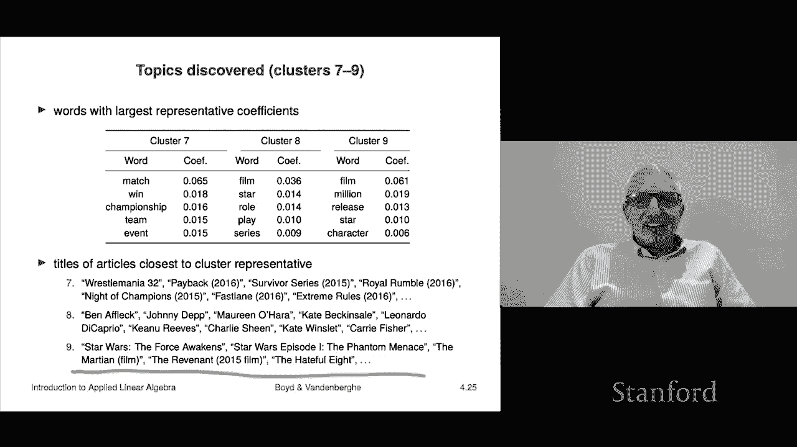

# 【双语字幕+资料下载】斯坦福ENGR108 ｜ 矩阵论与应用线性代数(2020·完整版) - P14：L4.2- K均值聚类应用 - ShowMeAI - BV17h411W7bk

We're not going to look at some real applications of the K means algorithm and by real application I simply mean looking at some real data and this is just to give you a rough idea of what it can do and a couple of times I'll give some editorial content about。

Basically how amazing it is is what I'll say it very simple， we'll see how that works。Okay。

 so the first things we're going to look at a very famous data set。Maybe it's too famous。

 it's the MNist。So images of handwritten digits so I think this is from the post office or something like that and so there are some examples down here these are people writing digits they've been there's some preliminary processing you know they kind of got them approximately straight and they got about the same size but you know they and the human doesn't have any problem reading these mostly I should add right you know so。

Okay， so here here are just 25 examples and you look at them and some are clear like that that three is pretty clear。

 that's pretty clearly a zero I don't know if we can find one that looks pretty bad， I don't know。

They they all look pretty good to me okay so it's a data set with 60。

000 handwritten digits these are images each image is 28 by 28 pixels and each entry in that vector so we represent as a vector of 28 squared 784 length and each one gives you the grayscale intensity and we'll take it between zero and1 because that's sensible I think the actual ones between 0 and 255 for historical reasons。

 but we'll take it between0 and1 so for example， that corresponds to a7 to 84 vector and we could look at it and by the way zero is black and so that vector if you were to look at it。

 there' would be a whole lot of entries that are just0 right a few would be one right those would be the ones the whatever whichever are the pixels corresponding to where the white is which is where it's drawn。

Those would be one， so you can even imagine in your head what those vectors would look like okay。

So that's a very famous data set， and these are just 25 examples to just get a picture of what they look like。

 okay。So we're going to run K means and this is just an experiment this is just be this is just to run K means right so what we do is we take 60000 vectors each of length or I guess more correctly I should say dimension 784 and we're going run k means on it and that's it and we're going to ask for 20 different you know partitions into 20 different groups now I want to add something about this before we get into what actually happens I mean you and I know that there's you know that these are images there' are two dimensional images we know what we know what digits are and things like that you know K means is profoundly stupid it simply sees a vector of numbers between zero and1 which are grayscale levels it has no idea what it does has absolutely no idea of what a digit is or anything like that okay so that's。

Just going to mention that， okay。So and we run it 20 times with different initial initial assignments and the convergence is shown below right and so here this is just three of them I think this red one is the one that ends up with the worst clustering objective of we were to blow that up and the blue one ends up with the best clustering objective at least the best that we found in our 20 runs oh I should add something here this shows you immediately that this algorithm is a heuristic right that you know on the red run。

 whatever you know here you ended up with an objective and there is another clustering with a smaller objective so it failed to find the minimum the minimum objective value clustering right so it is actually quite likely that the blue is also not the minimum。

The good news here though is if it's not the minimum， it's awful clothes， okay。

 so we'll just leave it that way， okay， and you can see it converges in you know 25 steps or something like that。

对。😊，So here here are the representatives you find now remember this knows absolutely we certainly did not tell it for each digit what the digit was like we didn't tell it。

 for example， oh this this one is an eight， this one's a three， this one's a zero。

 that's a four we didn't nothing， this is just seven you just get get a vector which is the image okay and if you take a look at what pops out。

It's kind of stunning like like that's kind of a zero right there I mean so most most of the most of the vectors in that cluster actually correspond really to zeros you know it kind of discovered you know that's a one that's a different kind of one right now some of course bleed across integers right like that's probably got some fours and some nines but it's actually kind of cool like these are mostly these are probably mostly fives。

So that's it， I had 60，000 vectors and I clustered them into 20 groups。

You know each one is probably on the order of 3000 I don't actually know I don't remember。

 but the point was it clustered them。 And then what you're seeing here is actually the average of all of the ones in that group。

 And so they're sort of smoothed out theyre kind of iconic or archetypes right anyway。

 it's very very cool So the only thing the only takeaway here。

 this actually has no particular immediate value， obviously。

 is just to say that here's an algorithm that took in vectors。

 we did not even tell them that the vectors were represented images。 number one。

 it has no knowledge that these are images that's number one number two number two。

 not only it does it not know that these are images。 it has no idea that these were digits。

 Okay so you know， it's pretty cool right and or I mean。

 unless you unless you do read let's say you know whatever Hindi script you would get something similar if you just took 50000 or a million。

Pictures of Hindi script。Out would come something handwritten out would come something that were the character I mean if you knew something about it。

 you'd say oh that's such that's that but anyway I just think it's kind of amazing here that it has actually quote。

 figured out that there are these groups of， well here it had 20 but you can see that you know it actually kind of figured out that some of these things are some of these are digits。

 okay。就。All right， so that's very if you're not impressed by this。

 then you really aren't quite thinking about what's happened here， right？Yeah。

 so or I'd encourage you to go look at those vectors and see if you can say what kind what digit it is or something like that you can't。

 that's that's the hint okay。The next one and this is a real application now this is called topic discovery well I'll give you an example of it。

 very， very elementary example but but you know people do things you much more sophisticated but this is already kind of sophisticated works like this what we did is we took 500 Wikipedia articles I can't remember what they were maybe the 500 whatever most visited or whatever they were anyway we took 500 Wikipedia articles。

And then we took a dictionary with about 4，500 words， 4400 words， whatever something like that， okay。

 so then we did is you represent each of those 500 articles。As you represent it as a vector。

 which is the word count vector word count histogram， actually， right so。

There' are going to be a lot of zeros in those vectors right because if there's a zero in a vector。

 it means that that dictionary word did not appear in that article and therell be I mean there are some obviously there's some words like the and but that kind of thing which appear in many articles。

 but there's like technical terms and stuff like that that appear only names might appear only in a few。

 okay？So that's it Now I should also mention， I just want to emphasize how profoundly stupid this is right so people call this a bag of words model or bag of words method and the reason it's a bag of word methods because we take these aren't Wikipedia articles you they're written in English right so there are actually I mean there's words those words have meaning they're organized sequentially into sentences which are organized into paragraphs and maybe even sections so the point is you know we read them and we understand what it means and things like that So this thing is so dumb it destroys sentences there is no sections。

 there are no paragraphs and it' simply it actually just tells you how often words from a dictionary of 4400 different words how often they appeared that's all it does So you could never reconstruct an article from it or something or you definitely could not read I don't know so that's it I just all I'm doing is here。

It saying is saying how dumb this is right it's pretty dumb and you you could easily imagine nothing good is going to come by this because。

 you know， it's ridiculous， right？How could you partition Wikipedia articles if you actually do not know the meaning of words and have like destroyed the order in which the words appeared in the document？

Okay， all right， that's my preamble， all right， so we're going to we're going to run we're going to go we're going to partition into nine nine partition into nine groups。

 so we have 500 articles we're going to partition them into nine groups。

And what we'll do is we'll run K means 20 times with 20 different initial assignments and what we'll do is here's the convergence for some of these there's a couple of them I think that's the worst one the blue is the best one and this is just another one but there's 20 of them I'm only showing you three and so the point is then we take the best clustering oh by the way notice that the difference between the best and the worst is you know is the difference between you know 6。

9 and whatever 7。2 right so not a huge big deal okay so now we have partitioned 500 articles。

Into nine into nine groups okay and just and remember how dumb this is right that that K means has absolutely no clue what those words mean nothing else just it just looked at word counts and got 20 groups of vectors there okay and we see what we'll see what happened Oh and we also have then nine representative vectors each of those is a vector of dimension 4423 and word count it's like a it's a word count histogram literally it says it says here's a representative article and here's what it looks like okay。

So let's look at clusters one to three Okay， so what you can do then is you take let's look at the cluster representative so that would be let's look at z1 that's a vector with 4400 you know about 4400 entries right and we can look at the largest entry。

 we can also look at the small oh the smallest is going to be about zero。

 but wed look at the largest entry， the largest few entries to see what's there and here's cluster one and here are the five largest entries in that vector okay。

That's it and they're pretty interesting right and these are by the way。

 directly interpretable 0038 means you know basically 4% so so but the word look at the words they're super interesting is fight。

 win event champion fighter。Okay so we recognize these as words as being related Okay。

 so you know we do because well we understand English and we know what these words mean and things like that please remember this algorithm has no clue what these words mean not even the slightest for these are just numbers like fight is word number you know 2173 when is word number 1725 I mean I don't that's all it knows absolutely nothing else so it this is it's kind of amazing that this is what came out okay now。

For cluster one， we could do something pretty cool。I mean。

 you already have a rough idea of what the things in cluster1 are going to be but what we can do now is we can actually take we can actually go back to the Wikipedia pages and we could say show us the articles they're closest to the say for example the cluster one representative and here are the titles of the articles It is in order from the closest to I maybe it's the first10 or something like I't know what is okay so they are Floyd Mayweather juniorr Kimbo slicee actually I don't know who I think it has to do with boxing so not that I would know but the point is it kind of makes sense like wow。

 it actually kind of figured something out I mean something emerged right so that clustering is I don't know what this has to do with like boxing or something Okay fine let's look at cluster2 cluster two is we go over here。

And here here are the words， the most the words that have the highest value in Z2， okay。

 and they are holiday celebrate festival， celebration calendar and once again。You know。

 we recognize these as related， okay， so we recognize。

 but the point is this thing knows absolutely nothing I mean。So， okay， so it's clear what this is。

 Let's， and let's look at the articles that are closest to that representative。

 They are Halloween Guy Fox Knight， Duwali， Hanukkah， Groundhog Day。

 Rashahanna Yom Kiur  seventh day finishedist Church。 I don't know how that got in there。

 That's fine。 Remembrance Day。Okay， fine。It's kind of cool and it makes sense I mean this makes a lot of sense right Okay and the third one is it's got United family party president government so and then these would be the kind of things you'd see hott God Sigm for I don't know how Sigmund for it got in there but okay but I don't know you know Fredick Douglas okay Christopher Columbus Fidel Castro I don't know Jim Webb next to Fidel Castro okay okay so let's look at like。

Oh sorry， I should mention one thing in this case what we say is that a topic has been discovered。

 so we would say that cluster one is a topic in our corpus of documents。

And it has just been discovered using nothing but vectors and distance and the K means algorithm。

That's all it it completely discovered it just discovered a topic right so it's actually kind of cool Okay all right so that's this is the idea there okay for the next clusters again they all kind of make sense right the first one clearly has to do with singers and singing and things like that。

 cluster5 has to do with sports and it just figured it out just figured it out cluster six has to do with actually these are TV series which is actually kind of interesting because we're going to see later that it that movies are a separate one okay so here's clusters7 through nine things like matchtch win Championship team event you know and cluster I is film Million release star character and then here are the Wikipedia pages so closest to that cluster representative okay。

We could do some crazy stuff now for example， we could automatically classify new Wikipedia pages so somebody makes a new Wikipedia page。

And。Suppose let's suppose we stuck with these these nine topics right because these are you know it's clearly they're all topical right So if we stuck with these nine topics and a new Wikipedia page every every lots of new Wikipedia pages are made right and so what you do is you simply do the following you calculate you scan the words count the words you get its histogram and then you simply say which of our nine representatives are you closest to and we're assigning you to that topic oh by the way。

 I should say that when people really do this， there's usually a cluster associated with I don't know or not any of the other clusters right it's kind of like everything else it's the catch all cluster but nevertheless and now it's just completely automated right so that just works this way it would just kind of go through and stuff like that So okay and again I want to say that if you're not impressed by this then you not really understand and what it is and my point here is that。

Based on shockingly little about each of these Wikipedia articles， in fact。

 all we tell you is the fraction of times 4400 words came up right so I just want to I want to say it again because it's worth repeating。

This algorithm has no idea what the meaning of these words are none zero。

 it has completely it doesn't understand English， it does not we have destroyed the fact the sentences。

 there's no paragraphs， there's no syntax there is no meaning and yet it has actually discovered it has grouped these Wikipedia pages into what we recognize we do understand all those things and we recognize that these are reasonable clusterings right so it's actually very。

 very interesting what what's happened here and in fact it's almost like it's a hint about the material of this class is that。

A lot of times stories start with things that are just ridiculous like I'm going to simply count the number of words in documents and I'm going to do some something's going to happen like I'm going to cluster them where I'm going to make a prediction or something like that and you'd say。

OhThat is so unsophisticated。 you don't even know what the words mean。

How could anything good come from this right， and then the answer is？

The stuff comes out， so that's kind of a theme of the class。

