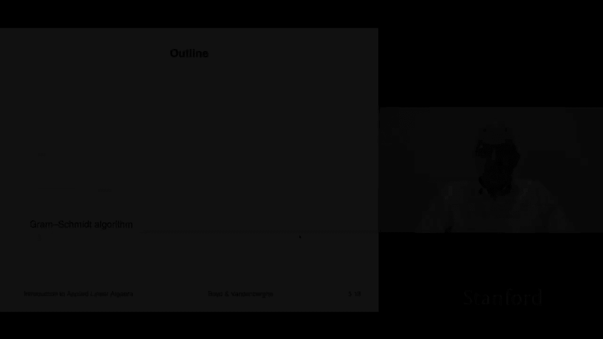
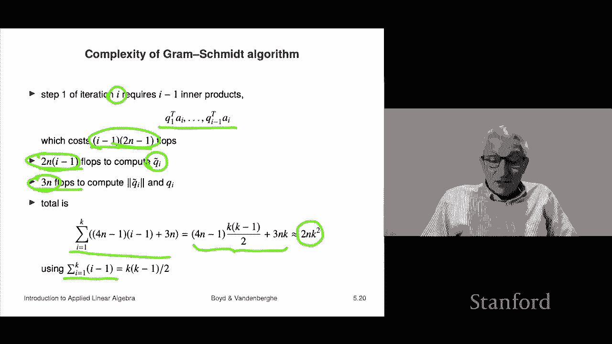

# 【双语字幕+资料下载】斯坦福ENGR108 ｜ 矩阵论与应用线性代数(2020·完整版) - P16：L5.2- GramSchmidt正交化 - ShowMeAI - BV17h411W7bk

Now we're going to look at a very famous algorithm called the Graham Schmidt algorithm。

 the name stands for two mathematicians， Graham and Schmidt。

So we'll take a look at it and its it has to do with linear independence and in fact it is an algorithm I mean for right now its main purpose is to detect whether a set of vectors is linearly dependent or linearly independent we're actually going to see later that it is enormously useful in a lot of practical applications but that's not going to come up for a while so right now it is again i'm sorry just kind of weird and abstract I should also say another thing about it you know we describe one algorithm already that's the Ka means algorithm and now we're going to describe Gham Schmidt I guess I'm not one who thinks that。

Students should be forced to implement these things by themselves I mean I don't know I mean I suppose there's a point to it I don't but it will describe it and of course you know when you're doing this in practice you're going to rely on on implementations written by others so so the point of it is not that you're going to go out and code this yourself the point is you should understand what it is and how it works and what it does but when you actually use it you're going to call you know some routine written by someone else。

Okay。So here's what it is。For now， we'll see that it's a lot more than this， but for now。

 here's what it is。 It is simply an algorithm that checks if a set of vectors is linearly independent。

 That's it。 We're gonna to see it has a lot of other uses later。

 In fact you know in the whole class is about two or three algorithms and this is they're basically all related to it's all it's all this one this is gra Sch okay so here it is we're just going to jump right in and like I said right now it's kind of abstract。

 but that it'll you know it'll emerge later in the book that it has a lot of uses Okay so we're given a set of vectors and they're n vectors and we have K of them。

And what it's going to do is it's going to process them the vectors one at a time and in the end it is going to will be we'll be able to use this to determine if those vectors are linearly independent or linearly dependent right to remind you linearly dependent means that there's a linear combination of them that zero with the coefficient not Paul being zero a linear independent means that's not the case Okay。

 so here's what it does。 the first step is it takes。

The I vector AI and it subtracts from AI oh it maintains， I should say it maintains a set of vectors。

1， Q2， Q3 up to Qk unless the algorithm terminates early。

 it generates a set of Qs which are orthoormal oh I should mention that the the notation Q is this is just a convention typically a set of Qs are orthoormal vectors right by the way。

 same same for U's and Vs and it is just convention so okay but in this case it's following the convention。

So the vectors， it's going to generate a set of vectors Q1， Q2， which are orthoormal。

 so here's what's going to happen。You're going to take AI and you are going to subtract from it the inner product of Q1。

And AI， that's a number times Q1 and so on。 Now， what you'll recognize。

 you may remember this from last time， in fact， is that。If。

If AI is a linear combination of Q1 up to QI minus1， then in fact。

All of this is equal to AI and Q I is zero， so if QI turns out to be zero。

 that means that AI is a linear combination of Q1 up to a minus1， Q subi minus。

Now what we do is again， we check if QY tilde is zero， if it is。

 we quit and because in that case it'll turn out that these vectors are linearly dependent。嗯。If not。

 if it's non zero， we simply divide by the norm and we normalize and we get QI from QI tilde， okay？

So if this algorithm runs all the way to the end and does not quit as in step two here of the algorithm。

 then that's going to tell us that those vectors are linearly independent。嗯。

If it stops if it stops in algorithm in step J， then it's going to tell us that vector Aj is actually a linear combination of the previous ones a1 up to Aj minus1 and that means that our set of vectors is linearly dependent okay so that's the algorithm now the one that's actually used numerically in practice is mathematically equivalent but it's not quite the same as this I mean it generates exactly the same vectors and things like that but it's slightly different。

Okay， well let's walk through an example。Here's two vectors， which are two。

 two vectors They're a1 and a2。 This gray circle is showing you all points of norm1。

 So it's a circle basically of radius 1 Okay and so let's see so that would tell us for example。

 the norm of a1 is about one point whatever3 I'm making that up that's about it Okay so let's run Gm Schchmidt well we grab a1 and the first thing we do is we subtract off from a1's subline combination of the previous cues but we have no previous cues so we subtract nothing and so that tells us that Q1 this is the first step right Q1。

There we go sorry about that， so Q and Tilde is in fact just nothing but A1。Okay。

 so now that's the first step we check if it's0。 It is definitely not zero。 And so we normalize it。

 And that means we shrink it to get Q1。 And you see now it's green。

 And you can see that it's it's arrow， the tip of the arrow you know， shows is on that unit circle。

 It's what it's called and that means it now has norm1。

 So that that's Q1 Okay next step now it gets interesting right because now we go over to here。

 And what happens is we take a2 and we subtract off from a2。

 a multiple of Q1 to make the result orthogonal to Q1。 And so the correct thing to。

To subtract is minus Q1 transpose A2 Q1。 And that's this vector here。

 And we end up with this red vector here， which is Q2 tilde。

 Now notice that Q2 Tilde is orthogonal to Q1 because that's actually what we're doing is we're slowly producing and we're generating a set of orthoormal vectors okay。

亮。At this point they're just ortho， they're not normal yet and so what we do here is we check if Q2 tilde is zero it is not zero and therefore we scale it to make it have length1 and we end up with there we go。

 there's Q1 and Q2 and so this is extremely boring。

 there's no reason to have any interest in because there's nothing just to be completely open about it。

There's nothing practical we can do with this Yes， so yeah， so I'm just I'm admit。

 that's all I'm admitventing it。 Okay， so so the point is if you run like the。

If you run Graham Schmidt on these two vectors， A1 and A2。That's what comes out Q1 and Q2。

And you could well ask who cares and I would say you don't know the answer is you don't know yet。

 you'll know later that this actually can do all sorts of super cool practical stuff。

 but for the moment this is all just weird and abstract whatever so just trust me all right。So。😊。

We can analyze this a bit， I'm not going to go into it in too much detail because this is the kind of thing that's best done by you kind of you reading through the book carefully and stuff like that。

 but I will say just a few things about how the algorithm， what it does。

So the first thing and I think our example already kind of gave us hint is thees that come out of the gram Schchmidt algorithm are orthoormal okay and the reason we can check suppose it's true for I minus1 and we'll show this by recursion in that orthogonalization step you are actually subtracting exactly the coefficient you need to of the previous cues to make it orthogonal to all of them okay so when you finish Q I Tilde is orthogonal to all the previous ones that's how that works now to see that all we do is we take an inner product with Qj so Qj transpose Q I Tilde is equal to and this is Qy Tilde here and I'm just going to simply work it out and see what we get but over here we get things like Qj Tilde Q1 well that is going be that's going to be zero right so the only one that comes out。

As we end up with QJ transpose sorry the inner product of QJ and AI and then again QJ and AI and dis subtracting me get zero so it's orthogonal and what that says is that the new。

It says Qitility is orthogonal to all the previous ones。

 but if I scale it by a number because to make its norm one， it's still orthogonal。

 so the cues are orthogonal。And of course， the normalization step guarantees that the norm one okay。

 so it says that the QY's that come out of the back end of the Gham Schchmidt algorithm are orthoormal。

Okay， now if it hasn't if the algorithm has not terminated before iteration I。

 then it turns out AI is a linear combination of Q1 through QY and we can even see that because we can actually very explicitly write down what the linear combination is it is。

Literally the norm of QY tillilde times QI plus and then again this inner product these are inner product coefficients。

 it's the one you've already seen before in a north normal basis expansion。

 So what we do is we we get that that's very explicit So AI is literally a linear combination of Q1 up to QI Okay In fact。

 well that's one of the ways we could say it is that each each AI is a linear combination of Q1 up to Q I okay。

And it turns out the reverse is true too each QI is a linear combination of A1 through AI。

 and again you can see that by induction， I'm not going to go into the details there。

 but's that's the case。Okay， we get to early termination if it terminates in step J。

 what that says is that Q J tilde is equal to0， that means that when you took AI and you AJ and when you subtracted the appropriate linear combination of Q1 up to QJ minus1 from it。

 you got zero and that tells you actually that that equality holds now。

Now now we'll notice that each of these Qs here is a linear combination of。The As， a1 up to Aj -1。

 So this is a linear combination of linear combinations。

 linear combination of linear combination is again， a linear combination。

 And that says that when it stops， it says that AJ is a linear combination of a1 up to Aj -1。

s that is one of the definitions of being dependent。

 So what that says is that the Graham Schchmidt algorithm， if it terminates early。

 then it terminates because the A's you started with were linearly dependent。

I want to say a little bit about the complexity of the Gham Schchmidt algorithm about how long does it take to you know basically how many flops does it take to actually carry this out Well let's figure it out in iteration I you have to evaluate I minus1 inner products right and that costs each inner product costs two n minus1 flops and there's I minus1 so that's that okay so that's the total number of flops to compute Qit you have to subtract subtract off various things and that costs you two n I minus1 flops。

Then it costs you three n flops to calculate the norm and then divide QI by that norm to get QI。

 so that's three n flops。And the total is now we add this plus this plus that and we have to now sum that from I equals1 to K and you get something horrible that looks like that。

 Now you could work out what that is in fact it's exactly this and I'll tell you why I'm going use a formula which you can just remember or look up or go to Wikipedia to find out or something like that。

 and it's this it's the sum from I equals 1 to K of I minus1 is actually k times k 1 over2。

 In other words， the following sum， you know， if you can check it if k equals5 and this says you should add up0 plus 1 plus2 plus 3 plus 4 and you will find out that that is 5 times 4 about about two which is 10 and it's correct I mean。

 maybe I misspoke it but。It's correct so anyway， so you get some horrible thing like this now what you have to remember about flop counts is。

It's extremely crude。 So we're going to drop what are what we call non- dominantinant terms right So for example。

 you know when you work this out， the biggest term you're possibly going to get is going to be this4 n times the K squared divided by two that's two nk squared all the other terms have a coefficient of either n or k which is smaller and we're interested in the case where n and K are reasonably large。

 So we just drop them and so this is completely standard in a flop count and you would say that Gm Schchmidt has a complexity of two N K squared flops。

 and the truth is it's not quite right。 but the whole flop count model is so approximate that this is just fine because' you we're pretending that multiplies and adds and divisions and things like that。

 even a square root because we have to calculate a norm and we're kind of pretending that these all costs the same which they don't so you get two。

K squared that's interesting right because it tells you that it is。

It is quadratic in the number of vectors that you apply it to， and it's linear， you would say。

 in the dimension n。

