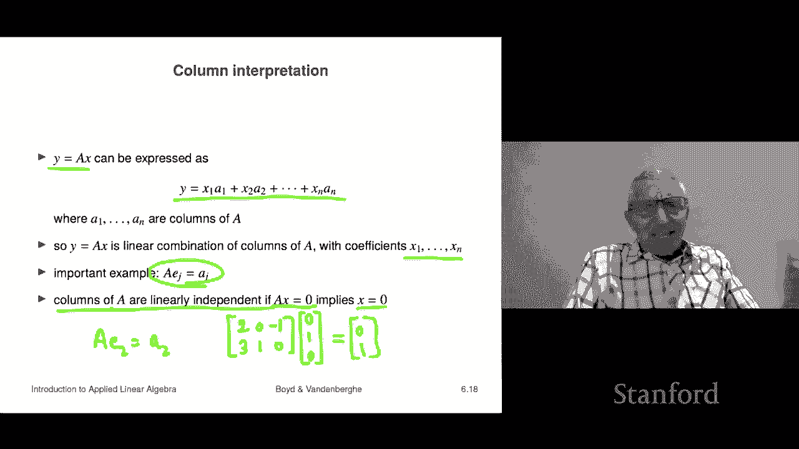

# P18：L6.2- 矩阵向量乘法 - ShowMeAI - BV17h411W7bk

We're now going to talk about a very important operation involving matrices and vectors。

 it's matrix vector multiplication， it's not something we've seen before。

 but it's actually going to be used basically throughout the entire book and class from now on。

 it's matrix vector multiplication。

So here's what it is if I have an M by n matrix and n vector， so that means that the matrix here。

 if I write it out it' got it's going to have M rows and n columns。

 then I can multiply it by an n vector like that and the way we denote matrix vector multiplication is just concatetnation。

 meaning you put the two symbols next to each other So you just say ax just like a lot of algebra just put the two symbols next to each other and it means the product in this case it means matrix vector product and so we'll call if that's if that's that what you get from the matrix vector product is an M vector and it's if entry is exactly this you go across the I row of a。

And you multiply those by all the entries in X thats if you you might recognize that as an inner product and you are right it is an inner product right so let's see let's just do a quick example now just to make sure this make sense and it's confusing at first with all the indices flying around and you'll get used to it and also right now you don't really you haven't seen any applications of this so it doesn't mean anything so just consider this for the moment kind of like the rules of chess you don't ask why can you do that or why can you not do that It's just the rules for now okay。

Let's let's multiply let's do matrix vector multiplication here is a two by three matrix and here's a three vector the first check is when you multiply an M by N matrix by a vector x。

N that's the second dimension of the matrix has to match the vector dimension。

 And that's true here because this is two times 3。 And that's a3，3 by one。

 if you like or three vector。 Okay， the result is going to be a two vector。 So and sure enough it is。

 Now let's see how to get it。 Well， what you do is the first entry in y， which just happens to be3。

 is you take the first row of a。 this is a， this matrix here， this is a and this is x。 and that is Y。

 we take we go across the first row of x。 and we multipied by the corresponding thing。

 Or if you like， you could say roughly we take the inner product of the first row of a and X。

 and that gives this。 And I mean we can even check that at'0 plus2 and then plus1 the -1 times -1。

 And so we get3。 and that's correct。 So that's the idea that's matrix vector multiplication。

Now we can interpret this tons of ways， right， and all of them we're going to use every single one in this SQel。

So the first is you can express this as simply if you have the rows of a and call them B1 transpose up to Bm transpose now B here are column vectors not row vectors。

 but when you transpose them they become row vectors so B1 transpose as the first row of a then you can write this y equals ax is well it's B1 transpose x but which we now know is the inner product right so it's the inner product of B and x so you can think of matrix vector multiplication as simply it's like taking the inner product of every row of the matrix with the vector X let's say okay seeing them in a batch inner product for example and here's an example。

 if I say what is a ones。Bold one is the vector with all entries1。

 then that's a that gives you a vector， and it gives you the row sums of a， right？ So， for example。

 if I have a matrix a。Is you know0，1 minus1，2。 then if I multiply that by1，1。

 what I get is the first one is I get one here and down here。

 I get one right and this is one is the sum of the first row。

This one is the sum of the second row right so so when you see a1 you should be thinking okay。

 that's row sums Okay by the way， these are these are kind of important because you're going to want to be thinking about rows。

 columns row sums， column sums， all sorts stuff like that okay。

Column interpretation is also super interesting and uses a concept we've already seen。

 if I write y equals a X， I can think of it as y is a linear combination of the columns of a。

 So if a1 through A N are the columns of a then。Y is literally x1 a1 plus x2 a2 plus x and A。

 and so you can think of vector matrix multi as super compact notation for forming linear combinations of the columns of a。

Using the coefficients given by x， Okay， so here's a super important example。

 It's something you just absolutely need to know A times EJ Ej is the J unit vector。

Is the J column of a okay， and so it's kind of interesting right so you would say things like this。

 you would say that multiplying a matrix by Ej picks out the J column So let's just check that just for fun let's go to0 minus1310。

And let's multiply that by the second unit vector okay and what do we get well let's just do matrix multiplication I sort of take the inner product of this with this and I'll do it in my head00 and zero okay so I get up here zero okay and now in my head I'm going to take the inner product of this with this and I get one。

And sure enough， look what I just got I just got the second column because this is a times e2 equals a2 Okay so and we're going to use this both ways if you multiply matrix by a unit vector you're picking out a column also sometimes we will want to we' do it go the other the interpretation should go the other way so okay。

Linear independence， linear independence says that if a linear combination of a bunch of vectors is zero。

 the only way to do that is with the coefficients being zero。

 so now we can write it in matrix spectrum notation super compactly。

 we would say the columns of a are linearly independent。If Ax equals0 implies a equals0。

And just to kind of put a seed in your mind， I'm going to say something more about that we can interpret it this way if a and X were numbers and I walked up to you and I said。

 hey， AX is zero， the product of two numbers is zero。

Then what you know is one of those two numbers is zero or another way to say is this。

 if I say that a x is0 and these think of these as numbers now is zero and I tell you a is nonze。

 then you could say， well the x has to be zero period okay or you could say things like I can cancel a from this equation or something like that okay now。

That's what linear independence means except it's for matrices and vectors it says it says that when if you have a x equals0。

 we can conclude x is0 right so roughly speaking we can cancel a or something from the equation and so we can see there that linear independence can be interpreted as sort of like。

Of the columns can be sort of interpreted as a fancy matrix appropriate way of saying a is non zero in the sense that it can be canceled so okay that was all vague and weird but we'll get to all those ideas later。

