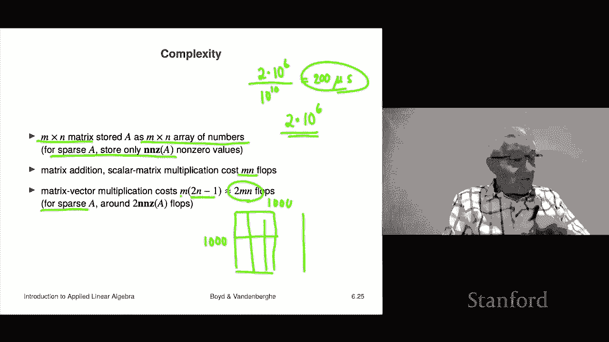

# P19：L6.3- 矩阵向量示例 - ShowMeAI - BV17h411W7bk

We're now going to look at some examples of matrix vector multiplication。

 by the way we'll see it throughout the rest of the course。

 so these are just think of these as just your first examples that you're seeing。

However， they should already kind of be clear that it's going to do something that is going to be useful for us。

Okay， so we start with some really dumb stuff， you know， the basics Okay。

 so if I multiply a zero matrix by any vector I get zero right and so I mean。

 you look at the equation0 x equals0 and your eyeball says yes。

 you what else was it going be but it's important to understand that this is we're actually loading into these four characters that's quite a strong statement right zero is a matrix x is a vector and zero here is a vector Okay here's one that identity matrix I don't know if you remember the identity matrix it's a matrix with ones on the diagonal like this and zero is everywhere off the diagonal right so something like that there's the。

There you go' a there's a  four by four identity matrix if you multiply that by any vector you get the vector back and that's by the way way it's called an identity matrix right？

It， it does absolutely nothing if you multiply it by a vector。 as it gives you the same vector back。

 And you can， you should check that。 I mean， let's just multiply this by， you know， X1， x 2。

 X 3 and x 4。 And let's just audit this。 Let's just take。 Let's do the third。

 Let's fill in what the third what the third entry in。In this case， I X is well。

 that says please walk across that column right that row。

 I'm sorry and go down here and you basically you multiply 0 by x10 by x2，1 by x3，0 by x3。

 you multiply you're gonna get x3 so you get x3 here Okay， and you know。

 sure enough X3 is the third entry of this and it's the third entry of that。 And okay。

 I mean that was silly， but the point is you should do this to just check， you know， okay， all right。

Now the inner product from basically part one of the course on vectors we wrote it as a transpose B。

 as I said last time I misspoke on a number of occasions and accidentally referred to it as a transpoposedse B that was bad because in fact we had not I had not defined what a transpose was or anything like that so most of the time I think I got it right and referred to a transpoposedse B as the inner product henceforth though I'm fully allowed to refer to a transpose B either as the inner product of A and B。

 the two vectors or literally a transpose B which means。Transpose a。

 which makes it a row vector and multiply it matrix vector multiplication by B Okay so that's and it's nice it means that that explains that notation fully it's nothing new。

 it's nothing special okay and so it's really cool it says take an n vector form when you transpose it it becomes a n row vector and then you multiply by the n vector B and the result。

 by the way， is a one by one matrix， which we just consider to be a number okay。

So our notation is completely consistent with transpose and vector matrix vector multiplication are completely consistent and in fact。

 are exactly are our notation for the inner product okay。Let's look at some other ones。

 Here's an example。 You recall what it means to dem mean a vector to de meanan a vector says take x。

 take the average of all of its entries and subtract that number from every single entry in a Okay and what that means of course is you know the new vector is kind of the same as the old one except now the except the mean of all the entries are0 or something like that。

 Okay， the mean of yeah all right， so that is accomplished with x tillil de equals ax where this is the matrix this is the matrix so we can we can even sort of see that that's right。

 So let's look at x1 down to X N。Here and multiply this。 Well。

 and let's say that we believe that that's X tild1。 and let me see what it is。

 Let's just check that first entry。 Xtilde1 is going to be this number times x1 plus this number times x2 all the way up to that。

 And that's going be this X tilde1 is equal to。 Now the1 minus1 over n。 if you don't mind。

 I'm going to write it this way。 I'm going to write it x1 minus1 over n x1。 It's weird。

 but that's what I'm going to do minus1 over n x2 And then this goes on for a while And then I have minus1 over n times x n。

Hey look at that， this is the negative of the average， so in fact this is right， you can check。

This is a fancy way mean it's a silly way to demean a vector。

 but you can think of it as just a matrix vector multiplication with this matrix a by the way。

 in these connections when we see what multiplying by a matrix to a vector does，嗯。

And we interpret it some way like this is this is demeaning you're going to want to establish develop the skill of going both ways like I show you a matrix and then you tell me what it is in words。

 I mean if it's just some weird random matrix the answer is I don't know。

 but the point is you should be I should have been able to give that matrix and say what does it do。

And then you would come back and say， oh， it simply subtracts the mean of the entries from every entry of x it's a demean people would even refer to that as the demean matrix so anyway and you'll want to go back and forth so we'll get to that later。

Okay here's a here's a matrix which illustrates what I was just talking about perfectly it's n minus one by n difference matrix here's D it's very sparse right by the way。

 most of the entries are zero few entries are minus one and somewhere plus one so here here's what it looks like it says it says minus1 you know one and the next entry is in all zeros zero minus11。

And what happens is we simply put a vector here。Multiply this out。

And and see what we think what happens Okay， so when I multiply this row by this。

 if I do this row by this， this vector here， what I'm going to get is minus x1。

That's from this entry plus x2 And then everything else is 0。

 So what you're gonna to get is this Dx is x2 minus x1 then x3 minus x2 because of this here and and so on。

 And you get n minus one of these and you can see what this matrix does。

 it takes the first difference， the difference if x is a vector。

 it simply takes the difference of consecutive entries right So now by the way。

 a lot of times if the feature if these were just x is that if the different entries of x are features and they have no relation to one another。

 this has no meaning and no use but for example， if x is a time series。

 this is super interesting right So if x is the rainfall over at a different day on different days then Dx tells you the change in rainfall from a given day well from tomorrow from today or something。

The one the daily change in rainfalls， what it does if it is positive it means there was more rain on that day than yesterday if it's negative。

 it means it was less okay so you could even if you like you could even start thinking in the back of your mind that this is something like a derivative or something I mean don't take that too seriously but it's something like that okay so so that's a matrix you will see this many。

 many， many， many， many times and you might as well just get used to it right now it's a difference matrix and and we should have been able to do this with you you know both ways right that I should have showed you that matrix and said what does it do and eventually you could have said。

It takes it takes the consecutive differences right So here's something that comes from that。

 it's a beautiful thing。 It's the norm squared。Of the of D X。 And that's called the Deishle energy。

 Derile was a mathematician。 And it's a measure of the wigliness for X of X is a time series。

 because you know what this thing is， this is exactly equal to the sum。Of X， I。

Minus X I minus1 squared。And the sum goes from I equals2 to n。 That's what it is。

 So it's literally the sum of the squares of the consecutive differences。

 So you could have Dx the deishlay energy is zero for any vector， which is quote constant。

 meaning all the entries are the same then the deishlay energy is zero。

If X is like crazy wigly or you know first it's plus 10 minus 10 plus 10 you know if it's alternating sign the de slay energy is going to be very high right so that' that's the idea behind that that's going to come up later in the class exactly this kind of thing okay。

Here's another example this one is from finance so let's let R be a T by n matrix of asset returns right and so the rows represent time periods consecutive time periods or let's say dates the trading days right and the columns represent a particular asset and we have a universe of n assets that is the slang that you would refer to the set of assets you're looking at let's say at a quantitative hedge fund you'd say what what's your universe and in this case n is the size of the universe of assets okay and so R IJ is the return of asset I sorry it's a return of asset J in period I。

Let's look at an n vector and it gives a portfolio。And it gives you。

 let's say the investments in the assets they could add up to one in which case it tells you the proportional investments like you know I put 10% of my portfolio is in asset one。

 20% in asset two， it could even have negative numbers which represents short positions。

 negative ownership， I think we talked about that before it's weird but it's possible。And then。RW。

 literally by sticking the matrix times the weights what you will get is a vector of the time series of your portfolio return。

 Okay so I mean， it's really cool right， So I mean， we could just do a quick example， right。

 So I'm not going work everything out because it's kind of goofy I'll do the let's see， okay。

 this is002 minus。01， you know， I'm just gonna do a couple here，003 and minus。04， you know。

 and I don't know what this is， this is gonna be 001 and 001 Okay。

 so here are this is this silly because it's so small， but the point is three time period。

 So three trading days。Two assets， I don't know what they are， know。

 Google and Intel or I couldn't hear less， right Okay， so here are the two。

 And then you know let's ask ourselves like what what does it mean Well。

 the first column gives you the time series of returns of the first asset。

 The second column gives you time series of returns of the second asset。 So for example。

 the second asset Los a percent gained a percent then gained another percent Okay the first asset gained 2%。

 then three then minus then minus4%。 Okay now now I'm going to make a portfolio of these and I'm going make it I'm going make it super simple because I don't even want to mess with it。

 Okay here's my portfolio。 It's going to be 05 and 05。

 so I'm simply going invest equally in these two assets。Okay， that's my that's what the 0。5。

5 means okay， so it's the proportions that I invest in it and so let's see what what happens when I get Rw when I multiply Rw。

Actually interestingly what I'm getting is a three vector and its this row times that and I'm actually if you multiply by 0。

5。5 you're actually taking the average right so the average of of up 2% and down 1% is let's see it is down it's plus0。

005 I hope I did that right and the average of the other two is going be 0。

02 I'll put the o there and the average of these is minus 0。04 and plus 00 was minus0。

03 divided by 2 is maybe 0 minus 0。015 there we go。I made this up in real time。

I hope they're right if they're not sorry， but in any case。

 see that's the nice part if I had a class in front of me。

 somebody would be could wave their hand say that's wrong and I would say good thanks just checking on you。

 but I can't do that now so all right。So let's see what it means。

 it means that if I invested equally in these two here here would have been the sequence of my portfolio returns right so you know on the first period I'd say oh good news。

 your first went up 2% and you'd say bad news your second asset went down 1% but my portfolio went up half a percent right on the second one it'd be hey great news。

 your first asset went up 3%， your second went up 1%。

 I'm 5050 so my portfolio goes up 2% Okay so' that's kind of the idea okay so that's it and now it's really cool So when you do matrix vector multiplication when W is a portfolio and R is this return asset returns。

 many assets， many time periods what you get is you get the time series of the portfolio return So for example。

 if I take the average of RW that's literally the portfolio mean return because this is like a return time series。

And if I take the standard deviation， that's the risk right so just a handful of things now we're able to very quickly describe real things right so if I have a return matrix and so this way for example。

 we could discuss different weight vector。Somebody could say， here's my weight vector。

Someone says where they come from and they could say it's none of your business， someone else to say。

 here's my weight factor。And you'd say cool we can then calculate for both of them for both those weight vectors。

 what would be the return time series of their portfolios and then we can actually evaluate each one on a mean。

 which is the mean return and on the standard deviation of that time series and that's going to be the risk and。

Maybe they're incomparable， but maybe one is better that maybe one dominates the other。

 dominates meaning that it has higher return and lower risk。So this is the idea。

 but and look how quick it's it's just just a handful of concepts we have and we're just shoving them together。

Here's one feature matrix and a weight vector so here what I do is I form a feature matrix so the columns of a feature matrix are the features for for the different items in this case I have capital n items and each one is an n vector have n features and so I shove them together in a matrix which I'm going to call the feature matrix and so the columns are going to be well the feature the feature vectors for the items okay here if I make I make w a weight vector and if I form x transpose W。

Let's be super careful here。 X has size N by n。X transpose has size n by n Okay。

 and then we propose to multiply that by an n vector。 and that's cool。 So yeah。

 I should mention something here。 You're going to want to turn on a syntax checker。

Well the same way any kind of computer language has one。

 but you need to be one yourself it's a mathematical syntax checker and you just want to make sure everything is cool right so I mean somebody might mess up and write their XW。

And but you should immediately that should throw an alarm because you should say， excuse me， hello。

 whoa， slow down here， you cannot multiply， you know。

 and a little n by capital n matrix by an little n vector unless unless they're equal right so that's you just want to be checking that the syntax rule that the rules are correct right So okay。

 you know any more than if I walked up to the street and said that two vectors a two vector and a three vector are equal right just it doesn't conform to syntax So you want to check So what you get in this case is if I form this。

 then this is basically the same as taking the inner product。

Of each one of our feature vectors with this weight vector and we had interpreted that before scores right。

 so for example， each。Each of these each of the items could be individual people X the X I is for the I person。

 It is a feature。 it's a set of features that characterizes that person。

 and it should be things like the total amount of late payments on or his credit card in the last six months。

 I'm just making this up okay， another one could be the fraction of times they pay off their whatever feature one could be have they actually declared bankruptcy in the last five years right something like that So I have all sorts of features related to them Okay that's a feature vector and then W is some weight vector which I don't know what it is and then this thing this score could be for could develop a credit score right so it says here's the credit score and in which case。

 by the way， everything here is completely interpretable right so W1 for example。

 tells you how much does feature one figure in。To your credit score and so for example。

 if the first feature is either zero or one zero if that person has not declared bankruptcy in the last five years。

 one if he or she has， then we would expect W1 to be negative。

 meaning that if you if a person has declared bankruptcy in the last whatever five years。

 we would expect their credit score to be lower than if they had not so it's all perfectly interpretable but once again。

Nx vector multiplication where a transpose in here gets you something that's very interesting and potentially already should be clear that this is we're bordering on if we're not already there。

 useful。Another beautiful interpretation of matrix vector multiplication is just input output so there we simply write like y equals a x these are almost the traditional symbols to you think of and what you do is you think of x as an input or an action and you think of y as an output or outcome or result okay and tons of examples of this we'll see a bunch of them but that's kind of the idea and then you think of like matrix vector multiplication as simply。

An action， what it does， it's what it maps the action to the result Okay， so。

 and in which case we can have this very simple you know， generic interpretation。 So， for example。

 AIJ， that's the IJ entry。That's the factor by which Y I depends on Xj if it's zero。

 it means doesn't depend on it。 if it's large and positive， it says that when Xj goes up。

 Y I goes up if it's large and negative it says that when Xj goes up Y I goes way down right so that's kind of the interpretation oh here's an interesting one if the matrix A is lower triangular then it says that y I only depends on X1 up to Xi and by the way。

 if these are time series is kind of awesome because that means that that's like causality。

 it says that know the if the if outcome， which and we think of I as a time period。

 it really can only depend on what X was doing in time period I。

 which is now I minus1 that's like let's say it's daily that's yesterday I minus2 that's day before yesterday and so on right so there lower triangularity corresponds to you know causality basically。

So that this is the idea， so this is another interpretation we're going to come to this many， many。

 many times。Finally we're going to talk about the complexity of some of these matrix operations meaning how many flops does it take and again we're going to approximate it grossly because that's what people do just to get a rough idea so so first of all M by N matrix A is stored on a computer as an M by N array of numbers so so I mean although an array would be understandable to a mathematician。

 that's actually the language of computer science and computer languages I mean it's fine but you just have to keep two sets of two dialects I guess to describe the same thing and just make sure you know which dialect you're speaking now for a sparse matrix it's stored in a different way that you store roughly speaking all you do is you store the nonzero values and so you would give a list with Ij and value so like a dictionary if you're familiar with that in some language。

Work or there's other exotic ways that people describe sparse matrices， doesn't matter。Okay。

 now first， let's talk about the simple ones， right， If I add two matrices， Well let's silly。

 I just add up M and。Numbers， so that's Mn flops if I do scalar matrix multiplication。

 it's the same I'm just， I just I multiply that same scalar by every entry of the matrix and that's Mn phps。

How about matrix， oh， I should ask you this。How many flops is in the transpose？Forming aid transpose。

Well， I guess the conventional answer to that is。0， because you don't do any multiplications。

 ads or anything。 You're literally just moving entries from one place to another。 Now。

 the fact is it actually doesn't cost zero time to transpose a matrix。

 right because know memory you have to access memory and then move it somewhere else and all that sort of stuff。

 So this just shows you one of the the shortcomings of a flop count。 It still， however， quite useful。

 the idea of flop count。 So so summary on that weird discussion is this。

 the complexity of forming a transpose is， well， zero， it involves zero floating point operations。

 no ads， no subtractions， no multiplies， no divisions， no square roots Okay。

Let's look at matrix vector multiplication。Well， let's figure that out。 Well。

 we could do it this way。 We could think of it this way。

's it's actually calculating for each each row or each entry of the product that's of which there's M。

 we calculate an inner product with a row of a and X and that as you recall from last time it takes two n minus1 flops takes it takes n multiplication and then n minus1 additions。

 And so two n minus1。 And the minus1， we just get rid of and we simply say that it's two mn flops that's it。

 No by the way， if a is sparse， you only have to multiply the terms that involve non zeros。 I mean。

 of course， right but this is it's two mn flops right so。Just for fun。

 let's figure out let's do a real example。 let's do a return matrix that has a universe of 1000 assets。

 That's typical actually， that's kind of like， you know somewhere between S& P 500 and some high cap US high cap Okay。

 so we have 1000 assets and let's let's give I don't know， let's go， let's go。

 I'll just make it approximate， but suppose I gave you。Here， I will give you one。

I don't want to make it square。 I'm going to give you yeah， I'll make it square。 sorry about that。

 I'm going to give you about 1000 trading days。 That's about four years because， you know。

 there's about 250 trading days in a year。 so it's 100 by thousand00。By the way， this looks。

 you would say oh my God， that's got a million numbers in it， Oh who， you're right。

 it it's the basically it's the return on any of a thousand days that's four years。

Of 100 different stocks， right， So some column here is Google， and here's Amazon， right。

 And here is July 12。 Okay， so that that's how this works。 right， So you， it looks scary。

 It's a lot of it's a lot of numbers。 a million numbers is not a small number。 I mean。

 this is hilariously small。 just I'm sure you knew I was getting there， right。

 that I could do this on my phone。 But we're gonna figure out how long it takes to do this multiplication on my phone。

 Let's say， Okay， and then now I have a portfolio with 1000 numbers， right。

 that' those are my weights。 who knows where the portfolio came from。 It doesn't really matter。 Okay。

 well， the number of flops required is gonna be 2 m N。 and that is two times 10 to the six flops。

 Okay now。But by the way， it would take you， if I asked you to multiply this matrix by this vector。

 it's going to take you a long time because you're going to have to do two million floating point operations。

Right， that's gonna take you quite a while。 Okay to do Okay， I mean， that's， of course。

 the whole point is you don't do that， but whatever， Okay， so it's 2 million flops。

 And now I'm going to say how long does it take to do that on my phone We could do that you can do my phone。

 my laptop。 My laptop。 let's do my laptop。 My laptop can do this And it with about 10 gigaplops per second。

 So on my laptop it would be two times 10 to the6 divided by 10 gigaplops a gigapflop is 10 to the 9。

 So this is 10 to the 10。And what you're going to get is actually。

 I'll tell you what you're going to get。 You're going to get， this is going to be 10 to the minus-4。

 so it is two times 10 the minus-4。 so people would write that as 200。Microsecons。Okay。

 a microsecond is a millionth of a second。Okay， so that says that if you wanted to find the portfolio time series。

If someone proposes a weight vector says I would like to hold these assets in this thing for four years。

 please tell me show me my portfolio returns， you're multiplying r times W and that would take you a shockingly small amount of time so it would take you 200 microseconds you could do this 5000 times in one second that's on my laptop so I could evaluate 500 sorry。

5000 different portfolios in one second on my laptop Okay I'm just giving you a rough idea of what it is。

 but the point is these are these are fantastically big calculations being done and they're done super fast。

