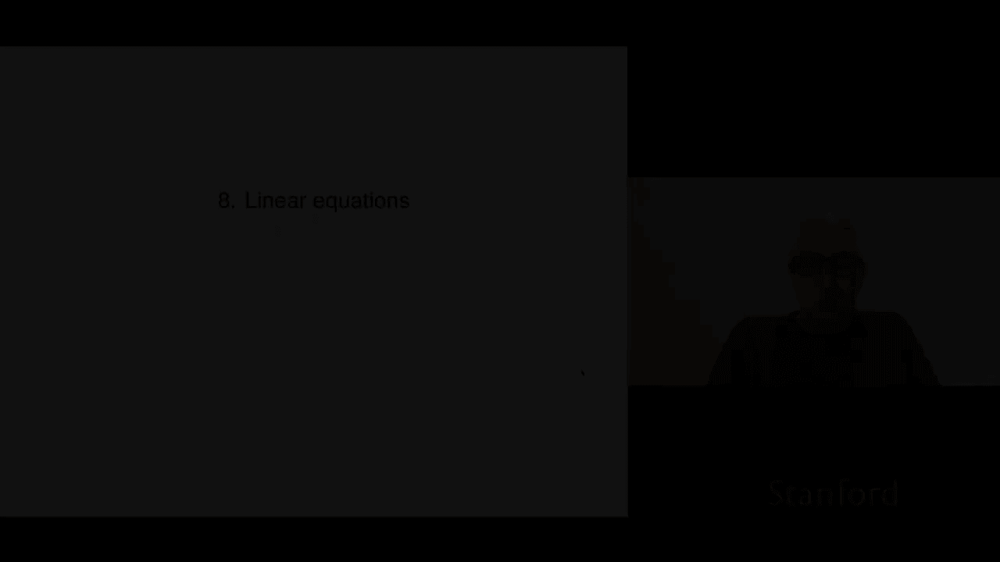

# P23：L8.1- 线性函数 - ShowMeAI - BV17h411W7bk

We're now turning to chapter eight， which is on linear equations， so linear functions。

 linear equations， we'll look at these。

So we'll start with defining linear functions now we had looked at linear functions before。

 but that was a mapping from a vector to a scalar we're now going to look at functions that map vectors to vectors。

So this notation F colon Rn to RM is complicated but pretty universal and it means it says that F is a function that maps an n vector。

 the first thing tells you what it takes as an argument or input and the second one over here are M tells you that's the set of M vectors and it says that what F returns or gives or yields or its output is an M vector so that's it so this just says it's a some function that maps you know n vectors to M vectors Now we can write this lots of different ways right so sometimes people write it this way。

 you could write it as the M vector where F1 you would say is the first component of the function F。

And if that's of course， also a function of x so you write it this way and that emphasizes the components of f of x。

 the M different components of f x now we can also write F of x as F and we can give instead of giving a vector argument。

 we can give a list of scalar arguments and that's f of x1 up to xn just so you can see that it' it's emphasize the fact that x is a vector with n components we generally we generally will switch between these notations without saying anything okay。

Now F satisfies the so-called superposition property if the following holds for any vectors x and y。

 these are n vectors and for any constants or scals。

 alpha and beta it says that F of alpha x plus beta y is equal to alpha f of x plus beta f of Y and when you look at this equation very easy to kind of say yesure or whatever but let let's actually take a look at what actually happened。

 I mean you can think of it this way， the alpha came out right and the plus also you know sort of roughly speaking came out of f or something like that and we can think of it this way So one way to say it is that this is forming a linear combination of x and y with coefficients alpha and beta and the left hand side says form a linear combination of x and y。

Then apply F。The right hand side is super interesting it says first apply F both to X and to Y。

 then form the linear combination with the same coefficients And what it says is that these two things。

 if F satisfy superposition， what it means is that these two things give the same result and so roughly speaking it says something like this it means that F commutees with forming linear combinations。

 something like that right because it says I can form the linear combination first then apply F or I can apply F to each of the arguments and an then form a linear combination and I get the same thing so now of course certainly not all functions satisfy this So this is a very special thing。

If a function satisfies this， it's called a linear function and that's kind of just universal across mathematics comes up in tons of fields right so that's the idea that's what it means to be linear It says that this very special thing holds this is probably a good time for us to just very quickly audit that equation's at least let's do at least a syntax audit a syntax audit says there's a whole bunch of stuff in there and you better be able to identify what each each individual part and subpart of the equation is and make sure everything is like cool Okay so here。

 for example， X is an n vector so is why。😊，Alpha x is scalar vector multiplication of an n vector。

 So that's an n vector。 So is beta y。 Then this plus is the plus between n vectors。

 Now remember we overload plus so we put plus innocently between all sorts of things and we kind of expect you to figure out which plus is it I that the plus between two numbers between two n vectors between two n vectors。

 In this case， it's the plus between two n vectors。

 Okay so the whole thing Al x plus beta y is an n vector。

 we put that into F as the argument and that's good because we look up F and it says F takes as argument and n vector。

 So it's a good thing we're passing it in。 by the way， if it weren't。

 then we would be committing a syntax thered be a syntax error here okay。

And this tells you that when you give F a proper n vector， F of that n vector is an M vector。

 and so the whole left hand side here is that's an M vector。Okay， cool。

 let's audit the other side just for syntax。 Well， F of x。

 we check that that's correct because x is an n vector and sure enough F maps n vectors to m vectors。

 So F of x that's an m vector that's also an M vector then alpha times f of x is actually scalar vector multiplication。

 but for M vectors So alpha f of x and beta f of y are both M vectors and this plus is the plus between two M vectors。

 not m vectors。 so anyway this is kind of thing and then of course。

 the whole equation is cool because on the left and the right hand side。

 what you have is an M vector and we're asserting that they're equal so。

Obviously if they were different sizes and we were saying they were equal it wouldn't even make sense Okay。

 so all right， so you may have seen this in other field you've certain you know maybe you've seen this in physics。

 mechanics， other areas， but comes up a lot the idea of a linear function。Okay。

 so let's look at a very specific。Linear function。You could even say it's the prototype or the most obvious one is's actually matrix vector multiplication so let's think of an m by n matrix a and we're going to define a vector a function F as f of x equals ax now remember what it means if I say f is a function mapping R n to Rm then I have to tell you what f of x is for any argument x which is an n vector and what I'm saying is you just multiplied by a and that's what it does so that's called the matrix vector product function it's a linear function that's super duper important and we can sort of check it because F of a alpha x plus beta y is a times this argument and now we're going use some properties of matrix vector multiplication right so for example it distributes across the plus in the first one the alpha scalar multiplication it commutes with so I can pull the alpha out and we recognize ax as f of x and。

AY as F of y and sure enough， this is superposition holds。

Now it turns out as with the inner product function for a linear function mapping an n vector to a real number that holds here too in other words that if a function is linear then it is actually given by multiplication by a matrix and we can even say exactly what x is sorry but the matrix A is the matrix a has columns given by F of E1 F of V2 up to F of VN that's it so that is the idea Now this by the way。

 has lots and lots of applications so it says for example that if I tell you that a mapping from RN to RM is linear it says that in principle you only have to make and you do n experiments right so you plug in E1 and you get this you plug in E2 you get that and。

You plug in n。You know different things E1 up to EN you form this matrix once you've got the matrix you don't have to go back to your experimental apparatus anymore all you need to do is multiply by this this matrix vector and you will you will get I mean if it's really linear you will actually get what would have happened had you gone in and actually carried out the experiment so that's that it's got a lot of applications like that。

Okay， so let's look at some examples oh one of the things you are going to need to do absolutely is to be able to recognize linear functions from that map RN to RM you have to be able to recognize them and you have to so I could describe a function and you would say is it linear or not linear linear means it satisfy superposition and it means it has a major expector represent a multiplication representation。

And you have to be able to go like back back and forth right you should be able to see the matrix A and then at least say what does ax do that sometimes it's not easy to say in English what it does。

 but a lot of times it actually is so let's look at some examples So here is I would call that like the reverseersal function or the reversal function So what it does is it takes a vector which is x1 up to xn and it spits out the vector sort of in the opposite order。

 So it's x n xn minus1 down to x1 Okay so whatever I mean if this was a time series。

 this would give you the time reversal or something I don't know what it is it doesn't matter Okay well it turns out that that's linear and in fact it's given by f of x equals ax with this a okay。

Now honestly， that's pretty clear because you should also be able if I showed you that matrix A。

You should develop the skill where you see that A and immediately， I'd said what is it。

 you would even say that that's a or a reversal matrix， right？Because let's see why。

 because if I multiply a times x， you know， if I put an x1 up to xn here， right。

 and now I have A X and you just look at the first you I go across the first row and down here and I get this is equal to X n。

Okay， then the second one is going to be x n minus1 and all the way down to the first one and you can see。

That's that that's x1 Oh by the way， this reverseer matrix is a selector matrix because each entry each row is a unit vector and in fact what it is is it's the unit vectors kind of in reverse order that's what it is Okay so that's an example of a linear function and its matrix representation here's another one running sum So here's x1。

Then it's x1 plus x2， the x1 plus x2 plus x3 and so on all the way up to the whole sum。

 that's the running sum thing and that is also linear and it is given by this matrix。

 and you should be able to see that as well because if I multiply a times of vector X then the first one I'm just going to read it from here is x1 then x1 plus x2 the x1 plus x2 plus x3 and this would come up for example。

 if x is a cash flow with positive meaning， for example。

 cash coming to you and negative meaning a payment you make then you would say that if you apply this matrix。

 which some people would call the running sum matrix。

 if you apply that matrix to a cash flow what you're going to get is the so-called cumulative cash flow So that would tell you it tells you that for example。

 the third the third entry of the cumulative cash flow is the sum of the first three right so for example。

 if it's an investment。Then you would say that the cumulative cash flow tells you what your net payment payment to you is at that time right so a typical investment might involve let's say a negative number which is investment in a project then it might even have two or three negative numbers and' that's you putting money into the project then well we hope some of the later entries become positive and that's you kind of being paid back those would be called disburss from your project or something and the running sum tells you kind of where do you stand when the running sum is negative it means that at that moment in time you put more into that project than you got out when it becomes positive you would say cool I'm in the black and you know well it may go down again but that's the point that's kind of the idea okay so this comes up in a lot of areas as well the idea of a running sum matrix but again it's linear and it's got it's associated with this matrix here and。

These are examples where you will absolutely need the skill to go back and forth between matrices。

 sort of an English description like running sum or reversal and then sort of a mathematical description that sort of tells you what it does right so here here's something that tells you what running sum is okay。

Now ane functions are very closely related to linear functions and it's the same as an aene you know it's a generalization of an affene function that maps a vector into a scalar which we already looked at that works like this a function is aine if it's a linear function plus a constant now in this case the constant is a vector and in fact it's an M vector okay and it turns out that that's the same as have as satisfying a restricted superposition property and that restricted property is this it says the superposition holds。

Period for a linear function， it's for any alpha and beta， however， for an aine function。

 it's only for alpha and beta that add up to one right so if you like remember that a linear combination where the coefficients add up to one is sometimes called a mixture right like you know a 7030 mixture would be 0。

7 you know and then 0。3 but you could also have where things like 130% that's 1。3 and minus 0。3。

That's called a mixture， so it says that superposition holds for mixtures All right。

 Now in this case as well， it turns out that if you are if you're an a if you are an aine function。

 we can actually represent always as Ax plus B and we can get a and B from F and the way we do that is we evaluate F of0。

 and then we evaluate F of1 F of v1， F of V2 and so on up to F Vn we and then we get a directly and you can just sort of check that if F is aine then F of x is equal to a x plus B where with this with this A and this B now as with as with linear functions scalar value linear functions。

It's common for people to call when they're being informal or something like that。

 it's common to refer to an aine function as linear right and so。Whatever。

 just be aware of that that some people refer to that as to aine functions as linear and then you'd say that's not if you stop them and say。

 hey，'s not that's not linear， that's aine， they'll say yeah whatever so but it's incorrect I mean。

 so whatever you should say something， maybe what depends on the social situation。

 whether you should say something or not， okay。

