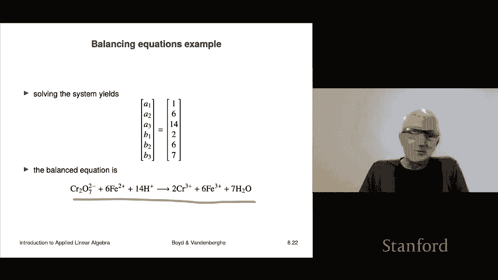

# P25：L8.3- 线性方程组 - ShowMeAI - BV17h411W7bk

Our next topic is linear equations， or really systems of linear equations。

 which are very conveniently represented using matrix vector notation。

So a set of linear equations， it's a set of M linear equations in n variables。

 the variables are going to be called by well by tradition。

 but they can be called anything x1 up to xn and there's M equations each equation looks like this it's a set of coefficients it's like capital A11 x1 plus a12 x2 up to a1n xn equals B1 so that's like one scalar linear equation is the way people call it。

Okay， and so I have M of those and here if we collect these x's into a vector called x。

 that's called the variable or the unknowns in the equation。

AIJ that these are these coefficients in here those are called the coefficients in the system of linear equations and if you form a matrix a which in this case is M by n that matrix is called the coefficient matrix of your system of linear equations B that's the vector over here if I collect the b's into one vector it's called the right hand side now that's a bit silly because it could just as well have been the left hand side but by tradition it's called the right hand side and this system of equations can be written in very compact matrix vector notation as AX equals B okay so。

That's some pretty powerful location there right because this could be I could write a X equals B。

 that's four characters right， A x equals in B， and I could be referring to an equation with 5000 variables and you know3000 equations right in which case it'd be a whole lot this would be a whole lot of equations and stuff by the way。

 you know that it's supposed to evoke the same idea for in another context， In this case。

 for example， of a and x and B are scrs right， you would call this a linear equation， of course。

 the solution is very silly It's x equals you know B over a。 that's if they're scrs。

 that's the case M equals n equals1 Of course， this has no meaning whatsoever。

 when these are vectors and matrices。We will see the correct analog of this equation later。

 but that's later in the course for now we're just talking about representing a set of linear equations beautifully compactly with matrix notation AX equals B PAs there's a lot of information in that。

O。Now we classify sets of linear equations depending on the size of a， the dimensions of a。

 so it's called underdetermined if M is less than n。

 that means that the coefficient matrix is wide it has more columns than it has rows Now remember that the columns of the coefficient matrix are associated with the variables。

 the X's， the X's the rows are associated with the actual individual scalar equations。

 so that's how that works and underdetermined says roughly speaking there are fewer equations than there are variables。

OkayIt's called the system is called a square system if they're equal， if m equals n。

 that means there's you know there， for example， there's 20 variables， 20 equations。

 okay so that's called a square system of a linear equations and it's called overdetermined if there are more equations than there are unknowns and that means that the coefficient matrix A is tall and an example would be I have 10 variables and I have 20 equations and that's called overdetermined。

These will be these names will become clearer later as well now a vector x is called a solution if ax equals B。

 that means it satisfies all the linear equations you have Okay， now depending on A and B。

 there can be either no solution。One solution or many solutions right and so all three of these are possible and we'll have a pretty complete analysis of that but by the end of the class we'll also much more importantly be able to see how to actually compute a solution and certainly we'll be able to calculate the solution when there is only one again that's later in the class but for now we're just talking about linear equations。

So we'll see later actually how to solve them。All right so we're going to look at an example and it's just to show you how it's just show you an example of linear equations this one is taken from very elementary chemistry which I took I don't know 40 years ago maybe more anyway let's go on so a chemical reaction actually I think is longer okay a chemical reaction involves let's say P reactants and Q products each of the reactants is a molecule and each of the products is also a molecule and it's written this way you write a1 R1 plus dot plus APRP goes to or in the react becomes B1 p1 plus up to Bq pq now these are not you know that's not multiplication of numbers right it's a different notation system and what it says is what this declares is that you have a bunch of reactants and they come together and some。

Ch happens and then what happens is you would take A1 units of reactant1 A2 units of reactant2 up to A units of reactant P and the unit could be for example。

 literally molecules and then what happens is well the chemistry happens then and then what happens when the chemistry is done is you end up with B1 units of p1 that's your product number one up to Bq units of a product of the last Q of the last product okay so that's how that works and then these A's are and bs are positive coefficients now they're generally integers but in fact the reaction is the same if you multiply it by any positive number right so if you multiply all the coefficients by half it would be describing the same reaction。

The same chemical equation Okay so that's that's that's the idea here let's look at a very simple example。

 which is electrolysis of water so okay so here here's here's the equation the so-called chemical equation and it says that this says so on the left there is one reactant it's water H2O now that of course means that water a water molecule consists of 200 and atoms and one oxygen atom right so that that's the chemical notation by the way if you don't know this。

It's fine， no problem。 This is just an example of a set of linear equations so you do not need to know chemistry Trust me I don't well。

 I did at one point ahead long， long time ago so you don't need to know this is just supposed to be an example Okay so this is on the left there's one reactant it's a water molecule it's H20 and on the right we get two molecules we get a hydrogen and oxygen those are gases ands these are molecules right so H by itself is a hydrogen atom H sub2 is a hydrogen gas molecule and same for O2 I mean it doesn't not be a gas hydrogen it's a hydrogen molecule okay。

So we get two products， which is hydrogen， the molecule H2 and oxygen that is O2 okay。

 and what this reaction says is that it takes two water molecules that's two of the H2O。

And something happens， but well， in fact， quite specifically electrolysis happens。

 and it produces two hydrogen molecules and one oxygen molecule okay。

 so that's what this reaction says okay， so that's an example of a chemical equation。So equations。

 chemical equations should be they have to be balanced right which corresponds basically to this conservation of mass of the different well the different types of atoms。

 so the idea is that each molecule in either the reactant or the product contains specific numbers of atoms and that's given in its chemical formula so for example。

 here's a water molecule and each water molecule contains 200 and atoms and one oxygen atom so that's2 H and 10 okay now conservation of mass says that I mean assuming this is not some crazy like you know nuclear fusion reaction it basically says that the the total number of each atom。

Among the reactants should exactly balance the number of atoms that come out in the products， okay。

 and so that that's kind of the idea and that says the equation must balance。Okay， so and that means。

 for example， for each atom that comes in either the reactants or products the total on the left hand side has to equal the total on the right hand side so when we write down when we write down electrolysis that's to。

H2 O， let me go back to it。 It's， yeah， okay， it's 2。 H2 O goes to2。 let's see。 Where is it。

 It's 2 H2。Plus O2 then we check right on the left hand side there's two water molecules each water molecule has two hydrogen atoms so the total number of hydrogen atoms on the left hand side among the reactants is four hydrogen atoms now on the right the number of hydrogen atoms is there's two hydrogen molecules each of those has two hydrogen atoms so I got four so everything's cool I have four hydrogen atoms on the left or on the right the left being the reactants the right being the products okay and you could check also that there's two oxygen atoms on on the left and two on the right or you would say two oxygen atoms among the reactants and among the products has two oxygen atoms as well and they are found in one oxygen molecule okay now if I give you the if I give you the constituents。

 the reactants and the products there's the task。Of figuring out what are the coefficients that lead to balancing。

 okay？So that's called balancing chemical equations。Okay。

 so we're going set that up and show how we'll write that as a system of linear equations now we can't yet solve systems of linear equations but don't worry that's coming later in the course actually not even that much later it's coming okay so what we're going to do is so this is just an example to show how do we set up a practical thing like balancing chemical equations how do we set that up as a set of linear equations Okay so what we're going to do is we consider a reaction with M types of atoms P reactants and Q products。

And I'll make a reactant matrix I'll call that R and R J is the number of atoms of type I in reactant Rj Okay。

 and so that's a matrix。 and that's a beautiful matrix right。

 It tells you it's highly interpretable right if you look at the rows。

The a row corresponds to a fix you know tells you about the atoms and how they actually how many of a certain type of atom I appears in all the reactants a column tells you about is basically tells you you know what is reactant what does that reactant consist of right so super interesting by the way the matrix R could be sparse that's super interesting that means that most of the reactants only involve only contained a few of the atom types。

 for example， okay all right and we'll let a be the vector of reactant coefficients。

Then if I multiply r by a， the matrix r by a， I get basically the vector of the total numbers of atoms of each type。

In the reactants。Okay， so if I've got， I here have I have M。

 what I do is I have the total I get the total number of each type of atom in all of the reactants put together。

 that's r times a。Okay now we'll define a product matrix the same way and so it will have and you know the entries are typically integers。

 that doesn't matter to us Okay， and then in a similar way。

 P times B that's matrix vector multiplication is a way to calculate all of the number the numbers of the numbers of each of the different types of atoms that you would get in all the products together including by the way。

 the coefficients in front of them conservation of mass then comes down to the super compact formula it says R equals PB。

That's a vector equal with M the left and right hand side is an M vector where m is the total number of atoms appearing in your equation。

 okay so that's what it is it looks like so RA equals PB。Okay， so balancing is。

This equation in matrix vectored notation。Now we're going to write this as a set a system of linear equations for the coefficients and we'll start by writing it this way。

 remember that RA equals PB expresses balance and we're going to first write that as RA minus PB equals zero。

🤧And then finally， we're going write that in block matrix notation as this is a block matrix here。

 R concatenated you know horizontally concatenated with minus p times a stacked on top of B okay so now you have to remember that when you stack know that when you do these stacks it all works out So this is literally R a minus Pb equals0。

 and that's exactly what this is， but we write it this way Now unfortunately。

 that is that's a bona fide set of linear equations Now unfortunately a equals b equals 0 is satisfies set of that equation Now that's nothing wrong with that that simply says that if I take zero of all the reactants。

Then and I get zero of all the products and that definitely works right because you know there's an certainly an equal number of hydrogen and carbon and nitrogen and so on atoms on in the reactants and the products which is zero in all cases。

 but it's not interesting and doesn't help us to find a nonzero solution we're going to set one of the coefficients like a1 that is the number of the first reactant。

The number of molecules that go into your reactants， I'm just going to set that to be one， okay。

Then I can express， I'm going to do some more stacking and I'm going to write here this way I get a big matrix here。

 which is R minus P。 this， the height of this is M。 the height of this part is1。

 I'm going to stack it as E1 transpoposedse。With zero next to it when I multiply this out。

 I get E1 transpoposed a a1 is E1 transpoposedse a so so this is a that's a set of equations E plus one the right hand side is got a zero all zeros and one at the bottom and so you could say from this set this is a set of m plus one linear equations in p plus Q variables and the first M equations give you the balance the last equation says that you're simply going to take one reactant of R1 one unit of R1 that's all in in your thing Okay now we don't this equation doesn't take into account the fact that these are non- negativeative integers。

 but let's not worry about that。Okay。Now you also have conservation of charge， so for example。

 if these are ions and I put a chart I can put a charge， I actually forgot what this is。

 it's some kind of chromium I don't know what it doesn't matter。

 but the two minus above it says it's got a charge of minus2 so it's got a surface of a it's got more electrons than it has protons and so it's got a charge of minus2。

Conservation of charge also says that it's not just the constituent atoms but also the charge has to balance on each side of the equation and so charge simply becomes another type of atom to balance it's very simple so now we'll do well a pretty hairy example and I don't mind saying that I have absolutely no idea what this equation what this chemical equation tells us or this chemical reaction is I imagine it's an important one okay in any case let's see what it is basically the three reactants。

 there's this one this one which has something with chromium or something like that that's something like that's iron that much I do remember and that's a hydrogen atom actually with its electron ripped off so it's a hydrogen ion okay。

On the other side we've got you know the maybe the atomic chromiums I don't I shouldn't say anything because anything I say I' is going to be people are going make fun of me so it's fine which which doesn't bother me by the way。

 it's fine Okay， and then we have another one which is。

Wwhich is is iron over here on the other side and then we have water okay so that much I know fine so there's five atoms and there's five atoms or charge right so you have you know chromium oxygen iron hydrogen and charge okay now the reactant and product matrix you can these you the coefficients you read off from these numbers here like Cr2072 minus these just that just reads right into your reactant matrix。

There is your product matrix and remember that the height of this is going to tell us is the number of constituent atoms and the last one is going to give you charge okay so okay now if you want we can audit one of these right like well I maybe we don't need to it's fine。

Okay， now if we work out， if we do exactly what we worked out over here very abstractly right here。

 this one， we just simply write up this big equation and we get this set of equations right here and it's a square system of equations。

 there are six unknowns which are the three reactant numbers the three product numbers and we have a set of six equations now it's a bit silly because we know instantly what a1 is because this bottom equation here says that a1 is one。

Right so but nevertheless， this we've just written this as you know Ax equals B。

 this is the matrix a， six by6 it's square， this is。

 you know quote X and this is B and you have to you have to forgive me because that clashes with our notation B for the vector of reactants。

 but still this is the idea it's a big matrix times a vector is equal to another vector。Okay。

 now this you can solve， we're not saying yet how to do that， you can probably guess how wealth。

Doesn't matter you may have even seen it before pretty soon in the course you will know how to solve linear equations and when you solve this set of linear equations。

 you get it you're lucky it has one solution。And that solution turns out to be 1，614267。

 ands there's your balanced equation right there and you can check that the you know the total number of hydrogens is hydrogen atoms is the same on each side we could check that sure on the left hand side you have 14 hydrogen atoms on the right hand side。

 you also have 14 because you have two per water molecule and you've got seven water molecules 14。

We could check， I don't know， you know， charge， maybe that's like。You know what。

 forget it were it balances right that's it So these are the coefficients Now you could have found this by just messing around。

 I mean， it's not that hard to solve a set of equations like this。

 especially with a whole lot of zeros I'm talking about by hand right but nevertheless later we will we'll see very organized ways by the way。

 not just to solve six by six sets of linear equations。

 but you'll be able to solve 600 by 600 sets of linear equations and you'll be able to do that super fast that's kind of something very important about this class we will get to that later So this is nothing but an example。

 I don't care about chemistry， actually I've forgotten all the chemistry I ever learned which was very。

 very little and it was a long time ago So just remember this is just an example to show how in some applied area systems of linear equations comes up they come up in many。

 many other areas and like for example， mechanical equilibrium in economics it comes up it comes up in many。

 many， many fields。

