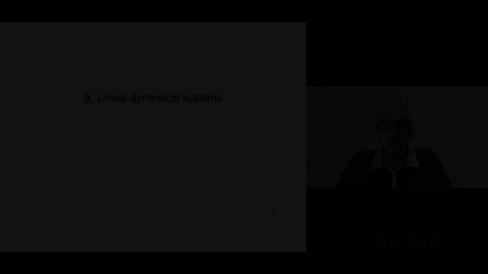
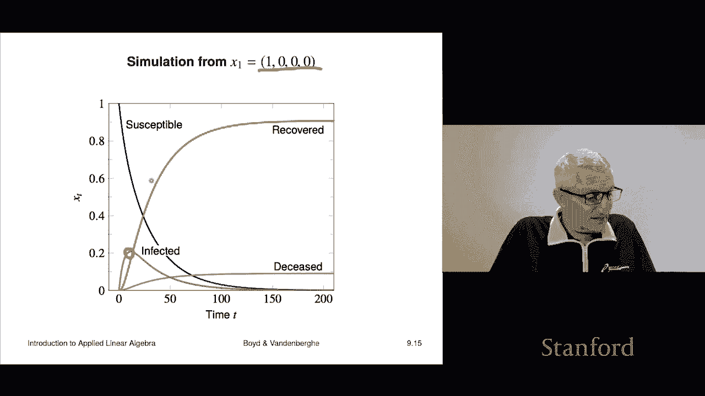

# 【双语字幕+资料下载】斯坦福ENGR108 ｜ 矩阵论与应用线性代数(2020·完整版) - P26：L9- 动态系统 - ShowMeAI - BV17h411W7bk

We'll now look at chapter nine because on linear dynamical systems， it's an application area。

 actually it's used in many， many， many fields， so it's a very good thing to know about and at its essence it really only uses nothing but matrix vector multiplication。

 which is something we know about now。

Okay， so let's take a look。So we'll start with what is a linear dynamical system and then we're going to look at two practical examples now the examples I'm going to show you are going to be a bit simplified of course。

 but it'll give you a rough idea of how real ones actually are done。Okay。

 so let's start with a setting so I have a sequence of n vectors and we're going to call those x1 x2 x3 and so on Now here the index denote something like the time or the period could be you know the maybe something about it could measure time at a fixed interval like daily hourly but it doesn't have to be it could be for example trading days in finance trading days and finance you know doesn't count weekends and market holidays so that would be that's what basically T the subscript T here if you have x subt a T is just a mnemonic supposed to hint at time that's the idea okay and these are n vectors notice the notation is a bit ambiguous right that in this case the subscript doesn't mean the teeth index of the vector X it means x subt。

Which is the teeth。Vectctor in a sequence of vectors。 Okay。

 if you want to talk about the third entry of x7， you write it like this。

 and the interpretation is that is the third component of x7。

 which is the state at time T equals 7 So that's an Xt is going to be called the state X is a traditional symbol for the state。

 but there's lots of others that are used。 And the sequence is called a state trajectory。

 a trajectory just tells you how something evolves across time。

 And so that's what this is that's what this is called It's a state trajectory。

Now just to give you a rough idea of how this works， if t is the current time。

 say it's today or something like that， then Xt we refer to that as the current state it's the state at the time right now x sub t minus1 that's the previous state so for example if this is daily x sub t minus1 is the state yesterday Xt plus one that's the next state so if this were daily xt plus one would be the state tomorrow and Xt what does it represent it can represent many。

 many many things but for example we'll look at it a couple of examples but we'll look at one where it represents the age the age distribution in a population and that means basically the entries tell you how many people there are in some population of a certain age and Xt gives you the age distribution very common what is an economics where Xt the entries of xt give you the economic output in。

Sectors of the economy right so the different entries of x tell you how different sectors did in that period。

And it's very common for mechanical systems to describe this when there the entries of x are typically positions or displacements。

 and also they will typically include also velocities and momentum so but the idea right now is it just a vector sequence。

Okay now linear dynamics is this It's a very special form It says Xt plus1 is A Xt and that simply says that the next state is obtained from the current state by simply multiplying by a matrix okay now those matrices can vary with time that's what this subt is here and a sub T that's an n by n matrix it's usually called the dynamics matrix or the update matrix dynamics is pretty it is very common term to refer to this right and we can interpret now there's a lot of lot of indices flying around here so you have to be very very careful so for example。

 A subij so T is denotes the time or the period Oh another name for time or period is E so I don't know it's an old old name important but okay。

Then IJ are， of course， the entries in the N by N matrix A sub T。

And so the IJ entry tells you how much the Jth input to the matrix vector multiplication affects the I output so for example here if you have Xt that's the state at time T or E T it's the J component then you multiply these two together and you get the contribution to the Ith component of tomorrows or well that's if it's daily。

 but the next state component I that comes from the current state component J okay so that's that's the interpretation this is quite tricky there are a lot of indices here and you really got to be got to sit down and go real slow and try to understand what all these things mean okay now in many。

 many cases a does not depend on time and so it is it is what people would say it's either it's constant or you would say that it is time invariant and then you would refer to this if it looks like。

This Xt plus1 equals to simply axt we say that we would say that this is a linear time invariant dynamical system okay so that's something you'll hear and sometimes you'll hear the phrase LTI for linear time invariant dynamical system Now one thing to say right now is of course many things are not many dynamical systems do not evolve according to this equations but it turns out a lot of them do either pretty pretty well or or at least approximately and one thing to notice immediately is that you can interpret this as a recursion and what that says for example is if I knew the current state I could simply multiply by A get Xt plus1 I multiply that by A plus A plus1 and I get Xt plus2 and so on and so these are just iterated matrix vector multiplications and in fact that's。

called simulating the evolution of the state if you said that anyone would understand what you're talking about so and that's very cool you could do things like say。

 please simulate the system forward 10 time periods right or please please tell me what this mechanical system is going to be doing in the next one second when I've sampled at a rate of let's say 50 times a second right so I would propagate forward 50 times steps to see what configuration it will be and what the state will be so you can actually basically simulate a linear dynamical system。

Now there are a lot of variations a very， very common one looks like this this is the usual update is the A plus that's the contribution to the next state from the current state。

 but then people put on something another term which is BT UT and then even CT that's less common but does happen now here UT is an M vector U is in fact the traditional symbol and it's supposed to be an input so UT is an input to the dynamical system and CT is an offset right so for I'll give you an example is aircraft dynamics is described by this actually with CT equal to zero UT is a vector that tells you about the various things you can do to control the airplane for example what are the angles of the control surfaces like the rudder alerons elevator things like that right so that's what that is or one might be the engine3。

And so it would it would tell you things like if you were to increase your thrust what would happen if you were to turn your rder you know left two degrees like what would happen Okay and that's a that has a model like that in fact that's essentially that's a very common model actually for all of what's called modern control and for that matter navigation that there's entire courses on nothing but。

This linear dynamic system right so at Stanford we have one that's E E263 Okay so B is referred to as the input matrix here U is the input usually in those applications you is something we might have control over and so the natural questions you'd ask would be what would be a good sequence of inputs to apply to my system actually we'll be able to answer all of those questions in a few weeks in this course so we'll be able to get a very good idea hold on that okay。

Another common version is something like this This is the so-called K Markoff model and what it says is that the next state that's Xt plus one is a actually it's a sum of contributions from the current state the previous state。

 the previous previous state and so on and this goes back k steps and in fact sometimes people call that the memory of the system because basically it says that the next state depends not just on the current state that would be a linear basic linear dynamical system but in fact it depends on the current state。

 the previous state and maybe you know going back or something like that So that's that's sometimes called the memory of such a system and this is called K markoff model it's also called in another context like in statistics autoregressive or vector autoregressive so VR model it's got lots of names okay。

So that's an utteraggressive model and when capital K is one。

 that's the memory this corresponds to just a linear dynamical system oh I should stop and tell you just one quick story about what state means so there is a definition of state and what state means is it's a summary of what you need to know about the past。

To be able to predict the future that's what the state is and if we go back here you'll see that that's exactly what this does so for example。

 if I said you know please please show me the next three states like Xt plus one xt plus2 xt plus3。

All you have to know is Xt you don't have to know what Xt minus1 was Xt minus2 it is no one's business how the system got into the state Xt because once you have Xt you multiply by A and you get Xt plus1 then you multiply that by A plus1 and you get Xt plus2 and so on so the point is that Xt really is a bona fide summary of the past。

sufficient to allow you to predict the future right so some people would call it a sufficient statistic or something like that okay。

 and in a K Markov model， the state people would not call XT the state here the state is actually it's the collection you know Xt Xt minus1 down to Xt minus k plus1。

Okay。So what we're going to do now is look at two examples in a little bit of detail now obviously they're going to be simplified。

 but they should give you a pretty good idea of how these things come up。

 how and where these come up， linear dynamical systems so the first one is population dynamics and we'll go over it and figure and by the way once you've seen these models。

 there's lots of variations on them and you'll be able to get all of it。

Let's just jump right in So here it is what we're gonna do is T is going be years so and we don't mean the year 1 ad we mean you know the year relative to some fixed year like this year or 2010 something like that and then Xt is a 100 vector So it's10100 entries10 long and what it is it's going to represent the number of people with a certain age and the ages are going to go01 up to 99 and for simplicity we're simply going to assume that no one lives to be more than 99。

 Of course that's not the case when people build real models like this。

 they actually go up to like 115 just to kind of cover essentially that point everyone okay but just for fun hundreds a clean number we just assume everyone is between 09 and9 years old Okay so X T1 is the number。

Zero year olds， people who are not yet one。And X T， let's say 12 is the number of 11 year olds okay。

 so that's how that's going to work and that's that's in time period T or sorry year T。Okay。

 so for example， if you wanted to get the total population， that's one transpose X T。

 So that's the vector of all ones。 So you know that if you take the inner product of the ones vector and a vector。

 you sum all the entries。 And so this is adding up everyone who。

Is alive right so it's ever it's everyone who has an age between0 and 99 in our model there's no one alive older than 99 Okay。

 but if you wanted other things it's like for example。

This this vector I should say what that is that is concatenation of two vectors are stacking and first we stack 70 zeros on top of then 31s and what that's going to give you is the total it's going sum x71 x 72 x73 all the way up to x00 and that's all the people who are age 70 or older okay so for example。

 if we were to simulate Xt out several years and then ask you know how many people will be older older will be 70 or older in five years from now these are the ways we would do it or how many people would be high school age for example。

 you could construct another vector here that would pick out the people of a certain age range and give you that okay sos this is the idea so now you know what the state is and you know what t is it's years okay。

So this is from the 2010 census in the US and it shows the age distribution of people of different ages and I mean I don't know you can look at there's people who study this and who know a lot about demographics and things like that but that's kind of interesting you can see that there's kind of of a constant number of people up to about age I don't know up to let's just go let's go out to here。

 give them a benefit of doubt， maybe late 50s right then sorry this is yeah。

 by the way some of this is gonna to get kind of more okay so then you can see that this thing drops off and well let's because people are dying okay so so let's see for example。

 by the time let's see let's see by the time you hit 70 you know roughly speaking。

Sadling I guess about you know you get about half the number of people who were who are between roughly 0 and 50 right so that's the age distribution in the US right by the way people who study demography would know what you know this is they'd say oh yes that's that's the baby boom I mean I don't know actually honestly。

 but I mean they would they would they could actually point to various things and say。

 yeah that we know what that is and all that kind of stuff Okay so this is the picture Oh and this is Xt so this is actually specifically if t were if t equals1 means 2010。

 this would be x1， this is the vector we're just plotting it okay。

Now the way the number of people in the US propagate from year to year。

 oh and I should say that we're going to ignore immigration and emig right so we're going to ignore that entirely。

 although one could easily include that that would be an additional term like the UT that we talked about earlier but we're not going to now just to keep it simple so well so you know how does it propagate and we have to ask ourselves the question how what let's see what is the population distribution next year given the population distribution this year and so。

Well， let's see let's figure it out， I mean basically it's going to go like this So how many zero year olds will there be next year Well the answer is。

Basically goes to the people who were born that year because anybody who has already counted last year is going to be at least one on the next is going to be at least one on the next time okay in the next time step so so basically the next year the first you know X T plus one sub one is number many people who are born that year now how many people are age 27 next year。

That's got a pretty simple answer It's the people who were 26 this year sadly minus those who died that year so and yes。

 26 year olds do die it's very sad good news is it's pretty rare but nevertheless some do and so the number of 27 year olds next year would be equal to the number 26 this year and then maybe you'd have to subtract off the people who died the small number of people okay sos that's explained that's going to be by that we're going explain by this so-called the death rate and D that's going to be the portion of those who are age I minus1 who end up dying this year and therefore don't don't make it you know don't count in in the next next year they're not around right and we'll take D100 equals one that kind of means。

It'll least in our simple model once get be 9 once you get to be 99， you'll die period okay okay。

 now the other one is the birth rate and the birth rate。Is a vector in R 100 and what it says。

 it's going to tell us， the birth rate is going to tell us how many people are born。

Two people of that age okay so and there's some pretty obvious things you would know about that and we'll look at both of these things we'll end shortly。

 I should say that in fancy population dynamics models。

 both the birth rate and the death rate also change with time for various reasons social reasons but you know health technology advances and things like that。

 but we're going to just assume they're constant。Okay， so these are birth and death rates in the US。

I think the birth rate I think is given in fivey chunks but whatever here it is and you can see a lot of things yes so guess what。

 not surprisingly there are no children born to zero to 10 year olds or I should say we have one to 10 year olds and there's also basically zero born to people I mean at least visually on the plot doesn't look like you know people people age 50 or 60 don't you know and older are not having kids okay and you can see the big bump here and I guess it peaks in the US between 25 and 30 right so that's what this is right right here and it says that it's about I don't know。

ALi shy of 5%。 So that means if you are， I don't know，27。

And you're in the US then just under 5% of you will have a kid that year， by the way。

 that's not going to include the men， obviously， so if it's about 50，50。

 that's somewhere around 9% right of women will have a baby in the US at age 27 okay。

 now let's look at the death rate。That is this vector D and we're writing in a percentage and what it says is it says that I mean。

 it's not surprising， it says the death rate is very low until you get to be， I don't know， 55。

And then you can see it starts going up and up and up so I'm about right here， by the way。

 just in case anyone's curious so I'm right at the beginning of the hillil。

 okay which is I guess not cool for me or something anyway so so what happens then is you know like by the time you get to 80 or 90 yeah it's for 90 it's about 10% right so maybe even more that's like 87。

 but anyway for 90 yeah it's probably something like 12% of 90 year olds are going to die in the next year so that's the idea so this plot looks kind of like what you'd expect to look it kind of makes sense and over here you see a little tiny thing there that's real and what it is is that some people refer to a death rate that goes down is flatten and goes up again as the bathtub or something like that I mean here it's not very pronounced right but it basically says that there are a lot of infants。

You know very young people who died between zero and two or something like that certainly 50 years ago this was much more pronounced right or 100 years ago it was definitely more pronounced a lot of kids just didn't make it like in the 19th century for example so okay but the point is these pass the test of being reasonable I mean they're correct they're from the sense US census so there they are okay。

Now we're going to construct the dynamics and that means we're going to construct this 100 by 100 matrix that maps the current US population density into next year's population density and the way we're going to do that it's pretty simple is the number of zero yearolds next year is the total birth this year now that's equal to just that's the inner product I take I take the birth rate vector that's B it's 100 vector and I take the inner product of that with Xt right because。

B well let me give a real one B25 is actually the number it's the's it's the number it's the number of kids that a 25 year old is gonna to have now it's small it's 0。

03 or something like that But then I multiplied by the number of 23 year olds or 25 year olds whatever I chose right and then we get the whole holding thing yeah add all that up and you get this。

Okay。😊，No not surprisingly B is zero between like zero and 10 and certainly above 70 or something。

 so it says that zero to 10 year olds and people above 70 are not pulling their weight in terms of having kids right but that's I guess that's biology so okay all right。

So and that gives you Xt plus one sub1 because Xt plus1 is means next year's population distribution。

 sub1 means the number of zero year olds， okay and it's simply equal to be transpose x。Okay。

 now the number of I yearolds next year is going to be the number of I minus one yearolds this year minus those who die right and if the death rate is di。

 it says that x T plus1 I plus one and you really have to like read these very carefully because otherwise you know it's very confusing This says the population distribution at next year。

 subi plus1， that's the number of i yearolds next year， and that's equal to the number。

 the current number of i minus one year olds that would be this thing minus the fraction who die and that's going be minus di so it looks like this and this is true for I equals one up to9 none and so if we assemble all of this into a matrix we get this matrix here。

 which is a is this thing the top row tells you about the birth is the birth is literally the birth rate。

Then the next rows are very interesting each row only has one non zero entry， so for example。

 and by the way that makes sense， let's actually interpret what that means and you can check you can put an Xt here。

Right and this becomes xt plus1， and you can just kind of work out that see that it makes sense。

Let me just say a couple things about this matrix A by the way has a name。

 I mean you don't need to know it， but it's called a companion matrix。

 a matrix that's got a you know a row that's non-zero and then kind of a subdiaagonal that's nonzero doesn't matter oh it's a super sparse matrix I hope you notice that because it's 100 by00 matrix so there's 10。

000 entries in that and total entries in that matrix and yet only 199 are only 199 of them are are non-zero so you know what a matrix has only 199 non zeros out of 10。

000 it's sparse so that's a sparse that's a sparse matrix。Also。

 let's interpret a couple things like each row here mysteriously only has one non zero。

Well what does that mean well， what it means is this。A row tells you， how do you get next year's。

Number people of a certain age right And what this says is there's only one way to make a 28 year old there's the only way to make a 28 year old that's got to be someone who was 27 last year like period that's it。

 So so that also kind of makes sense you can look at columns right so columns are interesting if I look at a column here it's super duper interesting if I look at。

 let's say the the 29th column that corresponds to people who are 28 and the top entry tells me。

How many kids did they have right and then if I go down here I'll find another entry which basically is a number slightly less than one which tells us basically those 28 year olds are going to be 29 next year except for the small fraction who die okay sos that's the picture so there's there's your matrix it's x t plus one is a except D and we're going to assume it's time invariant if you do real demographic studies you do you actually predict that these things are changing over time。

 I should also add in real demographic studies you would do this for subpopulations and kind of estimate them differently or something like that but the is this is a basic population dynamics model and it's a linear dynamical system。

Okay， so here's what we do so we can actually down do a simulation now the this is the simulation and let me explain how I got it we started。

With this， that's the population distribution of the US in the 2010 census right so that we'll just assume that that's correct right Okay。

 so we take that and we then multiply it by this matrix a。

 which is our dynamics matrix that gives us the 2011 distribution。Not by the way。

 not the exact distribution， but sort of our model's prediction of it then I multiply by a again and I multiply I multiplyied by a 10 times and I get this okay so that's the that is our prediction of the 2020 distribution and that's ignoring immigration and immigration okay so。

Okay， so that's interesting， by the way， the current year is 2020 and the census is being carried out right now so we could have a drum role when the census has done and compare this plot to what the US to what the US says it really is honestly it's probably going to be pretty close when we ignore immigration and things like that it won't it won't be exactly right but it'll be pretty close and you see yeah you see interesting stuff here that's it you can look at it and make you know demographers would make a big deal about you know like what is this thing and I don't know what's that when I don't know so they would say but they would have lots of interesting things to say about it so this is the kind of idea now I'll just mention a few things about how you know I mean it's completely clear that this is useful I mean extremely clear right guess for example。

 if you were school district you might ask how many kids are going be in high school10 years from now because if it's gonna be a lot more。

Then currently we may have to float to bond， build another school， something like that。

 so that's the kind of thing you might do， or you might ask yourself how many people will be retired？

In the next 15 years， right because that would be that that could tell you I mean。

 so there's all sorts of stuff you could do with models like this， but this is the basic idea。Okay。

 our next topic is epidemic dynamics that is well it's quite topical because I'm sitting here all alone recording lectures。

 which is frankly ridiculous， but I'm doing it precisely because we have a pandemic raging。

 especially in the United States I should add， so here I am。

so this is actually quite topical I should say that this example was in the book and in the course you know for the last couple of years so this was not present or anything but what I'll do is show you how it's another example of how linear dynamical systems are used to model certain things once again this is what I'm going to show you is a highly simplified epidemic epidemic dynamic model but nevertheless it's one that kind of gets some cool I mean it kind of gives you it would be a good start so let's take a look at that。

We'll look at something super simple， it's called the SIR model and what it does is your state is a vector and it's got four entries and that's it and they are there is it's a number it's a proportion of a population which is susceptible like that so that means if you're susceptible it means that you don't have immunity and well you're not dead okay so in which case you're not susceptible you could be infected right that's another fraction and that means you actively have the disease on in that on that time period you actually have the disease recovered means you had the disease and you're now immune okay so that's kind of again the idea and then finally we have a deceased that's number of people who have the disease and unfortunately died okay so we have and。

This is called。SIR model there's many， many， many other models much more sophisticated and so on so for example if I told you that Xt was that number。

 we would say well in that population 75% of the population is susceptible meaning they could catch the disease 10% actually actively had the disease at the time period T another 10% had the disease and they've recovered and they're now immune and very sadly 5% that's the 。

05 here actually had the disease and are dead got so this is what this vector means okay so okay。

So epidemic dynamics so here's the model a very very elementary model goes like this it says we're going to do daily so on every day it says the following for every among the susceptible population。

 5% actually acquire the disease right and 95% don't they just remain susceptible right so by the way these are the kind of interesting things you could do if people like for example wore masks or something like that or practice social distancing you could push the 5% down to maybe 2% or 1% if you're lucky right that's kind of thing okay but we'll just say it's 5% now among the infected population here's what happens on each day very sadly 1% of them dies so among all the people who are infected on a given day。

 about 1% of them die now 10% however， recover so。That means on the next day you're recovered and you have immunity now we can also have this 4% recover that's good but they recover without immunity right and so that's just and i'm just making this up it's just an example i'm making up。

And that means that they're back to being susceptible and 85% just if you're infected today。

 you'll be infected tomorrow right and you will not transition to any of these other other statuses and let's see if you are immune today your immune your immune you're going be immune tomorrow by the way we could change this to 0。

99 and that 99% that would be very interesting and you could transition from immune to susceptible and that would mean that every day 1% of people who are immune actually become susceptible again。

 okay so I'm just saying we could do that we're not going to we're just going to say once you have immunity is forever。

Okay， oh and of course， if you're dead today you will be dead tomorrow that's part of the model that's actually a pretty realistic assumption。

 I think okay， so now when you assemble this together。

 you basically have to say what is the next state。As a function of this state and you have to write it as a matrix A。

 the not we called a。Can be called anything you like and you're going to multiply it by the current state okay。

 and so here's what you get。So we got this matrix here it's four by fourth。

16 numbers there's a bunch of zeros in it， but let's audit some of it and make sure we understand it。

 So let's see what is this number Well， that number tells you。

It says that this multiplies the first entry， this is today's state。

 and the first entry of that is going to be the people who are susceptible。

And it says that that and it contributes to who is susceptible on the next day and this says that you multiply by 0。

95 the number of people susceptible today and that'll be the number of people susceptible the next time where the contribution from them there's also this one which is super cool the second one are the people who have immunity and this says that oh sorry who have the disease who are infected and 4% of them go back to being susceptible and that's what this component is let's just check another one。

 let's see what does that one mean that's zero let's audit it and make sure we know by the way we're doing here is super important you know don't ever just write stuff down and say oh cool yeah。

 I mean look at the numbers audit take a random entry and see if you and make absolutely certain you can understand it so let's look at this one that says who is going to be this says how many what is what is the number。

Of deceased people as a function of of the current state susceptible now in our model we don't have people going from susceptible to dead actually you could easily that could be you know some very small number and that's people who died not from the disease so this doesn't have to be zero it is zero in our model but it could be some very small number that。

Tells you about people dying you know， by other non disease related deaths， right？Let's see。

 Oh here we go。 What's this one This one says that you look at the number of people today that's gonna or the fraction of people today who are infected and then it says you multiply that 001 and that's the number of you who die over the next day right so this is okay so I'll leave that here And anyway so it's very important and you should probably take some time to actually audit essentially all the entries in there to make sure you understand them。

 But the point is now we have a beautiful linear dynamical system you know I can start I can start for example with everybody susceptible and then just propagated forward and we'll just see we can make predictions about。

How long， how long is it going to last， what's going to be the ultimate effect。

 all sorts of stuff like that。So so here we go we are going to start with a purely10 percent susceptible group of people no one has immunity that's it so everyone is susceptible and I'm simply going to multiply I mean it's very simple the simulation I just run a loop I multiply that vector by this matrix and I get the fraction after one step right by the way that fraction will be the first column because the x1 is if x1 is e1。

 that's what this says here， that's e1 then you multiply by a and you get the first column so after one step we know what it is then I multiply by A again and again and again and let's just take a look at what happens well it's kind of cool so here's what happens's a everyone is susceptible very quickly the infections ramp up Now what's kind of cool is the infections top out at about 20%。

And the population。Right and then they start going down and you might ask why and you'd say。

 well probably for a couple of reasons， one is depressing。

 one is that some people just died and they're no longer susceptible and they're not going to get the disease but the other thing is that among all people who are infected a bunch become recovered and recovered and acquire immunity and that's this green curve so this is when you hear people talking about herd immunity I guess' they're talking about you know some effect like over here or something that's kind of the idea。

