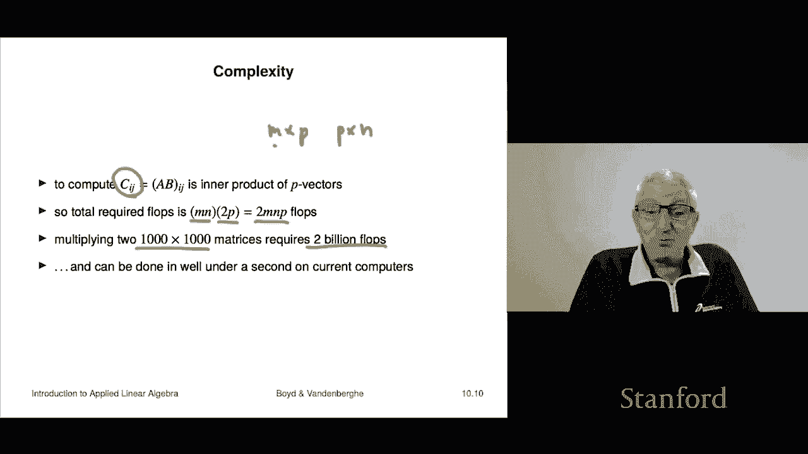

# P27：L10.1- 矩阵乘法 - ShowMeAI - BV17h411W7bk

This is chapter 10 on matrix multiplication so far we've seen well a couple of different kinds of multiplication if you like you can think of the inner product as a multiplication of two vectors we've seen matrix vector multiplication and now we're going to step it up one and look at matrix matrix multiplication you can multiply two matrices we're going to see that has a lot of uses。

ok。So if I have an M by P matrix and a P by n matrix the first one is a and the second one is B and note that the matrix A has a number of columns that's P which is equal to the number of rows of B that is critical okay I can multiply A and B to get another matrix。

 which I'll call C and we're simply going to write it as A B。

 so we're heavily overloading multiplication notation the ordinary ordinary multiplication notation is by simply you put two things together right so next to each other so if I say something like you know just put them together we do that with matrix vector multiplication but here it's matrix matrix okay man。

Here to say what C is， I have to tell you what its entries are and so it IJ entry is a sum of products of entries of a and entries of B and here's what they are I sum over AIK that's walking across the Ih row of A and I'm multiply those by BKJ now here J is fixed and so K is changing in my sum and I'm walking down the J column of B。

🤧And I can write it out that way if you don't like the sum notation Okay and so very roughly speaking。

 here's how you get the Ij entry of the product matrix you move along the if row of a and you move down the J column of B and you roughly speaking take the inner product or the you know basically you take the sum of the products of the corresponding numbers Okay so let's do an example and by the way。

 you may have seen this in a previous course as well so I just want to make sure everyone's on the same page Okay。

 so for example， here is a two by three matrix and here is a three by two matrix and the thing we have to check is that the intermediary dimension。

Is the same， So the number of columns of the first matrix。

Is equal to the number of rows of the second and indeed it is three is equal to three and the result is actually two by two okay。

 so before you ever multipied two matrices， you must do perform this syntax check just to make sure if it's a valid product okay。

 so this is valid。Wouldn't be an example on the slides if it weren't， but okay all right。

 then let's actually figure out how to do this。 Well。

 the first entry that's gonna be C11 and that's obtained by going across the first column here and down the first sorry across the first row here and down the first column here and indeed it's minus1。

5 plus3 times 0 which is0 plus2 and you should get this so that should be your number it's right so okay allright。

 let let's audit another entry。 How about let's try this one Okay so to get the22 entry of C we would go along the second row of a and down the second column and let's just check it get one times minus1 Okay that's minus1 plus minus1 times minus2 is2 So we're up to1 and then 0 times  zero So we're one and it's correct Okay so by the way。

 at this point。Qualplication this is like the rules of chess it should have no interest there's there's no reason you should have any interest in this yet so you have to take me on my word that this is actually going to be super useful and super important but for the moment it's just these are just the rules this is how you do it okay。

So there are we've already seen various types of multiplication and they're all actually special cases of matrix multiplication So here's one we saw the scalar vector product and we would write it as alpha X where alpha is a scalar and x is a vector now it turns out that's not a special case of matrix multiplication has got the wrong the sizes are wrong alpha is like one by one and let's say x is n by one right so you could see the intermediary dimensions don't line up so in fact。

 however， if you do scalar multiplication with a scalar on the right。

 it actually works and it's exactly the same now for some I guess this is just the quirks of mathematical notation people don't write a vector with a scalar on the right although I think what this shows you is they should but nevertheless they I mean if someone does。

no one would think I mean they would think it's weird。

 but they would fully understand what you're saying you could even explain this and then they go oh cool that's even。

Good for you okay so so just mathematical notation convention is we don't write a scalar rec multi usually with a scalar on the right almost always it's in the front and that's just that's a tradition that goes back probably a couple hundred years by now so that's how we do it all right。

Inner product is actually now。It's a perfect example of this right so this says you have two n vectors A and B。

 and it says you form the transpose and so a a is n by one a transpose is1 by n。B is n by one。

 Sure enough， the intermediary dimensions are the same， and so you can multiply them。

 and the result' is gonna to be a one by one by one matrix。

 which we interpret as a scalar okay or a number and it is exactly the inner product matrix vector multiplication。

 That's one。 So here a is M by n let's say and x is n by one and sure enough。

 you can multiply them you can think of x as a sorry as a matrix and then perform matrix vector matrix matrix multiplication and it's the same as matrix vector multiplication okay。

A we can now tell you about something called the outer product of two vectors。 so two vectors。

 by the way， of any of any size， it doesn't because it always works。

 So if I have an M vector A and an n vector B I can form a B transpoposedse now to。

Figure out what this means A is an M vector， so it is M by1 and B is n by1 B transpose is1 by n。

And sure enough， the intermediary dimension is one。And when when you work out what it is。

 it creates a matrix which is M by n and the entries are all products of all possible entries of a with B Okay。

 so that's called the outer product you've seen the inner product and you can see it's they're very close in terms of this notation right one is a transpose B that gives you a scalar and A B transpose that gives you a matrix it's called the outer product Well we'll encounter that a couple of times prompt。

Okay now matrix multiification is a bunch of properties that hold I'm actually not going to show them I mean somebody has to or should you could trust me that's an option I suppose at this point or you can audit one or two of these yourself so but I'll go over them and say kind of what they mean it's super important that you stay on your toes with this notation to make sure everything here works so here I have three matrices oh and the im。

 the assumption generally is this is that when I write down products of matrices like AB the assumption is that that's a valid product right and oh so some people would say that they are compatible or something like that or it just means the intermediary dimension is is correct right so when I'm writing down here whenever you see things like that the assumption is that that everything is correct right if I then later tell you a has this dimension。

B has its C has then you raise a big alarm and you go， hey。

 you can't multiply A B makes no sense or something like that so okay。

This has multiply the two matrices A and B first and then multipied by C on the right。

Then it turns out that's the same as if I multipied the matrices B and C and then multiplied by a on the left。

And so what that means is we can write both as the triple product ABC right because what it says is that when you write down the product of three matrices。

 it doesn't matter whether you multiply A and B first and then C or B and C first and then A so that's an important thing okay it distributes so A matrix times B plus C is equal to A B plus A now you have to be super duper on your toes here in this equation first of all。

 it must be that that B and C have the same size otherwise you can you have no right to add them dont have the right it just means nothing if they are not the same size so presumably in this line B and C have the same size and this is the plus that's the addition of matrices so it says add the matrices B and C multipied by A on the left over here it's different this says multiply first A by B。

hen a by C and then add them so this is also matrix addition。

 but it it's possibly a different size matrix right so okay。Here's one。

A B quantity transpose is is B transpose A transpose。 So roughly speaking。

 the product transpose is the。The product in reverse order of the matrices themselves transposed。

And honestly it's easier just to look at the equation okay so it like it looks like this right very important rule so and you might not think that right because for example aesthetically。

You might say yeah， I don't know this looks reasonable right it looks reasonable It is very and deeply wrong for many reasons。

 I mean first of all， it's just false， but the other thing is it's a lot of times doesn't make any sense right that depending on the dimensions of A and B A transpose and B transpose always make sense but you can't multiply them necessarily So this is just wrong Okay here's one a times the identity is a if I multiply on the right by an identity matrix。

 I get a if I multiply on the left by an identity matrix I get a and by the way。

 these two eyes are of different sizes if a is M by N this I is N by n that identity matrix and this I is M by M so here you just get things from you get the dimensions which are ambiguous because I didn't say what size I is in the two equations you get it from the syntax of the equations okay。

有。Here's something super， duper important， it's very important。The planet A B。

Is not necessarily equal to product B actually it's worse than that even if you can multiply A B。

 theres no reason to believe that you can multiply B it may be incompatible Okay but even when it does make sense it's even when A B and B are both valid products they are not they need not be equal to each other now。

 of course in some cases they are argument example you know A times I equals I times a and a has let's make a yeah。

 but just leave it this way A is squared in this case right so the two I are the same matrix at the same size。

That's true， by the way， when two matrices， when you multiply them together and you get the same result。

 they have to be square if you get the same result。No matter which order you multiply them in。

 that's called commutative， they commute， it means you can kind of put them in you can multiply them in either order。

 okay， but in general that doesn't hold， that's a very important fact。Okay。

 now block matrices will work with matrix multiplication， so for example， here， first of all。

 this would simply be the formula for if ABC， D， E FGH were numbers。

 this would be a two by two matrix two by two matrix and that's a two by two matrix and this is indeed the correct formula for what happens when you multiply two two by two matrices。

However， what cool here is that here these could be blocks so that's a block two by two matrix that these are block matrices so ABC and D can themselves be matrices as can EFG and H now for all of this to make sense。

Everything has to， you know any matrix I write down here when I'm multiplying has to have the right I mean things have to have the right dimensions or otherwise this is all well it's meaningless right but if these are valid products then this this identity holds so it says that we can do matrix multiplication by blocks which is actually kind of cool one very important thing and that goes back to this fact。

Is you when you're messing with matrices and run down equations。

You have to be very careful with the order of them so A B is not B A so don't do don't do anything that depends on A B。

 B B A， which you're used to because that's true for numbers the product of two and3 is the product of three and 2 but the product of two matrices in reverse order when it makes sense need not be the same as the other one。

 So just be super careful about keeping the order right So for example。

 in this formula up here if A B C D， E FGH were numbers I could remove that and write E。

It would be true， it would still be correct because。

EA and AE are the same provided that they're scrs right if however theirre matrices。

 they're not the same and then this what I've written down here is just wrong Okay so you just have to be very careful its order matters。

Okay， now we'll give a couple of interpretations and we'll be using all of these basically throughout this SQL the rest of the course。

 so if you denote。Let's first write out B in the product A B as a columns Okay。

 so it's B1 B2 up to B N right so and remember that B is going to be P by N and A is going to be M by P。

 this is A and this is B Okay so it's going to look like that and if I work out what A B is actually I can do this by block matrix multiplication So I simply write B as a block matrix where the blocks are the columns。

And then I just multiply out as if these were numbers or whatever and I get being very careful with the order and I get A B1 and then A B2 and each of these is a column and so now what you can see is one interpretation of a matrix A times a matrix B is it is simply it works column by column it just says take the matrix B multiply every column of B by a and then rearrange them into a matrix so you could think of it as some people think of aB as a batch multiply of a times all the columns of B so that's one way people think of it。

As an example， we can represent multiple sets of linear equations with a very compact notation。

 so remember that a system of linear equations looks like Ax equals B。

 that's a system of linear equations。If this is if there's if a is M by n this is M equations in the n variables。

 which is x B has size M here have dimension n M okay。

 but now suppose we have multiple linear equations， but with the same coefficient matrix A。

 but with different righthand sides B I well we can write that in super compact notation this way。

 and now I have basically a system of linear equations。

X is a matrix and it literally means that its columns are different are the different x's and b's of a different B so so that's by the way。

 this is going to be important later in the course but this is kind of the idea so it's super compact notation if you write stuff out this way。

Okay， another very useful interpretation for us is going to be the inner product interpretation。

 So as you know， to calculate an entry of the product， you go along the row of a if it's a times B。

 you go along a certain row of a and down a certain column of B。

 very roughly speaking you're taking the inner product of a row of a and a column of B。 Well。

 we can write it out this way。 we can say that A B is the following matrix is it's the first row of a times I should say the first column of B that's a1 transpose times B1 and so on。

 And so what it is is you could think of this as a matrix product gives you all the inner products of the rows of a。

 and the columns of B and then arranged into a matrix。

 So that's a perfectly good way to think about matrix multiplications。

 It's useful actually all these different ways。 They're not very hard to work out they're all related and they're all useful in different settings。

So here's a matrix that's going to come up pretty often in the sequel， it's called the Gm matrix。

 that's the gram is the name of a mathematician from the 19th century。

 so let's let a be an M by N matrix and its columns are A1 through AN and each of those is an M vector。

Okay， well， the gra matrix is simply this boy。 it's a very compact notation。

 It's G equals a transpose A。 A transpose A。 That's something you're going to be seeing a lot of。

 to be honest。 So get used to it。 but it's got a beautiful interpretation。

 So the entries of a transpose A are exactly the following。 They are。

 The first entry is a1 transpose a1。 but you know what that is。

 That's actually the norm squared of a1。😊，Okay， so the one two entry is the inner product of the first and second column。

Okay by the way， the two1 entry is the product of it's the inner product of the second column of the first。

 but you know that inner product does commute so these are the same number and what that says is the matrix G is a symmetric matrix right which means that if you transpose it。

 you get back the same matrix。It means that it's IJ entry and its J I entry are the same Okay so anyway this is the gram matrix it says super useful we can also use super fancy we can use matrix。

Mattrix arguments to show。The G is symmetric。 So if I say that if I want to know what is G transpose。

 well， that's a transpose a transpose， Okay， but that's the product of two matrices and then transpoposed。

 But we know what that is。 That's simply the transpose of the second matrix and then times the transpose of the first matrix。

 So this is equal to a transpose times a transpose transpose。

But wait a minute a transpose transpose is a if I transpose a matrix twice I get back the matrix。

 so this is actually a transpose a hey， but that's G and this string of equality says that G transpose is G that means G is symmetric okay so here's something you can do with the gram matrix that it gives you a very compact way to describe a concept that we already have it's a transpose a equals I。

Super interesting， It means that if you look at this， if you look at this matrix here。

 it's ones on the diagonal and zero off。 Let's see what that means。 Well。

 if a transpo if a1 transpose a1 is1， that means the length of the norm of a1 is1 same for a2。

 And so what it says is the diagonal of the gram matrix is equal to they're all ones。

Provided all of the columns of a have the same norm， which is one。 Okay， so that's normalized。

 but now let's look at off diagon entry。 If， if this is I， it means the off diagon entries are0。

 So that says that a1 transpose a2 is0。 That means that a1 and A2 are orthogonal。

 but so are a1 and A3 and a1 and A4 and so on。 And so basically the super compact equation。

 a transpose a equals I。Is a way to say that the columns of a are orthoormal。

 they each have norm one and different columns are orthogonal。

 they have an inner product of zero Okay， so this is the gram matrix。

Let say a little bit about the complexity of multiplying two matrices actually this is a super interesting topic。

 I might say a little bit about it in a minute， but so the basic way is here is a is M by P and then B is P by N okay so now to get an entry and every entry of C。

Is basically an inner product so and what I'm going to do is you know that the number of flops to calculate a p long inner product is actually 2 p minus1。

 but we skip the minus1 and no one pays any attention it's just2 p and so C you have to get all the entries of C C is going to end up being M by N So I have to do for all the entries I have to calculate inner product and I get two m and p flops So basically the total number of flops required to multiply two matrices。

Is the product of their dimensions well the intermediary dimensions which have to match on the two matrices have to be the same and so it's the product of the three numbers that's it so for example。

 if I were to multiply 2000 by00 matrices that requires two billion fluxps right so。By the way。

 that this is a lot， right， I mean these are big， I mean if you think about it， these are very big。

 like if someone says what's a00 by a0 matrix， you'd say， oh。

 it's a rectangular array of 1 million numbers。It's a lot at least to a person it's a whole lot right and then you multiply the two together and you say that would require two billion floating point operations so if you had to do this by hand or with a you know or with a slide rule or an abacus it's going to take you a long time。

So on my laptop， which is way old now， I can do this in about 01 seconds。That's。

Crazy what I just said and actually it's a very important， you know。

 all the math we're doing was just as true and just as interesting in 1830 or 1880 or something like that or 1950。

This is what you didn't have in 1950 was the ability to actually do these do the calculations that we're talking about in this course at truly stunning speeds I mean。

 so this is just stunning so I guarantee on your homework you will one of your homework problems will be to multiply 2000 by000 matrices and then have a moment of quiet to sit there and appreciate how like awesome that is that the little processor in your laptop or whatever you're doing this on for that minute。

 you get it is on a phone but the point is to sit there and have a moment of silence to just recognize how awesome it is that two billion floating point operations were' just carried out for you in about a tenth0 of a second。

