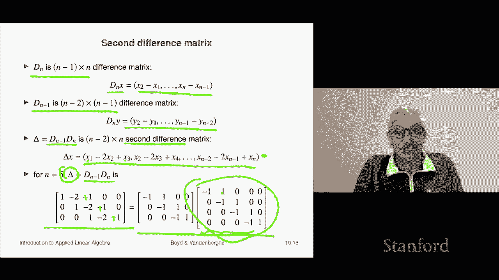

# P28：L10.2- 矩阵乘法示例 - ShowMeAI - BV17h411W7bk

We're now going to talk about composition of linear functions。

 we'll see that that gives yet another interpretation of matrix multiplication。

So let's suppose A is an M by P matrix and B is P by n， so these are two matrices。

 of course I can multiply， I can form the product C equals A B。

So let's define a function F and it's going to map RPp to RM and that means that F takes in a P vector and returns an M vector G is going to be a function that takes in an n vector and then spits out a P vector and these are going to be defined by well matrix multi by A and B respectively so F takes an argument U which is a P vector and it。

What it gives as a result is A U， the matrix A G takes in a vector V。

 which is an n vector and what it gives back is B times speed the matrix vector product。

 these are linear functions right because they're given by matrix vector multiplication。

Now the composition of the two functions， oh some people call it chain is another one。

 but composition is a standard mathematical term， that's a function that says basically take the output of G and plug it into the input of F。

So that's informally。 Now what that means is this。 This says we're going to define H。 And so H。

 let's see G maps n vectors n vectors to p vectors， then F maps P vectors to M vectors。

 And so we we can do G first then F and that would map something an n vector to an M vector。

 and so the way we write that is says as we say H of H here is the composition of f and G。

 And it says H of x is f of g of x。 now you really have to sit here and parse this very carefully to to make absolute certain that the syntax makes sense and everything like that。

 So here X is an n vector G of X is a I'm going slow to make sure I get it right is a P vector。

 then we look at F and computer science， you'd say we check the signature of F。 but this is math。

 not computer science。 So we check we check what F takes as an input。 F takes as an input。

Indeed a P vector。 So we're cool And then F of G of x is indeed an M vector。 Okay， so by the way。

 another notation for this is H equals F and a little circle G。 So that's another。That's a circle。

 That's not the letter O。 It's a it's a little circle。 So F composed with G。

 Okay now let's figure out what this composition function is。 Well。

 H of x is F of G of X and thats so F to take F of anything you simply multiply by the matrix A So we put a there G of x is indeed B X。

 So it's a brand time B X。 but as you know， is this is like a matrix triple product if we think of x is a matrix and it is associative and that means that I can multiply a and B together。

 and so what we see is so what we've shown here is very cool。

 It says that if you compose two linear functions， the result is linear and not only that the associate matrix is the product of the matrices associated with each of the functions。

 So that's another interpretation。Oh one one thing I should note here is very is a bit I should note this and I'll say it so it basically it says matrix multi is composition of linear functions there is one a weird thing here and I thought I'd mentioned it and that is that when you see the product AB。

Like that what you have to you know， bear in mind is that be。Is first， Okay。

 doesn't it looks like it's second when you write A， B looks like B， but B is first。

 And the reason is that thing multiplies a vector。 And the first thing to touch the vector。

 roughly speaking is B。 So B comes first。 So it just means that it's a little bit backwards and you get used to it and then everything is fine。

Okay。So let's look at an example and an example is we're we're going to start from an example we saw a few lectures ago。

 a few chapters ago， which was on the difference matrix。

 So now remember that Dn is this n minus1 by n difference matrix and here it is what it does is it produces when you multiply this matrix by a vector what you get is the vector of first difference So it's the second minus the first entry。

 the third minus the second all the way up to the last minus the penult entry so's that's called the difference matrix and you may remember what it looks like and looks you know like this it's got each row has a minus1 and a1 which by now you should kind of get makes sense right So if you take this matrix here and multiply in your mind by an x you will see that the first entry of the matrix vector product is indeed x2 minus x1 that's what this tells you the one and the 1 okay so。

Well， we also have D sub n minus1， and that is the difference matrix， but it's a different size。

 it's n minus2 by n minus1 and what it does is it simply takes the it's also the differences。

 but it's one dimension smaller。Now I can actually multiply these two matrices because let's see I can have Dn minus1 times dn and that's an n minus2 by n。

 that's a socalled second difference matrix right and what it does is it simply take it forms the differences of the vector that's the DN X。

It takes the differences and then it forms the differences of the differences and when you do that。

 you end up with something that looks like that。 And this maybe looks familiar to you or maybe not the second difference is actually something like the first plus the third entry minus twice the second entry right so these are the entries of this if you take the so-called second difference by the way。

 it's also something like if you like you could think of this as a second derivative， I mean。

 of course， these are sequences they' are not continuous functions but they and they're even finite sequences list of numbers。

 but the words if you want to， you could think of it as you know a you could certainly think of this as a second derivative okay so we'll call delta。

 this matrix dn minus1 dn and let's do this for n equals5 so。So here it is。

 here is the four by five difference matrix and what it does it takes a five vector and it spits back the four differences。

 the differences being the second minus the first， you know， third minus the second。

 fourth minus the third and fifth minus the fourth right so that' what that's what this one does。

Then you take those you started with you started with a five vector。

 now you got four differences and now you difference those and you're going to end up with a three vector。

 which is， you know， the， well， it's the。Second difference when it's the first difference and so on and what you do is you will simply multiply these two matrices one is they're the two different sized difference matrices and you get this matrix here and you see that sure enough it's this thing it's exactly the same thing so it's very cool it just shows you that you can compose two things and it all kind of makes sense I think let's see I think it makes sense。

Okay， actually， I think it's wrong because I think these should all be pluses， but。Anyway。

 aside from having a typo in the slides， it kind of makes sense。

