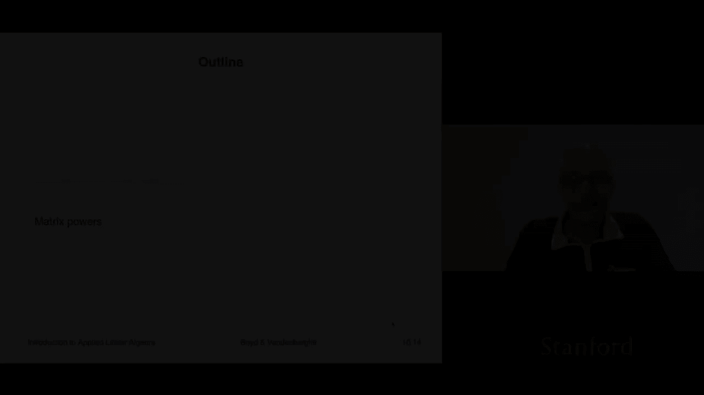
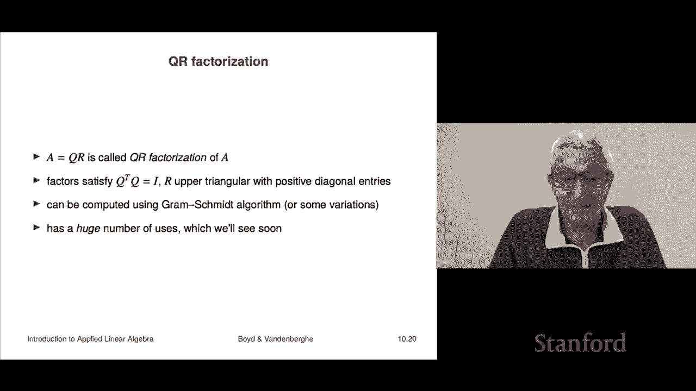

# 【双语字幕+资料下载】斯坦福ENGR108 ｜ 矩阵论与应用线性代数(2020·完整版) - P29：L10.3- 矩阵次方与分解 - ShowMeAI - BV17h411W7bk

Well now we have the idea of multiplying matrices， we'll see now that a matrix is square you can multiply it by itself and that's going to give you the square matrix and you can multiply it by itself again and you're going to get the cube of a matrix so basically you're going to have the idea of matrix powers let's take a look at that now。

So of course it only makes sense if a is square so otherwise you can't multiply you know a by itself or something like that。

 So if a is squared， then a squared simply means aa and the same for higher power so for example。

 a cubed is a times a times a and as we know it doesn't matter which order you multiply it in so's that would be and we're going to denote it as a cubed notice here that we're doing some some overloading of notation again because if someone walks up to on the street and says。

A cute。N a is a number then you know what it is it's the cube but the number you multiply the number by itself you know three times right but here we're doing the same thing except a as a matrix so but it again makes perfect sense so that these are the matrix powers。

Now again， it's going to be useful to in interest of the notation to define a to the zero as the identity now notice that that's like for a number raised to the zero power。

 you get one and I is something like，I is something like the matrix analog of the number one well。

 in fact， of course， when I is one by one， it is the number one okay and if you do that then you get this very nice thing that you know that's an identity that you know holds for numbers right that if if I multiply the k power number times the e power remember I get the K plus e power of the number。

 but the same is true for matrices as well a square mates if I take a square matrix I take it the K power I multiply it by the same matrix to the e power I'm going get the same the original matrix to the K+ L power okay now later in in this book and course we're going to see negative powers for example we're going to see you know a inverse but it's just going to be well the inverse of the matrix that's actually one of our next topics。

In more advanced courses you will see weird things like the square root of a matrix like you know a to the one half right and you'll see all sorts of other crazy stuff like that we're not going to be talking about fractional powers in this course。

 although they do come up in some applications but we will be talking about inverses that's later for now we're just talking about positive powers or the zeroth power which by convention is the identity of a matrix。

So okay， and why don't we just do a quick example， Let's just start with like you know one minus1，2。

0， that's a。 and so a squared in that case， let's work out a squared well that's going be one minus120 times1 minus120 you just simply multiply the two together and when I multiply that out。

 the first one gives me one minus2 that's minus11 times minus10 is minus1 this times that is two times 1 plus that's going to be two and this is going be minus2 okay so the square of this matrix is that matrix there。

Okay， so just so we can see what it looks like。Okay。

So a lot of cool applications of it we're going to look at one that involves directed graphs so actually you remember that several lectures ago we looked at directed graphs and we looked at nodes and edges there's another way to describe a directed graph which does not explicitly enumerate the edges so there's a directed graph right here actually they're closely related if you look in the book you'll see how the description when we enumerate and label the edges can be converted to this one so that was the incidence matrix this is the adjacency matrix and it's n by M so here I have five nodes in my graph and we simply define the adjacency matrix of a graph this way AIj is one if there is an edge from vertex J to vertex I notice it kind of goes backwards right because AIJ you'd think it might be from I to j but effect is from J to I。

I should also admit to you that there are people who use the opposite convention so that the adjacency matrix is AIJ equals1 means that there's an edge from1 to from I to J。

 but for us it's J to I。Okay， and of course， the two are just related by transpoing。 Okay。

 so here's an example。 here's a matrix。 and now let's take a look at let's audit a few things like。

 whoa， we can do all sorts of cool things。 Here's an here this edge goes from three to2。

So that means that a2，3 should have a one in it。 And sure enough， it does。 Let's go the other way。

 Let's find this。 That says that a。5，4 is  one。 And that means there should be an edge going from node 4 to node 5。

 Let's see if that's true。 It is indeed。 And that's the very edge it is。

 And let's just audit one more just to make sure everything's cool here。 Let's audit this0 here。

 That says that a 4，2 equals 0。 And that tells us there is not an edge going from node 2 to node 4。

 And that is indeed the case。 There is no edge going from here to here。 Okay， so that's the idea。

 That's that's the。This is called the adjacency matrix of a graph， it's also by the way。

 a absolutely standard mathematical concept and kind of universal。Okay。

 now let's look at the square of the adjacency matrix， it's super interesting。

 it is this the Ij entry of the square of an well of any matrix is this it's the sum from k equals 1 to n AIK AKj but let's figure out what that means。

 well it says we sum over all nodes。And we take the product of AKj and AIK。

 but but these AKj and AIJs， AIK and AKj， they're either0 or one。 Okay。

 so basically usually this product is0 because one of them is0 or both of them are0 okay， however。

 there is a way when you get one you get a one if aKj is one and AIK is one but that has a specific meaning if AKj is one。

 it says there's an edge from J to K。 and AIK is one。

 that only that means there is an edge from K to I and so basically you get a1。

 whenever there is and there's an edge。From J to K and also from K to I。 Now， by the way。

 two edges that where one goes from one node to another and then another one starts from that node and goes to the other one。

 That's called a path of length to。 Okay， so， for example， in this graph， you know。

Let me get you a path of length two here's one you go from here to here and then you go from here to here。

 so from there's a path from node5 to node two of length two and you go along this edge and then that edge notice that the path has to go in the direction of the arrow this is a so-cal directed graph。

Okay， so what this says， what our analysis up here says is actually kind of amazing。

 it says that when you square the adjacency matrix。

The numbers in that the numbers in the entries tell you how many paths there are that go of that length of length2 that goes from J to I In fact。

 that's a beautiful interpretation of an adjacency matrix an adjacency matrix tells you how many paths there are of length one that just a path of length one iss just a path and they're either zero or there's one0 if there's not an edge one if there is so this is consistent。

 but the square is already kind of interesting。And so for example。

 I will spare you into details and not to mention I would almost certainly get it wrong。

 but if you squared this matrix here， you would get assuming there's no typo here。

 but maybe there's not you would get this matrix here super interesting and it's got zeros。

 ones and twos you know that makes sense because if we talk about the numbers of paths of length2。

 sometimes there's there's not a path of length2 and that means there's a zero here but we get audit a couple of these I don't know。

 let's go from node4 to3 and that's going to be the a34 that is right here and it's says2 so apparently there are two paths of length2 that go from node 4 to node 3 so let's see if this is true now's the drum rule and go we're going to go paths of length two from four to three。

so we're going to go from four to three and this here are the two paths of length two one is you go from four to three and then you go on this。

 oh， I should say that's called a self loop， it's kind of cool。

 you can have a loop that goes from yourself from yourself actually to yourself that's called a self loop。

Okay， so that's a path of length too。Here's another path of length two that goes from four to three first you go to five that's your intermediary node and then you go on to three so it's cool and there are no others that's what this is telling you okay so that's what this tells you you and so more generally if I take the elf power of a matrix which is the adjacency matrix。

Then it's fully interpretable as the IJ entry is the number of paths of length L from J to I。

 so that's what this is。there is a small typo there， oops， okay。嗯。Good。

 our last topic is to show that we can use this powerful matrix notation to super compactly describe the QR factorization。

 not the algorithm but the result sorry Graham Schchmidt。

 and it basically turns out that Gham Schmidt can be interpreted as a matrix factorization and the truth is that most people think of it that way I everyone has heard of the Graham Schchmidt you know algorithm but mostly people think of it as a factor as a matrix factorization which is called the QR factorization。

Let's see how that goes Well so what I'll do is I'll take a matrix a it's going to have it's going to have k columns a1 through aK and they're n vectors I'm matching the notation from Graham Schchmidt okay so a A has to mention n by K。

Now if the columns are linearly independent and I run Grham Schchmidt。

 then I get some orthoormal vectors， so those are Q1 through QK okay。

And I'll define an n by K matrix Q， and it's going have these columns。

 right Now we can very compactly say that the columns of Q are orthoormal。 That's this equation。

 It says that the gram matrix of the Qs is the identity and on the diagonal。

 it says that the cus have norm one on the off diagonals。

 It says that the cus are mutually orthogonal。 So this you will you will henceforth when you see the equation matrix transpose times matrix equals I。

 you will know basically what it's saying is the columns of that matrix are orthoormal Okay Now from the gram Schchmidt algorithm。

 It says that AI is equal to this， that's a linear combination of Q1。Up to QI， okay？Oh， by the way。

 where the coefficient of Qi is actually positive because Qy til is positive sorry Q til is non zero and the norm of Qy tilde is positive and so we're going to simply call those you know r1 I up to RII now notice that AI is a linear combination you don't need more you don't need Qi plus2 Qi plus1 these things its not not and so what that tells you is that r is upper triangular the matrix R because we'll take it to be zero for all the other entries and then what happens is is this you can write this equation out as this factorization it says that you know A here's a equals a Q here's Q times R right and not only that r is itself R is upper triangular so it's only got entry。

Here and on the diagonal it's got positive entries so that's that's the picture by the way。

 this drawing i'm doing here is actually a useful thing to do it kind of shows you the dimensions and allows you to keep them in mind and things like that。

Okay， so summary on this is that the when you carry out Gham Schchmidt on a sequence of vectors。

 and if you think of those vectors as being the columns of a matrix。

 that's the same as factorizing that matrix into a product Q andR。

Q has columns that are orthoormal and R is upper triangular with positive entries on the diagonal and so actually people refer to you know QR factorization Graham Schchmidt interchangeably they're not quite the same Gham Schchmidt is if you like Gham Schchmidt as an algorithm for computing the so-called QR factorization but this is how a lot of people would talk about it Also I guess if you look in numerical packages for linear algebra。

You probably wouldn't hear anything about Graham Schmidt， however， you would。

 for every single such package will have a QR factorization。

 which of course is nothing but Graham Schchmidt。Express in matrixtri notation。Okay。

 so this is the Q so called QR factorization of A and it。

Right now you can't see there's no reason for you to have any interest at all in it right now。

 in fact， Graham Schchmidt， I think is a bit mysterious Graham Schmidt。

 the only use Graham Schchmidt has at this point in the book。

 it's only one is it's a way to computationally determine if a set of vectors is linearly independent now to which I am I am fully admitting the following there is no reason you should care about that at this point。

Because like I don't know， but what does it mean for vectors to be linearly independent does mean the bridge doesn't fall down I don't know。

 we'll see later that it's going to have a lot of important things but for right now I'm just admitting it has no very soon you'll see that this is actually going to be it's going to have a lot of practical implications。

 I'm just admitting that we haven't seen them yet。

