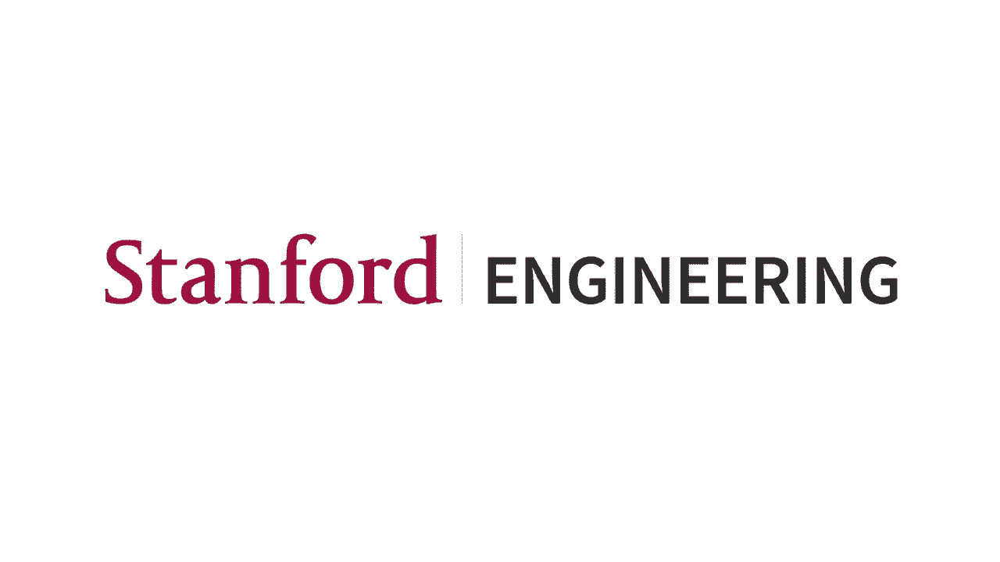
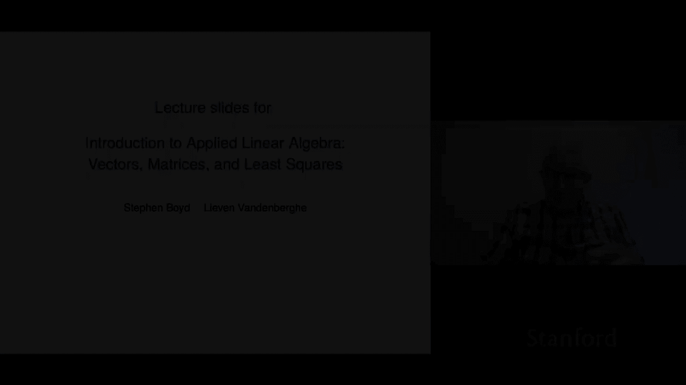
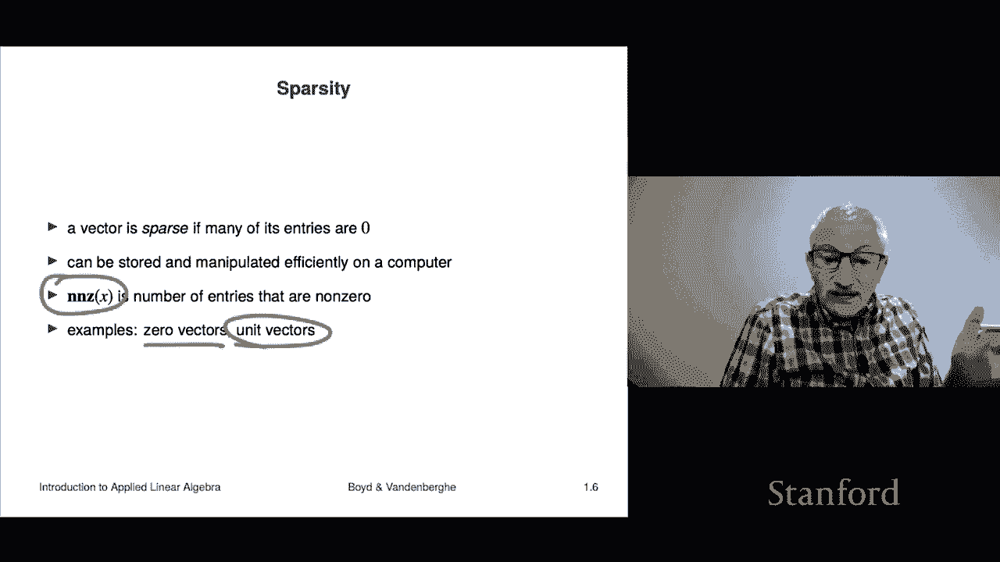
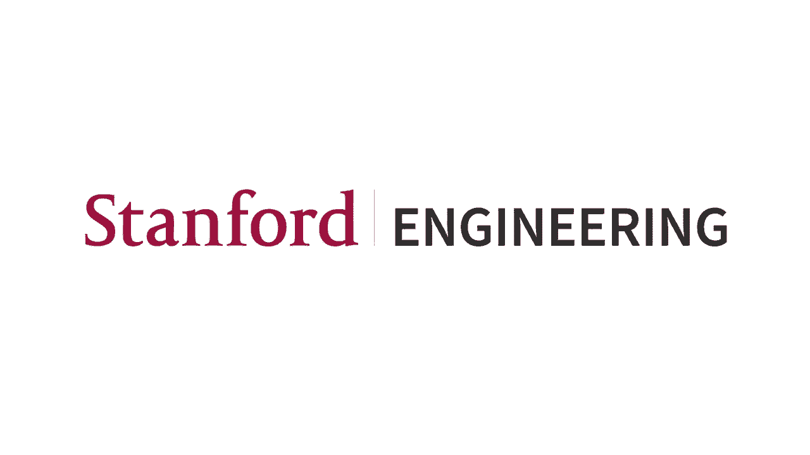

# 【双语字幕+资料下载】斯坦福ENGR108 ｜ 矩阵论与应用线性代数(2020·完整版) - P2：L1.2- 向量标记与符号 - ShowMeAI - BV17h411W7bk

我们要开始，呃，这些是，这是第一堂课，呃，与…，嗯，应用线性代数向量导论一书，矩阵与最小二乘，我们现在就跳进去，在最开始的时候，也就是向量，所以我们先来谈谈，呃，符号，所以我们将讨论符号，那我们就继续。

我会讲一些例子，然后呃，我们将讨论一点关于添加，呃，对向量的第一组运算，但首先我们要谈谈向量本身，这只是一个有序的数字列表，嗯，所以，它通常是写的，我们将在课程的书中使用，嗯，两个符号。

所以你可以垂直写，就像一个堆叠在一起的数字数组，嗯或者你可以这样写，嗯，这些都是合理的统一，这些都是合理的标准，呃符号，嗯那么嗯，在这里你可以看到传统的，也就是我们，呃，这些是。

这就是我们将其表示为堆叠的地方，我们稍后会看到这些叫做列向量，但那是另一回事，嗯，这些是，这是一个矢量，嗯，我们有，我应该提到，是的是的，呃，有一点，这里不是随便的，对那个对，我们在这里用逗号。

我们不使用，呃，我们不用分号之类的，堆叠的一栏里没有符号，好了，这就是矢量，所以说，这是一个这是一个向量，呃这里，还有三种不同的写法，好的，现在向量中的数字，在这些名单里，嗯，那些叫做呃，进入。

它们被称为元素，所以向量的元素，参赛作品，系数或成分，所以这些是，这些是用来描述，所有这些都被广泛用于描述，描述条目，如此如此，比如说，你会说这个向量的第二个分量是对的，你会说它的第四个条目是负7分。

两个，对呀，你就是这么说的，现在向量中的元素数，称为它的大小，虽然也许一个更好的名字说出来，因为稍后我们将有一个向量大小的概念，所以为了不那么混乱，也许更好的术语是尺寸或长度，所以你会说这个矢量。

我现在已经为此写了三种不同的方式，表示这个向量的三种方法，嗯，你会说它的尺寸是四，对和呃，所以这就是我的想法，嗯，如果你有一个大小为n的向量，其中n是整数，像一二三四，然后你把它称为n向量，好的。

所以这些描述的向量，这三个等价符号中的任何一个，那是一个四向量，就像人们所说的那样，嗯，现在是一个单向量，嗯，所以我应该说里面的数字叫做标量，我的意思是他们只是数字正确，但它们被称为标量，对呀。

虽然我们不会为我们，标量将是真实的，像负一点一或圆周率这样的实数，或者嗯，三点二六七，他们会是这样的数字，现在有可能，有些应用程序的条目是，比如说，复数，对呀，我们不会遇到那些。

但把我们的工作扩展到这个案子并不难，其中条目是复数，对我们来说也是如此，这些叫做呃，标量，嗯，我们不能就这样，我们不只是用数字条目写下向量，嗯，很多时候我们的讨论是，它们将是抽象的，所以这意味着。

你要用一个符号来记录一个矢量，有很多方法可以做到这一点，嗯，例如，这里有一个小写，a和表示向量或资本，x或p或beta，或E上标，应该，呃，其实，我不知道那是什么，我想应该是一个助记符。

指的是应该是什么，嗯，还有其他一些惯例，所以在这里我们不，我们是，我们将使用一种方法，我们只需将这些写出来，它们是载体，嗯，现在在一些领域在一些地区，呃，人们把事情做得很好。

在矢量就像一个花哨的东西的领域里，嗯，他们认为他们花哨，他们可能会做一些事情，用粗体写或在上面用箭头写，所以你会看到这个和这个，你可能会看到在物理或机械工程或其他一些领域，在你知道的地方。

他们喜欢在符号中提醒你某物是向量，嗯，但我们不打算这样做，但我们要，我们就写吧，如你所知，小写的，大写x现在那种东西，当你有抽象符号时，问题是如何引用向量的条目，这是通过脚本来完成的，对呀，所以嗯。

如果a是向量，n个向量，那么呃，你就会，你会表示第i个入口元素系数将是一个子，我是对的，很明显，在这里我从一个到N嗯，如果你，如果你有一个四向量，你说什么是低于5，答案是它没有，这毫无意义，好吧，嗯。

这就是它的想法，这意味着什么，所以呃，这就是我们将如何表示一个条目，是由潜艇，i，例如，让我们回到我们的矢量，呃这里，所以我们会说如果这个矢量，如果我们称之为，然后比如说，2等于零点，零，好的。

我想这只是零，嗯，所以这就是二，那是，你就是这么说的，嗯，好的，嗯，好的，所以这里，呃，潜艇里的我，我嗯被称为索引，和索引，因为它是矢量的索引，它告诉我，你知道，我在哪里找到，你知道，ith元素什么的。

所以说，它传统上被称为索引，嗯，顺便说一句，这只是一个惯例，但我们通常用作索引，这是在很长一段时间后，实际上是几个世纪的数学传统，索引通常用i表示，j k，L和M，这些只是惯例，你可以用任何东西。

您喜欢表示索引，但这些是，这些是传统的，嗯，然后向量，你知道，通常表示为a b c，或者你知道它可能是，你知道，p q，呃，你知道，你对这些，这类事情，再说一遍，这些只是纯粹的惯例，什么都没有。

你可以用任何东西来表示向量，好的，所以我将成为索引，嗯嗯，现在，呃，正如我所说，在所谓的数学符号中，你索引一个向量，从i等于1到n，所以a，如果a是向量，一个子条目是我们所说的第一个条目。

子n是最后一个条目，或者类似的东西，现在在符号上会有一些歧义，你知道我们到了那里再谈，但有时子i并不意味着单个向量的第i个元素，a，但实际上我们要讨论的是向量列表，子i本身就是向量，当我们谈到这一点时。

我们会更多地讨论这一点，但这只是需要意识到的事情，关于向量的第一个概念，嗯是平等的，对呀，所以我们要做的是，如果我有两个向量，大小相同的a和b，我们会说他们将是平等的，嗯，如果所有对应的条目都是相同的。

好的，所以这意味着，呃，你知道，比如说，我可以写这个零减一，等于，呃等于，呃，你知道现在零减一，这不是一个非常令人兴奋的方程，就在那里嗯，但我会说几件事，第一件事是一个我们会一遍又一遍地看到的概念。

在本课程中，这是一个概念，这是一个简单重载的概念，超载是一个非常有趣的，概念它的意思是我们有一个单一的符号，也就是平等，现在，你知道什么是平等，呃，你知道，比如说，两个数相等意味着什么。

意思是同样的数字对，所以三点一就是三点一，这就是两个数之间的相等，但这里我们将使用同样的简单等式，呃，符号等于，我们将在两个向量之间使用它，我们要写这样的东西，这并不意味着，你知道吗，三点一等于。

三点一，这说明向量a和b相等，就是上面写的，所以嗯，是啊，是啊，这只是一个，这是一个，我是说这是相关的，你知道很好的超载，执行以下操作，你在一个符号中看到某物，或者一个概念，在更简单的上下文中。

你明白就像平等，我们知道这里两个数相等意味着什么，我们只是借用这个概念，让它成立，并定义它对向量的意义，所以我们的想法是你知道这应该是一种非常自然的，所以这就是我的想法，嗯其实在我们继续之前，我想。

我确实想做一个，呃一个评论，那就是我现在描述的是标准的数学符号，你知道默认情况下是这样的，这就是我们要讲的语言，只是数学，好吧嗯，实际上，我在这里使用的符号在整个过程中都是普遍理解的，不仅仅是纯数学。

但是人们使用的很多很多数学领域，呃矢量，只是为了记录在案，好多人啊，好的，这是标准的数学符号，你真的需要小心，把它和电脑区分开来，呃语言符号，对呀，所以每一种都有许多计算机语言或软件包来做矢量。

用于处理和操纵矢量，嗯，他们会有，它们会有不同的语法，所以你必须非常小心，你得学会，所以它的意思是没有一个会完全像数学上的，呃，有些会很近，嗯，他们可能有分号或类似的东西，但这真正意味着，有点不幸。

至少，呃，你需要学习两种符号系统，右边一个是数学符号，那是标准，第二种是您打算使用的计算机语言，沿着这条路走，你必须学会，呃，那里的语言，然后你必须能够来回翻译，现在，什么是绝对关键的。

就是你永远不要困惑，你说的是这两种方言中的哪一种，你在说数学吗？或者说朱莉娅或蟒蛇，或者你选择使用的任何东西，嗯，所以你需要把它们放在你的脑海中，不要把它们混在一起，我是说，那是。

那实际上是一件非常糟糕的事情，它导致了，这就是矢量，嗯，顺便说一句，在这一点上，我想完全诚实，在那里，你应该没有任何兴趣，因为这并不有趣，我们还没说什么有趣的话呢，我们刚才说过这些就是向量。

我是说谁在乎呢，别担心，我们会讲到这一点的，事实上，我希望在这堂课结束时，你至少会知道矢量可以像，在某些应用程序中可能超级有趣，现在我们有了块向量的概念，这意味着嗯，如果我有三个向量，我要叫他们B。

c和d，它们有大小，我们再说一遍m和p，这些都是标准的数学约定，像m和p这样的东西通常是维度，它们也是典型的整数，好的，嗯，的的堆栈向量或串联，向量是简单地表示的，你只要把它们叠在一起，像这样，嗯。

并把它周围的括号，你得到了一个堆栈向量，现在，这是什么，这是由呃获得的矢量，首先把b的所有条目，然后C的条目，然后d的项，好的，所以让我们做一个超级简单的例子，让我让我堆叠，我就这样做，呃S等于怎么样。

负1和t是0到2，好的，然后我可以形成下面的，我可以说这是堆积如山的，所以让我们谈谈这个，嗯，这是一个二向量对吧，意思是它有第二个维度，um t是一个三向量，意思是它有尺寸，呃三，嗯，现在这里的堆栈。

它堆叠在T的顶部，这东西有五维，这里是条目，是右边的条目，然后T的条目，好的，所以上面堆满了，这将是一种俚语，呃，你会说，或者它是一个但只是一个堆栈向量，好的，所以这是一个重要的概念，我们稍后会看到。

这将在很多应用程序中出现，会很有趣的，这是一种，我们要讨论一些特殊的向量，嗯那么嗯，一个非常特殊的向量是，零是所谓的零向量，嗯，我们要做的是，我们将简单地把它写成零，就像数字零一样，那是很强的超载。

对呀，所以在这个过程中，当你看到符号零时，可能意味着零，这个数字，或者它可能意味着一个零12向量或另一个零向量，我们以后再说这个，但我们的想法是，我们将使用相同的符号，想都没想，它既可能表示一个数字。

也可能表示一个向量本身，如果我们真的想说尺寸是多少，我们会在上面，所以零，如果我写零分三，对呀，那就是下面的向量，它是有所有条目的三个向量，零，那是，那是三个向量，好的，所以我们要这样写，嗯。

现在有另一个矢量，零向量在整个过程中是绝对标准的，所有的数学，UM与数学应用，嗯，现在我们将要遇到的下一个矢量是一个叫做1的东西，一个向量，或者有时是一个向量，因为里面有很多条目，嗯，这是一个矢量。

现在我们要区分一点，我们将用这个粗体来表示这个权利，所以这里这里，例如是一个，我会试着大胆一点，这是大小为2的一个向量，它只是一个两个向量，两个条目都等于一，好的，这是一个向量，嗯，哦，我应该补充一点。

你知道的，您使用的任何计算机语言都将有操作要创建，比如说，零向量和一向量，诸如此类的事情，所以我不打算深入讨论这个问题，但他们会，它们可能与我们的符号不同，但你会看到这样的东西，例如。

它将是五个中的一个，这会自动给你一个VEA，单矢量，包含所有条目的五向量，一个单位向量，那没什么，那会出现的，非常非常，呃，重要概念，这将会出现很多，嗯，单位向量是除1外所有项都为零的向量。

然后一棵树是一个，例如，那是单位向量，那是一个单位，单位三向量，所以这三个是我们的单位向量，它们是三个向量，意味着他们有三个条目，它们的尺寸是三个，这是二号潜艇二号潜艇意味着这是第二艘。

这意味着向量中的条目，那是一是二，所以第二个条目，第一个和第三个条目为零，大家可以看到，这些是单位向量，对呀，所以嗯再次，我承认在这一点上这对你来说毫无意义，它应该像你过去所有其他糟糕的数学课一样。

如果你不想的话，我为什么要学这个，还是什么，我为什么要关心这口井，你应该在想，好的，但是别担心，我们会得到它，这些只是一些非常基本的符号，然后我们将讨论你所知道的它们代表什么，然后后来，我是说。

其实后来，在课程中，你可以用它们做真正的事情，就像你以前做不到的事情，这真是太棒了，好的，最后一个概念是稀疏，对于向量，所以你说一个向量是稀疏的，如果它的很多条目是零，好了，现在。

你知道如果它是一个维度为10或20的小向量，我是说谁在乎呢，嗯，但很多时候我们会在向量上胡闹，有一百万、一千万或一亿的维度，我的意思是，有很多载体，人们处理，那就吃那些，好的，所以这是一个例子。

这些都是大向量，对，有时，呃所有的，你知道的，所有的条目都是非零或类似的东西，但是在很多应用程序中，你会遇到一个向量，比如，这是一个，假设它是一个一百万长的矢量，但是只有几百个条目是非零的，这很常见。

我们要举一些例子，当这些东西出现时，它会在例子中变得完全清楚，但这将是一个例子，嗯，无论如何，具有大部分入口零的向量称为稀疏，嗯，你可以用它们做很多事情，我是说，最明显的是你可以以更有效的方式储存它们。

而不是存储在计算机上，你知道几乎一百万个数字，都是零，然后是一个，你知道的，一百个不是的代替那个，你要做的就是，你只需列出，你，制作数据结构，它以某种方式指定哪些条目是非零，并给出它们的值。

有很多方法可以做到这一点，嗯，当你对向量进行运算时，这也是真的，我们要去的地方，我们还没有看到他们，但当你但当我们找到他们，那些是可以做到的，那些，我们可以表演得很好，呃有效率，呃在稀疏上，呃，向量。

呃所以，呃，向量的一个概念是n n z n z代表非零的个数，它告诉你向量中有多少条目是非零的，所以这里有一些稀疏向量，这里有一个稀疏向量在世界零，因为所有的条目都是零，所以这是一个稀疏。

这是一个非常稀疏的向量，um单位向量，这是关于第二个，你能有的最稀疏的向量，因为如果我说这里是17，它是一百个矢量，这意味着它是一个一百个长的矢量，如果你把它写出来，你会看到99个零。

然后你知道第17个条目，你会看到一个1，而所有其他的条目都是零，所以这是一个稀疏向量，你会说这个矢量的nnz是1。

它有一个非零条目。

