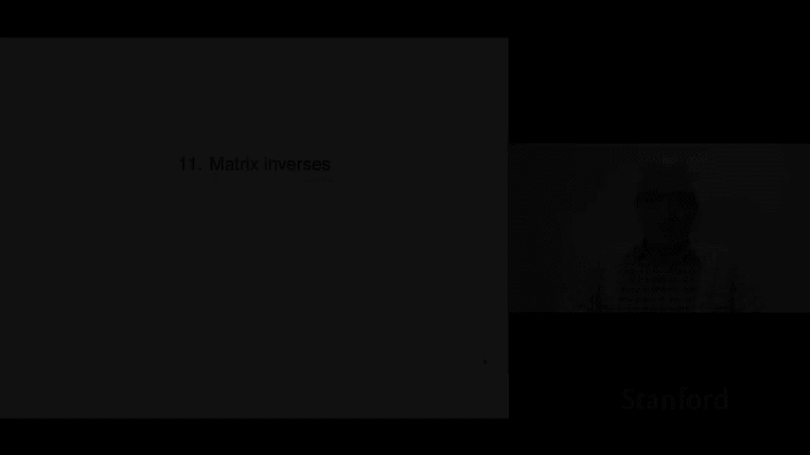
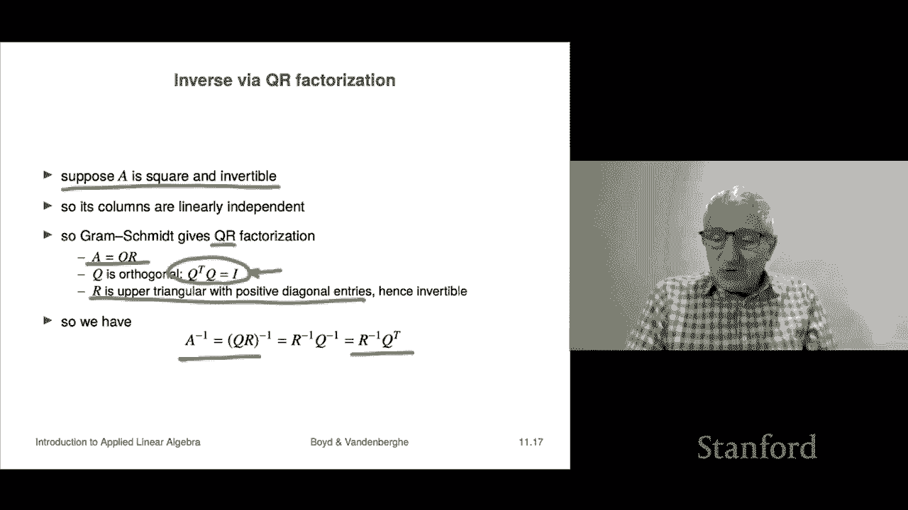

# 【双语字幕+资料下载】斯坦福ENGR108 ｜ 矩阵论与应用线性代数(2020·完整版) - P30：L11.1- 逆矩阵 - ShowMeAI - BV17h411W7bk

Chapter 11 is on the idea of a matrix inverse。So the first thing we're going to do is look it's a bit more complicated with matrices for numbers of course the inverse is simply one over the number so the inverse of two is a half we'll see what we're going to be looking at in this chapter is an analog of that for matrices it is in fact much more complicated and we'll start with the fact that there's a notion of both a left and a right inverse。

Okay， so。Just to give you a rough idea， I mean， just the setting is if I have a number x and it satisfies Xa equals one。

 that just means the product of it and another number a is one。

 then it's called the inverse and of course we just write it as one over a and that exists only if a is not equal to zero because if a is0。

 there's certainly no number x for which Xa equals1 because no matter what x you choose Xa is zero。

And of course it's the only one I mean there there's only one inverse of2 and it's one half Now by analogy。

 we'll say that a matrix x that satisfies xa equals I and notice that's the matrix analog of the scalar equation here we're going to call that a left inverse and it's left because X operates on the left of a we'll see also that there's going to be a right inverse where x operates on the right of a and for matrices they're different and of course。

 as you know that doesn't commute matrix multi is not commutative so they're different things okay so if you have a matrix when you multiply on the left by this matrix x then times a and you get I that's called a left inverse。

🤧And if a left inverse exists for a matrix a， we say it's left invertible so means so left invertible just means there is a left inverse so here's an example here's a matrix A it is3 by two and you can check I'm not going to do it but here are two different left inverses so already things are getting very weird because you can multiply you can check that B A is I and also C A is I I'm not going to do that but you can check。

That things are already weird right because for a number when there's an inverse。

 there's only one of them， no such thing as being two different numbers that when you multiply by two。

 you get one okay so。Things are already a little bit strange here。

Now it's related the idea of left inverses and things it's related to column independence。

 let's see how that is so the first claim is if a matrix a has a left inverse C。

 then its columns are linearly independent Now let's check that well to check that its columns are linearly independent we'll write down the matrix equation a x equals 0 now what that means is that Ax is one interpretation of it is it's a linear combination of the columns of a with coefficients X and then of course what we'd like to show if they're linearly independent we want to show that the only way this can happen is if x equals0 and suppose C equals I that means that a has a left inverse C or a is left invertible Well in that case we'll just do some matrix calculations here。

Of course， if you multiply any matrix C by the zero vector。

 you get the zero vector of potentially different sizes， but here ax is0。

 so I'm going to plug in C times ax and I'm going to use the fact that I can reassociate a triple product any way I like and in the first case I multiply a and X together first then multiply by C I'll switch that by first multiplying C and A but C is the identity so that's Ix And now we use the fact the identity matrix times x is X。

 And you know I think I said this before， but the identity you should think of as a matrix generalization of the number one。

Okay， and if you look at this whole chain， it says x equals 0 and so what we've shown is the following if ax equals0。

 then x equals0， and that means that the only linear combination of the columns of a。

 which gives you zero is the one with zero coefficients and that means the columns are linearly independent So what that says is if you have a left inverse。

 then your columns are linearly independent okay now later in the class not that much later actually。

 we're going to see that a matrix is left inverible。

 if and only if its columns are linearly independent。

 in other words if its columns are linearly independent。

 it has a left inverse and we'll be able to construct one we'll be able to show you how to do that。

And this is the matrix generalization of the following a number is invertible if and only if it is nonzero okay then so what we can say is a matrix is left left invertible if and only if it's columns are linearly independent right so so here linear independence is serving as sort of an analog of being nonzero okay of course they're very different things。

 a matrix can be nonzero but have dependent columns right so these are different concepts。

 but it's the correct matrix analog。嗯。So this tells us immediately that if a matrix is left invertible。

 it has to be tall or square， wide， because if it were wide。

 which means it has more columns than it has rows， that would mean the columns are automatically the columns are immediately dependent and therefore you cannot have a left inverse。

Okay so let's see that we can solve linear equations with a left inverse so suppose a x equals B that's a system of linear equations。

 I'm not assuming it's square wide tall anything okay well I will immediately so A has a left inverse C that tells you actually that means that of course a is tall or square then we do this we see that C is C and B is of course ax I mean if x satisfies ax equals B but C is again the identity and that's x and what we see is something very cool if you multiply the right hand side B by a left inverse you get a solution of a set of linear equations right so and that's exactly like let's write down the analog of this for scalrs right you write a X equals B and then we would write it something like this we'd say well in that case X。

eququals1 over a times B is actually a solution， so here the number one over a is well was's the inverse of a。

 but we can think of it also if you like as a left inverse of a and so。

that's what this tells you here so here this says that if you multiply by C which is this left inverse you get a solution so left inverses at least are quite useful because they allow you a left inverse allows you to solve a set of linear equations later we're going to find out actually how to compute a left inverse but for now we just observed that if you have a left inverse you can solve linear equations and that's useful。

Let's look at an example， so here's a it's a three by two matrix here's B。

 it's a three vector and we have overdetermined equations a x equals B。

 it's overtermined because it's essentially three equations in two one nodes that's how you might say it in sort of the high school language and and it has the unique solution there's only one solution of it and it's one minus1 so they has two different left inverses we already saw that it's the same one we saw before here's B and here's C and by the way。

 when you're talking about two different inverses， you're definitely outside the scalrs setting right because numbers only have one inverse but matrices can have several left we'll see exactly what but they can have multiple left inverses now if you multiply the right hand side that's this B by either B or C in both cases you get the same you get the same X and the reason is in fact that this。

Of equationquations has only one solution， it's a unique solution， right？So you had to get this okay。

 so this makes this makes sense， it's strange， especially if you're used to the scalar setting。

 it's strange but makes sense。Now you know naturally there's a concept of right inverse and so that says this a matrix X that satisfies aX equals I so here x appears on the right。

 that's why it's called the right inverse that's called a right inverse of a and if you have a right inverse you say the matrix is right invertible and it turns out that we can easily I mean we could work this out separately but in fact it's closely related left and right by transpose and that makes sense because when you transpose a matrix you first of all。

 you reverse the order of a matrix product and you turn rows into columns and so on so it turns out a is right invertible if and only if a transpose is left invertible so in other words if you have aX equals I that means x is a right inverse of a if we transpose both sides of this equation we get AX transpose on the left and I transpose but I transpos I I is a symmetric matrix meaning that when you transpose it you get the same matrix again now we're going use the。

poose a product rule it says that A X transpose is x transpose a transpose and now we look at this and we go cool X is a right inverse of a if and only if x transpose is a left inverse of a transpose okay and so what that means is a is right invertible if and only if the columns of a transpose are linearly independent the columns of a transpose are the rows of a。

 so it says a is right invertible， if and only if its rows are linearly independent。

And that tells us that if a matrix is right inverible， it must be either wide or square， okay？

Now you can also solve linear equations with a right inverse。

 so suppose B a has a right inverse matrix B。Now consider the square or underdetermined because a in this case has to be either tall。

 as to be square or wide， sorry it has to be square or wide。 A x equals B。 that's underdetermined。

 Okay then it turns out x equals B capital B little B is a solution Y because if you take x equals capital B times little B you get a X is a times capital B little B。

 we reassociate get A B， A B is I because B is a right inverse of a。

 you get I times B and that is B Okay So that says that in this case the equations A X equals B。

 has a solution for any B In fact， we'll see later it has many solutions but it at least has a solution for every possible B。

So let's look at an example， it's going to be the same matrices as above， so a remember is3 by two。

 and then B and C were two left inverses of a。And that tells us that C transpose and B transpose are both right inverses of a transpose。

 Now we consider the underdetermined equation。 A transpose x equals12。

 Now a transpose is two by3 and that says this is a system of two equations with three unknowns And when I multiply by B transpose the right hand side here that's the right hand side if I multiply that by both B transpose and C transpose。

 I get a solution， but here's what's kind of interesting in this case I get this vector and I get this vector and you thinkoo。

 this doesn't look good， but in fact you can check that if I multiply this by a transpose。

 I will get one2。 if I multiply this by a transpose I get one two So this is a case where these two different right inverses actually produce two different solutions of the undetermined system of equations。

We're going to do now is tie this together into what's basically the that's the more usual case。

 it's the simple case and that's when you just have an inverse， so let's see what that is。Now。

 if a has a left and a right inverse， they are unique。🤧And equal okay so in other words。

 if a a has to be square， of course， in that case， because it has to be tall to have a left inverse and it has to be wide to have a right inverse So if it has a left inverse and a right inverse。

 it's got to be square square is allowed in both cases so if a matrix has both a left and right is then it turns out they're the same and they're equal and and there's only one inverse so we're sort of back to the old situation of a number right if a number a is non-zero。

There is an inverse it's called one over a and it's unique there are not two numbers that you can multiply by a and get one Okay now let's let me let me explain how these are they're actually the same So here suppose that x is a right inverse of a that's this equation and is y is a left inverse and what I'm going to show is in fact x is equal to y。

Let's see how we check that while we write well X is equal to I X well we totally agree with that because the identity multiplied it multiplies a matrix either on the left or right you get the matrix back and now I'm going to write I as y a because y a equals I and then I'll reassociate and I write this as Y times a X wait a minute a x is I over here so a x is I and that that's y I and that's y so if you put all this chain together to get x equals y so that says that if a matrix which has to be square of course if it has both a left inverse and a right inverse they're the same there's no difference between left and right inverse that's getting it's more comfortable right it's more like the situation with a number where you say if I have a number if it's non-zero then x equals little x equals one over a is the inverse and someone would say that left or right inverse and you go well it doesn't matter their numbers if you multiply one over a times a you get1 the same the saying you multiply a times one over a and you get1。

But for matrices， it's a little more subtle， but something similar to that is occurring here。

 it says that if you have an inverse like this， then it's unique it's both1verse and a right inverse。

Now they're denoted as a a inverse right a the minus1 power right and that's very similar to how we work with numbers。

 I mean it's weird to write you know people don't usually write2 to the minus1 well they might actually and it's basically a half right so so it's the inverse it's written as a inverse。

And what we've seen here is that an inverse when multiplied by a matrix， when the inverse exists。

 we'll get to that later， but when the inverse exists you can multiply it on the left by a or on the right and these are in general when you multiply two matrices in different orders you get different matrices in this case you don't you get the same matrix and the identity。

And you can also check pretty easily that a that the inverse of the inverse is back to the matrix again that makes sense right I mean。

 in fact， when you talk about inverting something it's got that feeling that if you do it twice you get back the same thing it's like a transpose if I transpose a matrix twice。

 I get the matrix back in this case if I invert it twice assuming it is invertible then I get the matrix back right the previous example with transpose has no conditions on it right so any matrix I can transpose and if I transpose it twice I get back the original matrix。

Okay， so this is the matrix inverse。🤧Now we can use that to solve square systems of linear equations so let's suppose a is invertible and let's look at the square system of linear equations A X equals B then it says that for any B。

It has Ax equals me has only one solution and that solution is simply a inverse B okay。

 and you know this is basically the matrix generalization。Of the scalar equation， a x equals B。

 having the solution x equals1 over8b， and that's where a not equal to zero， right。

Here invertible is going to play the role of a not being equal to zero for a scalar right so that's the idea and this simple looking formula x equals a inverse B that's the basis for tons of applications like it could even be there's many there's many applications widely used where all it does from a scientific point of view is assemble a set of equations a equals B and then solve it for you by forming x equals a in verse B now we haven't said how to do that yet but we will shortly so tons of things like that like if I have a steel structure or some civil engineering structure and I want to find out will it be able to handle the loads that I'm going to put on a wind load static loads that are inside a bridge or something like doesn't matter and I want to know how much is it going to deflect is it going to deflect too much that's a set of linear equations's say x equals B and you simply assemble。

And then solve that and that tells you your deflection that's a simulator for trying to figure out if I build this bridge will it sag too much or something like a okay so that that's that's the idea so this is super important it's super naturalt you have to watch out though because。

This is。Very heavily it's it's it's very powerful notation right that that this looks very innocent right。

 you go from a X equals B to x equals a inverse B and you're like， well sure why not？

this holds a lot， this a very small number of characters is actually telling you a whole lot。

 this is very complicated okay。Now for an invertible matrix there's a lot of way to say that say I mean there's a lot of things equivalent to being invertible and I'm going to list them here so if I have a square matrix say oh I should say if a matrix is not square game over cannot be invertible right because if it's tall。

 it can't have a right inverse okay if it's wide it can't have a left inverse and if you're invertible you have to have both a left and a right inverse so if you're non- square matrix in fact I'll mention that now if you write a inverse。

Ever， and a is not square that's a crime Okay， that's that's what we call a crime against matrices。

 It's don't do that right And the reason it's a crime is because you just it doesn't make any sense。

 you can check it you can check so easily that the matrix A is square Now， of course。

 a square matrix need not have an inverse like the zero matrix square zero matrix5 by5 doesn't have an inverse but it's even worse just to assert that a three by5 matrix has an inverse right because that's so easily checked by essentially the syntax the dimensions of a okay。

So here are some， these are completely equivalent， meaning if any one of these holds。

 then all the others do， so one is is invertible， we define that to mean it has a left inverse and a right inverse。

It's the same as saying the columns of a are linearly independent， which well we saw one part of it。

 we'll see the other part later in the course， that's the same as saying that a has a left inverse right but it's also the same as saying the rows of a are linearly independent and that's the same as a having a right inverse right so but the point is that any one of these is enough to tell you that all the others hold so for example for a square matrix if the columns are linearly independent then so are the rows。

嗯。I mean some of these are some are easy right like here a is invertible implies by definition the definition is it has both a left inverse and a right inverse。

 so the fact that if a that this implies these two is clear， what's less clear is this。

 it says that if a square matrix has a left inverse。

 it's also got a right inverse that's what it says if a has a right inverse， it's got a left inverse。

 in fact it's the same matrix right because an inverse is unique。ok。

Let's look at some examples of matrix inverses and I should say something about this you should know a couple of these if it's super duper easy。

 you should know it and you know I think people should know you should probably memorize the formula for the two by two matrix inverse beyond that I don't recommend it right it's what we have computers for right so。

I'll just say that so so but let's look at a couple just to make sure it makes sense so the verse says that the inverse of the identity is well the identity so that makes sense I mean and we can check I mean I don't know let's see so does does I have independent columns yeah the it's the it's just the unit unit basis let's see it is the standard basis let's see is。

What is the inverse ofiv is I and that the reason is I times I equals I。

 which is true Okay now if a matrix  Q is orthogonal now that means it's square with Q transpose  Q equals I Now remember what that means Q transpose  Q equals I is basically very compact matrix notation saying that the columns of Q are linearly independent that's what Q transpose q equals I means。

In that case， I mean just look at this equation right， here's a matrixq transpose。

 I multiply Q on the left and I get the identity。Well。

 it's square so that says Q transpose a left identity， a left inverse。

 but that says because the square is just the inverse。

 so that says that for example Q inverse equalsq transpose for an orthogonal matrix it says that the inverse is nothing but the transpose they the same thing。

Notice that this actually has an implication， this also says that in this case Qq transpose equals I。

 which is not totally obvious by the way， right so it says that this one is the definition of the columns being of the columns being orthoormal right this is less obvious okay。

So for a two by two matrix。I mean you can you can just work it out and write it out and do a bunch of algebra and stuff like that and the truth is you may have seen this before so it turns out there and I would recommend you just memorize this。

 although on the other hand it's not clear to me that you would come to any harm if you didn't memorize it so actually maybe let me let me put it another way。

My my feeling on this is。You should should definitely know that there is a formula for the matrix inverse for a two by two matrix mean the truth is is a formula for the inverse of any matrix is' just they get huge and gigantic very quickly but for two by two there's a formula and maybe that's what you should remember and this is like what Wikipedia is for okay so you just look up by inverse of two by two matrix okay。

So here it is， it turns out the condition is there is a condition that has to hold because otherwise。

 you know we know that not all two by two matrices are invertible， for example。

 the zero matrix is not invertible and it basically says that the two columns have to be linearly independent that just means that the second column cannot be a multiple of the first column or vice versa you can work out what that is and it' it's this thing it says that the product of the diagonals。

Cannot equal the product of the I guess people call these the antidiaagonals the one two and the two1 entry now some of you may have seen from another course you'd recognize this number as the determinant of a matrix A determinant doesn't really play a leading role and what we're going say doesn't matter I mean but if you just if you've seen that then good for you but it's not going to play a role in this in this course and here's the inverse I mean it's a bit strange it's one over this mystery number it's the determinant。

Time here， I mean the rule is you switch you the 11 and 22 entry and you negate the off diagonal entries。

 so that's it。And yeah， I would say you should know this formula It's kind of like the quadratic formula for you know what are the roots of a quadratic Yeah I guess its it's on a short list of I don't know10 silly things you should you know little basic facts that you should know okay now for larger matrices like three by34 by4 or5 by5 there are formulas that look just like this but they are fantastically complicated so I think even if you were to write out the formula for the 10 by 10 inverse。

 I don't even think you could I mean it's impossible right and the reason is that the complexity of the formula kind of grows like the factorial of n and 10 factorial it's a pretty big number so so while there's a formula for a 10 by 10 inverses you can't write it it's not practical to write it down and I should also add that that formula is absolutely not the way you solve or compute and inverse right so we'll shortly see that in fact。

The truth is the hilarious part is you already know how to compute an inverse we just haven't gotten there yet so but the point is that that method is completely straightforward。

 it doesn't grow like the factorial or something like that。

 but anyway okay but here it is it's a two by two inverse and you know you could check it I mean multiply this by take this matrix here multiply it by you know a and make sure that you get I I would recommend doing that。

Okay， so let's look at a non-obous example here's a matrix A Oh and we should talk about something let's first let's talk about invertability of numbers Okay well anybody can recognize that because it's simple if the number is not zero it's invertible period so it's not a big deal to figure out if I show you a number if it's invertible or not the only question is this is zero okay now for matrices that's false okay unless it's two by two in which case here's the condition right but for a bigger matrix than that no human being can just look at a general matrix and go yeah。

 that's invertible oh yeah， no problem Sure that's invertible or or not well there would be some obvious giveaways in some very simple cases but generally no I don't know if it's invertible or not okay now this matrix turns out is invertible and here's the inverse it's 130th times this matrix here。

And you can you can just check check me on that that that works out I mean if you like let's audit one entry of you know why not so lets let's multiply let's say a in verse times a and let's calculate the 11 entry Well I'm going to go across here and down here。

And here's what I'm going to get， I'm going to get zero times one。

Which is zero minus20 times zero and the last one is minus10 times minus3 which is 30 Then I divide by 30 out here and I get one Okay good so the the11 entry of a inverse a is indeed one。

 which is correct it's the identity matrix okay so now。

How do you find the inverse we're going to tell you later it's super duper simple it's not like I just want to be weird or anything and not tell you yet you'll see soon enough that it comes up and how to compute it。

 but for now we're just saying you know this is an example of a matrix that's invertible。Okay。

 now in the inverse process involves you know there's a bunch of properties that that hold。

 for example， the product of two matrices and then quantity inverse is B inverse a inverse now this equation this this is all the inverses here have to have to exist right so A B has to have an inverse B has to have an inverse A has to have an inverse okay so。

But provided that happens， then this is the same thing so inverses like transpose， in other words。

 that when you apply to a matrix matrix product， it's the same as applying the operation。

To the individual matrices in the reverse order right so that's how that works transpose and inverse so a transpose inverse is equal to a inverse transpose and then some people actually write that a to the minus a minus transpose so so that's how they some people would write it that way you would see that in papers and books and things like that。

Okay， now we can also talk now that we have remember that we if we had a square matrix。

 we we know what a is， we know what a squared is and we know a cubed is and so on right we decided that a to the zero is I。

And now we have assigned a meaning to a inverse。Well。

 we can also have a meaning now for a to the minus2 and that's going to be a inverse squared and so on。

 So though now we can now we can talk about the powers positive or negative of a matrix that's square and invertible if it's not invertible but just square。

 we can talk about it zeroth power first power second power and so on now with this definition of these inverses。

 you get this beautiful thing that holds for numbers as well。

 It says that a matrix to the K times a matrix to the L gives you a to the K plus L。

 So the exponents add when you take a product and that holds even if K and L are negative。

 positive doesn't matter。 Okay so that's kind of the it's a pretty it's a pretty picture and this this is one case where the formula or a formula for numbers actually holds for matrices right so that general has。

 but you have to be very much on very much on your toast because some things don't。🤧。All right。

 so we're going to talk about triangular matrices。For a particular reason， triangular matrices。

 they come up a whole in a lot of applications， actually we already saw one。

 we saw one in the so-called QR factorization when you run Graham Schmidt。

 you factor a matrix A into a matrix Q and a matrix R which is upper triangular。

So we've already seen triangular matrices，Here it is a matrix is called lower triangular if what it means is it means this。

 so it means that here's here's the matrix it's got to be square and it says you can have stuff。

 you can have nonzero things on the diagonal here so on the diagonal and everything down here is potentially allowed to be nonzero but it has to be zero in the upper triangle so that's what it means to be lower triangular。

And the claim is this if you have a lower triangular matrix with nonzero diagonal entries。

 it's invertible okay now we have to show that now the way we're going to show it is to show that the columns of x are I'm sorry the columns of L are linearly independent that's how we're going to show that and to do that what we're going to do is we're we're going actually write down L x equals zero and end up with the following conclusion x equals zero that's the same as showing the columns of L are independent because L x equals zero means。

A linear combination of the columns of L are0 with coefficients x。

 and we want to show the only coefficients that do that are x equals0， that's what we want to do。

Okay， so we write down the equations this way， is this is now written out and。

Let's take a look at it well actually it's。The first equation is fine because that's just a product of two numbers。

 L11 times x1 is0。But we're assuming L11 is non0， so x1 is0。

That's awesome because it means you see this first column， it just goes away， they're all zero。

if you look at the second equation here， it says that L21 x1 plus L to2 x2 is 0， but wait a minute。

 x1 is0， we know we already figured that out so this says L22 x2 equals0。

X2 has got to be zero because L to2 is non zero， Okay。

 and you keep going and what this shows is that the only way。

If you have L x equals zero that can happen is x equals zero that says the columns of L are linearly independent and that says that L is invertible it's got an inverse okay now same thing for upper triangular R with a non-zero diagonal is the same because it's the transpose of a lower triangular matrix okay so triangular matrices with nonzero entries on the diagonal or invertible by the way。

 a triangular matrix with a zero on the diagonal is not invertible。Okay。

 now we can get the inverse and sure enough it's gonna be the one algorithm that we already looked at fact it's pretty much the only algorithm we're going to use in the course it's the QR factorization or gram Schmidt Okay so suppose a is square and invertible that means its columns are linearly independent that means if we run gram Schchmid。

 it will run to completion and that says we'll end up with a factorization and it's going to look like a equals  Qr that's why it's called the  QR factorization Q is orthogonal right itss columns are orthogonal and that means that  Q transpose  Q equals I Q is square。

Okay， and R is upper triangle with positive diagonal entries。

 If you remember the diagonal entries were the norms of something like the norms of the Q t these or something like that。

 which was an intermediary before being in the gram Schchmidt algorithm before being normalized and the point is they're nonzero and so it's it's invertible Okay and that says this now it's gonna to get you know it says a inverse is a is QR inverse of that both Q and R are invertible we know that And fact it's R inverse is the first one and Q inverse。

 but Q is orthogonal， it satisfies this And so that says it's inverse is it's transpoposed So here it is it's our inverse。

Q transpose there you go so so this says we can get the inverse via QR factorization actually I haven't yet quite said how to get our inverse。

 but that's coming we're going to get that in just a minute。

