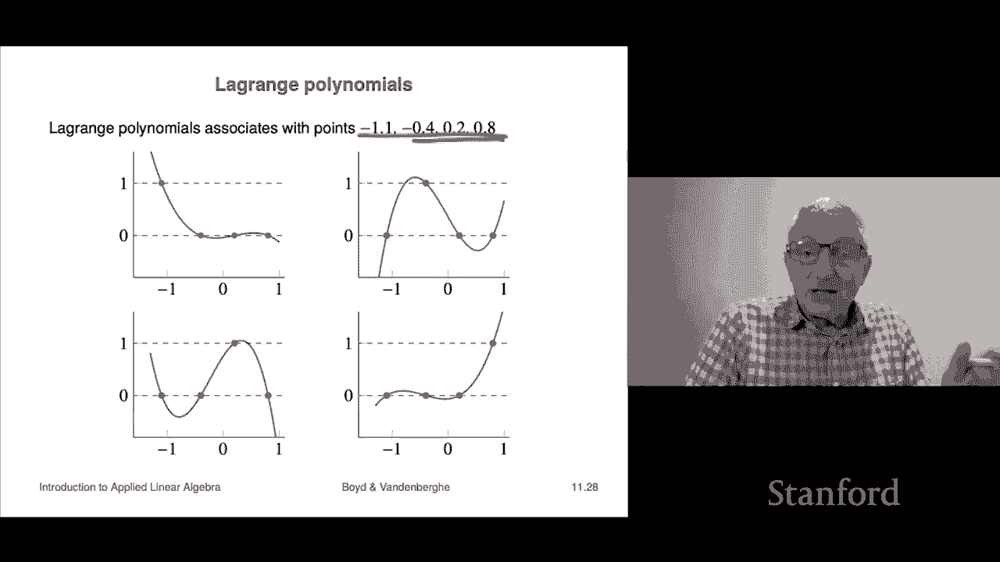

# 【双语字幕+资料下载】斯坦福ENGR108 ｜ 矩阵论与应用线性代数(2020·完整版) - P31：L11.2- 求解线性方程 - ShowMeAI - BV17h411W7bk

我们现在来解线性方程组，线性方程组，所以我们将从一种叫做回换的东西开始，名字就会变得清晰，呃很快，所以我们有一个矩阵R，它是带有非零对角线条目的上三角形，这意味着r是可逆的，我们已经讨论过了，嗯。

所以我们要写出方程，Rx等于b，当然我们在这里实际计算的，如果我们要解x，我们有x等于r，逆b，我写这个是因为r是可逆的，因为它是上三角形，有非零对角线条，好的，所以我要写，把这个写下来，呃标量。

这基本上是我们的上三角，所以它看起来是这样的，是r 1 1 x 1加r 1 2 x 2以此类推，这是第一个方程，第一个方程涉及所有变量x 1 x 2 x 3，一直到xn，顺便说一句。

第二个方程只涉及变量x 2 x 3 x 4，最高xn，那是因为一个单独的三角形，最后一个方程就在下面，很简单，它只涉及XN，对呀，倒数第二个方程只涉及xn减去1和xn，现在让我们做我们想做的。

我们要计算x，我们想基本上解x，所以让我们从最后一个方程开始，从最后一个方程，你看到rnn xn等于，bn，现在这些只是数字，对呀，哦，不仅如此，这是至关重要的，我们知道RNN不是零。

所以这立即告诉我们，我们只是分裂，我们得到x等于，bn over rnn，现在我们知道XN，好的，现在，从第二个到最后一个方程，让我们专注于那个，嗯，它说r n减去1 n减去1。

xn减去一加r n减去一n x n等于，但你知道我们所知道的XN，所以我们要做的是，我们要取这个方程，我们将写xn是右手边，十亿减去一减去这部分，现在我们已经知道那部分了。

因为我们刚刚计算了xn除以rn减1，减去1，我们可以再做一次，因为rn减去一，逗号n减一是r的对角线项，假设它是非零的，所以我得到了XN，然后基本上我们只是继续这个，呃，我们现在知道，在这一步之后。

我们知道x n，我们知道xn减去一，现在我们得到xn减去2，然后xn减去3，最终我们得到x 1，好的，所以呃，这叫回换，原因很明显，我们在倒退，我们首先计算xn，然后将已知值替换到，呃，公式。

然后分析出，呃，各种x按向后顺序是什么，好吧，嗯，这就是我的想法，它将计算x=r逆b，所以我们现在有一个很好的方法来做到这一点，让我们谈谈像这样的复杂性，这得花多长时间，第一步是，呃，嗯，你要把它。

它是，你知道，不管是什么，它是，它是bn除以rnn，那是一次失败，一个师，嗯，第二步第二步在这里，让我们看看我们该怎么做，我们要乘法，呃，这两个数字我们要做减法，然后也许是一个分裂。

所以也许那是三次失败，呃这里，好的，所以第二步需要三个失败，和I步，你知道的，第三步要翻五下，然后七个，以此类推，所以总数是1加3加5加7，一直到2n减去1，它是一个，这是一个著名的恒等式。

它告诉你第一个的和，二n减去一或其他什么，第一个，2的奇数之和等于n的平方。呃所以，你可以检查它是否足够容易，但我们甚至可以在书中解释你是如何理解的，或者类似的东西，无论如何，嗯，它是。

其实并不难表现出来，嗯，所以它将花费你n的平方，人字拖，呃实际上做回来，替换，嗯，顺便说一句，它和矩阵向量乘的顺序是一样的，呃对，所以如果你把矩阵n乘以n，矩阵乘以向量，是啊，是啊，它大约是n的平方。

也许是两个n平方的失败，类似的东西，所以背替换和那个顺序是一样的，好的，现在，现在我们可以通过qr分解解线性方程组，嗯，所以让我们从一个矩阵开始，a是可逆的，所以它是平方的，我们要解AX等于B。

这意味着计算x等于逆b，所以我们从一个，嗯A有独立的专栏，因为它是可逆的，所以QR分解完成，我们把它写成等于，qr q是正方形的，它是一个正交矩阵，意思是它是正方形的，顺便说一句，它的柱是正交的。

所以是行，然后r r是一个具有正对角线项的上三角矩阵，因此它是可逆的，所以A是两个可逆矩阵的乘积，所以首先是反的，我们得出a是可逆的，一号二号，它是相反的，就是产品，是乘法器逆序的乘积。

所以一个逆就是qr逆，这就是我们的逆乘以q逆，但是q逆q转置，嗯，原来如此，所以我们所做的，那就是现在我们知道怎么做了，因为我们能做的是，我们要计算这个，呃，我们先用反向代换法计算x。

我们要乘以q转置b，我们知道如何做矩阵向量乘法，然后计算x等于r逆q转置b，我们用背部替换对吧，所以这就是我的想法，这是以伪代码形式写出的算法，它是这样工作的，嗯，一个伪代码，它是这样工作的，我们要。

我们给出一个n乘n的可逆矩阵a和一个n向量b，第一件事是你做QR因式分解，这让我们付出了代价，呃，嗯，我们会讨论的，那是两个n次方的人字拖，大概，然后我们计算q转置b，这是矩阵向量乘法。

最后我们叫回换人，在这个方程组上，我们可以这样做，因为r是一个非零对角线元素的三角形，那就是用背部换人，所以第一步，两个N立方人字拖，第二步，矩阵向量相乘，那是两个n的平方，最后一次换人是n的平方。

所以当你把这些加起来时，你立即看到的总数是，第二步和第三步花费很少，事实上它们微不足道，呃，因为我们想象N很大，我是说我们不是在想十个，我们想十万一万，结果是第二步和第三步实际上可以忽略不计。

因为它们是成比例的，它们的顺序是n的平方，第一步就是这个QR因式分解，所以它的意思是，求解线性方程组的实际成本是QR因式分解，好的，所以顺便说一句，呃，在这一点上，在课程的早些时候，一种数值算法。

它告诉你一组向量是否线性无关，现在，我们看到的是它可以用来解方程，线性方程组，这很好，因为已经有很多应用程序可以完成，呃这边，所以总的复杂度加在一起是第二和第三个是完全可以忽略不计的，当你数翻牌的时候。

你会忽略与n的平方成正比的东西，所以它基本上是2n的立方体，呃是解决的成本是多少，对于a和n乘n的矩阵，我会给你一些粗略的想法，让我们呃，让我们让我们做到这一点，让我们用一千乘一千的矩阵解x等于b。

好的，所以嗯，首先，这是一个，至少对一个人来说，这看起来像一个相当大的线性方程组，我们有一千个变量，x一x二x三，最多x一千第一，我们有一千个方程，对吧，所以加在一起，矩阵a，它们是线性方程组中的系数。

其中有一百万个数，我的意思是我可以让它听起来像超级，你知道的，复杂而庞大，嗯，我可以用我的笔记本电脑在十分之一秒内解决这个问题，它是五岁的，好的，所以这绝对令人震惊，对了，对了，事实上，这节课很有意思。

是的，我们做这些事情，但它们实际上是完全可以起诉的，你可以解决更大的问题，如果它在其他类型的硬件上更快，就像在GPU之类的东西上，它非常非常快，嗯，但这些只是惊人的速度，这样我们就可以解决大量的方程组。

呃这边，好的，下一件我们要讨论的事情实际上是解决，多组线性方程组，嗯，它会回到这个想法，解决所需的三个步骤中的一个，ax等于，b，它只是系数矩阵的QR因式分解，实际上花费了任何东西。

其他的我是说他们在失败方面花了一些钱，但与第一步相比，它们微不足道，所以这意味着，在这种情况下，我们要解a x i等于b，i i等于1到k，所以我要打电话，我要解K，可逆线性方程组，所以右手边是不同的。

我有b 1 b 2 b 3到b k和，当然解决方案是不同的，那是x 1 x 2 x 3，嗯，但是系数矩阵A对它们都是一样的，所以我们所做的是，我们要聪明点，我们将进行一次QR因式分解，好的。

然后我们唯一要重复的是，我们要对右手边的每一个重复，呃，我们实际上要做反代换和乘以q转置，对呀，那是n的平方，呃失败，所以总数是两个n的立方加上三个k的平方，你所看到的是相当惊人的，只要k是小的。

它基本上还是完全可以忽略不计的，这完全是奇怪和疯狂的，这是你知道的第一件令人震惊的事情之一，所以基本上它说的是好的，让我们把我的笔记本电脑，假设我让你解一个x，i=v i因为i=1到10，好的。

所以我想去，我想做十个，我想解十个线性方程组，A是千乘千，我们已经讨论过了，我们发现我可以在十分之一秒内解决这个问题，在我的笔记本电脑上，仅此而已，我可以在十分之一秒内解决其中一个，好的。

所以最简单的方法就是简单地解决这个问题十次，这将给我十倍，十分之一秒，也就是一秒钟，好的，但事实上这上面写的是，如果我聪明，我只需要唯一的一个，我我我我愿意，让我们回到这里，我做了第一步。

然后是第二步和第三步，我重复十遍，但关键是，它是，人们会说第一步占主导地位，意思是它很多，完成第一步需要更多的时间，所以我们在这里得出的结论是，我可以解决，你知道有人走过来对你说，帮我解一组线性方程组。

千与千寻，我去没问题，十秒，他们变酷了，我现在想解十个线性方程组，同系数矩阵，那要花多长时间，你通常会想，实际的答案是一分一秒，都一样，所以在其他情况下，你可以把疯狂的声明作为一个实际问题。

我能解十组线性方程组，一个接一个基本上和我解决一个问题所需的时间一样，好的，所以这很奇怪，我是说出乎意料，但你知道一旦你知道了所有的部分，它，这一切，你知道这一切都很有道理，我们现在要做什么。

看看几个非常简单的例子，呃，有很多很多，许多其他人，但让我们来看看他们，第一个是多项式插值，所以我们要做的是，我们将表示一个多项式，它是x的p，它是一元多项式，标量变量x。

我把它写成c1加c2 x加c2，c 3 x平方，加c 4 x立方，好的，所以它是一个，它是一个四次方，否，这是一个立方体对不起，它是一个三次多项式，它有四个系数，因为它也有常数系数。

所以C1是x到零的系数，C2是x到1的系数，以此类推，好吧，我要做的是，我将表示多项式的系数，它的系数作为四向量，c，所以当你现在看到一个四向量，它将表示一个多项式，好吧，我想做的是。

我想找到一个满足这些条件的三次多项式，所以当你在负1分时，你应该得到V一，当你在负四分的时候，你应该得到b 2，在第一点，你应该得到B3，在A点，你应该得到b4和b1，三个b四个是我还没有指定的数字。

好的，所以哦，顺便说一句，这叫做多项式插值，因为这意味着你想要多项式的图，多项式的曲线，当你画的时候，它应该经过特定的点，所以它应该经过负1点1，逗号b，好的，所以当你通过这些插值点时，这叫做插值。

好的，现在我们也可以写出这些插值条件，只是一组线性方程组，交流电等于b，好的，为了检查你是否会把C，呃，你知道的，这里是C2 C3和C4，好吧，看看这是不是应该的，嗯，好的，那就不平等了。

我只是把它处理掉，我们开始了，好的，让我们看看这是否忠实地给出了这些插值条件，嗯，如果你看看，如果你穿过第一排，用这些系数，你会发现你是，产品的第一行实际上是在评估，p点减去一点，一个啊。

但那应该是V一，果然，那是右手边，所以这是正确的，所以这些多项式插值条件，基本上我写的是四乘四的线性方程组，线性方程组，嗯是的，顺便说一句，这正是，即使这就像，从计算机的角度来看，这小得可怜。

这已经比任何人都应该做的要大得多了，现在太晚了，但如果你以前有课，你认识的人，通过解决三乘三组线性系统来折磨你，在我看来，这真的是，完全是浪费时间，四乘四就会消失，2。你能徒手做这件事吗？

用某种高中的方法，你知道，不管是什么，高斯消去，哦，你可以，但那就不好玩了，这完全是浪费时间，我还应该补充一点，好的，所以这个，如果我们解这组方程，我们会得到系数，嗯好吧，事实上。

我们甚至可以说这个c等于一个逆，b，我应该说几件事，这个矩阵有一个名字，其行由一个数到零数到一组成的矩阵，二三到一定的幂，这叫做范德蒙矩阵，以一位名叫范德蒙特的数学家的名字命名，嗯，它是可逆的，嗯。

它是可逆的，因为这些数字都不一样，对吧，这就是实际情况，我还没有证明这一点，呃，但事实就是如此，就是这个意思，好的，所以我得到了，这只是一个紧凑的公式，这告诉我这些是，你知道的，你告诉我你想要什么。

你希望你的多项式在这四个点经过的地方，我会告诉你系数是多少，这就是工作原理，所以这里的逆，呃，这是四个重要的数字，我是说显然不止这些，但这里是相反的，这个矩阵是，嗯，你看着它，你觉得哇，嗯，好的。

管他呢呃，所以如果你把这个矩阵乘以这个矩阵，呃，你会得到一些接近身份的东西，实际上，因为我只给了其他四个重要的数字，你会得到对角线上的数字，就像九点，九九九九，对角线外的入口会非常小，对呀，好的。

所以这里有一个相反的，嗯，让我们看看是什么，逆的解释是什么，嗯，一个相反的，呃，和逆映射b的项，这些是你的价值观，那个，你就是那个，你的多项式应该在这四个点进入系数，例如，我们会注意到嗯，这些是。

这些是整个矩阵中最小的条目，它说的是，让我们来解释一下，所以在这里我会把B，然后这会给我这个C，这将给我C，所以这意味着，我可以说第一个系数对什么不太敏感，B一或B四就可以了，嗯，谁知道，但这是真的。

上面是这么写的，另一个有趣的事情是实际上解释这些列，对呀，专栏超级有趣，就像让我们弄清楚第一列是什么意思，这是第一列，好是什么意思，那列是，如果我把一个逆数乘以e一，我得到第一列，对任何矩阵都是如此。

嗯啊，但是等一下，E是那个多项式应该取的值，也就是说，第一个，第一列给出多项式的系数，在负1点1满足这个，在负四点处是一，零零零，这就像一个，右手边，好的，现在它有名字了，呃，在指定值处等于1的多项式。

在其他值处为零，这叫做拉格朗日多项式，它实际上是，呃的，它是，出现在这个范德蒙德矩阵的逆列中的，这里有一个例子，嗯，我们给你看的是，这里有几个这样的，所以首先这是我们，嗯，为几个人解决这个问题。

为了几个不同的案子，这是负1分1，所以，比如说，如果指定这些值，嗯，你知道这个，这个这个，这个你会得到多项式会直接穿过，嗯，它会穿过那些点，因为我们是这样建造的，所以这就是我的想法，这是拉格朗日多项式。

这是第一个拉格朗日多项式，嗯，与这里的这些点相关联，嗯，让我们看看它是如何工作的，呃，它说的是你有一个，呃，你有一和零，所以第一个多项式看起来是这样的，它是一个立方体，很肯定地看，减去1点1。

是1在正负点4在零，在第二点又是零，也在第八点，这是第二个拉格朗日多项式，与这些点相关联的拉格朗日多项式是这样的，呃，零下一等于零，点1在负8点，它它减去四点，对不起，这是一个，在第二点又是零。

也在第八点，这些是拉格朗日多项式，好的，所以说。

