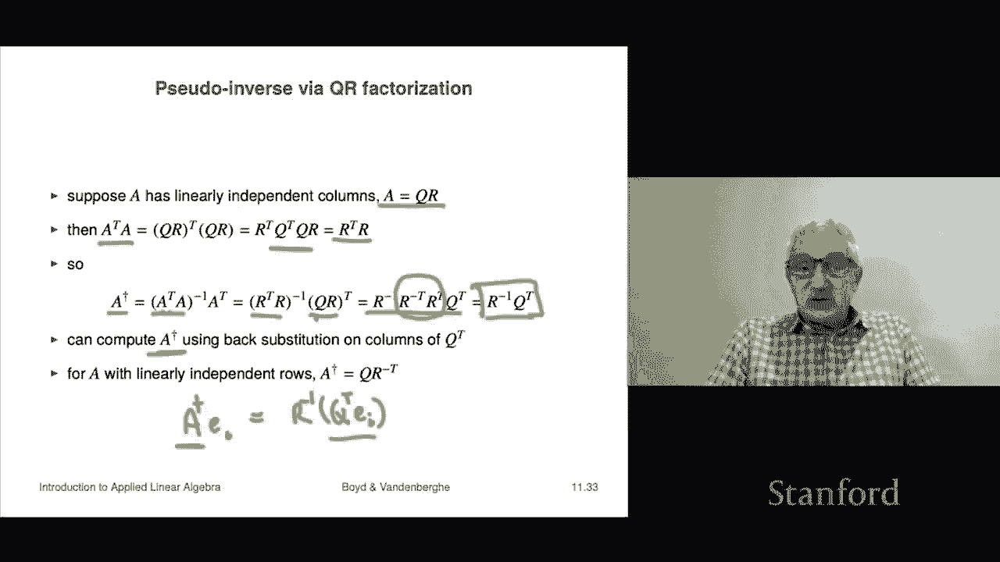

# 【双语字幕+资料下载】斯坦福ENGR108 ｜ 矩阵论与应用线性代数(2020·完整版) - P32：L11.3- 矩阵伪逆 - ShowMeAI - BV17h411W7bk

Our last topic in this chapter is the pseudo inverse of a matrix。

So we're going to start with a connection between a gram matrix and the matrix itself。

 so it's this if you have a matrix A， it has linearly independent columns if only if it's gram matrix is invertible okay so what does it mean to say it has linearly independent columns it basically says that if ax equals zero that implies that x equals zero because this simply says that there's a linear combination of the coefficients I sorry there's a linear combination of the columns of a with coefficients given by X is zero and linear depends says the only way to do that is's when all the coefficients are zero and that's what this is so this is what this is what this is what it means for the columns of a to be linearly independent。

Okay now to show this what we're going to show is that a x is zero。

 if and only if a transpose x a transpose a x is0 now these are different sizes right if a is M by n that is an M that has size M。

 this has size n in this case， because that's an n times n system matrix and and then the zero on the right hand side is also size n okay。

So let's do this so first of all suppose aX equals zero and if you like that means that there's a linear combination of the columns of a which is zero then we're going to show that basically the same if I multiply by a transpose A X I get0 so let's see so a transpose Ax I'm going to reassociate that is a transpose times Ax。

But a x is 0。 So this is a transpose 0 and that's zero。

 Okay And so what this tells you is if that says that if a x equals0。

 then a transpose a x equals 0 now conversely suppose a transpose a x equals0 then what we're going to write is I'm going to take this thing which is an n vector and I'm going multiply on the left by x transpose and I'm going to get zero is well x transpose times0 is0。

 So I get0 but I'm going to reassociate this quadruple product in the following way。

 I'm going to rewrite that as first I'm going to write it as x transpose a transpose a X and then I'm going I'm going reasociate it this way。

 and then x transpose a transpose I will recognize as ax quantity transpose okay。A。

 but wait a minute。This is the transpose of a vector。

In a product with itself or sorry the times itself right And that's the norm squared So this says that0 is the norm squared of aX。

 Well， the only way you can have a norm or norm squared B0 is if the argument itself is0。

 so that says AX equals 0。 And so what this does is it tells us it establishes that a has linearly independent columns if it only if a transpose a is invertible Okay so that's a connection between a matrix and the gram and it's associated gram matrix。

Okay and now we can say we can tell you what the pseudo inverse of a tall matrix is I should say that this is pretty standard mathematical notation like everybody knows what a pseudo what a pseudo inverse is there's some other names for it it's also called I think the more penrose inverse that's especially if you come from the UK they were British mathematicians and it's probably got some other names as well and its notation is this it's a superscript with a dagger and so in fact in informal speech you might say a dagger So that's what it is okay and here's what it is and you know these things get very complicated to parse but you really got to be on your toes to make sure everything's cool it's a transpose a quantity inverse a transpose so let's do a quick syntax check。

 let's make a is M by N。And let's just let's just check that the dimensions make sense， Okay。

 so a transpose is an n by M matrix。Now let's see， let's look at a transpose a。

 that's the gram matrix， by the way， so a transpose a A is M by n。A transpose is N by M。

 And so the result a transpose A is N by N。 That's the gram matrix。 It's n by N。

 And so this is now the inverse of an n by n matrix is an n by n matrix。 So this is n by N。

 and sure enough， we're cool because we're multiplying two matrices and the dimension in the middle is equal。

 Okay so it's so the whole thing a dagger is an n by M matrix。

 So a dagger kind of looks like the transpose。 right。

 because it' it it has the it has the transpoposedse dimensions。 Okay， and it's equal to this。

 Now so far， that means nothing to you。 And in fact。

 it's not even going make mean a whole lot to you now， actually in the next section of the course。

 it's gonna make it's actually going to mean a lot to you。 We'll get to that。 Okay。

 Now first thing to note about a dagger。or a pseudo inverse is that it is a left inverse of a so let's just check a that means if I multiply it on the left if I multiply a on the left by a dagger so if I do that I just plug this stuff in and I reassociate this as a transpose a inverse times a transpose a but a matrix any matrix times inverse on the left is the identity so look at that so we now have a left inverse by the way we have now shown something that I mentioned a few lectures ago but did not actually derive and that is that if a matrix has independent columns then it has a pseudo inverse and now we can be very explicit it's like here' by the way it can it will have multiple pseudo inverse if it's tall but the point is it has at least a pseudo inverse and in fact here's a simple formula for it's a transpose a inverse a transpose。

That's now established， that was something left open from a couple lectures ago。

There's some by the way， it's very easy to get into trouble with these kinds of equations right like that。

 it's just too easy to just look at it， not be present or not be thinking about what it means and all of a sudden you're in big。

 big trouble and to do that I'm going to work out we're going to see。

What the pseudo inverse is when a is square。 So if a is square。

 then a dagger is equal to a transpose a。In parentheses quantity inverse times a transpose now。

 because a is squared I'm going I can actually say that a transpose a is the product of two square matrices inverse。

 that's the product of the inverse is in reverse order。

 So this is a inverse times a transpose inverse that's slang for a transpose inverse is a minus t or something like that and then multiplied by a transpose Now this is the identity and it goes away so you get a inverse。

 So we can think of the pseudo inverse as as a generalization of an inverse to the case when a matrix a is tall。

 let's say oh， and I should say as linearly independent columns then that's what the pseudo inverse is。

 And indeed it's a left inverse of that。 So okay so that is later we're going to find out that's actually much more special than just merely a left inverse。

 it's got some very special properties。 But for now。We'll just leave it this way。

 that's what the pseudo inverse。Yes。I should also say that。

 you all languages for manipulating matrices， all packages and languages will indeed have some function that carries out the pseudo inverse。

Okay， now we also have the pseudo inverse of a wide matrix， so a is wide。

Then Aa transpose that is by the way， the gram matrix of a transpose that's invertible and the pseudo inverse is then defined this way it's a transpose times Aa transpose quantity inverse Now again。

 you have to be so careful with these things because you can write down stuff like this。

And it's either meaningless or wrong。 That's extremely is you have to be very careful。

 So this requires a to be wide with linearly independent rows。 Otherwise。

 this makes absolutely no sense。 It's just like parts of it are just wrong。

 like things are not invertible， all that kind of stuff。 Okay， now not surprisingly。

 a dagger the pseudo inverse of a wide matrix with linearly independent rows is a right inverse。

 the same way a dagger was a left inverse when a is tall with linearly independent columns。

 And you just check that。 you just multiply a dagger on the right。

 And so I multiply a times this expression。 And sure enough。

 I get a a transpose times aa transpose inverse and。

That's the identity so that's it okay and once again it too reduces to a inverse when a is square okay。

 so by the way， this calculation here expanding Aa transpose and writing it as a Aa transpose as a minus transpose times a inverse that would be a terrible crime if a were strictly wide if a is square。

And invertible or has you know linearly independent columns， this is cool。

 but if it were if a were strictly wide， this would be a terrible crime crime thered be many crimes committed here。

 one is that you can't have a nons matrix you can't have an inverse of it right so that that be in big trouble right there。

Now it turns out that the pseudo inverse we can get it it's very closely related to the QR factorization let's see how that works so let's suppose a has linearly independent columns and we form a QR decomposition now because it has linearly independent columns Graham Schmidt if we use that to calculate QR is going to succeed and that means we're going to end up with a matrix Q same size as a and it's going its columns going to be orthoormal and R as upper triangular its upper triangular and it。

With positive entries on the diagonal。 Okay， now let's work out what is a transpose A。 Well。

 A is Q R。 So I just go Q R per n transpose Qr。 And now I use the fact that the product。

 the transpose of the product is the transpose is the product of the transposees in reverse order。

 So I get over here here。 I get R transpose Q transpose Q R。 But Q transpose  Q is I。 see identity。

 because， in fact， that that is precisely equivalent to saying the columns of Q are ortho the normalmal。

 So that's an identity in the middle， it goes away。 and I end up with R transpose R。 Okay。

 interesting。 Now let's take a dagger。 A dagger is a transpose a quantity inverse A transpose。

 But we just work down A transpose A is R transpose R。 And so this is R transpose R inverse Q R now。

A is。Can be tall， so I certainly cannot expand things in write a inverse。

 but R is square and invertible。 So this thing I can for sure use the rule that says that R transpose times R quantity the inverse is the inverse of R times the inverse of R transpose。

 And so I get this。Oh and then this is QR quantity transpose that's the same as the the product of the transpose in reverse order and so this is R transpose Q transpose so I get there and what happens is in the next formula I have an R transpose inverse and an R transpose that line up next to each other。

 they annihilate each other the product is the identity and that just goes away and I get R inverse Q transpose。

Okay， so sos this is a very cool formula it's just our inverse times Q transpose that's the formula for the pseudo inverse of a tall matrix right a linearly independent columns or tall or square doesn't matter okay。

 now that means I can actually calculate the pseudo inverse because I could just do this to do that I'm going to calculate a dagger times EI that's going to give me the ifh column of a dagger and to do that I'll simply write it as R inverse times Q transpose EI。

Okay， so now I see what we do， we do a QR factorization。

You do a QR factorization on a then you take the columns of Q transpose that's these things and for each of those you do a back substitution and this will give you the a dagger right and it will give you itll give you this because you'll compute it column by column so that that's how the okay so that is the QR factorization I should say this this finishes a section of an entire section of the course。

We've seen vectors， matrices， the concept of inverses and solving linear equations and we even know how to do it when I should say various matrices have linearly independent columns or are invertible of it square so that's where we are so far so you know some you know some things and you can do some useful things I should say that the course is about to get much more useful in the next section when we talk down about solving equations but about solving equations approximately。

And that's going to be coming up as the next section of the course。

