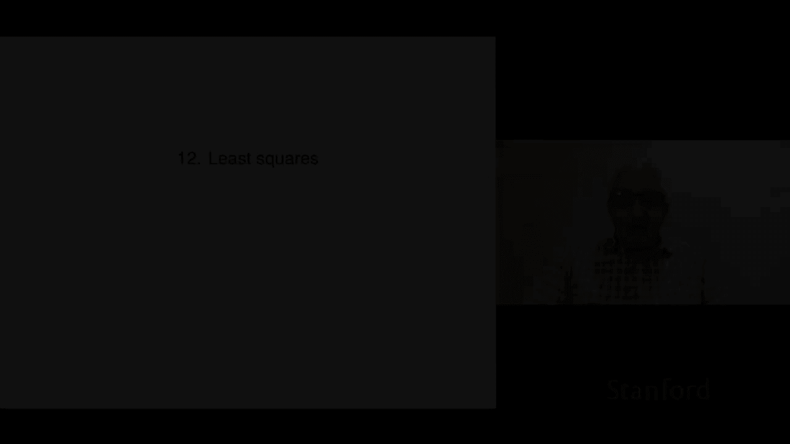
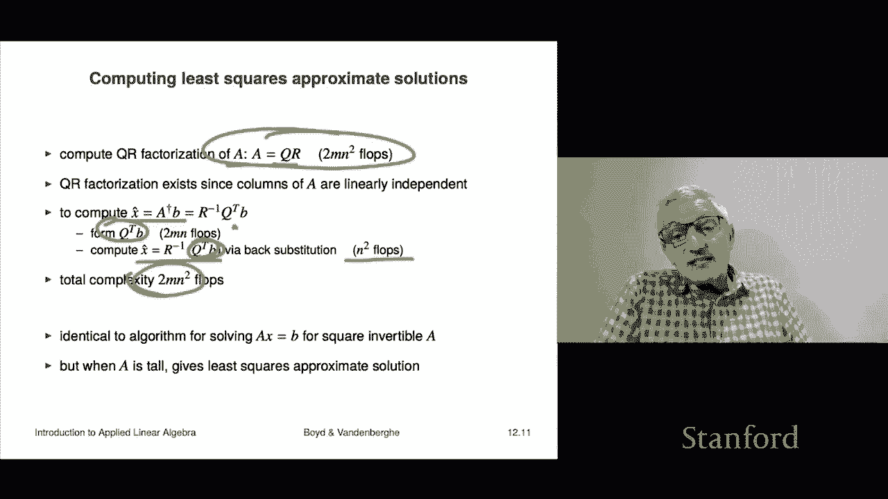

# 【双语字幕+资料下载】斯坦福ENGR108 ｜ 矩阵论与应用线性代数(2020·完整版) - P33：L12.1- 最小二乘法 - ShowMeAI - BV17h411W7bk

We're now turning to least squares， which is really the third part of the book and an important part of the course。

So we'll jump right in and I'll tell you what the least squares problem is and we'll get to how to solve it actually it's the math is's not very complicated what's exciting about least squares are all the things you can do with it。

 the applications。Okay， so here's the least squares problem we start with an m by n matrix a which is tall。

 so that means that M is bigger than n and that says the set of equations aX equals B is overdetermined。

 you have more equations than you have unknowns and that implies that for most choices of B。

 the right hand side， there is no solution， there's no X that satisfies aX equals B。

So what we're going to do is we're going to talk about the residual R and that's Ax minus B。

 it means it's the residual in the equation， it means that it's the amount by which the equation doesn't satisfy。

 so if r equals zero， the residual that means x is actually a solution of AX equals B。

Now in this case， when A is tall， for most B， there isn't an x that makes the residual zero。

 so what we're going to do is this， we're going to choose X that makes the residual as small as possible and we'll use that it'll be small as possible。

In the norm or the norm square， because if you minimize the norm。

 it's the same as minimizing the norm squared。 So that's what we're going to do。

 We're going to minimize the sum of squares。Of the residual。 That's how we're gonna choose X。

 Now this is called the objective function。 It's a scalar。 It's a nonnegative scalar。

 and it's the objective function。 and it's one that we want when we're gonna to choose x。

 we want that to be as small as possible。 that's the that's what we want And so we'll say that x hat is a solution of the least squares problem if the following holds。

 if the objective value for X hat is less than or equal to the objective value for any other X。

 That's it。 So roughly speaking， it says it's the best。

 it's the best if it's the best you can do in terms of making the residual small。 Okay。

 so that's the that's the condition。 X hat minimizes the objective。

 That's the right Or you would say X hat minimizes the norm or norm squared of the residual okay。

Now this is got other names too， this is just Lee squares and it's got many。

 many other names depending on the application， for example in statistics。

 people would call it regression， that's where you're fitting some data and we'll see that later。

Okay now X hat， we will shortly get to how do you compute X hat or what is X hat。

 that'll be a formula for it and it will not be unsurprising the formula。

 but for now we'll say that if you choose x that minimizes the norm squared of the residual but we're going to call that a least squares approximate solution of ax equals B now I have to tell you that's because in general it is false this is in general we don't have this right that generally does not occur okay so some people an older terminology for a least squares approximate solution of this is people say that x hat is sometimes called a solution of ax equals B in the least squared sense。

Don't say that。I'll tell you why because it's not a solution of ax equals B in any sense a solution of ax equals b is effective that satisfies a equals B and x hat generally does not satisfy that。

 so don't say that。It's very confusing please don't say it and actually don't hang out with people who say stuff like that because it's just。

You know， it's not cool， so， but I just wanted to warn you some people say this it's that X hat is a solution of x in a least square sense。

 which doesn't mean anything， okay， fine。Now， as I've said a couple of times， x hat。

 the solution of the least squares problem generally doesn't satisfy a x hat equals B。

 it merely minimizes the norm of the residual， it does not make it zero now if you have an x hat that does satisfy a x equals B。

 then I guarantee you it's the solution because the norm squared of zero is zero and norm squares don't come any smaller than zero so it is actually in that case minimum so it generalizes the idea of an actual solution。

I want to give a couple of interpretations of least squares before we get to how do you actually compute it or what's a formula for it。

 which we'll see shortly so let's let a1 through AN be the columns of a the matrix and then we're going to write out Ax in terms of its columns and so Ax is well it's nothing more than a linear combination of the columns of a that's written here with coefficients that are given by X the Xs so what it says is that the norm squared of ax minus B that's the residual is this thing minus B this is ax but written out by columns and what it says is that the least squares problem is trying to find a linear combination of the columns of a that is closest to B because this is the distance between this thing and this thing squared so that's a geometric interpretation so it says among all linear combinations of the columns of a。

Find me one that is closest to B。Okay。Now， if x hat is a solution to the least squares problem。

 then the M vector a x hat， that's this thing that would be this thing here。

 that is the vector which is closest to B among all linear combinations of the columns of a okay。

 I mean， essentially by definition。Now we have a row interpretation as well Let's let a1 tilde transpose up to a m tilde transpose be the rows of a A is here it's M by n okay so we have these are the rows and the residuals now we can write it in terms of the rows AI tilde transpose X is is going to be Ax the ifh component and then minus B so this is this is the ifh component of the residual it's a til the transpose x minus B now the least squares objective we can write well it's the sum of the squares of the R's so that means we just write it out this way like that。

And what that says is it's the sum of the squares of the residuals given and the residuals are each given by these things involving the rows of a okay。

 so when you choose，X to minimize some of the squares of residuals as you do in least squares。

 what you're really doing is you're taking these sort of m numbers。

 you're adding them up and making the sum as small as possible。

 And that's sort of a way to make all of them small。

 I mean' they won't all be zero or maybe even none of them will be zero。

 but that's kind of the idea here Okay so and we can say a couple things actually solving the equation Ax equals B is when you make every residual zero。

 As I said that's generally not possible when when the system of equations is overdetermined So instead what we're gonna to do is as a compromise try to make the sum of the squares small that's the row interpretation。

嗯。Let's look at a little example just to sort of get a picture for what it looks like。

Here's a matrix A。 I mean this is silly it's so simple they wouldn't do this but we'll get to that later So here's a matrix A is3 by two and here's B and we consider the set of equations A x equals B well there is no solution of that and we can quickly figure that out because if I told you that a times x1 x2 is equal to B like that then we can work out some of what this implies right from the first the first entry of a x is going to be two x1 and that must equal1 so cool x1 is a half and the last entry says2 x2 is equal to minus1 and so that says that x1 equals a half and we just conclude that x2 equals minus a half Oh so we know X great this is if it were a solution theres that middle equation and unfortunately in that case when we find out what it is。

It is going to be the second entry is not going to be zero unfortunately it is going to be minus1 okay so with this choice AX AX is going minus B is going to be something like zero minus1 and zero so good news is we solve the first in the third equation bad news we missed on the middle equation okay but that's exactly kind of what at least wheres it supposed to help us with okay。

So。All right， so the least squares problem is to choose x to minimize and here's norm A x minus b squared and because it's just two entries x1 and x2。

 I've just written it out completely here with no vector no vector matrix notation at all it's just it's just this it's two x minus1 squared plus this thing plus that thing and these are the residuals just written out。

Okay now this function is plotted here in the sense these are level curves so it turns out the minimum occurs when x hat is a third minus a third now you could get that using calculus if you like just take this this expression。

 take the partial derivative to x1 set it equal to zero take the partial derivative with respect to x2 set it equal to zero and you'll find that x1 and x2 or a third and minus a third so。

That's what you get and up here when I app plotted is the objective， which is F。

 so this is F of x here。Like that。 And it has its absolute minimum value here at one thirdd minus one thirdd。

 Then what these lines show is where it has other values。

 So this is when the value is one is is one bigger than the value at X hat and so on and so these are ellipsoids that's not mean that doesn't these ellipses it doesn't that's not a surprise yeah。

 so but the idea and you can see that it's getting steeper and steeper here。

 but small the value where it' smallest is right there。

 This is one third minus one third and that smallest value is in fact norm ax minus B squared A hat minus b squared is actually twots by the way。

 I want to notice something that beats our previous salute right。

 our previous idea was we would take x1 equals a half x2 equals minus a half that gives you this residual0 minus10 and sum of the squares of that is1 so and two thirds is indeed smaller than one。

So I mean， it had to be because this is the value that gives the lowest value of the norm square of the residual。

Okay， and if we form ax hat， we get this vector here。

 two thirds minus two thirds minus two thirds and that is the linear combination of these two columns that is closest to the right hand side B okay so this is just a picture you can visualize it because it's in two dimensions now we're not going to actually be interested in any problem with two variables we're going to be interested in problem with 20 or 20000 or something like that a very large number of variables we'll see that that's all possible。

ok。What we're going to do now is actually work out the solution of the least squares problem。

So and it's going to be not too surprising and it's going to involve matrices and ideas that you have already been introduced to okay now we're going to make one assumption and that is that a has linearly independent columns right so that's going to be our our standing assumption for least squares now that implies that the grand matrix is invertible that's something we saw in the last chapter that that's invertible and then it turns out。

I'll just tell you what the solution of the least squares problem is it's precisely this。

 it's actually a transpose a inverse， a transpose B。

And you will recognize that as something you've already seen。 it's the pseudo inverse。Times B。

 that's it。 So the pseudo inverse is the matrix that maps the right hand side。

To the least squares solution that's what the pseudo inverse or a dagger is。

Now look this is actually kind of cool it looks like a inverse B and in fact as you know when a is square a dagger is a inverse so it's a very nice extension of the just solving a set of equations if you have a square matrix a and its columns are its columns are linearly independent that means it's non singular it's invertible and that means the solution is just a inverse B now you know that when a is tall and and has linearly independent columns the solution of the least squares problem is a dagger B so it looks the same。

So that's the solution， I'm about I'll show it， we'll actually show it two different ways from two different traditions。

But I just want to mention something Oh， I should mention one thing It shows you that a dagger is very closely related to the inverse and now you realize that what a dagger B gives you is not a solution it's actually at least squares approximate solution that's the correct way to say let me say a little bit about this in in how this works in various computer languages in some languages and or packages for linear algebra there is a symbol。

 this is not math， so this is something that just appears in code and it's the backslash and the way people write that is you write x equals like a backslash B Now what I have to tell you is this everything here this is math okay this is all in math this is not math you walk over to the math department and say a backslash B。

 no one want a clue what you're talking about but in several packages for linear algebra backslash is a very cool thing what it means is if a is square and invertible it means a inverse B。

If a is tall and has linearly independent columns， it means a dagger B so it's basically three characters to get the least squares solution。

 that's what that looks like in a lot of computer languages。

 but you have to be very careful and always distinguished between you know you have two different dialects you have math this is math here and then you also have how it's expressed in various linear algebra packages or languages and things like that but back slash is common and you may see it in somewhere depends on what languages you work with。

Okay， so what we're going to do now is we're going derive it via calculus I mean after all you did well I didn't say you you were forced to take calculus so let's you know one of the few things you actually learn how to do in calculus is is to at least get sufficient conditions for a function being minimized so what we'll do is we're going to write out f of x as actually by entry so here it is you can check this parentheses here is actually ax minus b sub I it is the if component of a x minus B and this says take the sum of the squares。

 but there it is written out in all its glory now the solution x hat must satisfy the following that the partial derivative with respect to each x has to be zero at the solution。

Okay，Now by the way， if this were false， it would mean that if you moved a little bit in the direction of let's say the negative gradient。

 then what would happen is F would get smaller and that would show that you were a liar when you said that X hat actually minimizes F okay。

 so I don't have to go into that that's calculus' you're supposed to have seen that or something okay。

Now we can take partial derivatives of this thing with respect to Xk and it's kind of a pain。

 I mean it's not a bad thing to do but you can do it the good news is there's a lot of terms in here that don't contain Xk and therefore they don't matter because their constant and so the partial derivative of zero however。

 when you work out with the gradient is I'm not going to go through this derivation but it's in the book and you can take a look at it if you like is you end up finding that the gradient。

 the K entry of the gradient which is in fact this partial derivative is nothing but2 a transpose ax minus B in other words。

The gradient is to a transpose a x minus B actually that's kind of cool because it does generalize what would be the case that a were a scalar right if I walked up to you on the street and said please minimize this where everything involved is a scalar and a a is a scalar x is scale would be a scalar you would say no problem and you take the derivative and the derivative of this would be two times ax minus b times a and you would say that that's equal to zero okay and you know you would you would derive the solution which is silly the solution is going to be x equals in this case B over a and you actually just solve the problem exactly so okay。

All I want to point out is that this expression for a scalar turns out the correct the expression for a matrix is that and they look very similar but there's a big difference here the difference is you know first of all the a appears on the left and it's transposed right so here's actually my advice for how to handle things like this when you look at a matrix equation when there is an obvious analog of a scalar equation derive the scalar equation。

 put it on some paper， something like that because you're going to destroy the evidence later okay so you work it out like this。

 you work out the derivative the gradient is that's the derivative right then but this this just tells you look it should look something like that but it has to be matrix appropriate right so for example。

 here's what you should not do is say oh that's the derivative so for matrices it should be this right times a well because well I mean that's the obvious analog of this now a couple of problems with this number one is it doesn't even make sense。

Syntactically right that you cannot multiply ax minus b。

 which is a vector on the right by this matrix a doesn't make any that just doesn't work。

 so this is just very wrong， but what you do do is you keep this here and then when you when you derive the correct matrix equation youll look at it and you go a okay this scalar equation generalizes to that matrix vector equation this way and that's this is just a very good way to do this okay。

So back to the gradient equal to zero when I expand this。

 what I get is I get2 a transpose a times x hat minus2 a transpose B equals zero and when I move things around I move this to the other side divided by two I get these things and these equations are very famous and they have a name they're called the normal equations for this least squares problem so that's the normal equations and you can see that the coefficient matrix is actually the gram matrix which we know about already Okay so that's it and of course。

A has linearly independent columns， then that tells you that a transpose。

 the gram matrix is invertible， and so I get my solution like that。

 which is just what we said it was going be it is it is nothing more than a dagger B。

 it's the pseudo inverse times B Okay， so that's a derivation from calculus。

I think there's a couple of weird things about the calculus thing， number one。

 if you go back and read the fine print in your calculus book， it's going to tell you this。

 it's going to tell you that the minimizer has the gradient equal to zero。so fine。

 but if you read the fine print， all the legalese， what you're going to find is that the gradient can be zero and you might not be a minimum。

So you could be a maximum or what's called the saddle point or something now in this particular case everything is cool because in fact there was only one solution of the gradient equals zero and that is this one it's this so it has to be the minimizer but it's a little bit weird because it could just as well have been the maximizer okay now the next derivation is a more direct verification verification and I personally prefer it so here it is。

And we'll directly show that X hat equal a dagger B minimizes the norm squared of a x minus B。

 let's see how that works， So I'm going to define x hat to be this thing And then well。

 you can just check from that It says that a transpose a X hat I'm just going to use this equals。

A transpose B， and then from that I will rewrite that as this。

 it says that a transpose times Ax hat minus B is 0。By the way。

 it's pretty cool here right this some people actually make a big deal about that equation there。

 so it basically says that a x hat minus b is the optimal residual and what this says is the optimal residual is orthogonal to all the columns of a because that's what this equation says right so some people make a big deal about that they even I think they even call it like the orthogonality principle or something which is fine I don't object but the point is it's just this equation okay now what we're gonna to do is' going to say now what I'm going to do is I'm going to directly show that if you take any other choice of x any choice of x at all。

 you will have a norm squared residual which is at least as big as norm squared residual ax hat sorry associated with x hat so let's see how that works。

Norm ax minus b squared is this and what I have done in this equation is very silly what I've done is added and subtracted the same thing inside so here I've added ax hat and here I've subtracted it。

Well， that's weird， like why would you do that and the answer is hang on and wait and we'll see。

Now I'm going to use a formula for the norm squared of the sum of two vectors。

 and that is always equal to the norm squared to the first vector plus the norm squared to the second vector plus two times the inner product between the two vectors and so this I'm writing as this it's a norm squared of a times x minus x hat。

Plus norm squared of a x hat minus b squared norm squared sorry plus and then twice the inner product of this vector times that vector。

 and that's this thing here。Okay， now because what I'm going to do now is I'm going to do the product transpose of a product。

 So here I have a times the vector x minus x hat transpose and I'm going to rewrite that as the I'm going to transpose each of them and reverse the order so that's x minus X hat transpose a transpose a X hat minus B。

And now we look up here and we realize for our choice of X hat。

A transpose times a x hat minus b is zero and if you like you can invoke the orthogonality principle or whatever you like so this this is zero and this whole thing just goes away and you get this and so now let's sit back and see what equation we have it's pretty awesome actually it says this。

It says that Ax hat minus B， sorry， Ax minus b x is anything at all， any vector at all。

 norm squared is equal to Ax hat minus B norm squared。Plus， and then this thing。

 whatever it is it's always positive right So that says that this is always bigger than that for any choice of x period That means we're done that that shows you directly that X hat minimizes norm squared A X minus B because here I've shown that for any other choice of x that norm squared is at least as big。

 it's actually even interesting to see what it tells you， It even says that。

 you know how big it is depends on how far you are from x hat right So okay so。

That's it to see that it's unique we can figure that out too right if I had two solutions X hat and X then they would both have to have the same value and then this has to be zero and that tells you x equals x hat so that gives you uniqueness as well So that's the direct verification that the solution of the approximate of the least squares problem is nothing more than a dagger times B So the good news is you've already seen it you already know you've already been introduced to the pseudo inverse and so on。

Now it also tells us how we can compute it so and the way we do this via the QR factorization。

 you'll remember that the QR factorization is was one way that we had to express the pseudo inverse and so we'll just use that so we start by computing the QR factorization of a that's a equals QR that costs you two mn squared flops or let me point one thing out here so if this fails。

 it's because a has dependent columns， but remember that's that's our assumption here is that the columns of a are linearly independent which implies by the way that Gham Schmidt will terminate successfully and it also guarantees that a QR factorization exists okay now we're going to compute X hat which is a dagger B which is our inverse Q transpose B you'll remember that from last lecture and the way we do that is we're going to form。

Q transpose B that's two mN flops and then we're going to compute X hat。

 which is our inverse Q transpose we calculated this and that's an upper triangular matrix that's solving an upper triangular a system of linear equations with an upper triangular coefficient matrix and that's just back substitution and that's n squared flops so。

Both of these are actually negligible compared to this。

 so the one that really counts is simply the QR factorization is2 mn squared flops。And by the way。

 this is absolutely identical to the algorithm for solving Ax equals B for square inverable a。

 it's literally the same algorithm right you form a QR factorization， you form Q transpose B。

 and then you do back substitution。With with R now if a is square and of course this means it's invertible。

 this just solves ax equals B， but if a is tall， then the exact same algorithm leads to the least squares solution So it's kind of cool Oh and by the way。

 this is maybe why a lot of these packages use this back slash notation to represent both solving a set of linear equations and solving a least squares problem。

