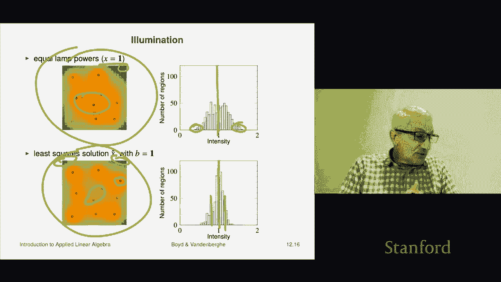

# 【双语字幕+资料下载】斯坦福ENGR108 ｜ 矩阵论与应用线性代数(2020·完整版) - P34：L12.2- 最小二乘法示例 - ShowMeAI - BV17h411W7bk

We're now going to look at some simple but reasonably practical applications of least squares。

 we're going to see a lot more before the course is over but just to give you some very simple ones。

 obviously these are simplified and you can be much more sophisticated in these applications is just to give you a flavor。

Okay， so the first one is concerns advertising purchases okay so the way that works is we have M demographics groups that want to advertise too。

 so here's one for example， 18 to 22 year old you know college students there's one demographic here's another one you know women you know 35 to 40 years old there's another demographic but you have a bunch of these and I think there's standards for these different demographic groups okay M might be tens could be hundreds。

 I don't know what a defense right so each of those groups you want to advertise to and what I do is I have a target v desired be superscript desks which is for desired that's an n vector of target views or an impression now a viewer an impression and by the way you don't need to know this the class is not about advertising obviously so just an example so don't worry' if you don't know what Im in fact it's not like I know that much about this either so fine so a viewer impression as is defined。

As a moment when a person in the target group sees an ad or receives an offer or anything like that。

 I mean it could be on a website， it could be an it could be also it could be anything it's it covers a lot of things so that's called a view or impression okay and so what this is is you've got a vector here。

The target views are impressions， in other words you'd say I want 18 to 20 year old college students。

 I would like to deliver 50，000 impressions to them。

Right in my advertising campaign Okay so I have an end vector S and that that's going to give me it's going to give me my spending in dollars on end advertising channels Okay now an advertising channel is you know it's it's just what it sounds like it's something where you pay them and they they serve impressions right so sometimes it's a publisher。

个逼。On a search engine could be all sorts of stuff could even be traditional stuff like you know magazine ads or something I mean。

 it could be right so those are those are those are so-called advertising channels Okay and then what you have is a matrix M by N R and it's called the reach matrix and what it does is it's going to tell you for each of your channels how many you know for let's say a dollar that you spend on each channel it tells you actually how many impressions you get in your m demographics groups Okay so let's see。

RIJ is the number of views。Per dollar spent， you know。

 maybe in let's say a thousand views per dollar， I don't know， whatever。

 so a view costs you whatever that is a 10 hundred0th of a cent。Yeah。

10th of a cent sorry there you go Okay， so it's it's how many for if you spend a dollar in that channel。

 you're gonna get 100 views right so if you spend 100 bucks you get whatever that is 100000 Okay that's so R IJ is the number of views for dollar spent and so that's an interesting matrix right we can take a look at it It you know looks like this and。

As I would recommend you do always when we get into applications， go slow， sit down and ask yourself。

 you should always ask yourself the following what does a row of that matrix mean？

And what does it call them， So let's answer that question。

 So what does the third row of this matrix mean。Well it's super it's a row vector it's width is n n is the number of advertising channels I have so this is the third demographic group let's suppose it's 18 to 22 year old college students then what this says is it will tell me for all of my channels every time I spend a dollar on that advertising channel it tells you how many people in eat in this group are going are actually going to get an get an impression okay so I could ask you this。

How would I find if I only wanted to target 18 to 22 year old college students right if that's all I ever wanted to do then it's really simple I would scan across this row and I would find the largest entry because that is the one that is most efficient for $1 I will get the most 18 to 22 year olds Okay so that would not be。

 for example， advertising in like AARP or something like that that's American Association of retired persons that would be a very bad choice and presumably there's a shockingly small number there。

 meaning that for every dollar you you spend advertising with them。

 guess what you're not hitting college students Okay so all right。

Let's about let's think about let's say the fourth column in this matrix that's also super interesting so the fourth column is associated with the fourth advertising channel right something like that。

 I don't know what it is so that that's the fourth column and what it does is it gives me it tells me this it says that when I spend a dollar on the fourth on the fourth advertising channel if I read down this vector it tells me how many people in each demographic group I hit。

That's what it is right so you could ask things like this hey for advertising channel number four which group gets the most impressions and we can look it up and find out who it is right youd just scan down here and you'd say oh。

 it's demographic group number 22 and then you'd have to look up what demographic group 22 is right so that's the idea Okay so and by the way I recommend doing this like always right because after a while we kind of get you know this matrices flying around。

 but some of them are going to be huge and it's it's very important you sit down and actually try to understand what each of these what they mean okay。

All right， so this is the matrix R now。If I multiply r times S。

 the reach matrix times the spending vector。Then I get a vector， which is V。

And V is actually the views I get so if I say I'm going to spend a dollar you know on these magazine ads and I'm going to spend you know$2 with Google with these search words and I'm going to do that and blah blahlah and I go on and on okay then what's going to happen is that's S and then I multiply by R and matrix vector multiplication here converts the amount you spend on each of the channels into the number of impressions you get in every in every one of the demographic groups。

Okay so that's the idea and what we would like is we would like V to be some target one right because some people in the analytics department said okay for our product。

 here are the people who are going to buy our product， it's these people， please target them okay？

Okay， so this is the idea and we can do this we can look at when you choose an S here Rs or v desired minus Rs divided by squared m because this has a length of M a dimension of M that is the RMS deviation from the desired views okay。

 and we could use least squared spending so that would be we simply。

We get as close as we can oh I'm assuming here that the reach matrix is tall and has linearly independent columns actually it's super interesting to see what it means for for entry if that were false right or in simple cases right like。

What would it actually be kind of interesting if this has dependent columns R。

 it means that one column is a linear combination of the others。

That's interesting because what that means is that you don't need that advertising channel because。

You can replicate it with a linear combination of other channels。So it all kind of makes sense。

 even the linear independence here makes sense， okay？

Now we'll use least square spending and that says decide how much money to spend in each channel to get as close as possible as measured by the norm or norm squared or RMS value to this target to this target views or impressions right and so that's going to be this thing now at this point I do have to admit something to you just out of honesty that when you do this there's no reason to believe that S hatt is going to be have positive entries and that's going to be very awkward because it's going to say you should go let's say you're trying to hit college student it's going to say you know what not only should you not spend on you know AARP magazine you should actually spend a negative amount now that doesn't make any sense and you're not allowed to do that so however I'm just admitting that I can also tell you this that if you fast forward a couple of classes you will find out that you can actually ensure that the Ss are non negative。

It's not a problem， it's just not something that's in scope of this course and this book。Okay。

 so that's it let's look at an example。I mean， it's very baby example just to give you a rough idea。

 So I have 10 demographic groups and I have three advertising channels。

 My target views vector is this is I want to hit let's say1 thousand1 thousand1 thousand00 Now I believe that the views was in thousands of views so basically I have I have 10 demographic groups and I would like a million people in each group to see my ad or whatever it is Okay so that's the that's the idea。

 and that's it doesn't it didn't have to be， but it's a simple way to do it So we do this Now when you actually work out what is our hat our dagger times times be desired you get this and it says that's how much you should spend。

It's kind of cool， right， because it says。It says mostly you should I mean。

 you should put a lot of money into the third channel。

Much less into the first and a little bit into the second or something like that。 I mean， you can。

 however you want to describe that vector， but it tells you what to do。 So let's actually， here's。

 here's the matrix。 And it's plotted this way。 Let me explain what it is。 These are the groups。

And you can see channel one， channel two， and channel three here。

And let's just let's focus on channel two so channelnel two says that for $1 if you spend on channelnel two。

 here's what you get you're gonna get oh I don't know in demographic group one you're going to hit like 1。

9 that's 1。9 that's 1900 impressions oh we're doing really well on demographic two so I don't know what channelnel two is or demographic2 but I tell you this demographic the people in demographic two are reading watching or whatever or being exposed to channel2 clearly now you're doing pretty badly out here demographic 10 so every dollar you spend on channelnel two basically almost no one in demographic group10 is seeing it okay so this is the idea so this shows this will give you this is actually a pictorial picture of the matrix R。

Okay， now when I actually spend this amount here， I I get， remember my target was 1000。

 so what I wanted was I wanted every all 10 of these to be lined up at 1000。Well。

 here's what happens。 There's a drum role And it turns out this is what I achieve by this spending vector。

 I get this and it's really pretty cool right what I would love is for all of these gray bars to be right at1 thousand0 that mean I nailed it It would mean like you know。

 you go back to whoever it was who gave who gave you V desired and said I got a spending plan and we nail it that's it that'd be perfect right I mean。

 holding thing is silly right because you know who knows how many people actually buy it that's another story but and here's what you can see out of the 10。

😊，You know， we come in a little bit low， I mean， here's like 800 and something and here we come up a little bit high。

 It's maybe 1200 right， but you know， pretty much all around we're getting。

 you know we're between 800 and 1200， you know， usually right and for some of them were really close like there you go。

 demographic 10， we pretty much nailed。 So you know， that's the idea。

 So this is just an example of how you would use least squares in practice and it's kind of clear that it's a little bit obvious Now this one was silly because it's three channels is's just three three variables。

 So you honestly could have tuned it by hand。 But let's remember that the exact same code would work if there were 500 channels and 10000 groups。

Okay， so it would just work perfectly let's suppose the groups were broken up by region。

 so if you said well in the North Bay 18 to 22 year olds you know blah， blah， blah。

 this kind of stuff， you could easily end up with 10，000 groups。

And you could easily have hundreds and hundreds of channels and the exact same code， by the way。

 the code is basically S equals R backslash be desired。

 I'll just write the code down for you right here。 it's it's S hat equals R backslash be desired。

 Oh one thing I should I should be very clear about R is not the R from the QR factorization R is the reach matrix。

 that's why it's got the name R。 Okay， so in which case， by the way。

 if there were 500 advertising channels and 10000 groups， you could not do this by hand。

 I mean you might attempt to， but it would be really pretty stupid。

 frankly because you can just do it and get a beautiful spending thing like that。 Okay。

 good So that's our first example。Our second one involves illumination so what it is is I have a region that I want to illuminate and I have lights that are up up above us and they're in weird locations it's not on a regular grid so here's light number one is right here and lamp number one and it's 4 meters above the floor okay here's lamp number two and it's 3。

5 meters above the floor and here is lamp 10 and it's 4。

5 meters above floor now you can picture what happens right that when you're higher above the floor it means that when you turn that light on it's going to cast a wider pattern of light it'll be weaker but it'll actually cast a wider pattern of illumination okay。

And so there you go that's what it is so AIJ is going to be the illumination in region I so I divide up my ground into regions here。

 which is there's 625 regions because I make them like pixels of 25 by 25。

So I have a you know these are my so I have 625 pixels or regions right and the illumination in that I'm going to have AB a matrix where AIJ is the illumination in region I if lamp J is on with power one and all other lamps are off okay so you go into this thing。

And you do the following， you turn lamp J on to power one， everybody else off。

 so there's a single soul light。You know， spreading light down and you'll get a pattern And look。

 you know what it's going to look like。 It's gonna be kind of circular and it's gonna to be brightest right under the light and it's gonna。

 it's gonna tail off and stuff like that。 I believe the data for this is done using with a very simple standard inverse square models。

 So， you know， the farther you are from the light source， the illumination goes down like this。

 you don't even need to know that。 It's not relevant Anyway， This is how you do it。 Oh。

 and you'll also see that when I said this experiment of heating up lamp J to power 1。😊。

And turning all the others off， you should by now be associating that with that's a unit vector that's what that is And so and that gives a column of a so let's just talk about a for a minute So a looks like this right and a column of a actually gives you the illumination pattern of that particular lamp because a column is associated with a lamp right so presumably all the numbers are not are positive presumably the largest number in here occurs at a pixel which is right under the lamp the source right but other than that know they're all over the some are big some are small if you're very far away it's very small Now a row is also super interesting a row actually tells you is corresponds to a pixel like that guy right there and the row tells you。

It tells you that for all the lamps， how much per watt do they illuminate you Okay。

 And so in this case， we would assume that these guys are close， They're close。

 but they're also kind of high， right， relatively high， relatively speaking。

 So we would assume that the entry in this row， the fourth entry and the eighth entry would be pretty big。

 So with the fifth entry， by the way。 and maybe the ninth。

 And probably the smallest entry would be the third entry in that row， right， So。

 so you can think of it this way。 A row tells you the lighting efficiency of all of your lamps for a particular pixel or region okay。

That's it and I have if I multiply a by x， that means I add the power level。

 you know each lamp is spraying light down and I just add up the illumination levels and AX gives me a vector。

 a 625 vector in this particular example， it's M is 625 and basically it says that this is the illumination pattern you get if you use power X。

Okay， and then I have a target illumination level of B right so maybe I dont who knows I just have some some target I would like it could just be uniform thats simple right but doesn't have to be you could for example。

 say I want a lighting gradient meaning I want to very linearly or finally across this across this region okay。

Okay so here we are what we're going to do is we are going to attempt to achieve uniform illumination okay now we've arranged everything that if you just turn all the lamps to power one that's that's x equals one this is the illumination pattern and red means brighter blue means darker and if you do that you get something like this。

Hardly surprising right what you see is that this is very well eliminated because actually because they're in view of a lot of lights and you turn them all on one to one unit。

 then you know it's going to be overlit and then over here like in the corner it's pretty dark it's dark because well there's not that many lights near it so okay。

And what we have here is this is the histogram so there's a total of 625 you know regions or pixels and this tells you what the illumination is and you can see they kind of center around one that's cool this is our target right we want everything to be an illumination of one but you can see I mean presumably the blue here is thats somebody that's pretty you know your illumination is down to 0。

5 some places have an illumination that's up at like 1。

6 and that's presumably the red places okay so this is the picture now we do least squares。

We just simply do backslash in code or we form the least squares what by the way the same comment I made about the last example holds here that is to say that when you solve this problem you could end up with negative lamp powers which by the way would give you stunningly good lighting it just there is no such thing you can't do that but we'll skip that and pretend it doesn't it did not happen in this case and what this does is it tells you it tells you what to do with your lights and it's actually pretty cool I don't have that here but what it says is。

This light should be a little bit brighter than one。 And these guys。

 you really got to back off from one right And the reason you back off from them is because they're in an area with a lot of lights and they don't need to be that bright。

 Okay， so you're just sort of compensating for all that I'm right now I'm anthropomorphizing how this works right So that's actually going be an important part in least squares is you're gonna be able to do all sorts of crazy stuff And people would say。

 how did you do that， What happened or something， And then you can tell a story and you sometimes it's better to say。

 well to pick up a story Now the truth is what you really is You just did least squares okay。

Now when you do that visually you can just see that that's a whole lot better than the one above right and the one above you see hotspot in the middle and cooler spots here。

 well you can't avoid some cool spots like this， but the hots spots are kind of gone and sure enough look at this if that's if that's our target you can see that you know actually a a whole lot of that region is within you know you know between 0。

85 and 1。15 so you went from these things here where the errors were you know easily 25% down to one where they're like 10% it's pretty good okay so again this is just an example。

 but it should give you start you thinking about you know applications of least squares of which we will see many many。

 many， many so good。

