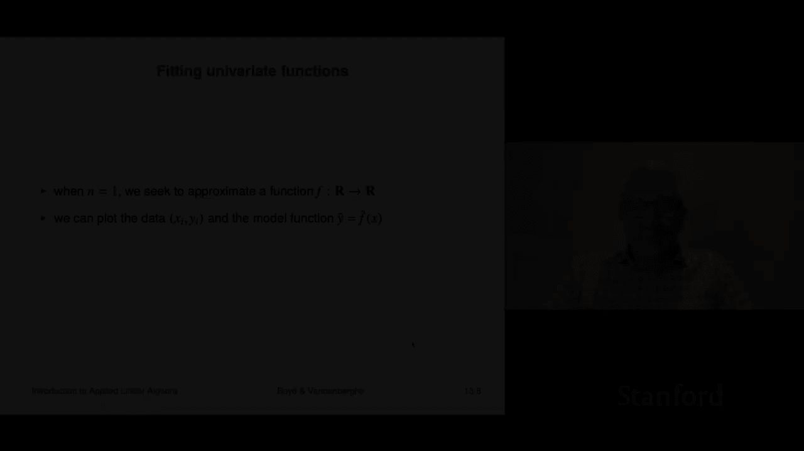
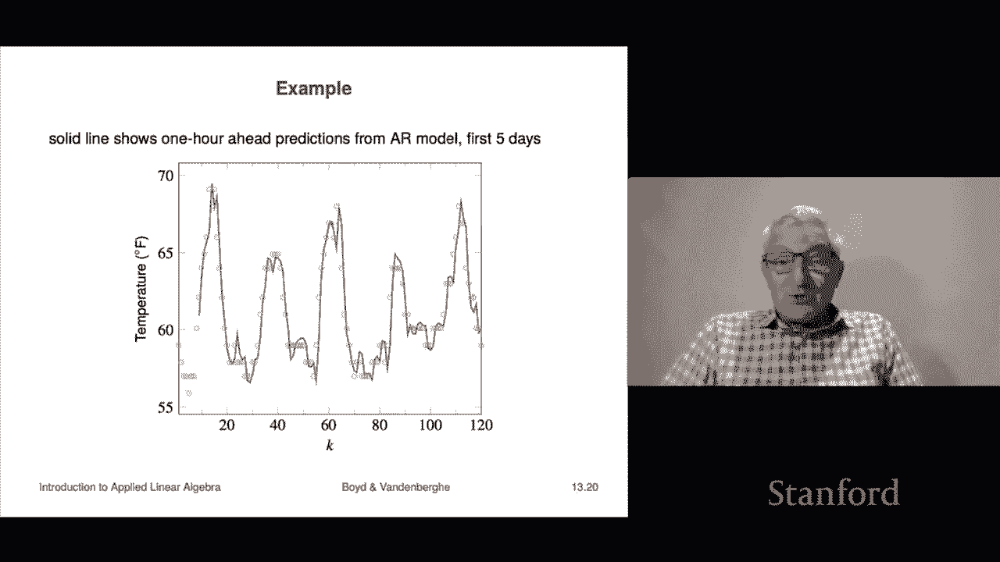

# 【双语字幕+资料下载】斯坦福ENGR108 ｜ 矩阵论与应用线性代数(2020·完整版) - P36：L13.2- 单变量函数拟合 - ShowMeAI - BV17h411W7bk

We're not going to look at the topic of fitting univariate functions and that means basically n equals one So the so-called feature vectors or independent variables X is just a scalar Now what that means is we can actually do a scatter plot of the data So for example。

 I could just I could just this is X this is y and my data might look like just a bunch of points like that so I can I can plot them like that and that's a scatter plot Now when I create a model function Y hat equals f hat it's a function and I can evaluate that for every value x so I can plot a curve right I mean so it might look like this there that would be my this is the f hat and so we'll be able in this in this case where the dimension of x is one So n equals1 your eyeball can actually judge how well we do of course we'll also check things like the RMS error and things like that but your eyeball should be able to take a look at it and say we're doing a pretty good fit here okay。

So beyond the constant fit， which we saw last time。

 we're going to look at what is you know maybe the the simplest fit after that。

 it's going to have two coefficients， so p is2。And the first basis function is one once again it's the constant function one and the second one is just x like that and so what that says is that your model has this form。

 it's f hat of x equals theta 1 plus theta2 x so that is that's the model and of course what we have to guess is or choose our theta1 and theta2。

Now in this case it's like the previous one with the concept model it's very you know we can actually write out what a is a is this now let's remember what these are the rows here represent different data points in my data set then the first column tells you to evaluate your your first basis function at those points but you know what that's always one so that's why you see all the ones here okay and then the second one I simply just take X and I just replace it here so that's x1 x2。

 x3 and so on。Now， you know that's an n by two matrix I can form a transpose a and invert it and I don't need to use some fancy numerical thing I mean I'll say a little bit about the minute I wouldn't hurt me if I did。

 but the point is there that a two by two matrix is you know's that's something we can actually work out the inverse of you know it that's one of those things you're just supposed to memorize like the quadratic formula and so you can actually work out。

What a theta hat is and it turns out that you can write the predictor in a very specific way that's actually highly interpretable yeah and I should add you don't have to do this this is just for interpretation the truth is there would be absolutely nothing wrong with the following code if you were going do this is first build that matrix step one step two you write theta hat equals this matrix and I'm writing code now first allll write it in noncode a pseudo inverse times and here y yd I think it's what we call it right that's the data the vector of data outcomes okay now in code you would maybe depending on the system you're using it would look like that it would be be some kind of backslash right right in other ones there would be some least squares method you would find or something like that and you would call that that special function okay so。

There's absolutely nothing wrong with doing this so working it out and having it a so called analytical formula for it is。

Just for interpretation， is it offers absolutely zero advantage in any other way， right。

 just for interpretation。Computationally， certainly this is just as good as anything else， okay。

Now it turns out it looks like is it super interpretable， which is cool。

 it says we are going to predict the following。Well let's let's take a look at it so first over here it's gonna say take x and divide by the average and sorry subtract the average of x from it oh and by the way。

 look at this， you actually are going to divide by the standard deviation and if you see the part that I have box here it's the it is the independent variable x minus it's average divided by its standard that's super interesting。

 that's a z score right so that's this is a number and it kind of typically is between minus1 and plus1 that's what it is and it's highly interpretable right so if it's plus0。

5， it means that you are about 0。5 standard deviations above the mean what it means and then it says you're going to multiply that by the standard deviation of y rh is the correlation coefficient between x and y and then to this thing this is the part that depends on x and then to that you a constant the average of Y and so it's super interesting if x and y are uncorrelated。

Then rh is zero and this whole second term this just goes away and it says it says here's your best straight line fit。

 the constant model， In other words， you just take theta2 equal to zero Okay and you know that makes perfect sense if two things are uncorrelated。

 it says that when one is high you are you have no right to make any claim about what the other one is doing and that's exactly what it says you might as well just guess a constant if the correlation is high like rh is near one。

It basically says that whenever this is positive so should be your prediction should be above your average value。

 so this is the idea it's actually I mean it's just a nice formula to interpret。

 but as I said computationally it offers no advantage of any kind。ok。That gives it oh。

 and this is called the straight line fit because the graph of that is a line。

 That's an affine function， of course， right， so and some people would say it's a linear。

 this is a linear fit or something like that。 And as we know that's not a linear function and so on。

 So that's wrong， but whatever just give them a break。

 I suppose you could say something actually you could say。In the right social circumstances。

 you would say something like hey just for the record， that function is not linear， it's aine。

 but it's cool if you want to call it linear， keep going， but I know what you're saying， okay。

 so and that's I think why this is called the straight line fit because the graph is a line or it's an a fine function。

Okay so here's an example， this is one that should basically kind of be burned into your mind whenever someone says least squares data fitting this is the picture you want to see and so here's X which is a scale of remember so we're only looking at one feature and here's why now and they're a little bit faint but you can see the little green dots those are our data points I don't know how many I have doesn't matter 50 or something and the blue line is the so-called straight line fit right。

And now what's being minimized is each of these points has a height or a depth above or below this plot right so these are what I'm drawing with my pen right now。

 these are the residuals right because the that's the data point and then from that you subtract the value of the model for that point but the value of the model is the height of the line because that's what I'm drawing is FHAP so what this line does is it minimizes the sum of the squares of the well of the little vertical lines that I've drawn and the length of the little vertical lines is the magnitude of the residual so that makes perfect sense and even actually just this is quite useful in a bunch of applications。

So here's one， it's actually a very important part of like all the finance and it goes like this。

In that context。X here， which is a scalar， is the return of the whole market。 Let's say daily。 Okay。

 so you know， it's either it's plus 。01 means it went up 1%。 It's- 。02 went down 2%。

 That's what it is And then why is the return of a particular asset right like so for example。

 for every day I would get how the I mean， it doesn't really matter the Russell 2000 or whatever it is did that go up or down a percent or whatever it is And then I could find out well how did Apple do or Google and that would be Y right And I would get a whole bunch。

 Well， every day I'd get a pair X and Y。 So those would be be the return of the market and the return of let's just say Apple okay so。

Now what we're going to do now is make a straight line fit that essentially predicts the return of Apple。

From the return of the market and that's usually written in it's an affine function， of course。

 but it's usually written in a specific way and I'll show you what that is it's why hat。

 that's our prediction of the return of Apple is equal to the following。It's equal。

Two it's an affline function and it's written several ways。

 so one is this itss it's written as a risk free rate。Plus alpha。 Now。

 riskfr is something like you US Treasuries。 It's supposed to be a riskfree way to。

 it's the riskfree interest rate， right， so it would be the daily one。

 that's extremely well approximated by zero right now。

 but okay so that's that's the risk free interest rate plus alpha and that's that's instead of using theta1。

 they use the parameters alpha and beta plus alpha。

 And then plus beta times now x minus mu market mu market is the is the mean market return。

 Okay by the way， for daily stuff， that's just about zero。 it is true that the market goes up。

 you know， whatever 15% per year。 but if you divide that by 250。

 you'll find out that it's a pretty small， that the amount it goes up each day。

 the mean is relatively small。 but anyway， that's the mu market。 And so so if that is positive。

 it means that the market went up more than its average that day。 if it's negative。

 it means it went down or not as much as it average。

Then beta is what multiplies that to form the prediction right so okay so these are referred to as literally like in this case it's Apple you would say this iss alphas I'm sorry Apple's alpha and Apple's beta and by the way I should say there's not people use some slightly different formulas。

 they divide by you know I don't know they normalize things so there's slightly different definitions of these but but always the rough ideas the same oh I should also say that some hardcore economists would argue that alpha is zero that there can't be any any return you know that alpha has to be zero and they would argue that if that wasn't the case you know thatd be arbitrage and blah。

 blah long complicated arguments I can guarantee you that many many people working in hedge funds will tell you that is false empirically their alpha is not zero so this is so。

widelyidely known that people just refer to the maybe not the alpha because some people even dispute its existence。

 but certainly the beta everyone agrees on and you just say hey。

 what's the beta of Apple with the market I don't know what it is right but the beta's range rule about you know point。

Mean 0。3 to 1。5 I don't know something like that right but this is a rough idea and it's actually so people just say that they would say oh yeah well that's a you know that's the beta with the market or something like that So okay so and this is nothing but a straight line fit the only thing you're doing is you're making an aine model or straight line fit to predict the return of a particular asset you're predicting it from the return of the whole market right so that's that's the idea right so if beta is one you know basically says if the market's up 1% you'd kind of expect you would expect your your asset to go about 1% too。

Okay another use of this is in time series so here actually what we do is XI is like a timestamp and for simplicity we're just going to take Xi equals I and that means that basically you have sampled a value why at equal at equal times they don't really have to be equal right for example in trading and stuff like that it would be on trading days and you know so so it would go like you know Monday Tuesday Friday and then it go jumps to Monday again so it's not actual equal time in some cases it is equal time right if you're。

If it's something like you're looking at the temperature or rainfall or humidity or something like that。

There where there's no weekend well there's a weekend。

 but it's not relevant then you would these would be evenly evenly sampled Okay and so when you form a model a straight line model for a for a case where X represents time and and in fact in this case we're just going to make it I right which literally means the number of periods that's called the trend line it's very cool and oh if you subtract the trend line that is called the detrened time series right so it makes all this makes perfect sense right so and theta2 you would say is the trend coefficient and it's it is literally it tells you that this increases。

 I mean， if theta 2 is positive， it tells you the approximate increase in y when you go from you know Y I to y I plus1 which is kind of cool right so thats all highly interpretable。

Okay， so let's look at an example。So on the left what you see is if you look at the data。

 those in those little greening circles they're hard to see here。

 but you can look at the book or something like that or you're not that hard to see that's the data and the blue line is the trend line it's nothing but an aline model it's absolutely nothing more and you can see kind of cool stuff you can see that for example well there's some weird oscillations in here but you know kind of more or less looks like the trend line in fact you can see some interesting things this is petroleum this is world petroleum consumption and you can see things like look it's a little bit below the trend line in 2008 because there was a huge financial crisis where just as an example。

And I'm not sure what some of the others but I'm sure someone who knows about this stuff could tell you could tell you stories about why it's above or blow that's a trend line Now what you can do then is you subtract oh by the way。

 so all sorts of interesting things the slope of that trend line in this case has a beautiful interpretation it is literally it's our prediction of the number the increase in the number of millions of barrels per day that are used when you when you move forward per year that's how much consumption is increasing okay now if I subtract the blue line from the from the green data。

I get this and we've done that， but we've also drawn we've drawn lines in between things to just just to make it easier on the eye just so you can see it and you get something really cool that looks like this now。

It's very cool it shows you in which year how close were you to the trend line right so in like these years you were pretty close right it was like pretty close to the trend line here you were below here you're above I don't know why but there's probably some reason for that so that's it and。

And here you could see other stuff like there's some weird cyclical stuff and I don't know somebody might mumble something about a business cycle or something I don't know。

 I'm just making that up so。But so this is very， very common as you would see socalled。

 So when someone tells you， oh， you know， here's the data and here it is deted。

 what it means that they fit a straight line model and they subtracted the straight line model。

 And so what you get are the fluctuations around the straight line model。 So。

 and this can reveal interesting stuff。 And it's a whole lot easier to understand。

 I think this plot than， well， no， this one is a good one to see first because it says basically to first order。

It's increasing linearly it's a pretty good fit and what this shows is the kind of the deviations from that and tells you it reveals other structure like when is it above。

 when is it below and so on。Okay。Well， if you can do a straight line fit， you know。

 the next obvious thing is to move to polynomials or something like that。

 but we'll see this of you have lots of flexibility in how you choose your basis functions。

So here we're going to take f of x is x to the I minus1 for i equals1 to p。

 so that means that f1 of x is equal to x to the zero， which is one， that's our friend。

 the offset in the model F2 of x is going to equal x to the1 which is just x you know f3 of x is going to be x squared and so on now when I form a linear combination of these functions with coefficients given by theta I those are my model or parameters or coefficients。

 I get a polynomial of x right so here F hat is exactly this it's theta 1 plus theta 2 x plus up to theta p x to the p minus1 because taking I'm taking p to be the dimension the number basis functions I have okay。

So it's just a polynomial And in this case， that matrix A which remember what it is the rows tell you about the different data points and the columns tell you about the different features right so for example。

 the first column tells you about this first feature sorry this first basis function the first basis function is just one and that's why you see all these ones。

 the next one is just x1 x2 and so on that's because of this guy here and the next one would be the squares of them and so on。

 So this matrix comes up a bunch of times it's called a van demond matrix。

 I think we've seen it before。 You don't have to know the name doesn't matter。

 It just happens to have a name。 it's named after a mathematician van demond and we've seen it before in。

 for example， polynomial interpolation So it's not surprising Okay and so the idea is if I put theta here and I multiply it by a times theta what I'm going to get is actually a polynomial evaluated at the points x1 down to x in so。

So and then we just use you know， as usual the it's going to look like this。

 if you're going to write code for this， it would start like this。

 the first thing you do is you write a little code snippet that forms the matrix A so you'd form this matrix and depending on your language you could do it all sorts of clever ways and the truth is in some languages you'd have some function called vandermond and it would literally form a Vdermond matrix for you with the values you'd have to give it the values x1 down to XN and then it would simply form a Vdermond matrix but again not relevant you form the matrix that's a little snippet of code。

And then you simply do this。 And now I'm writing code， I'm not writing math right now。

 I'd write theta hat equals a。Back slash and then it's going to be yD which is our vector of outcomes right so so that's what my code is going to look like in fact that's what your code is going to look like when you do this and you will be doing this is they'll be literally that's the template the template is as a section on top that says form the matrix a which literally says evaluate Fi at Xj you know and so on。

I said that the other way wrong， it's actually evaluate at FJ at XI sorry okay。

 and then then it's kind of a letdown at the end that's the actual line that does the actual fitting and then you might do things like plot the results or try to figure out or look at the RMS error or things like that。

Okay so let's look at an example so here I just we have 200 points they are the green dots here and you can see it's not like they're completely random all over the place。

 you know they're kind of high here a bit low here and so on and so here is the best quadratic fit that corresponds to p equals3 I have three coefficients I have theta 1 which is the constant theta 2 is the linear term and theta 3 is the quadratic term and so here you can see this this thing kind of curves down so theta 3 is negative in this case right that's our interpretation of this。

Now here's a fit of degree6 and that means I have p equals 7 I have seven coefficients and if you look closely at it you'll see that is its it's actually capturing some real nuance in the data for example it's kind of going up rapidly has a little weird bend there goes down rapidly kind of comes up here and so you know it's doing pretty well and here it is degree 10 I mean here we're really hugging the data pretty closely in some cases and here it is at degree 15 and its now it's catching all sorts of weird stuff in the data okay so so this is just a picture to show you what it looks like you can do this this is like  five10 lines of code you could do this yourself and you'll get results like this by the way。

What this brings up immediately is the question is what degree model should I use okay and we're going to answer that in maybe the next in the next section or or zoom we're going to answer that question the answer that question is not totally obvious right because if you simply wanted to do the best you could on fitting your data that you've got you should use as big a degree as you can handle we'll see what the problem with that is soonm but that's later。

The final topic in this section is the idea of we've already seen regression and then this is so-called linear in the parameters data fitting by least squares and they're very closely related in fact the truth is they're really kind of the same thing with two different notation conventions I'm using mostly the conventional notation although I think my statistician friends still cringe when they see some of the things I write down they don't like me writing the matrix a for example for the coefficient matrix but whatever it's pretty close but what I want to do now is just elucidate what the differences between a regression model and one of these linear in the parameters model the fact is they're just not that different so here's the way it works recall the regression model looks like that it is basically it is a it's an affine function of the feature period so here highly interpretable for example beta 3 tells you how much x3 the third feature figures。

In your prediction， V， the so called offset， That's a number。

 which is our prediction when the features are all 0， when x is equal to 0。 Okay， so this is。

 this is the regression model。Now we can make a regression model fit our general framework all we use is the following basis functions we use F1 is one that's we've seen that many times so far and then of x is Xi minus1 so literally the fs are you know the first one is one the next one is is x1 that's actually what we would call f2 of X is X1 and so on and so。

In that case， you get exactly this， our model would be a linear combination of these basis functions as theta1 plus theta2 x plus theta although way have to n plus 1 xn。

 and then we would simply write that as x transpose theta remember that that's a slice that means that the second through the n component they're the ones that multiply X you see directly here and then theta1 is our offset that's the same as V so what we can see is that we can fit we can represent regression in our general data fitting in our general data fitting of framework here so regression is a special case of linear in the parameters least squares fitting。

Now it turns out we can the opposite is true in a weird way that suppose we have a general fitting model that's f hat a theta 1 F1 of x plus up to theta p Xp and it's extremely common to have the first component equal to one that's called an offset in the model or a constant in fact it's so common that maybe a lot of sometimes a lot of systems that do this stuff for you to assume it they don't even say it that just say there's an offset and you actually have to call the methods with basically with a minus minus no offset to actually not have the first component B1 but okay now we can think of this thing as a regression model but not using X actually using this other vector here which is f2 of x up to fp of x and we think of those as transformed features and then so the point is that our general model is can be thought of as just regression but what we do。

We think of the F's as transform features or feature mappings or something like that so and that's another that's another way to think of how we do this kind of general fitting is we think of thank you in that case you call the x' is the raw features right and then the F's do they transform them like for example if you're fitting a polynomial they would take the fourth power or the sixth power or something like that。

So that's that's called data transforming or feature transforming and then you simply do regression so they're basically the same thing they just have slightly different notation systems and I should say that both notation systems are kind of widely used。

Next topic is is a so-called autoaggressive time series model Now this is this is just your first glimpse at this。

 but it's very powerful stuff。 it's very cool So have I have a time series Z1 Z2 I'm going make these these are going be scrs right now okay so I just have a time series doesn't matter what it is it could be the well we've seen a couple of time series right we saw world world Peroleum consumption right and they're the index represents year it could be hourly temperature somewhere it could be all sorts of it could be the price of something or it could be anything at all that's all it could be in some kind of economic thing like it could literally be the GDP of a country。

Or're a region， okay？It's a time series a lot of time series of course and so we're going to talk about now is something called an autoregressive model autoregressive means that you're going to make let me say what the model is the model is this it says we're going to use the notation Z hat subt plus1 Z hat t plus one is to be interpreted as the prediction if T is the if t is now t plus one is next step so this is actually people would say this is the one step ahead prediction。

Or it's the prediction of the next value。 by the way。

 that's that can be enormously useful in practice。 I mean。

 it doesn't doesn't take a lot of imagination to imagine how useful this would be if， for example。

 you could predict what the temperature is going to be in the next hour or something like that。

 right or what electricity demand is going to be in the next hour or what the price of something is going to be you know。

 in the next one minute or one second right， So if you can make a prediction like that that has a lot of value practical value Okay。

 so how do you make this this one step ahead prediction well。We're going to use well， you know。

 you choose it， you can call it regression or you can choose it a linear parameters model。

 but it's going to be this。 it's going to be theta 1 times zt plus theta 2 times zt minus1。

 although we have to theta M capital M M is a mnemonic for memory in the model right so for example。

 this would be people would refer to this I'll show you what an A R2 Sometimes people put an argument in there to say what the memory is that's where you give capital M And that looks like this it says Z hat T plus one。

Is equal to theta 1， Z T plus。Theta 2 times Z T -1。 there it is。

 And the model coefficients are theta 1 and theta 2。 and it's actually beautifully interpretable。

 You simply say， I am predicting what the next value is going to be and someone says。

 what's your prediction And you go， well， it's simple。 It's theta 1。Times the current value。

Plus theta 2 times the previous value like so if this is daily。

 it's like I will predict tomorrow's value to be a number theta 1 times today's value plus a number theta 2 times yesterday's value right and so and you can understand why this would be called the memory because basically it says that your prediction has to remember the last you know whatever approximately M values of the time series。

 Okay， so that's called an autoregressive model。 I think it's called autoregressive because it's a regression model。

 but we'll see that both the regressors and the or the features x and y come from the same thing。

 there're z's。 So that's why the auto is in there。 Okay Now we'll choose actually not beta here is a typo we're gonna choose theta to minimize the sum of squares of the prediction errors and that's just gonna be these。

 So then let me point out what this is Z hat m plus1 minus Z Zm。That's basically。

 this is our prediction of what。The M plus one value of that time series would be based on only Z1 z2s up to Zm period okay。

 this is what it actually was okay， and so this is like an error here that' that's your one step ahead prediction error and this is the sum of the one step ahead prediction errors across your data set。

Okay。So it turns out this just goes straight in the same form it's just it's the same linear in the parameters model we use y which is the outcome is simply is literally it is the next value is what it is well with the right indexing and then Xi we take to be these little snippets of the past the past m or M minus1 values or something like that right so that's that's how this works and so this would allow you to build up that matrix a then you'd do least squares and you'd get your coefficients theta。

We'll look at an example， its going to be it's going to the data is this。

 it's the hourly temperature at LAX， the airport in LA， in May 2016。

 and we've got 744 hours worth of data。Okay on that data set， the average is 61。

76 degrees Fahrenheit and I apologize to people who come from countries that are civilized and use you know actual you know units but sorry think of it as adding kind of a nice cultural flavor to it okay and the standard deviation is three degrees Fahrenheit right and so actually this is is very nice this is。

That in May 2016， if someone walked up you on the street and said。

 what's the temperature going to be tomorrow？You could just say， I don't know， 61。76 degrees。And。

And the point is the RMS error of that guess is only going to be about three degrees， right。

 that's why。It's kind of nice to live in LA I mean that's a little bit cold okay。

 but you know it basically it says it doesn't change you know。

 it doesn't change that much right okay？Now we can compare a lot of other predictors right here here's actually an extremely sensible predictor it' someone says。

What is the temperature at LAX in the next hour and here's a completely reasonable thing you say what is the temperature now and they say 71 degrees and you go it'll be 71 next hour that gives you an error of 1。

6 1。16 degrees it's not bad right So if you guess it your RMS error is 1。

16 it's actually not bad it means that it means that you're usually within about1 degree you might occasionally be off by two degrees3 even but probably a lot of times you're within one or less right so you wouldn't be surprised if you were only off by half a degree here's another extremely interesting one Z hat t plus1 you say what is the temperature going to be next in the next hour Here's one you say well I don't know that's 2 PMm what was the temperature yesterday and that's gonna be my guess because the temperature is you know roughly diurnal meaning it kind of goes up and down you know at the same at 2 PM it's kind of about。

Same it's cold at night， warm， late afternoon， so on， Okay， so this one。

Z hat t plus1 equals z sub t minus-23。 That gives an RMS error of about two degrees almost two degrees。

 So it's better than just guessing the mean， you know。

 just a constant right Now if you use an AR model with with8 a memory of8。

 you get an RMS error of about one degree under one degree right so you're actually predicting。

Pretty well， I mean， I guess right， I mean， of course。

Real temperature prediction models are way more sophisticated than just this。

 but nevertheless this is a first cut it's very simple you could write the code for it it's about 15 lines absolutely at most to write and it's pretty cool and it's not clear how to you know how you would do that and it beats these two other simple ad hoc ones。

In other words saying the temperature next hour will be simply what it is now or what it was 24 hours ago well reference to one hour from now right so those are two reasonable by the way。

 these kinds of simple models these are very good things to do as a practical matter you should never jump into something fancy like an AR model never without doing the simple obvious stuff first because。

Well， for many reasons， right， one is if the people you're working with or for have any sense at all。

 which is hardly a given， but if they do。and someone restes in their office and go oh man。

 this is crazy， I can predict this within plus minus you know within 15 cents it's crazy that they should immediately ask and you could flip the roll so this is you somebody running into you all excited and you'd say cool that's great I'm glad you can predict it within 15 cents and you say can I ask what's the standard deviation and if the answer is like it's 14 cents then you I don't know get rid of the price and something like that no but the point is that you would always do the simple stuff first just if for no other reason to see how much the fancy stuff is buying you right and of course yep be emotionally you know prepared for the fact that the fancy stuff doesn't buy you much at all in which case you quietly go back and someone says and you say here's my model and you go that's predicting a constant。

But we pay you a lot didn't we don't pay you to come up with a constant I could have said the temperature of 61。

76 degrees and at least then you can say， well you know I tried， I looked at it， I analyzed it。

 I made some fancy models some of the fancy models were a little bit better but not enough better to justify it so that's why we're going constant and。

Hopefully though they would understand that。Okay， so let's look at an example so so here is what we do is we take this AR8 model and we fit it and now I'm just going to show you for the first five days so that's 120 hours going to show you both the observed value and the prediction so the green ones are are the actual observed values and I think what we can conclude is that they're actually integers like when they said the temperature is like you know 55 or 61 so okay and the blue one is the prediction of that temperature。

Based on the previous eight hourly temperatures， right， And I tell you look at it。

 your eyeball says that's that's like pretty good。 That is that is that is not bad。

 So that this is what this looks like。 This is actually， I mean。

 these are some of the models that come up very quickly and can be very impressive in the right in the right settings right where where you just fit an AR model to a time series And boy。

 you can impress your friends and your coworkers and things like that。

