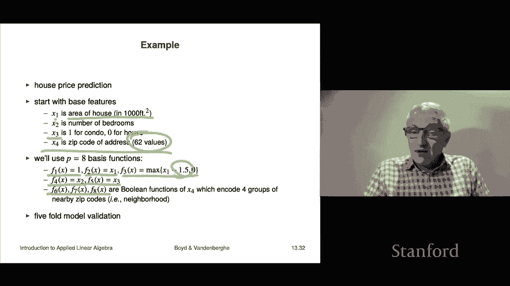

# P37：L13.3- 拟合效果验证 - ShowMeAI - BV17h411W7bk

We're not going to talk about a very important topic in building prediction models。

 which is validation。

The basic idea is this the goal when you're building a model， a prediction model of some kind。

 your goal is not to predict the outcome on the given data after all。

 you know exactly what the outcome is so you don't have to do any prediction at all or rather you have an excellent prediction of it So in fact。

 what it's really about is you really want to be able to predict the outcome on new unseen data so or for example。

 you don't want to build I mean you might want to build a model but you really want it to work next week that's that's basically the idea now a model that makes reasonable predictions on new unseen data is it's said to generalize well in other words it worked well on the data I use to build a model and now it generalizes to this new data which it has never seen before。

Now， if it fails to make good predictions， you would say that the model is suffering from overfit。

 although there are a couple of other reasons why it may perform poorly， okay。

 so this is the actual goal。So a very simple way to simulate how the model will really be used in practice is called validation and so the way that works is it's really very simple and it looks like this you're given an initial set of data and what you do is you remove part of that data people often just choose you know like 20% of the data or something like that。

 30%， 10% and they hold that data which you really know that you that data。

 you know the values of white and you you put that aside and you kind of hold it in escrow so it's just sitting there waiting。

Then what you do is you build the model or fit the model and the slang term for that is to train the model on the training data set。

 that's the data from your data that you did not hold in reserve that stuff you're holding in reserve is called the test set or validation set。

So what you do is you train or fit the model based on your training data and then what you do is you now do a very good simulation of what you really want the model to do。

 which is to see is to work well on data it has never seen and so what you do now is you take the data that you have but what you did not use to build the model that's the test data and you simply try your model on that and then you then because you know what the actual outcome is you know what the outcome is and you also you have a Y and you have a Y hat and now we can assess how well we did so that's the idea I mean its actually a very simple idea。

And so you can do several things here one is you might check the RMS prediction error on the training in test sets I mean it would make you feel very confident if they were about the same you would you would not expect them to be the same。

 but you'd expect them to be about the same typically you might expect that the test data RMS error to be a little bit worse actually sometimes it's much worse but the important point here is that it's actually the the RMS error on the test data which really matters sort of in practice right now if this all tests out you can guess the model will generalize now that's not a guarantee by any means but it's a good guess right so if you go to someone and you say I'm able to predict demand for this product one week ahead I can get it basically around plus minus5% and then someone would say how do you know that and the answer would be something like well I get it very carefully I took all the data from the last。

I took the last， you know， I took the first year and a half of that data and I used that to build my model and then I took that model and I tried it on the last six months of data。

 which might when I trained or fit the model parameters。

WellI never used never saw that data so that's as if that's actually an honest test because it's actually testing of it and then you'd say and you know and there I do plus about plus minus 7% and that would be a very happy outcome and then someone would say to you well。

How about next year how do you think you're going to do there the answer a bit tricky you could an honest answer well you could say something like this。

 well I would guess or expect to be around plus minus7% right that that's reasonable。

And they'd say but can you guarantee it and the answer is no you can't you absolutely cannot so okay I should say that you'll see all of the topics we're going to talk about here you you know from a different point of view and in much more technical detail in a statistics course or machine learning course。

 but the ideas are all accessible even without those concepts。ok。

So validation is actually super useful because it ends arguments about you know which model is better right so if you have you have two competing models and in fact it's very common for people to produce 50 or 60 different competing models we'll see a lot of that later and then the question is which is better an example would be should I fit some data with a polynomial of degree three or degree eight。

And so the point about that question is it's not， it's nothing you can answer by looking at just the training data alone。

 absolutely another because the degree A polynomial model is going to fit better than the degree two does not mean it's going to fit better on next year's data or whatever。

 you know， future unseen data。So that's kind of the idea there you could also have radically different types of modelss and you would say。

 you know， should I use this model that model and this would actually validation would answer that question。

 right？And you use what you do is among all your candidate models， you use the one that has。

 I mean the traditional， the simplest way to say is the one that has the lowest error。

 but you might also factor in other things like all other things being equal you probably want the model to be simple right so for example。

 if a whatever if a10th order polynomial model gave you the slightest improvement in the test error over a cubic you'd probably choose a cubic okay so as I said in other courses you will see this treated in more detail and things like that more formally。

Okay， so let's look at an the example。So you'll we there's10 there's 100 data points actually 200 100 of them are the training set and we use that to fit a quadratic a degree six polynomial a degree 10 and a degree 15 polynomial now what's showing here is another set of 100 data points which is the test data point and actually just if you run your eyeball over it looks pretty good I mean you know this is and it's honest right that here those that blue curve is making a prediction on data it has never seen before so it's actually it's an honest simulation of how of what you want a prediction model to do okay。

This is sort of a typical yeah is this is a typical situation So here for example。

 I have an increasing degree in my model Now by the way， a model of degree。

 you know 10 is also a model of degree 15 because you just the last five coefficients you just make them zero what that tells you is this is that as the degree increases your training error just gets it just goes down it gets better and better because well it could also stay the constant right because the point there is if I can fit something with a you know a 10th degree polynomial I can't fit it worse with a 15 degree polynomial I can only do better okay so the blue curve。

Here shows you the training error and sure enough it just goes down。

A lot of times common sense tells you that what you're looking for is the I guess it's the traditional knee of the curve knee of the curve means something around right here where the marginal improvement is not is not is not good okay so but validation makes this pretty clear so the red。

Shows you the performance of the model on data it has not seen okay and let's see what that looks like well for order zero that's a constant model。

 by the way， one， two， three， four it's pretty close and what you see though is very interesting。

The sixth order， sixth degree sorry， seventh degree model is actually。

Is actually worse on the test data than the sixth degree。

So that's not something you could guess or know， I mean you just simply have to try this with the data to see that and it's pretty simple you know you can understand why and out here it's like considerably worse right so that here if I fit with a 20 degree polynomial I have an RMS error of you know 0。

2 whatever 0。21 right on the training set。And yet on the test set I'm almost double that at  point。

4 right so the old school rule of thumb might be to say you know it's order it's degree six that has the lowest test error。

 but honestly you know degree4 looks pretty good to me too and the reason is it's not a whole lot it's not a whole lot worse than that and it's a simpler model so okay so this is the idea these are very important things you're going to see this in other classes or you may already have seen in other classes。

 but you you will see this in other classes let's just leave it that way。Okay， now。

validationidation also called out of sample validation right there are many variations and extensions on it and I'll just mention one other one and this is another one probably the second most widely used just it might even be the most widely used cause cross validationidation and it goes like this I mean so this is how it works for is what you do is you take your original data and you divide it into 10 groups by the way very often this is done randomly so you just you randomly take your data and assign them to 10 different groups。

Then what you do is the following for and these are called folds of data。

 what you do is for each for equal equals one to 10。

 you fit a model using all the folds except the IT one。

Okay and then you test that model on the I fold and so this is an honest test in the sense that you are building a model based on some data and then you are evaluating on data it has never seen。

 which is after all what we want a model to do so so here you get 10 different honest tests of your model honest test means you are trying it on data it has never seen。

Okay， so this is very common fivefold as means you do this and you chop it into five parts tenfold and by the way there's lots of other methods。

 but these are these are kind of the ones you might hear about the most now it also it's actually also very good sort of engineering because you get to check。

Do some common sense checks。You get to see what you do is you look at the test RMS errors and if they're much bigger than the trained RMS errors。

That's a red flag。The other thing is you can look and see if the test and train RMS errors are consistent then that allows you to guess with considerable confidence that it's going to work that that model is going to work similarly in the future it's not a guarantee so I remember once in class I ask I remember asking I said like oh but that would never happen right I mean you once you do cross validation your model' is going to work right and it was silence and then somebody raise their hand and said no that could happen。

 you could do full cross validation and then all of a sudden your model could work very poorly and I would say。

 well what would you do when the CEO comes into your office。Pounds the desk and says， you know。

 do you realize what the consequences of this are， blah， blah， blah。

 and the student looked up and just and the CEO screams and says what happened and then the student just looked at me and said things changed。

So that's simple right so if you're making a model of like for advertising or demand of a product or anything anything involving kind of people and social systems and economic systems。

 of course they can change right Newtonian mechanics by the way。

 doesn't change that often but okay another story。Let's look at an example and just see how this works so this is。

A super simple example， right， But nevertheless， it's going to show you how this works。

 So this is this really dumb thing where we are going to predict house price in thousands of dollars based on。

a mere two features which are the area in thousands of square feet and the number of bedrooms okay and we took 774 houses。

 this is in some place I forget where over some time period you know not expanding you know like10 not covering tens of years but you know maybe a year or something like that。

And that was divided into five folds of 155 sales each completely just at random Okay。

 then let's look at what we did So in the first one。We we removed fold one， that's 155 houses。

 house sales， we removed it built it on the remaining whatever 774 minus 155。

 So 620 odd you know about 620 things that's how we fit our parameters of which we have three by the way we have the offset we have beta 1 and beta 2 these are very very elementary simple models right okay and here are the results these are my three parameters that's my training test and that's my test sorry that is my training RMS error and that's my test RMS error This is exactly what you'd expect。

 you'd say whoa it's 74 and then on the test you don't expect it to be as good as the train or whatever but same ballpark So you see 7178 and you go y that's good but if someone says look before we put this model into production I really need to be more confident than just this right you know so then what you do is in fold2。

move a different 155 ones it's we remove full to fit the model and here's what we get and you know what's kind of cool is the parameters are not the same。

 but they're kind of in the same ballpark which is also a good sign。

Here the training RMS errors is 75， which is like， okay this is by the way。

 if these were exactly the same you'd be suspicious right you'd say the look right and here oh。

 this is interesting look at that。On the test RMS error on the second model is actually better than the training one and can that happen and the answer is sure and if someone says how did that happen。

 I think the answer would be luck right so basically what happened was you fit a model you applied it to you you used it to predict the prices of houses in too and for whatever reason that was a set of 155 houses that were where our model was。

Eas was reasonably good at making the guesses and so we actually did a little bit better and look at it you know so you keep you go on and you kind of get the idea actually the test set did better a bunch of times。

 you know， usually this is because there's some hard to fit houses and maybe if they land in the training set that's cool and if your test set is more benign you do well but this gives the idea and。

This gives a whole lot of confidence in this model， right。Based on this， you would say， oh。

 by the way， based on this， you could go back and reit。Based on all the data right。

 or you could just choose any of these， I mean， it wouldn't matter。

 but the point is that the offset should be on the order of， I don't know。

55 I mean i'm just making that up right something like that beta1 clearly should be on the order of I don't know 150 beta 2 is like you know I don't know minus 19 i'm just making this up right and we could expect a test error that is somewhere in the range of you know 70 to high 80s and perfectly reasonable we would not be shocked with any of those numbers if if we use this model to predict housing price other house house prices this this would be sort of our confidence Okay so this is just an example of fivefold cross validation。

The last topic we're going to talk about very briefly is the so-called feature engineering it's a way to interpret those basis functions that we talked about earlier when when we started and it's also a very important thing in fitting prediction models is so-called feature engineering I'll show you what that is this is just just just a hint of what feature engineering is as you know you' you will see this in other classes。

Internships， whatever you're going to see this。But this is not a bad time to sort of explain the basic idea Okay。

 so basic idea is this is you'll start with some original or base feature X right that that's the actual like raw data that you have right。

Then well， as this whole chapter started， the key was to choose these basis functions。

And one way to think of them is that they are mapped or it's a transformation on the original stuff and maybe sometimes the transformation is very minimal。

 for example， in a regression model， pure regression model。

 the transformation is we take your original X and we add a new feature which is one in front of it so that's very benign but it can also get real weird and crazy what you do in these mappings right？

Once you've chosen these， what you do is of course you fit a model this way， and then of course。

 and this is always the case you check the model using validation period no one wants to hear you'd say if you'd say how's your model you'd say oh awesome。

 you know have this RMS error and they say。So basically it would be expected you would report to another person the test RMS error or out of sample RMS error or cross validated RMS error。

 something like that， right， not certainly not the training because no one cares about the training error basically。

Okay。So I'll just mention a couple of things that people do to transform features one。

 and this is very common Now again， this is not you know central to this course this is just that we've arrived at a point where you can actually do some like pretty cool stuff I mean like actually very powerful very cool stuff one is called standardizing and that does nothing but take your original features and then it offsets it and scales it the idea being that you would like your features to kind of have a range from minus1 to plus1 I mean roughly right so that is actually maybe almost universally done in in when you're using these types of models right is you would do that and these new standardized features are called I mean they're approximately standardized they're called Z scores not surprisingly right and now they're completely interpretable right so so if Z3 equals point2 it means that the。

Third feature is a little bit above the mean。That's what it means if it's minus 2。5。

 it's surprisingly below the mean like a kind of a one in100 kind of thing below the mean。

 that's all okay。Here's another trick if Xi is not negative and spans a wide range you replace it with a log of one plus Xi so I'll give you a couple of examples of this well here's one well actually we can start here's one things like this often counts like the count of how many people listen to a song or how many people bought a product some products have sales measured in like you know510 right others you've moved like you know 350000 or something like that and so when the XIs span this huge range like that it's very common to take a log or log1 plus X to just get the scale right right so that's extremely common in this and that's just a log transform you can create new features by as functions of the existing features now we've already seen that because that's one way to。

Think what a polynomial thing does right in a poly when we do polynomial fit the raw feature is a single is a scalar it's a number then you can think of it we transform it right you know F1 gives you1 F2 gives you X F3 gives you x squared that's like a transform and x cubed and so on so that's how you think of a polynomial。

Model， but you can do other cool ones like here's one is you take here I'm taking the first raw feature。

I subtract B and I take the max of that and zero and so I get a kind of a cool thing so heres here's B and so its just simply looks like this right it's the max it's this function here it goes there then and then there right and so this new feature if x1 is less than B it's just zero right above B it gives you the amount by which it's above B and that' that's you call that the high feature right by the way this is useful to do in conjunction with standard standardization so if you do standardization。

A good number for B might be one or 1。5 and you'd say that's a feature which is almost always zero。

 but basically what it does is it tells you the amount by which B is the original feature is really large and you can do the same thing with me and I won't talk about that。

🤧Now we'll do an example and you know we're going predict house prices and you know you know this is a very simple thing but I'll start with the raw the base features so the base features we have about we have four I should say that you know when people actually predict house prices it's not based on four raw features it's based on hundreds and hundreds right just tons of stuff right so these are highly simplified but at least this model will not be as as extremely simple as the other one where we're predicting it based on the house area you know and the number of bedrooms okay so okay so here it is x1 is the area of the house in00 square feet x2 is number of bedrooms x3 is what people would call a boolean feature so it's either got the value one means that that's a condo actually a condominium zero means it's a house X4 is the zip code now that's interesting right so it's a five digit。

It's a zip code and there's 62 different zip codes， okay？So x4 is again you don't need to know this。

 but it's what you'd call a categorical feature meaning it only takes a finite number of values in this case 62 different zip codes Okay。

 so well do we'll use eight basis functions I'll say a little bit about you know how do you come how do you do this oh by the way the act of taking raw features。

And coming up with these feature mappings or basis functions F it's called feature engineering and it's probably one of the it's like in some in some sense that's that's sort of the essence of building models Okay so we'll use F1 of x equals1 that's a constant that's an offset feature F2 is x1 which I believe is just the area of the house F3 is interesting It's the max of x1 minus 1。

5 and0 so F3 is a feature that is the number of thousand square feet by which your house area exceeds 1500 square feet。

That's what x3 is。 So x1 that is indeed what x3 is sorry， yes。

 the the F3 of x is that the transform feature is， I guess we call that Xil v3 anyway。

 whatever it is。 So it tells you that So zero for small houses and for big houses might be big okay。

F4 is simply going to be the number of bedrooms F5 is going so these are very simple encodings or feature mappings or engineering right so I just use i'll just use the boolean as it is F67 and8 they're boolean so they're either zero or one and what they're going to do is they're encode four groups of of zip codes so in other words we take the 62 values of zip codes we divide that into four like neighborhoods and then what will happen is each of these。

It will be 01 in Madedeline code， which neighborhood you live in。Okay。

 we do fivefold model validation。And here are the results so we have eight parameters in in this model it's slightly you know it's a bit more complicated and here so the first thing you do is pretty cool the first thing we should do is look at this table here so you scan down the training thing and you get different training RMS errors like 67 you know up to 70 and that's good okay and you look at the test。

 the cool thing is that the test is，It's not hideously off from the train it's in the same ballpark a little bit bigger for sure。

 a little bit bigger right like look at that guy right there Of course there here's a time when you were super lucky but the point is it's in the same ballpark and so I think what this would tell you is that you this model I could refit the model on all the data and I could make a pretty good guess that for houses you have never analyzed you're gonna to get it probably with around an RMS error of about 70 whatever it is on the order of 70 so。

That's that's what this shows you can also look at the coefficients and and what you see is is actually kind of encouraging it basically says that the coefficients。

A what people call stable in other words that you know looking at different folds of the data。

 you don't get exactly the same parameters of course。

 but they're you know they're kind of stable like you know you just take a look at this one and you'd say well okay that's that's。

There's no true value of theta 7 that's ridiculous right but the point is this says that we consistently assign a value of around I don't know minus109 or8 or something like that to theta theta7 okay so this is the this is the basic idea and this would show you how you might do it in some real setting now in a real setting you would it probably much more complicated and you wouldn't have eight parameters you could easily have 800 or 8000 parameters。

One last thing is you could reasonably ask like how did you come up with this like and'll and here i'm just going to tell you the truth by fiddling around okay so that's how it was done he just tried to you try a couple of things oh very important point about that which is a part that you do we do not apologize for and that's this。

You might try 500 different weird candidates， like for example， over here， Y 1。5？

Why not one Why not 。5 Why not2 So the way you do that is you just try it。

 you build it and then you do fivefold cross validation and you see which which of your 50 different attempted models has the best fivefold test error or simply the best test error out of sample and that's your candidate So in this sense you let the data tell you which model is the right one right and by the way。

 if it's not if it's not a whole lot better than a much simpler model。

 you kind of go with the simpler model right So I didn't mention that。

 but I do want to mention that about now here you can see that we're getting test errors in the 58 to 70 ranges fine right but let's go back and look at our really simple model over here Here you go。

And here's what you see these numbers are definitely larger period right so our other conclusion from this analysis is that all of this feature engineering that we did here actually did something we came up with a better model so now whether or not this is sufficiently better to justify this crazy model it's another story and I guess that story depends on what you're going to do right in some applications。

It's important that the model be simple because you have to explain it to somebody， for example。

 possibly a regulator or somebody like that who you needs to know what are you doing and how are you doing this or to take another example。

 it could just be like some crazy hedge fund where。You I couldn't care。

 you couldn't care in the slightest what the model means。

 what you're interested in is does it make good predictions of the way prices are going to move？

And if it does， we'll use the model and we don't care what it means。

 so there' are lots of variations on that。

