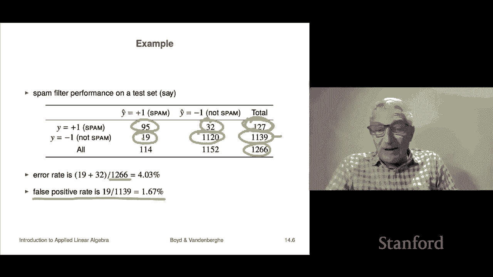
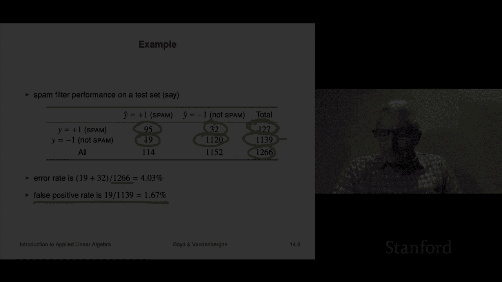

# P38：L14.1- 分类问题 - ShowMeAI - BV17h411W7bk

In the last chapter we looked at least squares regression or prediction what we're going to do now is look at a different form of prediction and that's going to be when the thing you're predicting takes on a finite number of values like you know true or false that's called classification and we'll see how that works in this lecture and we'll also see how to do it using least squares。

So we'll start with what classification is so basically it's data fitting with an outcome that takes on typically non numerical values like true or false or spam or not spam or dog horse or mouse right these are these are examples it could be different variations of a disease or something like that that you're trying to predict。

Now in this case， the output values are called either labels。

 it's kind of obvious why it would be a label like a dog that's a dog or categories and in fact one way to talk about outcomes that are non-numerical or take on a finite number of values is to say that those are that's a categorical variable okay and in this case instead of you'd say data fitting。

 but basically what it's called is classification is what what you're trying to do now we're going to start with the simplest and frankly by far the most common case which is socalled Boolean classification and that just says there's two possible outcomes and you know these could be for example true and false or spam not spam or something like that right and。

So there we're going to encode them numerically as plus one is going to represent a true for us and false is going to be minus1。

 Now， by the way， there's other there are other encodings。 a very common one is one。

Is true and zero is is false that's another very common and numerical encoding of Boolean or truth values and so the classifier is going to look like this it's actually going be a function it's going to take in an n vector those are going to be our feature values and instead of spitting out a number the way a prediction model does what it's going to spit out is either minus1 or plus one plus one means I think the outcome is true minus1 means I think the outcome is false so that's kind of the that's the idea okay。

Now there's a ton of applications of this， so we already hinted at one email spam detection。

RightSo here the way that might work is your feature vector X would contain features of an email message。

 it could be it could encode word counts it could encode the origin of that email and things like that and that those are just the features associated with that email and then of course what we're trying to predict is is that email spam or not spam and we'd get a lot of data because if somebody clicks on spam moves an email message to its spam folder。

 we can assume that she or he is considering in spam okay if they don't and we have some evidence that they actually read it。

 we can assume it is not spam。Okay another one this is a huge industry is financial transaction fraud detection so for example。

 for a credit card so here what would happen is that X would contain features of the proposed transaction like what do you buying how much is it what time is it what's the store all that kind of thing and then also the initiator so the person alleging that it's their credit card right and that would we'd get all sorts of things like you know who are they how old are they you know what's their sex where do they live you know all sorts of things so all of that would be wrapped up together in one feature vector。

And then your job is to look at all those features and to say thats that's a fine transaction yep that I think that's fine or you would say I think that might be fraud Now here this is what people would call an imbalanced data set meaning that well we hope that 99 you know ton like 99。

9% maybe more of the transactions are actually valid and a much smaller number are fraudulent oh I make one minor comment this usually works in practice I can tell you actually how this works So for fraud detection a very common thing is a red yellow green so it's actually threeway classification and what happens is。

A transaction comes in if it's green it just it's accepted and the transaction goes through if it's red it's blocked immediately right meaning it's reasonably confident that's not right if it's yellow that transaction is routed to a human being who take who looks at it and looks at it and goes oh I see what's going on here yep now I remember yep she's traveling in Barcelona and this this okay that's more than she would normally spend for a hotel but。

It looks okay to me right so okay back to our main story sorry document classification so suppose I want to I would just like to say find me among these 25000 documents the ones let's try to figure out are they is it on politics or not。

Thatd be it。X could be a word count histogram in that case okay disease detection so here X would contain patient features it would include the results of medical tests it would include symptoms。

 things like that and then your job would be to say does this patient have this specific disease and then you would guess it you'd make a guess。

It also comes up in a digital communications receiver so there what happens is X the well it's not a called thought of a feature vector there。

 but it is actually it's what it's a received signal。

 it could be measurements of a received signal at different antennas or spaced in time that that would be the X and then why is it transmitted bit either true or false right so and then you would look at the received signal and try to guess if it's true or false now？

Typical ones in practice are going to have a you know are going to be accurate like more more than 99% of the time。

 which is good so okay these are just applications of classifiers。

 which is just data fitting with a categorical with a categorical label or outcome right and we're focusing for now on Boolean outcomes。

Okay， now there's some interesting differences between this type of classification and predicting a number。

So let's see what that is for if you have a data point that's a pair x y。

 but remember y is either like minus1 or plus one meaning false or true。

 and then we have a predicted outcome y hat equals f hat of x and it's just a function we evaluate it we either get plus one or minus one that's our prediction。

Now， the way we measured errors in predicting an outcome that was a number was。

 you know like by the RMS value or the square or the you know。

 it's just how far off are you it's if the true value is 1。2 and we guess 1。3， we're off by 0。1。

Here it's interesting because both the true value and the guess only take two values each of them only takes the value minus1 or plus one altogether you've only got four possibilities and so there only four things that can happen in this case and a boolean classifier let's see what they are so one if we call that a true positive why remember is the actual value of the observed data and this says that this is so true positive means it really was positive and by the way and we guess it was positive。

So positive is another way to guess to say it's plus one， okay？

True negative right and true negative means it was minus one meaning you'd say that you'd say that that data sample is in the negative class or you know whatever has a negative label and also guessed what we guessed it and so in these two cases two of the four cases were right that's this is a case where we guessed and we we were right notice here it's actually kind of cool we don't really expect in another prediction you know if I'm predicting the temperature tomorrow at 1 pm I don't expect it to get it right to within you know whatever you know four digits right not at all but here you know you're just right I mean you guessed it right。

Now let's get to the two depressing cases， this is called a false positive。

 so false positive is this。It was really negative their data point was really negative。

 that's what y equals minus-1 was， but we guessed it was positive So basically we're saying go。

 you know our model is saying。We think you have the disease。

Now the truth is you don't yeah by the way， the consequences of that I think you can imagine need not be good right Okay so that's called a false positive you can also have a false negative that says it's actually positive but we're guessing we're like oh you're fine go home yeah couldn't be couldn't be better yeah go ahead you know so that's a false negative that's also you know obviously can have very bad consequences as well。

A false positive， for example， in fraud detection means that you attempt to buy something or attempt to carry out a transaction and it's blocked。

Right usually then you get something on your phone that texts you and says， hey。

 is this really you are you really trying to buy that or something like that？

False negative is interesting that's when a well that's when a fraudster uses you know actually studies your trans well I don't think they really do this but it means that somebody it's actually a fraudulent transaction and the classifiers like yeah that's cool Yeah whatever sure fine that's a false negative okay so in this obviously in the first two cases the prediction is right and then in the other two cases it's wrong now many different fields have names for these different things depending on the specific application and I think another name for being right and wrong is no sorry these are for the errors right one of these is referred to as a type1 error one is a type 2 error I can't remember which is which and so you just have to ask when you're in one of those situations right like what is type 2 error why can't you just say false negative which seems to me clear but whatever that's fine okay。

Now。What happens is if I have a data set and this could be a test set。

 I mean or training set I mean it doesn't make any difference and I have a classifier what it is is I will calculate them for each of these x's I will calculate Y have。

I。Wwhich is going to be F hat of X I right and so that's our guess and so basically for each data point。

 we have two things we have the true value of y which is minus1 or plus one and we have our guess which is minus1 or plus one and we divide all our data into these four different categories of the four possible things that can happen and we put them in a matrix like this and so and by the way。

 depending on the field you're in， you would either look at this matrix or a transpose of the matrix and that even tells a lot about you know whether you took who knows statistics or machine learning or whatever did you learn it in computer Zions or blah。

 blah blah first so but nevertheless and this thing is called a confusion matrix which I think is a wonderful term so let's see what it is。

It says you will actually count that's the number of times。 So n subtP is true positives。

 It's the number of times in your data set that。It was really true。

 that's what it means for y to be plus one， and you guessed true， so you're right。Down here。

 that's true negative， so that's the number of times out of n。

 that's the total number of your data total size of your data set That is the number of times that it was really false that what of means to be in this second row and you also guess false so you were right again now the off diagonal entries in this matrix are mistakes they're errors So these are the ones that's false negatives that's where it was positive but you said no no it's negative and this is where here it was negative but you said yeah it's positive So these are a wrong So the offagonal this whole thing together is called confusion matrix which I think is great because you would say things like here you have confused class class one for minus1 or something like that right so your off diagonal entries tell you about your confusion by the way。

 if you had a diagonal confusion matrix that'd be excellent that means you never made a mistake you nailed it。

So the off diagonal things are the bad ones， so those the mistakes。

 diagonal ones are where you're right。Okay， now people use tons derive tons of error metrics from you know。

 a data from a classifier applied to a data set and you know I'll tell you the ones I think are the most。

Clearest to me， but in fact， different fields use other names I can't even remember what they mean any。

 you know like out of the specificity and whatever you know， anyway。

 so you just have to ask and you know once you integrate socially into a field or application area then you'll realize okay everybody talks about these two these types of error rates right so okay。

 so here's one This is super simple it is the sum it is the number of times you are wrong that's。

This one one this is that's this entry plus this entry those are your error rate divided by the total number so this that makes perfect sense is that's 5% it means that 5% of the time on this data set your guess was wrong that seems pretty clear to me that that is the socalled error rate so people have the true positive or the recall rate。

Is it's the number of true positives divided by the number of positives So it's basically， you know。

 depending on the number of you know every time when there's positive， you know。

 what's the fraction of them that you actually I get them you know。

 actually get them that way and you would like that to be well one would be perfect It would mean every time there was a true positive you guess so false positive rate that's another way to do it that's called that's the number of false positives divided by the number of negatives So that's that's this that's a false positive remember is when it's truly negative。

Right but you guessed positive， so it just means among the ones where it's truly negative。

 how many times did you accidentally say oh， it's positive， so that's it now。

If anyone proposes a classifier， and by the way， we have not even mentioned one method of coming up with a classifier。

When we do if someone says here's my classifier you know you're going to judge it by at least one and maybe two or three error rates right so you'd say oh that's a pretty good one it's got a pretty high true positive rate you know at a nicely and a reasonably small false positive rate or you know oh boy you know my classifier has an error rate of 6% but yours has an error rate of 12% or something like that so this is the idea and by the way that's all done on a test set because。

Doing this on the training set is kind of meaningless right so but at that point you know it's a real thing like if you say I can my false positive rate is this and my false negative you know and that's on test data that's good。

So let's look at an example， here's a spam filter and this is a test set。

 the test set has about 1300 emails in it。We can look at this is the truth right if you look at the row that's the actual truth and we can see that you know about 10% of the emails were spam right because it's 127 versus 1200 okay I mean you know roughly 1100 so you know about 10% of the emails in this data set are spam and then let's see how we did well of the 127 that were really spam。

We nailed it on 95 of them we said that's spam and we were right now unfortunately on 32 of the ones that were spam。

 we were like we thought about it and I'mthro anthropomorphizing the classifier we thought the classifier thought about it and said no it's not spam but it was then we can look at the ones that are not spam so they are 1139。

W non spam emails and 1120 times that's a lot out of 1139 we said we're like that's not spam but unfortunately we classified 19 of those 1100 emails that really were not spam we classified them as spam okay so so these are our error rate our errors of the two different types you know and so our error rate would be 19 plus 32 that's the total number of mistakes we made。

Out of 1266 and its 4% that would be one way to say it one interesting thing about about that calculation is it assumes that these two types of errors are equally bad。

Actually in a lot of cases that's false and we're going to come back to that later later。

 but that's actually typically false right it could be that you care much more about one of these errors than the other okay so if you want to know what's the false positive rate it is。

Out of the ones that were so this is this is as among all the negative examples of which they're 1139 we falsely thought it was a positive in 19 cases。

 so that's we have a false positive rate of 1。67% Okay so this is just an example to show what a confusion matrix is。

 how do you interpret it and so on right and if you want a single number error rate is as good as anything else。

 but in fact， a lot of people would look at maybe two numbers。

