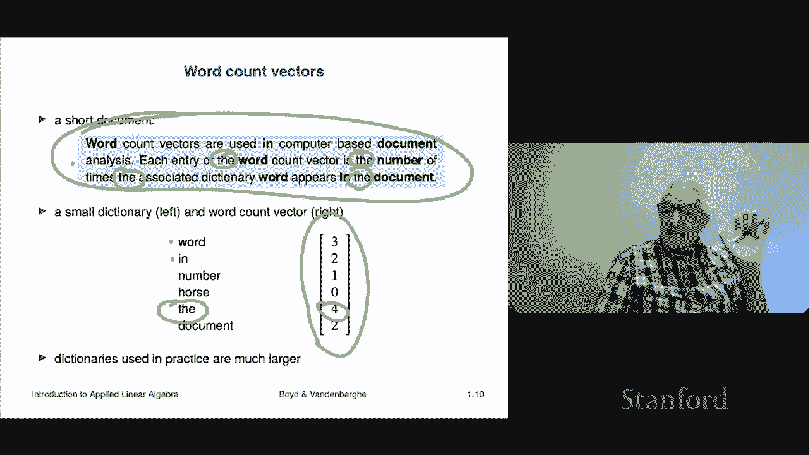

# P3：L1.3- 向量示例 - ShowMeAI - BV17h411W7bk

Our next topic。

Is examples of vectors last time we simply looked at the basics like you know what's a vector how do you refer to its entries or its elements we looked at the concept of equality stacking vectors。

 let's see what else did we talk about。That is pretty much a sparse vectors， unit vectors。

 ones vectors， special vectors， yeah at that point， however。

 there'd be no reason for you to have any interest whatsoever like what do you do with a one's vector。

 like who cares？Right now what we're going to do is we're going to look at some examples and this will hopefully give you a rough idea of where you would see and encounter vectors hopefully you'll end up convinced that it's in a whole lot of applications that vectors come up okay so let's go to some of the most traditional and classical ones right if you take you know a first course in actually sometimes in vector calculus or if you take a course in physics or mechanics or something like that。

There you encounter a lot of vectors those vectors are usually two vectors or three vectors。

 meaning that they have dimension two or three I mean in the real world， it's like three for us。

 I mean if it's if it's positions and there what people talk about is you can use a vector to give a location right so for example。

 there's a vector X。🤧And it's got two entries， of course it's a two vector so it looks like x1 and x2 and what they represent what a vector here represents is a position in a plane and that's this picture here So you should think of it as as telling you that that dot or the position is there So a vector can specify a position in two dimensions or in three dimensions too。

 so of course you have to agree on what the coordinate system is you know and it could be whatever doesn't matter。

 it could be you know the traditional one but you have to say what the coordinate system in but once you give the coordinate system a vector。

 a three vector will give you a location okay or a two vector would give you a location in a plane that kind of thing So that's very common and you've seen this。

 I think these are called you know Cartesian coordinates that's what this is okay。

Now very a related concept。Not quite the same a related one is you can use a vector to describe displacements right and a displacement does not refer to a position What it refers to is a actually a change in position from one place to another So there we when it's describing a position we think of it as if we draw it as a dot or an x or something when we talk about a displacement it's usually drawn as an arrow and the basic idea is here x1 x2 as in here represents a displacement and it says that you know from this point to that point you should move to the right by x1 and you should write above height by x2 and that's a displacement So's this is the kind of thing you would see in you know in your basic physics class or mechanics or something so that' this is very conventional and you probably saw this already and things like that。

Let me mention some others and I actually frankly find these more interesting okay so first of all color colors that the human eye responds to are given by three vectors so three numbers R G and B and that's the red。

 green and blue intensity level and it's very cool so you can describe a color by giving by giving three numbers。

 for example， the first unit vector E1 means it depends how you scale it but I'm going to scale them so that one means maximum intensity0 means off okay so in that system E1 which is the vector 100 is the color pure red right then E3 is pure blue。

 the vector like101 means turn on the red full blast turn on the blue and you're going to get some very pretty kind of。

Violet or purple color， that's what it is， but this would give you all sorts of colors that's and they're described by a three vector。

Okay， another good example is sometimes an N vector is used to give like a bill of materials or a list of quantities so for example。

 you could have 10 raw materials that you need to build a unit of a product right and then a vector could describe how many how many units of each of the materials you need to build the product right and so that would be that super interesting question there is if a vector is sparse。

That means that the list of quantities you're describing， most things are zero。

 so that's a good example of a sparse vector。Here's one a portfolio in finance right so it's very common。

 what's not very common it's universal it is universal in finance when you're describing the portfolio a portfolio is a collection of assets that you own know typically stocks。

 bonds options that doesn't matter whatever they are and what a portfolio does first of all。

 it's a collection of things that you own and there it's represented by a vector and that several ways people do this it could be that a vector would give you a vector could give you the dollar value of each of the assets that's a common one。

 another one is could give you the fractions right of your total portfolio in held in each of these assets right it's also interesting we're going to talk about this later。

 maybe not so much right now that you can actually have negative quantities in finance right and what that means is these are called so-called short positions and it basically means that you。

Borrowed it from someone。 and you're going have to pay it back。 So， but we'll talk about that later。

 but it's interesting because it means you can have quantities that are negative in this case， right。

 So let's just look at an example。 So here's a portfolio with let's say stocks， bonds and cash。

 just keep it real simple right， So here's a portfolio and I'm going represent it。

 I'll represent it in dollar values。 It's 150 and 20。 There you go so。

That portfolio says that you have $100 worth of stocks，$50 worth of bonds and $20 in cash。

 That's what it means Okay， and that's a very common way to represent a portfolio so。

That's the idea but so that's the idea for example。

 we can look at that and we can say what's the total what is the total value of that portfolio and it's the sum of the entries and that would be 170 So if someone says how much is your portfolio worth you'd say how much is this portfolio worth you'd say 100% I sorry 170 here's another one a vector can be used to represent a cash flow and that's very interesting。

 very extremely common right So a cash flow could be it could be all sorts of it could be the revenue for one of your stores and it's the daily amount of cash that came in by the way。

 a bunch of cash is probably also going out but you'd have to specify which cash flow you're talking about It could be the payments on a bond or a mortgage or a loan we'll see these are all like cash flows So a cash flow is something like either a payment。

To or a payment from you in various periods in time and here by the way the index is sometimes referred to as the period and it could be anything。

 it could be days， it could be quarters， it could be years it doesn't matter depends on the application but that's a very common thing where XI is a payment so interesting question already what does it mean if a cash flow vector is sparse。

That's that's my question I mean at the moment we don't have a whole lot of concepts。

 but we have a couple and we might as well tie them together。

 so that's my question to you is what does it mean for a cash flow to be sparse well。It means this。

 it means that let's say it's a cash flow vector， lets say it's 100 long。

 so that means these are the payments made in 100 different periods。

Let's say it's months or something so it goes out about eight years or whatever it does eight and a half years so that's that's 100 long vector in these payments it's sparse it means that in most months there is not a payment either by you or to you which is kind of interesting right so if it had like five non-zero entries if they're positive they could represent a payment that is to us and if it's negative it could be a payment made by us and so that's what it would mean to be to have a sparse cash flow vector audio so sound so sound is in fact what it is is it's very fast variations in the air pressure which your drum which your ear picks up and your brain you know allows you to perceive as sound。

And so there are several ways to encode sound， but one is， by the way。

 as a vector and typically what it is， I mean the most common format is this。

 it's a very long vector these are not short vectors right these are long long vectors but so basically what it is is it gives you the sound pressure level at various instances of time and those instance of time are separated by a very small amount of time around 25 microseconds so it's about 44000 per second I mean there's other formats too it could be 48 kilohertz。

 22 kilohertz and this just means how many samples you have per second。

 but nevertheless that's what it looks like。That's what a that sound sound is a vector right。

 and so for example an entry。Of an entry of a sound vector would tell you what is the acoustic pressure at that particular moment。

 by the way， the acoustic pressure again， you don't need to know this。

 but the acoustic pressure is the actual pressure at that moment at that exact moment in time minus kind of the average pressure。

It or minus the average pressure at that time and so it could be positive or negative that's and that's typically what it is so okay so audio audio track that's a that that's that's a vector here's an insanely this is a super useful and common one is you can use a vector to describe so called features this is basically the entire core of machine learning。

Statistics， many other fields， but the basic idea。Is that a vector stores a bunch of numbers each of them are either called features or attributes of an entity right so for example I'll give you one let's say that the entities correspond to a patient being admitted to a hospital right the first entry could be something like their weight that would be x1 x2 could be their height x3 could be their diastolic blood pressure or X4 could be their know systolic blood pressure and so on and so forth we can also do things like have some encoding so for example we could encode x5 could encode the sex of the patient and we could assume we we'd have to have be a convention but we'd say something like x5 equals plus one if it's female if if the patient is female minus1 if male so that would be an example。

But it can also have a lot more a lot more things in it and feature vectors can be sometimes small with just 10 entries。

 but they could be super big。Right， so as an example， we could do something like this。

 let's suppose that let's talk about feature vectors for let's say publicly traded companies right so Google has a vector So and here are the kinds of things you might find here are the kind of attributes it could be let's say their total capitalization the volatility。

 that's how much the price of that thing has wiggled around over the last year。

 it could be the last quarter's return it could be sort it could be their revenue。

 it could be all sorts of things。 it could be the total number of dividends they paid in the last quarter So these are all attributes of companies and then we would have a lot of vectors and they would they would each one would be associated with the company and so on and now you'd know what the entries meant okay。

Next example is a customer purchase。 that's a super interesting vector right there so your。

Some kind of a store or let's say you're Amazon then what you're going to do is you're going to take a single customer and you're going to ask over some period like the last year how much or what's the total dollar value of the of what they bought now the length of that vector is actually going to be each entry in the vector is associated with a sw right which is a unique I for a product that you can buy right so so。

These vectors could be big these could be like a million long I once knew what the Amazon what the number was for Amazon actually it was less than I thought it was。

 but it is not small， let's put it that way Okay millions but but the idea there is then for a customer like me we could look up and figure out what have I bought in the last year and it would be represented as a vector Now by the way that vector will for sure be super sparse right because of let's say the1 million things that I could order on Amazon it's 10 million whatever anyway for whatever it is。

I may have ordered a couple a hundred things， but I did not order。

 I didn't order anything close to all of them， right so。

 so that would be a natural example in the wild of a sparse vector and in fact。

 it would be stored as a spars vector， right， It'd be a list of things that look like。

 you know the sw and then the quantity。And that for us it would be a vector that's purchase that's a customer purchase vector and that comes up very。

 very often。Here's one word count that's a very interesting one that we have a document we're going to see a little bit I'll say a little bit more about that in a bit I have a document and what we do is we simply count we also have a dictionary and we count the number of times each word in my dictionary appears in that document and that gives me X I so X I is literally。

The number of times word I appeared in the document okay could be zero and by the way。

 if it's sparse it's interesting sparsity there means that whatever your document is most of the words in your dictionary did not appear so that would be that would make sense if your dictionary was like you know a typical English dictionary might have 50。

000 entries and suppose your're processing reviews。😡。

Of products well they're a paragraph or so right and I pretty much guarantee you that most of the 80。

000 or 50，000 words in English do not appear in each review。

So that's once again an example of a sparsa vector。

Vious spa so let's look into that in more detail and see how that works。

 So here's a short document right here I mean it doesn't say much it's actually a snippet of text from the book and so it's got a couple of sentences in it and here's our dictionary our dictionary and we have to agree on the dictionary that's important you have to say what the dictionary is and the dictionaries of course is just be given by a list of words so our first word is well。

 it's word our second word is in。Our third word is number， okay， and then this。

That is the word count。Vectctor associated with this document using this dictionary okay so let's audit at least one entry just to check let's try the okay so here it is that's that's the let's go look up to the document and scan it and see how many times that came up well and I hope i'm I hope this works out right so it's not in the first line。

Oh， oh oh， up， there's one。9。Three， four， okay， so four occurrences。

And sure enough that's represented right here， so that's that okay， so this is the idea。

Is it that fifth entry in the vector？Wch tells you how many times the word the appeared in your document is for in this case right Now I should add this is just a baby example right dictionaries are typically have1 thousand entries Oh and they sometimes have a catch all entry called not in dictionary so in other words。

 if you have some other weird word it just counts as a special word called not in dictionary but these are that's a detail common dictionaries are thousands to and in some cases even like a million Okay so dictionaries can get very very。

 very large and but it's interesting right because you can imagine I could take Shakespeare play and I can write I can get a word count vector probably。

1520 maybe 15000 different words appear in it and it would be represented by a 15。

000 vector right and that would be sort of the idea very interesting so we're going to talk about all sorts of stuff you can do with word count vectors later in the course。

 but just it's a good that's one thing that a vector that's one thing that a vector can represent。

