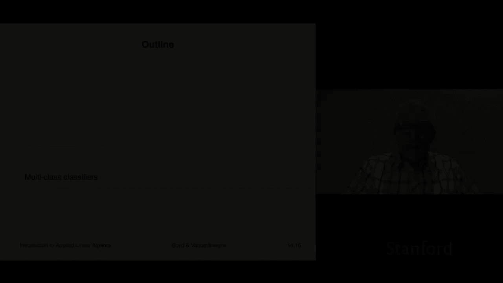
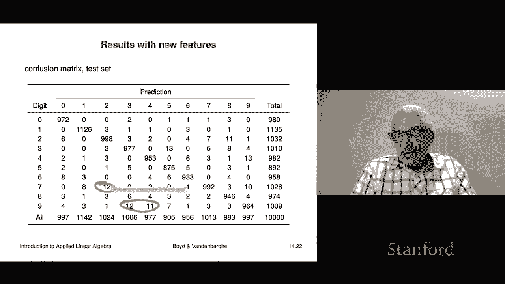

# 【双语字幕+资料下载】斯坦福ENGR108 ｜ 矩阵论与应用线性代数(2020·完整版) - P40：L14.3- 多类分类 - ShowMeAI - BV17h411W7bk

Our next topic is multi class classifiers。So this refers to the situation where the labels which are the possible values of your outcome y instead of just having two values it can have k values where k is bigger than two and those are called either the labels or I think sometimes in statistics these are referred to as levels so you'd say K levels I don't know this is just local these is just local dialects and we're going assume that the label set is going to be just the integers one through K so we would refer to these as label or classes so you'd say class3 means whatever it could mean elephant could mean orange could mean fraud I don't know class7 means something like it could mean Tuesday or I don't know。

Doesn't matter right so that's the idea。 So we're talking about a case where instead of just guessing yes or no true or false fraud not fraud。

 this kind of thing， you're actually it's more nuance and you're actually making a guess among several more than two choices。

 Okay， so now a predictor。Is going to be a function f hat that maps from Rn so it takes in the feature values that's the vector X and returns actually just one of the numbers like three or seven or capital K or one and by the way this corresponds by the way to a partition of the feature space because you can imagine you can simply imagine the sets of points which are assigned to one of these values that'll be some region and so some people refer to this as the predictor being a partitions the feature space into the place where you make the different guesses okay now if I have a given predictor f hat and a data set my confusion matrixes now k by k it's not two by two as in the Boolean case。

And in this case， we'll get to what that is， but it's just a bit more complicated and of course in a lot of applications。

 you know some of these off diagonal entries may be much worse than others right so that's actually one of the things that would come up。

Okay， so what are some examples of multiclass classification Well here's an obvious one is just handwritten digit classification so basically I give you an image of a digit and you have to guess zero through nine that's10 that's capital K equals 10 remember in our last example we were simply trying to guess whether the given digit was a zero or not a zero meaning one。

 two， three up to9 here's one marketing demographic classification so we would have our you know some standard demographic groups let's say 60 of them and what I would do is I would look at some purchase history or some other data about a customer or a person。

And then I would I would guess I'd say my guess is they are in group 12 and you know that means something right okay。

 disease diagnosis when there's more when you're doing more than just trying to say is this one disease present or not so you would have a bunch of candidate disease oh including usually if you know one label is simply there's no disease right so and here X the feature vector would include test results it would encode the symptoms of the patient。

 maybe some history of the patients， maybe even some of their past treatments。

 this kind of thing so that would be and from that you'd look at it and say why think this is disease A or this is disease B or this is the variant this is a variant of disease B or this or no disease I I think the patient is fine okay another one would be translation word choice。

So。Here you have a dictionary， you have a dictionary in English and you have a dictionary in Farsi or something like that and so you know it's easy enough to kind of generate but's ambiguities right so there's a word in English that actually might have you know whatever several different possible words it's ambiguous in English in Farsi it's not it's like one of these four or five words and so what you could do is given the context of that like the rest of the English paragraphs say you could try to figure out which is the right word right so one example might be the word bank so in English that could mean the bank of a river or a bank where money is or it could be to bank and airplane be could mean a couple of things these could be different in another language in fact in many languages these are different words and so your job in translating is not to simply replace。

Bank with one of these definitions but you have to kind of figure out which it is and so this would be a perfect example of a multiclass Well if there's only two choices it's boolean or binary but in general there would be several choices and it's your job to try to figure out which it is and you could look through the rest of the paragraph that's the context that would be X and you might you might find words about banking regulators blah bh this kind of stuff you know money exchange race and then you'd guess okay by bank they don't mean bank and airplane and they don't mean the bank of a river it means a bank where money is okay financial institution right so something like that I just give an example。

Document topic prediction， so this would be you'd have new documents or a cache of documents a set of documents。

 a corpus people would say of documents and you a new document enters the corpus could be new Wikipedia page I mean it doesn't matter right and your job is to assign it to one of like you don't know。

 37 different topics is it sports。Its politics。Science you know I don't know I mean it's one of these right and that would be the ideas you would make a guess as to which it is based on some features of it could be word count histogram for example right so that would be an example of that's document topic prediction。

Okay， so let me explain how a way to do this as with Boolean classification。

 you will learn you know different and more sophisticated and honestly better methods to do least squares sorry to do multi-class classification but the least squares one is not so bad and it introduces some ideas that will be useful and so on and it just uses the stuff we have in the class so far so having said that though let me explain how how you could do it using using least squares okay so this is very simple method what you do is you create a least squares classifier for each label versus the others。

Okay， so if in fact， your labels are， you know， apple， banana， right， and peach。Right。

 and you're given， let's say an image or it doesn't matter， right？

Then what you would do is just like we did with the digits， the Ms digits。

 we would build a classifier that tries to predict whether it's an apple versus a banana or peach。

We would build a second classifier that attempts to say whether whether it's a banana versus an apple or a peach and then finally one that attempts to say is it a peach versus an apple or a banana okay。

 so you build three classifiers， one separately for each of the labels。

 which attempts to detect that label versus the others。

So that's that's how that's how that would work by the way。

 there's several things you could do van one is is actually to do things like well okay I'll say that the way that works best with least squares goes like this we actually don't use the hats we use thees Now remember that F hat is either minus one or plus one so F hat equals plus one so F。

2 hat of x equals minus1 means I don't think it's a banana。 I think it's an apple or a peach。

 that's what it means Okay but we'll actually work with the precursor of F hat2。

 we're going to work with Fil of x equals minus 0。1 okay now there's a lot more nuance in here because if this were like minus minus1 or minus0。

9 we would have said， well， we don't that's definitely not that is not an apple or a peach and we're pretty certain but minus 0。

1 means you're like。Could you know could be I mean。

 if you're forced me to make a decision is it is it a banana or an apple or a peach it you know。

 if you forced me to I'm going to say it's it's not a it is not a banana。

 but you know this says that your confidence is not high so what we're going to do。

Is going to evaluate that number， the precursor to the actual prediction for each of the different classes and then I have to explain this notation arc max so the okay you know what the maximum of a set of numbers is right so the max of a1 a2 a3 is's just the largest of the numbers okay and it's a number。

Arc max gives you the index of whoever is the largest right And by the way。

 if there's multiple to detain the largest， then it's not you just choose one doesn't matter which one Okay so what this says is super interesting。

 it says you query for each label you query your classifier and you get ftild sub L right that's a number right if it's like really close to one。

 it means it means that thing is really confident that that it' that that the thing you're looking at is class L。

 if it's really close to minus1， that thing is really confident it's not okay but you know if it's 0。

3， it means maybe I don't know if it's minus you know 0。6 it's somewhere in between and all that。

 So what this does is it simply says look at the one that has the highest。

 if we think of filde as being sort of the confidence in our guess that it's positive。

 This is find not just the one that's positive but the one that has the highest confidence in being positive and that's what this says That's how you's。

I guess it so for example。If I have an x and F1 tilde is minus0。7 F2 tilde is plus 。

2 and F3 of x til the is plus 0。8。 Well， first let's analyze that before we make a decision and we'll use these labels up here so the first one says says that if you pose the question I this an apple or is it possibly a banana or a peach This says。

I don't think it's an apple'm and it's pretty certain it's basically saying。

 you know pretty confident saying like it's not an apple so okay。

 that means probably it's a banana or a peach okay。

This one is interesting that says that if I ask you is' it a banana versus is it an apple or a peach。

 it's basically saying maybe yeah， maybe it's a banana。

 sure maybe it is a banana I don't know And then you said。

 well how confident are you and you say well a a bit confident not horribly confident but a bit confident that's what the point2 means。

Then we go to F3 till the of x which is plus 0。8 now the meaning of that is we've queried our classifier and we've asked for this X。

 does it represent a peach or is it an apple or banana and this thing says oh that's a peach that what that's a 。

8 means it's a high number of course when you take the sign of it you would get you would get you know F hat three is is plus one F hat2 is plus one and F hat。

1 is， is going to be  -1， right， So I mean， that that's why this doesn't give you enough information to really make a good guess。

 right， I mean， you can guess it's not an apple， but it's。

 you don't know if it's a banana or a peach。 So what we've really done is we've gone with the guests。

 which is most。We have the highest confidence in and so that's actually going to be pe in this case so we take f hat of x's is this right and so this is the idea it's relatively simple and you know it actually doesn't work too badly like at all。

So here's what happens if we run this on handwritten digit classification right so we have 10 classes and this is our confusion matrix which is you know 10 by 10 right and so this is the you know。

 I mean we can look at this like that is the number out of 10，000。

 this is test set so in our test set。There were digits that were really a three that we thought were a one and there were 18 of them that's what that means so here here's one where we did pretty good zero there were in our test set there were absolutely no times that something was a six and we thought it was a three so the diagonal here these are well not that diagonal there we go these here those are the ones where we did it right。

Right so that's cool Everything off the diagonal， all the numbers are bad let's look for some of the worst let let's see where we did the worst or let's see let's let's find some places where we did badly。

 if not the worst Here you go。That's bad Okay， 80。 and so let's see what that's about Well。

 that's a time when the digit was a9， but we guessed a four now。

That's completely that makes perfect sense by the way you know humans would make that mistake too right there'd be a lot of times it's a nine but but it's really a four so that kind of makes sense I mean these things make sense if you look at some others where we did poorly it would be oh confusing a nine and a seven and I know lots of people who make nines and sevens that look pretty similar so again that's kind of reasonable so theres it。

The error rate is around 14% and it's not overfit because on the training set you get about the same that's actually pretty bad。

 that means that basically one in six times our this thing you know basically makes an error on the digit。

That's but on the other hand this is just this is the simplest possible model it's a regression model basically we haven't and which is you know not even really appropriate but it's kind of cooler you get even like five that you get that your your error rate is only 14% that's a pretty good starting point you can't do you know can't do much worse than that sorry yeah it means。

That's our good way to start， we'll only do better。Okay。

 and so I'll show you just one very simple thing， it's a crazy thing。

 it's you know relatively new researcher whatever， but I'll show you what it is。

Mostly people think of feature engineering is done in a very thoughtful and mindful way。

 like you would you go to an expert and they go， well。

 I think you should have the product of these features because there's some interaction you go like Google and then you add these features and of course。

You don't do it because the expert you do it because well you take the advice of the expert but then what you do is everything what matters is or the only thing that matters is the test performance right so how does it work on data it's never seen so here though there's this is something that's come up five10 years ago。

We're going to make random features so here's here's what we do we're going to take 5000 new completely random features we're going to generate a random 5000 by 494 matrix。

And the entries are plus minus1， that's it just we flip a coin and we fill out this matrix。

Then we form Rx subJ and zero the backs of it right so this is crazy， it is utterly uninterpretable。

 it means absolutely nothing is very much like actually a neural network which is something you may have heard about and you certainly will hear about in other courses Okay。

 so that's just random features and now instead of 494 features we've got 5494 features okay now when you do this。

You get a training set error that's about 1。5% of a test error that's 2。6。

And you can do better I mean， if you start crafting weird new features， not weird new features。

 but features that are actually that kind of make sense you can do better and the current state of the art is like it's like almost perfect In fact。

 the current state of the art is that these things can be recognized better than people which kind of weird you might ask like what does that even mean and they do have a way of checking the ground truth right that if you for example。

 suppose people say no dude， that's a9 and this thing says that's a seven and the way you can resolve that of course is that is by context these could be zip codes and one could not make sense and the other does make sense and stuff like that。

 but nevertheless it's very cool and by the way at this point in the course。

 I mean what it does is it shows you that this just demystifies a lot of these things I mean if you didn't know about this stuff you know in this course so far。

I I don't even know why you would think that's done。 I mean。

 how does a camera look at a handwritten thing and。Tell you what it is。

And now you know at least some of the methods used， people don't use Lee squares。

 but they use things that are very， very close to least squares and in spirit it's very similar。

And you know， honestly， it's a secret， don't tell other people， but it's not that complicated right。

 I mean， least squares is just it's just not that complicated， but you know。Again。

 don't tell people because。It makes us look impressive if most people don't know how this stuff works and that it's not really as complicated as it looks。

 it keeps our salaries high and things like that， so again， if you're among friends。

 yeah you can say sure it's not not that big a deal。

 but I'm asking you now just for all of us collectively。

 please don't explain to a lot of to too many people that these things are not as they're really just not as hard as they look。

Good。So when you add the new features here's what happens well okay first of all your eyeball looking at that confusion matrix tells you you're doing pretty good I mean you have 10000 data points and take a look at this I mean the number of errors you're making are numbers like zero one3 I mean that's。

Pretty good。 if yes it's looking pretty good Now you're still having some trouble here right here are some here once you're making a mistake。

 you know， you're misting a7 and a2， you know12 times so but this is this is pretty good and it's pretty impressive。

 And like I said， this was just adding these 5000 random features。

 So if you actually add features in an intelligent way and stuff like that。

 you can get you can get this down to all small digits like zeros ones。

 And I believe current state of the art on test set just zero flat zero that's on this test set just zero right on bigger test。

 you have to have a bigger test set to actually detect any failure of sort of state of the art methods right now。

