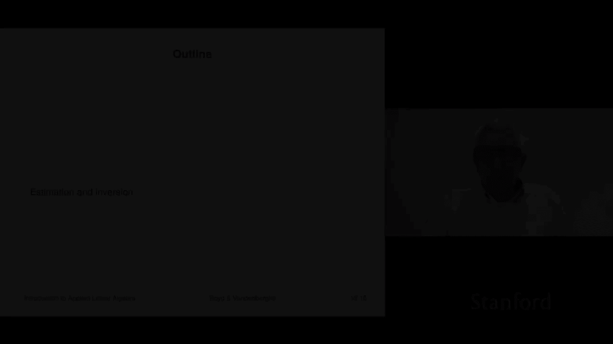
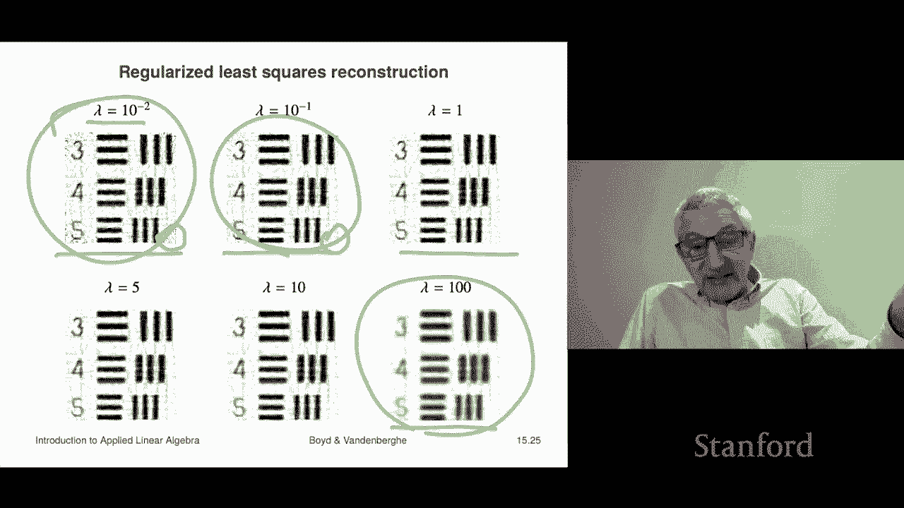
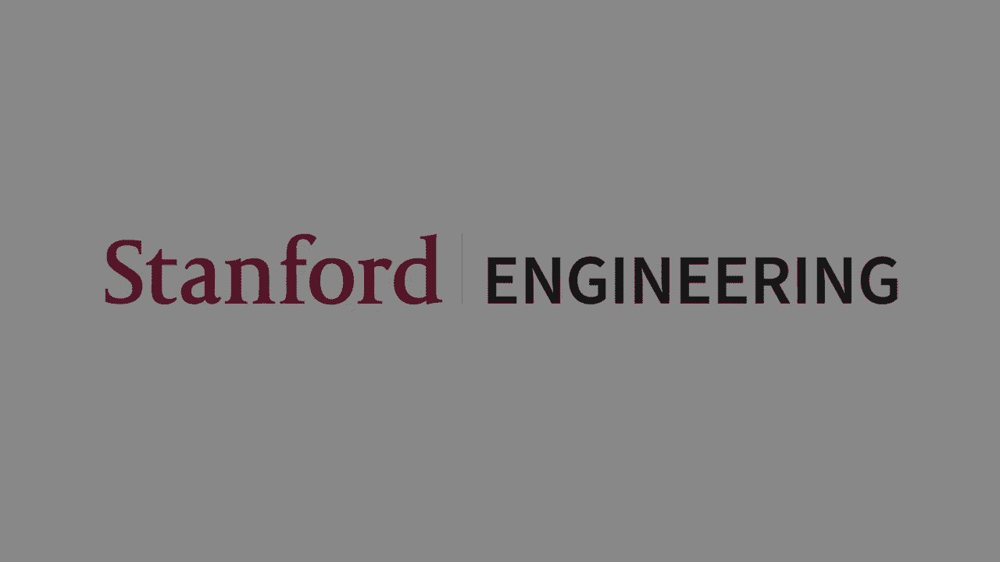

# 【双语字幕+资料下载】斯坦福ENGR108 ｜ 矩阵论与应用线性代数(2020·完整版) - P43：L15.3- 预估与正则 - ShowMeAI - BV17h411W7bk

多目标最小二乘的下一个应用是估计和反演，我是说那是一个，这是一个巨大的领域，我会说一点，你可以选修整个课程，除了这个，但我们现在要说一点，你的模特是这样的，你有一个所谓的测量模型，这里有一个n向量。

这就是你要估计的参数，这就是你要估计的，你没有办法直接测量它们，好的，所以呃可能是，x将是体素在地下的密度，你知道的，你不想钻一口井--一口测试井来实际测量它，y是我们测量的向量。

所以这些可能是我们在地面上进行的测量，例如，嗯，那么什么，我们要做的是，我们要说模型是这样的，y等于ax加上v um，V是向量，对呀，非常抱歉，它是噪声的矢量，让我们说出让我们看到的或干扰或错误，或。

然而，你想想想，所以这里y=ax是一个线性模型，现在A来自，呃，你知道，物理学第一原理，各种各样的东西，但是A表示来自参数的映射，你对测量或估计感兴趣，嗯，以及它们是如何映射到你真正测量的东西中的。

这就是为什么v有时被称为测量误差，类似的东西，好的，嗯好吧，所以这就是我的想法，嗯，你知道，你知道，在估计中，你会知道一个，描述您的系统，嗯，你会观察到Y，你的目标是猜X，好吧有趣的是。

你知道当你如果你知道为什么，如果你知道为什么，你知道一个嗯，如果你猜x，呃，大家可以看一下，y等于呃，ax，嗯，你是，你基本上是在猜什么，v在那一点上，对呀，所以v等于y减去ax，它基本上是平方估计。

它是这样的，我们将简单地假设这个噪声向量很小，所以你知道这就是它的意思，就像我做了这些测量，我测量了250个温度，是啊，是啊，你只知道他们，我认为这些温度测量都不完全正确，但他们可能都在里面。

你知道一个C度或类似的东西，所以这种适合，这些测量是好的，但他们无论如何都不完美，好的，嗯，这是最小二乘估计，你要通过最小化范数来猜测x，ax减去y，现在让我们注意一下那是什么，AX是我们的模型所说的。

为什么会没有噪音，Y是我们实际观察到的，所以这上面写着，请给我选一个X，我们的模型将为其建模输出将尽可能匹配，我们实际测量的，所以这是一个，那是最小二乘估计，这是完全正常的，制造完美，嗯完美的感觉。

我还应该加上这个向量是-v，所以换个说法，它是，请选择一个X，所以考虑到噪音，我们观察到告诉你V是什么，这是测量噪声，你说，请给我一个X，我们必须想象测量噪声非常小越小越好，这是最小二乘，最小二乘估计。

好了，现在，有时当人们这样做的时候，事实上非常频繁，当人们这样做的时候，他们有正规化，这叫做正则化估计，有时称为正则化反转，嗯，类似的东西，嗯，工作方式是，你只需考虑到你解决的问题来猜测x。

关于X的先前信息，先驱者可能是这样的，你想得很好，我认为x不应该太大，我就是这么想的，嗯，或者我觉得应该是光滑的，像那样的东西所以，你现在可以在这里有各种各样的前科，在你要学的其他课程中，像这样的前科。

我认为X必须是非负的，或者x是x的项在零到一之间，嗯，我们不能在这门课上处理这个问题，但你会看到其他课程有前科，像那样其实是可以处理的，但不是在这门课上，然而，我们在这里要讨论的是。

对于很多很多的应用程序来说，它已经足够好了，所以让我们看看，嗯，现在这些都表达了这些先前的，表示关于x的先验信息，呃，使用像呃这样的东西，范数x的平方，在数学上表达先验的，那个x很小，有个名字。

这叫打勾正规化，嗯，这是基于，呃，这是以一位俄罗斯数学家的名字命名的，起飞，另一个就是，呃，j 2等于dx，其中d是某种差分算子，比如说，如果x是你试图猜测的时间序列，嗯，但它很可能，如果是时间序列。

你在猜，dx是矩阵，差分矩阵，所以DX是差异，它说你想猜一个X，它是平滑变化的，那就是那就是这个，这个用法你在这里用J 2，嗯，那么你将最小化j一加λj二，然后是一个问题，你做什么价值的土地，你选择。

然后呃，所以我在许多申请中都是诚实的，刚做完，它是临时的，你调整lambda直到你喜欢结果，我是说从视觉上看是有道理的，或者你去找这个领域的专家，你会说嘿，我估计，这个，这看起来很酷吗。

这种表情是你期望看到的吗，当专家说是的时候，那么这意味着你有lambda，对呀，所以说，那个呃，x x帽子是最小化的那个，j一加λ，这是lambda的函数，所以我们要把它表示为lambda的x帽。

这就是所谓的正则化路径，它就像一条曲线，在这里你改变参数lambda，这个n中的点在这个n向量中沿着一条曲线移动，这就是所谓的正则化路径路径或曲线，现在，当你看到这个时，一些非常有趣的事情发生了。

当你把这个最小化并把它从正则化中去掉的时候，比如说，你最终会把一个堆叠在一个多平方的lambda上，实际上乘以i的恒等式，结果是，即使a有依赖列，去掉的正则化反转，最小二乘问题是好的，嗯，这是有道理的。

对呀，它有独立的专栏，这样就可以了，非常有趣，所以这意味着你实际上可以，即使你的测量较少，呃，那么你有呃，参数，你想估计一下，当A在Y这里时就会发生这种情况，那叫宽系统，好的。

所以我们现在来看一个具体的例子，它很简单，你可以看到很多其他的，还有很多其他的例子，但我们来看看这个，这里x表示一个图像，所以这意味着它是按某种顺序，是体素，呃，这是一个，灰度，所以呃，以某种顺序。

我可能是，我穿过行，我列出了那些，但是x是一个图像，可能不小，它可能就像一个，我不知道至少一万或者十亿美元，一千万高，好的，那么矩阵A是模糊算子，嗯，我们已经看到，这是，它可能就像一个卷积。

这是一个非常简单的模型，比如说，光学系统工作，你把你在图像平面上真正看到的东西卷积起来，得到你在显微镜或相机中实际观察或测量的东西，好吧嗯，所以你可以把y=ax加v看作是一个模糊的，噪声图像。

我们很快就会看到它的例子，最小二乘D模糊，是这样说的，它说我会告诉你为什么，那是模糊的图像，它说我要选择一个图像，x那个呃，第一个术语所说的实际上是图像，如果没有噪音，嗯，所以你说我想要的第一件事是。

我想选X，所以没有噪声的图像会是什么，呃至少接近我实际观察到的，这是第一个术语，第二个术语是正规化，是狄利克雷能量，初始能量在这种情况下是图像的情况，它实际上是两个范数的平方之和，这些是巨大的矩阵，呃。

顺便说一句，超级稀疏，垂直和水平的dv和dh，这些给了你水平和垂直的差异，呃呃为了一个形象，嗯，所以这些是，你知道吗，这是这是东西，这真的很大，但我们的想法是我们可以解决它，顺便说一句。

它也是超级稀疏的，这里写的是，你知道的，请在我的图像下面给我一个X，模糊模型会产生我在足够近或足够近的地方看到的东西，嗯，但我也希望X是光滑的，为什么？因为我可能会提前知道，x是光滑的，好的。

所以这就是这就是这将是什么，然后我们会我们会转身，我们会转向lambda，直到我们喜欢我们所看到的，那是一种选择，是你吗，你这样做，你变成了lambda，直到你看输出并说我不，我喜欢它，我不喜欢。

类似的东西，选择lambda有更有原则的方法，例如，你可以有一些实验性的设置，你在哪里，你知道图像，准确地说，你真的知道X是什么，然后你可以判断你的，呃，你可以在这些下面仔细地试着选择lambda。

你知道实验，你知道做这个，看看x和真实的x有多接近，所以这实际上是一个非常合理的选择lambda的方法，所以我们要做一个例子，嗯，是月球上的脚印，嗯，所以这里是左边，你看到模糊的，呃，噪声图像。

所以这就是，那是模糊嘈杂的图像，嗯，这是什么样子，我选择了土地等于零点，零零七，因为我不知道我的眼睛，它看起来是最好的，但你又知道了，你可以做这么多，很多其他的方式，实际上，如果你仔细观察它们。

你会看到它真的做了什么，它真的变尖了，它把边缘磨得很好，我的意思是，它实际上就像你可以看到可见的，呃，深模糊，哦，这将被称为，这将被称为，你可以把这个叫做，呃最小二乘，D模糊。

深度模糊意味着消除这种模糊的影响，在某个光学系统里，好了，现在我向你展示正则化路径，或者我应该说我会给你看四个点，所以嗯，如果我用λ=10的负6，嗯，你知道吗，基本上说，如果你回到这里的问题。

它基本上说，别担心这个学期，它说你知道，只要给我一些通过我的前进模型，哦，我应该说，有时这被称为前进模型，嗯会呃会产生我实际上看到的图像，上面说羔羊的体重是10到6磅，说你知道什么不用担心。

别担心X太光滑，果然看看这个，就这样一点都不顺利，其实好消息是，挺锋利的，坏消息是，它是，一点都不光滑，好的，这里是λ=10的负4，你可以通过打开参数来看到，缩放的参数，正规化，就是光滑度。

大家可以看到，它还是很锋利的，但越来越顺畅了，所以这也是有道理的，嗯哦嗯，我应该指出，lambdas是在一个非常广泛的范围内变化的，嗯，这在多目标最小二乘中很常见，重量是很常见的，重量在很大范围内变化。

它通常是对数间隔的，人们发现这只是更有效，好的，嗯给你，这是增加的lambda，这是10的负2，好消息是，你再也看不到那些小斑点的东西了，嗯，但它实际上仍然很漂亮，我想我得说是的，好的，这绝对是。

它肯定比原来模糊的图像要好，所以你还是有些模糊，有些D在10到负2的时候模糊了，好的，然后这里是lambda等于1，嗯，现在你可以看到现在发生了什么，我太强调重建的图像是平滑的了，所以有点。

我失去了一些边缘的细节和类似的东西，所以这就给了你这个东西，如果我去lambda等于100，你觉得它会是什么样子，我可以告诉你，如果你去lambda等于100，我这儿没有，但如果你去兰贝夸一百个。

它就像一个灰白色的斑点，会很顺利，你甚至可能无法检测到它作为足迹，所以说，另一个进展顺利的例子，我在一个非常非常普遍的是断层扫描，在层析成像中，x表示一些量的值，在某个感兴趣的区域，这些叫做，体素。

如果是三维和像素的，如果它是一分为二的对吗，所以呃，我给你举个例子，这里有一些区域，我把它设置成一个五乘五的数组，嗯五乘五像素，因为这是二维的，所以我们称这些像素为，这个想法是。

我将把某物的值近似为常数，在每一个，在这些盒子里，顺便说一句，人们不会用五乘五的方式做这件事，我是说他们会更像一百个，以一百或一千乘一千，或者类似的东西所以，但这只是为了说明它是如何工作的。

然后如果x是向量，例如，我可能，做这排，呃行，我给你第一排，第二次，以此类推，所以这将是x 2 5，所以如果我给你一个2-5矢量，那么这对应于一个，你知道的，阿阿阿，这个区域中一组值的字段的集合。

在断层扫描中，基本思想是你不能进去测量东西，也许你可以，但你不想，因为那是侵入性的，嗯，但你所拥有的是你所拥有的，呃，沿区域的线积分，所以这是典型的事情，所以这里是这里是，这里有一条线穿过这个区域。

我在这里得到的正是这个，我得到了那条线的长度，呃乘以这个x的值，那是x，那大概是十一点，所以这可能是16x16，如果我做了，如果我的索引算术正确的话，嗯，那是x17，你可以看到它需要一个。

你知道那是系数，所以这里是这条线的长度，这样你就可以看到，实际上，我们要这样写的每一行，Y是我是它是，很好，这是总数，i等于1和a i j x j um，AIJ是用体素J测量的线的交点长度，所以这就是。

就是这张照片，嗯，你可以看到这实际上是一种稀疏，像这样，比如说，在这个特定的例子中，这条线穿过一二三四五六七，它穿过其中的七个像素，我们有两个5像素。

所以这意味着与这个度量相对应的A行的1818个条目为零，所以这在断层扫描中是非常典型的，就是有时候，你知道吗，事情是，所谓的测量矩阵，这就是稀疏，好的，现在这里的目标是做，下面给出了一组y的值。

这些是线积分的度量，目标是猜x，对呀，所以嗯，你知道，经典的例子是，你知道，呃，一个猫扫描什么的，我会嗯，我会发送X光片然后X光片就会直接穿过，如果你转换实际的变量，正确地像强度的日志。

那么你会发现这个模型非常准确，对，如果是一个，如果它是一个微小的光束，但看起来是这样的，这个想法是从看到呃，积分，呃，沿着不同的线，我们其实可以猜到，X是对的，所以好吧，如此最少。

断层扫描重建是这样进行的，主要目标是这样的，A是我们的测量模型，嗯它，它告诉我们，会映射到Y右边，x是像素或体素处的值，y是所观察到的线积分，嗯，呃，穿过，随便啦，通过媒介，我们添加到这个正则化。

他们会捕捉关于X的先前信息，比如说，可能x很小，也可能是，它是，很光滑，在这种情况下，将使用二里奇能量，我们甚至可以这样做，但我们可能会用，呃，我们就会，我们会最小化，然后x减去y的平方。

那是我们的首要目标，我们的次要目标，事实上，我们可以有两个，我们可以做三个，我们可以有这样的东西，嗯，可能看起来像对不起，这就是我想做好的，这些不是下标或超级，好的，这里ω和λ是正的，它们是参数。

或者有人称之为超参数，你现在调整使这个工作得很好，当你把λ变大，x变小的时候，如果你把欧米茄做大，x将是光滑的，比如说，如果你把两个都做小，你会适合的，呃，你要拟合你实际观察到的，你实际的线积分测量值。

嗯，好吧，这就是这样的画面，所以我们要做一个例子，呃，这里有一个例子，它会给你一个大致的概念，这是做什么的，好的，所以呃，我们有4000个线积分，我们要做的是，呃，有一大堆点，我们这里有一百分。

所以它们的间距在，大概相距3。6度，所以我们有那些点，然后从每个点喷出40条线，你知道的，等距的，等距的，好的，所以这些是这只是向你展示的，我给你们展示了大概80个不同的线积分。

好的这些就是这些线穿过我们的物体，现在我们的对象，我们感兴趣的区域在中间的这个广场上，我得到了很多积分，嗯好吧，我想值得，我得到4000个线积分，你知道我们可以说我的意思是其中一些是显而易见的。

如果一条线积分，原来很小，意思是它没有经历太多，通过的x值很小，嗯，如果它是大的，意思是它必须经过一些，有些地方，那里有很高的价值，如此如此，好的，所以嗯，那么我们要做的就是。

我们要把这个感兴趣的区域是正方形的，把它做成一百乘一百像素，所以我们这里有一万个像素，嗯，然后我们要把这个这个图像或不这个东西，这个物体，进入这个断层扫描系统，对呀，所以这实际上有点有趣。

我是说记住你知道你是，你有四千个号码，你的工作就是基本上弄清楚那个盒子里有什么，只要看通过它的积分，是啊，是啊，顺便说一句，没有人，我是说不，没有人能做到这一点，我是说这很明显。

对但我是说你是怎么做到的，对呀，好消息是，你知道的，我们将使用正则化最小二乘重建，因此对于这个例子，嗯，如果λ=10的负2，这就是你得到的图像，实际上我在这里所做的一切，我要带X帽子，嗯。

也就是这种正则化最小二乘层析成像重建，我拿走了，我把它重新排列成一个接一个的东西，把它描绘成一个图像，这就是所有这些东西，所以我得到了类似的东西，我是说看到你能做到这一点很酷，我是说这就像你知道的。

现在你知道涉及到什么了，你堆叠几个矩阵，QR因式分解完成，四行代码或任何权利，所以老实说，对于这样的事情，你的绘图代码会更长，嗯，所以现在你知道了，真正的断层重建使用稍微时髦的方法。

但原则上这是他们所做的，我是说，这就是这就是他们所做的，所以说，嗯这里有，呃，λ=10的负1，你可以看到这意味着什么，稍微顺滑一点，如果你看，你没看到这种斑点越来越好了吗，这里的lambda等于1，嗯。

五，十，一百，现在我想我们会在几件事上达成一致，首先呢，我觉得太少了，嗯，那太少了，嗯，正规化，因为这都是一个小斑点，呃，这里的图像变得太平滑了，所以这可能太多了，你会去中间的地方，我真的不知道。

也许五个，也许一个，嗯我是说，真理是你最好的选择，在这种情况下，就是弄清楚应用程序是什么样的，例如，你可能和放射科医生一起工作，然后你会问放射科医生，你喜欢哪个，他们可能我不知道。

他们甚至可能更喜欢这个，你会说为什么，也许他们不知道，或者他们会说，哦不，这正是，你知道，呃，这个已经磨平了，一些小点，其中一些小点真的很重要，我不知道那是什么，那是那是，这是一个基本的想法，所以好吧。

所以这是，最小二乘，或者我应该说正则最小二乘，嗯，用于断层重建，断层扫描的想法出现在很多很多其他领域，嗯，我的意思是一个非常有趣的是，我有个同事在，嗯，地铁系统交通时间的层析成像重建，这有点酷。

所以他们所拥有的是，他们不知道多久，在地铁上从一个车站到另一个车站所需的时间，但他们确实有，有点像线积分的模拟，因为他们知道一名乘客进了地铁，这个车站他们乘这趟车转车。

然后坐了这趟火车，然后转移，上了那趟火车，他们知道当他们在另一端打卡时，所以他们实际上知道三的和，如果你仔细想想，这有点像，这有点像烤架上的一条线，这是三件事的总和。

所以基本上你必须从各种总和中提取单个值。

