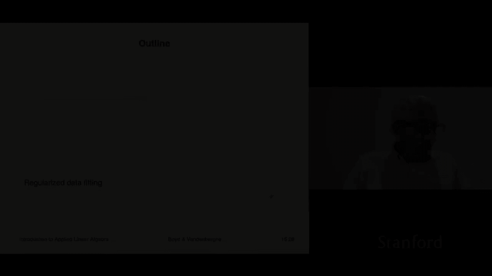
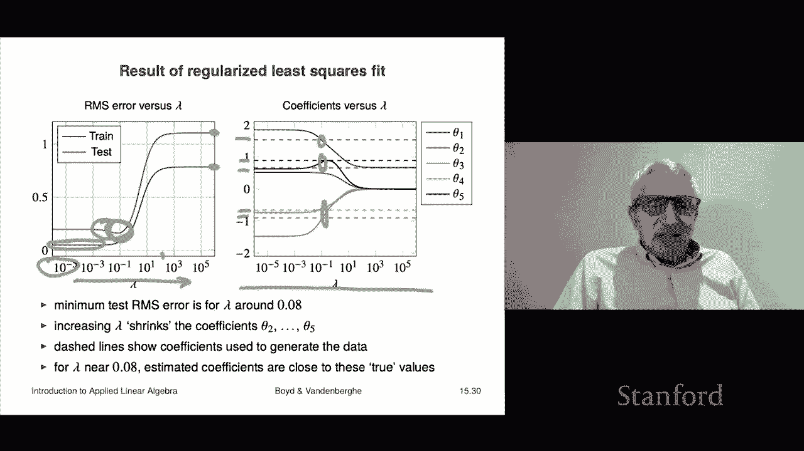

# 【双语字幕+资料下载】斯坦福ENGR108 ｜ 矩阵论与应用线性代数(2020·完整版) - P44：L15.4- 回归数据拟合 - ShowMeAI - BV17h411W7bk

Our next application of multi objective least squares is something called regularized data fitting it's a very powerful method to improve fitting models。

So let's start with the motivation。So let's consider fitting a data model that of some relationship that we guess holds like you know y is about equal to f of x F is some unknown function and what we'll do is we'll use a linear in the parameters model and that looks like this we will choose basis functions F1 through Fp of X and then what we'll do then is we'll fit to the data。

 the parameters in the model that multiply these basis functions that's going to be theta1 up to theta P here so that's going to be the idea and we're going to assume here that F1 of x is1 it's the constant that's very common and that means that this first term in the model is just theta1 people refer to that as the offset in the model。

Okay， now recall that one interpretation of what theta I is is it's how sensitive our prediction f hat of x is to f of x so for example。

 if I told you that theta3 equals zero， you would conclude that in fact。

 f sub3 of x has no effect whatsoever on our prediction on the other hand。

 if theta4 were for example， extremely large， that would mean that for just small changes for very small changes in F4 of x in the fourth basis function。

 if very small changes that would lead to very big changes in the prediction in other words it would be very sensitive。

 our prediction would be very sensitive。Now the idea here is that that's a bad idea oh I should mention one thing there is an exception if we look at theta if we look at i equals one。

Theta1 multiplies something a basis function that's constant and which is absolutely constant。

 it doesn't change， so theta1， which is the offset in the model。

 cannot you know we don't interpret that as a sensitivity。Okay。

 so the conclusion of all this and this is all very rough it's just basic intuition is this is we do not want theta2 up to theta p to be large And if someone says why don't you want them to be large you say。

 well that makes the larger they are the more sensitive my model is to what the values of these basis functions is okay that's the idea we don't care about theta1 theta1 is going be whatever it wants to be okay so this is all vague。

 but this is the motivation for regularization and so what we're to do in regularization is just have two objectives one is going to be the traditional least squares fit on your data and the second is going be that we would like theta2 to theta P to be small。

ok。So let's suppose we have a training data set and what we're going to do is we are going to express the error on this training data as a theta minus y these are capital n vectors here so these are the n vectors consisting of you know Y1 through Yn on the right hand side that's this one and and this on this thing is y hat evaluated at x1 up to XA okay and the matrix A remember is something like the basis functions evaluated at the data points all right so regularized data fit and goes like this you start the primary objective。

Is the usual least squares objective， It's this that。

That's the sum of the squares of the predictionaries。

 so that's we obviously want that small and in fact in least squares simple least squares data fitting。

 you simply make that small， that's what least squares data fitting is。We're going to add。

 we're going to make a bicriterion problem， we're going to add a second objective。

 and the second is this one says this is the sum square of the prediction errors。

This one says at the same time， I would like the coefficients theta 2 up to theta P to be small and we do this and lambda is called the regularization parameter here。

 This is called regularizing the data fit data fitting procedure okay。

We'll talk about how you would choose Lambda in a minute。

Now for a regression model this turns out this has a very simple look it's simply here y hat is explicitly x transpose beta x is the data matrix plus new times1 that's the one the vector of all ones here and what we minimizes this that's that's the vector of y hats and then here what we do is theta1 is V and we don't that we don't regularize but we do regularize the other which is beta so we simply make this thing up here now here let's mention a couple of things of what happens right when。

When lambmbda is zero， you recover just least squares data fitting， period， that's it。

 you just you minimize the sum of the squares of the predictionaries end up story。

When lambda gets really big， this whole thing， you're basically saying I put a huge cost on having the coefficients theta 2 to theta p being non-zero and so basically as lambda goes to infinity。

 theta theta 2 to p goes to zero and theta1 actually it's going to go to the mean of the data because what it means is that when lambda is really big。

 this reverts。To the constant model and remember that the best constant model of some data is the mean and by the way。

 the mean square prediction error is the square of the RMS value of y okay。

So that's that's what that does oh another word for regularization is shrinkage that's used in statistics and the reason is pretty clear what it does is this serves to shrink the coefficients。

😊，To make them smaller than they would be if you didn't have that term Okay now how do you choose lambmbda Well here there's a very good way to do it。

 What you typically do is you would actually build your model this way and you you work this you know you do this for 2030 different values of lambmbda traditionally and just as a practical matter those are spread over very large range and they're also typically logarithically spaced so you would work out。

 you'd get 20 different models 30 something like that with different values of lambda。

 you get a completely different model Then what you do is you go and take that model and you evaluate every single one of those on the test data set and then you look for you look for the point which has the best test error actually honestly what people do a lot of times is they choose lambmbda a little bit bigger than that because all other things being equal the larger lambda is kind of the smaller the theta2 to P is and therefore the less sensitive your model is right and that's just always。

Good thing to have an insensitive model， okay。So we're going to look at an example it's a very simple example it goes like this we have a we have a truth in this case it's all made up so we have a true function f y equals f of x actually plus a little bit of noise so the true function is this something that has this form with a sinusoid okay with certain values of theta 1 up to theta 5 okay so theta so we generate it and this black curve shows that the training data there's not much actually it's crazy it's these blue dots so there's just a couple1。

2，3，4，5，6，7，8，9，10 so we're going to train on those points now let me make a couple things pretty clear here for those blue points notice that we don't have any data suggesting this big dip in the function not a bit we don't have any data suggesting it goes like that。

I mean this is pretty crazy to fit this so what we're going to do is we'll fit a model using the train。

 the blue point， 10 blue points， and we'll evaluate it on the 20 points which are the red points。

And the model is going to have this form， it doesn't matter that the basis functions areus sinusoids it just it just doesn't that's not relevant。

Okay。So here's what happens and this is something actually you have to take a good look at it to kind of figure out。

 make sure what that works Now when lambmbda is super small over here。

 we're basically doing least squares。That's it least scores data fitting and it's not bad you know we get。

 you know I don't know what that is like that's about 0。2 so that's about 0。

05 so basically our RMS error on the training on the training set is quite low it's maybe 0。

05 on the test set it's 0。2 which is okay that's what it is but then you see something interesting as we increase lambmbda that's moving along here when you can see this is a good example where I said that we we would very lambda over a very wide range on a logarithmicically based scale okay。

So what happens there is you know basically as you increase lambmbda。

 nothing really happens to the model until around 10 to the minus1 and what's happening is the coefficients are now shrinking and of course the training error gets worse。

 that's how by objective optimization works right that if when you when you crank up lambda the second objective gets smaller and the first objective gets bigger and indeed it goes up and then roughly speaking for lambda bigger than 100 or so this is basically this is just basically the constant model So I would presume that these are in fact。

 the standard deviations of the training the test set okay so that's that but now let's let's focus on it see what happens the training error of course always gets worse as you increase lambda here's something amazing not amazing it kind of makes sense here you see this dip very characteristic sometimes much more。

It's much more pronounced other that we really get a much better model with some regularization in this case you got a slightly better or somewhat better model actually with regularization and what this does is it suggests you should choose。

Lambda around 0。1， as I said， sometimes you just take the one that gave you the best test error。

 but in fact usually people kind of skew it to a little bit larger because you know the more the less sensitive your model is the better okay。

And that's it。 So we choose that though。 And now what this shows， this is called。

This is called the regularization path so here we think of the coefficients theta 1 through theta5 as being functions of lambda and then that means that they they trace out a path or a curve and so and we're just plot it so here's lambda and here you go you can see oh I should explain this figure a bit these dashed lines show the the value the true value of the parameters now this is all completely fake made up data because you know and so there is such a thing as the true values of the parameters they're shown as the dashed lines so if your estimation method did really well we would be right on top of those dashed lines Now let me point out the model has five parameters and we fit on 10 data points so。

You know that's we should not expect to do that well， but nevertheless， here's what happens。

Up to about lambda equals， I don't know， 10 to the minus three or two or something like that。It's。

 it's the same Something super interesting happens right in here right where this is。

 which is where we what we want to do we think about  point1。 And if we look at。

 if we go up here and look at  point1， you see something actually kind of amazing。

What you see is write it about where that dip in the in the in the test error dips to its lowest point right about there actually weirdly our parameters kind of get weirdly close to the true parameters So that's kind of the idea and this is what regularization does this is not a very dramatic example sometimes if you have a lot of data you don't really need regularization but I don't know so I've heard friends say things like you know friends don't let friends fit models without regularization right because it's just a good idea to do some regular and if it turns out they don't need much regularization that simply means that you end up choosing you know a value of lambda that's 10 to the minus5 then that's just fine but in many cases it will enhance a model the performance of a model very substantially so that's regularized data data fitting I should say this is really。

You know， once you know about。Lase squares data fitting with regularization you're in I mean。

 you can be very effective at building building models， building prediction models。

So I mean this is really this this is enough for you to actually go out and really do well at this kind of stuff I mean there's a whole lot more for you to learn a lot of this stuff will be interpreted statistically when you take you know a course on that and all sorts of other stuff。

 but this is kind of the basics。

