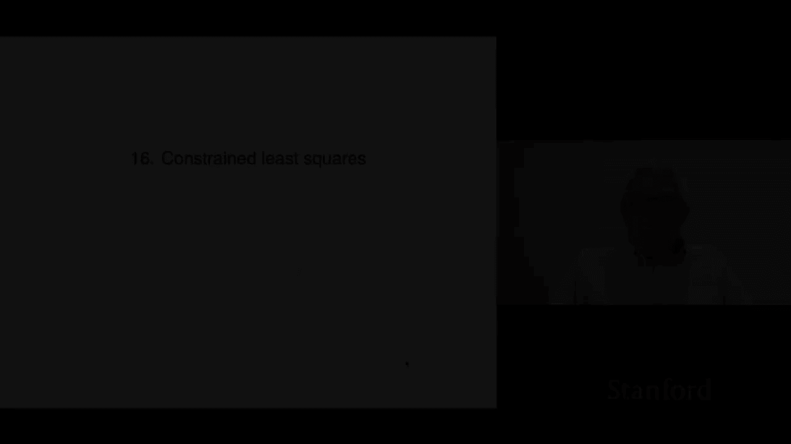
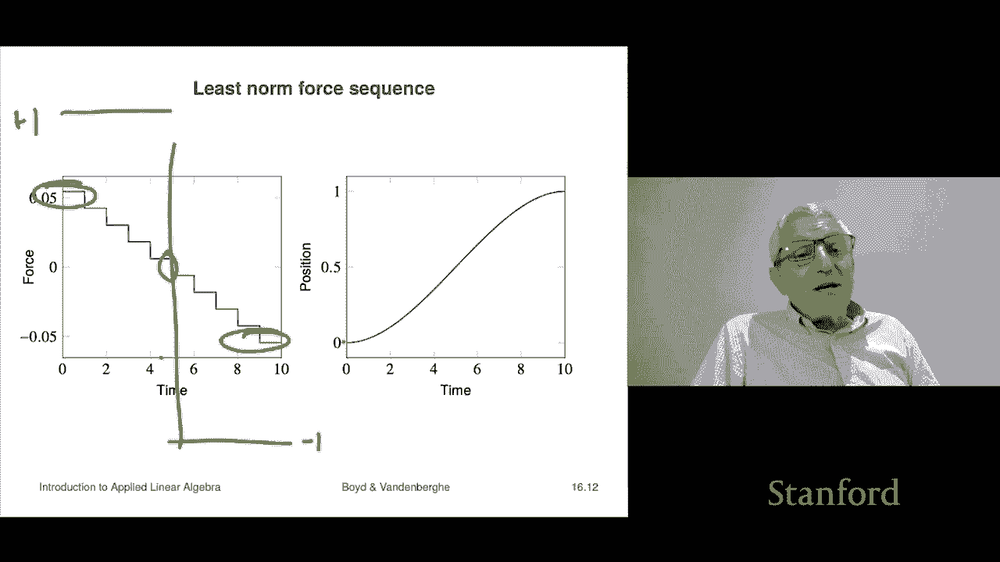

# 【双语字幕+资料下载】斯坦福ENGR108 ｜ 矩阵论与应用线性代数(2020·完整版) - P45：L16.1- 受约束的最小二乘 - ShowMeAI - BV17h411W7bk

Chapter 16 is on constrained least squares， that's an extension of least squares that allow that's going to allow us to add linear equality constraints to a least squares problem and that really actually pulls together kind of the two things you know how to do solve linear equations number one and number two least squares and this will actually's like a common parent of both of them。

Okay， so we'll start with defining what the problem is and we'll talk a little bit about the nomenclature and that sort of thing。

Okay， so here is the linearly constrained least squares problem we're going to call that CLS for constrained least squares and it's this it's an optimization problem and it is described this way it's minimize the norm of a x minus b squared Now by the way。

 that alone by itself is simply the least squares problem but then we have this subject to C x equals D。

Now the variable here。Which is the thing that we want to find or solve for or something or compute at some point。

 I this n vector X。 So that's what this means。 Now， what this objective。

 what this constraint means the semantics of it is this is that we we would like this to be small。

 So the smaller norm ax minus B squared is the happier we are the constraint says basically we will not consider any x that does not satisfy it。

 So if someone comes along and says hey， how about this x。

 if Cx is not equal to D we're not interested。 if Cx is equal to D。

 then we say that that point is feasible， and then we'd say okay， now then tell me the objective。

 and then of course if we have of two of these and they're both feasible。

 one has a lower objective than the other， we prefer that one。

 So that's the semantics of an optimization problem and this is kind of a standard form for describing one。

 I should say that these are this is not this is not。

Mathematical notation sorry these are not like mathematical operators like min min is a mathematical function that takes a finite number of real numbers and simply gives you the smallest of them so this is actually really what we're doing as we're describing an optimization problem okay。

So here the matrix A is M by N B B of course， must be an M vector。

C is a P by N matrix and sometimes people would say this problem has P linear equality constraints and the vector D is of course a P vector and these are called problem data the idea is that they're given right so you know them your job is to find X but you know A B C and D。

Okay now norm squared of ax minus B that's called the objective function so that's you've already seen that that's the objective function Cx equals D people would describe as the equality constraints so and it says basically we will not consider and any X that does not satisfy Cx equals D okay now what does it mean to be a solution of this problem to solve this problem。

 what we mean is two things number one we'll say that the vector x hat is a solution if it must be feasible it must satisfy cx hat equals D that's the point of the problem。

And the following is true for any vector X that satisfies a that satisfies C x equals do so for any other feasible vector。

 the objective of the point we are proposing X hat has to be less than or equal to the other one and that's it so it is the best in terms of lowest object it's the least objective point among。

All feasible points， that's one way to say it， okay。

So what's kind of cool about it is it combines solving least squares problems I mean because part of it I mean that's just that's this part is just least squares right here and then subject to a set of linear equations so it kind of glues together the solving linear equations least with the least squares problem。

Another way， a very good way to think of it also is it's a bicriterion problem is sort of in the limit of lambmbda going to infinity。

 in other words， if I were to form the bicrerion problem that looks and I'm going to scize it now so it looks like this right that's my objective。

Now the meaning of this is that we'll allow Cx to not equal D。

 but we're going to penalize you for it now as lambda goes to infinity that basically is telling us that you have your only choice is to have Cx equals D and so we would expect when lambda goes to infinity just basically you know by by objective least squares is going to give you a solution of the constrained least squares problem。

 the CLS problem here now we're going to find out that in fact you can we're going to find out that there's a direct method to solve directly the constrained least squares problem。

 but nevertheless this is not a bad way to think of it it is something like a by objective least squares problem as the weight on the second one goes to infinity which causes it to basically become anequ constraint。

So well look at a quick example， we are going to fit let's say some data or whatever or points to a so-called piecewise polynomial piecewise means that chunk up the function into this is a function on R scalar function so it says you chunk up R into intervals and then on each interval the function has you know a particular form possibly different coefficients so what we're going to do is we're going to say that F hat is going to be the polynomial P when x is less than some number a a is sometimes called the not point in such a model or it's equal to Q of x and they're both just cubic they're just cubic polynomials but we're going to add some constraints now。

And the constraints are going to say that we want number one we want F hat to be continuous and that means that when we evaluate you know。

 when you jump from a little bit less than a to a little bit more than a。

 we want to make sure that the function value is the same and so that would be this constraint P of a is Q of a。

And the other thing is we're going to ask for the derivative to be continuous by the way。

 we can also get the second derivative to be continuous there if we wanted and so these are our requirements by the way。

 when you have a piecewise polynomial and you make constraints on how many derivatives must match at each knot point。

 the resulting function is called a spline so that's something you'll almost certainly be hearing in whatever you end up doing you're going to hear about splines and so this would be a cubic spline of some kind I forget what kind of people I forget how people call it。

Okay， so what we're going to do now is we're going to fit F hat to some data X I Yi and we'll minimize the sum square error and we're just going to express that as a constrained least squares problem so this is going to be our that's going to be of course our objective and these are going to turn into that's going to turn into our Cx equals D part。

 the linear equations or linear constraints part of the problem。

Let me just show you how it works first so there's some data points scattered here here's the number A and the blue shows you P and the red shows you Q and what you can see here is okay well number one we solved it we'll see how to do that later you solved it and actually sure enough all of both the blue P and the red Q fit the given data pretty well but really cool part is this number one they match up at a that's one of our constraints and the second one is they're derivative is the same at a so and this is what it would do if I didn't do this right the red curve could go up like that and the blue curve like that and there'd be a jump there that would be by imposing this constraint I'm avoiding that jump。

Okay。So let's see how to actually put that problem into that standard CLS form。Well。

 the constraints are P of a equals Q of a。That's P of a。 And this is minus Q of a， right。

 So that's what that is。 And it just says zero' equal to 0。 So P of a minus q of a equals0。

 And then this expression here is p prime of a because， you know。

 just p prime is this polynomial theta1 plus theta 2 a plusta sorry。

 theta1 plus theta 2 x plus theta 23 x squared。 and you take the derivative。 and you get this。

 So this is that is this thing right here， that is literally that is p prime of a And this thing here is minus Q prime。

Of a okay and so and if we look at this， we'll see that this。

 we could write these two equations as C times theta equals d theta is the8 vector of parameters C would have two rows right so in our in our constrained least squares problem over here C we'd have P is two and that means that there would be two linear constraints and in fact you could even annotate them The first one says。

Continuity， continuity at the knot point， and the second one would say continuous derivative at the knot point。

Okay， so that's that。And of course， the prediction error is easy to do。

 I mean what you do is it's simply AI transpose theta minus Yi and AI is going to be either is one of these two things because you're selecting which polynomial you evaluate to fit the model and then the sum square errors is a theta minus y norm squared so this would this means we could we can easily we can put this immediately into this constrained least squares constrained least squares problem format now we don't yet know how to solve that problem。

 but we will， I mean later you'll have some code or it's going to be very short。

 it just gives you the solution of this you pass in A BC D what comes out is the solution that's it so that's coming up。

Before though we we jump into you know how you solve it， we want to look at a special case。

 which is actually fairly important， it's called the least norm problem it's just a special case。

 it's a special case when A equals I and B equals zero and so basically the problem looks like this。

It says find me， you know this is A X minus B， but a is the identity B is zero so it's just dorm x squared。

 So this says minimize the sum of the square find the minimize the sum of the squares of the components of x subject to x satisfying c equals d c x equals D。

Gmetrically that means find the smallest vector that satisfies a set of linear equations。

 so it's very interesting， usually in many applications somehow the size of x this will translate into something like find me the most efficient solution or something like that that's typically what it means。

And that's and this works， of course， when there's many many solutions of Cx equals d。

Let's look at an example of that， very simple example。

 so I have a unit mask on a frictionless surface。😊。

And it's initially at rest and then what we're going to do is we're going to have a 10 vector F and what it does we're going to apply to that mass。

 a force on it each one for one second， so we'll apply the force F1 in Newtons to this mass for one second right at one second we're going to switch to the force F2 and that sort of stuff now if you'd like to know what the final position and velocity are after10 the full 10 seconds is this the velocity is just the sum of the force right because if I apply one Newton to a1 kilogram mass for one second it acquires a speed of one right so which is that's fine And if I apply a force F1 it acquires a speed F1 okay so so it's actually the sum of the forces gives you the final velocity。

ok。The position you can work it out it's not it's not very hard but it's equal to this it's it's you know it's like nine and a half times F1 you know。

 I guess that is eight and a half times F2 and so on and only a half of F 10 right by the way。

You might ask yourself。Why is that that's weird right and the answer is really simple when I apply a the first force I apply I end up giving the mass of velocity。

 but it keeps that velocity for the rest for the rest for the remaining nine seconds that's why that works right and so that first in some ways that first that first force I apply is much more efficient right in terms of how far you get if that's your goal it's very whereas the last force you apply is right up to the last and that only gives you a half okay so anyway this is easy to derive all right。

Now here's what we want to do I would like to find a four sequence which moves which causes the final velocity of the mass to be zero and it's positioned to be one so very simple this is actually kind we're literally it's called in control it's called transferring the mass so the mass is sitting here at position zero velocity zero and after 10 seconds I need it to be1 meter to the right that's what I'm taking one to mean one meter to the right and and it should be stationary there okay so that's that's my that's my job okay now there's a ton of four sequences that do that。

Rough I mean， here's a simple example right if you apply a one newton force so you push it real hard。

 it'll accelerate after one second to a speed of one meter per second right that'll it'll have gone half the distance right then then I instantly switch the force to instead of full pushing to full pulling now I pull the mass for the next seconds and all I'm doing is I'm bleeding off the the speed I'm bleeding off the velocity and so what happens is over the next half second the velocity goes right down to zero。

Write it right at the end of two seconds the velocity is zero oh and the position is one because I also move another half half a meter so I'm actually right where I want to be after two seconds and then I just sit tight and that means apply zero force for the next eight seconds now of course what that means is that I mean if you apply zero force to something that's you know。

0ero velocity zero position it just sits there Okay so this is this is this is called bang bang because the force goes up to a large value then switch instantly down to the negative of that Okay and this comes up a bunch of in a bunch of different things Okay。

 so but there's lots of other fs。So here is the bang bang for sequence and here's the position over time right so this is and it makes perfect sense like how do you move something from here to here first you have push it to get it going then that's this part right and then you you pull you pull on it to bleed the speed off so that when it arrives at the at the final target position is you know it's stationary it has velocity zero oh I should mention something just for fun。

Here we're using the requirements that v final equals zero but there are applications where this is not there。

Okay， so。I'll give you a rough idea about that if someone， well， okay。

 I can tell exactly where this comes up if this is something like a missile then。Or a bomb。

 right then？Then what someone says is yeah get me to the target and say yeah get me to the target you don't like sure no problem and then you say by the way。

 when you arrive at the target what speed would you like to be going there're like it doesn't matter okay so roughly speaking when you see optimization problems where the final target specifies the position but not the velocity generally speaking these are not socially positive applications but they have them obviously I just thought I'd mention that。

Okay， what we're to do now is we're going to find the least norm for sequence so this is this is a solution of the problem I mean it's just we're satisfied this F satisfies our our equation which is just CFf equals D D just happens to be you know10 okay01 sorry01 okay but that's so this is one one solution of this very much under specified or underdetered linear equation but we're to see another one and notice just remember the number it's one Newton and minus1 Newton。

What we're going to do now is set this up and find the。

 if you like the gentles force that transfers a mass1 meter in you know over 10 seconds the gentles force and we'll define gentle by the sum of the squares of the forces right okay so here we end up solving this very specifically norm problem right here and you can understand everything here the first one。

 the first equation is telling it to some of the fs should be zero。

 that's the one that says that when you arrive at the at the target position you should be the velocity zero and the second one says you'll actually make it to the target okay。

Now it turns out that when we work out what that is now you can work it out analytically。

 but there's no reason to do that， you just use the methods we're going to talk about later and you can do it numerically。

 but here's what happens， you end up with a norm squared of the solution of this being 0。0121。

That is compared to the bangb one has a norm squared of two because it's one Newton and then it's minus one Newton you square those in atom you get two okay so this is what is that200 times you know quote gentler it's basically you're applying a force that is if you care about mean the sum of the squares of the forces it's 200 times smaller that's not surprising right because you're obviously could do it a whole lot more gently than you know you know you know giving it a big accelator and besides we're wasting this thing gets you there in two steps but I gave you 10 so okay so it's not surprising now let's look at that force here's the force and here we go we go from position zero to position 10。

Notice completely different scale。 That's 0。05 and0。05。 If you remember the bang bang4 sequence。

 that was plus1 Newton and 1 Newton。 So this is 20 times smaller sorry。

 starts 20 times smaller and then gets even smaller still Here's the interesting thing。 you know。

 bang bang looked like this on a completely different scale。

 It would look like this and then switch over， you know， switch down to here right。

 This would be it plus one。And minus one。 but what you can see here is pretty cool what it does is it starts by pushing it。

You know， 0。05， which is a whole lot less than 1 。05 noton。

Then on the next step it's a little bit less a little bit less a little bit less And then right at t equals5 is when you switch over from a small push to a small pole and then you pull a little harder and a little harder still and so and then by the time you get to the end you're pulling it symmetrical it's like you know minus 0。

05 you're pulling by 0。05 newtons roughly okay and then end here is the trajectory right and it's actually kind of cool nice and smooth so people use force trajectories like this like all the time I mean this is very very common is to use these things because you generate beautiful nice smooth force trajectories so that is kind of the idea okay so now we haven't yet said how to solve a constrained least squares problem or a least norm problem that's gonna to be our next topic。

