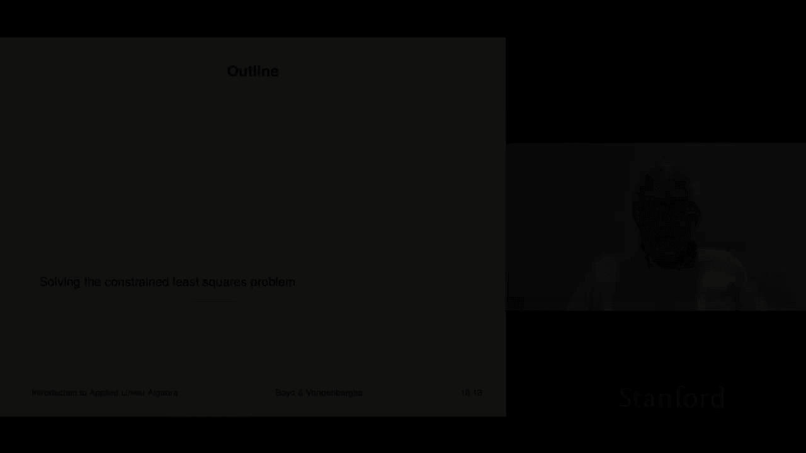
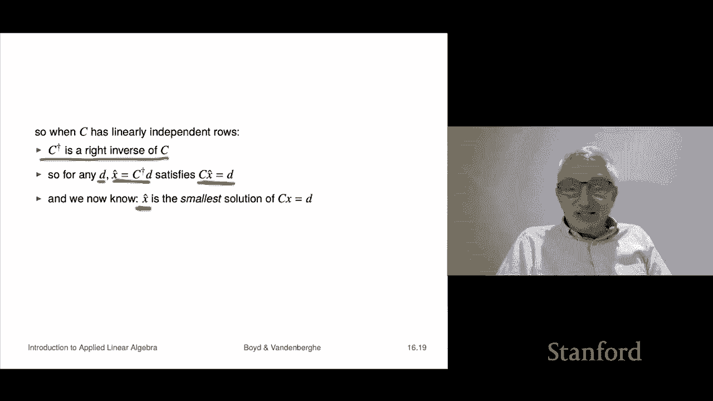

# 【双语字幕+资料下载】斯坦福ENGR108 ｜ 矩阵论与应用线性代数(2020·完整版) - P46：L16.2- 受约束的最小二乘求解 - ShowMeAI - BV17h411W7bk

All right， now I'm going to show you how to solve the constrained least squares problem。

Actually it's going to turn out to be very much like the least squares problem that will reduce it to something that involves our old friend the QR factorization or solving linear equations let's see how that works。

So we'll start with a derivation from calculus that is if you remember this but actually after this I'm going to give you a derivation which frankly I find much clearer and is much simpler so but we'll start with this one because it's traditional and after all most of you or many of you were already tortured by you know by having to take a calculus class and so we might as well go back and use use what you learn there okay so what calculus says is something like this it says if you want to solve this optimization problem here then what you're going to do is you're going to produce something called the Lagrangian function that's named after a famous mathematician named Lagrange in fact I think his name already came up once already in Lagrange polynomials for example okay。

So and what the Laangian is this is this is you introduce these numbers Z1 up to Zp these are called lagangrange multipliers and it says that you should take the objective function here and you should add that's the constraint these are the constraint residuals these things C1 transpose X minus is d1 to Cp transpose X minus is Dp and we multiply those by the Laange multiple and that's the Larangian okay now anyway then then what you're told is this is the optimality conditions or simply this you take the partial derivative of the laggrangian with respect to X that has to be zero and the partial derivative with respect to all the Zs have to be zero okay so I actually remember being taught this and。

Having absolutely no clue what it meant， I don't know that I actually really learned it until maybe I was in grad school or something like that to really get it Now in this class we're not going to get into we're not going to get into what it really what it is So we're not going do that But you know if you take a course on optimization maybe maybe at that point this will become clear And in fact it's funny because it's actually normally just taught as a set of behaviors or tips It's like you want to solve that fine form Lagrian said the partial which is equal to zero And if you ask why they're like just do it So okay's that was my experience anyway So if you feel the same way。

 that's fine。Okay so let's look at these conditions。 Well。

 the first one says I should take the partial the second one I should say takes the partial derivative to Z and set it equal to zero and if I take the partial derivative with respect to say Z1 I simply get c1 transpose x minus d1 is0 so I get these but we knew that that's the constraint so we knew that so the second set group of equal the partial derivative of L with respect to the Zs is just basically reaffirming that we can't we have to choose something that is feasible now the first n equations those are more interesting that's the partial derivative of L with respect to X and when you go back and work out what it is we have to take the partial derivative L with to X and you can see there's contributions in here but there's also contribution in here and that's actually a calculation we did before I'm not going to do it right now。

 but it turns out to be exactly this It's two times。The sum of a transpose A I J。

 X hat J minus2 a transpose B sub I plus this， these are the terms that come from those other terms。

 the other terms where the dual variables are， the lirons multipliers， that's the thing okay。

In matrix vector form you get this equation that is going to be that's the second set of equations that have to be satisfied you know when you take the partial reserv laggrangian okay。

 so this one I can write as Cx hat equals D and this one I write this way and now what I'm going to do is I'm going to collect。

This equation， equations， system of equations， this set of equations。

 And I'm going to collect them into one big equation for both variables， the X hat and the Z。

 Now the truth is we don't care about the Z。 I mean， I mean in some applications。

 you do care about the Z， but that's beyond the scope of this course。 We don't care about Z。

 So Z is just something you have to calculate in order to get X hat。 So that's fine。

 So what we'll do is we'll calculate X hat and Z， and then we'll just throw away Z and use X hat。

 So all right， so let's see that I've done this correctly when I stack these two equations。 Well。

 the bottom equation is C， these are blocked multiplications I'm doing now。

 C X hat plus zero times Z is D。 Oh， so the bottom one just says is this okay。

The top one is2 a transpose a X hat plus C transpose Z equals2 a transpose B， hey。

 that's exactly this。This this set of equations here expresses basically these lage conditions。

 the lagange conditions are， well these things written out in a general form that the partial respect to X is zero。

 partial respect to Z is zero okay， and we get this and these equations。

Have a name they're called the KkT for Kaouush kun Tucker these are three mathematicians who did some work on this actually what they did was something much more sophisticated with inequality constraints。

 but nevertheless we would call these the Kkt or Karoush kun Tucker conditions and that's a square set of n plus P linear equations in the variables which indeed have size。

N plus P， so that's a square set of n plus p equations with n plus P variables。

And one very good way to think of this equation is it's a generalization of the normal equations for least squares to constrain least squares。

 So remember that the normal equations were something like a transpose a X hat you know equals you know a transpose B these are the normal equations and that's actually that's what this equation comes down to if you remove C。

 I mean， that's what it is you divide by two as well。

 so you can think of this as this is this is the Kkt equations are the the extension of the normal equations to constrained least squares right so that's what this is these are called the optimality conditions or something like that Okay by the way。

 this is very cool because you know what we've done is we have reduced。😊。

Solving a problem that we didn't know how to solve。

 which is constrained least squares problem to one， we do know how to solve。

 which is solving linear equations right so。That' that's kind of our trick and truth is we kind of did it with least squares as well so。

ok。Now assuming that that KT matrix is invertible， then you just solve for X hat and Z。

 you do something like this and that's the solution now we don't care about Z but we do get X hat and that's great so we have a way now to solve to solve constrained least squares problems now。

 I mean one simple method simply takes that matrix and just solves it which you could do by for example。

 QR factorization of that。Now you might be interested in when this matrix is invertible and that really means when is your constrained least squares problem sensible roughly speaking right and I'm not going to go into the details but it comes down to this C has linearly independent rows and then a stacked on C has linearly independent columns and you'll see that this kind of well first of all it implies something about the sizes of various things right？

It says that the number of linear equations has to be less than dimension of the variable well sure okay in other words。

 the Cx equals D equations have to be underdetermined or square they're square it's a bit silly but because you just solve it and then that's your answer and the cost of computing it there's many ways to do it one is just to solve for this thing and it's basically like n plus p cubed is what it is right so that's that's how fast you can compute it so okay。

Now what I want to do now is give what I think is a far better derivation of the solution of the constrained least squares problem and it uses nothing but like the most elementary matrix vector notation and deep mathematical concepts like you know the sum of two non negative numbers is non negative okay so and it also doesn't require any faith。

 the truth is if you go back to this to this story， this Lagrangian story。嗯。

We were lucky in that there was only one solution of these right it's the KkT system or something like that。

 but in general， the real story in calculus goes like this。

 you can find points that satisfy these which are not optimal right so。Roughly speaking。

 this Lagrian method says I can give you some candidates and then it's your job to go figure out if they're actually optimal or not。

That second question actually a lot of people don't even they forget about that here this will just be a completely independent verification very elementary goes like this。

🤧So I'm going to show you that X hat is a solution X hat is is this one it's the one that says it's that it's the X that it's this one given by this。

 I'm going to show you that's a solution。Okay to do that。

 I'll say suppose x is any vector at all that satisfies c x equals D so you we would say any feasible vector satisfies the equations Okay then and what I'm going to do is I'm going to show you that the norm squared of a minus B is bigger than is bigger than or equal to the norm squared of a hat minus B and then that'll show immediately that that's my alleged x hat my alleged solution x hat is really the solution so norm a minus B。

 I do the same trick we did with least squares I take that and I do something silly。

 I add ax hat and I add ax hat here okay and I subtract it which is silly but now I'm going to use this formula for the norm squared of two vectors it's the norm squared to the first。

Plus the norm squared to the second， and then plus two times the inner product of the vectors。

The norm square to the first is this norm squared to the second is that。

And then I have this inner product， that's the inner product of the two vectors。

 twice the inner product。Okay， now what we're going to do is we're going to use we're now going to use so far I haven't used anything about Xha。

 but now I am。X hat satisfies this equation right because that that's the first row of the KkT system okay。

 that's the second row and Cx and Cx hat both have to be D because they're both feasible that's our assumption sorry X hat is feasible by construction X is feasible by assumption。

Okay， so what this says is if I look at this inner product here and I work out what that is。

 I get two x minus x hat transpose here。 I'm pulling the a out here。

 and then putting it over here to a transpose。 Then I look at a transpose times a X hat minus B。

 That's right up here。 That's C。 And I get this thing。

And then I go over here and I get minus c times x minus x half now Cx， I can tell you this， Cx is d。

C x hat is D because they're both feasible， so C times x minus x hat。

Is actually it's D is actually d minus d so that's this thing is zero and that says this thing is just zero。

 it just gone and then what this says is that the norm of ax minus b squared here is it is actually equal to this it's the norm of ax hat minus b squared plus and then this thing is nonneg so that means that it's bigger than this so I'm done so which is kind of cool so that's it's that simple it didn't use any anything complicated so that's a direct verification that the solution of the constrained least squares problem is given by this this is and it's a formula but it doesn't matter you can compute it many things actually a lot of linear rounds where packages would have a function that would solve the constrained least squares problem well you can write one yourself and it's about two lines long right it just sets up forms the Kkt matrix then you know solves it。

With backslash or something like that。ok。Now let's turn to the least norm problem we'll see a beautiful thing emerges and something pretty cool that ties a lot of the stuff we've seen together so the least norm problem says minimize norm x squared subject to c x equals D well some pretty cool things happen number one when we form the KkT matrix which is this it's actually assuming C has independent rows。

 this matrix is always invertim so because I stacked on top of C has independent columns I mean of course because of if you look at the I on top。

We're going to assume C has independent rows and that says you get this now here this system generally speaking when you see a system of equations。

 the right thing to do is，Don't try to solve it by hand。Mistake。Let a computer do it。

Now there are exceptions sometimes when something is simple enough that， you know， well。

 this is in the case of that， then it's time to get out your pencil and do some algebra and stuff like that now。

Here， the first equation says basically two x hat。Plus C transpose z equals zero and that tells us that x hat is minus one half c transpose z Now the second equation is C x hat equals D and I simply plug in this value of x hat and I get this。

That gives me Z， so I know Z is minus2 C transpose inverse D。

 and I plug that into the first equation and I end up with this x is equal to C transpose times C transpose inverse times D。

But that's our friend， that's our CE remember is wide and this is precisely the pseudo inverse。

 so it says that the solution of the least norm problem is the pseudo inverse。

Times the right hand side that's it so very cool So what this says is if a matrix C has linearly independent rows。

 then we already saw well a while ago that that the pseudo inverse of that matrix。

Is a right inverse of seat， we already saw that。And what that tells you you know is that for any D at all。

 if you plug in x hat equals C dagger D that satisfies cx equals D that's what it means to be you know a right inverse right but now we know more this is a special right inverse and it is the right inverse it says that X hat which is a solution of cx equals D it's really cool now we know it's actually the solution with the smallest norm so so it gives you the smallest solution of cx equals D so it's very nice ties a bunch of stuff we've seen together and of course you can compute this by a Qr factorization on C transpose right so。

That's all so everything sort of ties nicely together。

