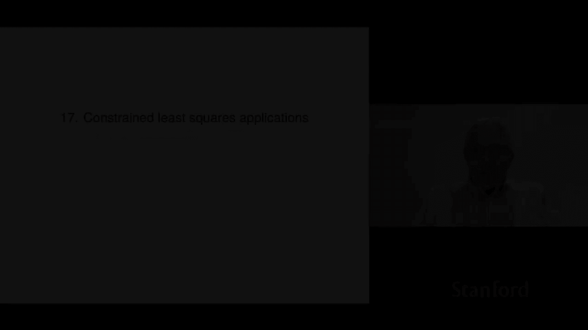

# P47：L17.1- 组合优化 - ShowMeAI - BV17h411W7bk

Chapter 17 is on applications of constrained least squares。

 each of the applications in itself is like a huge field， you can take whole courses。

 multiple courses on them， but it's just to show you it's a very。

 very simple introduction and you can actually do something with constrained least squares。

So our first one is going to be on portfolio optimization in finance。Okay。

 so here's the setting is this is that we're going to have we're going to invest a total of V dollars V is positive in n different assets so these could be different stocks。

 bonds， ETFs， I mean it actually doesn't matter what they are over some period could be a day。

 week month I mean this doesn't matter。Now our investments can include short positions now a short position is essentially owning a negative amount of something and what it means is you borrow the asset。

 for example， a share of Google stock， I borrow it， sell it immediately so I receive cash。

 but now I have the obligation to repay or to pay back to return one share of Google later at some point。

Sos that's it and it turns out that's pretty much equivalent to owning a negative share of Google at first it sounds strange and it is strange。

 but that's what it is okay。Now we can describe our portfolio by a portfolio allocation weight vector W okay and this is relatively common notation and what it does is Wi or WJ gives you the fraction of your total portfolio value that you hold in asset J and that means for example。

 that capital V that's your total portfolio value in dollars times WJ that gives you the dollar value of how much you hold of asset J now well by construction W one transpose W。

 which is the sum of the weights is one and that's why that's why it's supposed to be a weight vector right it's something that adds up to one now they're not necessarily non-ne the entries。

 they could be negative and when you see a negative one that simply means a short position in fact the term for a portfolio。

lioThat doesn't contain negative weights or short positions is long only because you can have a short position and a long position long position means you actually own the thing and so a long only portfolio is one where the W all the entries in W are non negative。

Okay， so here's a very specific example with three assets I have my weight vectors minus020。01。

2 notice that the weights do sum up to 1 okay and what does this mean well it means that we actually take a short position of 。

2 capital V that's in dollars and asset one we don't hold any of asset two that's what the zero means here and then in asset3。

 we hold 1。2 times our value so roughly speaking what happened is we we sold asset one that we don't even have use the proceeds to buy more of asset3 then well even then the total value of our portfolio right so that's kind of the idea now obviously you would only have a portfolio like that if you thought for some reason you know the first asset was going to go down in value and the third asset was going to go up and the reason is pretty simple there that if the first asset。

It goes down in value， then later when I make good on my obligation to return the short position or close out the short position is how people would say it it's cheaper for me so I've made money on that and if the third asset goes up then when I sell it i'm going to do well so anyway that's the basic idea。

Okay， so there's a concept of leverage and actually there's several different definitions of leverage and as far as I can tell all are used so and you know just it's no big deal you just have to ask somebody when they say the leverage is you know to what they mean which definition are they using so here's the definition will'll use because it's simple it's the sum of the absolute values of the weights okay so that's the idea I mean another definition that's quite common is our L minus1 then divided by two and and I think both are used now you know henceforth use our definition of leverage so capital L the leverage is one when all the weights are non- negative because when the weights are non- negative the absolute values up here are actually equal to you don't need the absolute values because they're all non negative and then L is the sum of the w's but that's one so and that's the smallest。

The leverage could be so that's that's a long only portfolio tells you the leverage is one Some people would say you are unleveraged right so leverage generally means if it's bigger than one it means at least one of the weights is less than zero it means you hold a short position and by leverage what it means is pretty much you've sold some assets whichever ones you're holding short and use the proceeds to pile more money into other investments that's kind of the idea behind leverage okay oh another portfolio that comes up is the so-called one over end portfolio or in our language the ones over end portfolio and that's also called the uniform portfolio and it's basically like you know yeah if you've got 10 assets but 10% of the total value in all of them that's it。

Okay， now another common assumption is that we'll often assume that asset N。

 some people use asset one doesn't matter is risk free is the way people would say that and that's another way to say that people also say cash or Treasury bills。

 the idea being is that there's not is that there's not much risk in Treasury bills。

Okay so that's like asset N is a special one it's riskfr actually it's kind of interesting at some point all these things start sounding the same that's very much like in regression or something when I'm building a model and my first basis function is the ones vector right so my first basis function is the constant function one and so that one is special it's a constant and we'll see that that's kind of what this is as well。

So with that assumption if you have w equals EN， it says put all of your zero of your portfolio on assets one to n minus one and put 100% of your portfolio value on asset N if asset N is cash。

 then you'd say well that's the portfolio is in all cash okay， so it's just some basics。O。嗯。

Now we'll talk about the return over a period so what we'll do is we'll let our the subj it's going to be the return of asset J over the period and well define that as the fractional increase in the price or value and it's a decrease if if it's negative right if the return is negative it means it decreased in value and it's often expresses a percent like you know plus 1。

1 or minus 2。3 so if you say the return was minus 2。

3% it means that you know for every dollar you put in the value at the end of the period was whatever it would be so 97 I guess 97。

7% cents okay so that's what that means。Now your portfolio value also changes over the investment period and we're going to call the after investment period value of your portfolio v plus and the initial portfolio as V so V plus is V plus minus v is the increase in value of your portfolio now it could be negative which means you lost money but or lost value if if but that's what it is it's simply the increase and I'm not saying it necessarily increases but it's the increase in the value of the portfolio and I divide that by the initial value and then that is the fractional increase in the value of the portfolio。

That's called a portfolio return and it turns out that is exactly simply Artility transpose W where Artillility is is the fractional is the return the vector that gives you the fractional returns of all the assets so here you goes just in other words。

 we're back to week one of the class is just an inner product so if you have you know the weights in product taking the inner product of the weights with the fractional returns of the assets individual assets gives you the fractional increase in value or the return of the whole portfolio just inner product。

O。Now what happens is if you hold a portfolio for T periods and the returns over that periods are R1。

 R2， R3， and so on， then the value at the end of the period is this it's actually you take a product it's V1 times1 plus R1 times1 plus r2 you know and so on。

 so that's the actual value of the portfolio right and this is you if I tell you a look。

I put in a million dollars， and then it goes up 5% and then down 7， then up three， then up 6。

 then down to， you know， that kind of thing。 then the value at the end is gonna to look like that。

 So because you just each time you're just multiplying by one plus the return Okay and for some reason that's historical and that I don't know the origin of portfolio values versus time are traditionally plotted using from an initial portfolio of $10000。

 I don't know why。 but it's it's a number maybe from the 60s or I'd have no idea what it is。

 but that's what it is。 I mean， so you'll see that， but you'll see everything else。

 you'll see people start with a dollar or something and and of course。

 if you if you it's linear in that amount right So if I double the amount you put in initially then the total value at the end is double that So okay so in sense that that doesn't matter But just so you know。

 you're gonna to see things that are referenced to $10000 at the beginning and you might ask why and the answer is。

Well， two things， number one， I don't know， and number two， it's historical for sure。Okay。

So this brings us to the return matrix So suppose we're gonna hold a portfolio with weights W over T periods Okay so this is the setting and we're going to define an asset return matrix which is going be T by N So here's T and N I've drawn it as if it's tall that's often the case。

 but not always right so we we could easily have oh I should say that the asset the group of all the assets you're investing in I'll teach you some slang is called the investment universe So n is the size of the universe of assets and so it would be like here be the kind of things people would say what's your universe and the person would come back and say I don't know US whatever high cap or who knows that kind of thing anyway now you know another slang word all right so we make this return matrix are and it's T by N now the rows correspond to。

Periods time periods and you know， a very common thing would be a day but I mean none of this the math works if this is every one minute if it's every week quarter year。

 it doesn't really doesn't matter but let's just I'll continue talking speaking as if we're talking about daily stuff okay so so each row here is going to be is actually the transpose of the return vector over period T so those are thes that's the row so a row here would tell you how did all the assets due on that particular day okay now column is super interesting a column focuses on a single asset and it tells you the time series of its returns Okay so that's what that is。

Now the portfolio return time series is simply well， it's it matrix vector multiplication。

 you multiply this matrix by the weight vector W and you get Rw and that is that's your that's your that's a time series so little R is a time series capital T long of the portfolio return so if you looked at it it would say it would be minus 。

01 plus 0。02 minus you know 0。005 you know and that means it kind of you know went down a percent that went up 2% then down half a percent that kind of thing Okay all right。

So if the last asset is risk freeee in which we're going to assume。

 then the last column is that's the return series of that riskfree asset and what that is it's very simple it is simply mu risk free which is a number times ones in other words it's constant so that's what it means to be risk free I mean if you like you can set sorry mu risk free equal to know one or whatever and then it just means it's like putting whatever dollars you know under the mattress or something it just nothing happens but what it really means it goes up and now by the way interest rates at the time this is 2020 interest rates are like super low so it might as well be zero frankly but in any case thats that's the idea is that is that you get the interest rate on if it's daily you know one day's interest which is extremely small right now fine okay and that's called the risk free per period interest rate's。

And， you know， it makes perfect sense， I mean， if you scan， well， first of all。

 the standard deviation of that column。Is zero because it's constant and that's actually kind of that's going to be one of our definitions of risk is you know how much does a return vary and that last column it's zero and that's why we call it risk free Now you look if there's another column in there which is Tesla or Google or something like that or you'll see it be positive negative positive who knows what it is right varying all around。

And that's， of course， not risk free。O。So。So here I get I'm going to get a time series that's a vector a portfolio returns it depends on W and we're going to go into great detail about that later。

 but for right now we just say depends on it's w's fixed it doesn't matter how you got it doesn't matter but once you fixed W you get a time series of portfolio returns that's R here I could plot it I could do all sorts of stuff now the average return or people just say the return is the average of that so that's the average return and the risk is the standard deviation so the standard deviation the risk of your portfolio says。

How variable is the portfolio return that's really bad that's what the standard deviation measures and so if it's zero。

 which would be the case if w equals E that means put the entire portfolio into the risk free thing then the risk is zero because the portfolio return is mu risk free and the standard deviation zero because every single day you earn exactly mu risk free so that's what and that's what people call risk okay。

Now they're related to the increase in value， not directly， Ive it's not like it's equal to it。

 but here's the analysis It says if you look at what is Vt plus1 that's what's the value of your portfolio basically if you propagate for t time stepss from one your initial time step and it's equal to this it's v1 and well you remember it's the initial value times and then you just simply multiply by all the returns by the way。

 some people refer to this process of multip of taking the product of one plus things as compounding right so it means kind of if get if you do well you reinvest for us that's of that's what the weight vector means now this I'm going to expand this now and the first term I get is when I multiply all the ones together in this big product here and that's going to give me V1 then I get V1 and the next term is when I get in all of these。

I take all of the ones except one of them and then I take one of the R's and that's going to give me this this term here now what's missing。

 I can tell you what I have neglected in that approximation I've neglected all the terms where there's products like you know R three times R7 and in fact there's even like even bigger ones。

The argument goes like this if our is on the order of like you know11% something will you know but just roughly right if our is on the order of a percent or something it's 0。

01 and so this thing makes sense here but when you multiply you know two quantities on the order of 001 you get something that's 10 to the minus 4 and it's basically negligible so okay so that's the approximation being made here and that says that your value at。

At you know if you go capital T periods in the future。

 it's basically your initial value plus your initial value times this number。

 which is t times the average return right so the basic idea is it tells you that the average return tells you something about the increase in portfolio value over that period and you look if the returns are ridiculous things like plus minus you 0。

15。2 then this is kind of a crappy approximation but nevertheless it's a good one for in fact for a lot of situation is actually a very good one。

Oh and the only thing I should say about that is this tells you why you would want the return to be large I mean look it's kind of obvious why you'd want the return to be large。

 this quantifies it， it basically says has it has to do with an approximation that tells you about your your increase in value over some period。

O。So usually both risk and return for a financial return time series are not quoted as you per day or per week or per month or whatever you're doingre they're all converted to what it would be over a year and that's called annualized and that way it's easier right if I say what's the return on a thing and you go not so bad it's 15% what they mean is it's 15% over a year what's the risk on it that's also given as 12% over a year something like that right So the way you do that is the annualized return that's an easy calculation you simply multiply if there's P periods per year then you simply multiply so if this is weekly that might be 52 right if it's daily there's about let's see there's about 250 maybe closer to 252 trading days in a year obviously it depends on the market and all that kind of stuff so it can be more or less I。

The all sorts of stuff， but that's appeal would be about 250 there there's a good approximation of it if it's daily trading。

The annualized risk is interesting you don't multiply by P Actually what you do is you take the standard sorry the variance and you multiply that you multiply by P standard deviation is the square root of that and so you actually have to take the square root of P so it says that the annualized risk is the square root of P so that's about 16 or something like that if you have 250 and it says if you have 250 trading days a year your annualized return right would be 250 times the average of the daily return。

And your annualized risk would be squared 250 and you know what if it's not 250 it's 252 or 251 you know go ahead and fix this is just to give you a rough idea of what it is Okay so so this is just if I'm just saying if you go and read a book on finance or something like that are the this is what you're gonna see and it kind of makes sense right because otherwise it's hard to in your head people are going to do this calculation in their head anyway so this is how people quote things。

Okay。We now come that's all the preliminaries and we now come to the main question here。

 which is how should we choose。This the weights should we just make it uniform that's the one over n portfolio or written in math it's w equals ones over n I mean what should be W right now we have two dederada so there's two things that we want here the first is we want high mean portfolio return。

And we want low portfolio risk， so this is a by objective problem I mean immediately we can see that it's a it's a problem involving we want the mean to be high and we want the risk to be low now。

The tricky part， you know I'm sure someone has said this。

 the tricky part is of course you don't know what the returns are going to be in the future。

 by the way， if you did。You don't need any of this to do very well So yeah if you had it if you had the possibility of knowing future returns。

 you could do very well without this Okay so we don't know that。

 but here's what we do know we do know we know let's say for example。

 last year's returns because it's historical record we can go look it up So of course we don't know next year's returns right I should add you know that's basically what happens if you walk into a hedge fund that's basically what people are doing as they're trying to figure out what are you know what are next year's returns not just hedge funds I mean any kind of any kind of people anyone putting together a portfolio is basically doing that they're trying to figure out you know what's going to happen to Tesla might be in the next hour might be in the tomorrow or 10 days from now and it might be you know quarter by quarter okay。

So we don't know the future basically， but we do know the past and so here's the idea and is this we're going to choose a weight vector that would have worked well on past returns。

 that's what we're going to do。And this is a matter of faith。

 which is not always well founded or whatever and we're simply going to hope that it is going to work well going forward。

 so that is going to be the approach now。It sounds weird and well get we'll get to just how weird it is。

 but I do want to point out it's not it's not I mean that's exactly what we could do on data fitting right if you do data fitting and someone says what are you doing you'd say。

 well， I'm fitting a model and you go well what do you really want to do oh well I wanted to be able to predict you starting next week I wanted to be able to predict demand for my product。

And they were like， well， how are you doing， and you go， well， well。

 I'm using this data from last year。And they're like。

 yeah but the demand last year is not the demand next year and you go yeah I know anyway so I'm just saying data fitting is very is very similar and we'll get to what the essential the essential assumption is something like that yeah but if。

If the way demand varied last year is the same as how it continues to vary this year。

 then a model built on last year's demand data should be pretty good for next year or something like that right so it's the same thing in finance。

 maybe with more surprises I would say。O。So we are going to get to portfolio optimization now。

 it is in fact a constrained least squares problem。

 at least in our formulation of it so here's how we're going to do it we are remember we have two deta we want。

High return， which is the average of little R， and we want low risk and the risk is the standard deviation。

Vance which is the square of that okay so here's what we're going to do what we're going to do is we are going to specify a required returned row that's it so if row is 0。

1 it means we are requiring a we are requiring a return of row of 10% that's it okay now then what we're to do is we're then going to minimize the variance of the time series little R this is little R which is a portfolio return。

Now the variance of something is basically that's not the yeah。

 it's the variance is the mean square deviation from the mean okay， so normally。

 but the point is we're actually requiring the mean to be rh so。It's like okay。

 so we just put that here so the point is that the standard deviation of RW squared is you know which is the mean square deviation from the mean that's given by this expression here now rh is given R is data and our job of course the variable that we're going to find out that we want to seek is W the weight vector。

The first constraint， which is linear the linear constraint equality constraint says that that W sums to one well that's kind of by definition so that's fine And the second one here is the one that says I want the average return at least historically to have been row so that's the idea so let's see let me talk about some of these things here I think we talk about most of these things oh when you here you can vary row and you'll get different portfolios And in fact you can even think about what row is row tells you it's the required return and the larger it gets basically people would say the more aggressive your portfolio is because you're basically saying。

Give me a， if you say give me a portfolio that had 50% return， it'll do it。

 it'll do it by doing crazy stuff and shorting stuff and having high leverage， but it'll do it。Okay。

 so that that's the that's the idea Okay， and so to be very precise about what we're doing when we solve this problem is we're really asking what would have been the best constant allocation had we known future returns now。

That's a bit silly because， I mean， on its face it's utterly useless because you know。

 if in fact if I knew the returns， if I knew the returns over the next year over the last year and then went back in time。

 I wouldn't do this， that's for sure if I knew the returns I could actually make a bundle of money because I'd buy stuff that I know was going to go up and I' had short stuff that was going to go down and blah。

 blah blah so anyway， so but that's what we're doing to be very precise， we are。

Finding a portfolio that would have worked last year， I mean， roughly right， kind of weird。

 but that's that's what it is。 I mean， look， it's not any weirder than data fitting， frankly。

Because our job is to make something that works on data we've never seen and to do that we use data that we have seen right so you know and then someone comes along and says you have last year's data。

 you go yeah， I'm using it to estimate you know why and they go but you know why why do you need to estimate it right you get the idea。

 but this is similar。Okay now now we can this is just this is a constrained least squares problem period right because you know I could put everything in the form with whatever the you know norm ax minus b squared is subject to c x equals D C has two rows there are two linear equality constraints that's the weight constraint and also the average return constraint so we're going to write it this way it is identical to what we had before you know I did a few things like I dropped the one over t because if I change the objective by factor it doesn't change anything and it just lightens the notation so there it is looks like that and here oh I should say what mu is mu is our transpose 1 divided by t that is that is the vector of the mean returns。

Of each of the N assets right so that that's what that tells you what that is right row again。

 is a parameter that we choose Oh， and we're going to vary because when we vary it。

 we just get different portfolios with different levels of aggressiveness。嗯。

And of course that's an equality constrained least squares problem and here's the solution that's the KKT matrix and this is the right hand side here。

 so it's W to get these two laggrange multipliers， we actually don't care about them。

 but we are interested in W right this is an n plus two vector here。

And so we simply solve this least squares problem constrain least squares problem any way we like。

 you know， I'm for all like here just make a you know in your code just make a backslash and you're done Okay。

 so that that's it。Oh I can let's we can actually name a few things just to make this I mean in some cases we can do this we can say what the solution is just analytically or by inspection so here's an example if I set row equals row risk free then what this says is please go back last year and find me a portfolio of investments whose average return is the risk free return。

Oh， and also I'd like you to minimize the variance of the return。

But you know what the solution to that is just going be this。

 It's going to be W equals E and it's going be the it's going to be put everything in the last asset。

 which is cash。 Let me tell you why， because if you use this。

 then the portfolio return is simply rowris free times ones Oh so cool。

 that's the average we win So we do that， Oh， also the variance is0。 it is， after all。

 risk free So that means it's just not there's no risk， Oh yeah and by the way。

 norm squares don't come smaller than zero。 So that is optimal for sure。

 So I'm just saying that that's an interesting point on that on this curve as we Now for other rows。

 that's not the solution know it's going be something very different I just want to mention that that's an important special point where we can just tell you what the solution is。

No KKT equations， you know， not but of course， if you were to assemble and solve the KKT equations with Ro equal risk free。

 that's a good homework problem， by the way， I hope you get back E that's well。If you don't。

 your code is wrong。Okay。So so these optimal portfolios when you put them together。

 you know they perform significantly better than individual assets in terms of risk and return right so they' they'll be they will be they'll have either lower risk for the same level of return or higher return for the same level of risk they'll simply be better than the individual assets now when you plot and you very row rememberor row row is the thing that modulates it's the parameter that modulates how aggressive our portfolio is。

As we。Change row we get a portfolio and it turns out it forms a straight line and the reason is if you look at this formula right here。

 you will see if you look at this formula right here。

 you will see that W well I go back to this formula back here and you say how does this depend on row well look at this the right hand side has got row in the first and the third block entry right so it turns out you can just check I mean well matrix vector multiplication is linear or whatever so it looks like this it says that we can express it this way Now that's just a fixed portfolio。

That's another fixed portfolio and then you multiply by row。

 which is kind of cool so what it says is that that the optimal portfolio as a function of required return is aline and that's got a fancy name and finance I don't know why they make it this complicated but anyway or it's not that impressive frankly but anyway it's called the two fund they call the two fund theorem and the reason is they're saying that every optimal portfolio is a combination of this fund right plus this one and you're like oh times row and you're like。

 okay whatever fine cool but anyway it's interesting what it says though is that the risk return curve is going to be on a straight line。

Now one end of the line， which is zero risk is simply the risk for asset， okay。

 so that' that's you'll hear this。Okay， so now we come and I want to make it。

 I've hinted at it a couple of times， but I want to make it super explicit。

 right that everything we're doing here rests on something which I call the big assumption。

I don't know why I introduced the B， but anyway maybe maybe it's because I don't who knows we'll see how many times I use that acronym but so here it is the big assumption is basically future returns will look something like past once now you know when you take another course on statistics and things like that then you can be you could actually you can say this more precisely if you'd like you'd say something like or the statistics of future returns you know that come from this you know look like the statistics of past ones or whatever but the truth is this is the assumption essentially I mean it's vague it's not a mathematical thing I mean what does it mean to say something looks like something but that's the idea okay now。

That is the implicit assumption Now by the way， every time you invest， you sign something somewhere。

 I promise you that basically acknowledges that you understand that this is not the case so they say things like you know whatever you know past performance is not a guarantee of future blah blah blah it's in some legal least。

 but every time you invest。You know， or if you open a brokerage fund， something like that。

 somewhere you sign something that basically that makes you acknowledge that the big assumption is in play and that's basically so you don't go back and sue them or something like that。

All now it's often reasonably true， the big assumption。U。

But actually there are times when it is shockingly not true and people say they refer to these as a market shift or a change in regime or something like that in those cases it's much less true。

 so just for example， in the last year've in the last two or three years we've had stunning crashes of the market followed by incredible periods of growth and more so and just looking at those your eyeball is going to tell you going to remind you that this need not be true。

However， when it's true， while it's true， I should say。

 then it turns out a good weight vector for past realized returns。

Should be good for future ones right And so here would be an example you might choose W based on the last two years of returns and then use that weight vector for the next six months。

 So actually people do much more sophisticated things than that then they they might redo they might re they might come up with a new W daily and stuff like that。

 But once you get the basic ideas that we're talking about you would you would understand how to do that and help and why people do that。

 Okay， so that's the big assumption。 And， you know， honestly， it's not。

it's actually not that much different from just data fitting because that's you know。

 you ask a statistician what are you doing that I'm fitting a model you go how are you doing that you go。

 well I'm looking at all this past data and I'm like but you don't need to predict for past data if you know what the outcome was and they go yeah。

 but I want to use it for data I've never seen and I'm like。

 well why is it going work I mean so basically they they also have a big assumption right and their big assumption is buried in kind of mathematics and stuff like that so you don't notice it and basically it started on page one you know which was kind of like well I'll assume that these things are samples from some distribution right and that's their way to be very mathematically precise about saying that well I think the future data is going look like the past data So okay' enough on that。

Sorry the only one I'll say one one last thing about that the only thing you would say I would say about that is this is it means it means you know don't take any of the loans too seriously right so that that would be kind of the takeaway message there okay so let's look at an example this is 20 assets actually I think they're like ETFs or something I can't remember what that doesn't matter is's 20 assets over 2000 days。

So that's eight years or something like that two and roughly you know roughly eight years and here's what you get here here they are in a risk risk return plot so here's the annualized return you know wow。

 some of these are like big earners right that's like a you know 18% return now they're their risk is pretty crazy too it's like 30% so and that makes sense I mean that means that these things。

You know over a year you could not you shouldn't be surprised if they lose 10% and you shouldn't be surprised if they return 40% which is pretty pretty high right so that's what that means let's see what is that。

I don't know what it is， but I can tell you from an investment point of view that is a super bad news asset right there because it is here's what it did over these eight years it generated a really nice handsome loss and it did so with extraordinary risk so okay so that's pretty good the peririto optimal。

Assets would be the ones here right probably in this picture it's just these three， sorry。

 and it's that one。 Okay， so probably it's this one too。

 So those would be the the peririto optimal ones， meaning there is no single asset in this group that dominates it and dominates means has higher risk。

And lower， sorry， lower risk and higher return。 So that those are the done。

 So definitely are is roughly like that。 Let's see what these optimal portfolios look like。 Well。

 there it is， okay。So this line shows you what the optimal portfolio how what their risk can return is now this is on this is as we tune thenob row right so if I in fact row is literally this number right oh don't know sorry my mistake that's row right there okay so you know when we say it's I want an annualized return of 0。

4 or I want an annualized return of 10% or 20% that's right over here and this is as I said it's a line and you know when you fiddle with row you get that line okay so and over here plotted in dark is you see one of the dark circles。

 that's the whatever end portfolio actually it's not so bad right it's kind of in the middle gives you a 10% return and whatever a 23% annualized risk so okay and okay oh people would explain that by saying。

That you have you've diversified and that you had your 20 assets and in each period， went up。

 some went down and the result was the whatever end portfolio didn't go up and down as much or something like that。

So we're going to look at five portfolios， in fact they're marked here， we're going to ask for 10%。

 20%， that's this 10%， 20% and 40% that's extremely aggressive and we'll also look at what' end。

Here so here they are oh and the risk free that's that's simple So let's take a look at them and we'll look at train and tests so the way this training was done on a period of eight years and that was used that was how we got the capital R matrix that's where all the data came from and out of that past data went into our sausage making machine which is linearly constrained least squares and out came out came W okay so thats' that's what that is let's look at some of the portfolios here's one I guess the risk we return is 1% per year okay so here oh all of these the train will be exactly the required number because that's an equality constraint in in our problem formulation right we when we say row is point when we say row is 0。

5 。4 we mean you have to do that so so these are exactly these numbers okay。Now。

 the test is a different thing。the return and that's tested on another period of about two years that's a 500 day period and but let's just look at them you know so here the risk free by the way continues at 1% right row equals 10% it says on the test thing we get eight that would be just fine I mean that makes perfect sense right because someone said hey I thought you asked for 10% you go no let me be precise I constructed a portfolio that on the past eight years would have made would have made 10% exactly and you'd say why would we believe that on these two years it would make so but you know 8% is close enough to 10 that youd said that's cool and you can sort of look at these in some of these kind of makes sense right so you can see that on the test thing they made oh one big difference the the uniform weights or whatever end portfolio actually for whatever reason did 10% on those eight years and then 20。

1% on the test well， this has to do with these socalled regimes right where roughly speaking things change Okay let's look at the risk so the risk is of course for risk three's it's zero on train and test oh and the leverage is one of course it one it's very long is very safe it's long only if we ask for 10%。

This is sort of interesting， the risk we get in train。Is 0。09。9% Now on the test set。

 you get 7% so that's actually in your favor right it's like it's like， okay。

 but I mean mean this happens， this is fine right so it means that it was less you had less risk on that twoy period than than the eight year period on which on the basis of which is how we chose W and if you look up here you know for row equals 20% you would get a risk you know you made a risk a risk you got a return of 20% on test it was 15 the risk you got was about 0。

18 and then on the test it was pretty somehow the test period is clearly a little bit more benign or something like that and but it's in the ballpark you'd expect so these are all the kind of things you you would sort you'd sort of guess would happen right so so this just shows you how you do this。

Let's take a look at the portfolio value of these five portfolios oh and please note the plot right so 2000 this is about eight years here so。

it's eight years right so and we start with you know 10000 that's traditional number and you know look I mean this is crazy how you know the black one is insane that's that's when we're super risky and we've got oh I should go back and say something about the leverage and leverage is like 5。

48 so that's that means you' it means that for basically like every dollar of value in your portfolio your absolute value position is like 5。

48' I mean some fair amount of leverage those's places。Opererate with higher leverage than that。

Usually I might add with other people's money' that's the best way to run on leveraged portfolios have other people's money Oh and make sure you have a passport to a country with no extradition treaty with the U that'd be the other two tips well okay I digress let's go back to this okay so so this is kind of extraordinary right like even 50 would have been pretty good that' that's a5x return over this eight year period so and you can see that this the green one that's the 20 that's one where we asked for 20% you know kind of gets there let's see oh you can barely see the blue one going up because the risk free rate I think we said was 1%。

And then you can see several other things， for example。

 the 10% value one when we ask for 10% you can see that it well and yeah it goes up and does pretty well 10% per year times eight years you know it's maybe going to double in size or roughlyuffling right and that's about what it is maybe less than that but okay and then here's the one over end portfolio that's the red actually what's kind of cool is somewhere in the range of day。

1we200 to 1300 or something it's been I don't know was that three years it's been three four years it's been four years five years right running around five years someone says。

 hey， how's your one of rent portfolio doing the answer is you've actually lost money compared to where you started four years ago Okay none of the others do that。

So and then here it is on test so the test is running over 500 days this is this crazy insane super aggressive thing and sure enough here's the test it starts up you start at 10000 you go down to I don't know thats that's pushing on the left so you drop value by 10% that's called a drawdown that's a good slang term to know so your portfolio immediately went down 10% and then it shot up down up down up down this kind of thing so and that's actually what that's what risk means is the portfolio values is going shooting up and down and stuff like that so by the way if you have a stomach for this kind of roller coaster ride then fine。

And you can look at the others and they do they do just what you think they would do oh I should say I mean I should admit the one end thing ends up doing pretty well。

 I guess I mean it's got pretty high risk， but it does pretty well。Okay。

 so this is sort of an introduction to this topic you can take an entire class on nothing but this you take multiple classes on other aspects of finance I should also mention a couple of things you know this it's easy to think of general you know things you would do next for example。

 people update the weights every single day sometimes by just solving another problem like this another thing not you know that's out of the scope of this class is you can add constraints on the weights and later maybe you'll take a class on convex optimization and you'll see how linearly constrained least squares can be extended to include inequality constraints so that's also something that youd see in you know later you see a lot of stuff later maybe the principal thing you'd see later is this is that people who do this think entirely in terms of statistics so my friends who do finance can't even believe that here I am。

Explaining a little bit about portfolio optimization with those statistics and you will notice that we didn't have any statistics however it's very very close once you learn the statistics and stuff like that it'd be the same things the same formulas it's identical the only difference is that they're giving interpretation statistically。

Okay， so that's our first application of constrained least squares。

