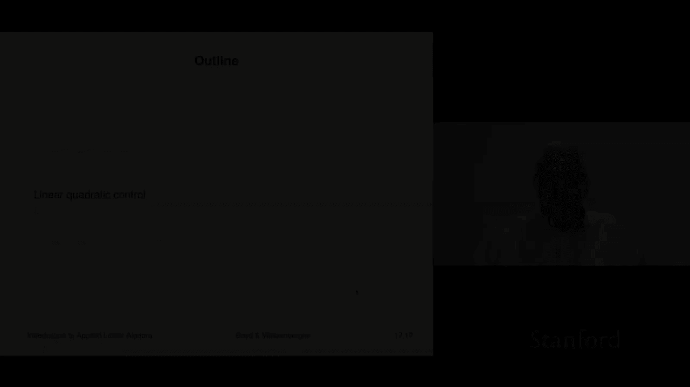
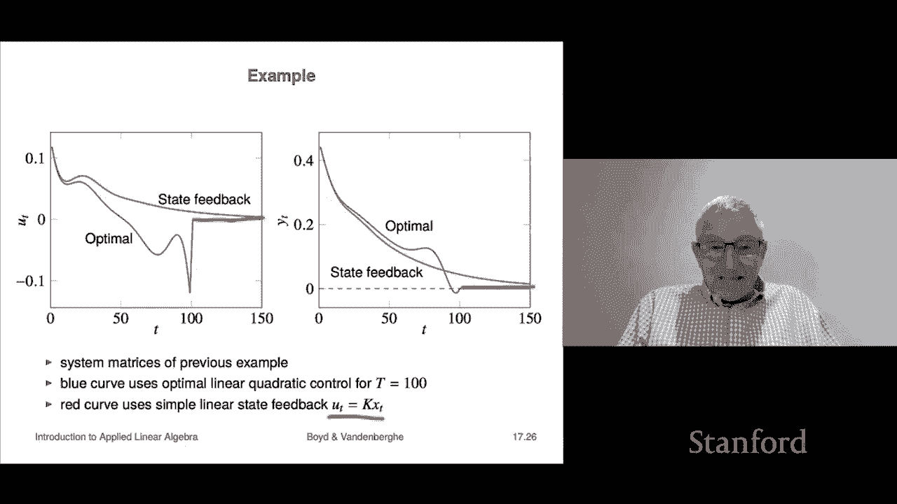

# 【双语字幕+资料下载】斯坦福ENGR108 ｜ 矩阵论与应用线性代数(2020·完整版) - P48：L17.2- 线性二次约束 - ShowMeAI - BV17h411W7bk

Our next application of constrained lease squares is linear quadratic control like portfolio optimization。

 this is a topic where there are multiple entire courses you could take on nothing but just this one topic it's also something like portfolio optimization that's widely used。

So let's look at what this is the setting is we have a linear dynamical system。

 so we have a state Xt that's our state here and it's an n vector we have an input UT and I'm using the traditional terms that people would use in control that's an M vector。

 I have an output that's Yt here related to the state that's the output Yt AT is called the dynamics matrix B is called the input matrix C is called。

The output matrix is another sensor matrix is another name for it。

And and here we have a linear dynamical system now very very often here， A。

 B and C don't depend on T， in which case it's called a linear time andvari dynamical system or an LTI system。

And I should also mention that these usually don't represent X T UT YT。

 they don't represent the actual value of the quantities of interest。

 they're usually deviations of those quantities from some standard values right so it should be the deviation from standard from some standard operating condition or something like that and usually it's set up in such a way that x equals zero is good。

 that means that the system is working like the way it's supposed to this is just usually u equals zero means that the input is kind of what it would normally be or something like that so that's the idea。

Okay， so linear quadratic control， the basic idea is we are going to choose a sequence of inputs over some time horizon the time horizon we're going to take is over the with the times T equals1 going up to capital T so we're going to go capital t steps into the future that's going to be our time horizon and our job is to choose a sequence of inputs that's Ut for little t equals1 to capital t actually for the Ut we only have to go up to t minus1 because xt only depends on Ut minus1 now we're also going to go ahead and choose the state as well the state sequence so that'll be x1 up to x capital T。

Okay and so what we're going to do is're going to have two objectives it's a by objective problem in fact this can easily be you can add more objective so it's a more than by objective like a multi objective problem。

 but the simplest objectives would be two things and these sort of have names the first one。

Is this it is the sum of the squares essentially of the outputs and the idea is you want those small In fact。

 in many cases you actually choose the output to be literally the things that you want small and that's of course equal to this that's the same as this thing because c1 X1 is y1 and so this is a measure some people call that a measure of regulation or something like that it's you want the output to be small remember what the output is Y t kind of represents a deviation from a desired state So that's why you want it small small means everything's cool and the input is going to be the sum of the norm squares of the inputs and remember the inputs only go up to t capital t minus1 because that's the last input that matters to X subcap T。

Okay， so and then this has also got let has got another name it's you know it's like input energy or something like that。

 but it doesn't matter that's it so these are the two things and you want both of them small。

Now so we put that together in a by objective in a by objective we scize that those two objectives and we write it as J output plus J input output means that the output is small and input means that you're not using a big input to mess with this thing and then row is a parameter it' positive that tells you how much input input deviation irritates you compared to output deviation so that's all row is okay now we also have here the dynamics right so that just tells you how the next state is related to the current state and the current input。

And then we have two other constraints and these are initial and final state constraints the first one says that x1 x at little t equals1 is x in it that's the initial state and then x capital T is going to be the final state and that has to be equal to something which is given which is called x desired x in it is also given so that's the idea and there are many different sort of variations on this problem。

You know in many cases X andit is the current state of a system and x desired is zero so it says please get me from here to zero over capital T steps that's generally called the regulation problem another one is basically you're in some state and there's a high level command that says get to this state at that time and then this would be nonzero x desired。

Okay， so here in this optimization problem， we got a lot of variables。

 which is it's the state at all of the times and it's the input up to well t minus1。Okay。

 so this is the socalled linear quadratic control problem' it's to choose the u the sequence of u's and the sequence of x it's a big problem actually what we're going to find that is it is absolutely nothing more than a constrained least square problem so it's a big one but nevertheless that is all it is。

Okay， oh and I should ask， I should add how it's used in control， row is chosen， you know。

 I'd like to say there was some principled way to choose row there really isn't what happens is。

You choose row and you look at the trajectories and if you like them。

 if the U is too big then you cran if u is too big， you crank up row。

 if you'd like the output to be smaller J output， you would crank down row so that's just the idea and you kind of just look at it under simulation and have an idea of what you like。

Okay， now let's see how this works， what we're going to do is this is you'll recall that this is y1 and that's up to Yt here。

 and so we're going to minimize this big expression here this is like this thing here is J1 J sorry J output I think we called it。

RightAnd this thing here is rh times J input。Like that， okay？嗯。

And then we have the dynamics equations and then we have the initial and final state constraints now this whole thing this big complicated problem here it looks very。

 very complicated can be written as just a。Constrainedly squares problem period just that so this is we're going to write this this big thing up here as minimize a til the z minus b til the subject to C til the z equals d tilde and I have to tell you what all those things are so I'll start by telling you what Z is Z is all of our variables all stacked together so it's the entire state sequence and it's the entire control or input sequence and so it's got you capital t n plus t minus1 m variables so it's a big thing and if we were to if we wanted to extract for example the inputs from Z we would just slice into and take the appropriate parts and that would give us our sequence of input。

Okay， so that's Z， I still have to tell you what A Tilde， B Tilde， C Tilde， and D Tilde， okay？

So let's first look at A Tilde and B Tilde， so A Tilli is this。

giiant matrix here you have to put Z here and let's remember what z is Z is x the x is stacked on top of the U now ail is a block it's what people would call its block diagonal meaning diagonal matrix of course is a matrix with you know nonzero entries only on the diagonal but here here it's only these diagonal blocks which are nonzero and so if I multiply this matrix by you know x1 and this goes down to xt and then u1 all the way down to Ut minus1 if I multiply this big matrix by this。

Vectctor and I do that blockwise what I'm going to get is a vector it's going to look like this it's going to be C1 x1 and this goes down C T Xt。

 and then I'm going to get square root row times u1 and then down to square row U capital t minus1。

Now when you take the norm squared of this， well how do you take the norm squared of a block vector it's the sum of the squares of the norm squares of the components and you know what it's norm squared c1 x1 up to you know and then these are when I square that I get rh times norm squared u1 and you know what that recovers exactly this our objective okay so that's how to write oh and BtilD is zero so there's no target actually we could have BtilD non-zero that means that you're trying you want your states or whatever to track a a given trajectory by the way that also comes up in practice but anyway okay？

Now we're also going to write these sets of linear equations as one gigantic set of equations linear equations on Z and let's see how we do that well again it's a big block matrix the first one is a1 minus I then zeros and all and B1 and if I multiply that if you multiply that in your head by this vector right which is the x1。

Down to xt u1 down to Ut minus1。You'll figure out what happens this first equation says the following。

 it says a1 x1。嗯。Minus x2。Plus B1 u1 equals0 and that's that's the same equation as saying x2 is a1 x1 plus v1 u1。

 So that's the correct equation。 The first one and you can check these each of these rows these rows give you the dynamics equations this bottom one。

 I mean it's very simple。 But if you look at it if you multiply this giant block row by this thing it basically says x1 equals x in it and if you do it down here。

 you get x capital t。 that's the final thing is equal to x desired。

 that's your desired terminal state So okay so。All of this is just to say that we have taken a problem that looks pretty complicated and frankly。

 it is kind of complicated， I mean， you in classes'。I teach classes on this。

It gets kind of complicated and you know your weeks into a class before you even before you get to this and what the solution is。

 but the truth is here we know I mean we could just we just write it like that and then it's solved it's that we know you'd form a KKT system and you'd solve it by the way the KKT system that you would form here would be extremely sparse I'm sure it did not escape your notice that both A Tiilde and C tillilde are extremely sparse and so when we would form the KKT system here it would be very very sparse。

And actually it would be even more than the sparse it would end up being you know sort of have a very specific structure and that means that for example。

 sparse matrix method could actually solve it like super like shockingly quickly okay so what we've done is we've reduced the linear this is the so-called linear quadratic control problem and we've reduced it to a very big。

Constrainedly squares volume that's it And we just solve it。

 So we know everything about that you just solve it and then you're gonna to get it means that the data in the problem are I have to give you the AIs Bs。

 Cs I have to give you row that's a parameter I have to give you X in it and X desired and that's it and capital T of course and so from that we will construct the optimal trajectory and input sequence for it。

Okay。So we'll look at an example。 It's a very simple one。

 but it gives you a rough idea of kind of you know what this does Oh。

 I should say this is actually used like very， very frequently it's used in all sorts of stuff in you know for control of cars。

 space vehicles， engines you know all sorts of it's just used everywhere well things very closely related to this Okay so we're gonna to look at an example now it's going to be a baby example just to give you a rough idea So here's our our matrix a I don't know what this thing is I mean it's some it doesn't matter what it is maybe it's a mechanical system actually you know it doesn't matter Here's B。

And here's C， again， not that any of this would mean anything to， but the's a small example。

Here's the initial condition probably generated randomly just to give you a rough this just you know and then the final the final state that we're going to take you to is zero and we're going to do that in 100 time steps okay so that's that's what we 100 time steps we're going to take you to zero that's called by the way that's a special case when x desired to zero the problem is called the regulator problem because we're well roughly we're regulating the state to zero to zero being some kind of desired state okay so that's going to be our example it's going to be pretty big oh M which is the dimension of u the input is one so we're going to calculate for ourselves 99 inputs their scalrs。

And we are going to calculate a state trajectory， which is 100 long and each state has dimension three。

Again， if I did my arithmetic right， which there's no reason to believe I did。

 but if I did in my head I get 399 variables， honestly that's a tiny that's just a tiny problem right。

 but even so it can be solved like in with shocking speed just because of the special structure okay。

All right， so here what we've done is here we just simply very row。

 solve the problem and calculate J input and J output and sure enough you get this beautiful tradeoff curve is you know this is what you'd expect to see is a trade off between these two objectives and you know it says the usual thing it says you can have J output low but you're going to do that by it's going to cost you lots of input right and you can have J input low that's going to cost you to in terms of J output right so and we're going to look at two things I sorry three points on the tradeoff curve row equals1 row equals 02 row equals 005 and let's think about what these mean row scales how much how much we care about the input so that's what row does and so if we look back here let's think about it before we even look at the plots what we think we're going to see what we're going to see is as you reduce row。

What should happen is the input size should get bigger I mean that's what this means that's also shown directly here right but also the output size should get smaller right and so because that's really what the trade off is in sometimes。

You are spending a large input in order to achieve a small output。

 I mean that's kind of what this is about， that's the trade off。So we'll look at these three things。

And we'll take a look at what the trajectories are and what we're going to show you is the input applied the input it's on the same scale in these three things right so and sure enough。

 look at this when row is one。Which increases， you know， as we increase row。

 we increase the amount we care about the input， and sure enough。

 look at that if you compare this and this and this you see you is roughly speaking getting smaller。

At the same time， why is kind of getting。Bigger， I mean， not dramatically so。

 but the point is if you kind of look in here， you'll see that you know Y is you know it's pretty small Oh sorry。

 no， no no sorry that that's not small small is zero here Yeah， so let's see yeah。

 so no it's right that as y here this gets it gets bigger Okay， so that that that's how that works。

All right。Next topic。It's related and it's actually a very common way that the linear quadratic regulator is really used when I said before that a variant of linear quadratic regulator is actually widely used in practice。

 it's actually this one it's called linear state feedback control So let me let me explain that I think we've seen it before earlier in the class。

 but I'll say what it is It's a really simple way to control a linear a linear system it's where people do it for nonlinear systems as well it's just this it's called linear state feedback control simply says takes the state multiplies it by matrix K and gives you that that's the input here K is it's a single matrix it's called the state feedback gain matrix for obvious reasons right because it it takes it takes the states that's Xt you multiply by K and what you get are the inputs to apply and this is very widely used。

And it's especially used when it's vague about Xt， the basic idea is that Xt should go to zero or B near  zero and t is not specified right so T would be specified typically in problems that involve things like docking or landing or something like that where there's a specified time when you want to be where you have to be where you need to be in many other applications it's vague or it's like no。

 I mean follow this trajectory or you know adjust my airplane so that I'm flying at you know I want to fly at 40。

000 feet level flight mock 。82 or something like that and you know that's and they don't say when and you don't say 112 seconds from now you just say no just you know move towards that And so that's that's the setting in which you use something like a linear state feedback control which just for the record is exactly how。

Airplane control systems work，All right， so theres so there is actually a way to choose k it is the most widely used way to choose k and now the derivation I'm going to show of it is not the one that you would normally see what you would normally see as well it gets kind of complicated there would be things like algebraicrick equations none of which you need to know because I'm going to show you actually a simpler way that derives just from the constrained least squares problem that we just looked at that's this what we'll do is we'll set x desired equals zero and then we observe that the Ut is a linear function of x in it Let me explain why that is。

 let's go back and take a look at that formula It's right here why in it apply sorry x x in it appears in detail tilde it is in fact the here you go。

 It's that entry right there okay now。When I go to a constrained least squares problem like this。

 the solution is actually linear in BtilD and detailtilD。

And you can check that that's that comes directly from the specific formula for the solution that comes from you know the Kkt system Okay。

 so all right， so what that tells you over here。Is it in the linear quadratic when we solve the linear quadratic control problem。

 what happens is that the first input u1 is a matrix k times x in it x in it is x1 by the way。

We could find k easily we simply use x and it is equal to E1 up to EN and we solve the problem for each of these。

 we just calculated it and that gives you k so roughly speaking what it says is that it's K is the thing that relates the initial state to the first action you would take when your job is to solve that linear quadrarontic regulator problem oh and also by the way get the get the。

In the end， after capital T steps get to x desired equals zero， okay， so that's the idea。

Let's look at an example of how that works so what we're going to do is the blue curve shows you what happens if you do this optimal thing and with a fixed deadline of capital t equals 100 well you do various things this is the input you apply you do this you do all sorts of stuff and you do something crazy at the end I don't know what it is but then it's all over at t equals 100 and then you zero。

Okay。Now here's the state in that case that or the output， the output looks like this。

 it goes like this， it bumps down and then a t equals 10 brings you to 100。

 that was actually the requirement and then it's just flat zero okay。

If you look at what happens when we take U T equals Kxt with the matrix that is derived in that very simple way from that big from the solution of the constrained least squares problem。

 that's this red curve like this and it's asymptotically going down to zero and here's the same one here。

 right。And so that's how that works this is actually this is very widely used right so there are in fact you know packages that just will calculate these state feedback game matrices for you that's this is what they do so。

