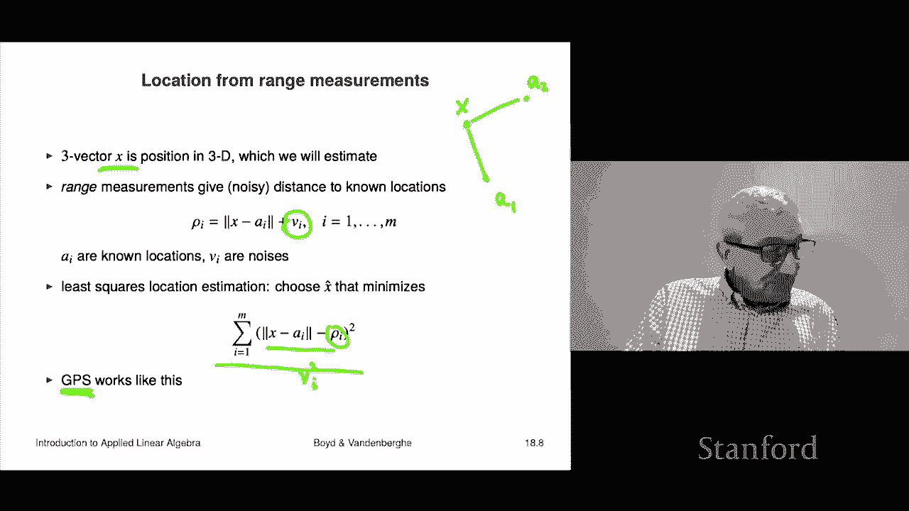

# 【双语字幕+资料下载】斯坦福ENGR108 ｜ 矩阵论与应用线性代数(2020·完整版) - P50：L18.1- 非线性方程与最小二乘 - ShowMeAI - BV17h411W7bk

Chapter 18 is on an extension of least squares to nonlinear least squares。

 we'll explain that momentarily， it's a very interesting topic。

So we'll start with the idea of nonlinear equations and nonlinear least squares。

So a set of nonlinear equations look something like this， I have some variables。

 x1 through xn and those are scalar variables and I think of them altogether as simply a a vector x and then I have a set of equations like fi of these variables is equal to0 and I have M of those this is like if f is fine。

 this becomes a set of linear equations So we refer to fi of x equals 0 as the ifh equation and if I commit if I choose an x。

 then fi of x is the if residual residual is usually something like an error or it's an amount by which something fails to hold and then in this case if Fi of x is you know the residual。

 it tells you if it's a0， that means that equation holds if its0003 that means it almost holds and if it's minus 0。

0001 that means it also almost holds okay。嗯。So we can write set of the system of equations up here in a very compact format。

 just is f of x equals0 and here F is a function that maps Rn to RM and what that means is it takes in an n vector or or n scalar arguments x1 through xn。

And it returns an M vector， and these are the residuals， the M residuals。

 so and sometimes you can write it this way， it's f of x equals F1 of x up to FM of x。

Now if f is aine the system of equations f of x equals0 is just a set of linear equations and we'll refer to this set of linear equations sorry non nonlinear equations following the following the nomenclature we use for linear equations。

 we're going to refer to these as overdetermined if there is more if there are more equations than variables it's going to be underdetermined if there are fewer variables M then sorry if there's fewer equations than variables。

 so M is the number of equations and is the number of variables and square if there are exactly equal。

 so we're going to follow the same nomenclature we use for systems of linear equations。

Non-linear least squares is the following problem is find find a vector x hat that minimizes the following simply norm f of x squared and that's f1 of x squared plus it's basically the sum of the squares of the residuals in an equation now this includes the problem of solving the equation simply the nonlinearar equations f of x equals0。

 that's a special case because if there is an x for which f of x equals0。

 then for sure that x solve minimizes this because then the norm squared is0 and norm squares don't come any smaller than zero so that means that no other point x could beat it so this is just a special case but like linear least squares it's super useful on its own In other words。

 even when there is no x for which f of x equals0， this find you something that kind of gives you a nice compromise it minimizes the sum of the square。

the residuals so very similar to linear least squares。

 but this is the nonlinear least squares problem and so we have these these functions and the goal is simply to minimize the basically the norm squared of f of x where f of x is this mapping from Rn to RM。

So let's look at the optimality condition and we'll get that from calculus and there'll be a few things I'm going to say about that。

 so the first is that the gradient of the one you know calculus tells us that if I have a function of many variables it。

If a point x is optimal， then the gradient vanishes at that point， by the way。

 if that weret the case， you could just step in any you know in one of the directions in order a very small amount along one of the along one of the axes to actually find a point that has slightly smaller objective value in this case。

 the norm squared of f of x Now， also， you should remember that there are points where the gradient vanishes。

 but they don't minimize the function For example， they could maximize the function。Okay。

So as I said， you know points can satisfy this and not be optimal。

 I think one way to say points that satisfy this are sometimes called stationary because know that's what it means if stationary means that if you move a little bit in any direction the function doesn't decrease fast right by decrease a very very small amount but that's stationary and the gradient of the norm squared of f of x we can write this out and by the way。

 this is a formula completely analogous to what you'd see in the scalar case。

 I'm not going to drive it here you'll find that in the book to see how that's derived。

 but it turns out that this thing is exactly two times df of x hat transpose times F of x equals zero so that is the condition and you look that would be the same if F were a scalar function and I said what's the condition that this is minimized well。

 we take the gradient of this thing or well in this case just the derivative and。

Get to F prime of x times F of x here is what we'd get and that would be we want that to be zero if that's minimized now in the scalar case it's pretty simple it's either f of x is it's either f of x is zero or f prime of x is zero and this kind of makes sense Okay so this is the matrix analog of this scalar equation here right Of course you don't see transposes here because these are just scalarrs。

All right。Now this matrix Df of x Df evaluated at X hat。

 that's the derivative or Jacobian matrix of the function F。

 and that's simply the matrix of partial derivatives so the IJ entry is the partial derivative of F with respect to the variable Xj and all evaluated at X hat。

Okay， now this condition。If F is Appline。Then this condition reduces exactly to the normal equations you see in normal in linear least squares。

 so called linear least squares， oh， I should say that when we're talking about nonlinear least squares。

 we refer to least squares as linear least squares to help distinguish。

Now we get to an admission so here's the admission it turns out solving nonlinear equations is like basically super hard so in other words。

 simply you know if I give you even things with you know as few as 10 or 20 variables and it turns out it's just insanely difficult to actually minimize the norm squared of f of x so in particular it's much harder than solving linear equations we can solve linear equations with easily with thousands of variables。

 thousands of equations， no problem and we will always get exactly the solution period that's least squares and we'll get it by the way super fast nonlinear nonlinear equations nonlineararly squares is a different story and in fact the following is even hard if I give you a nonlinear function f and I simply say does there exist a solution so just find me find me an x for which f of x equals zero even that problem。

I hard。Now， when I say it's hard and what I am is I'm actually I'm just interpreting what it means to solve a problem。

 it means find a point where the norm squared is smaller than any other point。

That is actually hard to do， but we turns out there are still methods that do very well in a practical sense and will use so-called heuristic algorithms now a heuristic algorithm is one that is it's not always guaranteed to work work in the sense of actually finding the actual point that minimizes but they often work very well in practice。

 by the way， even when they fail to find a point that truly minimizes the objective function they can find a point that is quite good and the truth is often they do actually solve the problem but we've encountered this before so。

The K means algorithm is that is a heuristic for solving the quadratic clustering problem。

And what that means is that the K means algorithm， when you run it。

 it is absolutely not guaranteed to find the point that minimizes the objective in the K means problem okay so and we even saw that that was the case because we'd run K means a couple of times and we would indeed find that sometimes it finds you know a point with one value and then later it finds a point with a lower value meaning that in the first case that was not optimal period it's also likely that the one you found later wasn't optimal so nevertheless heuristics like this still work very very well in practice right't hasn't stopped the use of k means K means is used all over the world in hundreds of applications and areas all the time and it works just fine。

Thank you In a practical sense， right so the only thing I would say about that is if someone says have you really minimized that。

 you know and if you're in a court of law or there's I don't know。

 mathematicians hanging around or something like that， then your answer would have to be okay no。

 technically I don't know that I've actually minimized it。

 but boy that's a pretty good you know that's pretty good clustering wouldn't you say so that's the same idea with it's exactly the same for nonlinear equations that generally generally we just use the heuristic and the only thing that happens there is you can't you can't say that for sure that is actually the point that minimizes the norm squared of F of X。

We're now going to look at a couple of examples just to see what do nonlinear least squares equations。

 Im sorry look like what are some nonlinear equations you might want to solve and so on。

 and by the way， later we'll tell you， we'll describe these heuristic methods for solving the nonlinear least squares problem。

 which includes a special case solving nonlinear least squares。

 but let's right now look just at some examples。Okay。

 here's one is computing equilibrium points This comes up in a ton of fields all over all over it comes up and the general setting is that you've got a bunch of variables N of them and then usually what you have as some kind of equilibrium condition and the equilibrium condition generally speaking means that you know sort of consumption matches consumption matches production I mean and it can depend what it is so these are called know that's generally an an equilibrium point is when that happens so I'll look at two examples one from economics one from chemistry so in economics you look at you have the idea of equilibrium prices and so what that is is this is I have a function S and what it does is as a we vary the prices of end goods that's the vector P S of P tells you what will be the supply of those goods if。

The prices are pe right and so you know that this is kind of it's kind of clear intuitively how that might work。

That for example， as you increase the price， if you increase the price of some good。

 then more people are going to manufacture it or supply it and so the supply will go up that's roughly the idea we also have the demand the demand will kind of go the other way right that if I have if I have a demand function and I increase the supply of a good presumably its demand will go down now we've already seen in the price elasticity matrix the idea that when you put one when you increase one price it could easily be that that the demand for other things。

 other goods can either go up or go down right so depending on whether it's a substitute or something or a corre letter I forget what they call it okay all right so back to our problem these are our functions the supply function and the demand function。

And here's the goal， find a set of prices for which the supply balances the demand。

That's the idea Okay， so this is a very classic problem and what we'll do is we'll take F of P to be SF P minus d of P that's the I think some people call that the excess supply or something I don't remember anyway when that's when F of P is zero that means that the prices are such that the supply。

Exactly balances the demand Okay so that's the and that's called an equilibrium price set sorry a set of equilibrium prices it's an equilibrium price vector Okay。

 so that's one example of solving nonlinear equations Oh I should add something that if if the supply and demand functions are both ane this is a set of linear equations and we can solve it well we solve it exactly in that case using the methods previously in the course okay。

Next example， which although on the face of it looks radically different is actually kind of the same example。

 but here it is so in chemical equilibrium what I have is I have a bunch I have an n vector of concentrations see of N different species right so these species in some chemical solutions let's say then what I have is this is I have if I have various reactions that both some reactions consume the species others generate additional species right so these are the reactants and products and。

They are given by reaction rates and those are given this way。

 so capital C of Little C that tells you the consumption of the species as a function of the concentrations。

So that's how that works so you know usually if the concentration of a reactant goes up then it's going it's going to consume more more of it will be consumed because there's a reaction that consumes it or something like that。

Now we also have GFCC that's the generation of species， these are essentially the reactant products。

 so that says that as a function of the concentrations。

 this tells you the rate at which the species are created right and that means that there are that means what's the rate at which the reaction in which these things are on the right hand side they are products not reactants okay so that's the idea。

And then then what we'll do is we'll take what we would like to do is find me concentrations of these species in this solution or whatever it is so that the consumption is exactly equal to the generation and what that means is that the reactants reactants of products or balanced you may still have you will have chemical reactions going on but what will happen is at equilibrium the amount of you know whatever some hydrogen ion being consumed per second is going to exactly balance the amount of hydrogen ion being generated as a product every second you know due to multiple reactions so that's the idea and that's that's referred to as a chemical equilibrium and you can you know you can check how does that vary with external things that we're not counting here like temperature or something like that pressure okay so and and to do that we'll set that up as F ofc。

Is equal to the consumption minus the generation and so when FFCc is zero that means you have chemical equilibrium so that's the idea so these are just computing equilibrium points are generally nonlinear equations systems of nonlinear equations and by the way very typically with an equal number with m and n equal to each other so these are square typically square systems。

Another example comes up in a lot of areas but it it's really part of a GPS global positioning system so here I have a three vector X and that's a position in three dimensions and your job is to estimate it like what is X and what we have is actually so-called range measurements so of course i'll draw on2D but here's X and you might have a beacon or something like that。

what or satellite， whatever you like it's here and then what we measure is actually the distance so we measure the distance right so here's a1 and here's a2 this point。

 And so what we know is the distance Now then the question is given a set of distances oh。

 and I should say。We get the distance but with a noise。

 so VI is a noise that we don't know and it's just measurement error。Okay。

 and so the idea is from these distance measurements。

 they're called range measurements right because the range is like the distance from U to some target or from U to some beacon or something like that So given these noisy range measurements。

 your job is to figure out what X is okay now what least squares at least wheres location estimation does is it says I these things here are essentially this is is's going to sum we're going to minimize the sum of V squared Okay and this is just so this is the the so what we're going do here is we're going to choose x to minimize this row I is the measured range or distance and。

This is， of course， a function of X， it is definitely not affine and we want to minimize this and that that is a nonlinearar least squares that's nonlinear least squares and a variation on this actually is kind of what's used in GPS。

 the global positioning system there's one couple of tricks in GPS or variations on this this that are not in myformulation here what is this is that in addition when you get your distance to a satellite。

 there's an additional offset term which depends on your how far your clock is from the true clock right so unless you happen to have an atomic clock with you very few people do so。

There's an additional variable there， but otherwise it's basically this and in fact。

 this is kind of what's used for GPS。Actually， really what's used for G is a combination of this and the Kman filtering or state estimation that we looked at in the previous lecture。

 but this is the essential idea。

