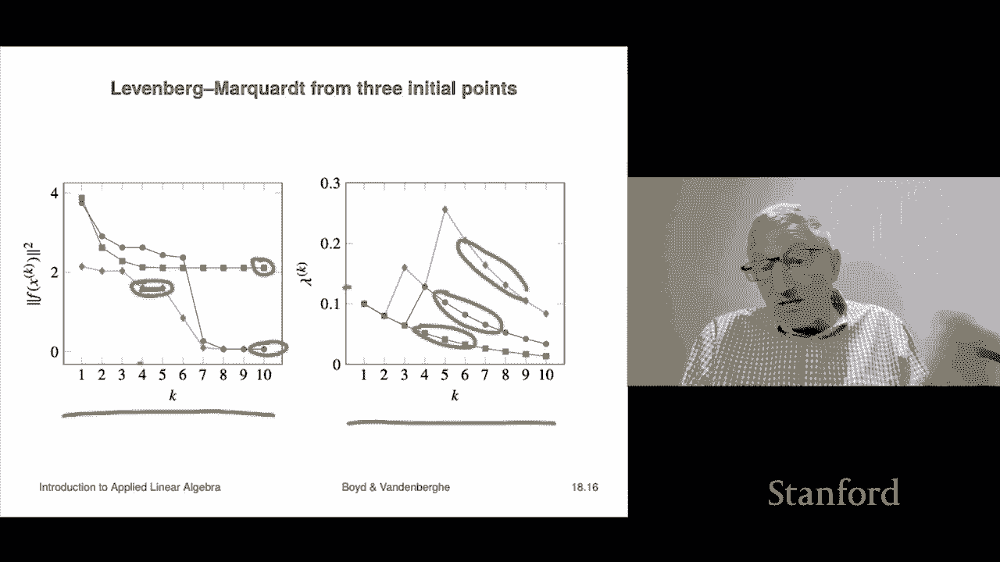

# 【双语字幕+资料下载】斯坦福ENGR108 ｜ 矩阵论与应用线性代数(2020·完整版) - P51：L18.2- LM(Levenberg–Marquardt)算法 - ShowMeAI - BV17h411W7bk

We're not going to look at a method for approximately or heurically solving the nonlinearar at least squares problem there's actually many methods that can be used so that's a whole world by itself you can take whole courses on on this and we're going to look at one it's called Leavenburg markor where we actually look at this one for a couple of reasons number one it works extremely well in practice and number two it uses actually ideas。

They come immediately from this book in course， so all the ideas should be utterly clear。

So here's the basic idea and it' it's a very general one in applied math so what we're going to do is we want to minimize。

This。Something like that。Okay， so now if F here we're aine。

We would know how to do that that's least squares we spend we just spent what we spent a lot of time on that there would be a backslash involved in your code okay so so if F or aine we can solve the least squares problem but f is not aine so what we're going to do。

I we're going to do this， we are going to form an aine approximation of F near the current point。

 I should say this is an iterative method right so we're going to iterate。

 we're going to take a point you know then maybe get get a better point and keep going until we're not making progress okay so。

Okay， so we're gonna to form an affine approximation Now。

 how do you form an aine approximation of a function Well。

 that's what differential calculus is literally that is what it is。

 I mean it's a way it's a way to in an organized way to go ahead to get an aine approximation of a function that's really accurate near a given point and that's the first order Taylored approximation or aine approximation。

 So we're going to write F hat of x at z So the semicolon means that the second argument is a special it's not special。

 it just means it's and it's read f hat at Z or f hat near Z。

 that's not you would hear people say and that's equal to F of z。

 the value at that point plus and then this is the deviation。

 the vector deviation from z multiplied by the derivative matrix。

That's the Jacobian or the matrix of partial derivatives， so that's it。

 makes perfect sense is the first order Taylor expansion， that's it。Okay。

 now the idea behind this is that F hat is of x is extremely close to F of x provided x is near z。

When x is not near the all bets are off okay， and in fact that's kind of the definition of the derivative in a sense。

 right Okay， so just bear that in mind that F hat and little I'll put it another way to just to which is going to come up momentarily F hat of you shouldn't trust F hat of X。

Semicolon Z if x is too far from z。you shouldn't trust it because the approximation may not be good Okay。

 so that's kind of the that that's the idea there makes perfect sense and that's actually the technical term we'll see later that's used is trust do I trust my approximation if x is close to Z we really we definitely trust it now one minor problem is that calculus is vague on that and what calculus says is。

When x is near Z and when you ask the crucial question， you know how near they're like， I don't know。

 like near enough and they use the concept of a limit， they say that yes。

 it becomes extremely accurate in the limit of x going to Z to be honest in a practical setting that doesn't help us in the slightest but whatever we'll get around that as well okay。

Now we're going to do now we're going to come to the idea and the idea is you know you don't know how to solve how to minimize norm squared of f f x that's your problem so we'll do is we're going to replace F with an approximation F hat which is aine and we do know how to minimize the norm squared of an affine function that's called least linear least squares in this context but outside this context you just call it least squares okay and by the way that subproblem we can solve exactly that's completely non-yuristic right I didn't have to say it earlier in the course we were talking about QR factorization and blah。

 blah blah。We're actually finding the exact solution these are not these none of those were heuristic algorithms we we found the exact solution okay so。

So this is the idea is you can't solve the problem that you need to solve。

 so you approximate the problem。Essentially by linearizing the function and then minimizing that or something like that。

And then we're going to iterate that that's that's the idea Now there's another objective in this。

 which I haven't said， I mean， although it's kind of implicit here and it's this。

That you would like this thing to be small， but you also want x to be near Z and that's a question of trust right so like if if x deviates too far from Z。

 then the approximation may not be good。Okay so here's the Leenburg Markwart algorithm it combines these ideas and it combine is just ideas from the course here it is it has iterateance x1 x2 x3 so this superscript describes the itance right it's an iterative algorithm in the sense that it produces a sequence of these okay。

Now iteration K iss what we do We first form the affine approximation of F at the current point right so the current point is sort of for like our best guess now if is if the iteration K is now it's our best guess now of what the solution is or an approximation of the solution or something like that so we have F hat we form this this approximation that's F hat。

And now what we're going to do is this， and it makes perfect sense。We are going to minimize well。

 the norm squared of the approximation。Okay， but we're going to add a secondary objective and the secondary objective is super interesting。

 it says， please make this small。While at the same time。

Please don't be too far from my current XK Now the idea there is very simple that the closer you are to Xk。

 the more we trust this approximation trust the approximation simply means that F hat is close to F right it doesn't do you any good to minimize F hat if F hat and F are completely wildly different it doesn't make any difference it doesn't make any sense at all so that's the idea。

And so lambmbda actually is sometimes referred to Lambda K。

 because it's going to vary with step size。That's something that tells you how far。

 you know when you trade off the two objectives， right you to you want to minimize the norm squared of the aine approximation number one。

 but number two， you don't want to go too far from where Xk is right。

 not because you don't think the solution is far away， it could be far away。

 but that's a question of trust okay and Lambda K essentially gives you your level of distrust in the following。

Sense that if lambmbda is super big， then when you solve this。

 you're gonna to get a point that's very near Xk。 and that means that you don't trust the model very much at all。

 or you trust it， but only if you're very close to Xk。 when lambda gets really small。

 that means you really trust your model That's what it means and you're going find that Xk is X is gonna to be very far from Xk Okay so this is the idea。

 that's the whole thing is this is the Leenberg Markwart algorithm， Oh。

 I haven't told you how to update this lambmbda yet， but we'll get to that。Okay。

 so Xk plus1 is a solution of a least squares problem and in fact it's a if you like to say it it's a by criterion or by objective least squares problem we have a primary objective and we have a secondary one and we can solve that just analytically and you get the solution is this thing is this and you'll actually recognize this part as the general solution to a by criterion or by objective least squares problem that we solve when we studied that chapter okay so a couple of things to mention about it the solution always exists in other words this thing sorry the inverse always exists so you can always solve the set of equations this thing is invertible so that's nice。

 it doesn't matter Df or anything like that it's just invertible period that gets invertible if Df is zero it's just fine。

The other interesting thing is the you have xk plus1 is Xk and there's a name for that that says that Xk is a stationary point of our algorithm so stationary point means what it sounds like it means that if you apply your algorithm to that point you do a bunch of computation and then there's a drum roll and you get back the same point you had before that's called the stationary point because if you do it again it's going to stay there it's going to always just stay if you think of the algorithm iteration。

As as being some kind of a nonlinear dynamical system。

 then what this says is it's an equilibrium point or stationary point of that dynamical system。

 Okay and to check that， you know， we would just say what would happen if this whole thing over here we zero right because that's what it would mean if xk plus one is xk Well。

 this is an invertible matrix So I can get rid of that and it says that's zero， And I say oh。

 Df transpose x is0， hey， except for the fact of two， which obviously doesn't matter。

 that's exactly the condition the stationity condition for the problem。

 So so that says that that if a point is stationary in Luenburg markhar。

 then it says that the optimality condition holds and now recall that that does not mean that you know xk is necessarily the solution right it means it's a candidate to be a solution or something like that frankly。

 no one really I mean depends on the application people don't really care about that they just want to know you know have you found a good a good point good point means one with a small residual。

ok。And now I'm going to explain how to update Lambda actually there are many， many ways to do it。

 some are more sophisticated， this is super duper simple and it's also extremely intuitive and it connects to the ideas we have in the class okay。

So if lambda is too big， then here's what's going to happen your Xk plus one is going be too close to Xk。

 Now actually that's fine because it'll mean the aine approximation is very good But the point is Xk is Xk plus one iss just a little bit away from Xk right so and it may take a very large number of iterations so there's nothing wrong with having lambda too big。

 it just means you're going take a whole lot of iterations to get to a solution or something to an approximation solution I should say now having lambda too small。

 then you can actually get into trouble if lambda is too small Xk is going to be it's going to venture too it trusts the aine approximation too much and it's going to choose the next point relatively far from Xk now if you're lucky that's fine but if you're unlucky the aine approximation is poor and you can even you can even lead to the case where。

In this case， it would be possible for the objective value at this next iterate to be higher than the current one。

 but that's not what we call progress so here's the update mechanism。It says， if the norm squared。

 that's the objective。At the K plus1 iterate is better that's the strictequality strict inequality if it's better than the current objective。

 that means you make progress right and so you update the new X。

 you accept the new X and you reduce lambda and you know you might reduce it by 20% I mean it doesn't matter it just turned out it doesn't matter right but you reduce it by 20% and the reason is it means it work。

 but you kind of want lambda to be as small as possible that allows you to make progress so you might you might you'll be a little bit more aggressive on the next step that's this now if this is false it means that you found your next your next tent atative point。

First of all， it's not progress because the objective value went up。

 not down and so that's something you definitely don't want so what you do is you don't update X。

You just keep it the same value and what you do is you double lambda and that means that you are I mean by the way。

 double it could be you could multip by 1。53 whatever you like what that means is if this inequality fails to hold that means that you did not make progress or I mean you could even have a go this way meaning your next point is worse than your current point if that's the case it means that you were too trusting of your aine model and that means you need to update lambda you need to increase lambda specifically because that'll cause when you solve that least squares problem it'll cause you to be closer to xk where we hope the aine model will be more accurate so。

When we do that we'll double lambda that's it and we keep the same X so thats that's what this looks like Okay okay。

 so this is and now that's the whole algorithm that's it I mean you have to give it an initial point。

You have to give it an initial value of Lambda， but other than that。

 we've told you everything about the thing and this Bay of lambmbollf and people just take it to be one。

 something like that。So let's look at an example。It's going to be a range a range estimation problem Okay。

 so here it is you the。The minimum the one that minimizes the norm squared of f of x and remember that's a sum of the squares of the residuals to the ranges right the blue things by the way。

 show you where the beacons are， which is kind of interesting So basically it says you're somewhere and you get a noisy measurement of the distance or range to each of those blue dots those are beacons or what doesn't matter this could also be turned around and these the individual radar installations which are giving you range to a target and now they're coordinating to try to figure out where is the target。

That language suggests not socially positive applications of this。

 but unfortunately this is used sometimes for socially positive applications okay so the contour lines show you the set of points where f of x norm squared takes a particular value red is actually the minimizer and then you could see you know all the points in here you know are close to minimum and so on anyway that's it and here's a graph of it if you want to see what that looks like as a function of x now what we're looking for is that point right there that's this one that's the one that minimizes this thing that's going be kind of our best estimate of the position of x now what you'll look at and see is it also a weird bumps and stuff in here and it's not it's not we'll actually see momentarily theres some so-called local minimum okay。

So here's the way it works， and we're showing here Leenburg Markor。From three initial points。

 so heres here's like first the first run of Luenburg Mark we start there I mean who knows why okay and the first step takes it here。

 then here， then here then here， then here then here and you can see that it found what we know is actually the global minimum global minimum means it's the one that actually minimizes the norm squared of F okay here we start this one from here and it kind of goes along here and then it also finds the global minimum。

Okay， this is interesting look at this here we started the initial thing not very far from this other point where it found the minimum and this one kind of goes here。

 here here， here here and then it gets stuck there I mean it finds an okay point but it is not the actual global minimum of the problem so in that case you would say in this case。

Lenburg Markwart。Actually solve the nonlinearar least squares problem。

 actually solved it starting from this point or this point。

 but not from that point so that's kind of the picture Now of course in many dimensions because we don't really run you don't need Leenburg Mark if it's a function of two variables because you just make a grid and plot it and use your eyeball and I mean you make a lot like that and you find out where it's the smallest point so the point what you really use this for of course is for cases with know 10 variables 20 2000 variables 20000 variables this is where you really do it goes without saying you cannot possibly visualize anything okay。

So here， if you look at how the norm squared of the objective or what F of xk looks like。

 oh and you can see that in these cases it converges to a number that it's not zero because of the noises。

 but it's pretty small， and you can see that in these two cases the brown trace and the blue trace。

 we actually made it to the global minimum， this red trace we would say this red run of Lemberg markware actually got stuck and it got stuck in a pretty bad in a pretty bad so-called local minimum or stationary point。

 it's found one that has a norm squared of about two more than two。

 whereas this thing is really very small， either know not small。

Pot1 or something like that and then what this will show you is is actually a trajectory of the this trust parameter lambda actually you should call it the distrust parameter because the larger lambda it means the less that you trust your model and so I think they all started at point one and。

You can see like in the first case， you can actually work out what happened right like so every time it went down it meant that your last iteration was better than your current one every time it goes up by a factor of two。

 it means that you were too aggressive and went to a point there was two where it actually you double the lambda right so every time you do this this goes up if that's 0。

1 I don't know what that is 0。13 this is probably 0。

26 well it's double right and you can see how this works so is so all of these parts here it means that it means that you met that criterion and which is that you actually improved the objective so I should say that over here yeah over here we're not showing those values we show them this way we don't show the tentative values what we do is let's find one here between4 and5 that's here so what we simply do is this it's the same xk it's x4 is x5 and that simply means that we computed in x5。

Or a tentative x5。Unfortunately， the objective was higher than where we were so we did not make progress and so we didn't accept it and so we kept the same one that's why this is level of bit flat and that's also corresponds to this jump up because what it does is what we do is when when you have found you've been too aggressive。

In updating， in trusting your Aine model， what happens is you increase lambda by a factor of two and you keep the old eggs。

