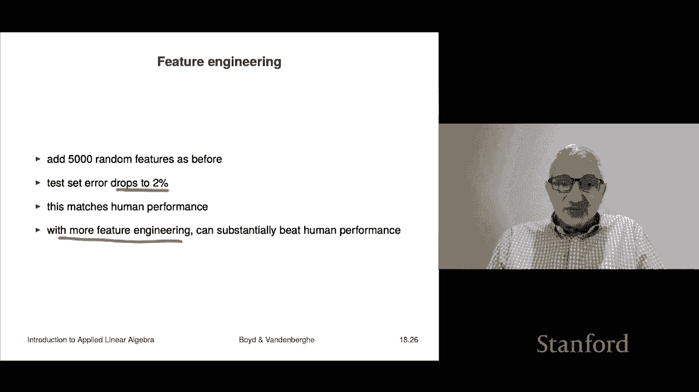

# P52：L18.3- 非线性模型拟合 - ShowMeAI - BV17h411W7bk

Our next application of nonlinear least squares is nonlinear model fitting and so we'll just look at what happens when the parameters enter the model in a non ae way when they enter in an affine way you have just linear least squares and we already know how to do that。

So nonlinear model fitting looks like this， we have our predictor。

 that's our model or predictor F hat。Of X I that is going to be the I feature vector and then the parameter theta that's what we seek to choose。

 and then this is the prediction， so this is really Y hat。I， right。

 And this is the sum of the squares of the errors prediction errors。 right。

 So now the difference here is that。We are not assuming that F hat depends in an affne way on theta Now in the linear in the parameters model。

 it looks like this， and this is exactly this is this is the general case of what it would be if F hat was a linear function of theta that's called the linear in parameters model because it's a linear function of the parameters。

 of course it's not necessarily a linear function of X and usually is not。

But it's a linear function of the parameters so here we're going to allow this F hat to be a nonlinear function of the model parameters and we'll see that there's lots of examples of where that can be helpful。

 it can also improve interpretability， things like that and we're going to minimize over the model parameters theta。

So we'll look at a quick example， so we have some data and for some reason we believe that it has the form of a decaying sinusoid okay。

 so we're going to write it this way it's theta1。Times X theta2 x theta 2 gives you the decay rate if it's negative or positive。

 the growth rate， and then cosine term cosine theta 3 x plus theta 4 theta 3 is essentially the frequency of the sinusoid and theta 4 gives you the offset or phase for that so that's a model that's parameterized by four parameters and then your job is to given some data points which you can see on this plot are the little green circles given the data points。

 your job is to choose theta 1 theta 2 theta 3 theta 4 to fit to get a good fit with your data now。

That ends up with a nonlinear least squares problem because you end up with this objective you sum over all of your data points。

 this thing， of course， that's why hat， that's why hat。

I like that and you can see that it doesn't end it's not linear well actually I should say one thing it is linear in theta1 so we could tell them for theta1 by a least squares problem。

 but you know not theta2 theta 3 and theta 4。Okay， so this， I would say things like this are quite。

 you know， this is easily done using Leaveenburg MarkW and in fact I believe the fit that we're showing there is one computed from these data points using LeaveenburgW and you can see it gets it fits a decaying sinusoid like quite nicely。

Okay。The next example of this is something called orthogonal distance regression so let's remember that when you actually normally fit a function。

 what happens is you'd have a curve like this's that's your approximation and you have a data point like this or like that。

 something like that what we measure there is the vertical distance between your data point and and the value of the model here that that's the traditional thing if you look at if you look at traditional model fitting you do that have it's the vertical distance between the vertical distance between the data point and and the function value in some cases you literally want to fit a curve and if you're fitting a curve not a function if you think of it as a curve。

 not a function and basically what it does is what you really should do is look at the actual distance to the curve now the distance of the curve is defined as the closest point on the distance of the。

This is point on the curve to you and so that means that instead of penalizing the vertical distance like this。

 we're actually if the curve looks like that， we're actually going to penalize you for being away from the curve。

So that's it this would be as if in this case you're not really thinking of this as a function。

 you're thinking of it more as a relation or a curve。

This picture shows you you know how you would do that。

 what the picture is for that and you know it's similar to but slightly different from it slightly different from normal fitting actually the main point here is that you're allowed when you have a data point you're allowed not to associate it with the same value of x you're actually allowed to mess with the X and compare it to a slightly different one so actually sometimes people call this an error error in the features model because we're also what we're giving ourselves license to do is to actually change the value of x associated with with a data point。

So that looks like this。So we'll write it out as a nonlinearar least squares problem what we'll do is we'll take the difference in the Ys。

 but we're going to evaluate it at a U Ui is going to be a variable like I said。

 we don't actually if you sp UI view insist UI equals Xi we're back where we were before but we're going to do is we're actually going to allow you to mess with that and then we're actually going to penalize you for for basically moving choosing an x sorry an x value called Ui which is not the same as the given x valuexi and if you look at this case in well in 1 d you kind of get the idea that the distance to the curve here is two things it's the vertical distance which we're that's the one that that's this term and then there's this term right here U and X are scalrs so it's just the absolute value so it's the squared to the sum of the square。

And the distance squared is the sum of the squares。

 So here what we're going to do is is we're going optimize in this problem over the following variables theta。

 those are the model parameters and UI so by the way， even in this case。

 if theta enters linearly into f hat so it's a linear in the parameters model even in this case。

 this is a nonlinear least squares problem because we also have the UI' is there which we're allowed to mess with Okay so that is this is this is a。

This is called orthogonal distance regression， I guess it's called orthogonal because you associate with each point。

 a point on the curve on the graph of the function and the tangent to the function there is orthogonal to the deviation from that point to the given data point so that's why it's called orthogonal distance regression but you'll hear this and you'll see this in a bunch of applications。

The next topic。Is nonlinear least squares classification？So let's see how this works。Well。

Recallled in the linear least squares classifier what we do is we first we fit by the least squares an f of x。

 that's simply a regression or a model prediction that predicts the real number that should be ideally close to minus1 or plus1。

That's the idea then of course， we're not allowed if someone says for this for this feature vector。

 do you think it's true or false， you're not allowed to say it's 0。

6 or something or or partly true or something like that What you'll do instead is we'll take the sign of that So that's that that's the actual。

That's the actual predictor。Okay， and this is we just use ordinary least squares to do this Now a nonlinear least squares classifier does this It starts with the following observation if we're going to work directly with the sign right in in in least squares classification we don't use we don't use the sign at all that's a post process right we simply use least squares which we know how to do we fit it and then we take the sign and actually the weird part it kind of works pretty well often。

 but okay here we're going to take into fact into account the fact that we're going to use the sign so let's see how this works。

Sine of F hat of Xi has only two values plus or minus1。Yi has only two values plus or minus1。

 so if I subtract them you either get zero if they agree or you get minus either get plus2 or minus2 and those are the two cases when it doesn't agree Now when you square plus2 or minus2 you get four so it turns out the sum over the data of sine filde of Xi minus Yi squared is actually four times the number of errors。

So now what we're going to do， we're going to directly， not directly， not quite。

 we're going to attempt to minimize that because we really would like to pick parameters for which our model makes us as few errors as possible。

 okay。So let's try that Oh one minor problem sine of f til the of x is discontinuous and so it's not differentiable right because the sine function you know goes like this got it's got a jump at zero in this case it's where ftil the of x is 0 actually interestingly it's got a jump ftil the of x equals 0 is sort of some people call that the confusion point because in a classifier you know ftil the of x equals 0 means I don't know。

 it could be minus1 or plus1 you know f til the equals 03 means okay I think f hat should be1 minus03 means f hat probably would be minus1 but zero means like I don't know don't know So it's a decision and at that confusion point I should say it's actually there's a big jump is non differentiable So what we do instead is you just simply replace sign with a differentiable approximation of it for example a sigoid function which I'll show you shortly and then you just use。

'sLenberg mark to minimize this it'ss a it's just fine it's a linear least squares problem Okay so here's a sigmoid function you'll probably see this in a whole bunch of different things but that's that's it and the idea is you know here's the sine function right？

And the sigoid function is like a smooth approximation of it。

 so that's the idea so we just have we just have a sigbo function in there like that that's that' that's what we're going to do okay so。

It actually works。actually shockingly well so we'll go back to the MNISist handwritten digit data set the very famous data these days or not anymore because people move on much bigger ones CFR and stuff like that okay so but the feature vector here X is a 493 vector of pixel intensities I think including one that's constant right so that's and we're going to make a nonlinearar least squares 10 way multiclass classifier so and when we do this I mean you get down to 7。

5% error on this so。So the Booleing classifiers are computed by solving this nonlinearar。

 at least squares problem right which says minimize this and we take phi to be a sigoid here here we have regularization and sure enough as lambda gets bigger we actually improve on our test error and so we should take lambda somewhere in this region right here right so we could take it to be I don't know 0。

3。05 I don't know， something like that， somewhere in that range。So that's how that works。Okay。

 we're going to take that same problem and we're going to do a little bit of feature engineering。

 we're going to do profoundly stupid feature engineering， which is we're going to generate 5。

000 random features， which is you take a linear， you take random linear combinations and you take the sign or something no。

Sorry， positive part right and that's just our， I mean。

 you could do way way better if you sort of did handcrafted features。

 but this is just to show you what happens if you just do some feature engineering。

The testet error in this case drops to 2% by the way。

 that's the performance of human beings on recognizing digits， in other words。

 if you simply take those digits show them to a person and they're like yeah sorry you just say usually it to be like an undergrad or something like that we'd force them to do it or something in a class and that'd be part of the class is you have to look at you know 300 digits and type in whether it's zero to9 that's it when you do that that the testet error drop for people sorry for people they get an error rate that's about 2% so about one in 50 you know some of these things are written。

 these handwritten things are written pretty poorly right and sometimes you would look at it you'd say that is a seven and then but the data would say that's a nine or at least that person thought they were writing a nine it looks like a7 but it's a nine so all right so that means that just you know using pretty much the material of this book in class。

Um you match human performance it's actually really kind of a stunning thing to think about briefly because you if you think about like how dumb what's happening is。

 but you understand all the moving parts it' just pixels。嗯。

The algorithm you put together which would be Leenburg Markard on this thing it's profoundly stupid。

 it does not know what integers are， it knows nothing and yet here it is classifying classifying digits just as well as people are Now if you do more feature engineering。

 you can easily beat human performance substantially which starts getting weird and creepy if you think about it I should also add that you know with I mean there's other methods this is an ideal problem for these classifier classifiers called neural networks and they can easily get superhuman performance on thiss like just easily I should add that you can actually minimize you can fit neural networks using Luenburg Markard anyway so this shows you that just you know putting together some bits and pieces from this course you actually get to maybe not the stated。

A but you're not too far behind and at least it demystifies how all these things work this is kind of how they all work if you go and look at how these are actually done on your internships or whatever you' you'll see that it's very similar to the stuff you've been talking about。

