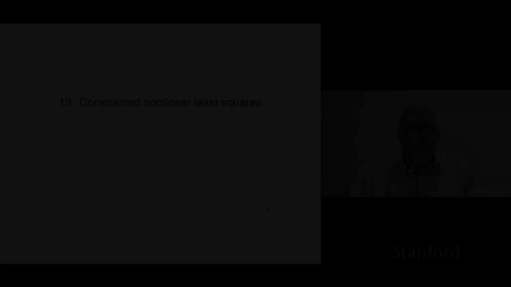
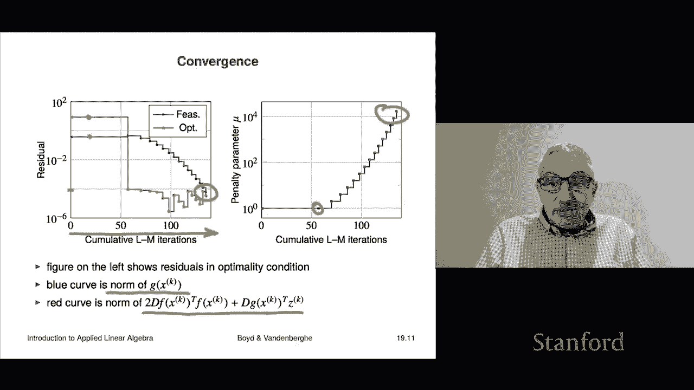

# 【双语字幕+资料下载】斯坦福ENGR108 ｜ 矩阵论与应用线性代数(2020·完整版) - P53：L19.1- 受约束的非线性最小二乘 - ShowMeAI - BV17h411W7bk

Chapter 19 is on constrained nonlinear least squares。

 so this is where we use we have not only nonlinear least squares。

 but we also have equality constraints， this time they're not going to be linear equality constraints as they are in linearly constrained least squares。

 they're going to be nonlinear equality constraints。

Okay， so let's see what the problem is， well， it's going to look like this。

We're supposed to minimize this is norm。There we go。

 This is norm F of x squared or F is the vector and then subject to we have p equality constraints。

 but these are equality constraints with possibly non aine functions G and we refer to G of x equals zero as the I scalar equality constraint So in vector notation is just this problem right here a lot is being hidden there here F is a vector so that's a sum of squares G is a vector also a P vector and so that's a set of P scalar equations。

Scalar equality constraints or equations that have to be satisfied。

So we say that x is feasible if G of x is zero and x is a solution or x hat is a solution if it's feasible。

 that's required， And if for any other feasible point。

 it has an objective that is at least as big as our point X hat Now in general this is very difficult to solve if you mean actually literally finding a solution that you know as a solution but as with nonlinear least squares there are very good heuristics that solve it quite well and they solve it well enough to be very useful in practice。

 again， it's very much like K means it's not like QR right the QR factorization that is not a heuristic it just works period or you know when we solve linearly constrained least squares problems that is not a heuristic we simply get the solution period here we have an algorithm that you know might get the solution might not which sounds kind of。

 but in fact， if it's useful， that's good and in many cases it's very useful。

So the Larangian of the problem so what we'll do is we're going to work out the optimality conditions for the constrained nonlinear you know constrained nonlinearar least squares and so the Larangian is obtained this way you take the objective which is going to be norm f of x squared and what you do is you form you add you take so-called laggangrange multipliers。

 these are numbers Z1 through Zm Zp this should be P actually here so that's a mistake there you go through Zp and what we do is we multiply each of our constraint functions by Z and we add that up and so this becomes the lagrangian and you can write it in very compact vector and matrix notation I guess just vector here this way as the norm squared of f of x plus G of x transpose Z and Z is the vector of lagrangrange multipliers now what the method of Lagangrange multipliers tells us is from c。

Is that if Xha is a solution， then there has to be a set of Lagrange multiplayers ZhaAT that satisfies the following the partial derivative of this Larangian with respect to Xi is zero and the partial derivative with respect to ZI is zero and there are some technical conditions which I don't intend to get into and I don't even think we have to worry about it。

Now in this case you would say that when you find an X hat that satisfies this and a ZhaAT。

 ZhaAT is called an optimal lagangrange multiplier， so it actually has an interpretation。

 but it's not one that we're going to worry about in this course so that's it now I should mention that there are points that satisfy these conditions which are not the optimal point that's the same as non nonlinear least squares so same same story。

So to work out what these two gradients are， so that's the partial the gradient of L with respect to x and the gradient of L with respect to z。

 we can work that out， so the gradient with respect to x is that's actually the same calculation as in nonlinearar least squares and you get twice two times that's the Jacobbian or derivative matrix of F at x hat transpose F of x plus and then so this is what you would see in the case of nonlinearar least squares。

 but here there's an extra term， which is the derivative of G or the Jacobian of G of x hat transpose Z hat。

The gradient with respect to Z so that would be how do you take the gradient of the well look it's a pretty simple function in z right it just is z it just simply it's this one right here so in fact the gradient is G directly so the second set of conditions in the method of lagangrange multipliers tells us that g of x hat is zero now truthfully we knew that already because this simply says x hat is feasible doesn't say anything else but this is the other condition and and you can actually it's good to make sure that this generalizes correctly non nonlinearar least squares so if there's no constraints you just remove this and you remove that and sure enough we're back to that's the optimality condition for nonlinear least squares now again I'll say this condition is necessary for optimality but's not but but it's not sufficient there are points that can satisfy this but they're not optimal。

Okay， let's look at constrained linear least squares。

As a special case so here's the problem looks like that and then what we do is this is the same as the nonlinearar problem but we set F to be ax minus b and g of x to be c x minus D so in that case F and G are both aine functions when you apply I mean I can tell you what Df is Df is a literally the matrix A it's constant DG is C so when you translate that to our optimality conditions given in the general case right here。

 here's what you're going to get it's this thing that's equal to zero and it's that and you look at these closely and you realize like oh these are exactly the Kkt equations for the linear constrained least squares problem here and of course we assemble those typically into a matrix that looks like that matrix equation and you'll recognize the the so-cal Kkt matrix here on the left and so in the case of linear least squares problems you simply solve that set of equations and you have your solution。

We also have the optimal Lagrange multiplier Z hat， there are applications where you'd want it。

 but as far as we're concerned or at least in the scope of discourse。

 we don't have to worry about that。What we're going to do now is look at a simple。

 very simple method for approximately solving。The non nonlinear constrained least squares problem and so we'll look at that and then I should tell you that this is actually the precursor to the method we're actually going to suggest this is going to be a so-called penalty method very simple idea and what we'll do is it's got to drawback and we're going to come back and fix that drawback with a variation on this method which is called the augmented Laangian method and that willll consider in the next section。

But for now， we're just going to look at a simple method。

So here it is actually it's we're instead of a constrained problem。

 we're going to think of it as a what we're going to do is think of the problem as a by criterion problem and we're going to think of mu as going to infinity or something like that right because I mean if you think about it if you were able to solve this problem for mu larger and larger and larger that's going to become a solution of of the constrained least squares problem because。

When mu gets really big， you're basically saying that you have no choice but to make g of x equal to0 and that's what we want。

 So now this is itself a constrained least squares problem like that。

 So it's just that depending on the value of mu and we could use Lenburg markqu to minimize that。

 And so that looks like this。 I take an increasing sequence of the muse like mu 1 equals you know1 then2 then 4816 something doesn't matter And what I'll do is I'll compute xk plus1 by minimizing this using Lenburg mark part。

 but here's an important part I'm actually going to start at the previous point。That's important。

 actually， that's called warm start， by the way， instead of cold start。

 cold start starts with x equals zero or x equals some random vector。

 but we're going to start with the previous one and we'll see how that actually lends us an advantage soon。

Okay， so let's take a look at this and see how this method works by the way。

 this method works okay it's just not so bad I mean one minor problem is that you might get really big and you might have some big gradients and things like that flying around but it actually kind of works we'll see another method that doesn't suffer from that but for now we'll look at this one。

Okay。So the remember that for the constrained the nonlinear。

 the constrained nonlinear league squares problem， the termination condition。

 the optimality condition is this。Okay。😊，Now， let's suppose that what we do is instead of solving the original problem。

 we solve this one。But for a given UK， okay， well， if I do that。

 I just write down the optimality conditions for these optimality conditions for this nonlinear least squares problem and that's going to turn out to be exactly this。

 that is the optimality condition okay。Now what we're curious about is how does this relate to that we have intuition that tells us that when muK gets really big。

 this gets closer， this gets closer to a solution of that， but if we stare at it long enough。

 you realize， hey， look at this， if we take the following if I put this two muK together with the GXK。

 we see that this is DG of Xk transpose and then times this thing times that that's a scaleal of so we can move inside。

So I'm just simply going to define ZK to be this thing。Right， and in that case。

 we'll say that this algorithm produces a sequence xk and zk and this holds and that's。Really。

Kind of cool right it says that it says that reproduce。

 remember that you have two conditions to term optimality condition for the original problem right it's this one。

Right some people call that the dual condition they have lots of names and this is called the primal condition or it simply says that the point is feasible right so this says that that first one we get for free it's just completely free。

 we get a Z well with this Zk it comes for free and so the only thing we really have to worry about then in this algorithm is that one is becoming feasible so people would say that with this penalty method quote it converges to feasibility so as the algorithm runs you get closer and closer to having a feasible point by the way when you have a feasible point you have a point that satisfies the optimality conditions okay so that's the idea and so you stop the penalty method when the norm of G of x is sufficiently small。

Now， of course， that alone just tells you you've found an almost feasible point， but this thing。

 because of the way we've constructed it， this guarantees that in fact the other condition holds。

 which is kind of cool for an appropriate choice of Z。Okay。

Let's look at an example is completely made up， but here it is its f of x1 and x2 two variables is going to be x1 plus e to the minus x2 and then some quadratic x1 squared plus 2 x plus1 and here's G of x it's just one it's one equation so p is equal to1 and it basically says you minimize the norm squared of this expression subject to this equation equaling0 now that's going to trace out a curve in the plane and the x1 x2 plane let's take a look at that here's x1 and here's x2 this dashed curve right here is the feasible set that's the point where this equation is equal nothing is equal to zero and that equation holds these level curves here these tell you level're the level sets of norm f of x squared right。

What we really want to do， these are large values up here。

 these are getting smaller and smaller and so along this line。This curve， which is feasible。

 you want to find the point that has the smallest value here， and that's actually right here。

 that's x hat that's going to be your smallest value， so that's the picture of what this looks like。

Okay， so let's see how our penalty method works on this problem。We'll take mu one equals one。嗯。

And what we'll do is we'll find x2 right here then when we say mu2 equals2 what you're going to get So here these the curves the solid curves are the the contour lines of actually the objective plus mu k times g of x squared right so we're approximately minimizing it this dash line here shows you the feasible points and in fact all we need is for the point we're calculating to be on that feasible set that tells us that we're feasible so at at least we can do this at least visually with some of these things so okay so here we get this point then on the next step you can see actually that these curves have changed because mu k has gone up and the point we compute is closer here by the time it's four you're closer still and if you fast forward up to 30。

Up to mu on the six step， mu is 32， you can see that you're getting pretty close here and it's actually it appears to be converging to the solution it is actually。

So the convergence for this looks something like this， here's the number of， oh。

 and I should say what the iterations are。The unit of effort is actually carrying out a Luenburg MarkW iteration that means calculating the derivative of D and of G number one and number two actually solving a least squares problem so there might be like you know 15 Luenberg Markwar iteration you know iterations for one outer iteration。

In the penalty method and so we actually keep track of the number of Leenburg markwar iterations and we're plotting two things here。

 the feasibility and that's the feasibility here and the and then the so-called optimality one so the blue curve shows you the norm of G of x and when that goes to zero when that gets to zero that means you're feasible right so you can see down here 10 to the minus4 is you know we're going to call that close enough the red curve shows the norm of this thing。

And so that becomes zero basically after the first Leenburg Markport cycle is here and it stays small and you can see that's kind of the point and then when both are less than I suppose my condition here for terminating is 10 to the minus four。

 but when both get to be less than 10 minus four， we quit and we consider we declare success。

Okay here's here's the value of that penalty parameter right the first Luenburg Markwart cycle takes 50 some odd iterations okay and that lands you here then you're one then it jumps up to two than four then so on and that shows you how this works and one thing you might be concerned about is by the end here our mu is 10 to the four so well maybe you're not concerned about that but that's that's how that works is that that parameter gets bigger and bigger and bigger and it kind of makes sense。

So that's the idea behind this so called penalty method。

