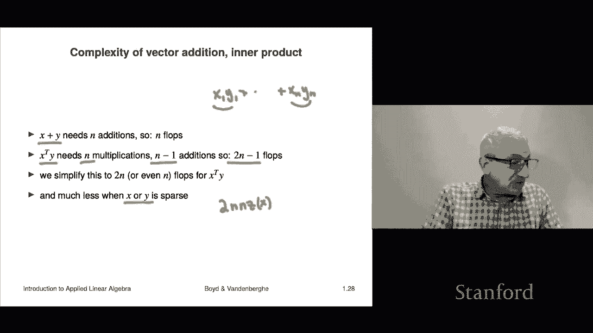

# 【双语字幕+资料下载】斯坦福ENGR108 ｜ 矩阵论与应用线性代数(2020·完整版) - P6：L1.6- 复杂度计算 - ShowMeAI - BV17h411W7bk

Our last topic for chapter 1 is complexity。 and that it's a very rough measure of how long does it take on a computer to carry out a certain operation。

 It's something we'll be talking about throughout the course。

Okay。So the way this works is computers store a real number。In floating point format。 Now。

 in this course， you don't have to know what that is。 But what it is is it's。

 it allows you doesn't It doesn't represent the number exactly， but it's very， very close。 So。

 for example， it wouldn't， it wouldn't store the number one third， exactly as one third。

 but it would store it as like  point33，333 with about 153s in there， right。

 which is for all practical purposes close enough。 Okay， now。When you take a basic。

 when you ask a computer to carry out a basic operation on two floating point numbers like you ask it to add or multiply them or divide them or subtract。

 that's called a floating point operation。 Or， and this s for that is flops。 That's a flop。

 A single flop is adding to numbers on a computer， okay。Now。

 when you have an algorithm or an operation and you want to。

What you do is the complexity of it is judged by simply counting up the total number of flops that you're going to need to do。

 So， for example， you might count the number times you have to multiply two numbers， add two numbers。

 subtract or divide them。 and you add up all those numbers together。

 and that's called the flop count for your operation。 Okay， Now。

 turns out this going to be very grossly approximated because implicit in this is the idea that adding two numbers comes at the same cost is dividing two numbers。

 which is false。 It actually takes longer to divide two numbers。 However， still。

 this is just meant to give you a rough idea of whether carrying out an operation is going to cost you。

 is it going to be done in way under a second， a second a minute， an hour a day。

s that's really what we're aiming for with this very crude estimate。

 now a crude approximation of how long it times it takes for a computer to actually carry out。

Out that set of operations or that operation。Is this is the number of flops you need to carry out divided by the computer speed。

 and the computer speed is given in flops per second。

 Okay so you can see that flops you need divided by flops per second gives you seconds。

 So it tells you it tells you how long it's going to take in seconds。 Now。

 this is very crude approximation。 we would not we certainly don't expect this to be even like you know。

 accurate within plus- 20%。 and in fact， it can even it be off by a big factor like a factor of 10 or more。

 but it does distinguish between seconds and hours that it can actually do。 Okay。

 Now a current computer is around can carry out around a billion flops per second。 actually。

 my phone can carry out a billion flops per second。 So and my laptop can do maybe 10。

 but fancier computers GPus， for example， know graphical processing units。

 they can actually carry out even much more than that。

They can some of them can even actually many of them now can actually carry out not just they can actually carry out 10 to the 12 flops per second that's 1000 billion of trillion flops per second that's called a tariffra flop per second computer okay。

So let's just do a quick example。 And let's say that you have an operation that takes， you know。

 10 that that's going require you to do 10 to the 10 floating point operations。 That's a lot， right。

 That's， that's， that's 10 billion。 Okay， And so on a typical computer。

 let's make it a 10 gigabop computer。 But that means it's also。

 it can carry out 10 to the 10 flops per second。 And so we would guess that that's going take you about one second on that computer。

 okay。So let's look at the complexity of vector edition inner product。

 we can also look at scalar vector multiplication。All right let's look at adding two vectors。

 So when we add two vectors， well， it takes n additions because you have to add each X to each Y I。

And there's N of those and entries。 So that's n flops total。 an inner product that's forming。

 that's calculating this X 1， Y 1 plus up  to X， N， Y， N。 Okay， well， first。

 you' got to multiply all these pairs。 And this's N of those， you're gonna to have n multiplications。

 And then you're going add them up。 Now， when you add two numbers， that's one addition。

 when you add three numbers， that's two additions。 So when you add n numbers， that's n-1 additions。

 So you're going have to do n -1 editions。N multiplications and altogether to n -1 flops。 Now。

 no one would ever give the -1 because it， it's understood that this is very crude。

 And so people would always say that an inner product costs 2 n flops。 In fact。

 a lot of people would even just say n because we're not even shooting for a factor of 2 in accuracy here。

 just N for the inner product。 Now， incidentally， this is interesting。 Now， you can。

 now we can say something about if， if one of these vectors is sparse， that can be a whole lot less。

 for example， supposeuppose x is sparse and y is not。

X is sparse means that most of its entries are 0。 Now， when I calculate the inner product。

 I don't have to worry about those entries because all I'm going to do is multiply X I。

 which is 0 by Y I doesn't matter what Y is。 I don't have to do it。

 So the only turns out the only thing I actually have to do is for every nonzero entry in X。

 I have to multiply that X I by the corresponding Y I。 And I have to add those up。

 And so the complexity is is around this。 It's twice the number of nonzes in X， right。

 So this is an example of why you might be interested in or care about sparse vectors。

