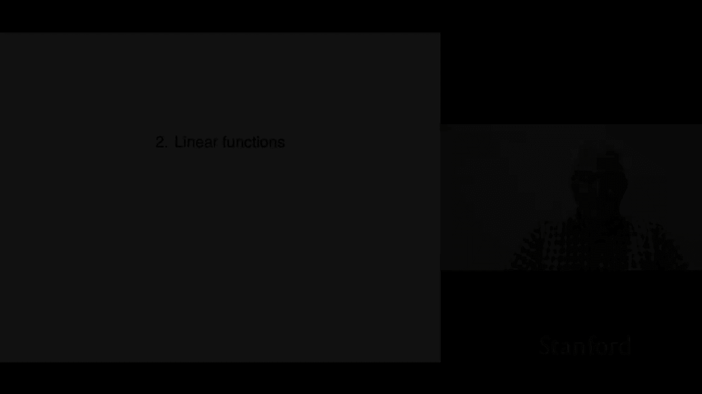
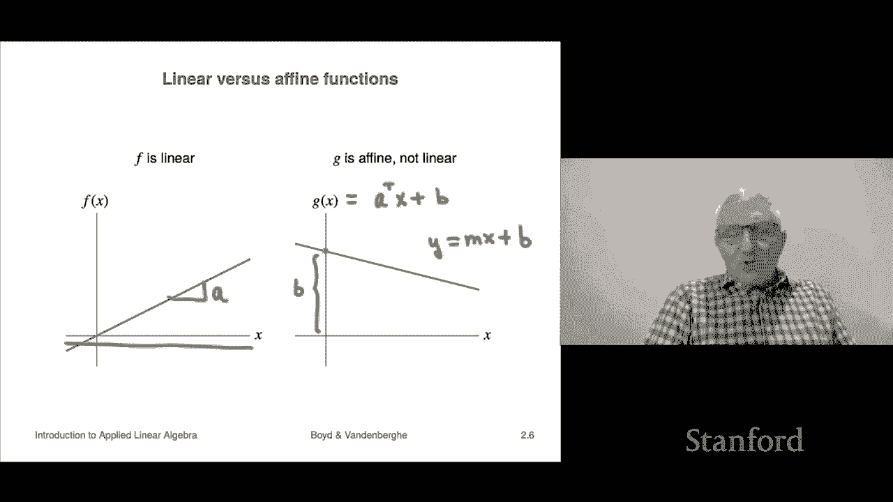

# P7：L2.1- 线性函数 - ShowMeAI - BV17h411W7bk

Let's look at chapter two on linear functions。

So we'll start by talking about linear and ane functions， aene。

 as we'll see as a slight extension of linear functions， which is also very useful。

 comes up in a lot of applications。Okay so let's start with some notation so looks complicated but this is a standard mathematical notation this thing that says F colon and then this bold R with a superscript n to R what that says is that F is a function and F takes as argument or an input or what it takes in is an n vector so that's what this R n means and then what it does is it gives you back a real number that's what this R over here means so that's some people would call it scalar valued function just a function lots of ways to think about functions a ranging from informal to formal informally you can think of it as something like a process that takes n numbers in something happens and it gives you a number back you could think of it as a subroutine in a computer program or you can think of it as simply one onere number that's the output which depends on an nre numbers and you can think of those as the input and so we would write things。

Like this F of u here u is a vector， so it's a vector it's a list of n numbers and then F of u。

 this whole thing here is a number Okay， so that's the that that's the notation。

Okay now a function from RN to R that's how you pronounce this satisfies what's called the superposition property if the following holds and these equations are things you have to look at sort of you have to look at them very carefully very quietly make sure you understand everything in them because it's a lot of overloading going on so they look completely reasonable its says a juxtaposition of symbols you read it in you' like ju why not but you really have to kind of be very present and aware thinking about what all the parts mean so let's take a look at it。

Superposition property says you start with a vector x and a vector y， and you start with two scalrs。

 alpha and beta， and then you form a linear combination， that's alpha x plus beta y。

Then it says after you form linear combination。Evaluate apply F， okay。

 And so you get f of alpha x plus beta y。 And this whole left hand side is a number3-2。6。

 I don't know。 Okay Now， let's look at the right hand side。

 The right hand side says we're actually going to do this in the reverse order。

 We're going to first apply the function to x and we're also going apply the function to y。

 Now those two things are numbers， right， because F takes this argument。 a vector X in this case。

 over here。 And then it returns a number。 So F of x is a number。 So is f of y。 And so over here。

 alpha alpha next to F of x， which is a number is just ordinary multiplication of two numbers。

 That's ordinary addition of two numbers。 And the whole thing on the right is a number。

 and that's good because the lefthand side is a number2。

What superposition says is that actually you get the same thing if you form a linear combination basically before applying the function or after and the way you might say that。

 in fact， the way a mathematician would say it is they'd say that that the function F commutes with linear combinations。

 In other words， you can either do it before or after the order doesn't matter。

 So that's a very special function and I mean very special property and actually very few functions actually satisfy you know satisfy this exactly。

 but we'll see that a lot of a lot of functions that occur in the wild actually satisfy this either very closely or quite well approximately。

And we'll also see that a lot of constructed functions。

 functions that will make up actually do satisfy linearity， okay。

So if a function satisfies the superposition property。

 which says that basically it commutes with forming linear combinations。

 then you call the function linear and that's very standard in mathematics' in fact it's a concept that goes throughout all of mathematics。

 applied mathematics。All of engineering economic I mean just tons and tons of fields statistics。

 a lot of stuff based on this idea Okay， so now right now this is all very abstract。

 but hopefully soon this will be less abstract and therefore probably more interesting。Okay。

 so here's an example of a function that's linear and it is the inner product function。

 so let's see what we let's be very careful about this， so we'll start with an N vector a。

Just a vector。But you have to specify okay， and then I'm going to form a function f of x oh and by the way。

 how do you how do way， if I say I'm thinking of a function F and somebody says what's your function。

 I have to explain what does F give。For an arbitrary argument。

 right and so here here's what I'm going to say， I'm going to say that when you give me X。

F is going to calculate the inner product of a and X And that just means F is going to calculate a weighted sum of the entries of x and the weights。

 in fact， are the coefficients in the vector a here。

 So that's how that's going to work So that's the inner product function very natural And it turns out it's linear So let's see why well。

 here we're going to form this linear combination here。

 And then what we're going to do is we're going to apply F。

 And by definition to apply F means takes the says take the inner product with a。

 So' that's the inner product of a and this vector and we're going to use some properties of the inner product So for example。

 you can't if you have the inner product of a vector with the sum of two other vectors。

 it's the same as the inner product of the first one with the first the vector with the first one and plus the vector with the second one。

 So that's this second line here。 that tells us that we can write it this way over here。Okay。

 and then we're going to use another property of the inner product and that is that scaling a vector。

 which is an argument linear in an inner product is the same as scaling the inner product。

 And so what that means is that the alpha and the beta can go outside notice something interesting here right inside here Al x is scalar vector multiplication in the next line Al times that's a number so that's actually in the next line alpha is actually engaged only in number number or scalar multiplication okay。

And then we recognize inner product of a with x and inter product of a with Y。

 Those are nothing but f of x and F of y。 So we get this。 And sure enough。

 this says that F of alpha x plus beta y is alpha F of x plus beta F of y。

 And that holds for any X and Y， any alpha and beta， right， So that means it's linear。 So okay， so。

So there are linear functions， any inner product function is a linear function。Now， it turns out。

 in fact。It's more in fact， that's all the linear functions there are。

 so another way to say it is this。Suppose I tell you simply that a function is linear you know absolutely nothing more about it then it turns out we can actually write it as the inner product of X with a vector a for NA and we're going to be very specific about what a is AI is simply F of EI and remember that EI is the I unit vector when it looks like this。

 right？It's got， you know。Well， it didn't come out well drawing。

 But the idea is it should be a vector with all entry 0 and11 in the Ih position。 and that's it。

 Okay so it says AI is you apply F to that vector。 You get a number that's AI Okay and let's see why well F of x is now here we're doing this kind of very silly expansion。

 We're saying that x is equal to x1。 that's its first component times e1 plus x2 times e2 plus x3 and so on。

 Now that's expressing x is a linear combination。 Now this thing you can apply the superposition rule recursively and you'll find that F of a linear of a linear combination is the linear combination of F applied to each of the vectors And so that's the equation down below。

 And this thing we see that is exactly the inner product of a。

And X where a is give is the vector whose entries are F of EI so we see that okay， so oh by the way。

 this is called the the inner product representation of a function。

 I mean of a linear function sorry I mean it's a bit silly。

 but it says that any any linear function has an inner product representation。Okay， so， so okay。

 it's just a fancy name for inner products。Okay， we're also going to encounter something called aine functions now a function that's if it's linear plus a constant。

 it's called aine oh let me point something out about a linear function if F is linear。

 we know now that it has to have the form if it's an inner product looks like that and we can immediately calculate that F of00 actually we didn't even need that form。

 we we know that if it's linear， well， this follows immediately from linearity is that a function has to map0 to0 oh and just heads up that zero is a vector。

This0 is a number right That's the number0。 That's the vector 0 right so and we don't distinguish them。

 After a while， I'm going to stop pointing these things out and it's gonna to be on you to keep track of you know what the notation means and things like that。

 and especially to disambiguate the overloading so overloading is when you use the same symbol to mean different things depending on the context。

 So this is a perfect example。 after a while you get used to it。

 I won't mention anymore more maybe every every now and then I will just for fun。

 But the point is this is is a very important thing to get used to is you can write stuff down super easily looks good。

 but you have to actually just always always make sure you' understand exactly what the notation means Okay so an aine function is a linear function plus a constant and in this case。

 if it's aine then F of0 is actually B and B is a number。And in fact。

 some people call be the offset right or the that's one of the names word it's an offset in the aine function。

 Okay， now it turns out an aine function is also characterized by a superposition type a superposition type equation and let me say let me show you what that is It's this It says you form a linear combination of X and y that's alpha x plus beta y and apply F to it。

And it says， I get the same thing as this now， by the way， if F is linear。

This identity here holds for all x and y， all alpha and beta that's linear， okay。

 maybe me superposition， okay。Now， if F is a find， this formula holds whenever it holds。

 but for a restricted set of alpha and beta， they have to add up to one alpha and beta right so they could be 0。

3 and 0。7 minus 0。3 and 1。3 something like that， these are pairs and if for all such combinations。

You satisfy superposition then F is that line right so that's how that works。 Okay。

 now oh and I should say something sometimes when you have a linear combination where the coefficients add to one。

 some people refer to that as a mixture it's a special kind of linear combination。

 but people call it a mixture because you think of it as 30% of it as 70% of that Now a mixture allows you to have negative weights。

 but that's okay as long as they add up to one okay。

One one thing to know about Aline functions is that a lot of people actually call them linear and know maybe that comes from high school or something。

 and I'll explain that in a minute。But Iine functions generally are not linear。

So here's quick example in this one n is one so x is one vector otherwise known just a number。

 so here's here's x along this axis and I can plot x that's this blue line here now on the left F is linear and the slope by the way here is exactly a so a in this case is a one vector otherwise notice a number and so a might be I don't know if this we' drawn to scale might be I don't know let's say a third or something like that one third。

3 there that's what's what that's what a is for this picture 0。2 I don't know 0。

5 sorry okay so this is what and notice that it you goes through  zero and it's a straight line and in fact。

 the way we get the name linear is。Because the graph is a line， it's a line。

 so it kind of makes sense right I mean or at least I believe that to be the etymology of linear function。

 but okay， on the right over here， we see a function that's aine it is not linear It's for sure not linear because a linear function goes through zero and G of zero is here and it is very much in fact this is B。

If this if G of x is a you know I'm going to write as an inner product even though the inner product of two members is silly。

 it's just the product， but I'll write it that way just to remind you and so this is B here and then the slope here is you know minus one quarter or something like that A is minus a quarter so that's an fine function and I think even in high school people talk about I think here's here's what I remember maybe your notation was different but I remember people saying like it was something like this as I recall don't quote me on this but and that was the equation of a line something like that you know M is the slope and B and you can see。

It's just an aine function， but I guess they don't tell high school students that's an aine function anyway。

 it's affne。 So oh， so anyway， you will not， you will find lots of situations where people refer to aine functions as linear。

 it's cool。 But if you're around like weird pickingy mathematicians if you don't know them that well。

 you're probably better off referring to aine functions correctly as aine。

 so but if you're with friends and everybody knows all this， then you know， you can call them linear。

 if you like。

