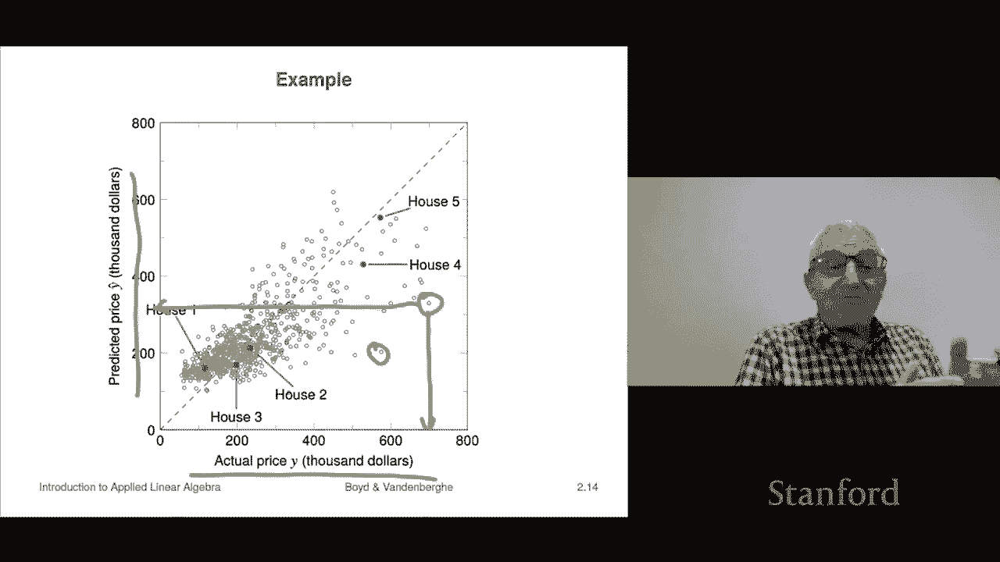

# 【双语字幕+资料下载】斯坦福ENGR108 ｜ 矩阵论与应用线性代数(2020·完整版) - P8：L2.2- 泰勒近似与回归 - ShowMeAI - BV17h411W7bk

We're not going to look at two very famous and very widespread widely used examples of aine functions one is from differential calculus it's just the Tayloror approximation so that goes back in a couple hundred years and the second one is a regression model from statistics we'll start with the Tayloror approximation。

So in the Taylor approximation， suppose you have a function that the way you'd say this is you maps Rn to R now Rn is the set of all n vectors。

 so the way you should read this notation which is universally it's a universal mathematics notation is this says that F is a function and it takes as an argument or input or however you'd like to think of it。

 a vector an n vector so Nre numbers and then it returns or evaluates to or givess a single number R back as the result that's what the second term means。

 so for example you might write F U or something like that and that would you here must be an n vector and F of U is a real number okay。

All right， so the tail approximation is just this it's the first order Taylor approximation says the following that and we're going to develop this near point Z and it's this so it's F hat and the idea of a hat is that's common mathematical notation that hints that it's an approximation so when you see F hat it's an approximation of F and that's that notation or it's just a convention that's common across many。

 many areas of applied mathematics。It's not universal I mean there's other subfields where hat means something different like you know 4ier transform or something。

 but it's just something to understand is that very commonly a hat means an approximation Okay so this says F hat of X that's my that's my approximation of F and it's going to be the following function it's F of Z now that's a constant it's just whatever number that is minus2。

Plus， and then what we have is a sum of terms。 Each one can be interpreted as the approximate change in F due to the change in that component of X or z。

 So here， for example， x1 minus z1 is the amount you have changed the first component from z1 to x1。

 and then you multiply that by this partial derivative。

 the partial derivative of F with respect to x1 evaluated at Z and so。

You add up all these sort of correction terms and you get this function and that's F hatAT now。

That function is affne， we'll see that momentarily。

But the main property of the Taylor expansion is this is that F hat。

 this approximation is very close to f of x when the x's are all near the z'。

 and a picture will explain that， but very close means not just that they're close。

 but they're very close， right？Okay now we can write out this tailor approximation using vector notation and inner product and that looks like this so this says that f hat of x is equal to f of z that's a number plus and then up here if you look at this term you will recognize it is a sum of products of two things and if we collect those two things into two vectors one is just the vector x minus z and the other one is a vector whose components are these partial derivatives and that's got a name so that's called the gradient vector。

And so the gradient vector is the set of all partial derivatives of a scalar value function with respect to x1 x2 x3 up to xn and so and this we recognize up here as just an inner product and so we've got this beautiful compact formula that looks like looks like that and it's you know it's kind of nice because it looks like the formula you would have if x and z were scalarrs and here this would just be simply F prime of z which is in fact the gradient when you have just one variable okay now to see that this is an aine function we could write it a different way we could write it as。

The gradient of F inner product with X， sorry that's it Z inner product with X and this。

 you can think of this as your a， if you like in the aine model and then plus and then the offset and the offset is going to be F of z。

Minus the gradient of F at z in a product with Z。Okay。

 and so this part here we would call B and what that says is that F hat of x has the formin product of A and x plus B so okay。

So this is so。The summary of all this is， in fact， you can even think of， you know。

 a good fraction of。Derivative calculus。Is in fact。

 simply it's an organized method for making aine approximations of functions so let's see a quick picture now the picture I'm drawing is Z and x are scalrs so that's so I can draw it but I'll see a little bit about how this works in the higher dimensional case so here it is so here's here's the curve which is F of x so we can see F of x here。

And here's a point Z。 And then this red dashed line is the graph of F hat of x。

 And you can see it's a line。 So it's an aine function。

 And so what I meant to say earlier when I said it was very close when you' close if you were to imagine zooming in there。

 what you would see is that if you moved a little bit from x， like I'll just make up like 0。

01 then what would happen is the approximation would be very accurate， like way better than 0。

01 like 0。01 squared right， which is 10 to the minus4。 So that's what this means。

 So it's tangent to the curve at that point。 So is and this， you know from calculus。

 now in higher dimensions for example， in2， what we would do to visualize this is we would imagine let's say a plane and then a surface above it and that surface would be F。

 I pick a point Z， I go up to the surface and then what I would have is my graph would be a plane and it would be the tangent plane。

's。Pe that just sort of touches the graph at that point and is actually parallel to it right at that point。

 and that would be that would be the first order tail approximation of the function。Okay。

So this is one area of- it's an organized method for producing affine approximations of non ane functions。

Okay our next example is the regression model is this is essentially a humanmade thing because these are just approximate models but it's absolutely ubiquitous you may have already heard about this in other courses I guarantee you you will take hear about it in other courses if that's not the case then well you're not taking the right courses buts so it's a very important thing to understand it's not complicated but it's super important and we're going to see it a whole lot later much more later in this class。

Okay， so a regression model is this and the idea is I have a vector X and I think of x as a feature vector so its components are various numbers associated with an item right could be a patient admitted to the emergency room or something like that it could be it could be a certain each item could correspond to a company on a publicly traded exchange or something like that and then the entries of X are attributes。

Of that item so for example， if it's a patient you could encode are they it could be their height。

 their weight， we could encode their sex as you know， zero and one。

For let's say male and female we could we can say they are they experiencing chest pain that could be encoded as zero or1 and so on so that would be these would be attributes of the item for a company it could be the total capitalization of the company last year's return it could be just various it could be the sector that the company operates in or something like that so okay so this would be these would be attributes of it and then why is something that we want to predict right and why could be for example the number of days that patient will ultimately stay in the hospital right Of course we don't know it because who know we have to see how they do and all that kind of stuff so but that's why oh well we know it after they've left the hospital。

And let's say for a company it could be what is going to be the return on their stock over the next quarter。

 is it going to go up 5% down 10% I don't know that's what that's we would call that why okay and so。

We would have what we have is a model or regression model like a prediction model and here's what it is it's actually relatively straightforward we're going to look at it why the the prediction is。

An offset V that's called the offset plus and then an inner product of the feature vector with a weight vector or coefficient vector beta and I'm using some I'm using some of the traditional some of the traditional notation that you'd see in a regression model So this is this is the model and of course you know we could write this out and it's worth it's very important to write down So that's like beta 1 x1。

Right， all the way up to beta and X N plus V。 And we can interpret all sorts of things there。

 Super cool。 Like if all the features are0， our prediction。😊。

Is V so that's what V is Oh and I should say here that y hat is an approximation supposed to be an approximation or prediction of what y is right so y is the true outcome or something like that So this is useful in cases where you can see X。

You don't know why because maybe it hasn't happened yet or something because it's something in the future it's how many days will they stay in the hospital or what will your return be over the next month so you don't know it。

 but you do know X and so this gives you a way to make a prediction of what that's going to be Okay so it's a prediction model All right and we can interpret everything very nicely here right so for example beta1 is the amount by which your prediction goes up。

When x1 goes up by one Okay so that's that's kind of the idea So we'll see that in a very specific example I'm going to show you in a minute so that's the idea if if a beta is。

 for example， negative that means that when that feature goes up your prediction goes down okay so for example。

 a feature could be here's a feature ready it's x7 and it says is this a person a heavy smoker is10 means not a heavy smoker and if why if we're trying to predict let's say lifespan then would I would hope that beta 7 is negative and what that means is that anyway a good model would have beta7 negative and that means that if you're a heavy smoker our prediction of your lifetime is going go down in fact。

Quite literally beta 7， which is negative， is going to be the number of years we our model predicts you will lose in your lifespan if you're a heavy smoker。

 Okay， so we'll come back。 we're going。 we're going be talking about this in great detail later。

 This is just your first introduction。 But the main point is this。

That is an affine function of the features， that's it， it's linear plus a constant。Okay。

 so that's the idea of a regression model。I'll just give you a quick example。 And like I said。

 we're gonna come back to this and look at this in much more detail later。 So here's an example。

 just to sort of get in your ahead how this might work。

 So let's say why is the selling house is the selling price of a house it's how much it sells for。

 And let's say it's in thousands of dollars。 So you know$230 means it's sold for $2300000 and that's in some location over some time period right and the regressor is going be extremely simple it's going to have the feature vector is going to have just two features and it's going to be the house area is number one and the house area we're going give in thousands of square feet。

 So 10 the square foot house is a one and bedrooms is going to be of course， it' just the integer。

 So for example， you know $2。1。Coma three， you know， is a。

 that's a 2100 square foot house with three bedrooms， just for example， okay。

Now I should add this is an embarrassingly simple example no one would predict a house price based on two features right real ones like zillow or truly would they would actually predict a house price based on tens or hundreds of features right so but nevertheless it still just gives you a rough idea of what it's going to look like okay and so here's a regression model right now I cannot tell you where this regression model came from but that's not the point right now just to understand what it says。

Super interesting， It says that beta is 148。73 and minus-18。85 and the offset is 54。

4 Okay now by the way， later in the case in the course。

 you will be able to fit regression models to data But for right now let's just in important and understand just what a regression model is what does it say and it's actually really cool let's talk about it for a second here this first one we can interpret in a beautiful way。

 It says that basically for every000 square feet of increase in house size our model predicts that the selling price is going to go up by about 150000 so I mean you could even sort of divide it and say well it's you know whatever it is it's $1500 whatever dollars per square foot however it works out something like that right。

So that's an interpretation there now this ones that's tricky to it looks strange right it says it says wait a minute this is weird this says that when the number of bedrooms goes up。

We predict the house price to go down okay so then you think that surely that's wrong and you go well it might not be wrong i'll give a rough explanation for it now this says that if the number of bedrooms goes up but the house area stays the same。

Then in fact the price our prediction of the price goes down a little bit you know and you could chalk this up or if someone asked you why you could say I don't know maybe it's it's more crowded or cramped right if you have a 1200 square foot house and I add another bedroom yeah it's it's too cramped or something like that i'm just making this up also it's probably a good idea not to。

Get to I mean you can think about the model but don't don't take it too seriously Okay。

 so this is the this would be the idea oh this offset。That's 54。

4000 you can give kind of an approximate an approximate interpretation goes like this。

 you would say that that's actually the the cost of the lot because it's actually that is our prediction of the selling price of a house。

Whose vector is， whose feature is0， zero？But that's a house with zero foot square footage and zero square footage and no bedrooms right so in other words known as not a house so I mean I wouldn't take any of these too seriously。

 but if you wanted to interpret this， you could certainly interpret it that way that that's the price of the land or the base price or something like that Okay so that's a regression model and let's just look at a quick example of how you might use that regression model well。

I've shown you this is five houses okay and actually the houses we selected actually the first one has one bedroom then two。

 three，4 and five house okay but doesn't have to and then what I'm going to give you by the way this is actually some real data doesn't matter but here the first one is 846 square feet。

 we can see that here here this fivebed house that's 3 that's almost 4000 square feet okay and so here what's listed here is what the actual price the house sold for and then over here that's our regression model prediction now by the way。

 if we know how much the house sold for you definitely do not need a regression model because if someone says what do you think is's going to sell for you'd say it just sold and it as a matter of fact it just sold for 234。

5K period right so you don't need a prediction model you need the prediction model before that。

When you'd say， hey， how much do you imagine this house is going to sell for when it does and that's our prediction and you can look at these two and you can just eyeball them and you know this kind of makes sense。

 you can see we're getting the flavor of it。Right I mean， we do predict that。

 for example that sells for a whole lot more than that we make some good pretty good predictions right like that that's a pretty good one that's not such a great one right there that's not fantastic that's you know okay and that's not so great really that last one that first one I mean this is silly because you know you know we're attempting to I mean it's not it's not unexpected we're attempting to predict the price a house sells for based on two attributes and nothing else that's ridiculous because in fact it's going to depend on at least 50 year attributes like how good are the schools in this neighborhood how much of other houses in the same neighborhood sold for things like that there's a lot more going and at the end of the day by the way what the house price is is it is it is precisely the amount somebody somewhere decides to pay for it and obviously has much more to do than even the 50 parameters that let's say you know one of these other。

Commercial house price sale price guessing companies would would use right it depends on who falls in love with the house who oh it's you know it's two blocks from your cousin or whatever or some good friends I mean so there's lots of other things that determine that but the main idea here is it's just an approximation and it's an aff fine approximation okay。

And here would be and we'll get to this later， but I think this is a scatter plot of maybe5600 houses from a certain area over a certain time period and what we're plotting here is these are these are sales that actually happen so in some sense this axis the X axis that's reals like that's like it closed we went to the county assessor's office or whatever whatever it is and this is the you can get the official amount that changed hands you know to buy the house right on this axis what we're doing is we're we're going to predict our regression model now our regression model is pathetically simple right it uses two regressors or sorts of other stuff。

And you know if our prediction model were perfect， everything would be on this diagonal line。

 the x equals y line， everything would be there because it just means basically that our prediction and the actual price were exactly consistent so that's not the case but you can see that you know a lot of them are they're kind of concentrated towards the line you can see a couple things for example。

 here's some examples of once where we do it absolutely truly terrible job of predicting right so I mean these are just terrible job this is an example of something that sold for 700000 and our prediction was like 300 I we were off by a factor of two right on the other hand。

 we have a bunch of houses where we did pretty well so anyway so this is just your first exposure to regression model if you haven't seen in another classes main takeaway here is it is an aine function so it's an example of an aine function。

。

