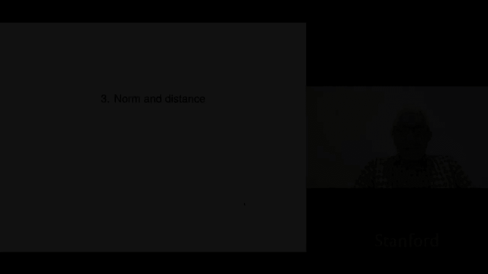
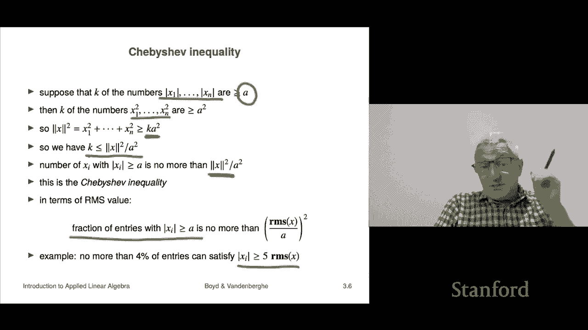

# P9：L3.1- 范数 - ShowMeAI - BV17h411W7bk

Let's look at chapter three， which covers norm and distance。

So first we'll talk about norm， norm is the norm of a vector is supposed to be a measure of its length。

 so we'll talk about that from that we're allowed to talk about distance and that's another topic that we'll cover in this mini lecture。

So the norm of a vector and this is specifically a called a Euclidean norm in this course。

 we're just going to call it the norm because it's the only norm we're going to use。

 there are actually are other norms that are actually widely used but by far the most widely used norm is the one we're going to talk about the Euclidean norm Here's what it is it says there's an n vector X and the norm which is denoted with these two double bars on either side of x。

 I'll say something about that it's supposed to generalize the absolute value for a number so okay and so the notation is meant to look like it。

 So here it is is the square root of the sum of the squares that is the norm of a vector。

And you can write that if you like as the square root of the inner product of x with itself。

 so that's that's the norm of a vector and it's supposed to measure the size of a vector Some people say the length unfortunately the length of a vector is a little ambiguous because it could either be n in this case。

Or it could be the norm So if you say size， however。

 it's probably it probably means the norm Now when n is one， so it's a one vector， which is。

 by the way， the same is just a scalar then the square root of the sum of the squares is nothing but the square root of the square of the entry and that's the absolute value right because when you square something of it negative or positive。

 you get the same number when you take the square root we're taking the positive square root or then non negative square root So it's a generalization of the absolute value to vectors is what that's the basic idea。

 I's supposed to give you the length and let's just do a quick example let's find you know let's find the norm of this vector Well。

 that's going to be the square root of one squared plus zero squared root plus one squared and that's the square root of two which is about one point you know for1 something like that about So that's the length of a vector okay。

Now there' a bunch of properties some of these are simple one is not I'll say a little bit about that later so the first is homogeneity and what this means is the following it says that if I take a vector and I scale all of its entries by beta that means multiply it by the scalar vector multiplication beta the norm of the result is actually the absolute value beta times x times the norm of x and that tells you a lot of stuff already it says for example that the norm of x and the norm of minus x are the same and you could figure that out too because if you replace all the entries Xi with negatives and you square them you're back right where you started so everything says the same so that's the idea this one is actually relatively easy to show because what happens is the sum of the squares each of the squares gets scaled by beta squared but then they all come out of the square root is a beta absolute value。

I should say okay the triangle inequality this one is interesting it's got a beautiful visual visualization that we'll show later。

 but we're not going to go into it now I should also say it's not something that's immediately easy to see or something like that it would take a paragraph or something to develop but it's not hard it just involves completing the square I'm not going to do it here you can read about it in the book or something like that but this is the but it's a so-called triangle inequality it's very interesting it says that the the length of a sum。

Of two vectors is less than the sum of the lengths。 Okay， now I said that in English。

 but it's the same as overloading right， so the first sum was the sum of vectors and the second sum was the sum of two numbers right so that's vector edition right there and that is addition of two non negative numbers。

 So all right， the next one is non negativity。 that that one is extremely obvious because。

When you take the sum of the squares of x， you get a non negative number that's good because you're thinking they' going to take the square root and if it were a negative number。

 it wouldn't be a good thing。 So and then of course。

 the square root for us is defined as the non negative square root So that one's obvious this one's interesting definitelyiniteness this says that if a norm of a vector is 0 the only possible way that can happen is it is zero that I am going to say something about So let's see what that means suppose I told you that the norm of x is0 Well that tells you that the norm of x squared is 0。

But if the norm of x squared is0， that's the same as x1 squared plus。

Plus x n squared that's sum Okay now。If I tell you that a sum of numbers is zero。

 you absolutely cannot conclude that they are all zero here's a nice example of that one and minus1 their' sum is0 they're obviously both not zero okay however。

 if I tell you that a sum of nonnegative numbers is zero。

 then conclude then you can conclude that all of them are zero okay and that's easy to see if the numbers are non- negative and one of them is positive then the whole sum is positive and if you're positive you are not zero so what this says is from this we can conclude that X is equal to zero so that's the picture and the triangle inequality we'll see later how that works but we'll also see a picture of it that gives you know that explains the name okay so these are some very basic properties of the norm so far we haven't done anything with a norm that would be even vaguely of interest。

But we'll get there。Okay， now a very closely related quantity is called the RMS value。

 which stands for root mean square and so let me explain what that is it's another measure of the size of a vector So here the mean square value of a vector is the sum it's the sum of the squares right that would be the norm squared divided by n and you can see what it is it's the square of the entries and then the mean of them across the entries so that's the mean square and that is expressed in terms of a norm as norm squared x that's how you'd say that divided by n so that's the mean square value what's very commonly used is something called the RMS value or root mean square value it's used throughout engineering you know maybe in pure math。

IMaybe somebody would figure out what you're talking about。

 but it is used through absolutely throughout engineering and many， many other fields is RMS value。

Here's what it is。 Well， it's literally what its name says。

 it's the square root of the mean square value。 So here that's the mean square。

 you take the square root and you get it's actually equal to the norm of x divided by square root n。

 So it's nothing more than the norm of x divided by square root n。Okay。

 now the reason you would use this is that it's going to it actually is more intuitive。

So what we'll see is that the RMS value of vector。Gives roughly speaking something like the typical value of the absolute value of Xi。

 I mean it doesn't， but in a certain way it does right so so here's a good example is take the vector of all ones right And I ask you what is the what's the norm of ones well。

 the norm of ones here I'll make a bold one here is actually this square root of n where n is the length and why because you would to get the norm you would take sum of the squares。

 the entries， all the entries are one that gives you n and then you take the square roots。

 So you get square root n So that's fine by the way。

 if I'm comparing norms of vectors always with the same dimension it does the square root n factor doesn't matter right。

But if I show you a vector of ones and I said， you know tell me about that vector。

 one seems like a natural thing to say that's the RMS value And the reason that's a natural thing to say is because all the entries are one and so one is kind of telling you the size of the individual entries right so RMS values is also useful for comparing sizes of vectors of different lengths right that's actually very critical right now we'll see several applications where you do exactly that where you you know you take the RMS value of one size vector and another size vector and now they're sort of comparable this way okay so that's RMS value very widely used you probably have seen it before it's the most natural way to quote let's say to give an idea of the size of a vector okay。

嗯。One property and this is going to come up later in the course。

 but we'll mention it now and that is that you can do the you can calculate the norm block vectors in a very simple way。

 and what it is is this is here here I have three vectors A B and C This is our notation remember that's a stacked vector So I stack a on top of B on top of C。

 and I take the norm squared。 Well， if you think about it。

 how do I take the norm squared of a vector it's just sum of the squares the entries So I would first take sum of the squares of all the entries of a。

 I'd add that to the sum of the squares of all the entries of B add that to all the entries and you get you can see this and you can also see that by just multiplying out the inner product like this and that says and this is a very tricky formula to parse so you have to be super duper on your toes it says that the norm of the block vector here is equal to the following It is。

The square root of the norm squared of a plus the norm squared of B plus the norm squared of C， okay？

Or we can put it in super compact and honestly very confusing notation。 But it does work。

 Okay so what this says is the norm of a stacked vector， ABC。

 And of course I'm showing you stack of three， but it could be a stack of  two stack of 20 doesn't matter right over here what it says is that's the norm of Now these are numbers。

 So a B and C， the norms of those。 those are three numbers。 This is a three vector in here。

 that's a three vector。 And this is the norm of the three vector。

 but the norm of a three vector is the squared to the sum of the squares of the entries。

 and that's exactly what this is。 So so we'll use these ideas that connect norms of stacked things later。

 actually， we'll use it in the form that that the norm squared of a stacked thing is the sum of the norm squares of the entries right So this is really the one that we're going to use later。

 So okay。Now we're going to talk about the Chevychef inequality and it's a famous inequality that says it basically limits the number of entries of a vector that can be bigger than a certain size right and that's and that depends on the norm right so we'll look at how that works and so the story starts this way。

 you say let's take the entries of a vector X1 through xn and let's consider their absolute values。

And suppose I told you that K of them are bigger than equal to sum number A。

 A could be whatever it doesn't 0。6。 It doesn't anything at all。 Okay， All right， well。

 if if k of those absolute values are bigger than a， then K of the numbers， which are the squares。

 are bigger than a squared。 Now， when I add up a bunch of squares and K of them are bigger than a squared。

 then the sum is better has got to be bigger than K a squared， in fact， it would only be K A squared。

 if the other numbers， the other n minus K numbers。Or all zero。 otherwise this is stripped here。

 it's even bigger。Okay。But this is the norm squared of x， and it's bigger than k squared。

 and so what this says is I simply divide by a squared and I get this。

K is less than the norm squared of x divided by a squared Okay。

 and so what that says is basically it says that the number of entries of a vector that exceed in absolute value a number a。

Is no more than the norm squared of x squared norm squared divided by a squared。 That's it。 Okay。

 And that's that's this famous Chey Che inequality。 right， That's that' that's that's what it says。

And it's actually maybe clearer in terms of RMS value。

 and this is the way certainly normal people think of it in terms of the RMS value。

 it's this you divide appropriately by squared and in the right place and everything and here's what you get。

It says if I have a vector x， it says that the fraction of the entries。

With absolute value x bigger than a is no more than are as of x divided by a squared。

So that's it and so let's look at some special cases， I could take a equals the RMS value squared。

And it said it says absolutely nothing， it says the fraction of entries of a vector。

Where the absolute value is bigger than equal to the RMS value is bigger than equal to one so okay fine okay however。

 it gets interesting when a is bigger than RMS of x right so for example you could take five RMS something like that you know five times RMS of a and then it says it says it's very it's very specific it says that no more than one then this is now one fifthth no more than one fifth squared so 125th so no more than4% of the entries of a vector can be bigger than five times the RMS value。

Okay， so that's， that's what it says。 And by the way， this is kind of the idea of。

Justifying the idea that the RMS value of a vector is like the typical value of the entries the entries can be bigger than the typical value。

 but they're actually rather limited right that you if the number that can be more than five times that number is less than4% of your total vector so that's kind of the that's the idea we'll see we'll see applications of this a bit later。

