# P28：【Final Project 前10名】 - ShowMeAI - BV1iL411t7jE

everyone so thanks thanks a lot for，making the time to attend the festival。

here in project party today i'm i'm the，rta for，for the course you know in the spring。

with joshua and survey and，a bunch of other you know people uh was，very fun to。

you know um being involved like with，with you guys and，kind of uh take a look at the final。

product of this project so，so today we're just gonna walk over some，of the top one that uh。

the the ti is directed to to be，you know the top ten percent or the，solution，called。

artificial manga panel data set by，ashram sunny，so as he got like two part field of。

stations i was gonna。

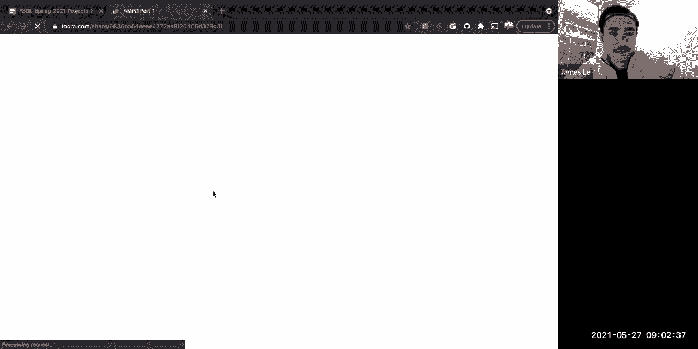

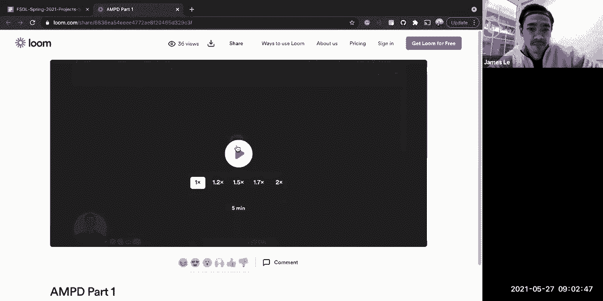

set up your audio sorry，you might need to set up your audio it's。

a little bit it sounds like it's kind of，coming through your computer speakers。

okay sergey do you remember how to do it，we can't hear your sound um there's a，way to。

set up zoom screen sharing so that it uh，plays the sound from your computer。

still not working i'm not sure how to do，it，maybe it's in your screen sharing，options or something。

folks feel free to chime in if you know，okay so，i think there should be a share sound，option uh。

in the share options just，we can cut this part out in the video we。

thanks everyone for showing up also。

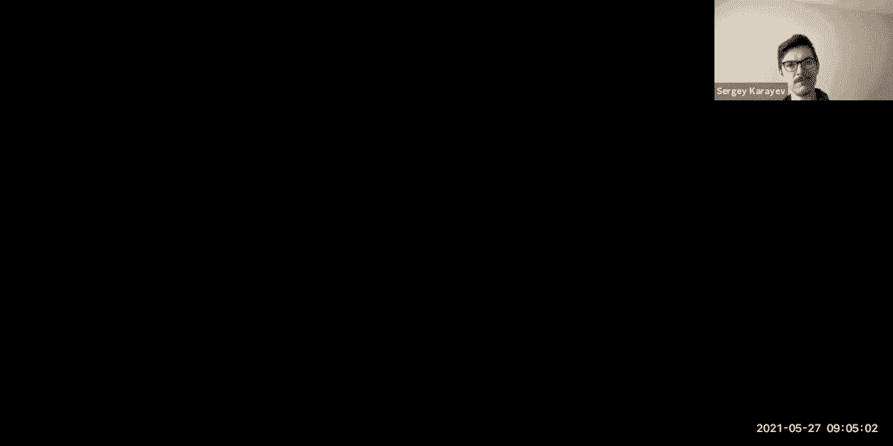

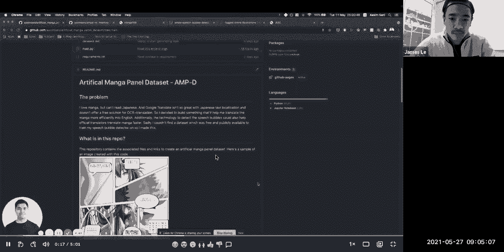

with manga as well that is i can't read，japanese，so i do plan to learn at some point in，my life。

um what is it better can you guys say no。

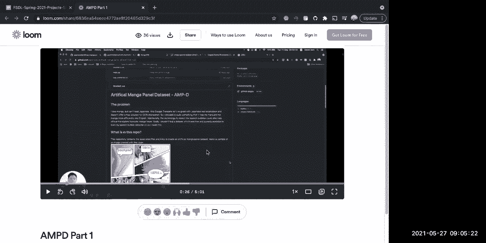

yeah it's working now okay，final four-step deep learning project。

the artificial manga panel data center，the way i decided to start working on，spoiler adversity。

that it's about a passion i have and，that's why i love manga，and a problem i have with manga as well。

that is i can't read japanese，so i do plan to learn at some point in，my life。

um what i found while looking for，solutions to get this translated was，first and foremost that。

google translate kind of sucks at，localizing japanese，texts and they don't really offer a free。

ocr translation solution which i could，hack together and，say put hundreds and hundreds of pages。

which is kind of what i consume in a，week or so，um into the solution and get decent。

translations back，of course translating japanese to，english in。

using machine translation is hard but in，the least i'd be able to get something，sensible。

so uh i decided to start building some，machine learning，uh tech like an object detection system。

that will detect speech bubbles and then，something that would let me detect lines，and so on。

for detecting japanese text，the issues i faced there was the fact，that there's no free。

and publicly available data set to train，my，my models so i decided to make this，here。

is some is a sample of what my，uh data generator data set，generator can create and it in my。

opinion looks，quite realistic um minor the speech，bubbles to。

a certain extent and the way it works is，that，first i was able to collect。

a variety of raw materials to create，this，196 different fonts with 80 character，coverage for。

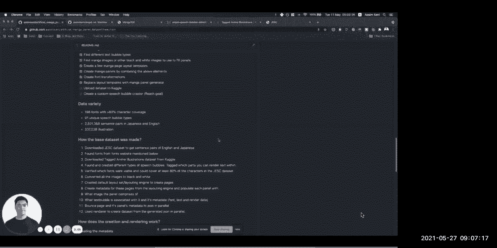

my uh japanese to english japanese，english sentence pair data set。

which i only use japanese part of thank，you for stanford for having this for，free the japanese。

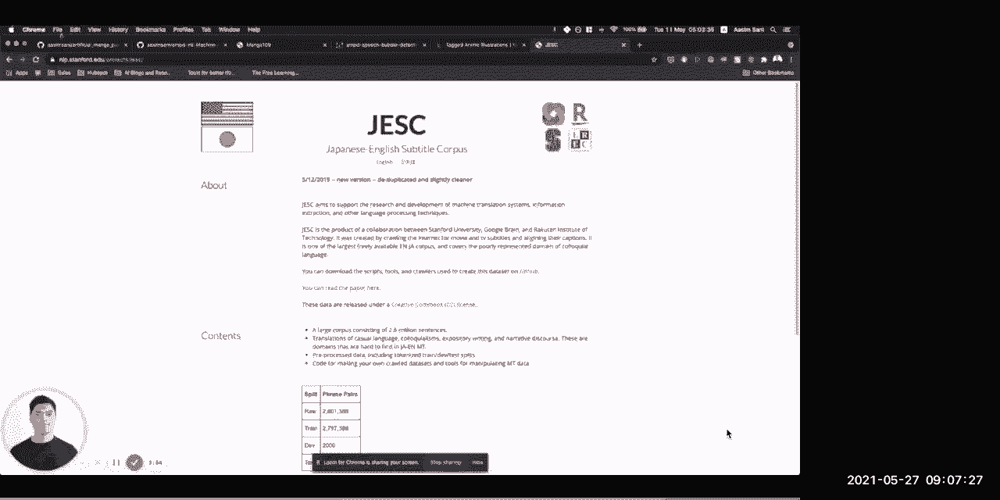

english subtitle corpus and then。

3 30 300 000 sorry，illustrations from kaggle which is。

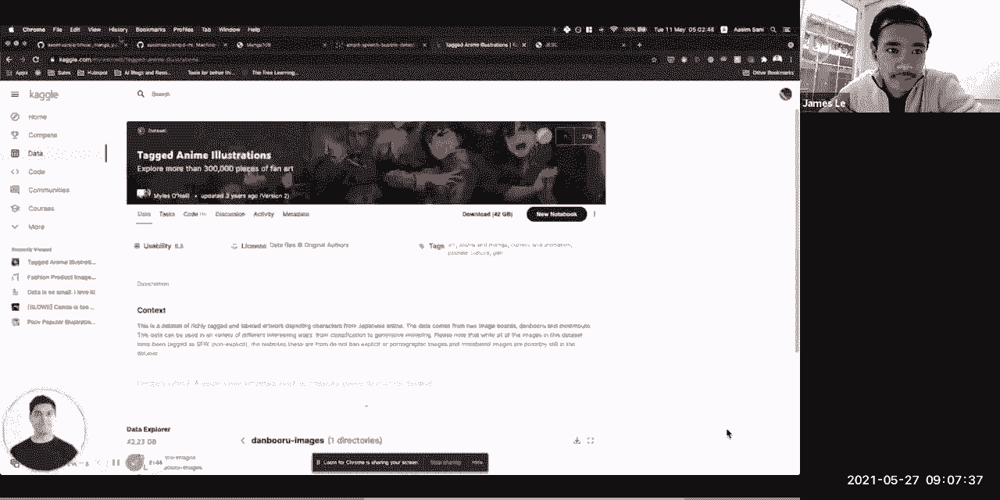

another data set which i used，and then 91 different speech bubbles，which i。

made manually i downloaded all these，materials，i put them together and i，a。

layout for this the way the layouting，engine works，then it，successfully creates children objects。

inside it in a tree like fashion，to render a sensible panel like this，has。

three top level children which have then，been divided one，uh one by one into various different。

types of，sub children so let's take the middle，panel so this had one top this was on。

top level child it's chosen，it was divided into two children，unequally。

and this unequalness is decided randomly，as generation goes on，um and then each panel is has a。

illustration randomly cropped and，inserted inside it from，300 000 images and is speech bubble from。

zero to，zero to two speed bubbles around it，associated with it and rendered around，it，all of。

this of these objects and i bounce this，into a json file which is，then utilized to render it。

as a image in parallel，later on besides this what i，ended up being able to do because this。

took a lot of time，um is create a，very very quick faster rcnn，baseline for object detection on this。

and i'll show you，the results in a second but before we，show you。

is the fact that the generation that，happens with this，is quite fast so let's say if you want。

to generate，thousand pounds，it takes a few seconds to，get running after loading files and i。

think loom is slowing it down，but you can just go ahead write this and，once it's loaded the files。

it takes a few seconds to generate the，metadata for it and about a minute or so，to generate this。

i'm not sure if it's going to work on，this，and i'm going to try and。

carry over into our next video to show。

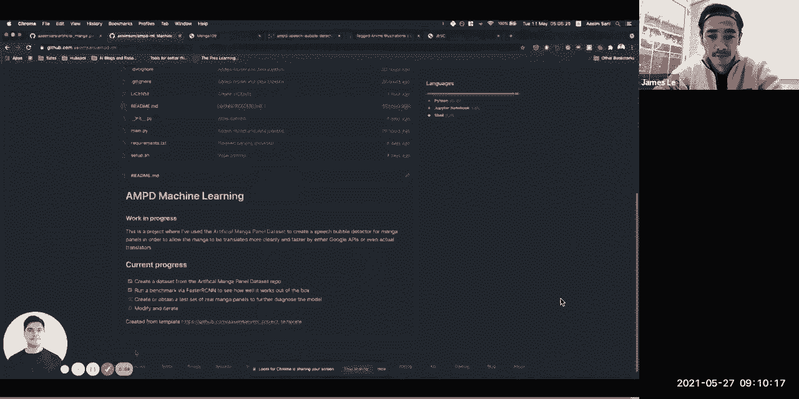

you guys the results of。

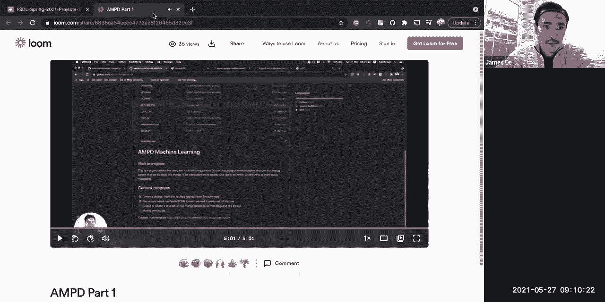

part one let's just look at the stream。

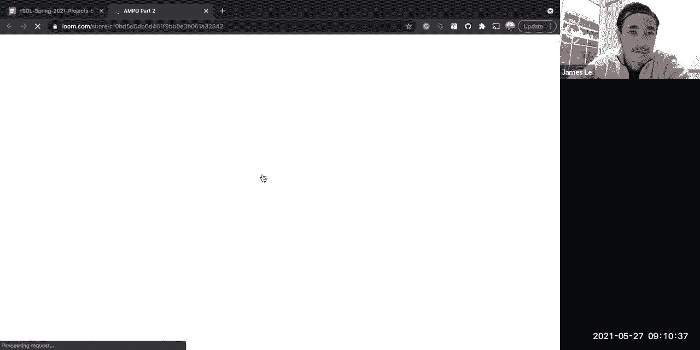

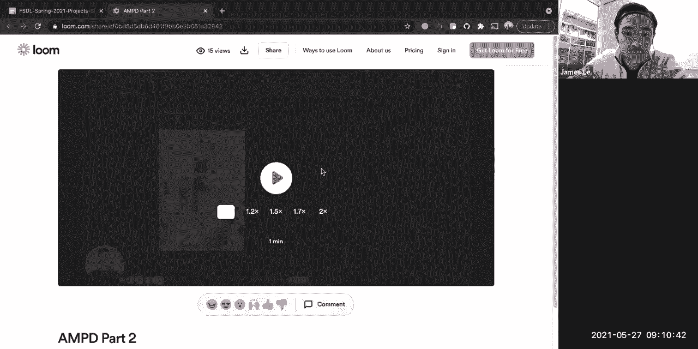

very quickly continuing where we left，off um，this is the bulk free version of me。

performing a rendering of 1000，1000 pieces of metadata for the panels i。

think it's going to be slow because i'm，recording right now on my macbook，minute。

on my macbook right now，in the meanwhile what i can show you，guys is the results of。

my manga page scanning uh，scanning and figuring out the speech。

bubbles form which was trained on this，artificial data set，so i downloaded this manga of the。

internet and what i basically found was，that in many cases it kind of gets。

confused but it's not like it's not，learning the representation of speech，bubbles。

um as you can see in the images here，it's，finding them out and but it's also。

getting confused with things like，faces and it definitely does not have，enough coverage。

uh for me to call it something that，works so here it is very problematic，project。

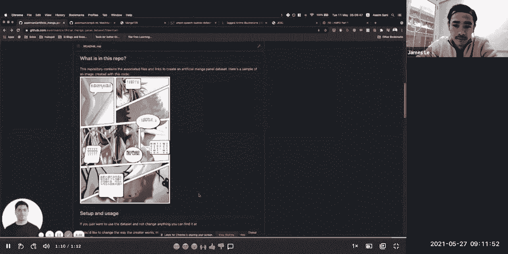

thank you so much for listening and i，hope you have a good day，sure that。

people can can hear that everything's，okay，yeah everything sounded great great，project。

uh team and uh the author is actually。

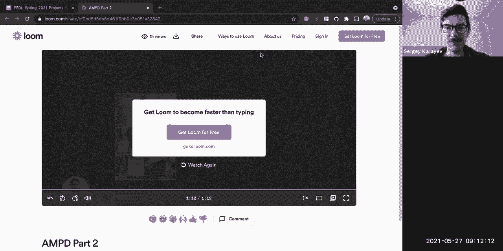

so yeah fun are you going to keep，working on it or um，you think this is it for now i'm taking。

a break from it because it took a lot of，time，i'm trying to get a handle of the manga。

109 data set and use，that as something that can be augmented，to my data pipeline and hopefully。

that'll actually，produce very good results，cancer，a breast cancer meditation system by，hannah harris。

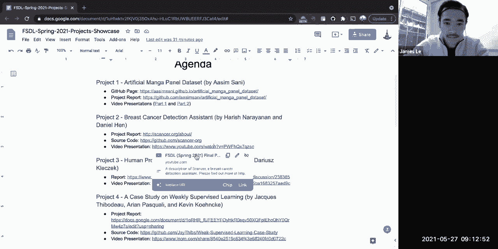

and donald hand so。

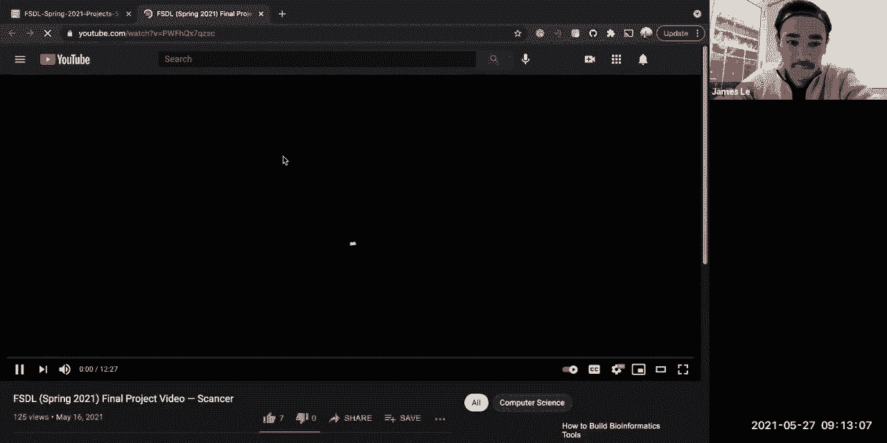

wonderful full stack deep learning。

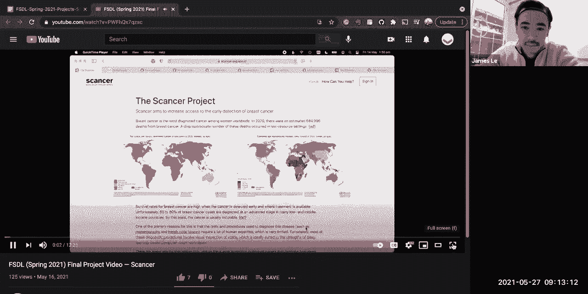

people my name is harish and today i'm，going to be talking to you about the。

project that i worked on for this class，with another student，called daniel hen the project we worked。

on is，called scancer which is a breast cancer，detection assistant。

now breast cancer claims very many lives，each year，but it turns out that if you can detect。

the disease early enough，your chances of survival go up quite a，bit now。

if you look carefully at the different，kinds of tests and procedures。

used to diagnose a disease things like，mammograms and biopsies and so on it，turns out that。

a lot of these different procedures，involve um，quite a bit of human expertise and this。

human expertise is not likely to，equitably distribute in the world okay，but also it turns out。

that the actual act that's happening is，a human expert is，visually inspecting some sort of scan so。

be it a，mammogram or be an mri or whatever it is，the end result is usually like a person。

staring at something，and trying to diagnose what's going on，it turns out。

that deep learning based computer vision，exact，problem so in the last few years there。

have been numerous papers out there from，various groups，that try to show off how deep learning。

can help with different aspects of this，problem，now it turns out there is no central。

place you can go to，to for instance fetch the the best model，for let's say an。

further this is not available in a form，that you can grab it easily。

and even further it's not available in，the form that can be used by an end。

expert for instance a radiologist，so that is what these cancer project is，trying to do。

so our goal is to have a sort of，collection of deep learning models。

that cover these different aspects of um，breast cancer detection so uh we happen，centric。

system so we imagine this this this to，be a store of models，in um written by touch and then model。

store happens to be in dot surf all of，this is wrapped up in an api。

it also happens to be dart served and，finally this whole thing is served up in。

a sort of an end user-facing application，so for instance the pathologist could，log in。

and do something useful so that's the，goal of this cancer project okay。

so what i've described is a fairly，open-ended and long-term goal so let's，see what we have。

working today to sort of narrow our，focus we decided to focus on just one，thing which is the。

analysis of lymph node biopsy scans，and what does this mean so uh one of the，many things you can do。

to to decide whether a person has cancer，or not is to take a sample of tissue，node。

and then stain it in some way like，performs treat it in some way and then。

look at it under microscope to see，and，that would be end up with something like。

this you have like a what is called a，scan of a slide，and you have an expert that looks at it。

and marks certain regions as，potentially problematic in terms of，having metastatic growth okay。

so this is the problem we chose to focus，on and um，the the one of many reasons we focus on。

is that they exist good data and this，happens to be from a grand challenge，called the chameleon。

17 and 16 grand challenges uh the，the problem with this data set though is。

that each image is ridiculously large，like i don't know，hundred thousands of pixels across and。

further the actual file size is very，large so each each file is，many many gigabytes large so even。

opening one of these and，and acting on it is quite a difficult，problem。

so what we actually ended up doing is to，work with a simpler data set。

which is uh called the patch community，data set that takes this。

large file chops it up into very many，small pieces each of 96 by 96 pixels，across。

and it's essentially a binary，classification problem at this point so，each patch you。

we have a data set that says is this，talk，from my collaborator daniel hen he goes，into some detail。

about how we use this data to actually，train a essentially a train a binary，classification problem。

and i'm going to assume that we have，such a model okay，so once we have such a model and we're。

going to call it the pcam classification，model，and it happens to look this way so it's。

like a classic convolutional internet，model，what we do is we tend to store it in our。

model store so before we store it in the，model store，we have to make it into a certain。

specific format it's called a model，archive file，which contains the weights of the model。

and it contains，um this thing called a handler，which is essentially what pre-processing。

and post-processing has to happen，before so when this model is using，production okay。

so when all this stuff is said and done，you can take this model file a model，archive file。

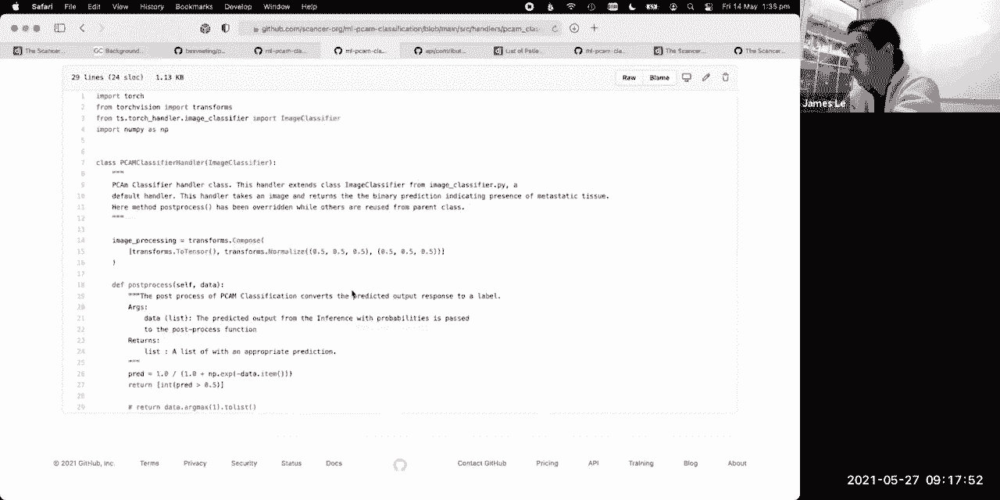

called um an mar file and push it，to a model store and so in this。

demonstration i'm going to show you that，the model is already in the model store。

and we're going to look at it so here's，a listing of all all the models at the。

moment in our in our cancer model store，and we have，just one model which is the pecan。

classification model yeah，you can look at some details about it，you can for instance look at。

for instance you can see that the model，is uploaded a certain date it has two。

workers that are serving it up the，workers will start at this time whether。

the workers use the gpu and stuff yeah，so we have some sense that this model。

has been archived in a suitable format，and then sent up into the web and notice。

i'm doing everything live，with a sort of model store server，sitting in the cloud somewhere um。

with ssl and so on okay now once this，thing is sitting，in the in the cloud and we can then。

access it via an api so here，i'm going to show you two test files。

so we have two test files one of them，zero being the class without cancer。

and one being the class with cancer and，you can send this file across the wire。

to our api another endpoint in the web，again van ssl and stuff so i send it to，speak m0。

comes back with zero the center will，become one，it comes back with one so we have。

something that's pretty good we have，this model that can，uh do essentially binary classification。

on a tiny patch of。

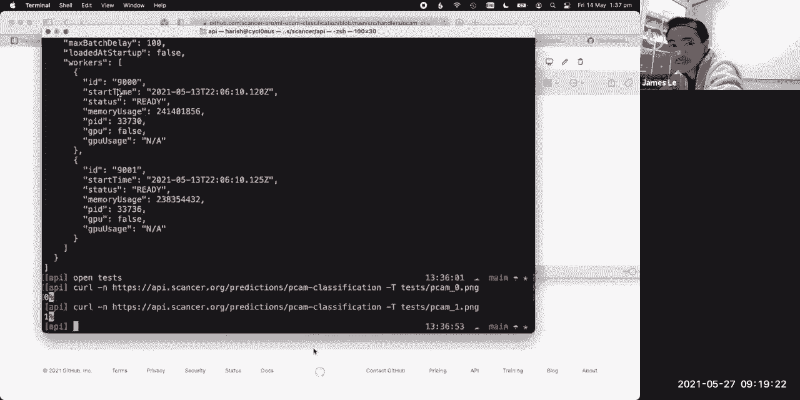

this um of this data set okay，so this is great for working in the，shell。

but what we have is a django application，that sits on top of all this。

that you can do essentially the same，things we did in the in the shell。

so this application you see here is a，combination of things that actually work。

plus things that are more demonstrative，for trying to gather。

user feedback from particular particular，stakeholders we'll get to that in a bit。

so coming back to where we were in the，last in the shell we can do things like。

the exact same thing the app can tell，you for instance that the。

the model is being stored the model is，being served with these，different parameters and stuff and。

further you can actually test it out in，the application itself，so i've given you some sample files i。

can even choose a file from，my uh the same files from my hard drive，and send them across the wire。

and this one is supposed to have a，cancellation it says yes the measure，float has metastatic tissue。

you can do that you can do the same with，the other file the model is still，working。

but it'll tell you the opposite okay so，good so we have our，model we have it archived we have it in。

our model store we have it served up in，our api and we also have it sort of，wrapped。

by the by the django application now the，actual problem we're trying to solve。

isn't these tiny patches but instead，we're trying to solve this。

overall um overall um image that we're，trying to，figure out whether it's cancellous or。

not right so here we can have some，example slides，that i've uploaded for just。

demonstration purposes and i'm going to，go into one of them so this is how a，slide looks。

as i was saying earlier each of these，slides are gigabytes large so the way，you even see this。

um showing up on the screen is through，like a google map style interface where。

as i'm double clicking，and trying to zoom in and moving to，different regions and so on the system。

is sending，numerous smaller images across the，network so you can see in my network tab。

you can see a crazy number of images，coming across the wire as i click into。

different sections and stuff，yeah so it's our expectation that a，human expert。

would come into this system potentially，look at this and then。

make some sort of diagnosis right but to，help them along，we have tried to use those patches。

and much like in our class where，like in the text recognizer problem we。

took this model and so we sort of，strided it across，the the sentences in the paragraphs。

we've done the same thing over here we，take the model and then we sort of，stride it across this。

this larger tissue sample unfortunately，this thing because it's。

a large image takes a very long time so，we've kind of done this offline。

and generate a heat map and you can，download this heat map，and then it's going to be on my hard。

drive somewhere，so notice that is is ridiculously large，so i'm not going to open it so prior to。

this demonstration i i downloaded the，file and sort of resampled it down to，like i don't know。

10 to 20 the original size so i can，please open it，and not have a crash computer while the。

video is being recorded so if you look，regions，are being highlighted as potentially。

problematic and i'm going to zoom in a，little bit more and you can start to see，the original squares。

that go with our classifier and in this，case i sort of undid the binary。

classification nest and i sort of，um just took the the sigmoid output。

which goes from zero to one so you can，see a nicer color set，than just zeros and ones so if you come。

back here to this，to this slide you will realize，that it is it is pointing out something。

interesting that the，distribution of cells here and the，different。

and potentially this is problematic so，it is our goal that，um it is a hope anyway that when the。

scans come into our system they can be，batch offline，sort of figured out and they can be。

classified as maybe potentially，problematic or not，so when the um expert the pathologist，logs in。

they could potentially just say show me，all the high response and they can just。

focus their attention on，that so if they had a limited amount of。

time in their day they can focus on just，the bits that are important to them okay。

so that covers the overall story so far，and uh where we're going with this in。

the future is that in order to get，more input from actual experts we're。

building this out with a proper landing，page and so on to try to gather interest。

from pathologists in particular，to see um what they have to say about。

their like whether it helps them with，their workflow whether they're way off。

whether we're actually being useful，and depending on their feedback we will。

try to tune whatever we're doing in，terms of deep learning，um for um for their needs okay i'm going。

to go back to this demonstration a，little bit to show you something。

um something else that we are trying。

that is not fully working but it might，be exciting just to show off。

so notice that when i told you earlier。

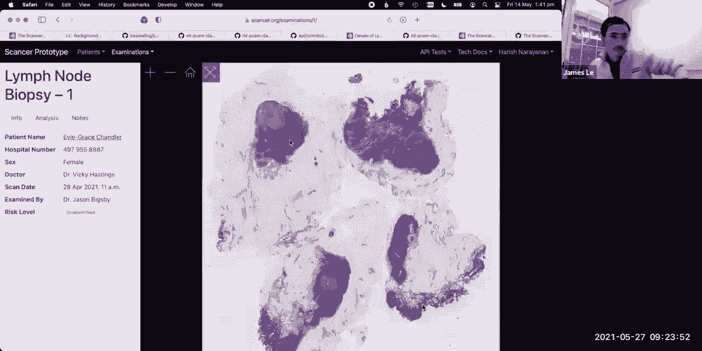

um，it is it is sort of like as i go into，different sections it's generating，images so why not。

uh as a generating image why not try to，um，classify the image on the fly that's。

what i'm going to do is i'm going to，switch to a branch of the。

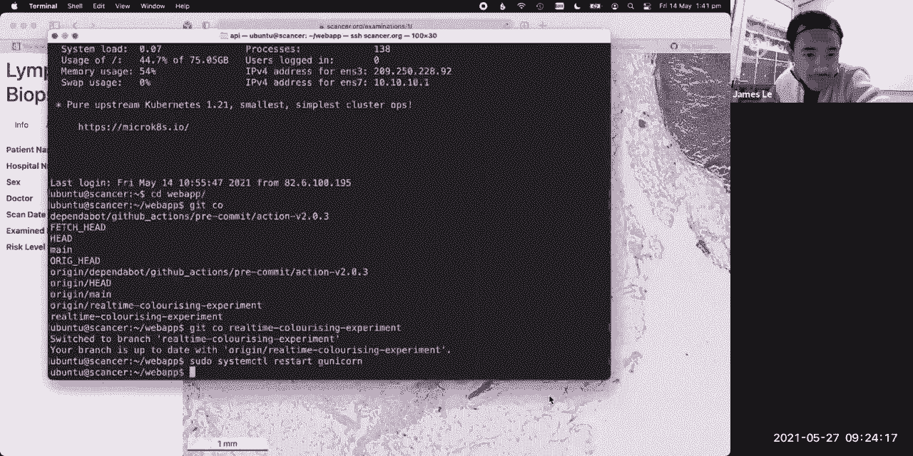

and restart the system where now it's，going to try to do the same thing。

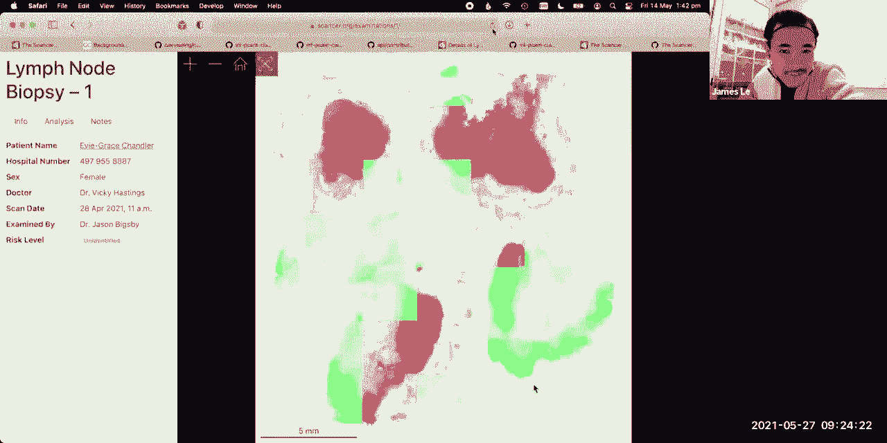

but when i reload this graphic notice，what it's trying to do。

is as it's loading the different patches，it is passing it through the，classification system。

and trying to do it in real time again，as you zoom into the area you'll realize。

it's doing the same thing，it's going to mark out that this area is。

potentially problematic and areas around，it are quite green，but again this takes a little bit of。

time so this is part of our work in，progress，so coming back we're trying to。

demonstrate this to domain experts，to see whether they like this or not and，uh if i've。

zipped by anything uh do not be afraid，the everything that we've done here is。

open sourced and available on github，and we've split this up handy into。

different repositories for the api for，the web app itself，for one example model that goes into our。

model store as well as a bunch of，handy-dandy configuration scripts so if，you're interested in。

anything like how do we set up dot serve，how to start subtop。

django how do we wrap everything up in a，certain way with regards to ssl，termination。

all this stuff everything is carefully，okay，so um i'm very excited and i'm very。

grateful for this class to give me the，motivation to get started on this，project because。

um i'm super i just want to see where，this goes in the future，i'm also super excited to see what you。

guys have done for your projects。

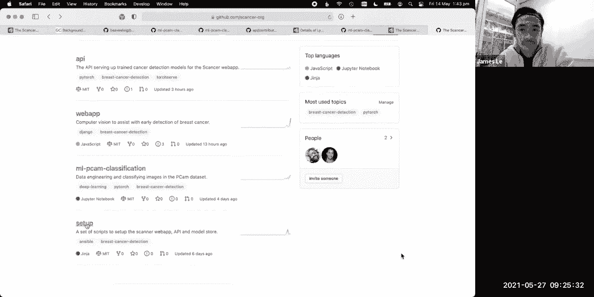

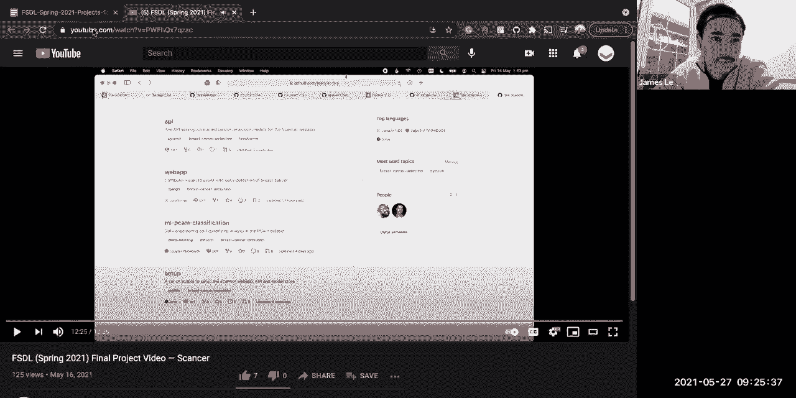

yeah um and like like you said it's like，as a landing page for this which you can。

go and take a look you can see that art，yeah i think uh irish is on the zoom as，well so。

really nice job thank you very，impressive，and so you guys both day jobs while。

working on this is that right，and，uh how long i took my i took some time。

off my day job to focus on this and it，was um，same here like we actually managed to。

take some day offs we had to take some，day off in order to accomplish this，yes and do you um。

i guess are you planning to pursue this，full-time or anything because this is，like。

i'm very impressed i'm contemplating it，i'm contemplating it it depends on，whether i can。

um we're trying to position it as，something where experts could，interest。

that's if if there's clear interest then，i'm going to try to raise money and so，on yes。

cool yeah and are you looking for，contributors，is there like a contribution guide or。

like a list of open issues or anything，because i i think，a lot of people on the call are probably。

like inspired to contribute in some way，uh you're all welcome there is i don't。

think you've taken the time to write one，but the the plan is simply this the plan。

is like it's it's a it's essentially a，moral zoo，of um models that are relevant to this。

particular problem so anybody who's，willing to，take state-of-the-art papers and help。

help us implement them，would be extreme it would be extremely，helpful for the project yes。

nice and then adam raised his hand，did you have a question yeah i had a，couple of them。

uh the first one was how did you，uh i think this is where the domain，experts would become important。

but how did you decide where，to draw the line between um，you know alerting someone to this and。

not because i，i think that's that's pretty important，it may not be。

uh like uh an up or down question like，on a logistic regression。

it may be that there's a range of things，that you need to，inform the clinician of like this needs。

observation or this needs a biopsy，or this needs to be hacked off with a。

chainsaw right now or the person is，going to die in the next 20 minutes。

i don't have a strong answer because we，don't honestly know but。

uh the whole point of this is to have，multiple experts plugged into the system。

and for every expert they get to do what，they do normally，the the deep learning computer vision。

bits are just，assistance to guide you along this，process so they don't really。

make the final decision for you um，and it's it is geared towards relative。

grading so if we have multiple scans，coming in it tells you some of them are。

more higher priority than others it，doesn't necessarily tell you that that's。

good and that's bad or whatever so i，think in in the interest of time。

let's just keep on going with other，projects but yeah，i think a lot of people are interested，discuss。

offline um，but yeah awesome work thank you thank，you all，darus kleczek he's tackling cargo。

competition on。

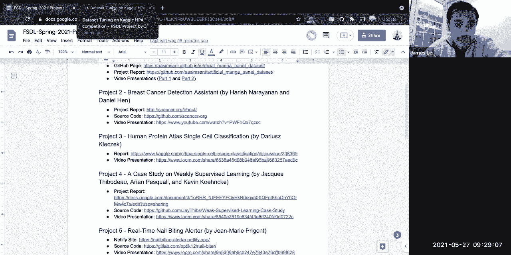

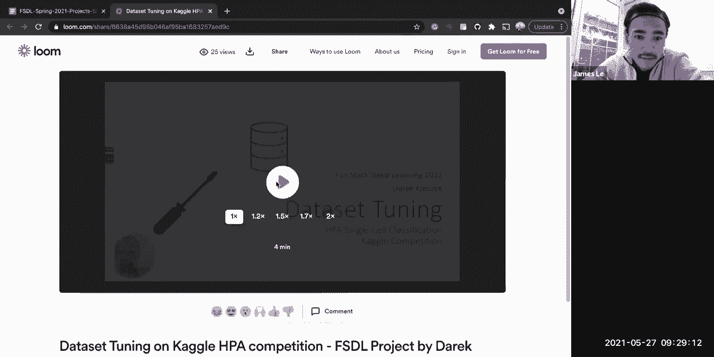

classification，hi my name is darek kweczek and i would，like to talk about my final project。

which was about data set tuning applied，to a recent kaggle competition for。

single cell classification，my project was inspired by a recent talk。

by andrew eng that talked about the，importance of data，and data centric approaches to improve。

model performance，and i wanted to apply this approach and，this mindset，to a cargo competition that。

the goal of that competition was to，classify single human cells，and the problem was was difficult。

because we did not have single cell，labels，we only had labels for images that，contained。

a bunch of the cells so we had so this，was defined as a weekly supervised。

the final result was very satisfying to，me we got，gold medal our team scored our team。

finished at number six，out of more than 700 teams which which，i'm super proud of。

and i actually applied a bunch of，data centric approaches to this。

challenge some of them work very well，one example is splitting the data。

into into training and validation sets，or cross validation sets in a way that。

avoids leakage across sets and to do，that，i applied techniques from topic modeling。

which is typically applied to text，and we go for we start with with text，embeddings。

we apply dimensionality reduction with，um we cluster，text with db scan and that produces a。

set of topics which are which are which，are close to each other。

and i applied this to images i treated，clusters of images as groups and i，divided。

our data set in a way that each group is，always in the same fault。

and that helped us to avoid leakage，there were some，other data centric interventions such as。

pseudo labels trying to identify and fix，for me，in this challenge and i think the。

problem was that myself i was not an，expert able to，to properly label cells better than a。

model could so，these，approaches that i wanted to to use in，this in this challenge。

um however we also found that model is，important，especially in this in this competition，which was。

um which was very specific，due to the the weekly labels we found，that。

developing model-centric approaches that，build on the understanding of how。

convolutional neural networks work，allowed us to improve score，use，um was to use the the，that。

to the to the masks of of single cells，and using that to predict。

uh single cell classes we call that gap，mask approach，another another approach was to also to。

to transform images of single cells in a，way that they would be consistent with。

the whole images and then use an image，level model，centric，interventions actually helped us。

significantly to improve the score in，this competition，we also found that the data and model。

are still not enough，we found that engineering proper，engineering is super important even on，kaggle。

inference speed is critical we needed to，make a lot，of interventions and to to accelerate。

inference of our model so that they，could fit within within the limit。

imposed by kaggle having clear code，allowed us to better collaborate。

across the team it was super critical to，ensure，reproducibility of experiments and。

and final set of learnings is about，diversity having a diverse team uh，worked better than。

with a homogeneous team ultimately we，worked with a team from i think four。

continents we had people in north，america，south america europe and asia。

and we also found that when we combine，diverse models coming from。

from these different different groups，our performance improved，so my learnings um i definitely still。

believe in the data centric approach i，don't want to challenge and you hang on，that。

however i think it works best for tasks，that are well established。

such as classification or regression and，in situations where you have access to。

experts that can determine correct，labels，tasks，such as here with with weekly labels in。

situations where there is limited，availability，of expert labelers model architecture。

can play a big role and for us，it it helps us significantly improve the，model performance。

and ultimately um having diverse team，having diverse approaches helps a lot to，improve performance。

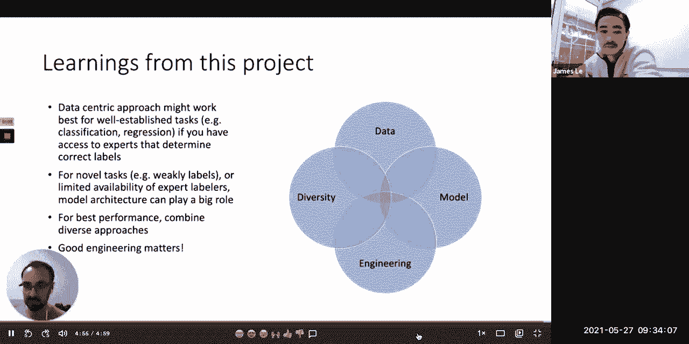

yeah yes some of these learnings are，definitely relevant，for what our class is about。

very cool yeah i don't know if you see，he's in on zoom but，nice work sixth place yeah sixth place。

is really solid。

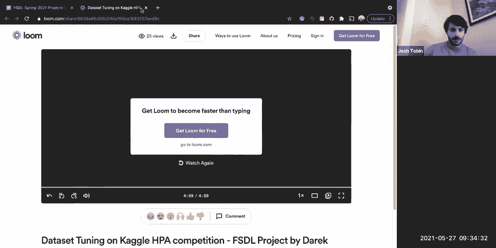

very very good out of 760 teams，yeah it's amazing even i think that was，raised that collaborate with。

so um the four projects um is a，it's a case study on weekly supervised，learning by the trio of。

jacques tibordo ariane pascali and kevin，quinck sorry restart your name。

yeah it's a hard one no worries。

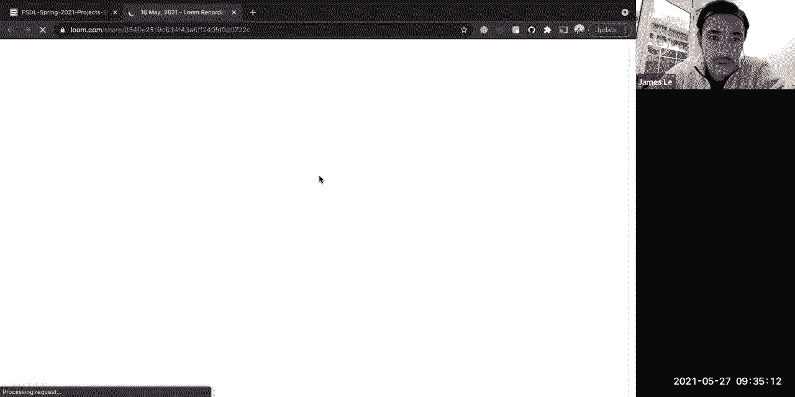

i guess technical centric approach right，um。

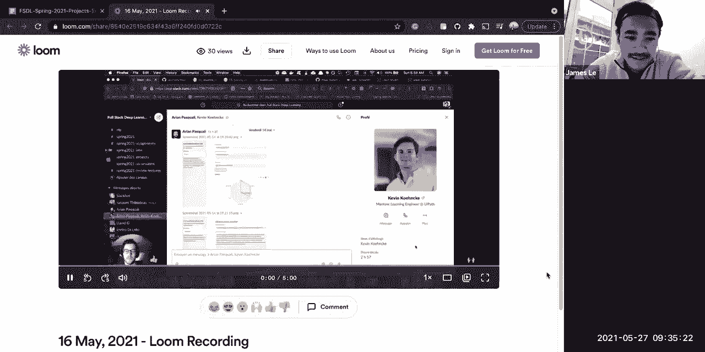

hi my name is jacques i'm a data，scientist at the canada energy regulator。

for the federal government in canada and，this is a project video for our team。

the other people with me are kevin who，is a machine learning engineer at uipath，and。

this beautiful specimen over here aryan，who is an nlp researcher at。

citizenlab so what is our project about，so what we set out to do is to take in，text data。

any type of text data and the goal was，to create，a labeled data set out of it and so。

the end goal was that we would have a，user，go on to our web app and then they would，input their data。

and then put in all of the labels that，they're interested in，and do a little bit of more like。

information give a little bit more，information about the the labels。

and then our model would basically，output，a labeled data set for them so we're，kind of。

trying to do something similar to，snorkel flow，and so we will end up using snorkel for，our project。

and another approach that we used is，zero shot learning，so with those two approaches with weak。

supervision，the，data，it's a multi-class classification model，uh problem。

and it has text data and you try to，predict like whether it's an，actor an athlete a written work etc。

so we trained a baseline model on that，data set and then we try to um like we。

train that baseline model，and on like all of the labels and then，what we did was。

we pretended we didn't have the labels，so that we would，create a data set with snorkel and then。

train uh，on that uh data set that we created with，snorkel，and then the other approach was using。

zero shot learning，which uses a teacher-student approach，to create the labels and then have a。

like student model to train on those，new labels so with with those two，baseline。

obviously we can't like reach the，baseline because like，like the baseline has like 500 000。

examples um，so it's it's already doing well but like，the goal was to like。

with no label data how close can we get，the，the engineering work but like what did，we end up um。

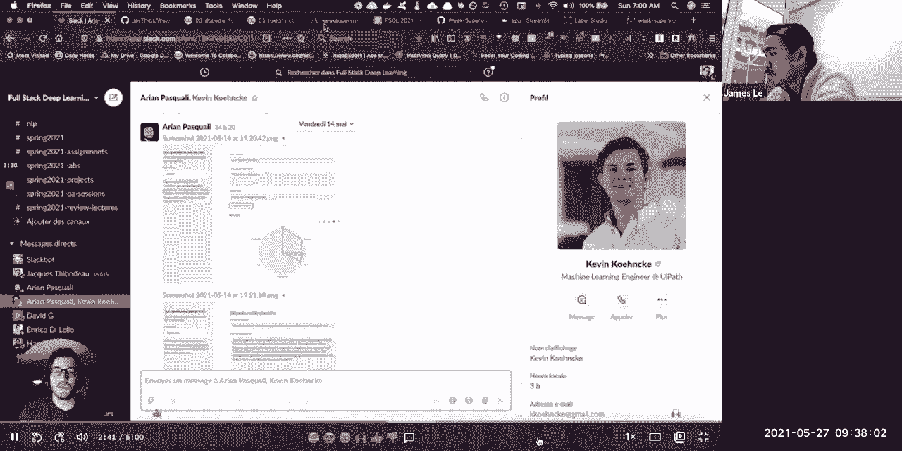

with，is a web app that we created，and this web app uh pretty much。

um you give it a piece of data and then，we have like our deployed models that we，um，data，uh。

we'll get a response back you can see，here，artist is the most likely category for，this piece of text。

and we have a json file here and，yeah we have this is for the dbpedia。

data set and then we also did it for，another data set called the toxicity，data set，so。

um like what was the point of this right，well the idea is like，the next step would be uh like a user。

can input like a massive documents，of text and then we'll be able to end up。

with a label data set at the end。

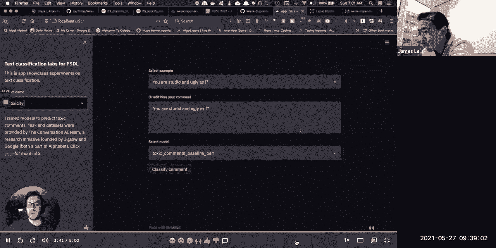

and so what we actually did was we，integrated，uh this streamlit app，to label studio and so，a。

like a bunch of pdf documents or other，types of text data，and then end up having a label studio。

of their data set like they'll be，integrated，and then they can fix any like。

mislabeled data within that，data set and we actually worked on，trying to figure out like how to do。

active learning with this and we were，able to figure out with a like logistic。

regression model but we，didn't end up having time to implement，our deep learning models as well。

but that would be a next step and so the，idea is to，use the deep learning models and then，snorkel。

to try to like have this like active，learning approach，where um we would use all of this uh。

data to like build up a data set train a，model，and then like feed it back into like。

snorkel or zero shot，and then like make the data set better，and get better and better accuracy over。

time。

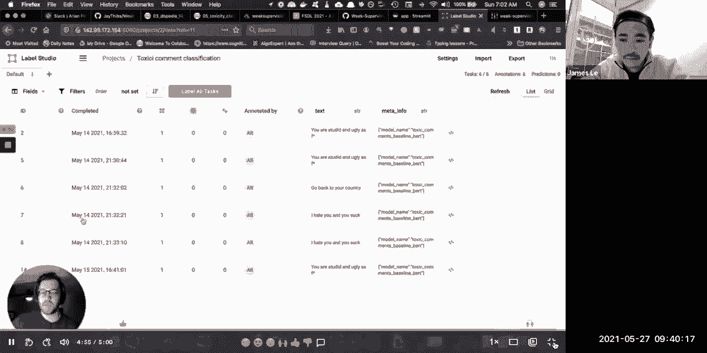

so um that is all the time that i have，for the video，please check out our report if you're。

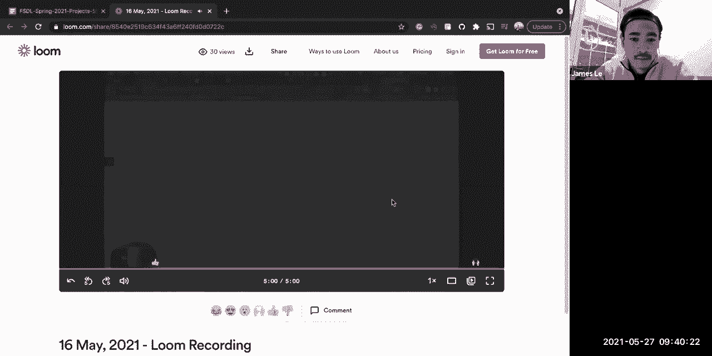

interested，nice five minutes exactly um。

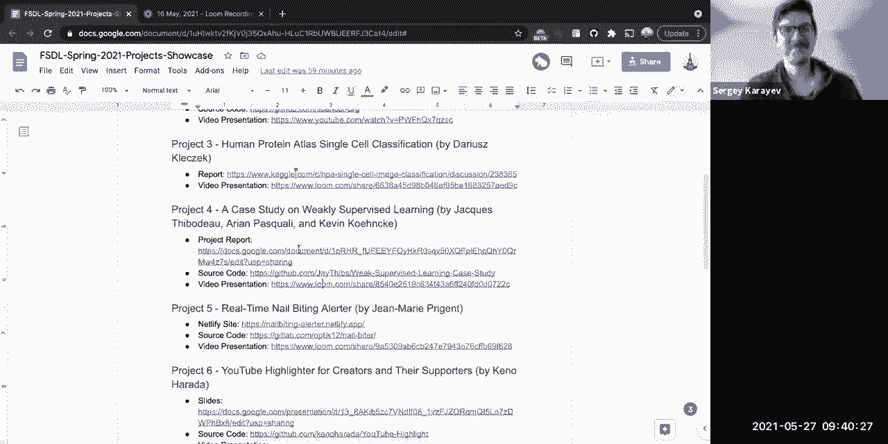

i mean i also just want to show a little，bit the report that i put it。

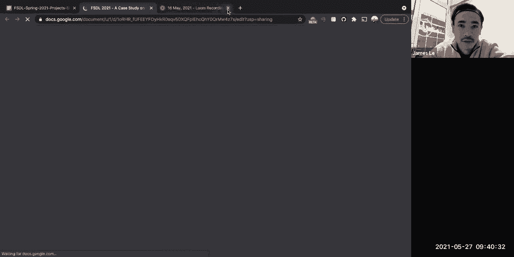

it's like an extremely detailed um，document um then in the meantime um。

the author if you guys want to say，anything about your experiment on this，project。

biggest challenge because learning is，um，i'm not sure about the others but um i。

think like the next steps is probably to，figure out how we can make it for any，type of data set and。

which which is something that we spend a，lot of time doing but we weren't able to。

finish all of those steps and then uh，hopefully get something where like we're，not going to like。

do a snorkel flow competitor but we，might do like a，like a local thing where you can kind of。

just like deploy，a docker version and then do it locally，and，um yeah if you don't want to pay for。

snorkel flow you can kind of use，some some tool that will create i guess。

okay so um let's move on to the next one，um january，break-in um so。

i mean i just watched videos i think，this is。

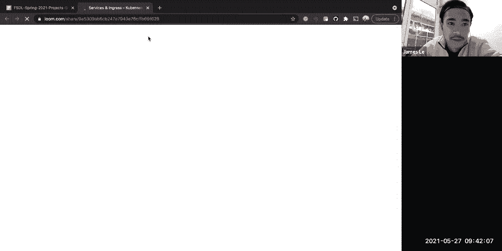

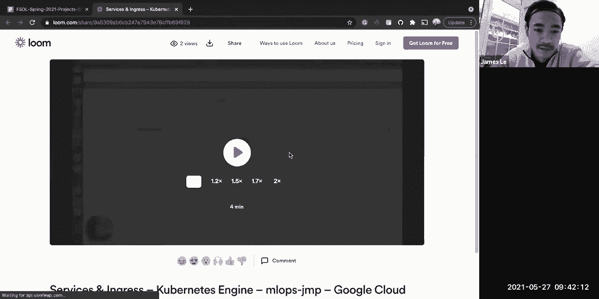

let's go real time new binding alerter。

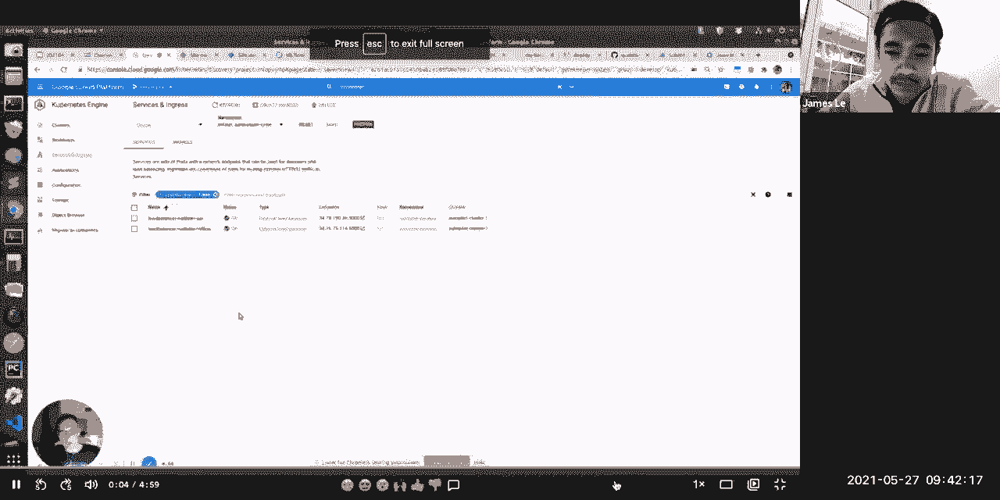

hi my name is amari and i will make a，quick presentation about about the，project。

so first of all in june touring i use，net i use a pie chart，for all the all the code。

i made a detail with me with all，information，i use gitlab which is for the ci cd。

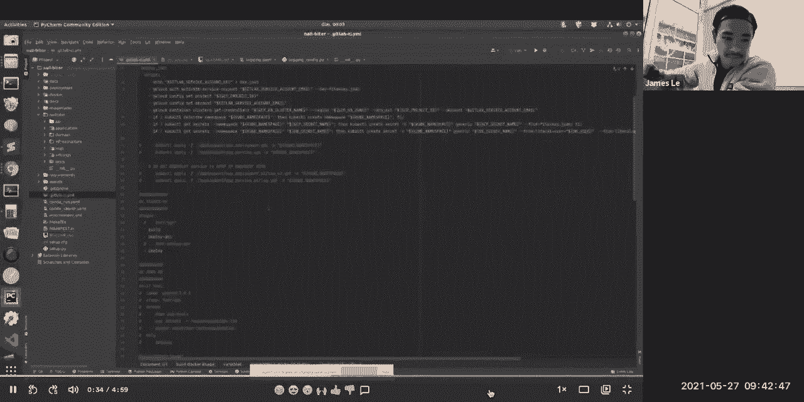

i deploy a mail flow server，flask rustic server there is also，a two load balancer，[Music]。

the gmail flow server is available，they are the data augmentation which are，locked too。

it's accuracy confusion confusion，matrix rock curve the login front and，side board。

tf that cares on the p-function model，from ml flow to be served directly if we，want。

i use the model registry so each，each model could be logged as a specific，stage。

for live production serving，which only a friend point，ml server url it's a，some tree for triggering。

okay，something，okay it's okay，and i use some tree for the logging，some some stage literally is full。

we sold the stage or two stage。

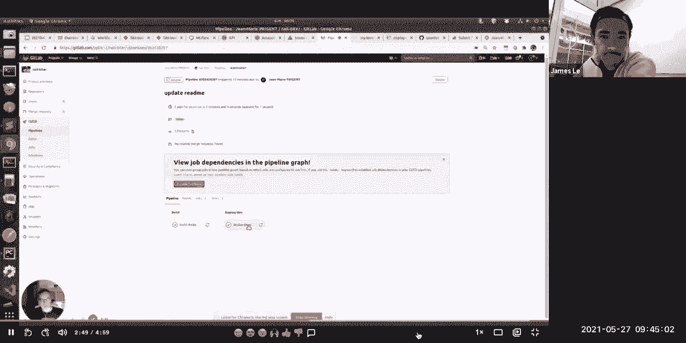

it's a deployment stage including。

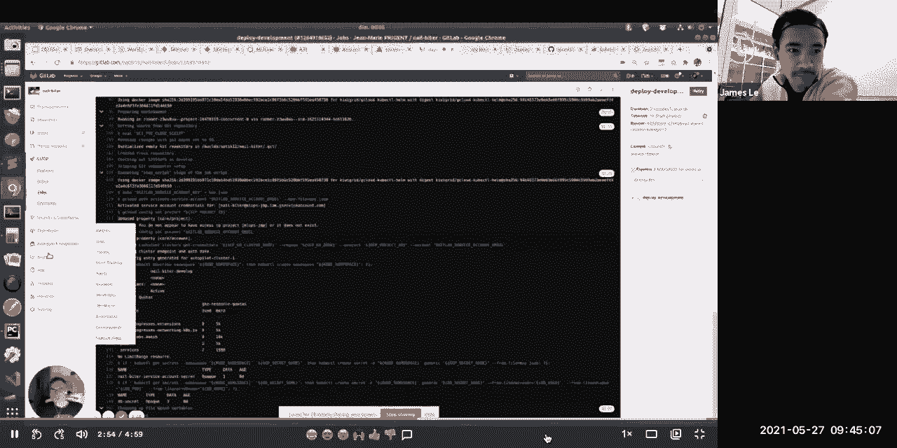

there is two more two seats that are。

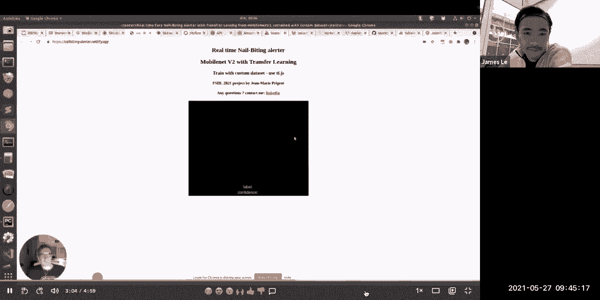

deployed it's an lb detector，in tensorflow。js。

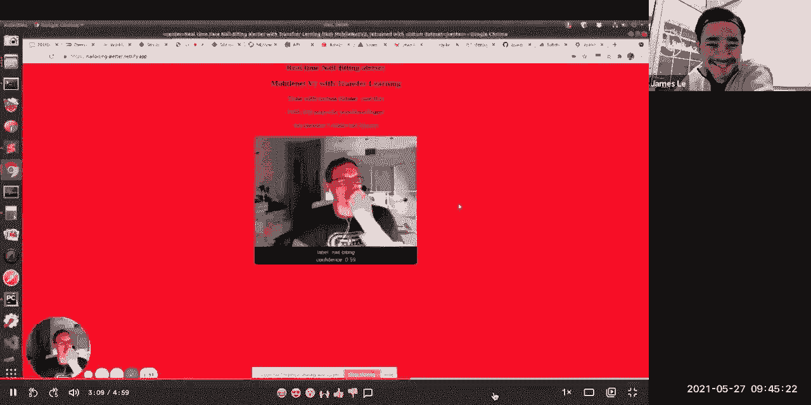

okay there is a。

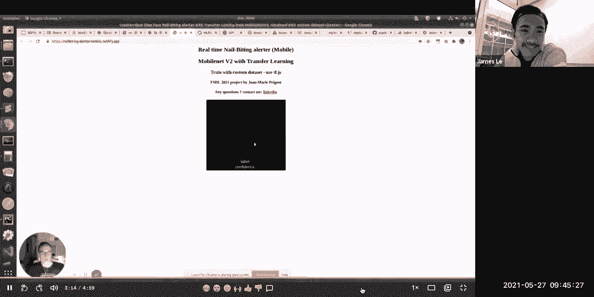

lighter version for mobile with the，canvas smaller。

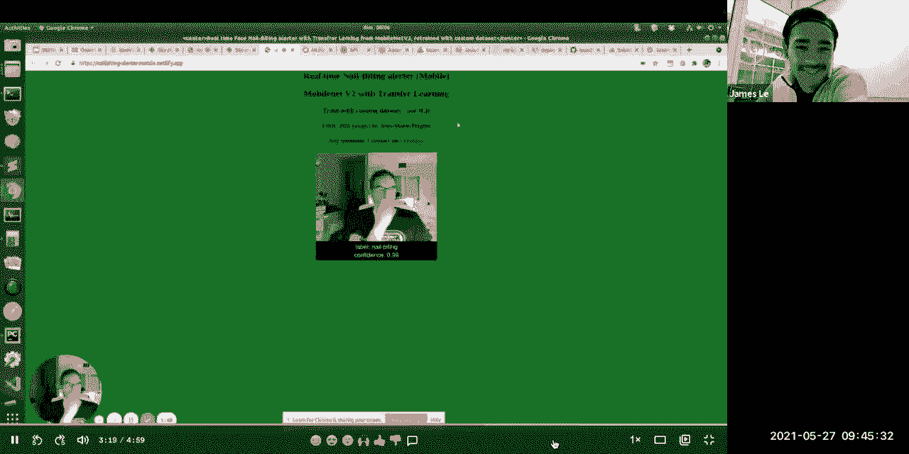

okay i use，weight and bias for the logging，okay，[Music]，so there is a disclaimer which must be。

read because，it's a privacy by design project but，many urls are open。

and it's i think it's simpler for，reviewer，like this okay，conversion for the google coral dev bar。

which is explained，on the post training uh consultation，[Music]，okay there are some video in the。

description，i think that's a good overview of the，there is an uh vs 1。2，[Music]，i didn't remember。

i don't remember where is it。

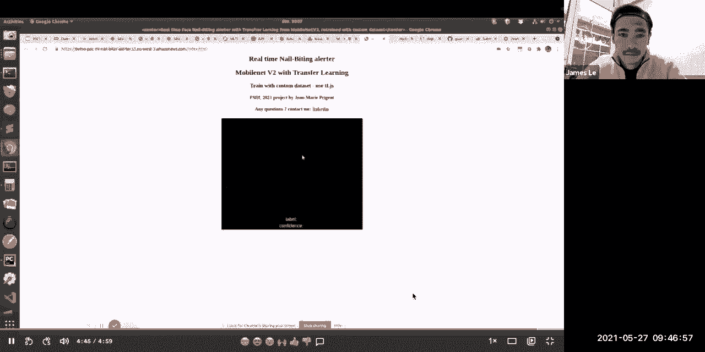

okay it's a static seat。

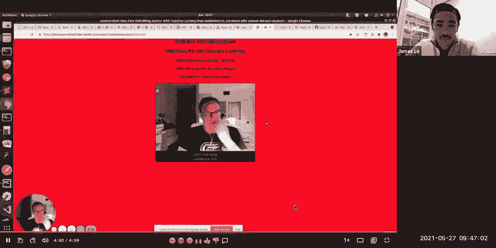

s3 okay and。

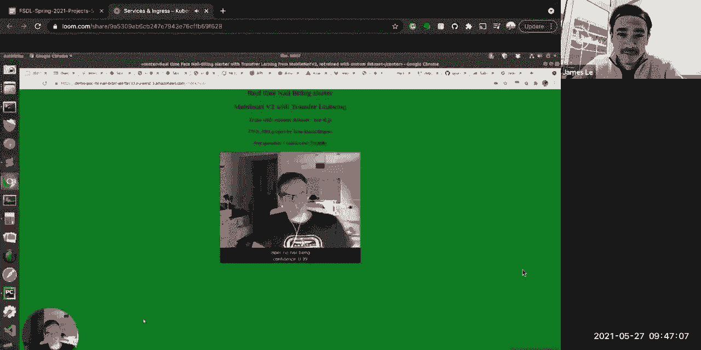

it's work too and we are honestly，that's all for now thanks so much fsdl。

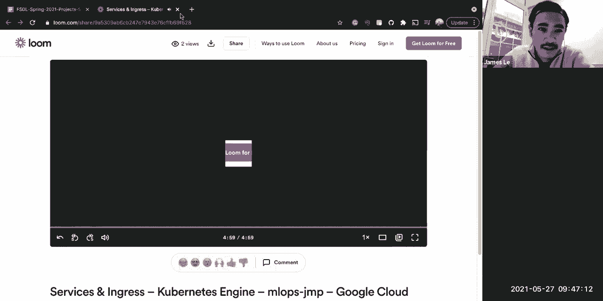

yeah and i mean you can try out like，yeah uh and any comments。

quick question how do i join your slack，did someone post the link in the，comments please。

i didn't understand the question，oh no oh this question is just like yeah，just sharing your。

experience working on this project what，it was it was very fun to do this it's a。

specific use case only for me because，i mean usually uh i made a lot of。

different projects in the past years，but this time i i decided to do one for，me。

because it's a problem i have since i'm，very young，since i'm 10 years old and it。

probably will help and then i will，continue the project，in the next month um this morning i。

received the lead，for the for the colder because，i i want to have a real-time working，device so。

so i will probably post the link but i，didn't share on slack，uh yet because um there are a lot of。

a lot of links that was public and，i want to be sure that that there is not，a。

mis issue with the link because it's，possible to，delete the model uh with some airflow，for example。

but i will share it there's no problem，on this，yeah absolutely thanks for sharing that，experiment。

so the next project is by，kino harada he basically created a，youtube highlighters for creators and。

their supporters。

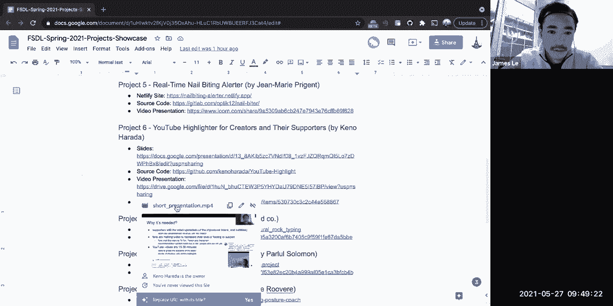

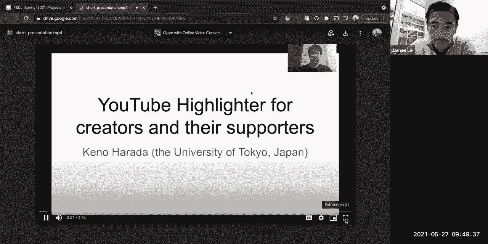

hello my name is keno harada i'm a first，year，phd student at the university of tokyo，japan。

my theme of the full stack deep learning，final project，is youtube highlighter for creators and。

their supporters，what i developed is input youtube url，and comments on the video then output。

highlights，highlight clips of the video and if，there are several characters。

in that video output individuals，highlight clips，so why is this system needed let me。

let me explain the background these days，many people post videos on youtube and，some of them。

attract odious audiences and make money，by putting，advertisements on their videos。

these kind of creators are called，youtuber，one of the interesting phenomena is that。

some supporters of youtuber，edit videos such as cutting the，impressive scenes of the video or adding。

readable subtitles then upload the，processed short video，the partnership with the creator and。

share the advertisement revenue with the，creator，for creators once they approach once。

they upload a video，not only genuine income of original，video but also。

edited videos by their fans make money，in japan youtuber hiroy who is not the。

number one creator of japan，but he partnership with many supporters。

and within the month his videos had been，viewed，his，strategy so the needs of selecting。

impressive scenes，are increasing second fans are making，videos to represent their feelings，talk。

twitter or instagram in order to make a，good video，they are manually picking the scene if a。

good tool for them is developed，there are chances to promote this，activity。

third for viewers in order not to waste，time，they want to grasp the contents of the，video。

more easily they want to enjoy videos as，much as they can，the ideal system is here input video。

then create highlight video but，there are many challenges to achieve，this so。

as a first first step toward this，i developed practical one here is a。

system i proposed receive comments，including timestamp that say like this，moment is impressive。

then extract the themes based on the，timestamp，using fm ffmpeg software。

in order to deal with picking an，individual's highlight，face detection and recognition functions。

are called，frame by frame in order to locate and，easily deal with the new video。

i made a few tricks in face recognition，in my system，reading frames then pick detected。

detected faces and，if the score is below some threshold，register the face as a new quick，object's。

first detected as a face if the object，is not present，in 10 consecutive frames exclude the。

objects from the recognized result，for more details please visit publicly。

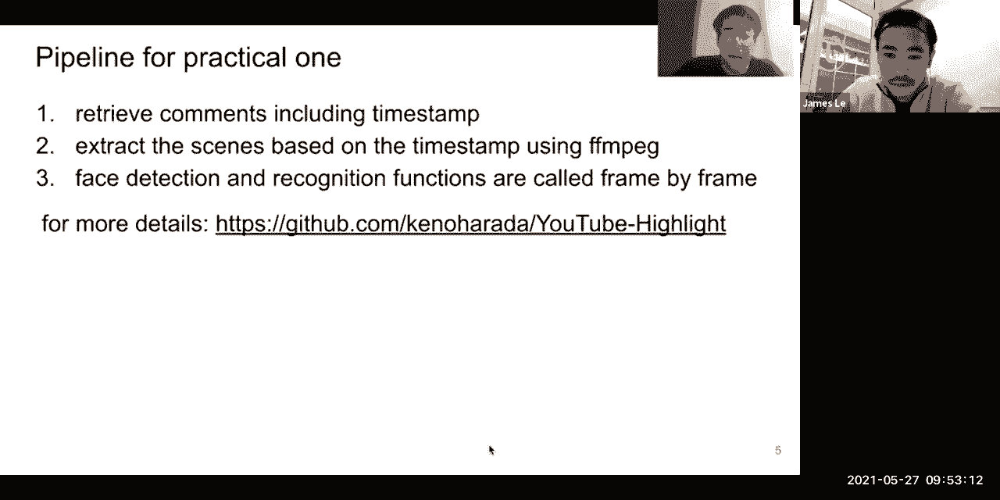

available my git，github here is the example output，the input video is 21 minutes long after。

processing，the highlight clips are two minutes long。

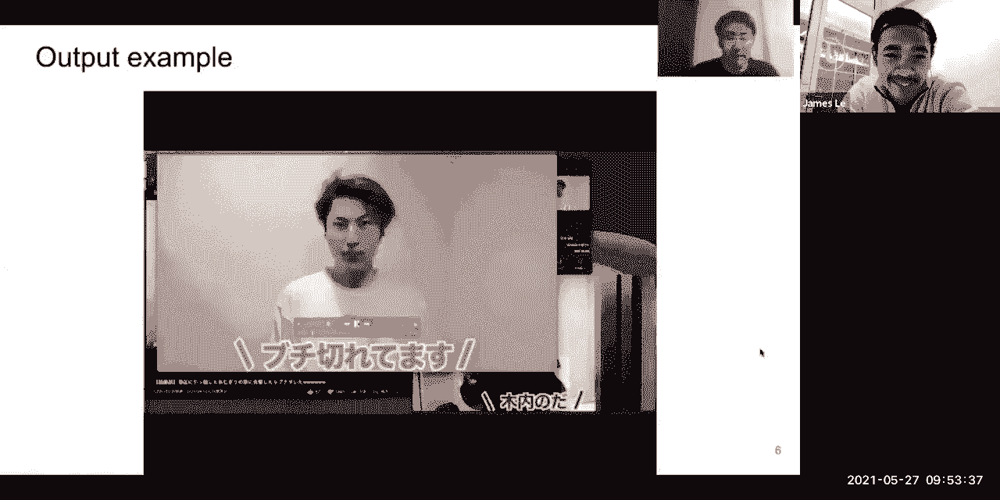

lastly limitations and future directions，the proposed method does not work with。

videos without comments，but collecting timestamps and flex，corresponding clips。

this data will be used for the model to，detect impress，impressive thing it is difficult to，scene。

a highlight thing or an impressive thing，because which，is an emotional one but the data-driven。

approach can describe，discover the feature describing an，impressive scene。

and for creators the function to resize，video to the appropriate，format for each sns is necessary to。

attract，audience for example for tick tock。

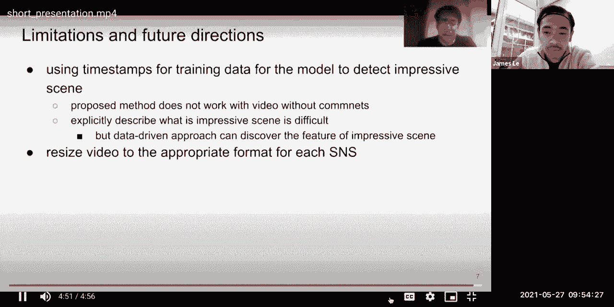

the video should be portrait size and be，shorter than one minute。

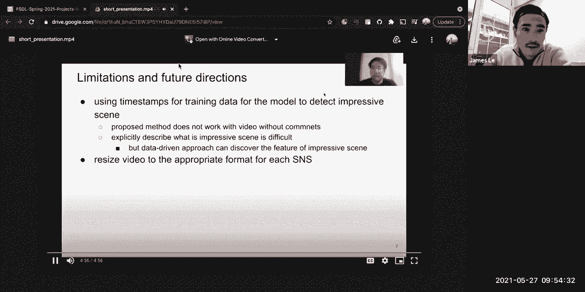

thank you for listening yeah awesome，he actually wrote a blog post in，japanese。

um yeah talk about his experience，um very cool so item is free that's he。

um okay let's uh take a look at the next，one，neural rock by lucas mosser and。

you got some other collaborators outside。

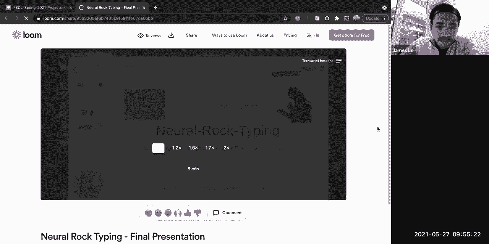

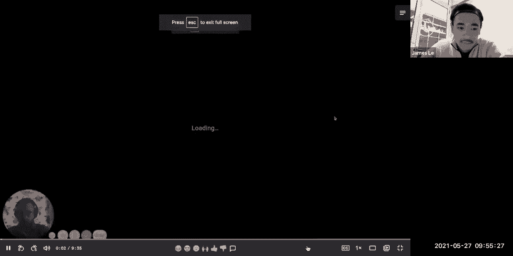

hi everyone this is lucas from the，neural rock typing，project where we try to understand what。

machines see，in rocks this is the final project，presentation and the。

work was done together with george gohn，and dr gregor bechler，so just a quick recap on the problem。

setting that we set out to achieve，during this project，our goal was to use tools from model。

interpretability，and convolutional neural networks to，understand whether neural networks。

can actually identify different types of，rocks，and what and how they actually do this。

in practice and to understand what these，models see in the images，this is quite important because。

geologists try to classify these，different images and understand their。

textual and structural properties and，this can have a great impact in，applications。

such as in the energy industry in carbon，capture or for geothermal。

technologies one of the challenges is，that this is extremely。

time consuming and you need experts like，george and gregor，to to classify these images and to。

understand，their properties often this is also not，unbiased and it can be difficult to be。

consistent within，these data sets so we want to be able to，use these。

tools from machine learning to be able，to be more consistent but also to。

understand what these models are，actually using to identify these images。

and to learn something about that，so our hypothesis here is that we can，use tools from。

model interpretability together with，convolutional neural networks to。

understand some of the features that，these，models are interpreting and whether。

these features actually resemble，similar things to what a geologist might。

consider when he looks at these，types of images and there's specifically。

we've used a technique called，gradient assistant class activation maps，or grad cam。

to be able to identify these the，features that these，networks are looking at so our goals。

were to train models to identify these，different，rock types and we were looking at。

so-called carbonate specifically，we wanted to build a simple application。

that was using these machine learning，based models，and to investigate these the the。

behavior of these models，and finally we wanted to make that data，and the application。

um and share share that with with the，wider community，that's out there so here i'm going to go。

to a quick，demo you can find all of this on github，and on，on docker as well so if i switch over。

here to，uh the application that we've built this，is a dashboard type。

application you can see here one of，these thin sections of these rocks。

one of the neat features is that we have，a，the possibility to zoom into these。

images and everything updates very，nicely，and in colors you can see one of these。

neural networks that is working in the，background，to classify this image and also。

which is providing these class，activation maps which in this case for，example is highlighting。

where this network has used these，about，the specific type of rock that it's。

seeing of course we can select here，different types of of networks which，will automatically update。

and uh and of course this，will react in a second it's computing，live now on the。

on the back end of this application the，updated class activation map and we can，then。

see the the impact of choosing different，types of models，to perform this task and so this type of。

application is extremely useful now for，geologists or geoscientists to，investigate how these models。

classify these images and also what，their，what these networks consider as。

important features in these，in these data sets on the background we，have a。

api that gets called which is based on，fast api，there's a really nice way to to create。

automatically all the documentation，and to execute all the all the requests，that are being made。

to the api through the through the，viewer that i just showed you。

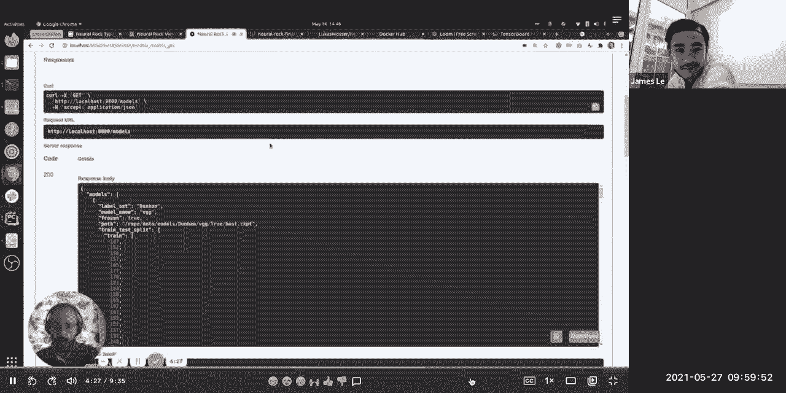

the models themselves are being computed，live and，and and the class activation maps are。

being computed live，these were trained using pi torch，lightning，and we've monitored for each of the。

models，the validation scores specifically the，f1 score，and so we have a nice dashboard that's。

provided through weights and biases，to compare the performance of these。

different methods as well，so this is all documented in our github，repo。

there's a there's a readme there，where you can find more information and，everything。

concerning how we actually train the，models and how you can get access to。

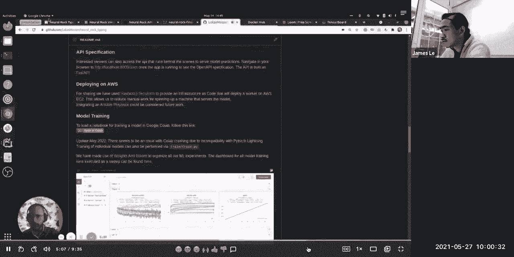

so one of the challenges of course was，that the data set，that we used was extremely small we only。

had 80 to 90 images but the images are，very large，they have thousands of pixels in size，and the the。

labeling actually took um an expert like，uh krakow and george to qc and to，provide。

a good label set for for being able to，train these models，and at the end we've in total we trained。

a vgt11 and resonant 18，with various combinations of the，different label sets that we had。

sometimes freezing the feature extractor，or unfreezing it so doing transfer。

learning or doing fine tuning，and as you can see here as an example。

there's a lot of detail and complexity，in these images，which of course is not necessarily a，model。

to try and identify these different，features especially given that we have，such a small。

data set to work with the application，itself，can be separated into two parts the。

model training phase，is where we use pytorch lightning to do，all the model training。

uh which was run on google collab and，we've monitored everything。

with the weights and biases dashboard，that i showed you，in terms of the model deployment we use。

the pyth lightning，models on the api side which gets called，through。

an api that's provided through a fast，api，and the viewer uses holoviews and a，provide。

these interactive dashboards and the，image viewing capabilities，all of this is wrapped into a docker。

container which gets，pulled up through docker compose so it's，very easy to。

set up locally on your machine or to，deploy on a cloud infrastructure。

and one of the interesting things that，we've already found out while using this。

is that actually the choice of using，different types of models，can have a significant impact on the。

visual representations that you see，so here for example you see the same，image with the resnet。

and then if we switch to with the vgg 11，model you can see that。

these models actually do have quite some，differences in what they，actually consider which is an。

interesting thing that we learned，just through using this application，already。

some of the challenges we had was that，we of course had limited compute。

not just for the training which was done，through collab，but also on the deployment because we're。

using these gradient，activated class activation maps this，requires actually computing gradients。

and it would，be beneficial to have gpus on the，server infrastructure that's being used，for the api。

uh the dashboarding libraries such as，panels are not always intuitive and。

their behavior can be a bit random，if you're not familiar with them which，was challenging at first。

and what we also learned is that the，choice of cloud infrastructure when we，try to deploy this on。

amazon aws for example it can lead to，some，different behavior than what you。

experience locally and so，possibly networking issues or the amount。

of cpu power that you have available，really has an impact there but we do。

want to continue working on this，and make the data and the models easily，accessible。

independent of the application and we，want to do a scientific，through this。

this app improving a bit on the，reactiveness if we're going on to a，cloud。

system and of course the api could be，extended to support，things like classifying your own images。

that you might have，so i do want to acknowledge uh gregor，in providing the data set if you if you。

find this useful，set，that he created during his phd at the，university of miami。

and with that i would like to thank the，organizers of，full stack deep learning sergey，course。

and it's been a pleasure to work on this，project so please give it a shot。

on your own everything is provided on，github and also，on docker if you have any questions or。

issues with it，feel free to send me a message on slack。

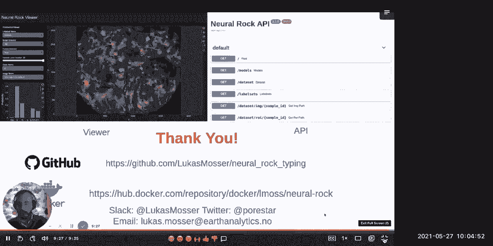

twitter or by email，excellent i like the，docker link that's like religious，yep thanks oh look yes。

do you want to say anything ready to，explain maybe，no it's been it's been super great to。

work on this project，we，we saw in the course so yeah if you want，to get in touch。

we're continuing working on the project，we just pushed an update，basically yesterday so。

we're going to continue working on this，in the future and just let us know if。

you want to get involved，for the time check i think the next，couple of projects，be fine，[Music]。

um and then the project 10 is a 20，minute video，i'm not sure we're gonna be able to get。

to it but let's just get through，seven eight nine and 11 and then so yeah。

11 is actually not a project because，this is like a，i put it in when it doesn't provide a。

video it's actually a report on it，so yeah we can click around it yeah，definitely，stop。

at um in uh in 24 minutes，okay so we'll just see through how much，we can get。

sure so this one by uh paulo solomon。

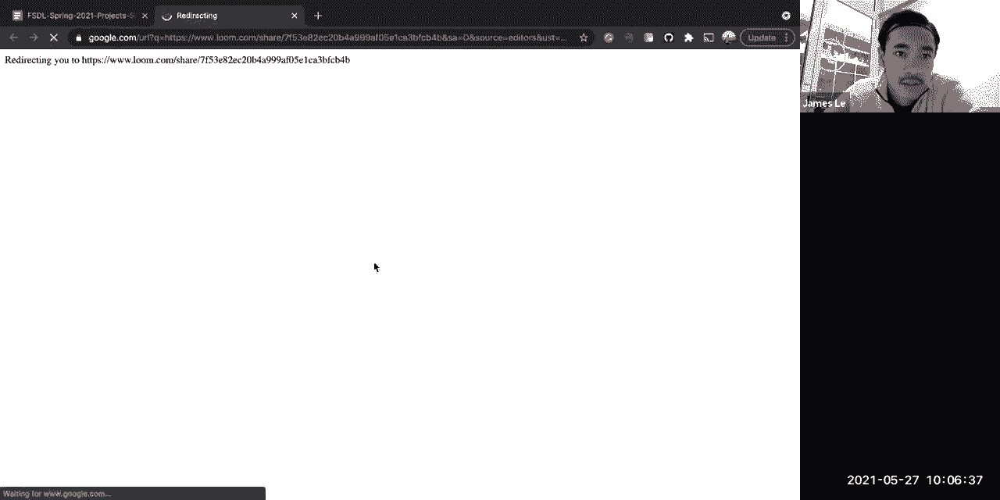

is diving into the um，the the the word unity especially，what you can do is i can play on on hi。

everyone um，for my full stack deep learning project。

i decided i wanted to learn，all about the basic theory and，the。

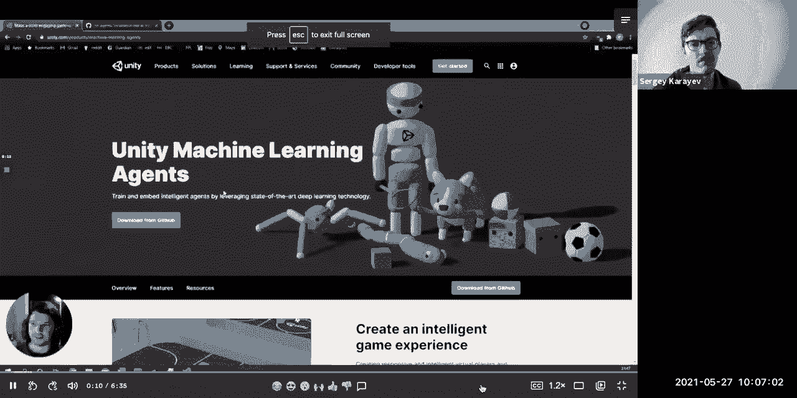

unity game engine i started with a，really simple example so that was just a。

literally just a flat plane a box cube，which is the target and。

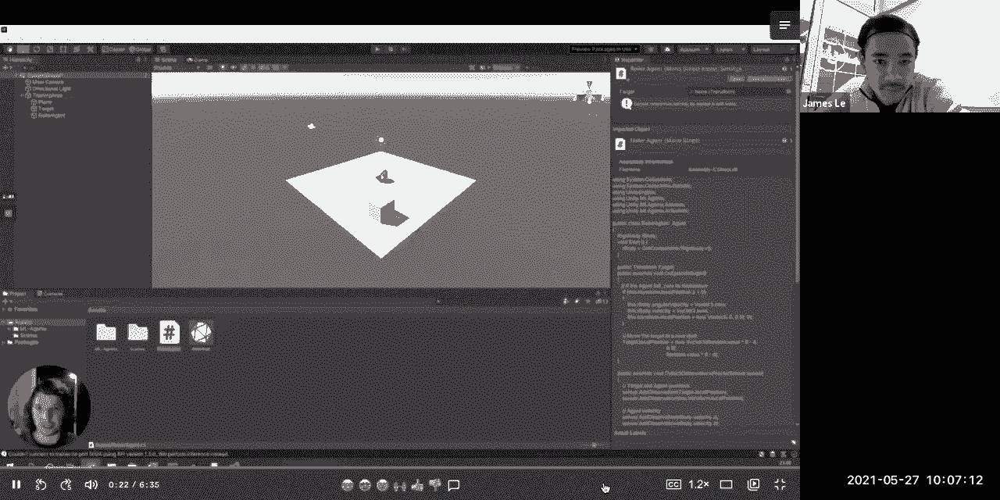

a rolling agent now everything um is，controlled by c-sharp，scripts uh and it's really it's really。

nice there's an existing，agent class that you can just inherit。

from uh and then you can just add all，the behaviors the policy of the agent。

it's actually just the neural net so，taking in those observations and。

and outputting i mean it's more，complicated than that especially in the。

training it used something called a ppo，algorithm，i spent some time trying to understand。

it i won't it will take me too long to，go into on this video。

but it's a pretty stable method and here，you see um it's，integrated with tensorboard so you can。

see how it progressed the training uh，went up to an，average reward of one which which made。

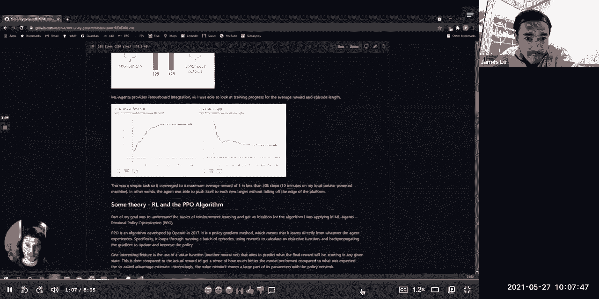

sense that took about 30 000 steps，or 10 minutes on my pretty pretty poor。

laptop and here it is running so you see，it's you know，it's pretty good it kind of just rolls。

over to the target um whenever it moves，to a new location，okay so expanding this problem into。

three dimensions seemed like a good way，to increase the complexity of the，problem while。

just keep still keeping a similar，training reward structure and then a。

really nice thing you can do in，ml agents is to speed up training you。

can actually have copies of your。

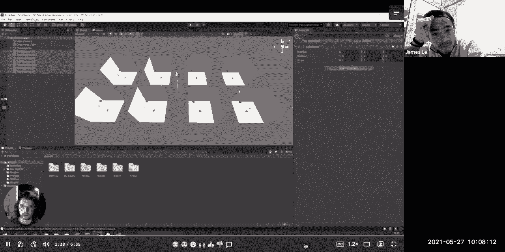

environment so here i expanded it to，eight copies and uh you can see the。

previous run was in orange and then the，second 3d run，actually，but，with running those eight parallel。

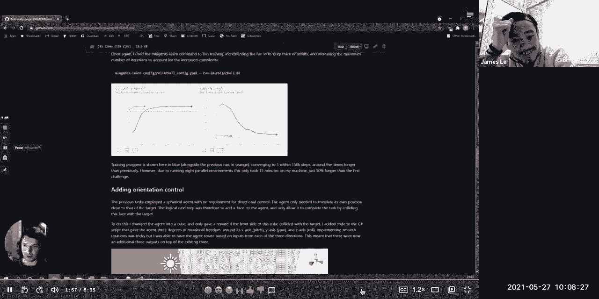

environments it actually only took 15，previous，um training run and here's the agent。

running so yeah like you know，pretty good just just goes over to that，target um whenever it spawns。

quite efficiently the previous agent was，spherical so it didn't really need any。

um orientation control so i thought a，good next step was，to kind of add that aspect so here i i。

had this uh now this agent cube and，and i made it so that the uh the reward，was only given if the。

face of the cube the agent um hit the，target，um so again this agent could still。

moving in all kind of three directions，but now it was able to uh。

pitch your and roll uh so in all those，directions so an extra three degrees of，freedom。

and actually at this point it got um，quite difficult uh it's much harder to。

to train and i actually spent a lot of，time trying to get this trying and。

failing to get this to work i um，previously i had the position i gave it。

the position of the agent and the target，that didn't work，uh i tried giving it its own rotation so。

it was important didn't work i added，a vector from the agent to the target，instead of the positions。

didn't work i messed around with that，vector a lot to try and get it to work。

eventually i had a normalized vector，and the magnitude of the vector so the，distance and i。

importantly i gave it its own angular，velocity and at that point it sort of，started to kind of work。

so that that was good it wasn't all，entirely my time wasted but it really，wasn't that good。

and so i thought about what i was doing，and i realized that um。

actually it did there was three degrees，of rotation，um and really only needs two removed one。

of those one of those so i only had just，two degrees of freedom。

um and then the other thing i did uh was，i added a time penalty so to try and。

encourage it to get to that target as，quickly as possible，at a lower target if it took longer and。

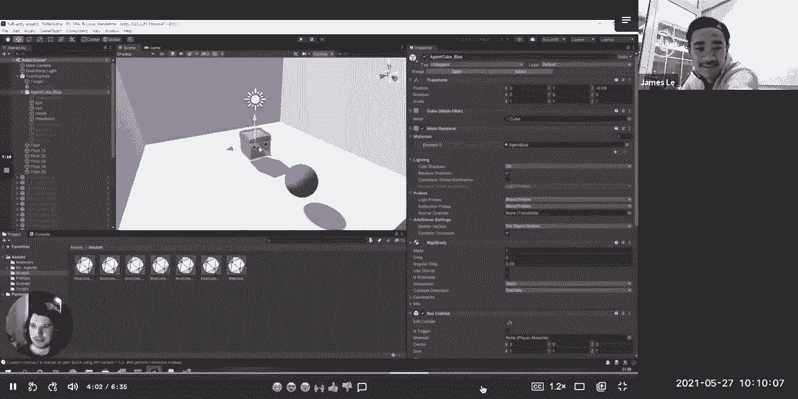

um that actually ended up working，but as you can see it was a big increase。

in training time so this is now，seven million steps or three hours on my，local machine。

um and it you know it wasn't the，change，and i changed that vector again to be in。

the local coordinate system of the agent。

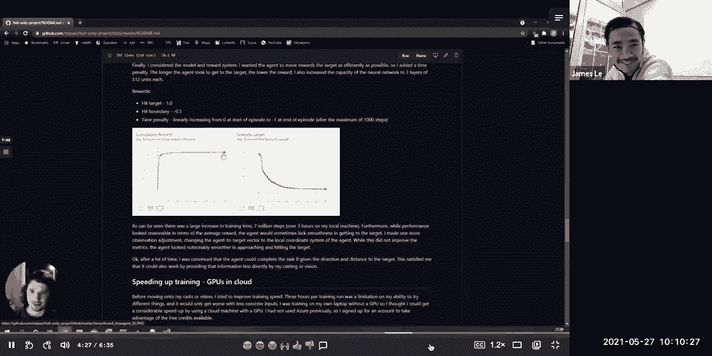

and while i didn't change the metrics it，actually um made the agent。

look like it was working a lot better so，here it is running and you kind of see，that yeah it's。

it it's working it's you know sort of uh，it kind of it gets there it knows what，it's doing。

now since i successfully trained it with，a vector i thought um it you know it，should work。

with with ray casting or visual，observation so here here you can see i。

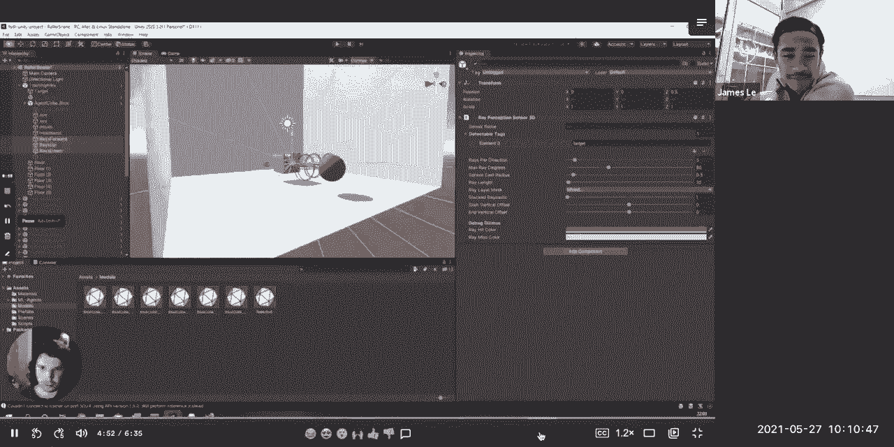

added some raycasts，a grid to the front and you can see it，detects the target。

now this did work but it was another，massive increase in training time so。

actually here you see a successful run，and it was 50 million steps which took。

now this did work but it was another。

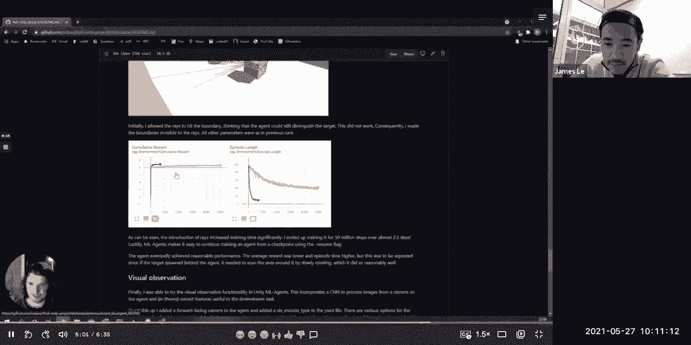

massive increase in training time so，actually here you see a successful run。

and it was 50 million step，it's um it you know it does a pretty，and finally i was able to try visual。

observation which is kind of the goal of，what i was doing，um pretty straightforward again you know。

you can add a camera to the，agent as you can see here um now i knew，that it really needed to be as。

low resolution as possible while still，kind of making up the ball so i went for。

32 by 32 as you can see that's pretty，good and it would work when it balls on，the other side。

in unity they have a bunch of，architectures that in the。

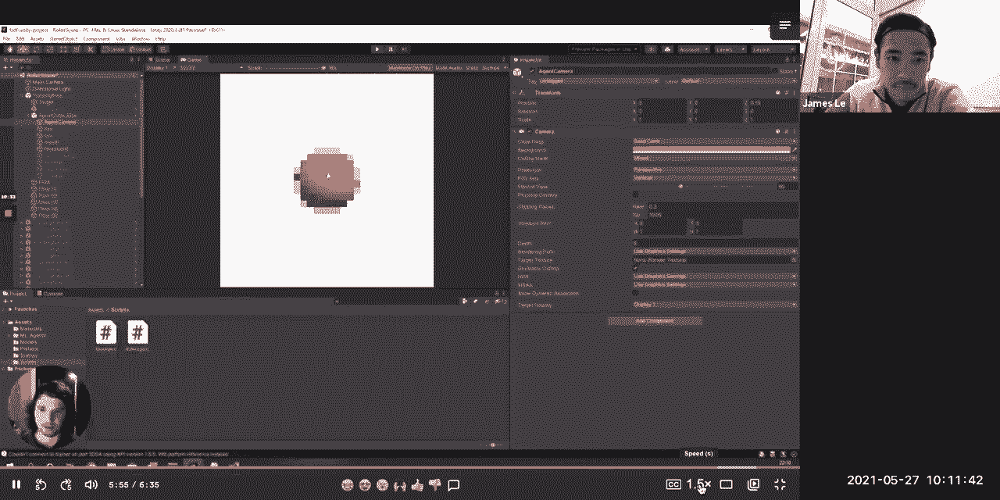

uh that process that image and then feed，that into the uh into the previous，network。

now you probably know what i'm gonna say，this this really had another slowdown in，speed and actually。

you know at this point i was running out，of time anyway but but here was just。

showing development over 10 million，steps which actually took 24 hours in，learning。

um but we were still very low i think，the previous one got to that reward。

that's you know not even at point one。

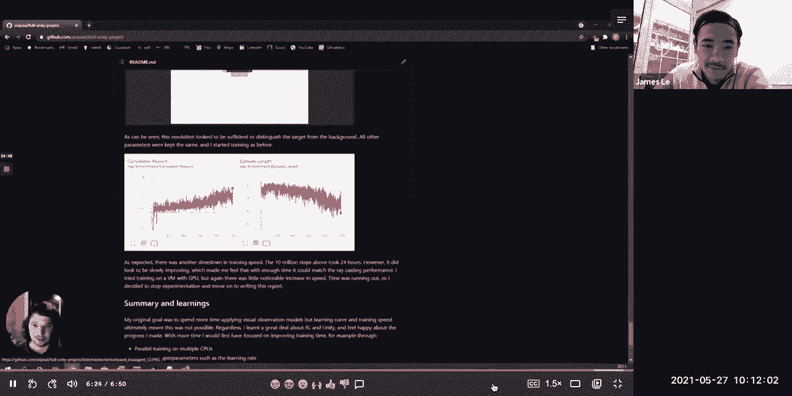

i think it would have got there i think，it was it was getting there so i stopped。

there was probably about 50 or 60 hours，to be honest at that point。

um you know my goal was to have a go at，learn。

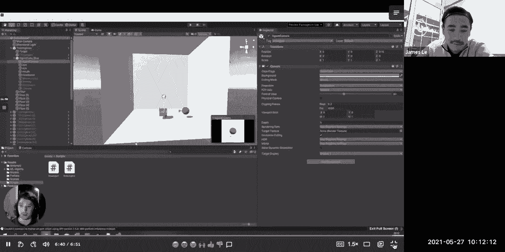

about reinforcement learning and i，product，projects really impressed with the the。

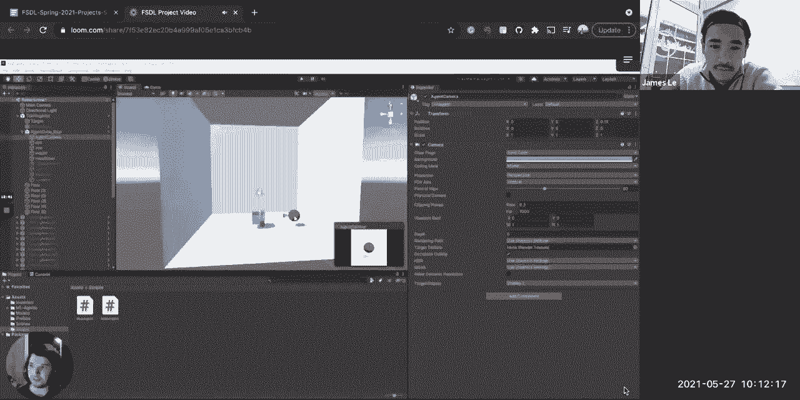

tools and techniques，and i suspect i'll carry on playing with，it all right。

nice and um are you on the zoom right，now，yeah yep i'm here hello nice，so how was uh unity overall。

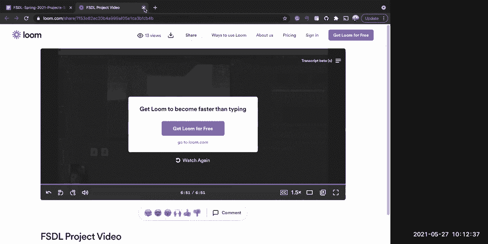

it um yeah painful i think you actually，said it would be paying for。

um when i when i put my proposal um but，no really really，it it it's fairly easy to use it's just。

getting it to work，takes a long time i think one of the，tutorials i said the guy said listen。

if you're ever training an ml agent you，need a week，and that turned out to be about right to。

get everything right um，but i think it's powerful i think it's，really interesting。

yeah i like the progression of simpler，tasks to more challenging ones it's a，really good way to do。

do they actually use like the machine，learning，like ai in any game because my。

understanding like game ai is usually，all heuristic based，i i don't know actually um i i don't。

know the answer to that question，i think it's they i think it's more like。

they see unity as being a reinforcement，learning，and like synthetic narration platform a。

gm type of thing，yeah yeah it's worth saying a couple of，things i added in my report was uh i。

tried using a，turned out，were some，people online said it only really works。

quicker for visual observations，and the other thing is i noticed it。

would be really easy just to create，um like just take pictures in the game，engine。

and have be able to label it using，geometry so you，what i'm saying is you can kind of use。

tricks to speed up training for sure，um yeah very good very fun，awesome um next project is um。

sitting posture coach by peter derulova，the covet pandemic has substantially。

increased the amount of people working，from home，often under improvised conditions。

without necessary ergonomic tools and，provisions，ill-adjusted desk heights lack of proper。

desk chairs and excessive use of laptops，pose real challenges to the workers，well-being，[Music]。

bad sitting posture is a major cause of，back pain neck pain headaches。

and even spinal dysfunction our project，sitting posture coach aims to provide a。

solution for these problems，which is easy to set up and needs no，additional infrastructure。

the only requirement is a webcam，visit sitting posture dot coach。

and allow webcam access your sitting，posture is immediately analyzed by our，ai system。

it runs locally on your computer without，sending any data to the cloud。

preserving your privacy the system will，provide you feedback，to help you attain a better sitting。

posture you can continue your work，and let the sitting posture coach help。

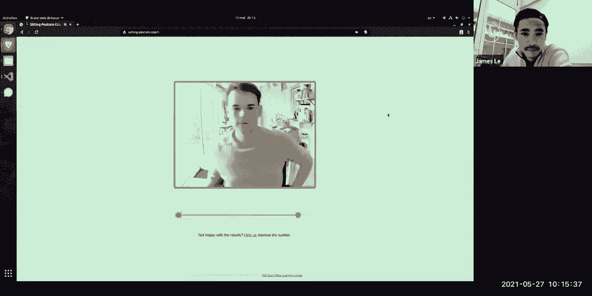

you in the background，so now let's have a look at how the，system is built first we created a tool。

for collecting trading data，this tool runs in a browser and allows。

users to capture pictures of themselves，in different hidden postures。

they can do this by pressing the click，to capture button and we use three，categories。

a good posture sitting up straight bad，posture，leaning forwards and a bad posture。

the app is served by a node。js backend，running on amazon lightsail。

it can be accessed through the browser，the media capture and stream api is used。

to show the user's webcam feeds，after pressing the record button an。

image is captured and this image and the，accompanying metadata are sent to the，backend。

images are stored as objects in an s3，buckets the corresponding metadata is。

stored in a postgresql database，note that in order to use the media。

capture api an ssl certificate is，necessary，we deployed our model on amazon。

lightsail as it provides a simplified，way to set this up，provided you have a domain name so far。

before training our model all images are，pre-processed using a phase detection，pipeline。

the goal is to deliver input images to，our model that are consistent in terms。

of scale and position of the face，an off-the-shelf phase detection model。

is used through the media pipe api，the currents of the bounding box are。

used to crop and rescale the original，image，the resulting crop shows the face neck。

and shoulders which are the relevant，regions to determine sitting posture，quality。

this alleviates the task for the model，as it does not need to handle different。

scales or phase positions，zero padding is applied if information，is missing。

the resulting image is used for，performing binary classification。

a relatively simple image classification，model was used to predict a sitting。

posture score from the pre-processed，images，train validation and test splits were。

created so that each person was only，present in one group，we trained for 35 epochs with a batch。

size of eight，as the model is fairly simple training，takes less than a minute on a gtx 2080，ti。

here you can see a violent plot of the，output of a model on a validation set。

the trained model was converted to a，tensorflow。js model，as we want to be able to run it in the，the。

same node。js backend a separate web page，was created for inference。

this page again uses the media capture，and stream api to capture webcam images。

which are first pre-processed in same，way as described before，a default tensorflow blaze phase model。

was used for phase detection，as it is the exact same model we use for，pre-processing training data。

cropping and rescaling is performed，using the canvas rendering context 2d，api。

the resulting image is processed by our，tensorflow。js model，which outputs the posture score this。

core is used to provide physical，feedback to our users，feel free to try out our results on。

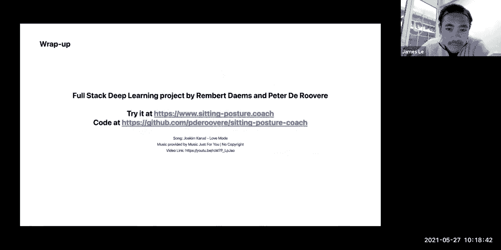

https，sitting posture dot coach or，have a look at the following github page。

where you can find our codes，i love i love the music yeah what a，great video。

nicely done yeah here's the video，editing is，so good on the zoom，hi guys uh yeah i'm here all right。

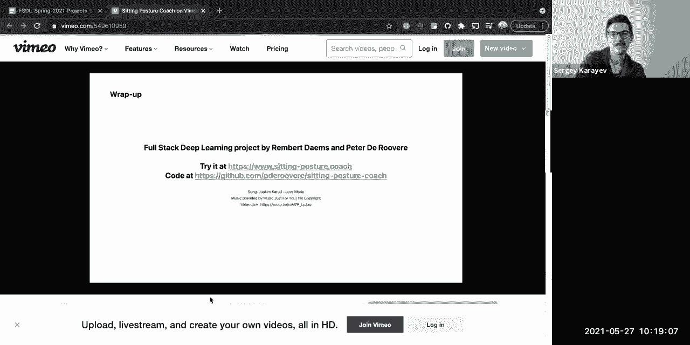

how did you make the slides i just made，them in keynote actually。

oh wow um just lots of animations and，stuff，yeah some animations and i think the。

trick to make a line look like it's drum，definitely also add some value so yeah。

it's nice to see the the reactions on，the video so thanks everyone，yeah it's like uh very watchable。

thank you i recall he also crossed us，like all，the posture images from from slight，grain。

sorry i didn't i recall you you asked us，like at one point，that you know people were sending。

pictures of their pressure，yeah so we got around 300 images，um definitely not sufficient to train a。

real high quality model but uh，yeah i think it works in the end pretty，well so that was nice。

so the tool is also still online uh，feel free to uh to to give us some more，data。

yeah i'm trying it now it seems it works，pretty well sitting up straight。

yeah not sitting up straight yeah not，sitting up straight，sitting straight oh wow。

yeah it was very nice to do this project，and uh thanks also guys for uh for the，classes。

you learned a lot yeah yeah thank you，um so thomas，mentioned in the zoom chat the first。

four minutes of this video is like the，worst summary so i think we can just。

like watch the first four minutes of，this，project 10 and then you know move to the，last one。

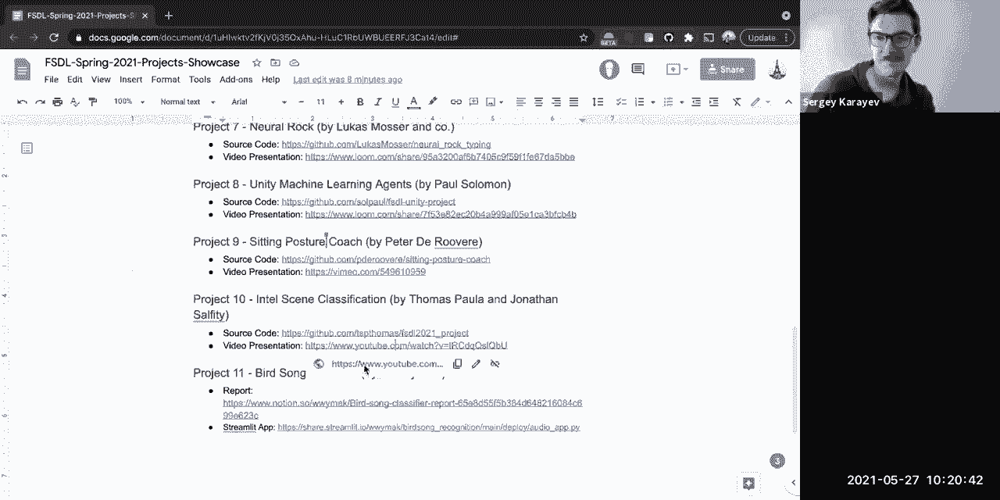

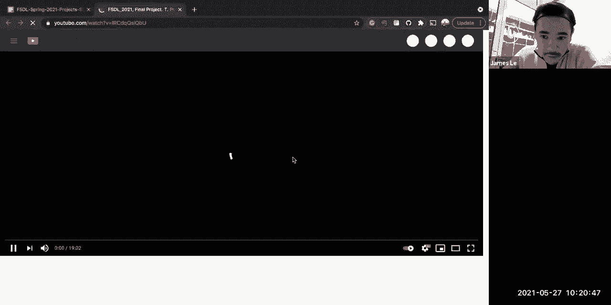

all right everyone so hello um，i'm thomas paula and i'm jonathan，salfidi。

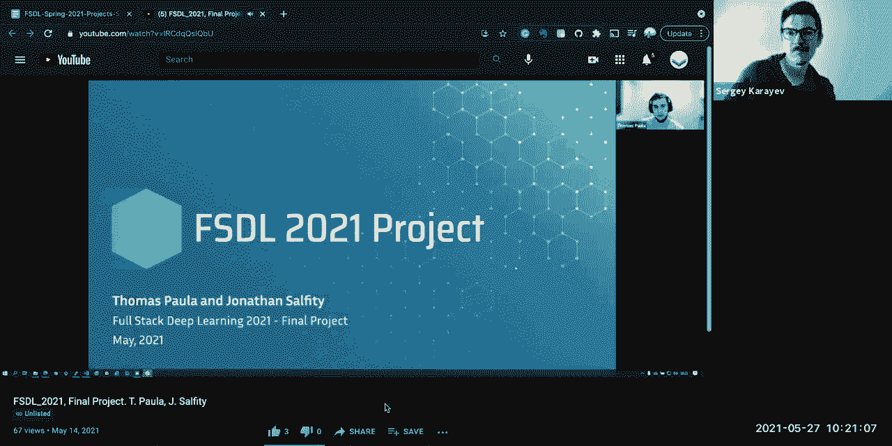

and today we are presenting our full，stack deep learning 2021 project。

so our main goal with this project was，really to develop，uh an exercise an end-to-end machine。

learning workflow，our goal was not exactly to tune a model，or to solve a task but more about the。

infrastructure and pipelines，and we wanted to exercise experiment，tracking。

data training and evaluation pipelines，model registry and deployment。

and integrating that with the deploy the，deployed model with an，application and we wanted really to。

leverage this project to learn，and play a little bit with technologies，that we didn't know about。

so in terms of high-level architecture，just to give an idea right this is our。

architecture we use docker compose to，orchestrate different containers。

within the solution so we used airflow，to orchestrate the pipelines。

and within airflow we have of course，different containers like porker。

scheduler a web server a database，and so on we have ml flow to the model。

and we use that for the model registry，and the model tracking，right tracking metrics and and。

parameters and，we have developed also a web application，based on flask and javascript。

where the user can interact with the，trained model，and all of that the information between。

these different containers，is shared through a shared file storage。

which is not a map to volume within，yeah so breaking down the architecture，into a workflow。

so within airflow our data set is，composed，from an intel scenes kaggle。

competition that data set is composed of，files，of jpeg files it undergoes a feature。

extraction from a pre-trained resnet，model which，now we have a process data set which is。

composed of features，sk，learn scikit-learn models are trained，some logistic regression some svm and。

then evaluated for metrics，the metric we were most concerned with，or most。

interesting was f1 score so all those，models are tracked in ml flow。

and the best model based on what has the，best f1 score is then registered。

upon registering the our web application，is，moved from um from。

moved into production and now ready for，for the user to upload an image and that。

user uploads the image that image then，gets classified，as correct or incorrect upon，classification。

of an incorrect image the user has the，ability to，correct the label and in either case the。

image and the correct class，are fed back into a，new version of a data set through a，syncing process。

which then creates a second version，a version two of data set um and we can。

kick and when we kick off this pipeline，again，using this feedback process that new。

model training and model evaluation，incorporates，this，in the application in a demonstration，next um。

and we'll see that uh the model gets，tuned。

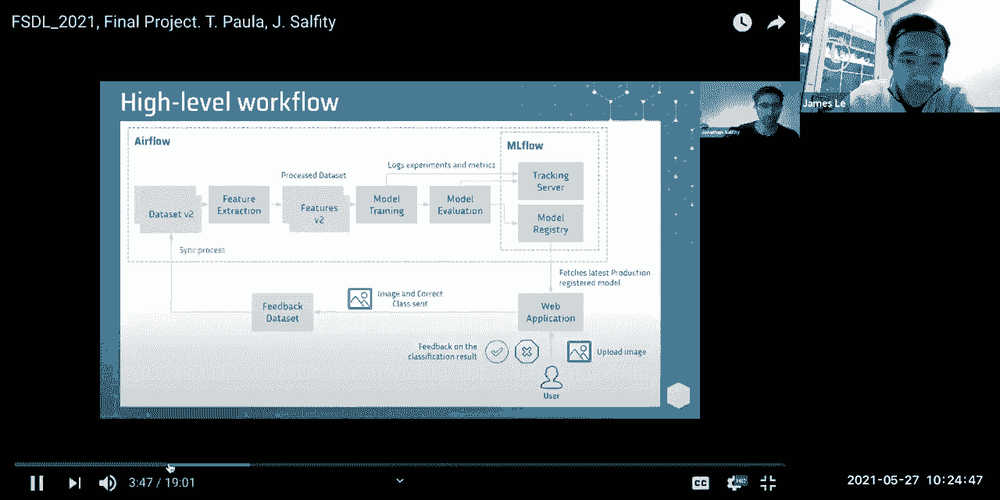

over the over this new live data coming。

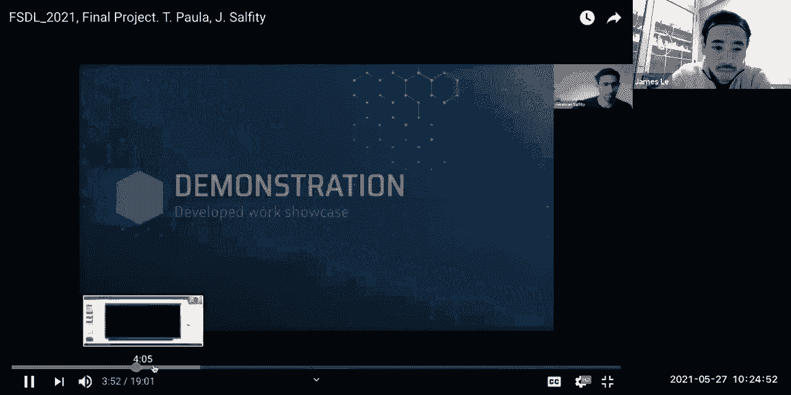

right so let's go through the。

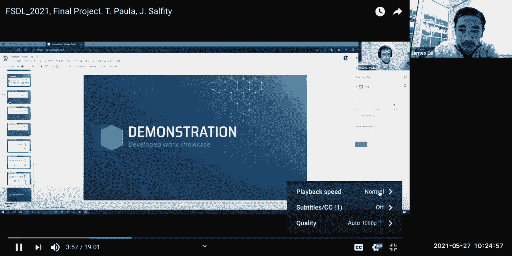

demonstration，so we have here um terminal right，connected to，uh ubuntu machine and here we are going。

to start，our solution right so when we do docker，composer all the containers are。

started right we can see both squares，and outflow the web app containers。

and that's a good thing about using，docker compose uh it makes it easier to。

manage these different docker containers，which container should execute first and，so on。

so here we are having the execution。

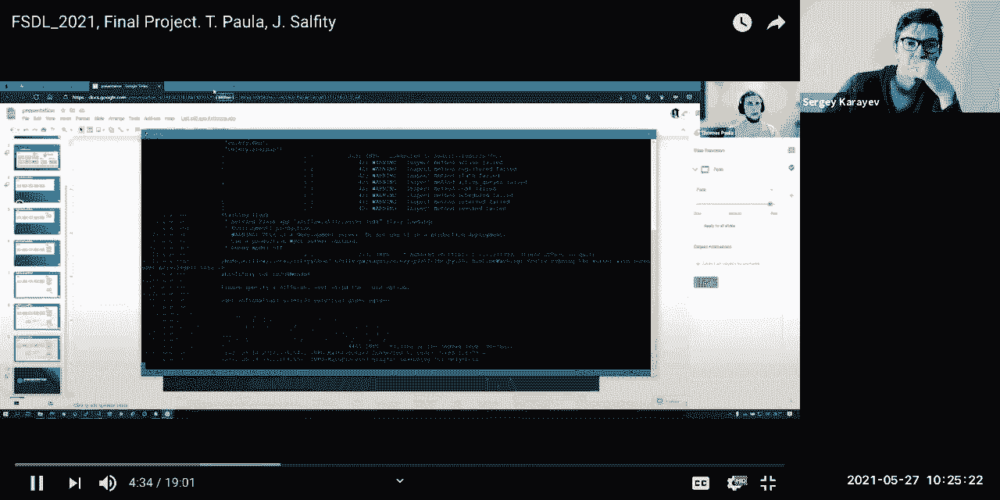

right and，here we we already have like open ml，flow right we have this this。

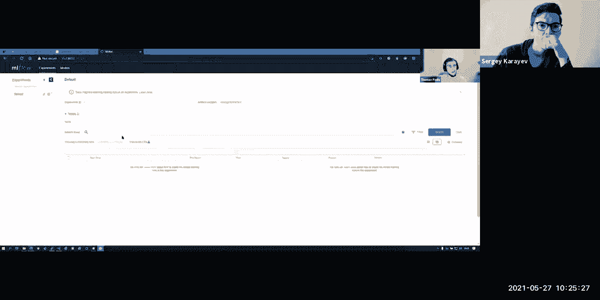

specific part here that is running the，machine we have also airflow being，loaded right。

in another part that we also specified，and besides airflow we also have our。

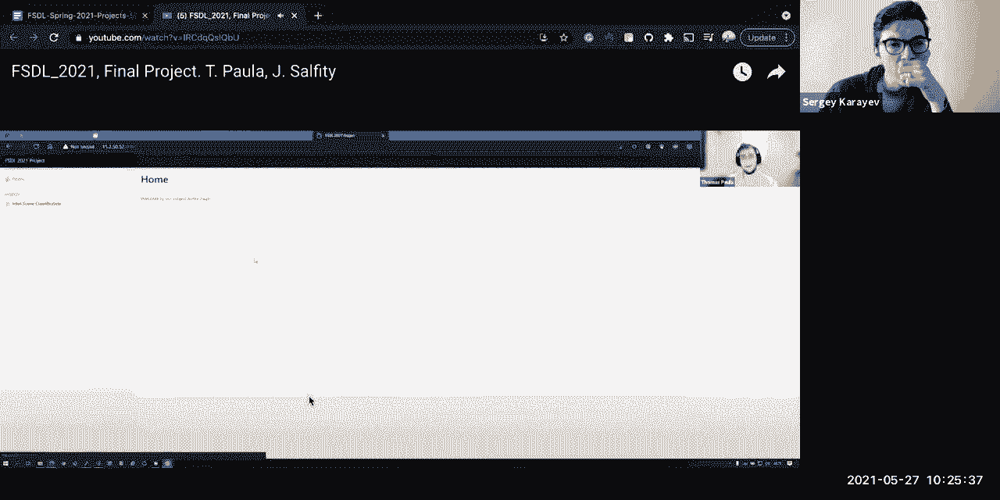

i think，today most controversial why to get，through but yeah that's like a high。

level overview of the，about their work i think thomas and，jonathan if you guys don't。

yes yeah so after the previous video，it's very，very hard to come with a sobering video，as ours right。

but um yeah we also shared here the，report，it was like a lot of learning and we。

really focused on the，infrastructure part so our goal was，really to see what would it take to。

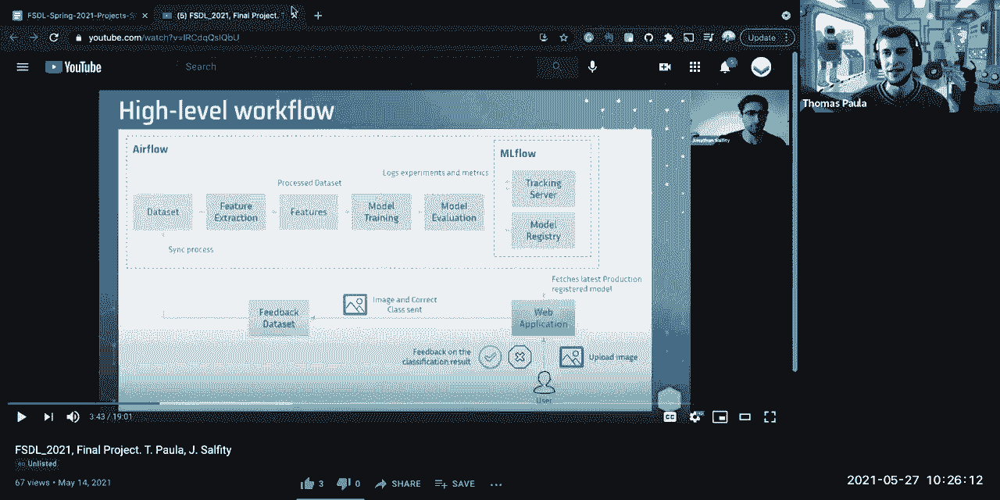

to set up this right and we we did that，in a way that，anyone can clone that repo and play。

around a little bit，and and see some of the challenges so we，try to detail。

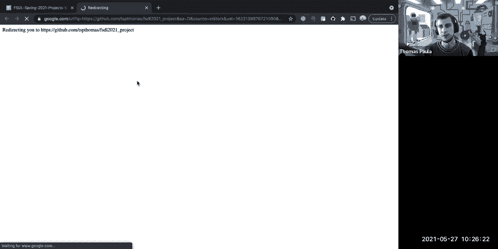

almost all of that in the report and，some of the learnings，and thanks for for the opportunity of。

being part of this class and，learning a lot with you all，yeah thanks thanks for participating。

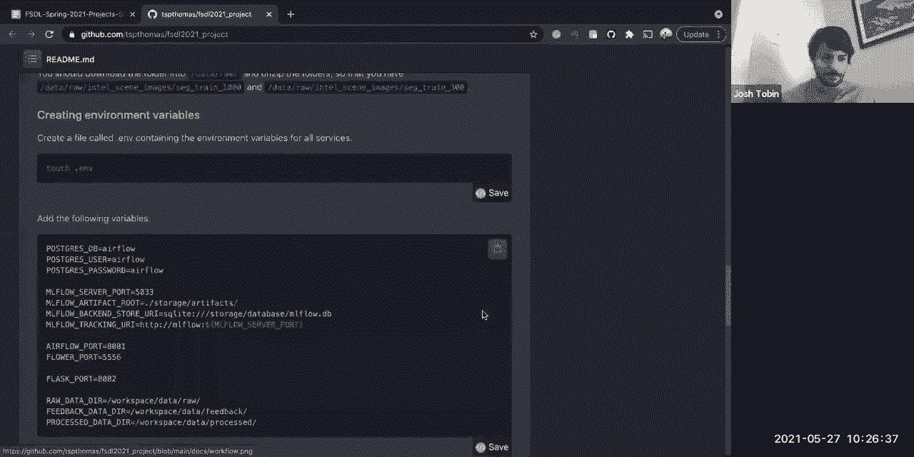

thanks guys yeah um。

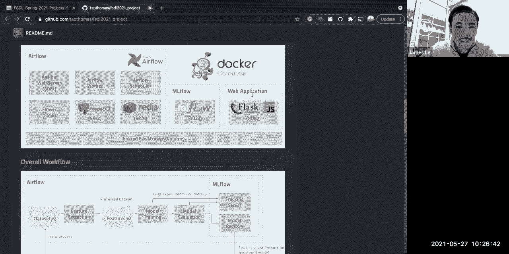

and then i see the last one by wendy，mark doesn't have a，video but she created a notion report。

that just try to create like a，classifier a bird song so that's，like a very unique uh use case。

yeah so yeah i can just i can just read，read from it，so then this project is to identify both。

species making the call，or song from a recording um，yeah and then she used a dataset from。

public but song that said，the corner cornell birdsong and the，woodcraft dataset of cargo。

um there's a couple of changes，uh class imbalance some some very sharp。

sharp length which is very long length，so，yeah this is another example of the。

yeah so like i think there's like other，words within between the，the。

the right uh cell from from the target，right um and then that that's the，construction。

um so here's some simple processing，stuff right now sampling audios，in in waveform spectrogram。

uh the modeling component uh，utilizing transfer learning uh there's a，motor called jamnet。

that have been trained on the auto side，data set and，yeah generating uh embeddings system or。

architecture，um and so yeah so this is her first，attempt，like get pretty uh you know。

like low accuracy result so as a second，of，data set cleaning using using the。

yes you can hear that there's like like，no noise raised it uh，it really clean out all the all the。

background noise and then you can，clearly identify you know the um。

the cell coming from the bird and here's，some uh some，visualization of the spectrogram and。

yeah um also create a tensorflow，potential request from the audios。

uh do another iteration with jamnet to，make the audio even cleaner training on，spectrogram，can。

according yeah and then front down，streamlit um but then，uh see yeah。

just put the whole thing on github，instead and run and stream it you should。

create like a like a string，test on stream where you know people，cannot upload you know。

like um audio or mp35 or，like you know what's wrong to um to to，do the classification。

uh facial work right uh different models，augmentation，have a brighter tuning do more data，cleaning。

yep and some other thoughts working with，other data is fun，becoming more familiar with tensorflow。

uh deploying model not a script forwards，on top，but that's also very satisfactory。

satisfying once i got something up，getting someone else library to work。

controlling data with her it's far too，easy to end up an，unstructured mess in code when i'm。

experimenting so it's definitely，something i need to work on，yeah so that's that's uh what thanks a。

lot when they even go for writing this，report is very，yeah you can imagine that being a mobile，app。

just uh that also contributes you know。

the data as you use it，so um that's all the，projects we have i think it looks like。

around town nicely done everyone，yeah perfect congratulations yeah you。

should all be you should all be proud of，the work that you did。

