# P3：【Lab1】设置和介绍 - ShowMeAI - BV1iL411t7jE

and the labs that we're going to be，doing are，going to basically we're going to。

incrementally develop a complete deep，learning code base，for a single purpose understanding the。

content of handwritten paragraphs and，you saw a slide from josh，in the intro lecture that kind of。

alluded to this，so the key i want to focus on is，incremental develop right so lab one is，going to be。

the least amount of code that we'll see，and then lab 2 is going to build on top，of it and add code。

and we're always going to be adding more，code with each lab and there's 10 laps，total。

we're going to be using the currently，best framework which is pytorch，and pytorch lightning being。

a training kind of harness around pi，torch which implements a lot of nice，stuff。

and there's an active development we're，going to use the best methods which are。

cnns rnn's and transformers，we're going to use what we believe to be。

the best experiment management system，which is weights and biases。

and what we believe to be the best way，to deploy on the web which is package it。

up as a doctor container，and then use a serverless，aws lambda function which now supports，containers。

it's a game changer to deploy it as a，rest api on the web，and then we're going to look at the best。

in more detail today we're going to do，the introduction we're going to，formulate the problem。

we're going to look at the structure of，our code base and then we're simply，going to train。

next week we're going to we're going to，introduce cnns，and we're going to introduce a new data。

set called emnist，extended mnist which contains，letters as well as digits we're going to，generate。

synthetic handwritten lines using that，data set，and we're going to train cnns for the。

purpose of recognizing characters but，also entire lines，uh lab 3 we're going to use rnns we're。

going to use，cnn and an lst lstm on top of it，with ctc loss which is which is crucial。

for sequence models，of this type to recognize text in a line，of handwriting。

in lab 4 we're going to do the same，thing except now，approach，we're not using lstm with ctc we're。

using cnn on transformers now，in lab 5 we're going to look at some，real handwriting data。

and then use weights and biases for，running，a lot of experiments lab six。

we're going to uh either detect lines，we find，lines of text or we'll actually。

implement a whole paragraph recognition，see how that goes lab 7 will do some，data management。

we'll label our own handwriting data，we'll，you know discuss how to properly store。

it be able to train on it，lab 8 we're going to introduce，continuous integration we're going to。

introduce continuous linting，and testing of our code，lab 9 we will do deployment once again。

to the web，we're going to run it first locally as a，rest api，using fast api then still locally but。

in a in a docker container and then，finally we're going to put that，container。

in production using aws lambda lab 10，we're going to set up monitoring。

that should alert us one the incoming，data distribution，today we're going to talk about the。

problem and the code base，so the goals today understand the，problem are。

kind of you know formulated path to，solution，set up our computing environment and。

then review the code base，that we have so far and then use it to，train on mnist。

just the kind of hello world of deep，so we want to be able to have some kind，of service。

that i guess josh at some point called，text recognizer pro，that we can take an image of a。

handwritten paragraph of text，and somehow obtain a transcription of it。

automatically and the way we're going to，implement it，is by sending the image you know from a。

phone or or a computer，off to a web backend which is going to，run our prediction model and the。

prediction model is going to be trained，via the process of model training so。

even more specifically we're going to，make a post request right like。

rest api right get post delete stuff，like that，we're going to make a request with the。

image encoded or the image url，we're going to load the image detect，lines in it。

pass each line through some kind of，model that's going to take a line and，output text。

encode the response of this whole system，that's the prediction your full stack。

deep learning whatever，have some kind of confidence on it and，then we can respond to the um。

the caller with that with that，prediction，and in order to to compile this，prediction model。

we of course need data right so we need，of，lines of text what does this line，actually say。

we need training code and we need to，save，the weights that give good results so。

the next thing we're going to do is set，up our computing environment。

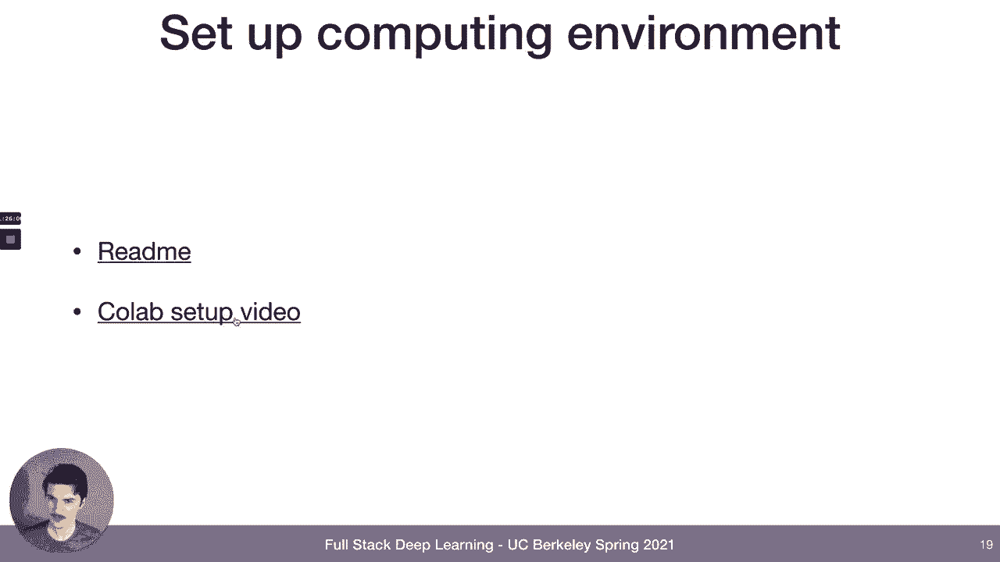

so i actually recorded a setup video，which you can watch，right now。

so let's do it so，um i already shared right all these，slides，on the website so when you download the。

slides you'll be able to click，on the link and the link will take you。

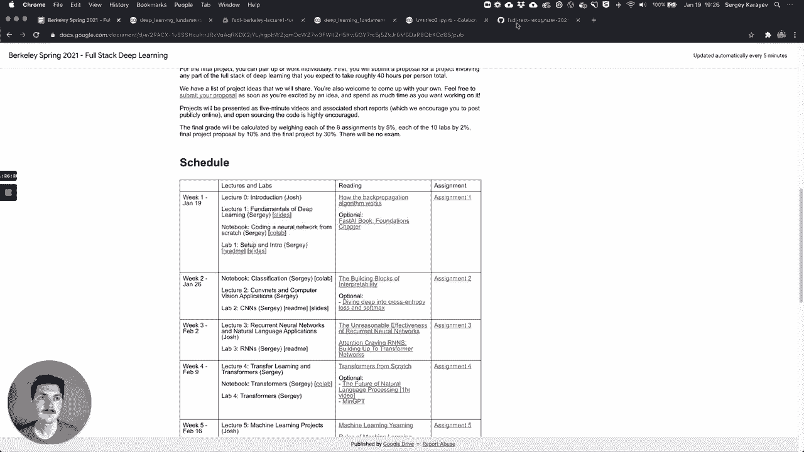

our repo and specifically，the setup the setup readme，can，run labs in this course if you have。

access to a computer that has gpus，and or tpus right and runs linux then。

you're welcome to set it up yourself，and there's a really nice system to set。

it up i'm not going to talk about it，today，what i am going to talk about it is for。

the people who don't have access to a，computer with a gpu，you can actually use google collab right。

the same thing we were using for the，notebook，so let's go through that um，we'll go to collab。

and all you need is a google account，your berkeley account's a google account，you can use that。

you'll see a screen like this you'll。

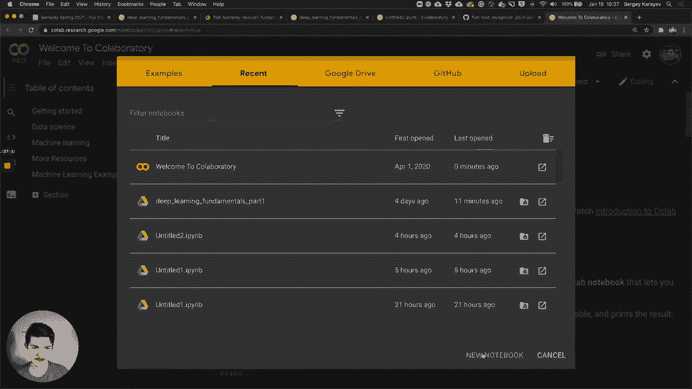

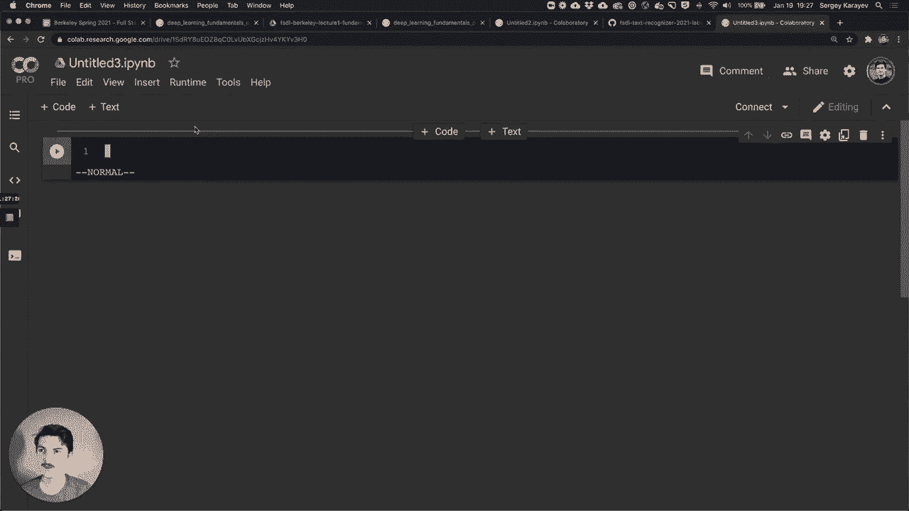

you will connect to a gpu runtime。

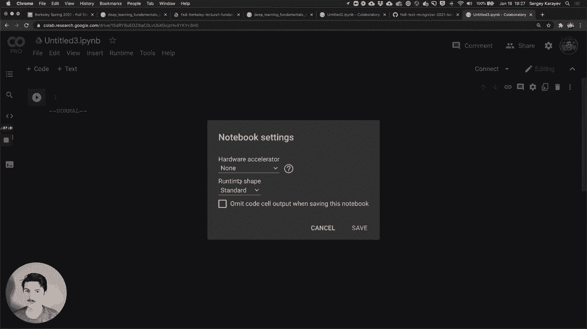

change runtime type gpu save，okay i'm in business let's make sure we，have gpus。

nice so this time we have a p100 not as，nice as a v100。

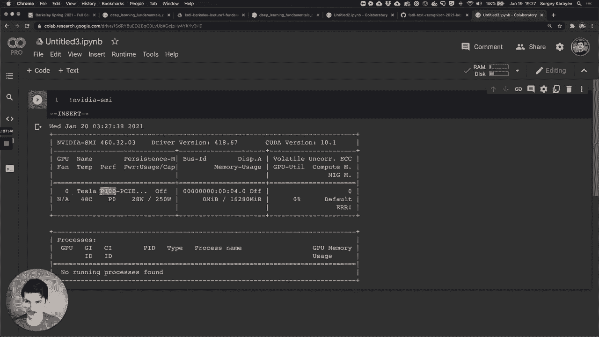

but still a lot nicer than a k80 if you，get a k80，uh it's fine too but it's not as good。

and then the next thing we're going to。

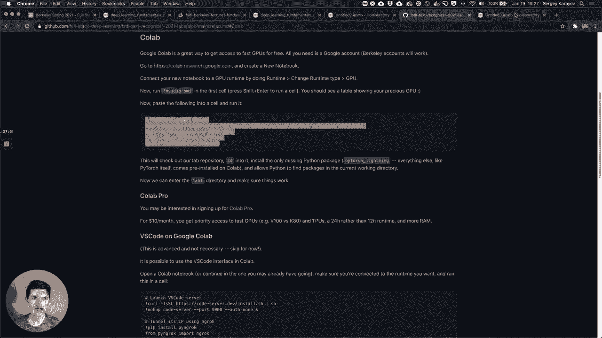

do a little bit of setup right so we're，going to clone the repository。

into collab we're going to cd into that，directory，we're going to install the only missing。

dependency which is pytorch lightning，everything else co-lab provides for us。

and we're going to just set python path，environment variable to dot which means，current directory。

um is just something that's going to，make things a lot nicer for us。

so here we are we're cloning installing，when this thing stops spinning we know。

we're done okay so it stops spinning，so we are done okay great but。

it'd be nice to see code right so we can，do is we can click right here，on files and we can see。

that we check the this is the uh the，repo we checked out。

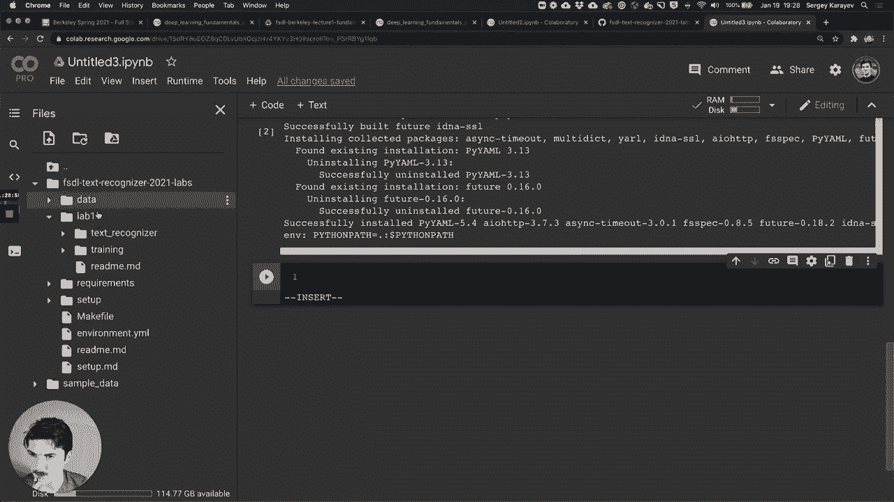

same thing that we were seeing um，well i guess we haven't seen it yet but，it's it's what you can see。

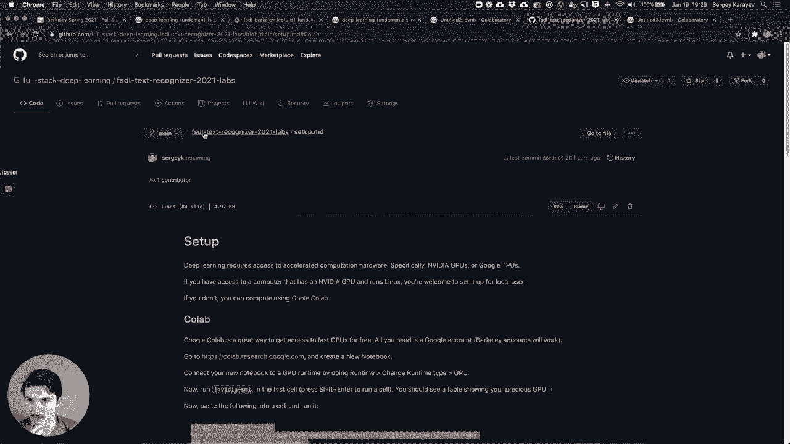

in the github，it's the same file structure that we now，have in co-lab。

and just to test it out i mean we're，still doing setup but just to test it，out let's go into lab one。

which we can do with the cd magic，so if something starts with a。

bang or an exclamation mark that's like，a hardcore，shell command right but for some things。

that are also shell commands，there's a nice what's known as an，ipython magic which starts with a。

percent sign，and it's just kind of like ipython，making it a little nicer to do that。

thing which which could be done as a，shell command，so we've changed directories into lab，one。

and now just to test the things work we，can，run in the shell python。

and we're going to talk a lot more about，this in the days to come。

what would just say max fbx equals three，yeah let's just run that and see what。

okay so it's looks like it's downloading，mnist from yan lacoon's website it's，always fun。

um it's storing it here into data slash，downloaded，slash mnist just in case you're curious。

and then we also have some other data，files in here which will。

come in common useful in the future labs，for now just kind of，don't worry about that we have a make。

file environment dml，and requirements that'll be very useful。

to those of you who are setting it up on，your own machine but it's not useful in。

collab so we can just ignore it for now，and what we have is，is lab one this directory that's kind of。

where we are right now，so what it's doing is it's training，right now。

and the question we might have is is it，using gpu，we can answer that by pressing this，terminal。

at the bottom here and what do you know，we got a terminal，and we can do that same。

before let's just give it a little more，room，um and it doesn't look like it's using。

gpu there's no running process，there's no utilization，and that's totally fine because we。

didn't we didn't actually expect it to，use cpu，this is just this is training um。

a multi-layer perceptron just like we，coded up，on mnist so it's not a big problem it's。

not a big data set it's not a big model，it's actually can be done on the cpu。

pretty efficiently but if we want to，train it，using gpus let's still only go for three，epochs。

but now we can say gpus equals，and we can say negative one to use all，available gpus on the machine。

here it's just one machine or one gpu，fold this out a little bit so we can see。

so now we're seeing utilization so this，actually is using the gpu。

it's using it very inefficiently because，it's such a small model。

and uh you know small batch size but，that's we just want to see that it's。

using it and it is so that's，perfect let's close this for a second，and let's go ahead and look at。

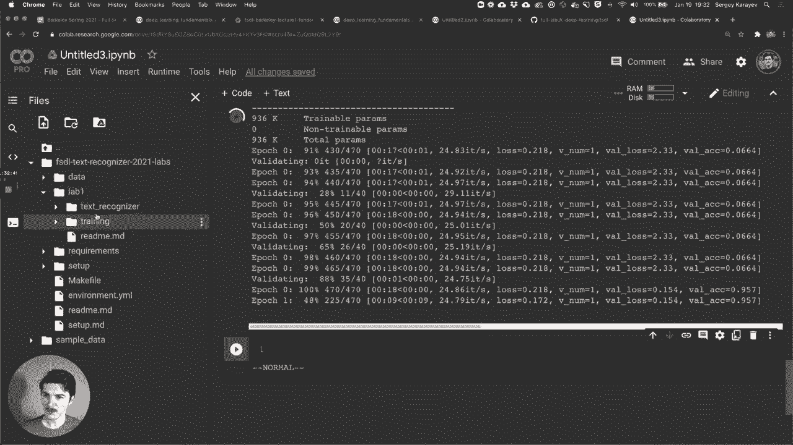

actually before we start looking at the，code structure，to review the code base what little of。

it we have right now and then train on，mnist which we kind of already did。

so once again i have the readme i also。

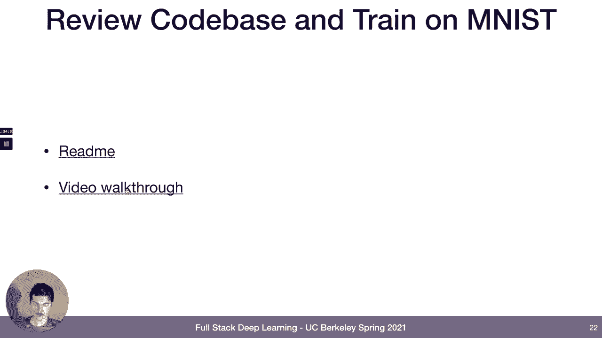

recorded the video walkthrough，in the past so you can see it in the，future also um。

but i'll do it live right now and i'll，actually，instead of using collab at this time i'm。

going to switch to，visual studio code okay and this is like，for those of you who，[Music]。

might be setting your own machine up，or in fact there's a crazy thing that，you can do。

if you feel like it if you go to setup，there's actually a way to run vs code。

on collab and all it takes，is just this much code so you just run，that in the cell。

and you can get a vs code browser tab。

not as good as the real thing。

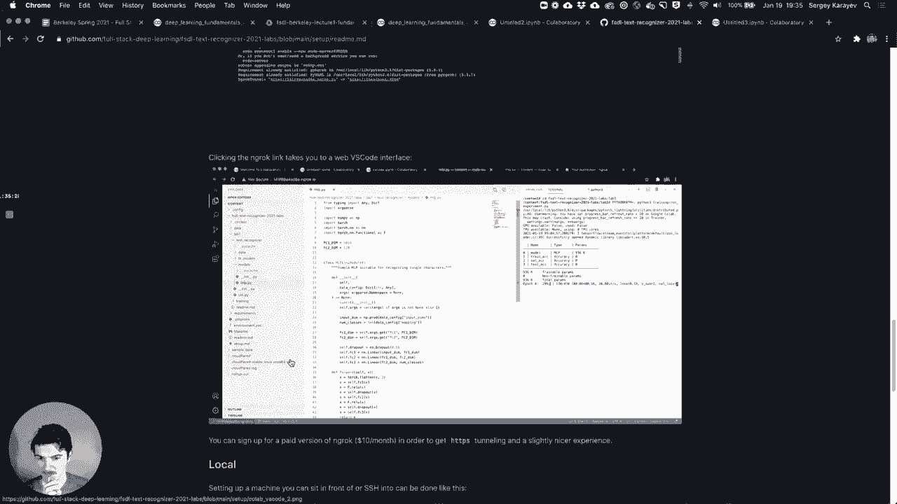

but it's connected to collab so for，those of you who um，who really like vs code you can do that，but。

i really like vs code but only if it's，on my own machine all right。

and i happen to have a machine here with，two gpus and it，is i've checked out the the same repo。

that you guys have checked out in collab，it's the exact same thing i just want to。

use vs code because it's a little nicer，for kind of going through stuff，um and clicking around so。

what is the structure of our，project so at the top level we have make。

file environment yaml requirements，these are things you can read about i'm。

not going to cover them right now，they're super useful，but right now i want to talk about。

specifically，the kind of python code that we're going，to be writing，so like i said we're building。

incrementally right so everything in lab，one，is also going to be there in lab two。

so next week i'll release lab2 you'll，see another folder called lab2 it'll。

have all of this stuff plus some extra，stuff，so this is really the least amount of。

code that we'll ever see，right and it's divided into two parts，text recognizer and training。

text recognizer is the python，kind of package right that we are，developing we are developing。

something that can take an image of text，and output，transcription of text that's what we're。

developing，part of that code that we're developing，is actually going to be learned。

right part of it is going is going to be，written as python code。

by us part of it is going to be learned，as a bunch of 32-bit floats。

by pytorch via the process of training，right，and so training is all the code that we，are writing。

to facilitate that process right so，training versus text recognizer。

right now training doesn't have much it，just has this init file which is empty。

because it's a python packaging，convention to have this init file。

and then it has this script called run，which is less than 100 lines of code but。

in those less than 100 lines we're able，to take，a bunch of command line parameters，basically。

specify the model class the data class，so mlp for us mnist for us today。

specify any number of pi torch lightning，trainer arguments like which gpus we，should use。

how many workers we should use for，prefetching data how many epochs we want。

and also any of the parameters that mop，or mnist define themselves and so let's，look at that。

so there's not that much code you can，read through it later，let's switch into what's actually inside。

of text recognizer，so inside the text recognizer we have，this empty init。

no big deal some utility functions like，read image，that are useful to like a lot of things。

and then three main，subdirectories data models，and lit models okay。

data is all the code that we need to，interface，with data so today we're using mnist。

so let's open up mnist，um mnist data module，right inherits from base data module。

and one thing that's nice in vs code is，i can，right click click go to definition and。

it highlights the file that it's in，so it's in base data module。pi in in，this directory。

based data module inherits from pi torch，lightning，lightning data module and so this is the。

interface that pi torch lightning，basically has for，presenting data to the training system，right。

downloading the data right so somewhere，you might have to download data you，might have to just like。

copy it from some other directory um，processing data which is done in setup，so there。

we may be it you know，your data might be downloaded as，float64s。

but you wanted to be 16-bit floats or，something so that would be the place to，do it。

um and split it into train validation，and test splits i'm going to close this。

for a second so you can see the code a，little better，so specifically for mnist we're actually。

going to use，like a torch provided mnist instead of，downloading it ourselves。

i mean you still need to download it so，in prepare data we download it。

both the train and the test splits，in setup we furthermore split。

split the the the train into train and，vowel，right and we，apply transforms which we define right。

here，and so transforms are something from，torch vision which is going to be useful。

that basically converts，images to tensors and then further，normalizes the tensors。

so that it's kind of nice and easy to，learn on data modules are also，responsible for。

saying what input dimensions they，provide and what output dimensions they。

and then another thing that we want to，cover，is this base data module so。

it adds a couple of arguments like batch，size and num workers，so these arguments are going to be。

exposed through that run experiment pi，script，so if you want to add some other。

argument like subsample fraction，you can do that here and then use this，via this args parameter。

you can use now subsample fraction for，whatever you want in your code，so that's a quite nice system。

and lastly there's this concept，of so these are called data modules。

and there's another word which is data，loaders，and then there's another word which is。

data sets and uh，pytorch and python kind of use these，three words i explain。

exactly what they are and what they mean，in the readme of lab one so i'm not。

gonna do it right now but you should，read through it，and kind of make sure you understand it。

so that's data right models，are things that are basically neural，network。

um networks like you could call them，networks right，but model is a common word for them，torch。

we inherit from torch。module right so，that's could be another word for it。

but basically it's something that is，part code，part learnedweights that takes data and，outputs。

other data that's all a model is，this particular one is an mlp，multi-layer perceptron。

same ones that we saw in the lecture，this one has，i guess three layers one of them takes。

input dimension to，the first hidden dimension another one，takes first hidden dimension the second。

hidden dimension，and then lastly hidden dimension number，two to the。

final output which is number of classes，um all it does is like whatever input。

comes in it flattens it into just one，vector，to it，applies a non-linearity applies dropout。

second linear layer，nonlinearity drop out third linear layer，and that's it。

and then the hidden layer dimension，dimensionality we can set on the command。

line via these two arguments，so that is all that，models，right so someone asked why do we use，come。

with a training loop right you remember，we had to code up our own，fit method in in the notebook that。

basically took our model took a learning，rate，took an optimizer took a loss function。

and so you need to keep track of all，these things，right like they need to live in some。

place and pythorgs lightning，framework i guess for where to put these，things and。

um the way it works right is we have，this base lid model，so that's the one we're going to use for。

a lot of things you instantiate it，with a model so you instantiate it with，for example mlp。

and then it instantiates its own，optimizer，with a learning rate and its loss，function。

and then it instantiates any number of，metrics that it may want to care about。

like train accuracy validation accuracy，test accuracy，we can set the optimizer on the command。

line we can set the learning rate in the，command line，we can set the loss function on the。

and then basically if we implement this，training step validation step and test，step。

we can use this model in the pi torch，lightning training harness，and it'll work um。

on cpu exactly the same as on gpu，so pythor's lightning will take care of，making sure the tensors。

end up on the right in the right place，we can distribute this。

the training of this model over multiple，gpus so we can do data parallel training。

basically effortlessly i'll show you in，a second on my computer，and so this is why we use pytorch。

lightning like we just follow this，framework，and then there's a lot of nice things。

that are enabled for us，okay so by the way the training step is，going to，forward。

method which is actually just going to，run it through the model，that we um were instantiated with。

that generates log probabilities we，compute the loss function between log，probabilities and the true。

labels we log the loss，we log the train accuracy and，that's about it and and the validation。

we do the same except，with validation loss and validation，accuracy。

so now let's actually use it right，so i'm opening up terminal i'm in lab，one。

and i'm doing python training run，data class equals mnist，max number of epochs is gonna be let's。

just run it for like，i don't know five，fc one so the dimensionality of our fc。

uh the first hidden layer let's just say，128 fc2，let's just say it's bigger 256。

batch size 32 and we don't have to set，all of these because there's always。

nice defaults for them right so for，example，batch size that's where that flag was。

added and the default is batch size，which is 128 so that's probably fine。

but if we want to overwrite it we can，let's just overwrite fc1 and fc2。

and lastly let's use gpus and let's，actually use，zero and one right so we're going to use。

both of these gpus，well actually let's just start with just，let's use gpu zero。

so it is training it looks like it's，training pretty fast，we can go into another terminal and do。

watch dash and one nvidia，dash smi this watch n1 just means。

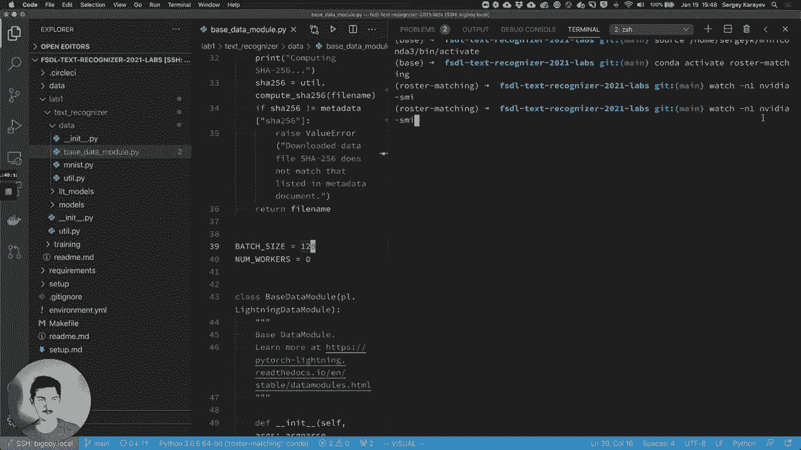

refresh the output of this command every，second，and we see that the gpu is being used。

once again not efficiently at all but，but that's，that's what we got um。

pie torch lightning is nicely printing，the loss，the validation loss if we give it a，little more room。

the validation accuracy at the end of，training it tests，it shows you the accuracy so that's。

pretty good 96。7 accuracy right，now let's train on two gpus at once i，have two gpus。

let's use both of them，so here we want to also add this，accelerate，accelerator equals ddp。

did i misspell accelerator it's kind of，embarrassing，so here we're actually going to use both。

gpus that i have，um and pytorch lightning takes care of，distributing the data。

so now we see that both gpus are being，it's actually also running tensorboard，behind the scenes。

i'm not sure that i have the port yeah，it's not going to work right now。

but basically i could open up，tensorboard which pythor's lighting is，automatically running for this。

and you can see that it finished，training uh faster than before because，it's using two gpus。

so that is basically it that's the，structure of lab one，part of the weekly assignment is going。

to be to just play around with it make，sure you can train，and maybe try different settings of fc1。

fc2，try messing with this like see what，happens if you，you know delete drop out or add more。

layers or whatever you want to do，modularize this so you can actually take。

the number of layers as a parameter。