# P9：L4- 迁移学习和 Transformer - ShowMeAI - BV1iL411t7jE

so today we're going to talk about，transfer learning got started in，computer vision。

we're going to talk about how it's，applied in，language and natural language processing。

specifically starting with embeddings，and language models，talk about nlp's imagenet moment。

and then transformers the uh，foundational mechanism of of，transformers is attention so we'll cover。

that in detail，and we'll talk about the specific you，know birds，have you。

all the transformers but first i think，it's good to start，in computer vision and kind of take a。

step back to，a couple of lectures ago so let's say we，want to classify birds。

and we have just 10 000 labeled images，so in imagenet where we have a million，images。

the best performing methods are deep，neural networks like resnet50，and we know they work really well。

but the problem is resnet50 is so large，with so many layers that it would，actually over fit。

on the data that we have which is just，10 000 images，so one solution we can have is we can。

actually train the neural net，on imagenet on the full you know one，million images。

and then do something called fine tuning，on our small，bird data and this will result in better。

performance，than basically anything else，so this is the concept of transfer。

learning right in traditional machine，learning on the left，you use a lot of data and you produce a。

large model out of that，in transfer learning you apply your，large model。

you train it on the on the big data，and then you kind of train on much less，data，[Music]。

and just add some new layers or replace，some layers of the large model。

and that takes less time and it works，really well，[Music]，so imagine that we have a pre-trained。

model we're going to，keep the layers like up until the，the last few and we're going to replace。

the last few，is，vgg g16 we take all the convolutional，layers，and then just cut out the fully。

connected layer and final softmax。

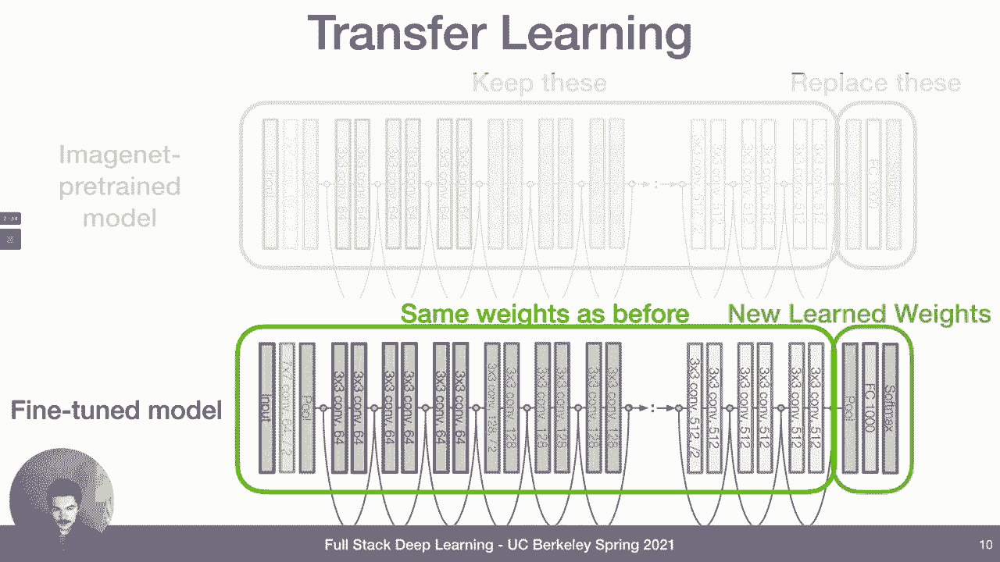

so we just learn the weights of just，those layers，this is actually pretty easy to do in in。

in tensorflow but also pytorch so i'm，showing you pythor's lightning code here。

and the thing to look at is is right，here so，transfer learning if。

you know if you say pre-trained equals，true this will use the resnet 18。

from torch vision package with the，weights that were trained on imagenet。

which are provided for us and then we，freeze the weights，of of that what we call feature，extractor。

by setting the evaluation mode to true，so we say dot eval，and this will make it so that when we。

run this network it won't store，gradients on these，on these weights and so when we take our。

training steps it's not going to，actually learn，or change these weights it's only going。

to change the weights，that we're going to add on top of it，which is maybe actually just nothing。

maybe we just have a，just a soft max or something on top of，it。

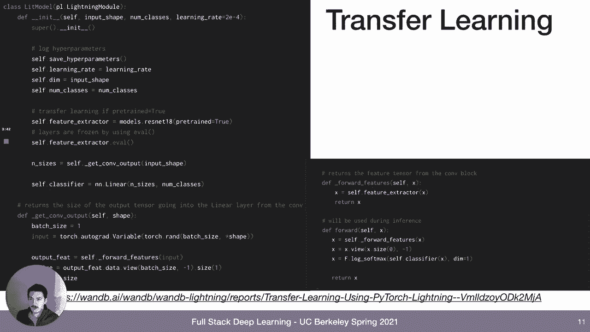

but here we have a single linear layer，the self。classifier，and there's model zooz for both pytorch。

and tensorflow and other，deep learning frameworks which make。

these pre-trained model easily available，so in pytorch you have torch vision and，you have。

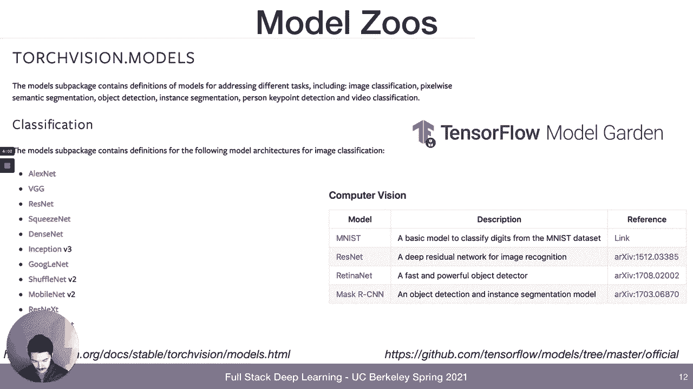

basically all the menagerie of of models，that we covered in lecture two。

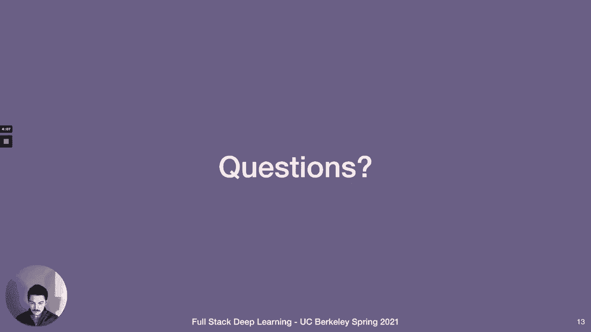

same thing with tensorflow，so moving on to the world of language。

the first thing we should figure out is，you know our inputs are words usually。

but in deep learning we deal with，vectors，so we need to convert words to vectors。

and one simple way we can do it is，what's known as one hot encoding。

and so that basically means you have，some kind of，dictionary right so like you have ten。

thousand words let's say in your，dictionary and whatever word you。

need to encode you just look up in the，dictionary and you make。

an all zero vector except there's a one，at the position，where that word is in the dictionary。

and there's problems with this i mean it，does work but，it scales poorly with vocabulary size so。

the more，the larger your vocabulary the larger，your vectors become。

by necessity and the vectors are very，sparse，and very high dimensional so that makes。

a lot of neural network，assumptions kind of not correct and so，the neural networks。

don't work as well as if they were lower，dimensional and dense，and it also just logically kind of。

violates what we know about word，similarity，right so like a word like run is going。

to be as far away from，a word like running or walk as it is，from，tertiary or poetry or you know。

so what we could do instead is we could，map basically these one hot vectors。

two dance vectors so now instead of，sparse one hotend coatings you have，dance smaller encodings。

and all you need to do for that is to，have an embedding matrix，so you have your vocabulary size but。

vocabulary size，one hot encoding matrix and then you，have your v by。

e where e is your embedding dimension，uh embedding matrix and then out of that。

you get the embedding of every word，so that begs the question how do we set。

the values of the embedding matrix，so one solution is to just learn it as，part of the task。

so you just you know that your words are，coming in as words or you know。

one-hot vectors you just slap a，you know and then that embedding layer。

before anything else and it'll actually，learn the weights just in the same way。

that it can learn a linear layer or a，cone play or anything else。

but another solution could be that we，actually learn the embedding matrix，first。

and essentially pre-train it right for，our task，maybe we can learn a really good word。

embedding that's going to be useful to a，lot of tasks，well how could we do this we could do it。

by training on a very general task，on a large corpus of text so kind of in。

the same way that imagenet，can be pre-trained on a large corpus of。

images and then apply it to a lot of，different，tasks we can maybe pre-train a language。

model on a lot of text and then apply it，to different tasks，and basically this can be done by a。

large corpus of text like wikipedia，and then a task of predicting the next，so our our inputs are。

words our task is to predict the next，word，and so our output is going to be like a。

softmax vector over our vocabulary we，can train it with cross entropy。

to form the data set for training this，we can basically，you can think of it as sliding a window。

through all the text on a corpus，and forming rows right right so like，thou shalt。

not so this would be a an m gram of size，three，or maybe this is a two gram not sure。

but anyway you slide your window of size，three over the data，and then it makes rows like thou shalt。

not and then shalt not make，not make a and so on there's also，something you can improve you can。

improve this，by doing skip grams instead of just m，grams which are。

so anagrams you just look at preceding，words skip grams you look at both，preceding。

and following words so the goal is，you know the for the word not。

your targets are not just thou shalt，it's going to be thou shalt and also。

in order to speed up this task we can，make it a binary classifier or。

classification problem instead of a，multi-class classification problem。

so multi-class is predicting the next，word，the number of classes is the number of。

words in your vocabulary and you have to，predict over basically that whole。

vocabulary sized vector but if you make，it a binary，classification then your prediction is。

always going to be a zero or one，and so your input so you know if to。

predict neighboring word your input is，just a order or an engram，and the prediction is another word。

now your input is going to be two words，and then your prediction，is yes or no like are these words。

basically in order to train the，embedding of let's say the word not。

we look at all the surrounding words and，all the words that don't surround it。

and that forms our data set the words，that surround it，have a target of one right which means。

they they are neighbors，the words that never happen next to it，are targets of zero。

and you know vector math is something，everyone's familiar with，that you can。

view these embeddings as vectors right，in embedding dimension size space。

and so you can do vector math on them，there's other relationships like verb。

tense so like if you apply，the kind of transition that gets you，from walking to walked。

you apply that transition to swimming，then you get a vector，that's very close to the word swam in。

the vocabulary，and you have relationships between，you know proper nouns like countries and，capitals。

so we talked about the imagine that kind，of based pre-training that became。

popular in computer vision，we talked about kind of old school。

language model stuff that people did up，until，maybe like 2017 with embeddings and，stuff。

and now we're going to talk about mlp's，image in that moment which is really。

combining these two trends，and that happened around 2017。so the idea is yeah you have word to vac。

and glove i just，mentioned this in an answer to a，question these embeddings became popular。

and their boosted accuracy and basically，everything by like，you know less than ten percent but。

that's very sizable in all of these，tasks，but the problem with these。

representations is that they're shallow，which means that only the first layer of。

your model right so you're building some，kind of deep learning model。

and the first layer is going to take，advantage of that pre-trained embedding。

but that's the only layer that's going，to take advantage of it，only that first layer has seen all of。

wikipedia for example，and the rest of your deep net is going。

to be trained only on your data which is，not，just pre-train more layers right so。

instead of just only training and，embedding，why why not try pre-training。

and embedding followed by an lstm，followed by another lstm layer and so on。

and so the reason you might want to do，it is because there's certain things。

in language that are just impossible to，disambiguate without a lot more context。

potentially more context than an uh skip，gram can provide，so like some simple stuff is like you。

know the word rule can be a verbal noun，there's grammar rules that would be nice，to know like。

there's actually even informal grammar，rules like how to order，adjectives describing you know color。

size，like weight and whatever have you seen，do you guys know what i'm talking about。

it's like you say pretty little thing or，something，you'd never say like little pretty thing。

because it just doesn't sound right，so all these kind of things you can pick，up if you had a more。

powerful model and that's what happened，one of the first ones is called elmo。

from 2018 they basically just had a，bi-directional stacked lstm，same thing that we did in our lab 3。

right pretty easy model and it's for the，purpose of predicting a word。

it's from the allen institute for ai，here in seattle i'm in seattle。

and it improved on state-of-the-art on a，bunch of different tasks。

pretty substantially on some of them，particularly let's look at the squad，data set。

so there's a whole you know menagerie of，data sets in nlp，here's a couple of slides just。

explaining some of them so we're not，totally lost，so squad is a q a data set。

there's a hundred thousand question，answer pairs and the answers are always，fans，in the question so。

on the right hand side you can see um at，the top like immediate。

meteor meteorology precipitation is any，product whatever，that's the source text。

and then there's a question like what，causes precipitation to fall。

and there's an answer to it which is，gravity and that board has to be part of，the source text。

so that's what squad is as a data set，there's another data set called snli，that for。

natural language inference and what that，refers to，is basically uh identifying what，relation。

exists between a piece of text and a，hypothesis，and there's 570 000 pairs of。

these kind of things so an example here，on the top row，one piece of text is a man inspects the。

uniform of a figure in some east asian，country，another piece of text is the man is，sleeping。

right and then the correct relation that，that the model is supposed to infer。

is that it's a contradiction because you，can't both be sleeping。

and inspecting a uniform so once again，elmo improved on，a lot of these there's。

another big data set which a lot of，people use called glue which is a。

really nine different tasks some of them，entailment，some of them just similarity some of。

them paraphrasing，so there's nine different tasks and the，model is supposed to give。

performance on all of them and then you，average the performance across all nine，tasks so that's glue。

so you just real briefly like it's，is the sense grammatical or，ungrammatical。

is the sentiment of the sentence，positive negative or neutral，is sentence b a paraphrase of sense a。

how similar are sons a and b，from you know one to ten are the two，questions similar。

binary judgment does sense a entail or，contradict sentence b，does sentence b contain the answer to。

the question in sentence a，does sentence a entail sends b and sends。

b replaces sentence a's ambiguous，pronoun with one of the nouns is this，the correct noun。

so it's a number of different tasks so，if a model performs well on this。

it really has a good understanding of，language that's the theory。

another one of these imagenet moment，models is called ulm fit。

it was trained by the researchers behind，fast。ai which is a great course。

that we recommend i think on our course，website they take like a hacker's，approach to，were。

among the first and maybe the first to，to apply this kind of image that。

pre-training to that natural language，their model is very similar to elma it's，it's also。

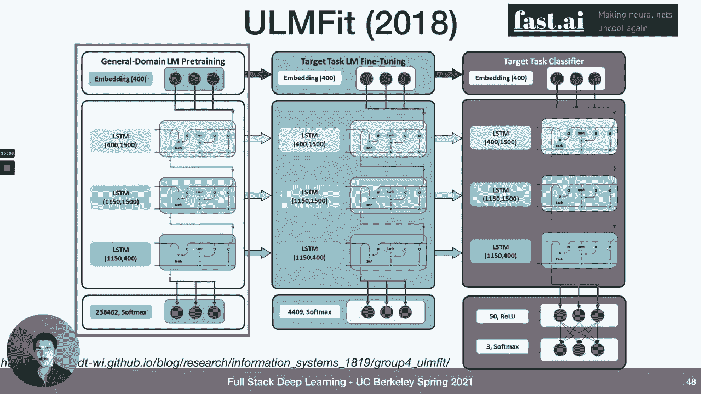

just a bi-directional stacked lstm，there's also an embedding，[Music]，and so in summer 2018。

people declared that nlp's image net，moment has arrived because this was，clearly going to be the。

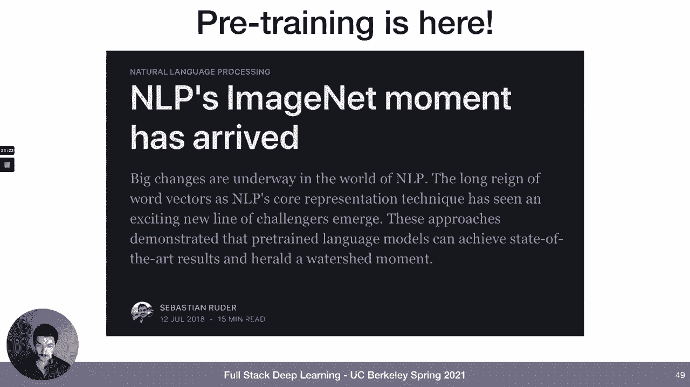

the way to do nlp tasks of all sorts，going forward，this is reflected in the model use right。

so if you look at the pi torch，and the tensorflow model zoos or model，gardens。

you now see a lot of natural language，processing pre-trained model like albert，bird。

and h nat transformer，all right well let's move on to，so one thing you might have noticed in。

this tensorflow model garden screenshot，is burt you know is bi-directional。

encoder representation from transformers，nhnet is a transformer based sequence to，sequence model。

there's a thing called transformer which，is a transformer model，and so all of these are actually。

transformers everywhere you look you，know，so what what what are they well they get，started in 2017。

with a paper called attention is all you，need，which is an encoder decoder architecture。

like josh talked about in lecture three，but with no lstms or rnns of any sort。

no recurrent neural lab works only，attention and fully connected layers。

so attention is all you need and that，approach sets state of the art。

on particularly translation data sets，actually，are but for simplicity we can focus on。

just the encoder so i，just zoomed in on just the encoder part，of the model and actually。

a lot of these transformer models that，in the model zoo like bert。

bird is actually just the encoder of，this particular paper，so the components we're going to look at。

are one，self-attention two positional encoding，first let's talk about attention in，detail so。

the basic self-attention you have an，input which is a sequence of tensors or，vectors。

your output is a sequence of tensors，each one is a weighted sum of the input，sequence。

okay so you have some x sub 1 x of 2 x，sub t，inputs and your outputs are going to be。

y sub 1 y sub 2 y sub t，but each y is just a combination，of it's a weighted comp it's a weighted。

sum of the inputs，okay and furthermore let's just say，for now that the weight。

that we're going to apply to each one of，the inputs is not even going to be，learned。

it's just going to be a pure function of，x sub i and x sub j，right so we're summing over j and then。

we're trying to assemble y sub i so，we're going to have some weight，w sub i and j。

and we can actually just say like well，that weight is just going to be the。

the dot product of these two vectors x，sub y and x sub j，and what we needed to do is we needed to。

sum to 1 over j，so that it's a proper weighted sum well，we can do that，through it。

right so we have our inputs on the，bottom the cat is yawning。

we have our outputs at the top which are，going to be just some weighted，combinations of all these。

inputs so far we have no learned weights，and the order of the sequence actually。

doesn't affect the result of the，well we can improve that first part of，no learned weights。

by learning some weights okay so，to learn weights let's think about how。

we're actually going to use each vector，x sub i，we're going to use it in three different，ways。

first we're going to compare it to every，other vector，to compute attention weights for its own。

output，x sub or y sub i we can call that query，second we're going to compare it to。

every other vector to compute，the attention weight w sub i j for。

output y sub j and so we can think of，that as a key，and then third we're gonna sum it with，result。

of the attention weighted sum and so it，and it's the same vector but we can kind。

of process it in three different ways，with matrix multiplication such that it。

can fulfill these three different roles，so specifically there's query key and。

value so we're going to say okay q sub i，is going to be weight matrix sub q。

times x sub i the key vector k sub i，is going to be weight matrix of k times，x sub i。

and so on and then we can introduce the，softmax to，make sure it sums to one but。

that's basically it so like all we have，to do is just multiply，the input vector each input vector by。

these three matrices，and then combine the three results in，the different ways。

to produce the output y sub i，this is part of the weekly reading so。

you'll have to go through this in more，detail，i'm actually not going to stop for。

questions yet there was a word called，multi-head attention you might have，noticed in the diagram。

of the of the attention is all you need，paper，and so what does that mean well that，just means like。

the multiple heads of attention just，means that，weight，matrices the query weights keyways and，heads。

then we're going to learn multiple of，these sets simultaneously，but honestly it's going to be。

implemented as just a single matrix that，just becomes，you know if you have two heads that。

matrix just becomes twice as big，if you have three heads it's three times，as big as one head。

so it's it's really quite simple but it，just means，we can learn three different or you know。

any number of different，of these transformations at once tends，to work better in practice。

and so okay so we have the，self-attention，we kind of explain that so you have。

inputs they go through the，self-attention layer，the next thing that happens is they go。

through this layer normalization layer，which we'll talk about and then they go，through a dense layer。

which is uh called mlp here multi-layer，perceptron，so what is layer normal normalization。

so layer normalization is，motivated by the observation that neural，networks really work best。

when inputs to a layer have uniform mean，and standard deviation in each dimension。

we talked about this，in the fundamentals of deep learning，lecture。

you basically don't want uh your input，data to have，like variants in one direction one you。

know one of the dimensions has a lot of，variants，and then some other dimensions have very。

little variance that's not going to work，as well，as the variance is uniform across all，dimensions。

so one way to do it when you have，you know at the you can process your，input data。

by rescaling it so that it has zero mean，and uniform standard deviation。

you can initialize your weights in such，a way that，their out their outputs also have this，property。

but as inputs kind of flow through the，network，no matter how good your weight is in。

this initialization is，your means and standard deviations are。

going to get blown out kind of later on，in the network，so layer normalization is really just a。

hacky way，to like hard reset things to where we，want them which is uniform mean and。

standard deviation，in between layers that's kind of all you，point。

it's like just the hack that we insert，to just reset mean and variance to。

uniform and you can insert it in between，layers，however you want and it tends to improve。

things in practice but i'm not aware of，okay so so far we，understand that we can combine input。

vectors，to produce attention weighted output，vectors，and we can do this in a good way by。

learning these query key and value，weights，and we can do it even better by learning。

multiple sets of such weights that's，called multiple heads，but we still have the problem where the。

order of the inputs，has no effect at all on the result of，so what we can do is we can encode each。

vector with，its position so we have a sense this，movie is great。

each word is embedded as a as a dense，vector here of size three。

and you go through transformers and you，you produce an output sequence，okay so position embedding。

is something that we're going to，literally add to the，word embedding so word embedding does。

not depend on position，right it only depends on what the word，actually is。

the position of heading only depends on，the position in the sequence it does not。

look at what the word actually is and，then if you combine the two。

now you have a vector that has both，content signal from the word embedding。

and position signal from the position，embedding，and so now when you have when you run。

those vectors through the transformer，blocks now the transformer attention。

can actually reason about position as，well as content，and it really seems like way too simple。

but that's really all it is it just，okay and then lastly there's the last，trick in transformers。

which is if we want to train something，that predicts，the next word or hear the next character。

in the sequence，there's a problem because we actually，send all of our inputs。

to the transformer at the same time，and so if you wanted to predict，something。

that you know that's part of the input，that that's you need to do something。

extra which is basically mask the future，so it's called adding a mask，so you have your inputs the。

inputs get computed or you can compute，attention weights over the inputs。

through the transformer blocks and then，you can apply，a future blocking mask to those weights。

and this way the transformer is only，able to use attention，from the past right so it only can look。

at things，that happen previously to what it's。

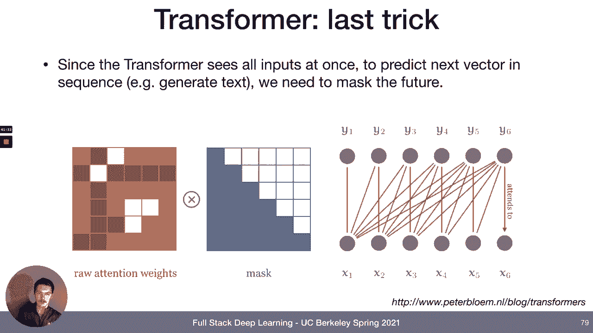

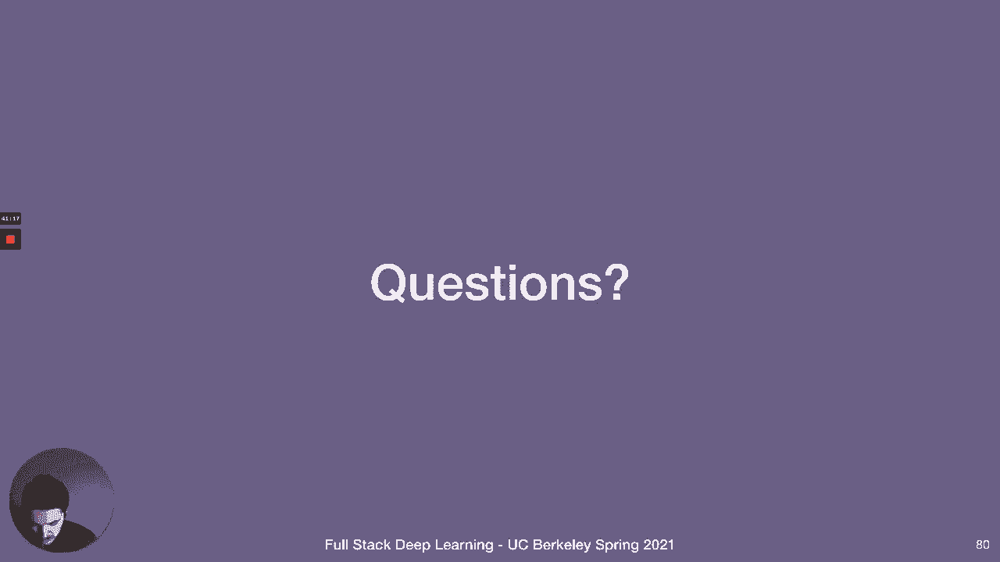

okay that was a lot you guys are really，going to have to do the reading。

yeah attention is kind of hard to，understand and really helps。

just uh doing the reading this week it's，called transformers from scratch。

just really do you know that whole kind，of tutorial in depth，but i really it's like one of those。

things that，when you realize that it's not it's like，simpler than you thought。

that's when you kind of try to start to，get it at least for me。

okay so attention is all you need from，2017 is a paper that applied。

this architecture for the first time，they applied it to the task。

of translation right so like english to，french，and so on and they have this encoder，decoder。

architecture where there's an encoder，what we've been looking at。

and then the output of the encoder goes，into the middle of the decoder which you。

can see on the right，and then also the correct outputs go，into the decoder。

and then they get kind of added together，via transformer，and then you can predict the how to。

so later models made it mostly either，just the decoder or just the encoder。

except for t5 which we'll talk about in，a second which is back to。

having both an encoder and a decoder but，gpt and gpt2 and gpt3，stands for generative pre-trained。

transformer，why generative well because it learns to，predict the next word in the sequence。

right it's generating text basically，just like elmo and ulm fit except elmo，and ulm fit，used lstms。

they use the embedding layer and then，lstms gpt，uses an embedding layer and then。

transformer layers so they just switch，words，just like an engram not a skip gram。

and so it uses this mask that we，discussed，to basically mask the future from the。

transformer so we can only pay attention，to，preceding words when it tries to predict。

the original gpt was trained on eight，million web pages，or no maybe that's gpt2。

i'm not sure there's also all these，variants there's gpt too small。

gpt to medium large extra large there's，obviously no gpt3 which i'll，i'll have a slide on later。

but they're called large or extra large，because the number of parameters that，are in them。

i think they're all trained on the same，data which are a bunch of web pages on。

reddit particularly pages，you can use gpt2，pretty easily like i think even on。

collab you can run it there's also talk，to transformer，that uses the 1。5 billion parameter。

model which is the，extra large i just typed it today full，stack deep learning is a uc berkeley。

course about，says deep learning and neural networks，first taught at hcs and fall 2016。

and then at hcs in spring 2017 which is，not true，this course requires a light to moderate。

understanding of computer science，preferably cs for computer science，majors。

so it's really not that good right it，doesn't sound like great text。

okay then there's a paper called burt，which，stands for bi-directional encoder。

representation from transformers，so as you can imagine gpt is，not bi-directional right it's。

unidirectional it uses masking，to mask out future tokens so that it can，predict them。

burt is bi-directional so there's no，masking right when you feed it。

input it uses the whole all the tokens，you give it，and how do you train it then well what。

you do is you mask out certain words，so you can mask out words in them so you。

you have your text like wikipedia，you take let's say you know five token。

sequences and you mask out the middle，one so now you have，an actual word an actual word then a。

mask token then an actual word an actual，then an actual word and you feed that，predict。

the content of the masked word and then，they switch it up they also have。

bird predict whether one sentence，follows another，and i guess that's just so that it kind。

of like trains on a variety of tasks and，not just this one，mask prediction bird had 340 million。

parameters，24 transformer blocks embedding size of，1024 16 attention heads，[Music]。

and in general you know all these，transformers are growing in size。

right so starting in spring 2018 we had，elmo，which is not even a transform model but，we had gpt。

kind of the beginning of summer 2018，for 10 million parameters and then gpt2，had，1。

5 billion parameters，and then you have megatron lm from，nvidia t5 from google touring nlg with。

17 billion parameters，that's a person saying you know the the，number of parameters too damn high。

but t5 is worth a look came out in，february 2020 so，uh sorry 2020 it's the last year about a。

year ago，and basically what they did is they，evaluated like，all the things that people tried in all。

the different transformer，papers they ran like a big hyper，parameter search。

over all of the things that they，identified that were different between，papers。

and they have both the input and the，output as text strings，so the the input task definition is。

actually provided also as test，as text not as some special token or，anything。

right it'll just actually say like what，the model is supposed to do as part of，the input text。

so it could say like translate english，to french，then the english language sends and then。

the output is going to be in french，or it can say does sends b entail from，sentence a。

sentence a text sends b text and then，the output is going to be。

like t or f like true or false it had 11，billion parameters，it's trained on this colossal clean。

crawled corpus，c4 which is 100 times larger than，wikipedia this is work from google by，the way。

and it said state of the art on glue，which we've seen squad which is which，we've seen and then。

this thing called super glue which is，another data set that's supposed to。

solve some problems that glue，has so it's really cool，definition，f text and you get all kinds of，in。

these are just some quotes about what，the researchers found in the paper so。

they actually found that the，encoder and decoder architecture，together。

is is better than either just encoder or，so that's why it's formed that way。

so if we look at gpt-2 it had 1。5，billion parameters t5 now has 11 billion，parameters and came out。

about a year ago gpt-3 came out，at the beginning of last summer and it，had。

so it's 200 000 million so 200，it all it had about 175 billion，so microsoft tiering energy had 11。

billion gpg3 had 175，billion parameters and，openai published the paper about it but。

they did not release the pre-trained，weights，citing societal concerns right like this。

technology they believe，can be misused for for ill，and so they only allow access through，their。

https api which you can request access，of course it's not going to stay you。

know that way forever there's open，source efforts like this，luther ai to basically train the gpt3。

architecture on the same data that open，ai did，but then release the weights publicly i。

think they target，this summer for like releasing the，weights so it will happen。

it is really good text generation here's，a funny example，that we fed in a couple of。

actual instructor quotes about，and then we had gpt3 provide，you know some fake instructor quotes。

about great scope which are actually，really good，you know like the gpg3 writing is。

is not in bold so it says administrative，contact for，grade scope license at university of。

kentucky i'm fairly new to the role but，i had several people tell me the。

features for grade scope are amazing，and how flexible the grading works for。

our classes grade scope has saved a lot，of time for our staff and helps us。

communicate with students when grades go，up，which is like something that a person，could say so。

it's very impressive，yeah i mean there are problems there，are problems with like the quality。

there's also problems with the content，of what gpg3 puts out which is part of，the reason。

why open ai you know held back on the on，the trained weights，and so this is a quote this is a tweet。

from the head of，the head of ai research at facebook，jerome byzanti。

and yeah he just seeded gpt3 with some，words like，like jews and then they got stuff like。

jews love money，which is is perpetuating things that we，don't want to perpetuate。

right that are present in the in the，source data that gpt3 was trained on。

but you know we as a community need to，make more progress and understand，how to not have our models。

basically put out stuff that we don't，want them putting out，and that's a hot topic of research right。

now，and is like a big reason for why openai，didn't release the weights。

and we'll see what happens when the open，source weights will be released。

i think a reasonable mental model of，gpt3，is you know it kind of performs like。

a clever student who like can put，together words in a way that reads fine。

mostly and is actually kind of factual，right so it's like they have you know 30。

seconds to just like google something，and then bs their way through。

plus some exam question so you'll get，things that are actually true。

right like things that gpt3 knows from，being trained on basically the internet，like factual。

information about for example grade，scope right，or you can even try your name and like。

know certain things about you，but and it reads fine at first but then，doesn't really。

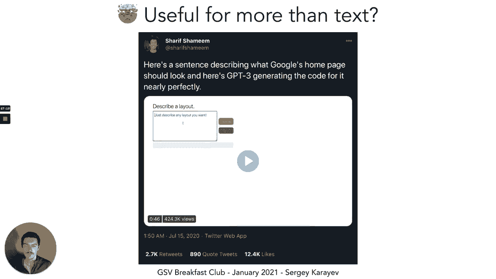

quite make sense what's really，interesting though is that it might be。

they，fine-tune gbg3 or it's basically，fine-tuning they provide，how descriptions of layouts map to。

basically html code，and now they're able to describe a，layout and gpt3 will generate stuff。

well it'll generate actual code that，they then render on the right，and it looks fine。

so this like really blew a lot of。

people's minds when when。

oops one thing that i really like。

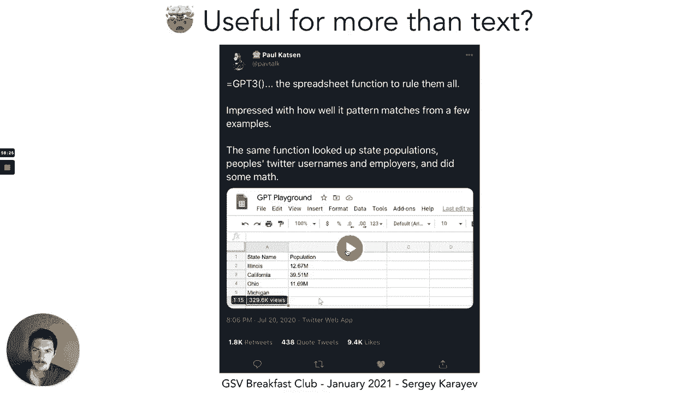

as an idea is using gpd3 as like a。

so here's a little demo，okay so what happens here so the way，gpg3 works。

is you can provide basically beginning，text like source text，and then a prompt and then it'll。

continue writing，and so the purpose of that beginning，text，of，output that you expect right。

so what this person did is they，pretty cleverly connected it to a。

so first they provide this this is kind，of like the source text，and then。

the gpg3 output is going to be in the，cell that's loading currently，and it's 10。31 million。

and so now they can change the prompt，leaving the source text alone，and it changes the output and so。

gpg3 knows a lot of facts because it's，trained on a corpus，that contains a lot of facts and when。

prompted in this way it's actually able，to like give you back those facts，life。

on whether these answers are correct，[Music]，absolutely you know no i you know i。

wouldn't because that's one part of the，problem，you don't know it doesn't give you like。

a confidence right it just gives you the，answer，and the answer might be right or might，not be。

so we're kind of far away from like，putting it in a production use case。

for stuff like this but it's a very，know，moving in that direction with our。

and furthermore you can actually use，transformers for image generation。

so just recently i think like a month，ago openai released，what they called dolly a 12 billion。

parameter version of gpt3，trained to generate images from text。

descriptions so they had a data set of，text to image pairs，and they found that the model that was。

trained has，ability to generate images that have，never been seen before。

in the data set so for example a，storefront that has the word open ai，written on it。

like that is not in the data set because，that doesn't exist，and yet dolly is able to generate images。

that are quite，realistic looking that，so seems a little scary right like are。

we barreling towards like，strong ai with these transformer-based，models，kinda there's real。

there's no sign of like performance，slowdown，this is this is a plot from the gpt3，paper。

and so on the on the y-axis is accuracy，on the x-axis is the number of examples，given。

to the model and then the different，colors，are for the different models right so，you have a 1。

3 billion parameter model，a 13 billion parameter model and then。

gpt 3 the 175 billion parameter model，and as you can see performance like is。

increasing substantially between these，order of magnitude，improvements in the number of parameters。

nothing else about the architecture is，changing，right it's just making the model larger。

and you get these crazy accuracy，improvements，and you can imagine that it's only at，you know 60。

accuracy now if you make it a 175，trillion parameter model you know i，don't know。

and in fact just recently you know，google released this model called the，switch transformer。

which i don't even know what that is，i think it's like one point 1。6，trillion parameters。

and the point of the switch transformer，is that a lot of the weights are sparse，i believe。

and i i'm not aware of like really，impressive demos just yet of this model。

you guys should speak up if you are but，the point is like we are now able at，least to train。

these models another thing i should，mention about gpt3，is that it took it potentially like it's。

it's unclear exactly how expensive it is，to train but，it takes several thousand gpus to train。

it takes definitely like a month or or，more，to train it to completion so that's very，expensive。

in cloud compute costs which probably，explains，the you know exclusive partnership that。

microsoft has with openai，you know access to cheaper compute，i think the estimate that we've seen is。

like several million dollars per，training run，because，the way these things are trending it。

seems like only big companies can afford，to compete，in these tasks right in natural language。

processing and now also potentially，vision，and you can see that even from like a。

year ago if you look at the glue，benchmark，leaderboard if you just look at。

who the teams are it's baidu alibaba，google microsoft huawei microsoft。

facebook ai and so on right so where are，the research labs，there's another direction to go in you。

can try to do more with less，and so one example i like to give of，this is called distilbert，use。

a technique called knowledge，model，on a large dataset and then training a，small model。

not on the data but on the output of the，larger model，and we talked about this when we talked。

about potentially defeating，adversarial examples this could be one，of the paths to take。

it's also a way to just have smaller，models and so distilbert。

is able to retain 97 of bird performance，at something like you know it has 66，million。

parameters and bird has 340 million，parameters，so substantial you know decrease the。

number of parameters but，basically no drop in performance so this，could be one research direction。

that people without crazy huge resources，can pursue，if you want to keep up with the stuff i。

always recommend papers with code，there's also nlp progress by a sebastian，rooter。

that kind of tracks all these recent，state of the arts，and then transformers is the undisputed，king。

of just implementing all the transformer，models and making them available，website。

through their python package it's based，on，i think it's it's compatible with both。

pi torch and tensorflow i think it's，mostly，based on pi torch at this point but。

there's a lot of pre-trained transformer，models here in hugging phase。

so all this stuff about scaling，up with you know scaling up accuracy。

with just increasing the number of，parameters，is what rich sutton who's a。

reinforcement learning pioneer，and the professor at university of。

alberta he called the bitter lesson，right so the bitter lesson，of of of ai research。

is that it seems like you don't need，that much human ingenuity，in the methodology like once you find。

the thing that，that works you can continue scaling that，thing up and that thing for us right now。

is neural networks，and specifically transformers so you，just scale that up。

and that beats like any kind of，ingenuity improvement that we've been。

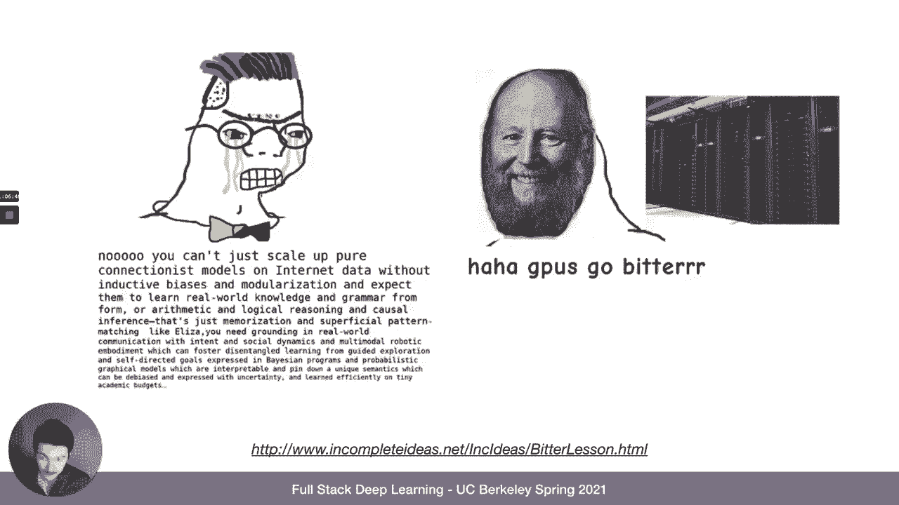