# P11：L5- 机器学习项目 - ShowMeAI - BV1iL411t7jE

this week really starts the kind of the，meat of the content of this class。

which is really focused on like，everything that you need to know about。

turning machine learning projects into，like working production systems，other than training models。

and so to start off with we're going to，talk about setting up machine learning。

projects right so how to how to pick，projects and how to set them up for，success。

so i kind of like this characterization，of machine learning projects in part。

because it's so out of date，so this is an xkcd cartoon from not that。

long ago which kind of makes this this，clip that like，you know if you if you try to articulate。

to someone outside of computer science，like what's，what problems are still hard in cs it，why。

why like why should it be so hard to，recognize a photo of a bird。

but kind of the funnier thing about this，to me is that this is now so comically。

out of date right like i think for for，all of us who have，uh spent time in the machine learning，away。

and so i think it articulates how，difficult it could be to understand what。

problems are going to be challenging in，machine learning，another statistic i'll point you to if。

you spend time looking around the，production machine learning world and。

blog posts and stuff like that，you'll see this statistic come up 85，percent of ai projects fail。

i've seen it attributed to different，places and that sometimes people say 87，know。

maybe not so important to actually you，know know that the exact numbers and the。

statistic because i'm not like，not even totally sure how they came up。

with it but i think it kind of captures，the sentiment，that is out there which is that it's。

really really hard to make machine，learning projects work in the real world。

and the more interesting question is you，know whether it's 85，or 50 or whatever why are so many。

so i think there's kind of like one core，reason which is that，you know machine learning to a large。

extent there's a lot that we can do to，make it feel more like，engineering but in reality machine。

learning projects are still，to some degree some varying degree，research projects。

and so 100 success rate shouldn't really，be the goal right like you should be。

trying some stuff that isn't gonna work，um otherwise you're probably not being，ambitious enough。

but i do think that many machine，learning projects are doomed to fail，from the start because。

for example they're they were never，technically feasible to begin with or。

they weren't very well thought out and，they're they're poorly scoped。

you know the projects kind of get stuck，in proof of concept phase。

they have a cool working demo but the，demo never makes it to production。

or you know the demo makes it to，production but it was it's never really。

clear like what the success criteria for，the project is，so never gets greenlit or you know all。

this just kind of falls apart because，the team is managed poorly to begin with，and so you know。

so we're gonna we're gonna talk about，some of these things and how you can。

avoid some of these problems when you're，picking and scoping machine learning。

so what we'll cover today is we're going，of，a machine learning project and so this。

is really just meant to like get your，help you wrap your mind around all of。

the activities that you're going to need，to think about if you're building an。

end-to-end machine learning project，then we'll talk about how to pick。

projects right so how to prioritize，which projects，you should work on which will boil out。

down to assessing the feasibility of，projects and their，and their potential for impact and then。

we'll talk about a few different，archetypes of projects，so different categories of mission，on。

and what the implications of those，categories are for，how you might think about managing those。

projects，then we'll talk about metrics and so，metrics are kind of the numbers that you。

look at when you're，optimizing the machine learning model，how to pick why it's important to pick a。

single metric，and how to pick that metric，and then finally we'll talk about。

baselines and so and so baselines，are essentially a way of really。

understanding whether your model is，performing well or not，and so these last two are are things。

that you should have in place before you，even start you know training models as。

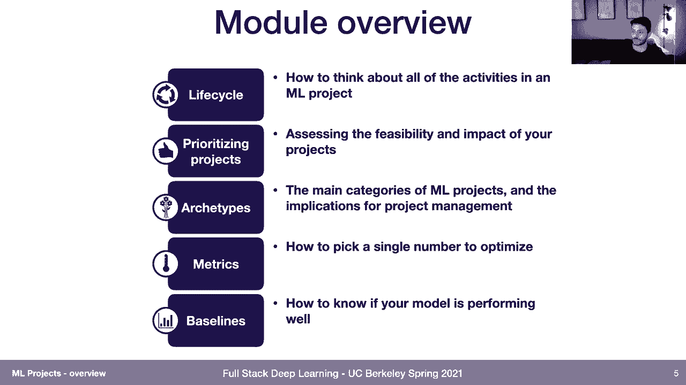

and throughout today we'll we'll keep，coming back to this running case study。

so the case study is pose estimation and，this is kind of inspired by a project i。

actually worked on an open ai，but the idea is that you know we're。

we're hypothetical robotics company，and what we're trying to do is we're。

trying to predict the pose of objects，from an image of those objects。

so the input to our model is you know，one or more images，um of some indoor scene that the robots。

can interact with。

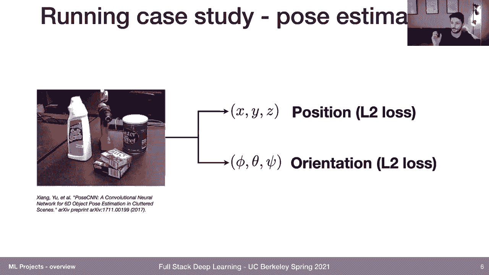

and what we're trying to predict is the，position and the orientation of all the。

and so why why is this important right，so you know，throughout this running example the。

we're working on this company called，full stack robotics and we're working on，robotic grasping。

and the way our system works is that we，have two different models。

that that we're using the first is the，takes，images as input and produces you know。

state of the world，so the positions and orientations of，objects in our case and then the second。

component of the system is the grasping，model，which is you know takes those raw。

positions and orientations as input，and produces motor commands for the，robot to actually。

go and execute in the world and you know，you might ask why，why is this split into two components。

instead of learning this model end to，end，and this is a bit of an aside but one of。

one of the reasons that a lot of，robotic system systems in particular，self-driving car systems etc。

are split and are not just actually，learned end-to-end，you know using reinforcement learning or。

something like that is，you know a couple of the main reasons，are data efficiency so it can be。

it can be cheaper in terms of the amount，of data that you need to have in label。

to build a system like this and then，auditability right so，if you have a model that just regresses。

images against motor commands then if，something goes wrong，right if the robot takes the wrong。

action it can be really hard to diagnose，what actually happened and so in the。

real world a lot of robotic systems are，split like this where。

there's a task of state estimation where，you try to predict like what is the，state of the world。

and then on top of that there's a task，of control right so given the state of。

the world what action do we want the，robot to take，and and so that's why the system is。

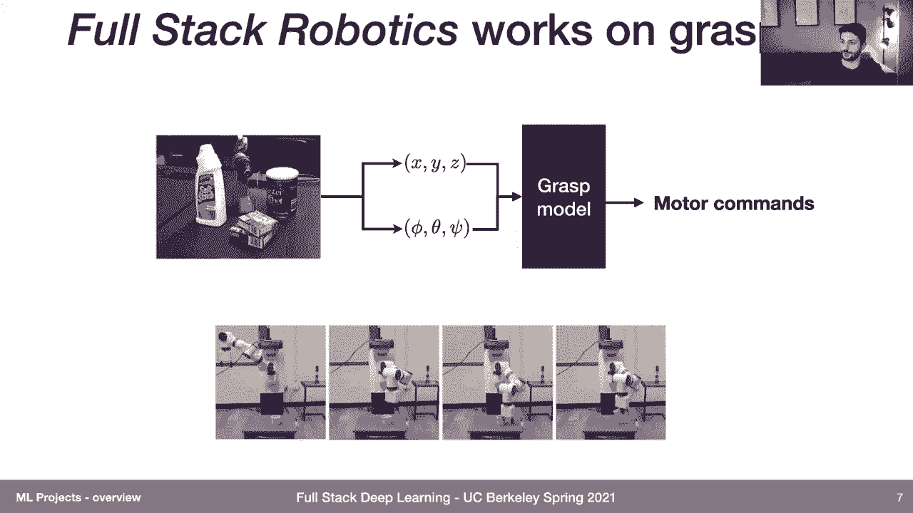

all right so so diving into the the main，content of the lecture。

so first thing that we're going to talk，about is how to think of the life cycle。

of a machine learning project so all of，the activities，that go into creating a project with。

this so the life cycle of a machine，learning project really starts with。

this planning and project setup base，might，you know decide to even work on close，estimation at all。

determine what our requirements are and，what the goals are for the project。

allocate resources to the project you，know maybe this is less relevant for。

this project but in other projects we，might consider the ethical implications。

of the work that we're doing，et cetera and so once we have a plan。

then we'll move into the to the data，collection and labeling phase。

and this is where we might collect the，objects that we want to train our model，on。

set up our sensors like our cameras and，start capturing images of the objects。

and then figure out some way to annotate，those images of ground truth which in。

this task might be kind of difficult，one thing to know about the life cycle。

of machine learning projects is that，i think the right way to think about it。

is that machine learning projects are，not a linear flow from。

you know project planning all the way to，deployment they're actually a loop。

and each of the stages there's a bunch，stages，as you learn more about your project or。

as you collect more data，so you know you might loop back from the。

data collection phase to the planning，and project setup phase because。

for example maybe you find out it's，actually you know it's really too hard，to get data for。

the tasks that we're working on so maybe，let's actually like try to refine this，task or。

pose the task differently so that we can，make our data collection and data，labeling process easier。

once you've collected and labeled data，then you move on to the trading and，debugging。

phase and so this is what i think most，people think of as machine learning。

but you know here you might do things，that are outside of the，you know what you what you normally。

think of in training deep learning，models，so you might actually implement a。

baseline model that is not using machine，some，opencv functions but you also might do，things like。

figuring out what the state of the art，is and trying to reproduce that。

you'll probably spend a lot of time，debugging in this space and we'll have a，whole lecture on。

how to make that process less painful，and then thinking about how to improve。

the model right so once you have，something that kind of works，trying to come up with better better。

model architecture or something along，those lines but also fit into this space。

so trading and debugging can loop back，into the data collection phase。

for example you might need to collect，more data if your model is。

is overfitting or you might realize that，for example like，something about your data labeling。

process is unreliable so you're able，unable to get good results and。

one of the reasons why might be that，your labels are inconsistent。

you can also loop all the way back to，the planning and project setup phase。

so you could realize that the task，itself was just way too hard to begin，with。

you could also realize that some of the，requirements that you specified in the。

the planning and project，setup phase trade off with each other so。

for example a lot of times accuracy，trades off with，latency so you might actually need to。

get a model that's too big，in order to in order like to run in real。

time in order to solve the tasks for the，accuracy or environment that you had。

and so it might be important to go back，and revisit which of those requirements，were important。

and then finally once you have a trained，model that you think is good enough then。

you'll move into the deployment and，testing phase and so in this phase you。

you know you might run a pilot so in our，case we might，run our grasping system in the lab and。

then you'll also，test your model in this space so we，might write regression tests to。

to prevent you know any any future，changes from breaking things that are，good about our model。

and we might also write tests to，evaluate our model for biases，and then once you know once you have。

your your pilot done and your tests in，place then finally you'll roll your，model out of production。

but your job is actually not done here，so you could，you know in a lot of cases you'll need。

to loop back to the training debugging，phase，so you might realize that even though。

your model worked on your evaluation set，just fine，it doesn't actually work in your pilot。

it doesn't work in the lab，so you might actually need to keep，improving the accuracy of your model。

you could loop back to the data，collection and labeling phase so，maybe there's some data mismatched。

between the data you trained on and the，data that's actually seen in production。

there's some distribution shift，and you could go back and fix that you。

could realize that you actually need，more data you were you know you were。

overfitting somehow and so you need to，go collect more data，or there might be some edge cases that。

come up when you're deployed in，production that you didn't know about in，advance。

and so you could go try to mine hard，cases and，and maybe collect edge cases to retrain，your model on。

and in some cases you actually have to，loop all the way back to the project。

planning and setup phase so，for example if the metric that you。

picked doesn't actually drive downstream，performance，so for example like if the metric that。

we picked was was accuracy of the，grasping model，but it turns out that you know having。

the the grasping model be accurate is，is not really enough like that doesn't。

actually make the accuracy of the pose，estimation model isn't really enough。

like that doesn't actually make our，grasp more successful because for。

for example maybe we need more robust，estimates of the uncertainty of that，model。

you might have to go back and rethink，the the planning of your project。

due to that or you might realize that，the performance in the real world just，isn't that great and so。

you could you could revisit your，requirements and say like okay what did。

we get wrong about those original，requirements that we should，take into consideration。

so these are activities that you'll do，during a machine learning project that i。

would think of as like on a per project，basis but，there's stuff that as a machine learning。

team you'll need to solve，across all of your projects as well and，so there's。

you know building the team and kind of，hiring great people managing those，people。

and then there's setting up the，infrastructure and tooling that you need。

in order to actually do this stuff，repeatedly in that scale，and so we'll have we'll have lectures in。

the course that cover each of those as，all right so that's also not all that。

you need to know it's also important to，to have some sense of what is state of。

the art in your domain，right so what's what's actually possible。

to solve using machine learning right，now，and you know if you're really deep in。

your domain you might this might be，how you decide what to try next and so，we'll also。

introduce some of the most promising，research areas in，you know we talked a little bit about。

kind of basics of，some of the most common deep learning，tasks in the past few weeks。

and towards the end of the class peter，will give a lecture on，promising research areas that you that。

are worth keeping up with if you want to，understand。

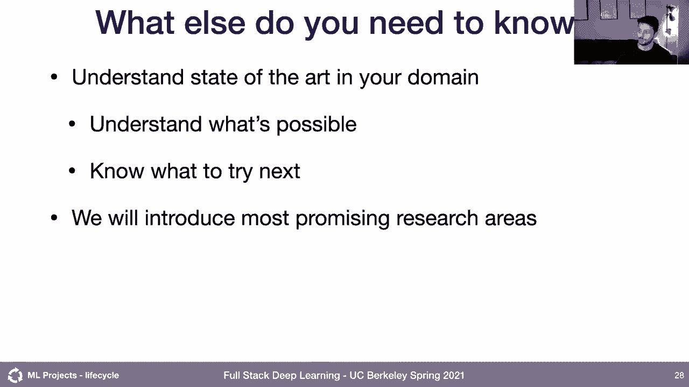

what's possible in machine learning，okay but to summarize this is kind of。

how we think of the life cycle of a，machine learning project，and more or less the rest of the course。

will be oriented around，trying to give you um tools and，techniques and ideas for。

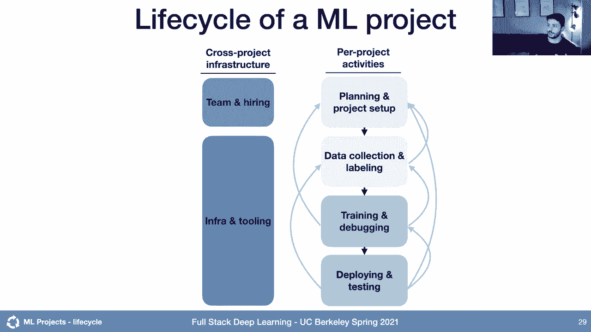

dealing with each of these different，so next we're going to talk about how to。

prioritize machine learning projects，and so what this is going to boil down，to is finding。

problems that are potentially high，impact to work on，and then trying to assess what the cost。

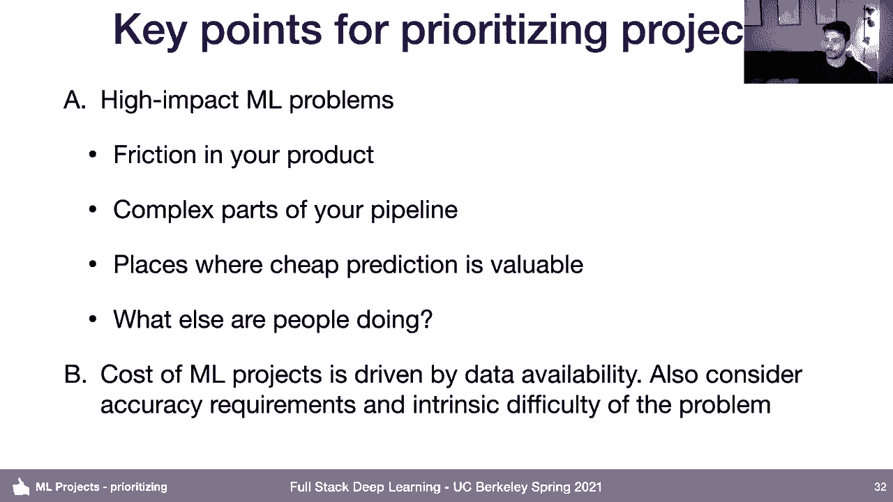

of those projects might be，so to double click on that a little bit。

this is you know a general framework，that you can think about for how to，prioritize projects like。

nothing machine learning specific here，but one way to think about project，prioritization is that。

you want to look for things that are，high impact or potentially high impact。

and are also relatively feasible right，so those are the two axes that you might。

measure potential projects along，and you know you might plot your。

projects on on this kind of two by two，and then the ones that are in the upper，right corner。

there's the ones to go and trap right so，it's not necessarily an exercise you，actually need to do。

but one way to think about picking，projects is，looking at what makes projects。

potentially high impact and what makes。

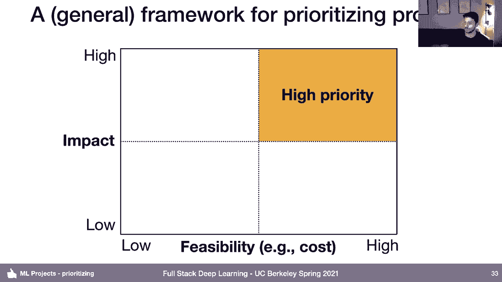

them feasible，so i think there's no kind of silver，bullet answer to finding high impact。

machine learning projects it，depends on your use case and it's just。

generally hard but i do want to give you，a few mental models for how to think，about。

what types of machine learning projects，might be high impact。

and so the four i want to talk about are，where can you take advantage of cheap，prediction。

where can you automate complicated，where's their friction in your product。

that you might be able to automate away，where can you automate complicated，manual processes and then。

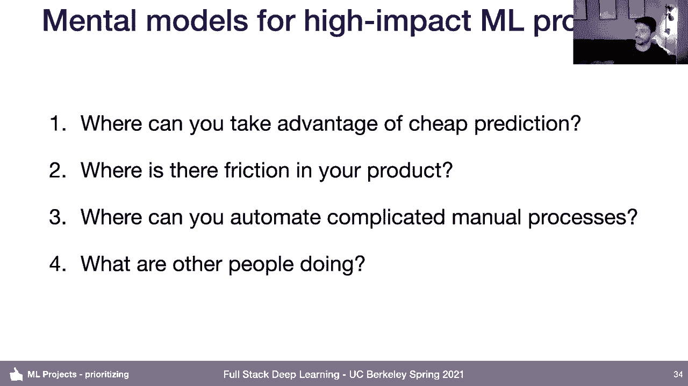

you know the the easiest one maybe is，like what are other people doing，is。

through economics so there's this book，called prediction machines，level。

what ai enables you to do is it，reduces the cost of prediction right so，you know where。

a certain type of prediction might have，required like an expert to spend their。

time to make this prediction，you know machine learning allows you to。

like basically automate that expert，into a system that you can run very，cheaply and so prediction is。

essential for decision making and that，means that if you have really cheap。

prediction then predictions give me a，lot more places，even for problems where it's too。

expensive before right like，most people couldn't like hire a private，driver before。

and so the implication of this if you，is，to look for projects where cheap。

prediction could have a huge business，impact，right so it's a mental rule that you can。

think that you can think about when，you're looking for high priority。

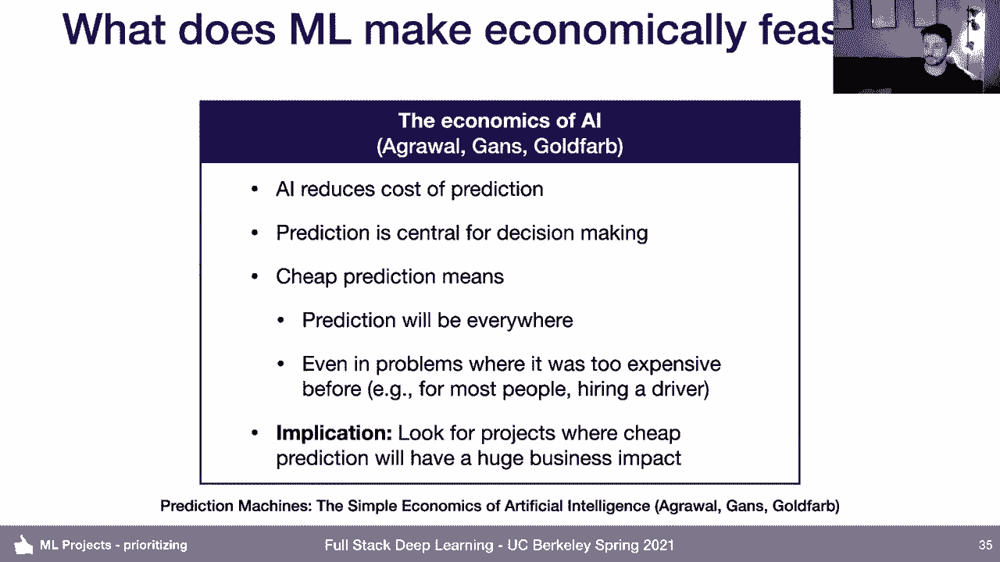

projects，another lens i think is worth looking at，is thinking about it from the lens of，need。

and so this is from an article by，spotify which i think of this kind of，being like one of the best。

machine learning driven products and，i'll i'll link to this article。

in a few slides but the thesis that they，lay out is that，you should really be thinking about。

machine learning projects from a product，perspective and you should be looking。

for parts of your product experience，that are high friction，and automating those points of high。

friction are exactly like where，there's a lot of impact for machine。

a third heuristic that you might use is，you know，in addition to thinking about like the。

abstract economics of what ai enables，and like what could make your product。

better maybe we should just think about，like what is machine learning actually，good at。

like where you know what what are the，nails that this that this hammer。

can actually hit and so for this i like，this this，software 2。0 blog post by andre kurpathi。

and you know i think he sums it up，nicely in a tweet which is uh。

gradient descent can write better code，than you it's very nice。

to apologize for for insulting my code，like that，but to dive into this a little bit more。

the case that andre lays on，this blog post is that what he frames as，software 1。

0 is kind of what most of us，would think of as software right so，traditional programs that have。

explicit instructions that are in most，cases written by a human，paradigm。

where humans instead of writing code，specify goals，and then an algorithm that searches for，a program。

that solves those goals and，instead of working with code software，2。0 you know programmers。

instead work with data sets and those，data sets get compiled into programs via，optimization。

and you might ask like why do this right，and and the answer，at least according to andre is that it。

just works better you know gradient，descent can write better code than you。

but in addition to that it's it's also，more general in some sense because。

we can teach computers to do things that，we can't easily articulate as rules，ourselves。

and there are also computational，like，all these complicated control flows in。

our programs they're all just matrix，multiplications that we can design，better hardware。

to to suit those types of computations，better，and so you know putting on our project。

selection hat here the the implication，of this mental model is that you should，look for。

places in your product where，or you know the whatever you're working。

on where there's kind of complicated，uh rule-based software where instead of。

having people design these complicated，roles themselves we can instead just，learn these rules。

via data so that's another another way，you can think about picking machine，learning projects。

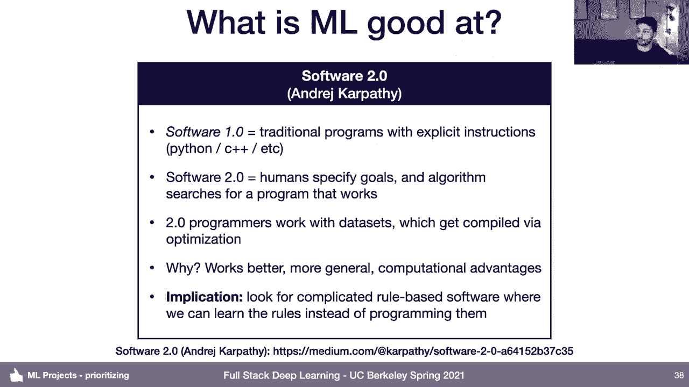

or which projects might be high impact，another way i think is like you know。

that is worth mentioning is that，just the copycat approach right like why。

why reinvent the wheel like if you're if，you're working a company。

then in most cases like uh your company，has a lot of similarities with other。

companies so like let's just look at，what other companies are doing。

so a couple of resources on this i like。

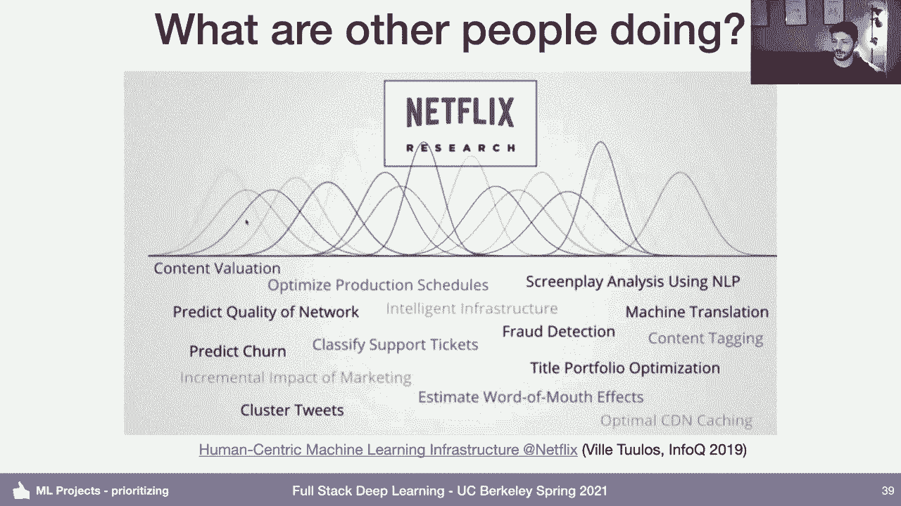

netflix research published a，talk where they talk about a lot of the。

different use cases of machine learning，within netflix，some of which you can see here which i。

recommend checking out，this is from an industry report from a，machine learning tools company called。

algorithmia，where they they surveyed a bunch of，machine learning practitioners like comp。

people in bigger companies mostly about，which use cases of machine learning，they're actually。

they're actually deploying and one，interesting thing to note here is。

how low all these numbers are right so，that the largest one is，38 37 so。

the the overall penetration of machine，which，which i think is interesting but also。

the categories that people are working，on are interesting as well so there's a，lot around。

you know reducing costs which i imagine，is probably mostly stuff like。

eliminating manual work around like，document review and things like that。

generating customer insights and，intelligence，so things like you know trying to。

predict whether you're，whether your customers are going to，churn or not improving customer。

experience，this is like to me kind of the most，exciting category right because this is。

like actually building，better products through machine learning。

but then also a lot around like kind of，internal，process automation and more around like。

this customer，this this efficiency thing so this is，this is another lens into what other。

other people are able to get to work in。

you can also look at papers i think you，know the caveat here is that。

very a very small percentage of papers，are actually like productionized and。

deployed in the world but you can look，at papers from kind of like the big tech，companies。

many of which are actually used in the，real systems that they deploy。

you can also look at blog posts mostly，from earlier stage companies most of，these companies。

aren't really publishing a ton of papers，about what they're doing but often their。

engineering blogs have good case studies，and so this is this is a list of 10 case，studies on。

you know making machine learning work in，the real world different companies that，chip win。

compiled and i would recommend reading，through some of these as well to get to。

get ideas about what types of things。

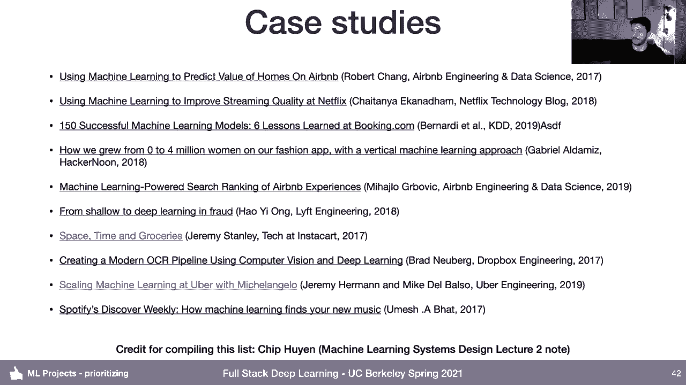

useful，all right coming back to our framework，about，some ways that you might think about。

assessing the impact of projects，and then the other the other access here。

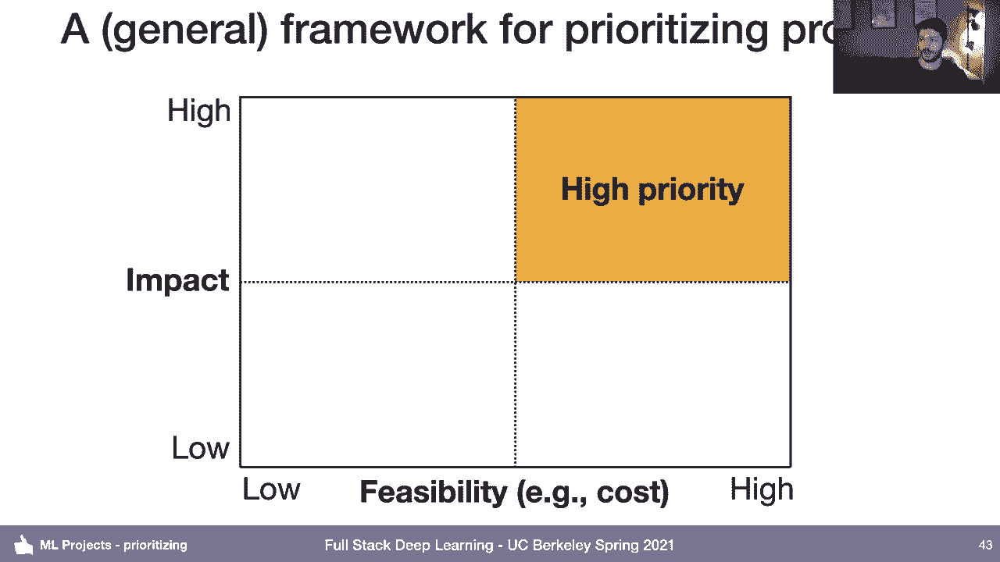

is feasibility right so，how do you know how feasible a machine，much，of。

the three main kind of cost drivers of a，machine learning project。

as you know in order of importance being，data availability，most important accuracy requirement of。

your project，and then the you know the intrinsic，difficulty of the problem itself。

so let's let's talk more about each of，these，so within data availability the main。

things to consider to tell whether，you know data availability is going to。

be a is going to be a big problem for，your project is，you know how hard is it to acquire data。

in the first place，how is how expensive is it to get that，data labeled。

how much data are you going to need to，to solve your problem，which can be a hard thing to assess but。

you know and sometimes，benchmarks can help you there how stable，is the data。

right so if you're working with data，that is never really going to change，like your。

you know your your model is going to，always be deployed in the same，environment。

and people are always going to interact，with it in the same way that's easier，than if。

you're like in many machine learning use，cases your data is constantly evolving。

right so in recommender systems for，example users，behavior changes over time because you。

know the world changes，and maybe in some cases their behavior，changes because。

your model made predictions that cause，them to change their behavior so。

unstable data makes makes machine，learning projects a lot harder，and then lastly one other thing i'd。

consider is this data security，requirements，so if you're if you're working on a use。

case where you're able to just，get all of the data that's going through。

your model back into some local place，and，you're able to look at all that data。

then that's a lot easier than if you're，never able to look at your。

users or your customers data at all，so for accuracy requirements uh。

requirement the main drivers here are，how costly are wrong predictions so if。

you're building a self-driving car then，wrong predictions can be catastrophic。

but if you're building a recommender，system then，you know a wrong prediction might just。

you know slightly annoy one of your，users，so if wrong predictions are expensive，that can，and then。

how frequently does the system need to，be right to be useful so。

if you know if if you're able to if like，your recommender system。

you know like just getting one right，recommendation out of every。

10 that it shows that's gonna be a lot，easier to build than if。

you know users will like log out of your，app and discuss，if they see one wrong prediction and。

then lastly like one other thing to，consider here is that the ethical。

implications of the accuracy of your，model，so if if there's if there's concerns。

about fairness or sort of，you know differentiated value to，different different classes of users for。

example，then that can make projects a lot more，and then in terms of like the intrinsic。

difficulty of the problem itself like，the technical difficulty of the problem。

i think probably like the main problem，here in practice is just，is your problem well defined at all。

right like have you have you scoped it，out is it is it really，is it really like structured as a。

machine learning problem，but there's other things to look at here，similar。

problems right if there's not a lot of，published work on similar problems then。

that means that there's probably more，risk involved and more technical effort，involved。

when you're looking at the similar work，it's important also not to just look at。

you know whether those those those works，like achieve the accuracy that you need。

but also what are the compute，requirements both in terms of training。

the models that they trained a lot of，state-of-the-art models now are，incredibly expensive to train。

and also in terms of how much computers，required to do inference on those models。

so in the real world you know one common，constraint is that the the。

the model in the paper like takes uh a，second or two to do inference and so you。

and then lastly like one other thing to，consider when you're assessing problem，difficulty。

if you don't if none of these other，just，can a human do this right so just try，doing it yourself。

and if you're able to solve the task，pretty well then there's a reasonable。

chance that a machine learning system，will be able to solve the task。

as well if you can't solve the problem，given the same inputs that your。

machine learning system would have，access to then you know you should ask，yourself whether。

all right i want to double click on this，accuracy requirement for a second。

because i think it can be a little bit，counterintuitive that this is so，important。

but i think the reason why this is so，important is that accuracy requirements。

for machine learning models tend to，scale super linearly，in or project costs tend to scale super。

linearly in your required accuracy，so you know as you increase the number，of nines in your。

required accuracy then that tends to，increase your factor，your the your project costs by like you。

know as a very very rough estimate by，like maybe a factor of 10 or something，like that。

so if you really need a model that's you，know 99。99，accuracy that's going to be a lot more。

expensive to build that model，than if you only need 99。9 accuracy and。

the the fundamental reason for that is，just that you typically need a lot more，data。

and you need a lot higher quality labels，to achieve。

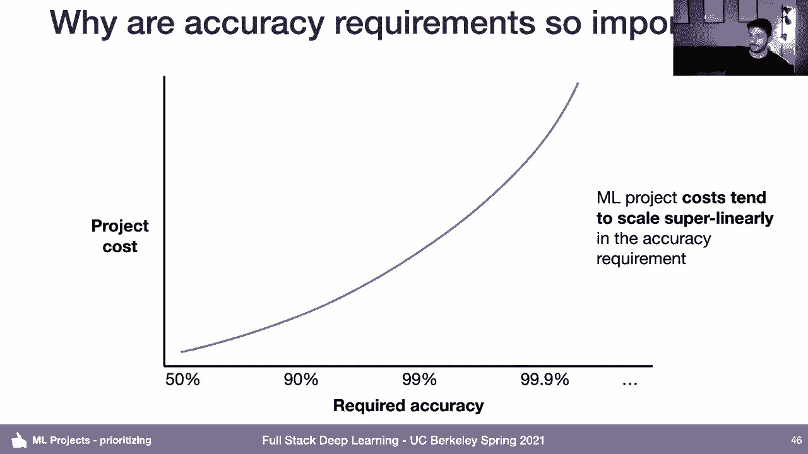

all right i also want to talk a little，bit about assessing the kind of，intrinsic problem difficulty。

of machine learning projects so i want，to talk a little bit about。

what's still what's still hard to do in，machine learning right like we see。

there's tons of success stories there's。

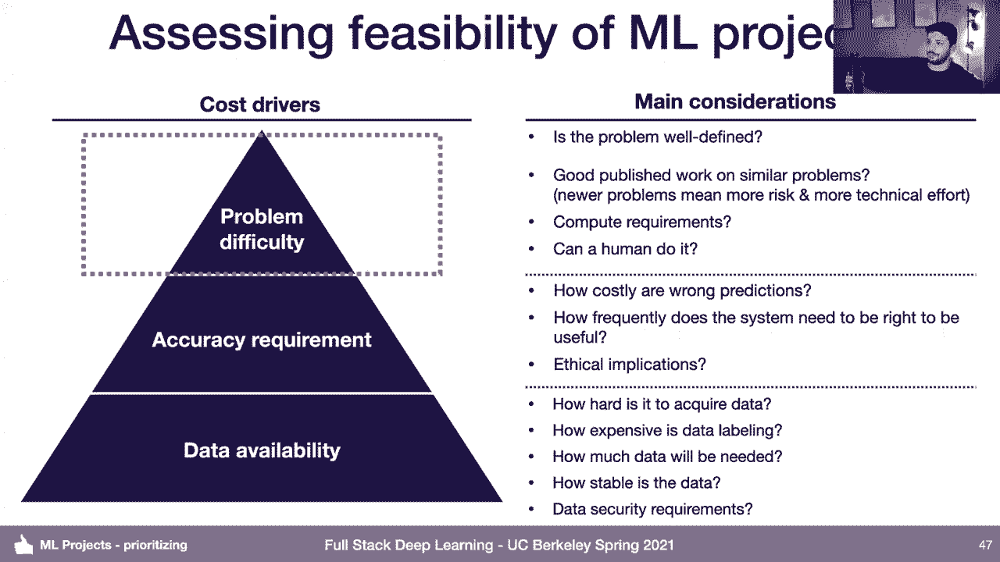

a lot of things that seem possible，before i kind of give my answer to that，saying that。

it's historically very challenging to，predict，what types of problems are going to be。

difficult for machine learning to solve，in the future，so you know this is an article from the。

new york times in the late 90s saying，you know it might be a hundred years，before humans be。

computers in or computers be humans and，go right，this is just this is just uh this is。

just such a hard problem like computers，are never gonna be able to do this，years。

and deep mind was the first built the，first machine learning system to beat，humans and go。

right so these predictions about what's，going to be challenging in the future，about machine learning。

can can be are notoriously tricky to，make，that being said i i still think there's。

there's some there's some interesting，stuff that we can that we can say about，this。

so one one heuristic that you'll hear is，this is summed up in this tweet by。

andering which is that like，pretty much anything that a normal。

person can do in less than one second we，can now automate with ai，i actually。

don't like this heuristic at all but，it's something that you'll see。

quite often so the reason i don't like，it is because i think it's like pretty。

easy to come up with counter examples，right so i mean some some examples um of。

this are true right so it's，getting relatively easy for machine，learning systems to recognize the。

content of images or，understand speech or translate speech or，increasingly grasp objects and。

other things like that but there's also，quite a few，counter examples actually anyone have。

counter examples in mind to this this，claim that，anything that you can do in less than a。

a couple that came to mind for me so，understanding humor or sarcasm。

right like pretty easy for for humans to，do or，at least pretty easy for a lot of humans。

to do very very difficult still for，machine learning systems to do。

in hand robotic manipulation right so，for humans our hands are pretty，dexterous we can。

you know we can move objects around in，our hands relatively easily。

but that's still incredibly hard for for，machine learning systems to do。

generalizing to new scenarios right so，if you if someone shows you。

you know one example of a like a shark，giraffe or something，and then you see a picture of another。

shark giraffe you can say like，yeah that's a shark giraffe but for。

machine learning systems that still，tends to be pretty hard，although their example there are success。

stories of you know in isolation solving，some problems like that。

etc so again this is this is something i，like i wanted to include because。

it is a heuristic that you'll see for，assessing the feasibility of machine，learning projects but。

i think it can be useful but just you，if you，if you blank if you blanket apply this。

rule you're gonna，you're gonna end up working on some near，a few things that i think are fair to。

say are still hard in machine learning，are basically everything other than，supervised learning so。

unsupervised learning you know despite，learning，in in nlp tasks is uh like pure。

unsupervised learning is still，relatively challenging，to make work in the real world。

reinforcement learning，a lot of progress in academia not a lot。

of real world applications at this point，so both of these it's not to say that，you can't apply these。

they're both showing promise in，you，actually have a ton of data and compute。

available and the sort of domain itself，is relatively constrained。

but in general you know if if someone if，you're proposing to do a reinforcement。

learning project in industry，you have to know that you know that's。

that's uh probably more research project，than a product than something that is。

so let's let's actually zoom in on，supervised learning and let's talk about，what's still hard there。

so a few examples that kind of came to，mind for me question answering is still，relatively hard。

summarizing text although i think，actually these two，over the past year or two have become a，so。

given given some some sequence of video，what's gonna happen in the next few，frames。

building 3d models of the world，recognizing speech in the real world you。

know in the presence of noise and，accents and all those sorts of things。

resisting adversarial example，adversarial examples doing math is still，something that's like。

kind of surprisingly tricky to get，neural nets to do well solving word，puzzles。

solving bond guard problems so bond，guard problems are kind of these visual。

reasoning tests where you，you have like you're given some like，visual sequence of like shapes and。

colors and you have to like reason about，what's what's missing。

on the other side all these things are，still things that are relatively hard to。

do even in supervised learning，so let's try to like let's try to let's。

try to boil this down to some some，principles，that we can think about in terms of what。

problems are still hard in supervised，learning，so one category of things is where the。

the output itself that you're trying to，predict is complex，so maybe it's high dimensional or maybe。

it's ambiguous，like in in the case of video prediction，and so some examples of this are 3d。

reconstruction and video，prediction but also dialog systems and，open-ended recommender systems。

right like where you want your，recommender system to be able to，recommend。

any product that like users that user's，input rather than trying to recommend。

something from a finite set of products，another category problems that i think。

are still really hard are，problems where you really need，reliability from the system。

so where you need your system to be，super super precise，or，changes to the outside world so one。

example，a couple examples here are you know，models that fail safely。

on out of distribution data or are，robust to adversarial attacks。

or you know just need to do something to，very high precision，and then a third category that i think。

is still really hard is tasks where，generalization is required so。

where you need to be able to perform，well out of distribution data or you。

need to be able to do something that，looks like reasoning or planning or，causality。

and so there's a couple examples here，from self-driving cars so edge cases are。

an example of out of distribution data，and then control is you know，increasingly learned but。

historically was done used using，traditional planning algorithms，in self-driving car companies and i。

think small data like，just just generally data where you don't，tricky。

uh to work with with deep learning in。

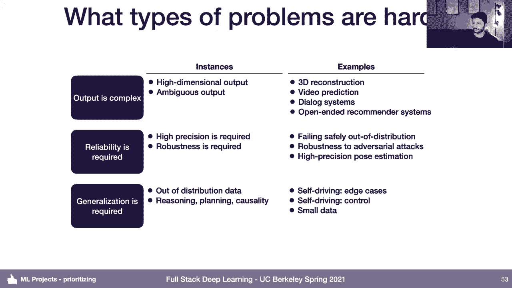

all right so let's let's let's make this，a little bit more concrete let's come，back to。

our full stack robotics example and，let's talk about why we're focusing on，pose estimation。

so let's start by talking about the，impact of pose estimation so our goal as。

a company is to do grasping right and so，in order to do that we need to do，reliable pose estimation。

and let's say that you know we were，using a traditional robotics pipeline to。

to do that pose estimation and we were，doing that using，hand design heuristics and maybe some。

online optimization，so that you know that causes some，problems right it's it's slow it can be。

very brittle，um it's complex so it might be a good，candidate for software 2。0。

let's talk about the feasibility of pose，estimation so in terms of data，availability。

it's relatively easy to collect data for，this task we can just run our robot in a，lab。

labeling data could be a challenge right，because we need to，understand what the pose of objects in。

the 3d world is so it might be hard for，for a labeler to do that but，we can get around that by just。

instrumenting our lab with enough，sensors，to be able to tell us the ground truth。

position of all the objects，in terms of the accuracy requirement we。

do require pretty high accuracy to grasp，an object，so maybe we need the the pose to be。

correct to within less than half a，centimeter，but the cost of failure is pretty low。

right we we actually want our robot to，hour，and if they fail a few times then that's，not a big deal。

[Music]，and then the the intrinsic problem，to，to publish results that exist but you。

know we're using a different robot and，maybe some different objects and so，we'll need to adapt it。

so seems relatively low difficulty but，there's still some，okay so the last thing i want to talk。

about in in this section is just，how to think about running a feasibility。

assessment for a machine learning，project，right so what like what questions should。

you be asking yourself when you're，trying to decide whether this project is，feasible or not。

the first question i would always ask is，are you are you really sure that。

you actually need machine learning at，all right oftentimes，like people do people throw machine。

learning into a project because it's，like fun or it's cool，but machine learning really increases。

think，like making sure that you really need it，before you embark on that project is a，good idea。

once you once you're convinced that you，think，one thing that is that people don't，invest in。

enough typically is putting in the work，up front to like really define what。

success would look like for this project，so if there's other stakeholders in the。

project this means working with them to，determine like，all right how accurate do we really need。

this thing to be before you embark on it，the next thing i think is pretty。

important to consider upfront is just，what are the ethics of using ml to solve。

this problem right i think that，a lot of times it can be tempting as。

engineers and researchers to say like，not to，to determine whether our solution is。

ethical and that can create problems，downstream so，think about this first once you've。

considered kind of those higher level，upfront questions，then what i would do is i would conduct。

a literature review i would look for，other examples of people solving this，problem in papers。

and you know see how hard it seems to be，to implement those papers。

and you know once once you have a sense，of what the techniques are then i would。

try to like kind of rapidly build a，labeled benchmark data set。

so i would see like how and so this is，trying to get at like how feasible your。

data collection and labeling process is，going to be，if it's really really hard to build this。

labeled benchmark data set then，you know it's a there's a good chance。

that it's like data collection and data，data labeling is always going to be a。

bottleneck throughout the project，and then once you've kind of assessed，the the feasibility of data。

collection and labeling then i would try，to build like some minimal。

viable product right so you don't even，necessarily need to train a model for，rules。

um or maybe you train a very very simple，model but this will this will just give，you a sense of like。

whether this problem is solvable at all，and how good your baselines are。

and then i think this kind of brings us，back to the question of like the last，thing i would。

once you've built this minimal viable，product is i would ask yourself。

the question again like are you really，sure are you really really really sure。

that you actually want to use machine，learning to solve this problem or like。

maybe that heuristic that you came up，with is good enough for now and so you。

should stick with the heuristic and move，on，and those are some of the main questions，to。

embark on your ml project，the next thing that i'm going to talk，of。

the types of machine learning projects，that you might see in industry。

and what are the implications of，projects falling in those archetypes for。

how you how you actually go about，building and managing，those the models and the associated。

so different archetypes that we'll talk，about the first is i'll borrow the name，software 2。

0 to describe this right and，so this is this is basically like any。

time that you take a part of your system，that exists already。

and is governed by rules and you improve，those rules using machine learning right，so。

maybe you have an ide that does code，completion and you want to improve your。

code completion algorithm using ml，maybe you know you have a recommender。

system that's using you know matrix，factorization approach and you want to。

like use more complicated machine，learning to make that better。

or maybe you want to you know you have a，video game ai that's like using。

heuristics and you want to build a，better one using reinforcement learning。

second category of products that i want，to talk about is human in the loop。

right and so this is where projects，where the output of your model is going。

to be reviewed by a human before it's，actually like，executed in the real world so maybe you。

want to build a project to，convert hand-drawn sketches into slides。

and then someone will review them before，you know before they go in your pitch。

deck maybe you want to do email auto，completion，or help a radiologist do their job，faster。

and then the last category that i want，to cover is autonomous systems and so。

this is where the system itself is like，making decisions in the real world。

with like no supervision from humans or，limited supervision from humans。

so full self-driving or fully automated，customer support，or like instead of you know or like you。

know fully automating your website uh，your website design，these types of things are are autonomous。

and are gonna be more difficult to build，so a few questions to ask yourself if。

you're building a project in each one of，these，each one of these categories so if。

you're building a software 2。0，product i think like one of the main。

questions to ask yourself is like are，you actually improving performance of，the system。

so it's important to measure that and，does does that performance。

improvement actually translate to value，for your business or your products along。

like whatever axes that you care about，and then finally like do those。

performance improvements lead to a data，flywheel i'll talk in a second about。

what a data flywheel is and why that's，important，if you're building a human in the loop。

system the questions i might ask myself，are，you know how useful does this system。

actually need to be in order to be，useful，or how good does it need to be to be。

useful how can you collect enough data，to make it that good，and those are kind of the main questions。

i would ask those are sort of the，the main things that i think like drive。

project success for those types of，projects，and then for autonomous systems the main。

questions to consider is like what is an，acceptable failure rate for the system。

how do you guarantee that your system，won't exceed that failure rate like what，it。

and how inexpensively can you label data，from the system。

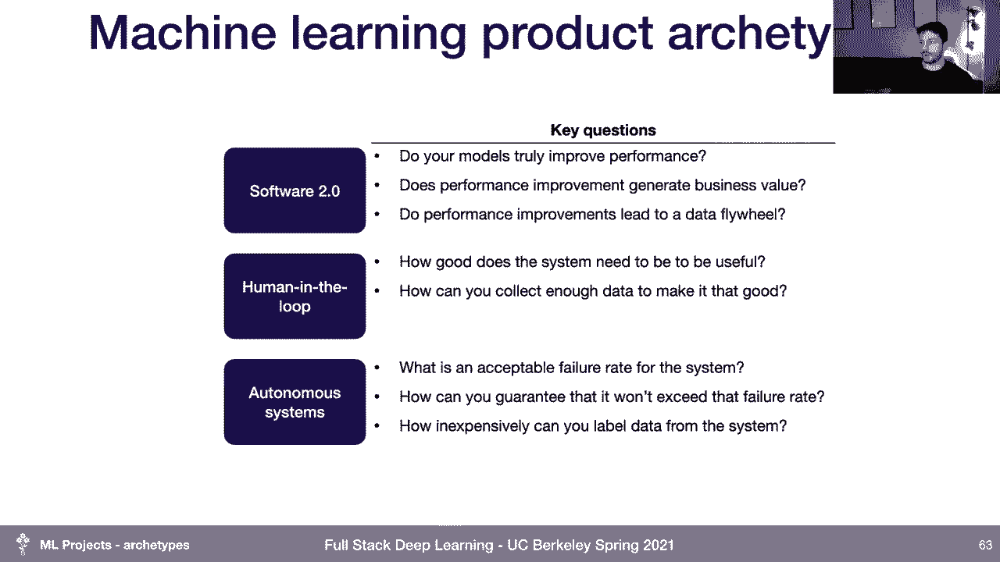

okay so i promised i was going to come，back to this data flywheel concept。

so what is a dataflywheel dataflywheel，is the idea that，for certain machine learning projects or。

certain machine learning products，you can create this positive feedback。

cycle where as you improve your model，that improvement in your model。

performance leads to a better product，and that better product leads to more。

users the more users you have the more，data，you're able to collect the better you're。

able to make your model and so i think，this is kind of like，this is like a gold standard to aim for。

when you're building machine learning，enabled products like if you're able to，create a data flywheel。

then your life is going to be a lot，easier and you're more likely to build。

something that's going to get better，over time，and so the the kind of considerations。

here are you know when，like where where can things fail in the，data flywheel right so。

do more users necessarily lead to more，data you，you actually need to like set up a。

system that'll allow you to，automatically collect data，and ideally labels from your users do。

does more data lead to a better model，it's kind of your job，as the ml practitioner like if you if。

you can't figure out how to turn more，data into a better model。

then you know that's that's on you and，then does a better model，lead to more users and you know the。

question here is，do better predictions actually make you，know does a more accurate model actually。

make your product better，and this is something that i would i。

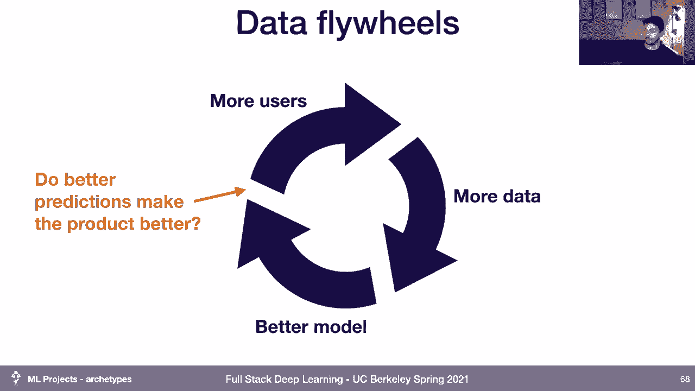

ideally，try to assess before you even start the，project，so the the next point i want to make on。

this is that，you know there's there's different，trade-offs in terms of impact and。

feasibility of product projects in these，different archetypes。

so autonomous systems have potential to，be super super high impacts。

but are generally like very infeasible，to create whereas like software 2。0 type，just。

trying to make an existing system better，you know the the potential。

for impact is lower because you do，job，but they tend to be easier to do because。

you already have data available，and then human in the loop is somewhere，in between。

but one way to one other way to think，about this is that the，the kind of impacted feasibility of。

these categories of projects is not are，not static，so you can make software 2。0 projects。

higher impact and also more feasible by，implementing a data loop right so by by。

building a system that allows you to，collect，data from the tasks that your model is，solving。

so that you can improve the model going，forward on this task，and potentially on future tasks if。

you're collecting a broader set of data，from your users as they interact with，the model。

you can make human in the loop projects，quite a bit more feasible，and potentially even higher impact。

through good product design，and i'll talk a little bit more about。

that in the next few slides but you can，also make these，these types of projects more feasible by。

you know just not，trying to release something perfect from，the beginning really you know release a。

good enough version get that out in the，world as quickly as possible。

so that you can essentially turn this，so zooming in on this this good product，design question。

if you design your product well that can。

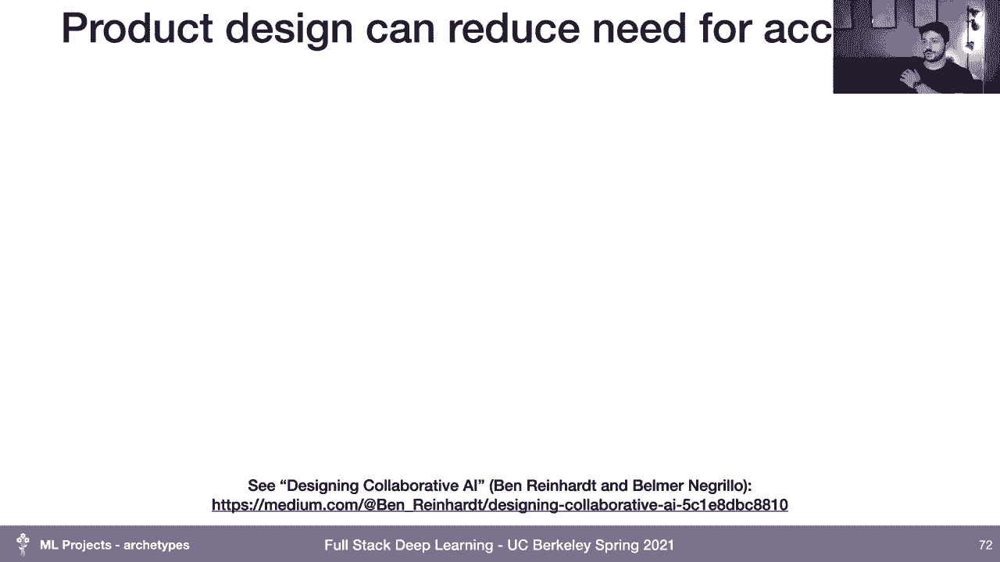

actually reduce，your need to have an incredibly accurate，model so some examples of this。

are you know when facebook wants to tag，you tag you in an image，they don't just tag you right like。

because you know then，you get like these wrong tags and that，would be a horrible product experience。

so they would need to be very very，accurate to do that they instead just。

suggest that you maybe tag yourself，so that's the example of product design。

reducing the need for accuracy，grammarly is a tool that kind of helps，like correct。

grammar problems in your writing and you，know again they，one thing that they do is they produce。

like explanations for why they're，highlighting certain things，so it's not just like this is bad it's。

like here are some rules that you might，want to follow to make this better。

and so again the users have a chance to，apply their judgment as to whether。

the suggestion is correct or not and，then，recommender systems are another example，of this right。

just just giving you like multiple，might，um want to pick instead of just like。

so there's a lot of i think there's a，lot of like very underrated surface area。

and thinking about the，the intersection between like making，machine learning projects successful。

and good product design and so this this，is not a product design class so we。

won't have time to do that topic justice，but i do want to point you to a couple。

of resources that you can go to。

to learn more about this if you're，interested，so one i think actually like super。

underrated resource is apple's machine，learning project，product design guidelines and so they。

kind of they kind of，urge you to ask like sort of three，questions of yourself as you're。

designing your machine learning products，the first is what role does machine。

learning play in your app，right you know can you make it play less，of a role to make it。

to make you know to make it more，feasible and that sort of thing。

how can you actually learn from your，users and so they have a couple of。

different sort of design paradigms for，how to incorporate feedback from your，users whether that's。

explicitly asking them for feedback like，not，or implicitly asking them for feedback，right like。

did they click on the recommendation or，not by asking them to calibrate during，setup。

right so when you when you get a new，iphone it asks you to scan your face to。

create a model of your face for face id，or you know you could ask users to input。

a few movies that they like，before you start making them，recommendations and then corrections。

is another another pattern that they，suggest so actually manually going in。

and fixing mistakes that the model make，these all create a better product。

experience and they also make our lives，easier as，model developers because they give us。

data to to assess，the model's performance and potentially，then the third category of things that。

they that they have some suggestions，about how to think through。

are how your app should handle mistakes，so mistakes are an inevitable part of of，the of。

you know what you're getting if you're，building a machine learning enabled。

product so handling those mistakes，gracefully is pretty critical。

and so they have suggestions like you，know like，show your users what the limitations of，where。

you shouldn't expect them all to perform，well corrections，so letting your users succeed even if。

the model itself fails，helping them understand where those，suggestions are coming from so they can。

build a mental model of whether they，should trust them or not。

or explicitly telling them whether they，should trust the results or not。

by outputting some sort of confidence，so again kind of went through this。

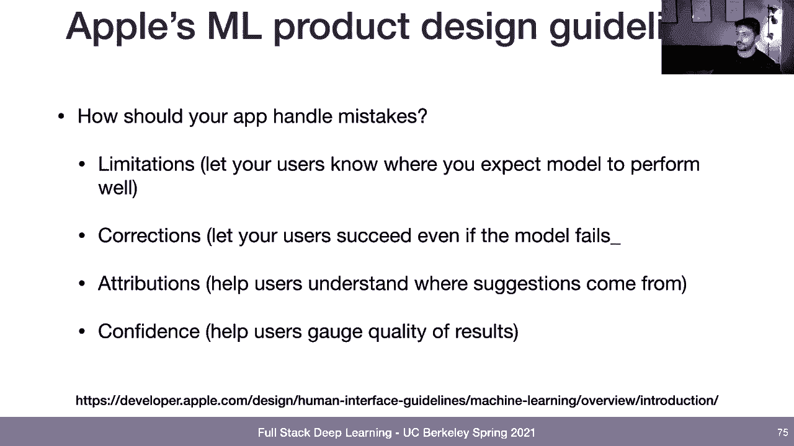

out this，this this resource from apple if you're，interested in this。

and another resource that i'll point you，to is this these guidelines for human ai，interaction。

from microsoft and so they have like，kind of a similar set of heuristics that。

you should think about when you're，designing a product that has machine，learning embedded into it。

and yeah one a couple that i'll，highlight here are，so you know they have they have some。

like potential patterns for，how to handle wrong predictions for，example which i think is。

one sort of design pattern that comes up，both in like microsoft and apple's。

suggestions and then you know，and。

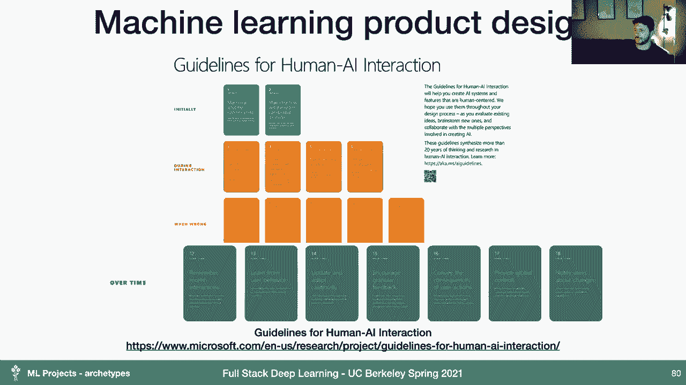

so this is another resource that's worth，checking out if you want to learn more，about this。

and then last resource i i alluded to，on，machine learning product design from，level。

and less like tactical but i think has，like some good mindsets and so their。

their philosophical approaches like，find points in your product where，there's friction and then。

and then basically like try to manually，get rid of that friction and then try to，automate。

the places where you're getting rid of，friction using machine learning over。

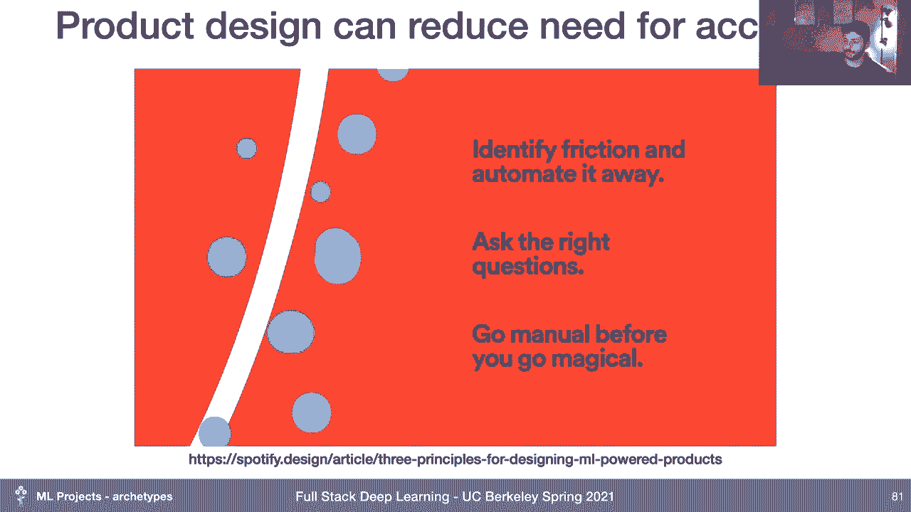

okay so that's that's some resources you，can look at if you want to try to make。

your your human in the loop system，more feasible by by like designing the。

product that sits around that，machine learning model better and so。

autonomous systems you can also make，more feasible，and the way that you typically can do。

that is by making them，less autonomous right so you can add，humans in the loop。

you can add guardrails or maybe you just，limit the initial scope of the problem。

that you're trying to solve，so there's kind of examples of each of。

these tactics for making the problem，more feasible in the self-driving car，world。

humans in the loop is sort of the tesla，approach right where like，they're just you know they're just。

running the system in the background on，all of your cars，and they tell you that you're supposed。

to be paying attention and so when you，like when you jump in and like take the，wheel from the system。

that's you know that's that's turning，the autonomous system into a human in，the loop system。

guardrails around the system in the，autonomous vehicle world are things like，safety drivers right so。

most autonomous vehicle companies are，taking this approach where they don't，actually let。

the the av run in the real world on its，own even if they mostly trust it there's。

always a safety driver there that's，like ready to jump in and then，limiting the initial scope of the。

problem one company that's taking this，approach is voyage，and their approach is instead of trying。

to solve the full self-driving problem，from scratch，instead let's just focus on like a。

narrow subset of this problem，and for them that narrow subset is only，focusing on。

senior living facilities where they can，control their environment much more。

and so they've said like you know even，though the goal is to eventually build。

fully autonomous systems，we're going to constrain the problem and。

try to solve the constrained problem，first before we broaden our scope。

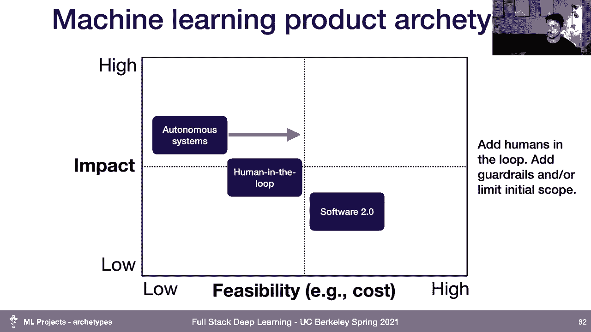

[Music]，so situating where we are，in the lecture and kind of the life，cycle of。

scoping out your machine learning，projects so we've talked about like some。

ideas for how you might think about，picking a project，and then some like overall。

considerations that you might think，about，if you're depending on what archetype。

your project falls into，so the next couple of things that we'll，talk about are a little bit more。

tactical，and this is around metrics so how to，pick a single，number to optimize and then baselines so。

how to know if your performance，on that number is good or not。

so the the main things that we'll cover，in choosing a metric，are you know the main things you really。

need to know are just that，the you know the first thing is the real，world is very messy。

and so in almost all cases you actually，care about more than one metric like you。

don't just care about one，accuracy of your model you also maybe，care about things like。

the latency of the model or other，metrics that describe your model's，performance。

but that presents a challenge because，when you're actually doing the process。

of optimizing a machine learning model，training models evaluating them，comparing them to each other。

that process works best when there's a，single number that you're trying to，drive down。

okay and so as a result we need to have，some way of，figuring out like among all the metrics。

that we care about，how do we pick just a single number that，we'll care about right now。

and you know the important thing to，realize here is that this is sort of a，pragmatic。

thing that that you'll need to do when，you're when you're working on picking。

better better models for your task but，that formula that like single number，that you're driving down。

can and will change over time right so，you know，as you start to perform better against。

that metric you'll come back and revisit，like okay what should we really be，optimizing right now。

and so and the last thing i'll say on，like，single number view of the world i think，you're，when you。

move on to kind of testing your model，and evaluating it，and deciding whether this model is。

actually like good enough to solve your，tasks and go into production it's，important to zoom back out。

and talk about the other metrics that，about that，we'll talk about that process in a。

separate lecture but for now our goal is。

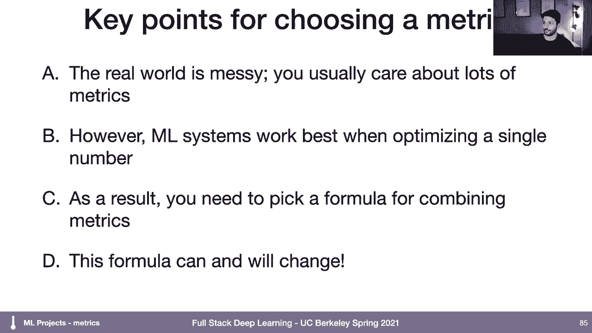

to pick a single number that we're going，so to review you know why is it。

important that we pick a single number，so there's there's a few different。

numbers that if you're if you're doing，like a binary classification task，there's a few。

numbers that are like natural to，consider so，you know you have your accuracy which is。

the the number of correct predictions，divided by the total，number of total predictions that your。

model made，and so in this case the accuracy would，be like 50，then there's the precision which is。

another metric that you might care about，which is defined as the。

number of true positives so where the，actual answer was yes and the model，predicted yes。

divided by the total number of positives，that were predicted such both true and，false positives。

then you have your recalls which is the，the true positives divided by the pers。

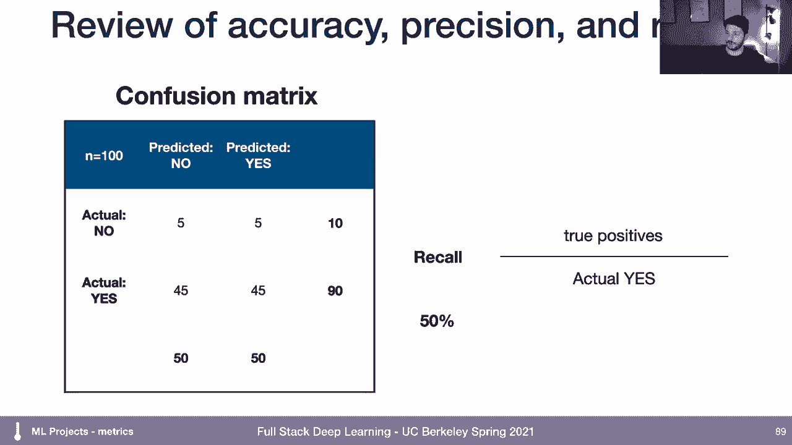

the number of times that the answer was，actually yes，and so why is it important to choose a。

single metric well let's say that we're，comparing three models，and you know we care about both。

precision and recall for those three，models，and these are the precision and recall。

numbers that we get for those three，models well，which one is best like which one of。

those models should we pick to put into，production or to，you know run more hyperparameter。

optimization on and so that's why it's，important to have like a single number。

in mind that you're trying to optimize，at any given time，so next let's talk about strategies for。

how you combine，how you can combine the metrics that you，work，is that you might just like take a。

simple average or maybe a weighted，average of the metrics that you're，looking at。

so in this case like let's say that we，just take the average of precision and，recall。

and in this case that would sort of，point us to model 3 as being。

the the model that's best in the real，world，this is i would say like less common to。

do what's more common，is to like probably the most important，of out of all these techniques to know。

is and i this idea of taking，you know if you care about n metrics。

take n minus one of them where you're，just gonna set a threshold。

on your performance according to that，metric and then you're gonna always pick，the model that does。

the best on the remaining metric and so，often the way that this plays out。

is in practice is that like you'll you，know you'll iterate on model，architecture until you find。

a particular model that satisfies like，your threshold on those n minus one，metrics。

so maybe those are things like like，latency or like total number of，parameters。

or you know cost to retrain or something，like that，and then and then most of your。

optimization process will be spent，um trying to drive a number like，accuracy down on the end metric。

and but each time that you do that，to，the model architecture and data and。

stuff that you're using that you，think will like not make you much worse，on the rest of the metrics。

and so we'll talk about this in a little，bit more detail when we talk about edge，deployment。

but you know for example like if you're，trying to if you're trying to fit a。

model into the memory requirement of a，particular edge device that you're，working with。

then you might start with a model that，you know fits into that memory，requirement and then。

you know make changes to the model，architecture but never like increase the。

size of that model too much，so that you you know hopefully never get，too far above that。

that model size metric that you care，so how should you choose which metrics，to threshold。

and which metrics to actually optimize，so you know one way to choose is just。

it's going to depend a little bit on，your domain right so，for example maybe there's some metrics。

maybe，you know maybe latency it's like，important to have lower latency but if。

the latency is higher then，like maybe there's some tricks like，caching predictions or something that。

you can do so you can engineer around，lower latency but maybe in your case not。

lower accuracy so this depends on the，domain that you're working。

on another metric another way that you，are，looking at which metrics are least。

sensitive to model choice so maybe，you know maybe your accuracy varies a，about。

but your your your latency let's say，doesn't really seem to vary that much。

between the different models that you're，picking so you might choose a threshold，latency。

and then lastly at any given point in，your kind of model optimization process。

you'll for all the metrics that you care，about you'll have some that are like。

relatively close to their desired values，and then you'll have some that are。

further away and so a pragmatic decision，that you can make is to say like okay，let's just。

let's just let's just threshold the，metrics that are already pretty close。

and let's just try to not make them too，much worse，and then let's really focus on driving。

this one that's still pretty far away，from our desired value down。

and then once you've driven that down，then you can reconsider。

other question you'll need to answer is，like，what constitutes you know performance on。

that metric that's bad enough to just，throw that all out entirely。

again domain judgment is going to be，important here so what is an acceptor。

acceptable tolerance downstream and，what's achievable，that you can。

assess this is by is by looking at how，well the baseline model that you're，working with。

does on this metric and we'll we'll talk，in the next section about baselines and。

why they're important and how to choose，them and then finally you know you might。

have some sense of how important，different metrics are，at this stage in your project right so。

again like if you，you know if your model doesn't work at，all then getting the model to work at。

all might be more important than，you know getting it to work within the。

actual production constraints that。

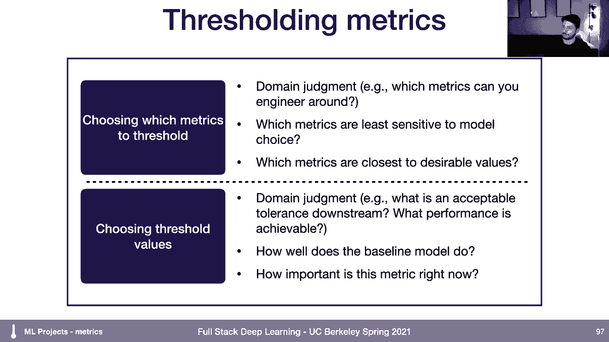

so you know one like one way we could，apply this to this problem is we could。

just say like okay let's，you know most of these models have a，recall that's above，threshold。

and we'll throw out any models that have，recall less than 60，and then let's choose the precision。

let's choose the the model based on the，one that has，the highest precision subject to that。

constraint and so in this case model 2，then the last strategy that's worth。

considering for thinking about combining，metrics is，for some domains like for some problem。

spaces there's，you know more complex or like the main，specific formula that you can use for。

combining different metrics that you，care about，so in binary classification there's this。

metric called，called the the mean average position so，the way that the mean average precision。

works is，you can plot the the trade-off between，precision and recall on a curve。

right so at a given recall like at a，recall of 100 what is your precision。

or a recall 50 what is your position you，can take the area under this curve。

and that's your average precision for，like let's say this particular class。

and then the mean average precision is，the，average precision averaged over all the。

classes that you're trying to perform a，prediction on，so that's the map and that's like an。

example of a domain specific metric that。

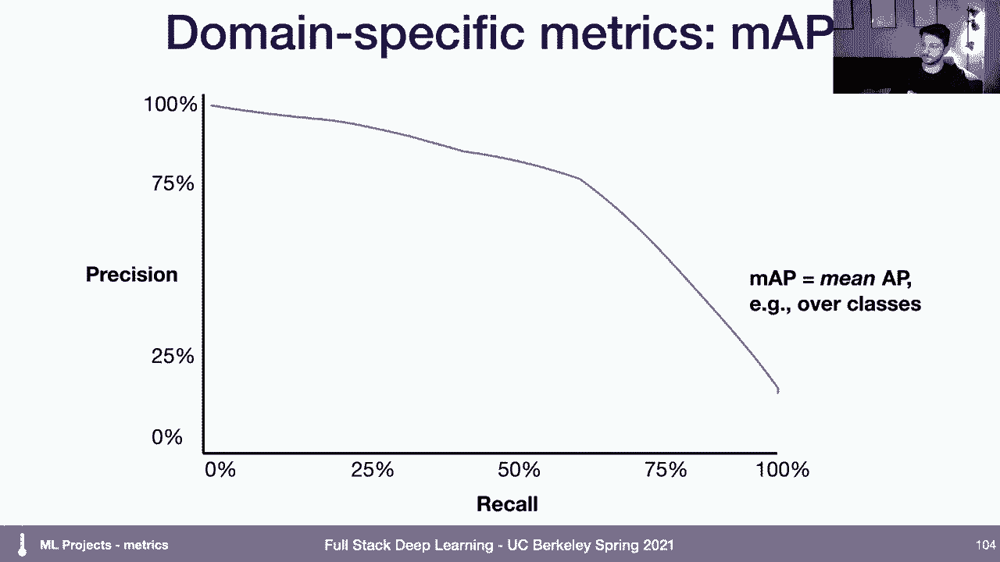

and so you know for the sake of example，here maybe the map would tell us that。

model one is actually the best model so，you might pick that，so again this is why it's important to。

put effort into thinking about how，you're going to trade off between，metrics up front。

because in this in this example that we，made up each one of the metrics that you，chose。

gave you a different choice for which。

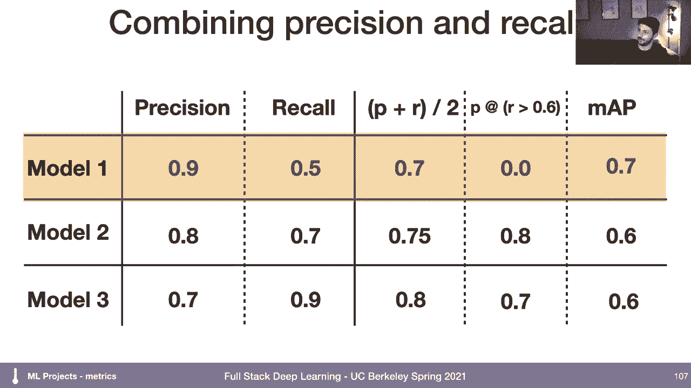

all right so let's let's come back to，our running example of uh full stack，robotics。

and working on pose estimation so let's，introduce another，metric that we might care about which is。

prediction time，and so how we might go about choosing，our the metric that we're going to。

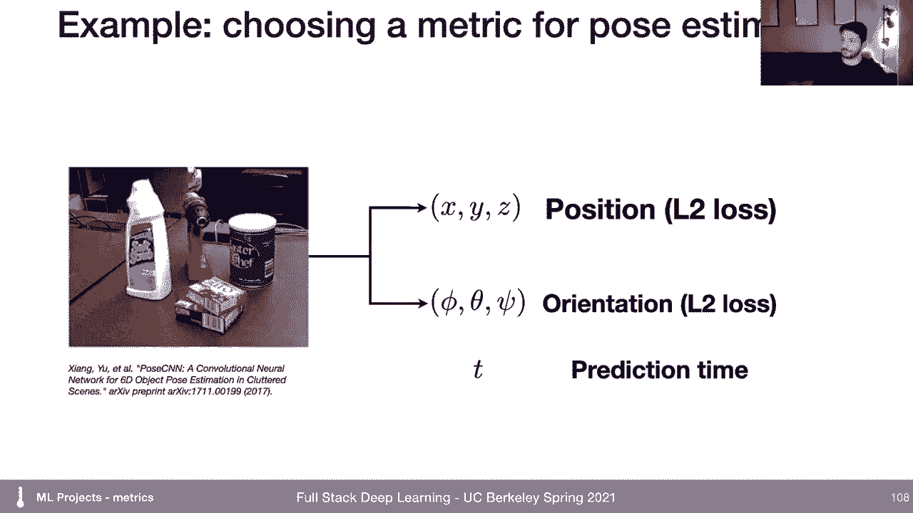

optimize first is，we might start by just like listing what，are our requirements like what what do。

we think we're going to need to have in，order for the system to work in，production。

and so again our goal is to do real-time，robotic grasping，and so we think that you know maybe the。

position error，i mean it seems like it probably has to，be less than one centimeter um。

not really sure how precise it needs to，be like maybe it actually needs to be。

much more precise than that but，for sure it needs to be less than one。

centimeter and similarly like maybe the，angular error，we think that that might need to be，for。

in order for the grass to succeed and we，also might have，we also might have a requirement that we。

think in order for this to really run，in real time the predictions must come。

so the next thing that we might do is，like，let's let's figure out what the what our。

current performance against those，requirements is so，we might train a few models we might。

like kind of just come up with a couple，of hypotheses as to what our model。

architecture would look like，you know not put a not put too much。

effort into optimizing those things up，front but just train them and see。

where they fall on the performance curve，so in our example let's say that。

you know they all tend to have a，position error between you know or maybe，around a centimeter。

a little below or a little above，depending on the hyper parameters but。

the angular errors that we're seeing are，huge they're like around 60 degrees。

and the inference time is also way above，what's acceptable for our system。

this is actually kind of representative，of where where we were when we started，working on。

some grasping tasks that open ais like，we had our position error。

we got that down relatively quickly but，the angular error was really bad for，some reason。

and so the question is like which of，these things should we work on so i。

think a pragmatic decision in this case，would be，let's prioritize working on the angular。

error because that's really far away，from what we think we're going to need。

in order to make this system work in the，real world，and let's threshold position error at。

one centimeter because we we feel like，pretty sure that，if it's above one centimeter it's not。

going to work so let's throw out models，where our position error gets much worse，than that。

and you know since we're so far away，from actually getting the system to work，in production。

let's just completely ignore runtime of，the model right let's let's get a model，that solves the task。

even if the runtime even if the，inference time is is too long。

and then we'll figure out how to how to，drive inference time down once we know。

and then the last step that we would do，here is we would just you know as those。

numbers improve we would revisit，what our metric is right so if like if，we figure out a bug in our。

in how we're you know how we're labeling，the angular the the，angle and that causes us to be able to。

drive angular air down to 10 degrees or，something then，we might come back and say like okay now。

it seems like we're pretty close to，to what we what we thought our，requirements are were so。

maybe we'll focus on latency so we can，actually try to run this on the robot。

okay so to review choosing a metric the，real world is messy，and you in the real world you almost。

always care about lots of metrics，but our process of like iterating on。

models and building better and better，models over time tends to work best when。

at any given time there's a single，metric that we're focused on single。

number that we're trying to drive down，or drive up and so as a result of that，we need some。

like some rule for combining all of our，metrics into a single number that we're。

going to work on right now，and we covered some techniques for how。

to do that and then the last thing which，i've emphasized a few times but it's。

very very important is that like，this formula can and will change and，it's natural to go back and。

and revisit that as you make progress on，last thing i want to cover today is。

baselines and so baselines the goal of，baselines is to，just to know how well your model's。

performing at any given time，so key points here are you know why we，need baselines。

the reason we need bass lines is that，they give you a lower bound。

on how well you should expect your model，to be able to perform，and the tighter that lower bound the。

more useful the bass line is，so so bass lines that are that are。

better but that are more that are closer，to like，the true best case performance are going。

so let's dive into this a little bit，let's say that let's say that you have。

some lost curves that look like this，right so you know you have you know。

you're training a resnet and this is，what your training loss and your，validation。

loss looks like as you train the model，so the question is like，what what is the implication for like。

what you should do next in your model，building process，right so if you actually just look at。

these at these loss numbers that，actually doesn't，tell you enough to know what the next，step is。

for for what you should do in this in，your model building process。

so for example let's say that you have a，baseline that you know human performance，on this task is。

like basically already exactly the same，as how you're performing on the training，set。

or in another case maybe your baseline，says that like you're actually nowhere。

near human performance on this data set，and the the thing i want to point out is，just that。

if you have the same exact model the，same exact loss curves but you have a，different baseline，for。

your model building process right so in，the first case where，your baseline is basically exactly。

already，what you're achieving on the training，set the thing that you need to probably。

need to fix is the gap between your，training loss，and your validation loss right so you're。

over fitting here and so the next step，would be like to try to reduce that over，fitting somehow。

on the other hand if your baseline is，much if if your training loss is nowhere，near your baseline。

then the problem that you should work on，first is addressing underfitting。

right so you should try to figure out，like how to how to even make your。

training loss closer to human，performance，and you should do that before you try to。

address the gap between training and，validation，so same exact model same exact exact。

loss curves but different baseline，imply different next steps so that's why。

it's really important to choose good，baselines，so what are your options like where can。

you go to look for baselines，so some baselines i would call like，external baselines so external to。

your model building process so you might，have some requirements you could use。

those requirements as a baseline，or you could also like go go and do a，literature review and。

and look for published results on maybe，similar problems，this can be a good way to get baselines。

there's kind of a caveat here though，which is that，it's it's often easier to easy to delude。

yourself into thinking that you should，be able to perform exactly as well as。

some published results but in reality，you know your data set is probably，different。

and so it's it's not always going to be，a fair comparison so just just be。

careful when you're comparing to publish，results，[Music]，then there's some internal baselines so。

in baselines that you can develop，yourself，one of the most important categories。

here which we've mentioned a couple，times already are scripted baselines。

so just come up with some like，heuristics or rules for solving your，problem。

and maybe use opencv and maybe like you，know try to try to tune an algorithm，yourself。

and this is this can be a really，powerful baseline and just just give you，a sense of like。

how important this is when opening i was，starting to work on the。

the project to beat the best humans at，dota，one of the first things that they did is。

like one of the best engineers on the，team spent，literally months just trying to build。

like the best dotabot，that that he could build by hand and it，turns out that he was able to build a。

better dota bot than the dota，developers were able to build and so，once they had that then they were。

confident they had like，a reasonable baseline where if the model，was better than that。

that that sort of hand design dotabot，then that would mean that the model is。

actually like learning something，you can also use a similar machine。

learning model as your baseline so，like you can use a linear regression or。

something like that to give you a，baseline and，you know if your model is not able to if。

your deep learning model is not able to，perform better than that then。

it's pretty good sign that there's you，know there's something wrong in。

how you're building your model maybe you，don't have enough data maybe there's a。

bug something like that，and then lastly human performance and so。

human performance oh one other thing i，want to mention on simple bass lines。

these don't actually have to be，ml at all right like one you know even。

if nothing else like a reasonable，baseline might be like the average。

of the outputs in your data set and i've，i've had cases where，you know you're working on training a。

model and you know it seems like the，model's not performing that well。

and then you just compare its accuracy，to just like taking taking the average。

across your data set and it does worse，than that right so，even that as a baseline is like pretty。

reasonable way to to，give you some sense of whether your，model is learning anything。

but coming back to human performance so，human performance can be a really。

powerful baseline because it can give，you a sense of，you know it can be it could be a very。

tight bait very tight lower bound in the，sense that it can be，you know it could be almost as well as。

you can expect the model to perform，especially if the especially if you're。

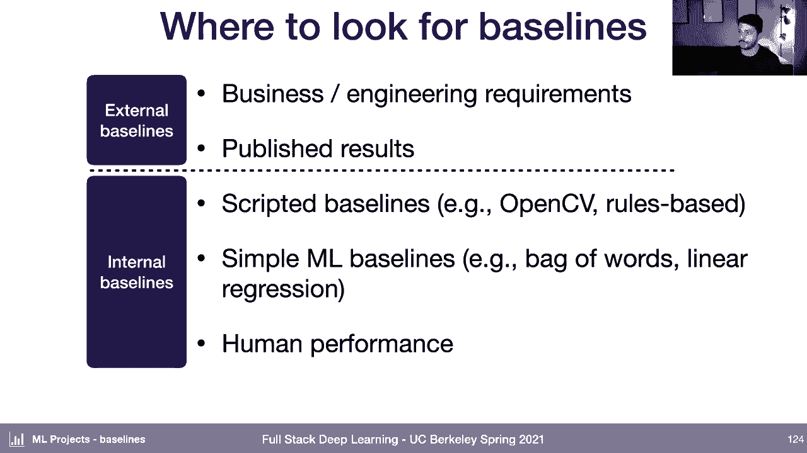

reliant on labels from humans to，to create your performance so there's。

better ways and there's worse ways to，create human baselines，and there's kind of a trade-off in。

measuring human performance on a data，set between how good the baseline is。

like how like how close it is to like，the true baseline on the task。

and how easy it is to collect the data，right so on one hand you can。

like you can just give the task to like，random people on amazon turk。

or something and that's like super easy，to do but generally，low quality unless you really think。

through how to explain to people how to，solve the task，slightly better is to you know instead。

of just paying like one person per task，you can pay a few people and you can。

like ensemble the results that those，people，produce so a little bit harder to。

collect because it's you know you're，just a little more expensive，but the quality of the baseline is。

better you can pull in domain experts，which in some，domains like medicine is absolutely。

necessary but in some cases like just，training people a little bit more to do。

your task can make your baseline better，you know you can maybe even pull better。

better experts like someone who's really，a specialist and what you're trying to，solve。

or you can like you can ensemble those，experts you can do like a mixture over。

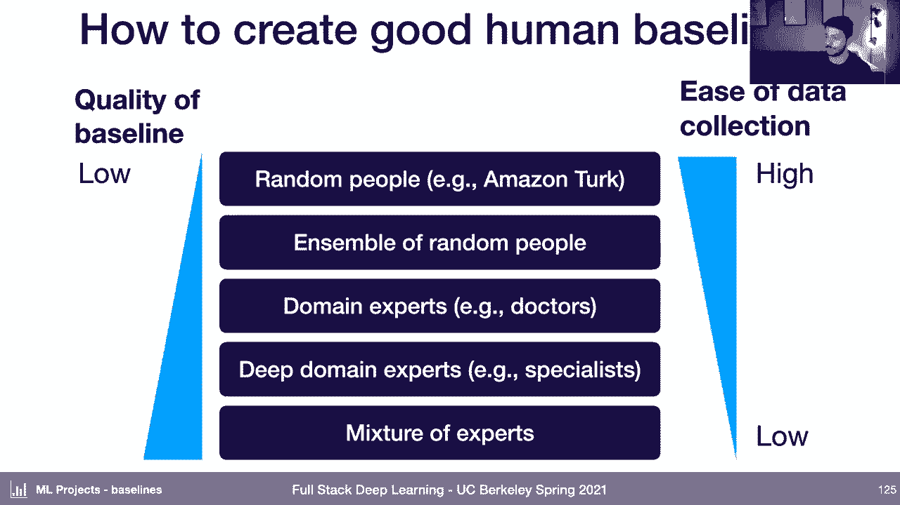

what those experts say and that's maybe，like the most expensive way to create a，baseline but。

so you know how do you actually choose，where on that trade-off。

makes sense for your task i think like，one way to think about it is you want to。

you want to aim for the highest quality，that you can that will allow you to like。

label more data relatively easily down，the road，so you know if you if you have like if。

you have a budget of 100，for labeling for your entire project，then like don't spend all 100 of those。

dollars on labeling the initial data set，you know because you wanted like the。

best doctors in the world to label it，for you，more specialized domains so like the the。

less generic your task is，the more you're going to just need，skilled labor labor。

labelers and you can be intelligent，you can be more intelligent about how。

how you like which data you choose to，label，by looking at cases for example where。

your model performs worse，and concentrating your data collection，on those kinds of places。

and we'll talk about this more in the。

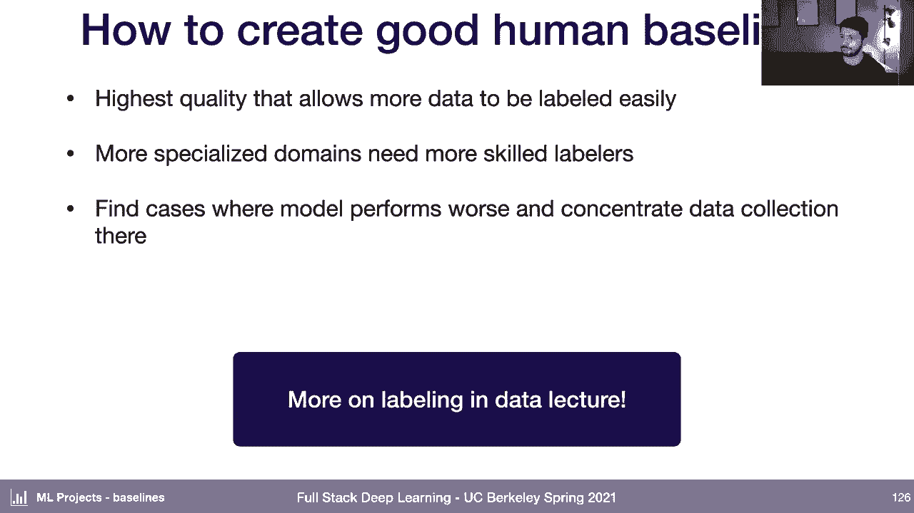

all right so so the main points that we，covered on choosing baselines are。

the the reason why baselines are，important is that they give you a lower，bound on。

how well you should expect your model to，perform on this task and so the better，that lower bound is。

the more useful this is baseline because，it gives you more confidence that your。

model is actually performing well and，not just，you know say memorizing the data or you。

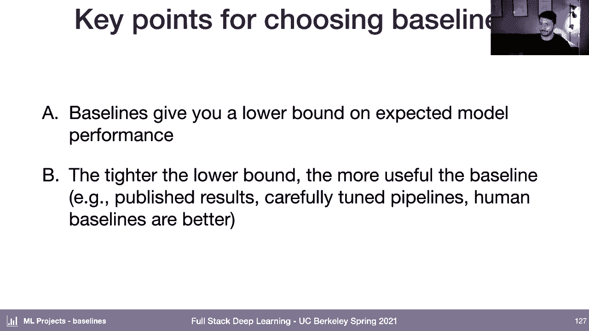

okay so just to wrap up what did we，cover today first thing that we talked。

about was the life cycle of machine，points，to take away there are you know i think。

like maybe maybe the most important，takeaway，um for me in that piece is that you。

should think about the life cycle of，machine learning project not as like a，linear。

you know start from step one and go to，step n but as an，iterative process where at each step。

you're you're you know，working on the task at hand but you're。

also maybe looping back to earlier steps，as you learn more about your problem or。

build a better model，but it's other takeaway from this is，that the other implication of this is。

that the sooner that you can deploy，something quickly，to kind of complete the cycle the easier。

it's going to be to iterate on that，so after that we talked about，prioritizing projects and。

we talked about some heuristics for how，to find high impact projects。

and and and projects that are relatively，feasible and like the main takeaways，there were that。

you really want to look for projects，where you know it's it's relatively，feasible to collect data。

and where the the cost of wrong，predictions is not going to kill you so。

after that we talked about like a few，different kind of high level archetypes。

that you can use to think about，what type of machine learning project。

you're working on and maybe how to，make it easier to solve your to solve。

the problem for that type of project，and so you know one point that i want to，emphasize here is that。

in many cases the secret sauce to like，making these projects really work well，build。

automated or semi-automated data，flywheels，but another point that you might take。

away from this is that machine learning，engineering is tightly，coupled with doing good product。

engineering and product design，and so there's there's a lot of，different ways that you can make your。

project more feasible just by making，better product choices about how your。

how your uh model is integrated with，that product，so we talked about metrics and you know。

the main point here is that，in the real world there's a lot of。

metrics that you care about around your，model，but at any given point in time you。

should always have one and then you，should revisit that as your project as，your project evolves。

and rethink whether that's the right，thing to be optimizing right now。

and then finally we talked about，baselines and so，the point of having good baselines is。

that good baselines help you invest your，effort，in improving your model in the right。

place and so if you have a better，baseline，then that gives you a sort of more，granular sense of。

what the problem with your model right，now might be and so that's that's why。

it's important to invest in good。

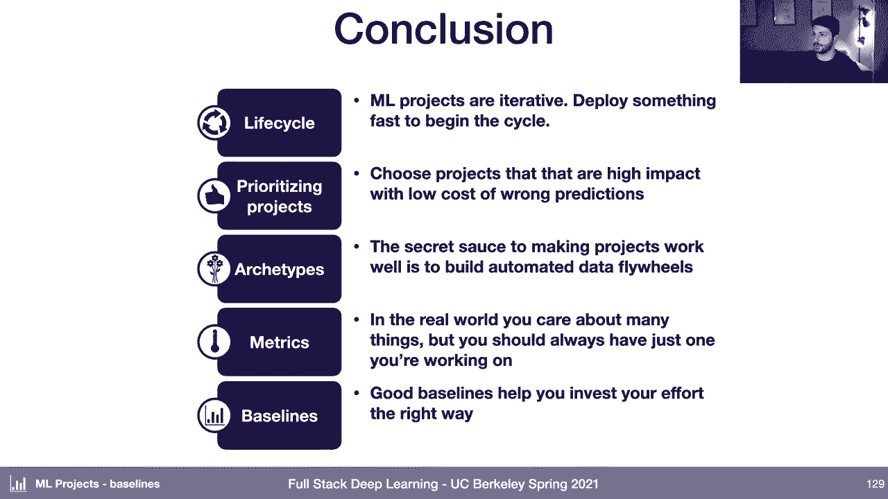

baselines and we talked about a few，different ways，of building baselines okay i also wanted。

to drop in a few more resources if，you're interested in learning。

about this topic there's a lot to learn，about here and so，we you know we covered a lot but we also。

in some sense only scratched the surface，and so，here are some resources that i would。

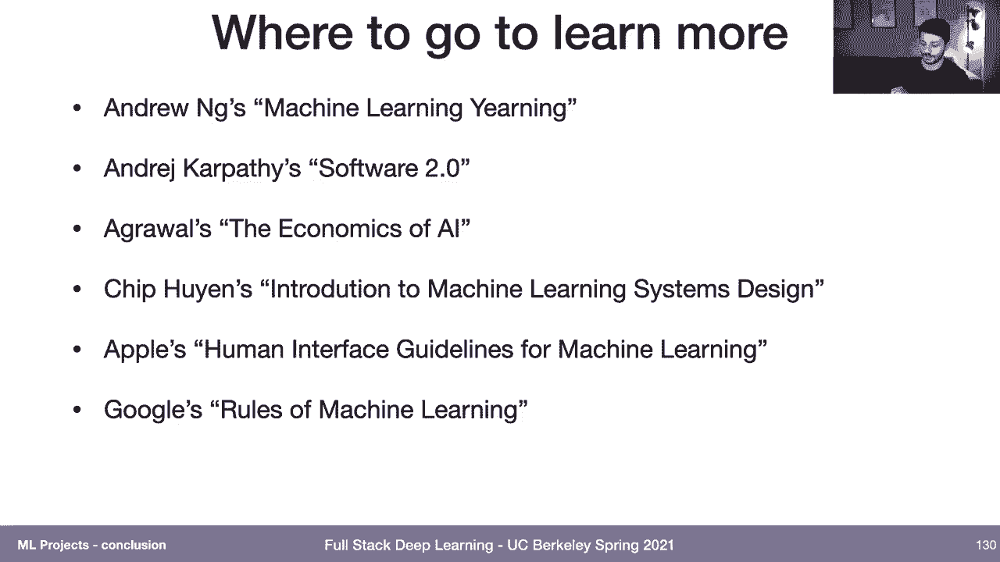