# 【双语字幕+资料下载】伯克利FSDL ｜ 全栈深度学习训练营(2021最新·完整版) - P12：L6- 基础设置和工具 - ShowMeAI - BV1iL411t7jE

so today man let me show the dog again，okay so this is my dog she got shaved。

so she looks a little weird but，she helped me develop these slides the。

slides are about infrastructure and，tooling，and i want to start off by describing，the dream。

that that practitioners have which is，that we provide data，and then we somehow just get a really。

good machine learning prediction system，and it's available as a scalable api or，an edge deployment。

and that deployment generates more data，for us，which we can use to improve our system。

and that's really the dream the reality，is that you don't just。

grant the data to the system you have to，find it aggregate it process it。

clean it you know label it version it，then you have to write and debug。

model code then you have to somehow find，compute，run a lot of experiments review their，results。

discover that you did something you know，wrong or maybe just try different。

architectures to write more code，provision more compute do it again at。

some point you're happy with it so you，deploy your model，and then you have to monitor the。

predictions，that the model makes on production data，such that you can gather。

some good examples aggregate and process，them clean them label them。

add them to the data set version and，then do it all over again，i'm not the only one who's saying you。

know the what the dream，is this is andre carpathi slide，from a couple of years ago i guess。

called operation vacation so that tesla，self-driving，their dream right is to build a system。

that basically goes from the data，they've gathered，inference，processes deployed on the cars。

and then as people drive gather more，data and then just seamlessly add it，back to their data set。

and then do the process again so that，they can all go on vacation。

and see a model improve even in their，and when you think about what the dream，takes。

it's actually not mostly machine，learning code right it's all the。

stuff around it to create the system for，this machine learning system to improve。

and this observation was made a few，years ago，most famously in this paper called。

machine learning the high interest，credit card of technical debt。

the observation basically is that the，machine learning part of the code base。

is actually a very small part of it and，in trying to deliver，that part of it you take on a lot of。

debt and building up all these other，components of the system，that then have to be maintained and。

invested in and so on just for your，little，thing that you originally set out to do。

we can break down the landscape of all，this infrastructure that's necessary。

into three broad buckets one has to do，with data，the other has to do with the training。

and evaluation of the models，and then the third one has to do with。

in data we have the sources of the data，logs databases，file system you know images and stuff。

like that，data lakes and data warehouses like data，bricks snowflake bigquery redshift。

processing of the data via airflow or，apache spark or dagster stuff like that，exploring the data。

with pandas potentially transforming it，into forms that are more amenable to，exploration of sql。

with dbt versioning some final kind of，and for a lot of the data that we deal，with we also have to。

actually label it because it comes in a，way that's not immediately useful。

for training on the training side we，have the source of compute could be，hardware。

it could be cloud providers of which，there are a number of different vendors。

then once you've provisioned the compute，you have to manage the resources that，you now have。

in order to efficiently use them there's，basic software engineering skills of，course that。

play a role in all of this there's deep，learning specific，and machine learning specific frameworks。

which allow you to do distributed，training more easily also，all this training is generating a lot of。

data that you need to manage so there's，things like tensorboard，weights and biases for experiment。

management，and running experiments blind is one，thing but it'd be nice if we could be。

guided in like what experiments to，actually run this is often called hyper，parameter tuning。

and there's other solutions for that，once we have a model we're happy with，results。

and ideally just automate the process so，that's continuous integration。

we want to ensure that the model，performs as well as we expect via，testing。

if we're deploying on mobile or hardware，like you know robotic hardware or some。

kind of sound series or anything like，that，often called edge computing we need，specialized tools to。

to do that well if we're deploying to，the web there's different，deployment options available to us。

we will want to monitor our running，model in order to，catch certain problems with it and also。

maybe find good data points to add back，to our data set，around all of this。

you know i broke it into three buckets，but in fact you can think of it as one。

kind of ammo ops process and there's a，number of vendors offering like an，all-in-one。

ammo op solution like amazon sagemaker，domino data lab and then most recently。

also there is this concept of a feature，store which，plays a role in data but also in。

deployment so i put in the deployment，bucket，and today we're going to talk about the。

middle part of this，diagram so training and evaluation so，i'd like to start with。

with the most foundational thing here，which is just software engineering。

the programming language we use for，machine learning and definitely deep，learning is。

is python and the reason for that is，actually because of the libraries not，necessarily。

because of properties of the language，but because of the libraries that have。

that have that have built up over time，python's the clear winner in scientific，and data computing。

there are some nice things about it it's，very interoperable with，with low level languages like c but。

that's also kind of a negative it'd be，nice to just not have to leave python。

and be able to write really performing，code，as things stand today you kind of have。

to write the really performant，scientific and data computing stuff in，in c。

using cython and then integrate it or，you know c plus plus，or any other low-level language and then。

integrate it with python via，a library but it's a nice experience for，writing scripts and。

a lot of scientists and statisticians，and people that aren't computer science，first but are。

some other discipline first came to，python because it's such a，logical language to kind of write it。

almost reads as as english language，and so now it's the scientific language。

to edit code we use text editors，there's old school stuff you know old，school options like vim。

emacs we can spark a little，poll maybe if someone wants to post the。

poll right you know then versus emacs，key bindings there's nodebooks which is。

an interesting way to do scientific，computing where you execute one cell at。

a time and see the results of running a，cell，and you can execute cells out of order。

jupiter is the python solution for，nodebooks，there's new school editors of which i。

think the clear winner is vs code visual，studio code，open source project from microsoft and。

there's also python specific，integrated development environments like。

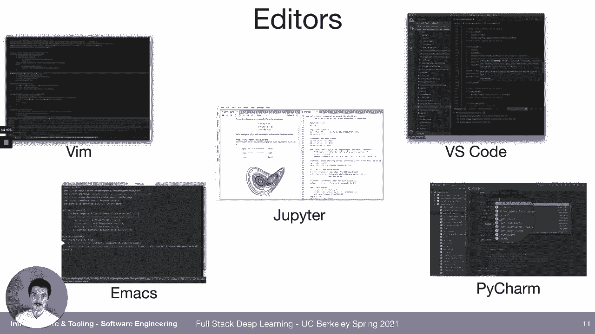

pycharm which are also quite，quite nice visual studio code makes。

for a very nice python experience and，it's free，it's easy to set up it has a powerful，ecosystem。

so that's what we recommend i want to，point out some nice things about it。

just in case you haven't used it so far，there's built-in，version control uh staging。

and diffing so you can see like the diff，between，you're，you've actually edited and you can，commit。

straight from your editor you can look，at the history of commits，you can do a lot of stuff without。

actually leaving your editor，you can peek at documentation for，different functions so as you start。

typing，there's powerful autocomplete that it's，called intellisense that。

analyzes your code base analyzes the，code base of your，dependencies and then is able to present。

helpful documentation，autocompletes for you you can，open projects remotely very easily which。

is quite nice，so the farm2 is a machine that that i，have access to and。

with just one click i'm able to get a，text editor，on another machine you can lend code as。

you're right so you can see，certain highlights maybe problems you，know potential problems。

syntax errors and other problems with，your code，this is another view of visual studio。

code that i just wanted to show that you，can also use the terminal。

in the same window which is really the，way i do things now i used to use the。

terminal separately from the，from the editor but now i use actually，the integrated terminal。

in the editor and it's just super nice，and specifically for notebooks it's，quite nice because。

or when you're working on another on a，remote machine，let's say you start a notebook in the。

terminal so you say jupiter notebook，that starts a notebook on that server。

and what vs code does is it，automatically forwards the port，from the remote machine to your local。

host so you can open the notebook，i want to make a note about winters and，type hinting。

so linters are，rules for your code so for example，should there be a。

line length limit right some people say，you know 80 character lines that's the，max。

and if a line goes over that limit then，it should be broken up。

into multiple lines well once you make，that decision right is it 80 characters。

100 characters whatever it is once you，make that decision，that should be codified and done。

automatically you shouldn't have to，worry about it，so and that goes for a lot of things how。

should variable variables be named，right camel casing versus underscore，casing。

snake casing everything that can be，codified should be，and additionally static analysis can。

catch some bugs，so let's say you use a variable that was，never defined you might not see that。

but a static analysis program like，pyland will，notice it and and highlight it in red so。

that it's very visible to you and then，we can also，if you see here in the train model。

function signature，it says it expects a variable named，model，and then it says you know colon model。

that's that means the type，of the variable that it expects is model，epochs it expects。

an end batch size and end gpu index，an end that can be none right so an，optional end。

and this kind of thing both documents，your code，which is very helpful but also can catch。

bugs so if you，if you call a function with an in but it，expects a float。

or vice versa there might be some bugs，there，and we'll actually we'll we'll set this。

up for our code base。

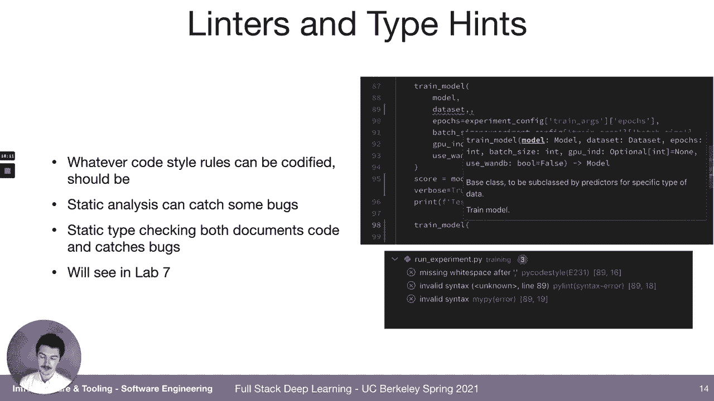

in the labs in an upcoming lab，so jupyter notebooks is something i'm。

sure you guys have seen because they've，become really fundamental to data，science。

and i think they're great as a first，draft of a project，and i think jeremy howard from fast that。

ai is really good to learn from，like his q his uh fast that ai course，videos。

he's just the notebook wizard flying，around doing all kinds of stuff。

very inspirational but it is difficult，to make scalable，and reproducible and well-tested code。

and the reason for that okay drawing on，a blog post called five reasons why，jupyter notebooks suck。

the reasons for why it's hard to make a，good code base with notebooks。

is because they're hard to version they，intersperse you know。

your actual code and the cell output and，so you either have to not commit the。

cell output in which case it's a little，less useful as a notebook。

or commit the cell output in which case，it keeps changing whereas your logic。

might not have actually changed，the the development environment of the，notebook is pretty primitive。

it's，could be a lot better it's you know not，vs code，they're hard to test there's。

out of order execution can lead to，artifacts where，it just doesn't make sense like the。

state of your notebook doesn't make，sense，if you read it from top to bottom but。

you might have executed from bottom to，top or something like that。

so it's just hard to reason about the，state and then it's hard to run。

long or distributed tasks from a，notebook interface，the counterpoint to all of that is that。

some companies that do，good machine learning have based their，ml workflows on notebooks。

so there's some people committed to，notebooks and once again jeremy howard，from fastai。

uses notebooks for everything including，developing his fast ai code base。

and there's a project called nbdev from，from，from that group of people that。

just shows you a way to develop，you know good well-tested code still in，a notebook。

i don't personally vipe with it but i，want you i want everyone to know about，it in case。

an interesting recent project that's，kind of an alternative，to notebooks is called streamlit and uh。

it fulfills this need of interactive，applets so notebooks can fulfill this，need。

via widgets so sometimes you can you can，drop a little，widget as a cell output so for example a。

slider，and then the slider might control the，value of some variable。

but it's a little bit hacky to hook that，up in a notebook whereas。

in streamlit it's like a first class，citizen，and so the idea is that you can make，interactive。

applets like little apps just by writing，python code，and using the streamlet primitives like，buttons。

sliders maps charts and such things，and it's achieved just by decorating，normal python code。

and what they're working on is making it，easy to share these applets with your，team or even just。

you know worldwide on the web that's not，quite there yet but。

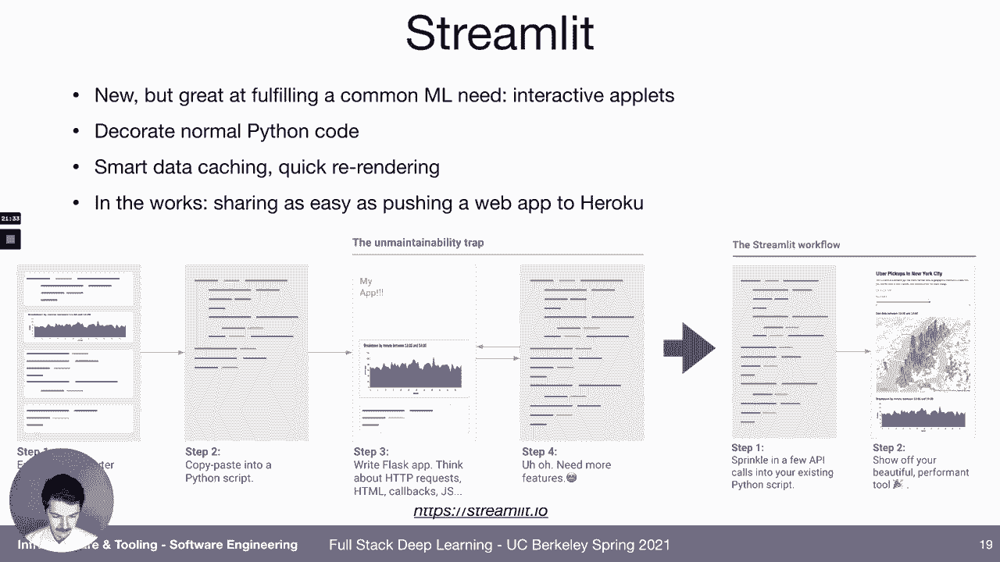

but it's an exciting direction so check，and then one kind of like boring，administrative thing。

is defining all the dependencies right，we have pie torch，pie torch lightning you know pandas all。

that stuff，we recommend using this project called，conda，for setting up the python and cuda。

and qdn environments so you know i want，to use python version 3。8，but not using conda for the actual。

python requirements，like pytorch and，my pi and stuff like that so for that we，use。

pip tools and the reason for that is，because，pip tools has a really nice system for。

breaking up requirements into several，files so you might have，production requirements which are。

separate from development requirements，which are separate from your test，that。

using pip tools and it also，separates locking the exact version，want。

that package right so i want numpy i，don't i don't care what version of numpy。

i get i just want numpy but for，reproducibility，i wanted to be stored what exact version，of numpy。

i used and so just separating that out，is what pip tools does，really well so check out our sample。

project and。

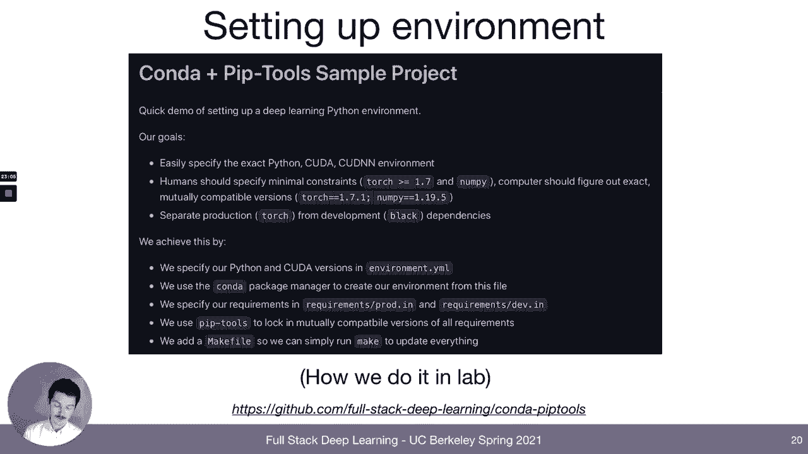

this is also how we do it in the lab so，the next thing we should talk about。

what are the compute needs for for deep，learning i like to kind of break it down，into。

into a basic like you know early，development and then scaled out training，and evaluation。

so when we're doing early development，we're writing code we're debugging。

the model we're looking at the results，we want to you know quickly do things。

it'd be nice if we could use，things that we're comfortable with like，like guise。

and what could allow us to do it is，actually having gpus，in our desktop like in a computer we。

have access to，or a compu or a computer we can easily，ssh into，and for you know。

rapid experimentation it'd be nice if it，so it could be on-prem could be in the。

cloud for scaling out，your training we're going to want to run。

some kind of architecture hyperparameter，search，we will want to train models that just。

don't really fit，on only four gpus and it should be easy，to launch experiments。

on onto this you know compute and review，all the results that，are getting generated so here it'd be。

nice to have，a cluster of machines could be on-prem，with，each passing gear is because the results。

that are coming out of deep learning，are using more and more compute right so。

i think we had the slide in the，fundamentals lecture but it's，you know notable deep learning results。

versus time，versus the petaflops that，you know of compute that they used it，keeps on going up。

and you can see this in the transformer，models that we discussed last week，so jeep you know gpt3。

still hasn't been trained by the，community right only，open ai train that using like microsoft。

cloud and，millions of dollars we still haven't，done that but you know google already。

came out with google switch transformer，which is another couple of orders of。

magnitude larger than that，so it's just it's a race to fit bigger，and bigger models and run。

so one question we have is do we try to，get our own hardware or just go straight，to the cloud。

and to answer that we should look at the，gpu basics，we should look at the cloud options we。

should look at the on-prem options，and then try to analyze what's going on，make a recommendation。

so the basics of gpus is that basically，it's an it's an nvidia game。

right it's a still really the only，provider of good，they're not the fastest that's actually。

the google tpus tensor processing units，which are available on the google cloud，platform。

but it's worth you know，unless you're committed to only using，tpus which。

i don't think anyone is it's worth，knowing about the nvidia gpus。

and so there's there's a number of them，but we can make some sense of them。

so the first thing to notice is that，there's a，new nvidia architecture every year too。

and it went from kepler back in like，2014 when the，when the deep learning revolution was。

just getting kicked off，to pascal to volta to turing so it，increases alphabetically。

they come out with a server version of，the card first，and then like an enthusiast version like。

you know a retail market，card but that's still very expensive and，then a consumer card that。

that most people are just gonna be，gaming on，and if you're using this for business。

purposes you're supposed to just use the，server cards，not the you know also possible to game。

on cards，gpus have different amounts of ram this，is very important，because you can only compute。

on data that's on the memory of the gpu，so if you can't get your data onto the。

gpu you can't compute on it，the more data you can fit on the gpu the。

larger your batches are the faster your，training goes there's so first of all no。

one does 64-bit computing and deep，learning，it's it's for some scientific computing。

stuff like you know predicting the，weather，or splitting the atom or whatever 64-bit。

scientific computing is is often done，for deep learning 32 bits is what you，use。

you don't you just don't need that much，precision and in fact。

you actually don't even need 32 bits of，precision i guess we'll talk about that，next。

but starting with the volt architecture，nvidia developed this technology of。

tensor cores which are specifically made，for deep learning operations which are。

mixed precision between 32 and 16 bit，so it might be you know 16-bit addition。

32-bit multiplication or，something like that they split up the，bits。

in a very efficient way to make these，matrix operations incredibly fast。

and this is really good for for the type，of models that are prevalent today。

convolutional transformer，you know fully connected models there's，also。

16-bit straight-up 16-bit training，and that just means that you can fit，larger batches。

on your gpus of the same data just，because it's not as precise。

it works just about as well and it is a，so going through the architectures and。

sequence we can talk about kepler，maxwell first real quick，it's a lot slower than the pascal volta。

architectures，and basically you shouldn't buy it but，you will see these in the cloud。

in the cloud offerings k80s and p100s，in fact the k80 is what you're likely to。

get if you if you get a collab，and yeah so they're cheap on the cloud，because they bought。

many millions of them and now they're，stuck with them，then there's pascal architectures。

so the 1080 ti is from like 2017，it's still okay you know if you're，buying used for cheap。

especially for recurrent networks where，you don't get that much of a speed up，from the。

and p100 is a cloud server，gpu that uses the pascal slash volt，then you have the voltairing。

architecture which is，a preferred choice you know over the，kepler and pascal because it supports。

the 16 bit mixed precision，via the tensor cores which makes，everything faster。

so the 2080 ti is like at least 30，faster than a 1080 ti，in 32 bit but it's twice as fast if。

you're using 16-bit training，and the titan rtx is even faster than。

and in the cloud you have the v100 which，is the kind of，well it's not the ultimate anymore but。

it used to be the ultimate for speed in，the cloud，14 i think million 32-bit。

oh yeah 14 32-bit teraflops，and then most recently as in like。

just in 2020 and really the the consumer，versions，are just coming out right now like the。

30 90s and 80s and 70s，the most，tensor cores so they have the most，tensor t flops in this table。

it's like at least another third speed，up over a turing like the 2080 ti。

here's an older benchmark that doesn't，include the 30 the，3000 series but you can see that the，v100。

is fastest and then the tpu is still a，little bit faster than that。

but the a100 which is the ampere version，of the v100，is like two times as fast as the v100。

for confnets，and even faster than that for language，models and this is according to。

benchmarks by the the folks at lambda，labs which which build these machines。

a great resource for all this stuff is，tim detmers，a grad student at uw and they he has a。

post for which gpus to get for deep，learning，right now he's recommending the 38 or。

the 30 90 as the gpu to get，because it's so much faster you know，maybe even twice as fast as 2080 ti。

the problem with the 3000 series is，their heat heat production，and power consumption so you can fit。

four 20 80 ti's in a reasonable desktop，rig but you can't do that with the 3000。

series it would like use too much power，like it literally your household，power。

to to power it and then they build too，much heat so you can't really fit more，than two。

in the cloud you have amazon web，services，google cloud platform microsoft azure。

they're the heavyweights，they're all pretty much similar in，function you know what gpus they provide。

and how that all looks and price，other two，gcp is like a tiny bit cheaper it also，has tpus。

which is quite nice and then azure，i don't know people have really used it，but it has the same。

kind of gpus at roughly the same price，there's startups that are exciting one。

is core weave there's lame the labs，so on amazon web services here's some，pricing。

so you can get a k80 well you can get，eight k 80s，each one has 12 gigabytes ram。

that'll be 14 per hour you can get eight，v100s，each of these gpus has 16 gigs ram，that'll be 24。

per hour you can now get a special v100，with 32 gigs ram not 16 gigs ram。

so this is really nice for these big，language models and that's 31。

an hour and then now the the most recent，gpu is the a100 and you can get eight of，those。

and each one has 40 gigs ram for 32 an，hour so this is quite，this is quite wild so there's three。

generations of gpus they provide，and we've been doing this course for a，change。

they're just kind of sticking to these，prices，so on google cloud platform you also。

have the k80 you have the v100，you also have the p100 which is a little，bit cheaper and and slower。

and you have the a100 in some zones，because it's so new，but the real start of the show might be。

to use，so the，promise of tpus is that they're more，expensive per hour，have。

a lot of memory so you can crank through，training faster，i haven't personally used them it's kind。

of exciting to get a tpu，in a collab i don't know if that's ever，happened to you but。

microsoft has k 80s p100s v100s，has similar pricing then there's the。

startups so there's lambda labs cloud，which you can get either four 20 adtis，basically。

uh pascal based 11 gig gpus，for 1。50 an hour which is pretty great。

or you can get an 8 gpu v100 machine，for 12 dollars an hour so that's 12 an，hour。

versus 24 an hour on，aws so that's making a big difference，there's a startup called coreweave which。

i think pride themselves in having the，lowest price as possible。

and so there you can get eight v100s for，only，four dollars eighty cents an hour it's。

the fourth row on this table，so yeah each v100 has 24 gigs，that's。

that's really good on-prem you have some，options you can build your。

own machine which is actually pretty，doable，up to four you know 2080 ti's or two 30，90s or 30 80s。

you can buy a pre-built machine lame the，labs，they do the cloud offering but they also。

build machines that's your main business，and video will sell you a machine and，then there's。

standard kind of server pc builders like，tech，there's a bunch of them i built this one，at some point。

420 adtis uh i think it cost，around seven thousand dollars and then，today with the 30 90s。

you'd only be able to do two of them，probably be around that eight thousand，dollars。

the problem is you probably can't find，the 3000 series gpus because they're all，sold out。

i guess nvidia had trouble producing，them at the scale they need and also，people are using them for。

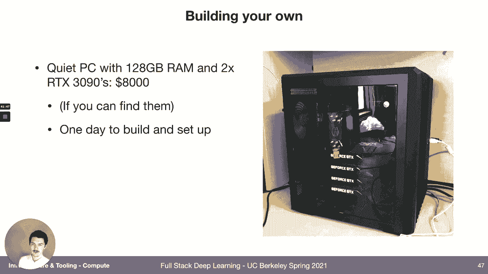

for like ethereum mining again，but it's kind of fun to build a pc if，you haven't done it。

it's painful to go beyond four gpus or，two of the three thousand series gpus。

so don't try that and then once again，tim that merge is your friend。

he'll you know he'll help you pick the，components for this machine。

if you don't want to go through the，trouble which is totally reasonable you。

can just buy it from lambda labs，i configured one last night with the 230，90s。

24 core cpu 256 gigs ram it's like 11，000。 so that's probably like 20。

more expensive than if you built it，yourself，but it also has a warranty and you know。

probably worth it and it's definitely，worth it if you're trying to build a，server grade machine。

because it's just not we can't we can't，build them，we have to buy them so if you want to。

you can buy an，eight you know v100 server for around，100 000。so these prices are pretty big right。

like a hundred thousand that's，that's a lot of money but，if you compare them to the cloud it。

actually starts to make sense，and so here i worked up a 4，x 2080 ti machine。

versus a 4x v100 cloud machine，right so we can build a for 2080 ti，machine。

for let's say ten thousand dollars it'll，actually be cheaper but let's just say，ten thousand dollars。

and we can use a forex v-100 machine on，aws for twelve dollars，so then if we run the machine that we。

then in five weeks，it's equivalent to running the v100，cloud instance full time。

if we don't run it full time but we run，it for like 16 hours a day five days a，week so that's like。

you know you come in you start running，experiments you run them but then they。

finish at some point while you're，sleeping，and then you don't work on the weekend。

then it'll take 10 weeks，one way to see it is here's someone on，reddit who built。

a deep learning bricks like six thousand，dollars，claim，cheap，i think it's 20 markup that lame the。

labs does，not not like 100 but，but still you know it costs a lot to，train。

on imagenet on 2080 ti's so，you save twelve hundred dollars which is，the cost of a 2080 ti。

every time you run a full image in that，training，if you did it on your own build instead。

of using the google compute engine，which i thought that's like an。

but another way to use the cloud is to，launch a lot of experiments。

at once using specifically on-demand，instances also called spot instances so，i've been giving you。

per hour prices there's another way to，to get instances which is，spot pricing which are called。

preemptables，that means you get an instance but at，any second it might disappear from under，you。

and for that risk you get a lower price，know，you're launching a whole armada of。

experiments at once so it's okay if some，of them die，and then get restarted later so using。

the cloud you can enable quicker，experiments，and so if time is a very important，variable。

not just money then that's a reason to，go with the cloud，because you you can't like if you only。

have four gpus，it'll take you 24 hours to run you know，16 trials，if each trial takes six hours but。

on the cloud you can actually just，finish all of them in six hours。

but the price is still pretty steep，right so it's，you know you can only run a hundred such。

experiments before，you have paid the cost of a whole，machine to the cloud。

so in practice you know the cloud is，expensive，but it's also hard to make on-prem scale。

past a certain point，there's devops things that we have to do，like provision instances。

you know make repeatable certain tasks，that are just easier to do in the cloud。

than to like try to set it up yourself，and then if a machine dies or needs some，maintenance。

that's going to be a constant headache，if if you're responsible for managing，on-prem machines。

and in the cloud you wouldn't even know，about it they just you know they they，deal with it for you。

for a hobbyist our recommendation is to，build your own pc，you know maybe a 4x 2080 ti or 2x。

uh 30 80 machine，and then if you want to scale out the，your experimentation。

i mean you could just use the same，machine just like run it overnight。

all the time but you could also，then go to a cheaper kind of startup。

cloud like lambda or core weave and then，get cloud instances there。

for a small company or startup i think，you know let's buy a lambda labs machine。

that's sizeable for every machine，learning scientist that we have。

and then to scale out let's buy more，shared server machines，and put them in a data center or use。

cloud instances like v100 instances or，something，and then for a larger company let's you。

know i think，let's up that adax gpus per scientist，or just go straight to the cloud with。

fast instances，because presumably you know money is，less of a less of a concern。

so next up let's talk about how do we，actually manage all these。

we have maybe multiple scientists using，multiple machines with multiple gpus。

they might be running different，environments and what we want them to be，able to do。

is run many experiments with each，experiment having its proper，dependencies。

and the resources in terms of gpus and，cpus and ram that it needs。

for the experiment and there's a number，of solutions we could do。

we could kind of try to script our own，solution to it，we could use uh slurm which is a，well-known。

cluster work workload manager，we could go with docker and kubernetes，or we could use software that's。

specialized for exactly this use case，so the simplest thing is like just。

maybe hand coded stuff right so what we，want to do is allocate resources that，aren't being used。

to programs that will use them we could，actually just，just，checks like is a gpu available if i'm。

about to start using it then like lock，it so that other people can't use it。

and that's you can do that even better，you can use，a cluster job scheduler often it's it's。

going to be slurm，and so the way that basically works is，you have a script that defines the。

resources it needs，so this script needs one gpu 10，gigabytes ram。

and then specifies the dependencies it，needs and then says what commands it，says，python cnn。

pie and then you submit that，job definition using the slurm kind of，cue runner。

and so you submit it to the queue and，then slurm executes it，on a machine that has the necessary。

resources，and so then all of your scientists can，if everyone agrees to use slurm。

they define their jobs using it and then，the cluster scheduler，correctly allocates resources to them。

if that's a little too old-school for，you you can use docker and，kubernetes so docker is。

a way to package up like an entire，dependency stack so that you know。

cuda version certain binaries python，version，everything you need but exclude the。

operating system so a virtual machine，includes the operating system。

in like it's packaging docker does not，it only includes，the the precise dependencies on top of。

the operating system and then，the code we'll talk more about it in the，deployment lecture。

and we'll use it in that lecture lab and，then kubernetes，is a way to run a lot of docker。

containers on top of a cluster，so kubeflow specifically is an open。

source project that's been gathering，steam，originally from google but now it's it's。

it's a community project，that lets you spawn and and get jupiter，notebooks。

and have multi-step amount workflows，which can include gpus，and there's like plug-ins that people。

have that make certain things，easier it's still kind of a pain to set，up。

and this is actually an active area like，it should be a lot easier to provision。

computer resources for deep learning，there's all-in-one solutions that we're。

going to talk about like sage maker，paper space gradient determined ai。

that also you know provision resources，for you really nicely。

so we'll talk about that later also some，recently you know recent startups。

have this specific thing as their main，goal，so for example there's any scale。

which came out of berkeley rise lab，they had an open source project called。

ray which we'll also talk about and now，it's a company called any scale。

and that's kind of their vision right，it's like it should be really easy to，provision。

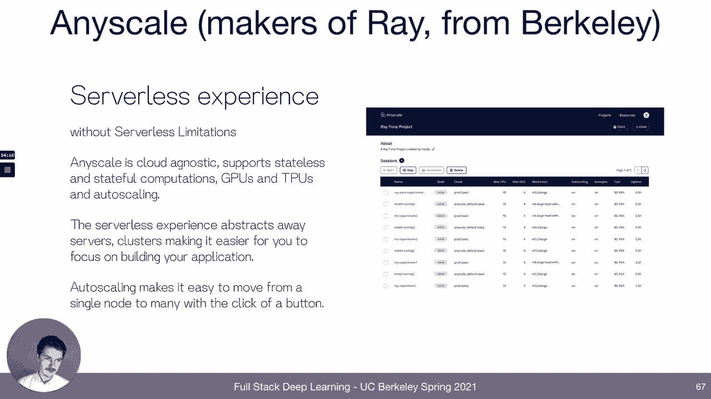

the compute you need get some work on，your laptop and then，effortlessly scale it to the cloud。

and then from the makers of pytorch，lightning there's a startup called，grid。

ai which has that same vision too，right，so it should be on your local machine，you say python model。

pi，a learning rate you know 1 to the power，of negative 6。can it be as easy as typing that we just。

type you know grid train，that pi，that's our code and then learning rate，search。

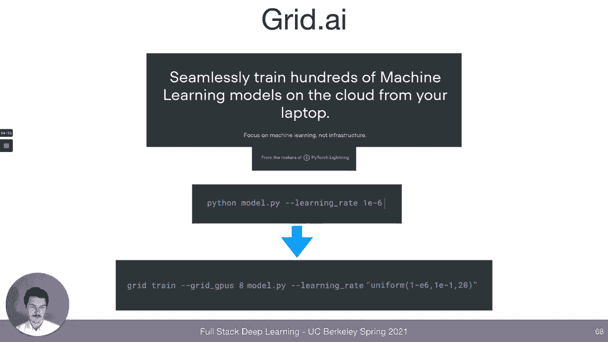

right just that easily so that's the，vision，you know we'll see if it if it bears，fruit but。

for now the recommendation is probably。

to use slurm let's talk about，frameworks and how they can make，distributed training。

easy so deep learning frameworks，decade，with um thiano and torch really old，projects actually。

and you can think of where each，framework might fall on，this on this chart where the axes are。

is it good for production use aka is it，really fast，and the other axis is is it good for，development。

models，in this framework and when tensorflow，came out in 2015，it was you know billed as really good。

for production，it makes the static optimized graph，that's can be deployed to。

gpus cpus even mobile devices，but the user experience of it wasn't，very good because you had to like。

basically do this meta meta thinking，where it's like you would just。

you would use a programming language to，describe the execution graph。

of the deep learning model and it just，didn't really fit，in how people thought naturally cares。

made it a lot easier to use，it's not a tensorflow only project but，it is now part of tensorflow。

it's just a lot nicer of a way to define，deep learning models and kind of hides a。

lot of the complexity of tensorflow，behind the nice user interface pytorch。

came out a couple of years later，with kind of a different pitch right it。

like wasn't supposed to be the fastest，model produced out of out of dunagan pie，torch。

but it was basically straight python，and you guys have seen that in the lab。

right so it's a really good development，experience，so these are both these are still the，two leading。

options tensorflow and keras or pytorch，and you should，use one of them unless you have a good。

reason not to and both have since，converged to the same point。

which is tensorflow got eager execution，and so tensorflow 2。0 you can write code。

that looks a lot like pytorch，and then pytorch got a lot better at，being fast。

because this project called cafe 2 got，folded into it via，torch grip so you can compile your model。

down to a really fast，most new projects today use pytorch i，think because of。

just it's way more depth friendly for，python users，there's some libraries that have come。

out since that make，it even better for development so，fast。ai is a good library。

it builds on top of pytorch and it，builds in a lot of good practices，best practices and then pytorch。

lightning is what we use in labs，similar vein right adds a very powerful，training loop encodes。

best practices makes like distributed，training really easy，so here's some evidence that pythorgs。

dominates new development，you know at least when you look at，academic publications。

we i don't have more recent data than，this but，it's up you know upward of eighty。

percent of like submissions are，in pytorch you can search，for or you can see how users are。

searching for pi torture tensorflow，looks like they're about equally popular，right now。

and you know why do we need tensorflow，or pytorch，deep learning is actually like not a lot，of code。

if you have a good matrix math library，like numpy，so we were able to code you know at。

least a linear layer，in like 20 lines of code，but we had to code our own backwards。

loop or backwards pass，and，yeah if you're able to do that then it's。

not a lot of code but we don't want to，be able we don't want to have to do that。

we want audit differentiation which，means we just write the forward pass。

and then we want the framework to figure，out how to，back propagate through it so how to。

differentiate the function that you，wrote，and also we use numpy but that doesn't，actually use gpu。

so if we want things to run on cuda，that's going to be another，a lot of work because now you have to。

write actual cuda code，also there's like all the layer types，all the different convolutions and。

transpose convolutions and like，lstms and whatnot optimizers interfaces，to different data formats。

so all that stuff really built up so，that's why we need frameworks。

except sometimes you really don't need，all that stuff um you just need auto，differentiation，is。

a recent project from google called jaxx，which is really just like numpy you know，numpy matrix math。

plus auto differentiation and then，compilation，to code that can run on gpus or tpus。

it doesn't have all the deep learning，layers and it's also，not just for deep learning but it's just。

the way to like do really fast，numerical computing on gpus and it's，been picking up a lot of steam。

then there's kind of task specific，frameworks like hugging，face so hugging face is on top of both。

pytorch and tensorflow，and they've defined they've written a，lot of different model architectures。

mostly for nlp which，is very valuable right so it's like yeah，it's cool that we have a conf layer。

but can we have a whole bird model，well with hugging face that's that's the。

level of abstraction that they're at，and they also share pre-trained weights。

for all these models which is，really useful so distributed training，someone asked about。

and it's a big topic what that means is，it's using multiple gpus and potentially，multiple machines。

to train a single model，so that's more complex than just using，multiple gpus to train。

multiple models as in running different，experiments，but it's really a must do nowadays，because the。

because the data sets are so big and the，models are so large，it really just takes forever to crunch。

through the data on a single gpu，versus if you do data parallel training。

what you do is you split up essentially，let's say you want a batch size of you，know。

100 and you have 10 gpus，you can distribute that batch such that，each gpus gets。

10 examples they crunch through the，computations，and then they they do their backdrop。

updates and then they，share what what their gradients were，with some central place which is。

usually just the cpu or just one of the，gpus，and then the the gradients are averaged。

and then pushed back out to all of the，gpus and this is，almost a linear speed up so if you have。

two gpus you should expect like a 1。9，speed up if you have four gpus a 3。5。

speed up this is borne out in benchmarks，so data parallelism is what people。

usually mean when they talk about，distributed training，and it works well we'll see in the next。

couple of slides how to implement it，model parallel training is a different，beast。

and that's necessary when you can't even，fit，the weights of the model on a single gpu。

so data parallel assumes that，all of the weights of the model are on，each gpu。

and we're just splitting up the data to，the gpus model，parallel means that we're splitting up。

the weights over gpus，okay and that means uh the data has to，go through all the gpus。

this introduces a lot of complexity and，if you can avoid it you should try to，avoid it this。

is probably changing like the frameworks，are making it easier and there's，research coming out that。

that makes it that makes it better but，for now it's better to just buy the。

largest gpu that you can or use the，largest gpu in the cloud and then use，tricks like。

gradient check pointing where you can，you don't necessarily have to hold all。

the gradients in memory at once you can，just write some out to disk and then。

kind of load them piece by piece，so if you want to do data parallel，training in in raw pi torch。

it's actually pretty easy so here we say，your model equals，model and then if torch。device count。

is greater than one then we're going to，use several gpus，and we say model equals nn。data parallel。

of the model so that does the secret，sauce magic that's，that now let's pytorch know that data to。

this model should flow to different gpus，then we move we move the model to device。

except now it's actually multiple，devices，just you know auto magically and then，when we train。

we will see that our batch size，is 30 but，inside of the gpu there's only 15 so。

there's two gpu so it splits up that，batch of 30 onto，with pythor's lightning it's even easier。

you literally just say，you know gpus equals whatever if you，have a gpus equals eight and then。

you also say accelerator gdp distributed，data parallel，just so that it's fast and it's actually。

also possible to use slurm，where you also say dash dash nodes，equals four。

and then you define the task to say，you know there's four nodes agps per。

then there's specialized i guess，software for，for distributing models over gpus，horizon。

from uber yeah so instead of，so here it says you know accelerated gdp，so distributed data parallel。

that's a piece of pi torch code that，implements you know syncing the syncing，the weights。

sending the data to the gpus keeping，track of all that so horebond has its，own system。

that that you would use instead and they，use the standard，mpi framework instead of like some。

specialized code like，pytorch distributed data parallel or in。

so i mentioned any scale so the prob the，the project ray，which is the original open source。

project the vision of that project was，not deep learning specific，but it was just to make stateful。

distributed computing，really effortless in python so，if you write your code and then you。

launch it with，through ray then ray takes care of like，basically syncing state across。

distributed system，so it could be useful if if you're not，you're just。

working in distributed computing let's，talk about experiment management。

so just running one experiment at a time，it's actually surprisingly easy to get，lost into。

which code version and which hyper，parameters，and exactly what type of data or you。

know which version of the data generated，the trained model that you produce。

and it gets a lot worse if you're，running multiple experiments at once，so a low co you know low。

tech way to deal with this is a，spreadsheet and just，here's what i did this is the data set。

you know this is the git commit this，these are the hyper parameters these are。

the results that's what people，used to do with tensorboard it's，it's it's better it's automatically。

tracked，by the way our labs with the pytorch，lightning you automatically get，tensorboard。

for all of your training runs，and that's a fine solution for single，experiments but。

as you run you know dozens and，eventually hundreds of experiments。

it's just not a great interface for for，looking at everything you've done and。

being able to make sense of it，it's a it's a good way to look at a，single experiment but not at many。

experiments，so there's software that makes，that part of it better so here's an open。

source project from databricks，but，kind of the central thing is this，experiment management platform。

where you get just the log of everything，that happened and then。

a table that you can kind of filter on，and stuff，specifically for you know to go further。

in that direction，there's startups like comet or neptune，which let you look at。

individual experiments but then also，have a table of，all the experiments you've ever done。

that are searchable，have a chart where you can see the，sensitivity of the different hyper，parameters。

to the eventual accuracy that's that，chart on top there，the，at the time that you ran this experiment。

you know to the most recent commit，and and then store the results like the。

trained weights of the model，weights and biases is another solution，that that。

enables all of this and this is the one，we're going to use in lab。

it's quite nice and yeah tracks gpu。

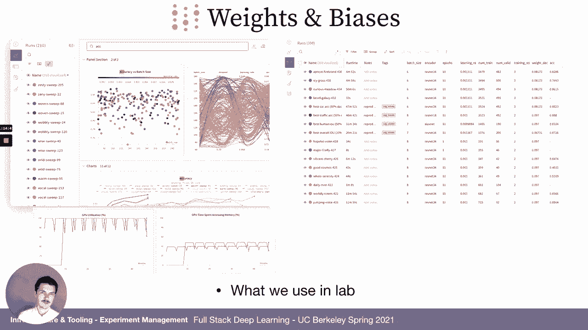

all your runs on the table i mean you'll，see it so i won't spend too much time on，it。

and then another thing weights and，biases lets you do is actually embed all，of those charts and。

parameters and stuff into a nice report，which you can write，and then share with the world or with。

with your with your group or，whoever else you want to share with so，you can combine text。

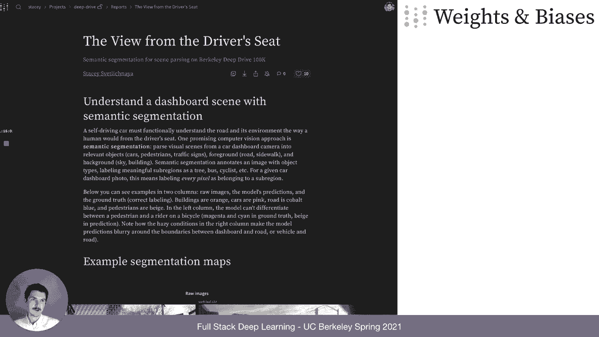

and like machine learning artifacts in，one，document so，briefly that's about experiment，management。

it's useful to have software that，helps you decide what experiments to run。

and that could be as simple as just，being able to say you know on the，command line。

instead of saying you know learning rate，equals 0。1，could we say learning rate equals。

between point zero zero zero one and，point one，uniform distribution and then half。

something just generate a lot of，experiments and sample that space。

and it'd be even better if it wasn't，actually random but if it was selected。

intelligently in some way and also，like as you're running experiments some。

experiments are just clearly not going，to be，like they're not going to be as good as。

some experience you've already run you，can see that from the beginning。

like the loss is always on top of。

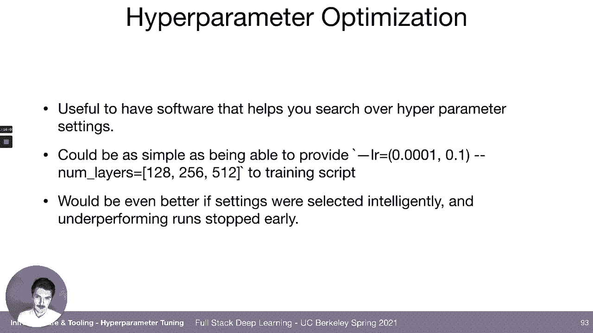

the loss of another experiment it'd be，cool if we could kill those runs early。

sig opt is one company that just that's，their bread and butter，it's an api where you can。

tell them you know what parameters，you're about to run，you know you tell them what parameters。

you want to kind of search over，they'll tell you the values then you，send them the。

output of the training and then they，tell you the new values，and they can tell that to like many。

experiments at once and and they。

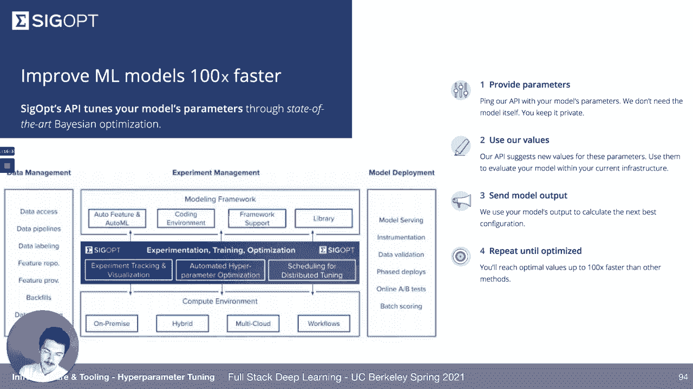

suggest values in a way that's that's，optimized so they use the。

bayesian optimization here if you don't，want to use an api you can use your own。

you know local software so survey tune，another project in the ray ecosystem，can do this so they have。

state-of-the-art，algorithms like population-based，training，will。

give your training runs the resources，that they believe，are the most promising for the the hyper。

parameters，that they believe are the most promising。

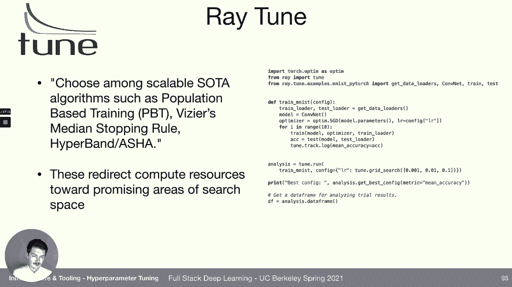

and they'll also kill，training runs that are clearly not going，to be the best，weights and biases has。

this feature also and that's actually，what we'll use in lab since we're。

already using it for experiment，management，here on the right it's a yaml file that，just decides。

that says okay use bayesian optimization，i want to minimize，validation character error rate i want。

to terminate，early using the hyperbane protocol，i wanna and then i wanna explore this。

parameter space，of like different comp dimensions window，width you know fully connected dimension。

whatever，and then then the，it's called the sweep in their language，a sweep server。

is started on on their machine in the，cloud，and then on our local machine we start，agents。

and the agents basically request a set，of parameters from the。

server and then just execute everything，belongs to wnb，and then you get to record all of your。

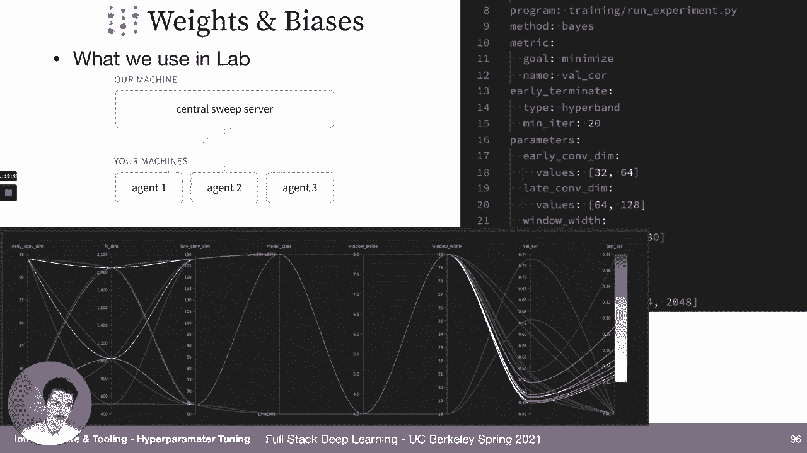

experiments and see how they perform，lastly all of these things right start。

even including data and deployment，and all the parts of training and。

there's solutions that kind of try to do，usually that takes the form of a。

notebook server for development，being able to provision a lot of compute。

and launch a lot of experiments，uh in the cloud then tracking the，results and some kind of。

weights and biases type table，sometimes even deploying the model as a。

rest api endpoint or getting some，artifact that you can，that you can deploy on edge and even。

maybe monitoring the performance of the，deployed model，the earliest that i can find。

of describing like this all-in-one，machine learning system，is probably fb learner from 2016。

so it was an article that described，facebook's ai backbone，which starts with data there's a feature。

bay，the data stores them somewhere，then a training part which also uses，gpus which produces a model。

which then gets deployed again on the，cpu as uh，for as an inference engine and then。

is displayed to the users in a way that，as they interact with it that feeds back，into the data store。

and the process repeats since then，the cloud vendors like google microsoft，amazon have come out with。

their all-in-one systems the google，cloud ai platform，has you know things for data data。

labeling bigquery for，basically warehousing data they have ai，you like。

a really easy to use notebook training，which you can use to spin up a lot of，machines to do training。

for validation you know specific ways to，look at the model that you've developed。

and try to get some visibility into it，and then a way to deploy it。

amazon sagemaker is the that's the name，that the amazon you know basically。

machine learning system has，and once again it has stage maker ground，truth for labeling。

data wrangler kind of like bigquery data，processing，then you have studio notebooks which。

gives you an easy notebook，than than one-click training that gets，you like。

provisioned hardware to do the，experiments，keeps the results of the experiments in。

sagemaker experiments deploys it，and even has some model monitoring。

neptune is a startup that tries to do，the same they kind of have that。

whole system also so does floyd jupiter，notebooks。

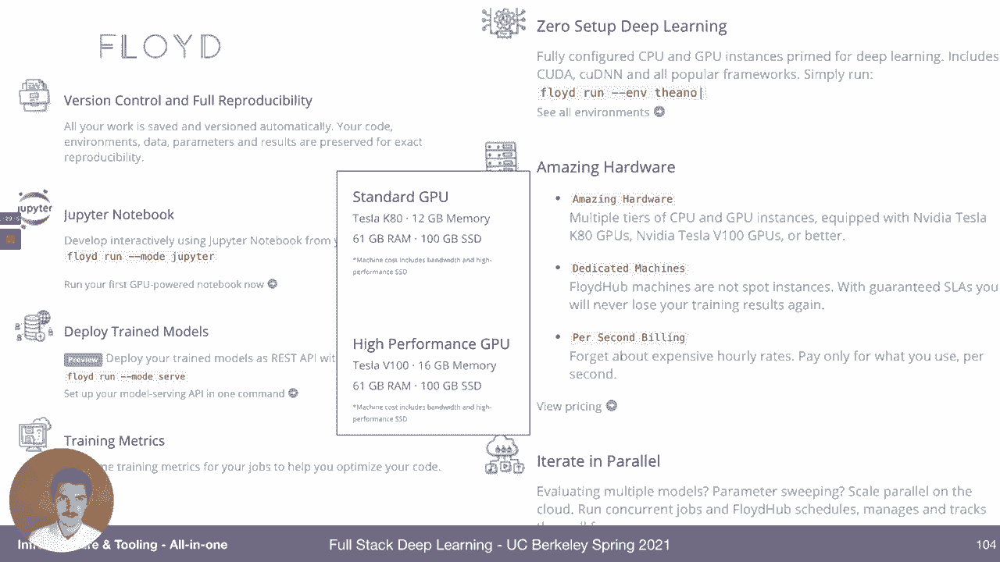

deploy chain models you get，gpus kind of at the click of a button。

gradient by paper space is another one，four，develop one click jupyter notebooks。

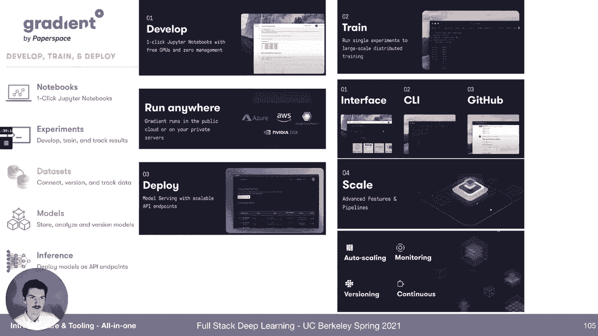

train deploy model surveying，and then scale determine ai is an open。

source solution everything up until now，has been a paid，system i think paper space gradient has。

a free tier but it's all public so if，you want private，experiments that you'll have to pay a。

little bit determine ai is open source，it's actually also from people，originally from uc berkeley。

and they don't do the data or the model，deployment steps，but within the model development and。

training they try to cover everything，right so from resource management。

to to a really easy distributed training，to tracking experiments。

to searching over hyper parameters in，fact some of the，founders of this company are are i guess。

most well known for the，hyperband algorithm so this is，definitely worth a look。

among the startups i think the one that，comes closest to covering everything is，domino datalab。

you can provision compute you can track，experiments，you can deploy the trained model as a，rest api。

you can monitor the predictions it makes，you can publish like streamled like，little applets。

for the you know leads，they can monitor the spend of their data，scientists。

they can see all the projects and kind，of their statuses in one place。

it doesn't it's not quite targeted at，deep learning it's，uh more targeted at like just kind of。

more old school，standard machine learning on structured，data，but i think this is the type of feature。

set that a lot of these，vendors are approaching so i just wanted，to show more of that。

and really it's a natural place to go，for most machine learning，operations companies so for example。

weights and biases，they got started in experiment tracking，giving you like the dashboard of。

experiment results，they expanded to hyper parameter，optimization via，sweeps they also have data set。

versioning，called artifacts right they have reports，apparently production monitoring is，coming soon。

so as we look at，the you know ecosystem of the of all，these vendors，i think a lot of them have the。

inclination and tendency to like push，out into the，surrounding areas so breaking it down a。

little bit，we can look at weights and biases they，don't provision hardware for you。

so so that's not available they don't，manage resources for you。

so they don't like allocate gpus to your，experiments，but they do help you have parameter。

optimization they will store the，artifacts you produce，they'll help you review experiments and。

they don't currently help you deploy，or monitor paper space gradients，uses paper space gpu hardware。

they have their own cloud they will help，you do resource management，they will not help you do hyper。

parameter optimization but they will，help you do，experiments and i guess they do help you。

deploy so i should fix that，and then you can kind of look at the，different vendors on this。

in this table the pricing of these，vendors，is something that often isn't totally。

clear and it kind of depends on your，team size，and exactly how much you'll be using it。

sage maker instances tend to be，they definitely have a markup over the，like if you just。

that would probably be about 20 cheaper，or 40 cheaper than using。

those same instances but provisioned via，sagemaker，so there's a premium for the ease of use。

that sagemaker charges you for，domino data lab is pretty expensive，determine ai has an open source。

solution so that might be worth starting，in a research starting within a research。

environment and then，some of these are free for personal use，like weights and biases is free for。

personal use，but your projects have to be public，which is not usually a big deal。

if your data sets are public but if，you're if you're training on。

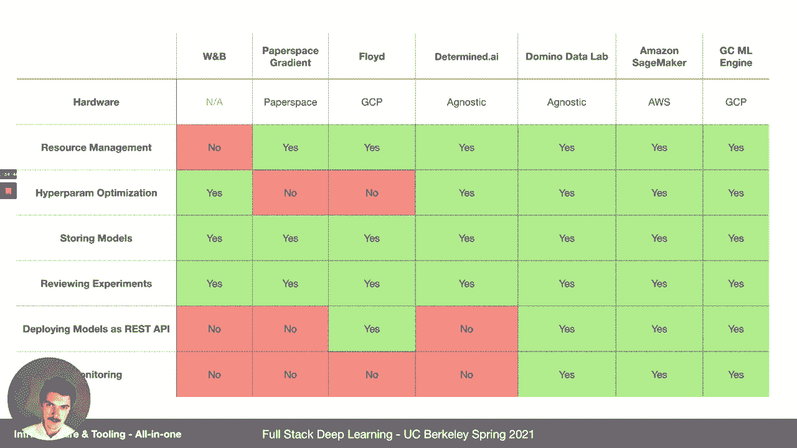

some personal information in your data，sets then，then you need you know a private account，so。

someone asked like how do we stay up to，date with this stuff like how do you，find all this。

so one way that you can try to stay up，to date is follow us on twitter。

and every tuesday which i guess is today，about，some some part of this ecosystem that。

is useful and we explain why it's useful，and sometimes we explain like what other。

alternatives exist that you could be，using instead of it，so that's a good way to do it and then。

yeah i think twitter is a really good，way to kind of build a community and，follow some people that。

tweet a lot about these subjects，we should probably at some point have a。

slide maybe towards the end of the class，where we just have like a bunch of，people that。

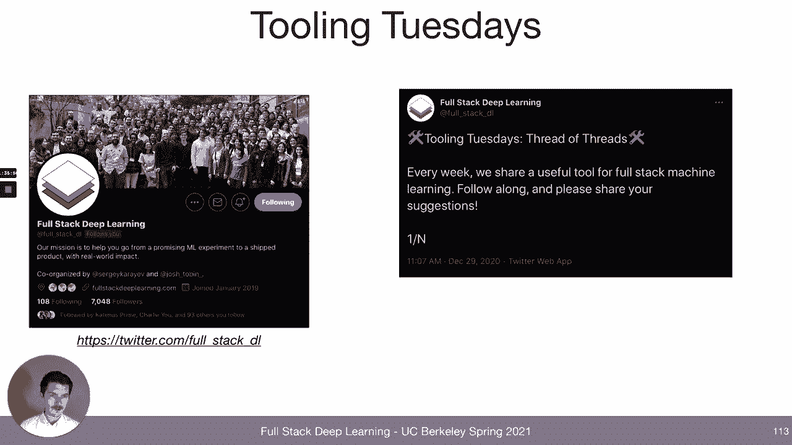

so that's it for the lecture i thank you。

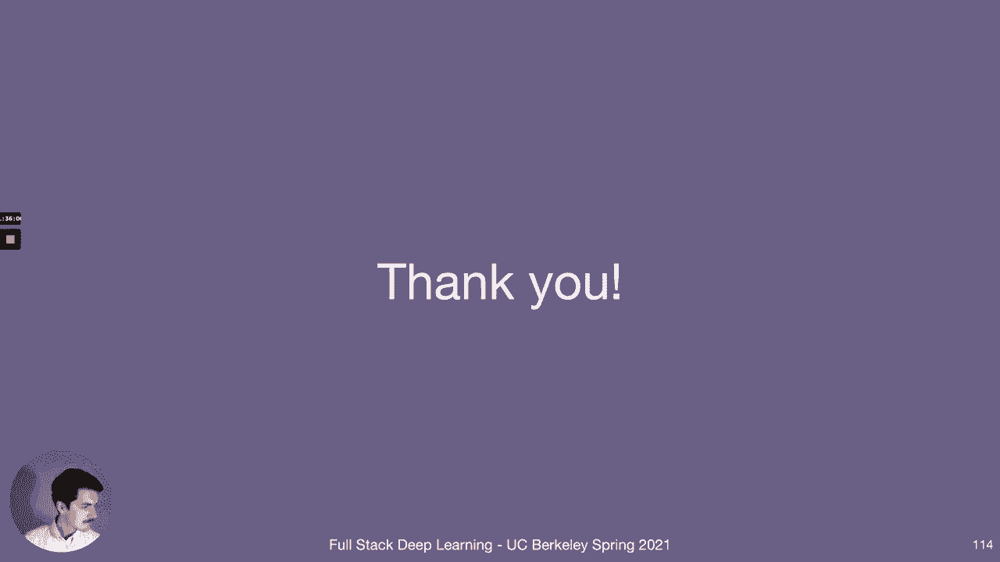