# P13：【Lab5】实验管理 - ShowMeAI - BV1iL411t7jE

so lab 5 is about experiment management，it introduces the im data set。

of real handwritten lines we're going to，take a look at that data set and then。

make our synthetic data set，look more like it with adding data，augmentations。

we're going to introduce weights and，biases for experiment，tracking and we're going to run some。

experiments，on these updated emness lines，and we're going to kind of show how to。

use weights and biases as we run，experiments，and lastly we're going to start a，hyperparameter sweep。

to follow along you can just get pull，make sure you get the latest。

version of this repo go into lab 5。if you're doing this on collab there's a。

couple of new packages that we need in，this lab，namely weights and biases and the，bolt-ons。

so just make sure to install them in，addition to the usual thing that you do。

in setup so the first thing i want to，talk about，is this new data set uh called i am it's。

a data set of，real handwriting gathered by，i'm not sure i'm not sure who but at，some point。

probably in the 90s or the early 2000s，and we can take a look at what it looks，like。

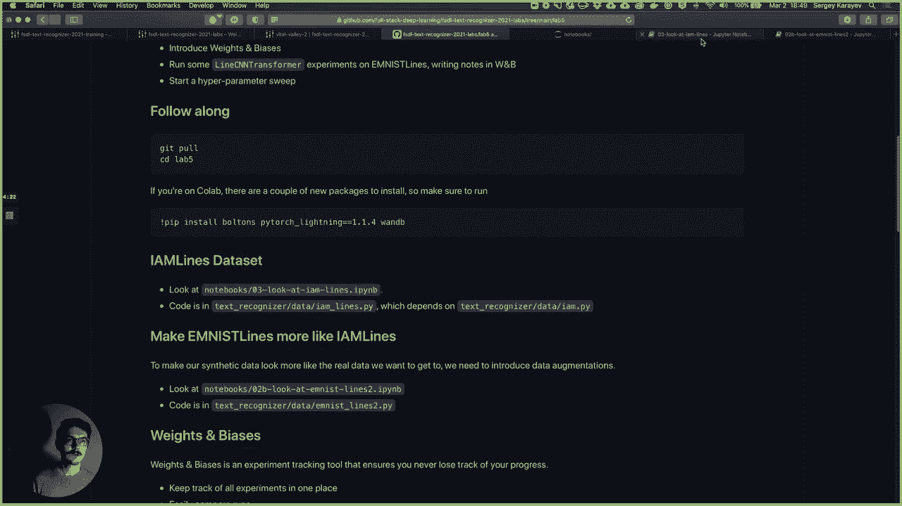

by looking at a notebook but before we，look at the notebook i actually want to，look at。

first you know check out the repo，you just have the raw data about i am，right。

there's a readme about it describes the，way to do，just have a readme with every data。

source that you have describing you know，if you did any pre-processing how it，should be split。

where it's from the providence of the，data so this one is about 1500 pages of，scanned text。

separated out into 13 000，lines of text there's metadata that has。

the url from which we can download the，data a hash for it，to make sure that we downloaded the。

right file and then also，the ids of pages that should belong to，the test set。

and this is important if we want to，compare our numbers against。

published numbers because this is the，data set that's，that was kind of published alongside the。

the images，so once you actually run so for example，you can run，python text recognizer data。

item lines that pi so if you run that，it will download the data set。

and and then do some processing so let's，just wait for it to，do that or i can actually switch to one。

where it's already downloaded，while we wait so，it'll download it into this data。

i guess it's not downloaded here so，yeah so in the downloaded folder we have，i am。

so forms has the raw images and we can，just take a look at what they look like。

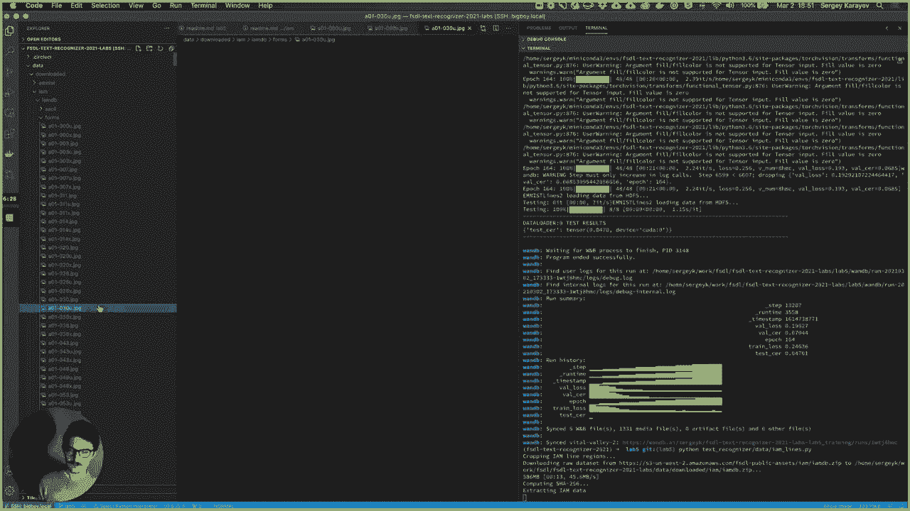

so this is what type of data people，provided，right they were told to take a sheet of。

paper like this and then write out in，and then the data annotation，was annotators went through and。

drew basically line rectangles around，each line and i in fact around each word。

and so now we have the locations，this，in this data set so we're going to use，that。

so i'm switching to the notebook now，we're going to pass augment data to，false just so that we don't。

see that just yet it loads it the，dimensions are 56 pixels high by。

1024 pixels long the max sequence length，is 89 characters，and we can look at what it looks like by。

just plotting them and then putting，the label as the title of，each figure you'll notice that each。

starts with a start token ends with an n，token，and i'm stripping out the padding tokens。

so each one of these is padded，to the max length of 89 also i'm just，not showing that。

and then the images kind of look like，like this，so there's a diversity of handwritings。

some of them are kind of compressed，horizontally some of them are slanted，some of them。

are kind of maybe rotated like there's a，slant to the overall，direction of the line and。

the goal of looking at the data is just，to see what might be out there we're。

also plotting the data between，zero and one so then block is zero uh。

a pure white would be one and so we're，seeing that most of the。

the actual ink is kind of maybe at point，seven point eight or something like that，it's not pure。

pure white so，now that we've seen this we can，try to make our own synthetic data set。

look more like it and so we have that，em-ness lines data set that we composed。

and we can actually look at that in，notebook zero two，it's good practice to number your，notebooks。

so if you remember we had some simple，strings like that，and then we had slightly more。

complicated ones，like this where we introduced some，character overlap and just longer，sequences。

but they were all pretty simple in that，the text filled the whole vertical space，of the line。

it always started you know right on the，left edge，and it was all on the same kind of，horizontal。

dimension it wasn't like ever stretched，or slanted or rotated in any way。

so to make this look more like this，we're going to need to introduce some，some extra things。

and so for that purpose we made this em，this lines two data set。

it's mostly the same code as eminence，lines，but it now looks like this。

so it's there's rotation there's，less it's you know it's less pure pure，white it's more。

faded at times it's horizontally，compressed，there's a slant to some of them the，slant can be。

in both ways and it can start not just，at the beginning of the line but。

you know anywhere in the image，so this is you know much more realistic。

and we can also look so this is the，training set and we can also look at the。

test set and see that it's still kind of，the old。

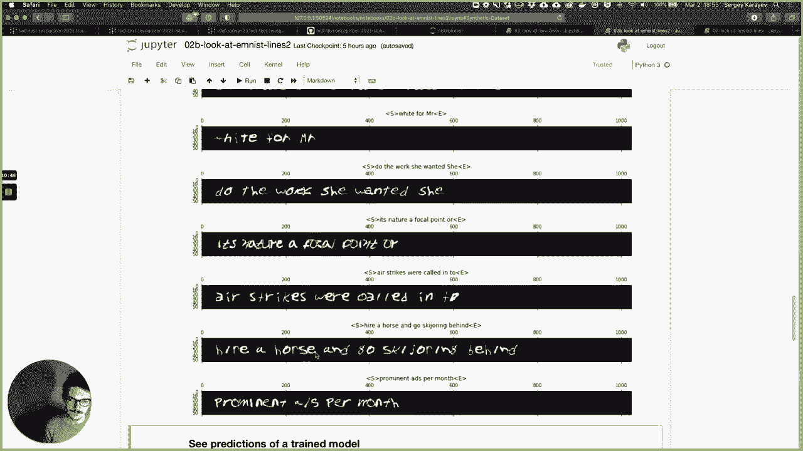

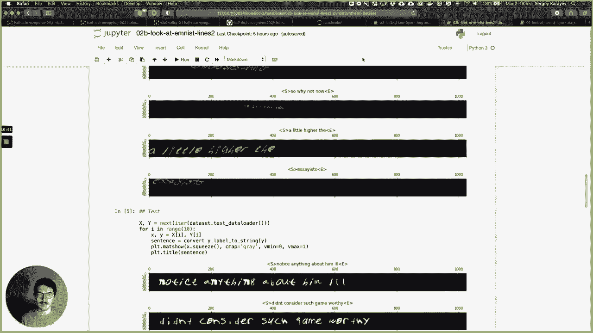

i want to show really briefly code that，can make that。

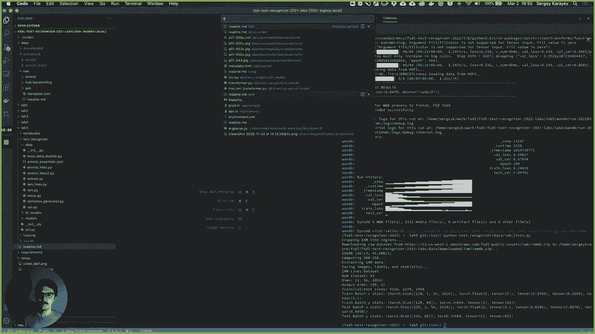

possible so if we open up em this lines，the key piece of code，is the transform that we pass。

to the data set okay so to make the，train and the validation set，we pass this transform you know the。

result of a function called get，transform，with augment which is going to be equal。

and so what are transforms so this is，known as data augmentation and we have。

been using a transform that just，changed you know anything numpy array or。

or a pil image to a torch tensor，so we use this transforms to tensor，transform function。

but now we're also going to if augment，is true，we're going to jitter the color so we're，image。

between making it half as bright to，remaining as is，we're going to add a random affine，transform。

now what is this so we can always search。

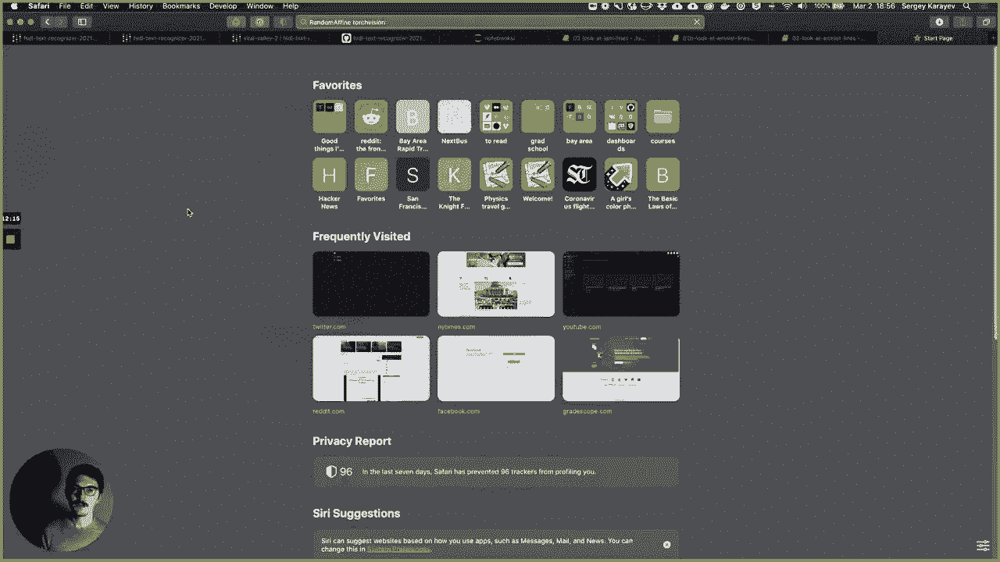

for torch vision random affine，[Music]，image，translate it vertically and horizontally，scale it。

around the center point shear it which，refers to，and，also well i guess yeah。

those four transformations is what we're，actually doing，so we do a little bit of each one of。

each one of them，and the beauty of it is that it's random，so each time a batch is loaded。

a different random transform is applied，to the images，so that's really going to be key to。

preventing overfitting as as josh，so this is what our data looks like，and we don't apply that data。

augmentation to test which is why。

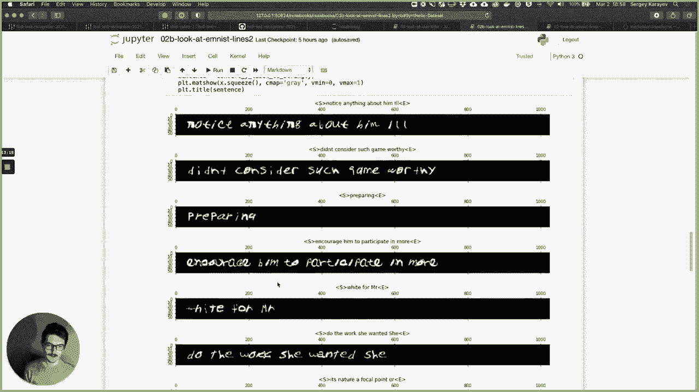

test still looks like this and you know，we could apply the data augmentation to，test in this case。

but it's usually good practice to leave，the test set，kind of untouched by data augmentation。

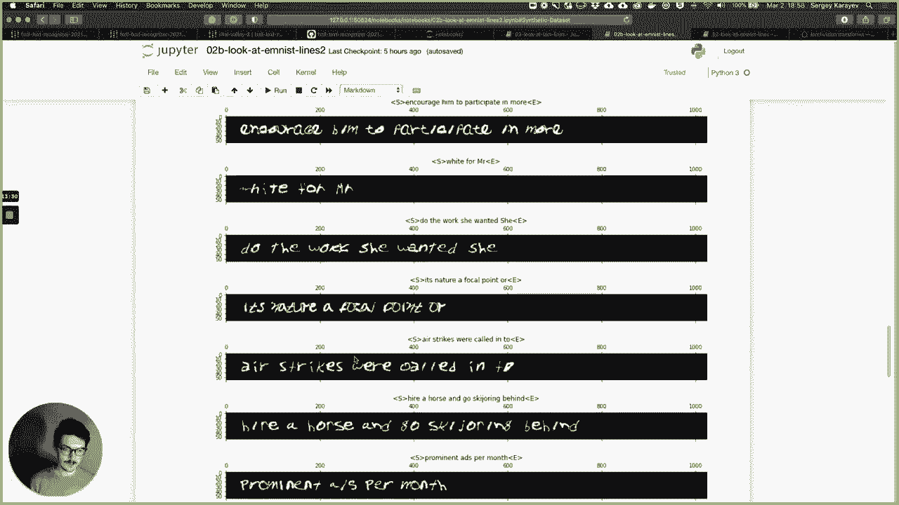

so that it's always the exact same，performance number every time you run on。

the test set it doesn't actually depend。

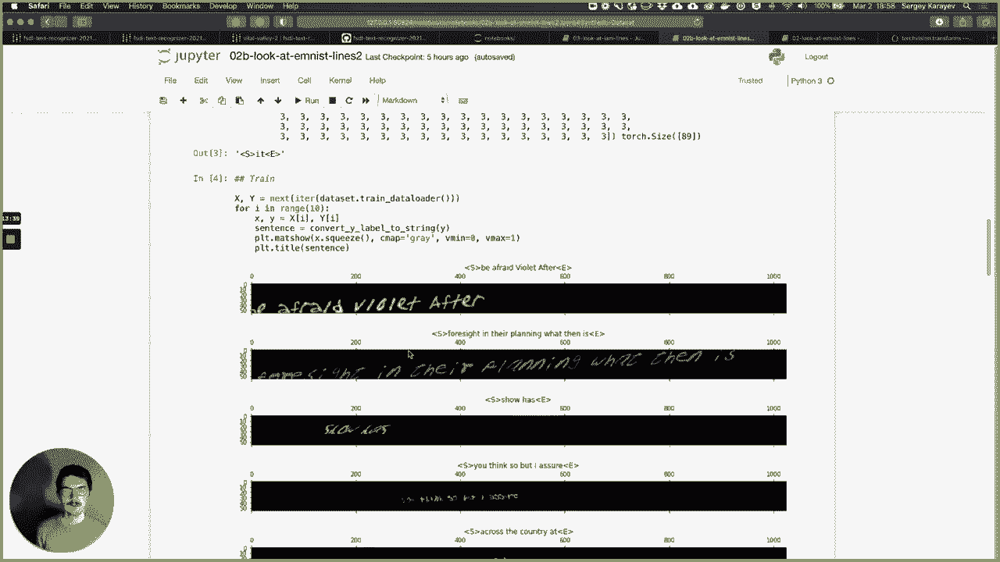

on anything random so that is，emness lines so now we're ready to to，run some experiments。

and this time we're going to be keeping，track of them using weights and biases。

if you don't remember it's one of the，experiment management tools that we。

covered in the infrastructure lecture，alongside comet ml for example。

or ml flow or determine that ai you know，there's a bunch of examples of this，basic idea。

i like weights and biases it it's fast，it kind of has all the features。

and it has some more advanced features，such as hyper parameter sweeps which，we'll use in this。

in this lab also so i think it's worth，getting to know weights and biases。

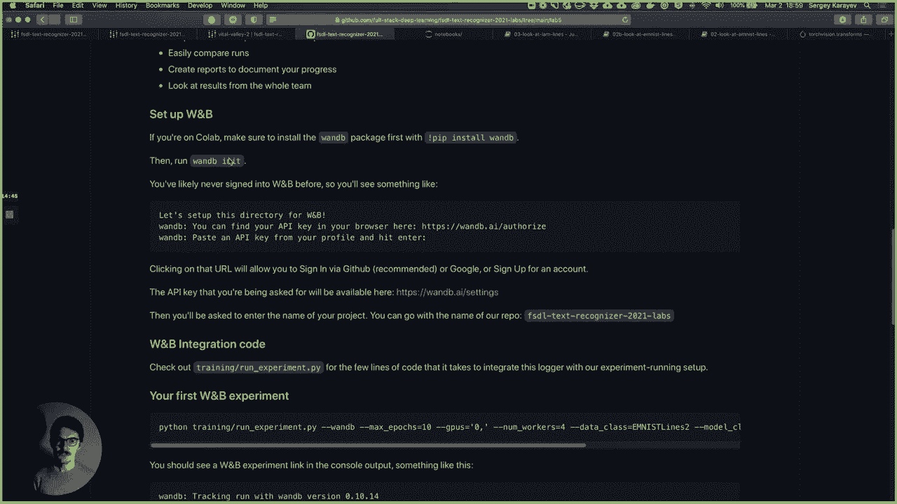

to set it up okay let's say you're，so the first thing you'll do is you'll。

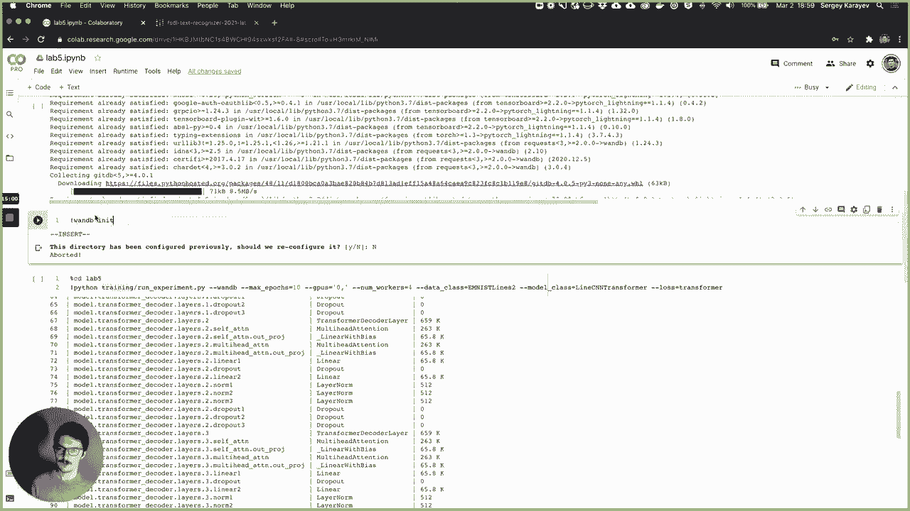

run wnb，init and that'll pop up，and a message that says okay let's set。

up this directory please paste your api，key。

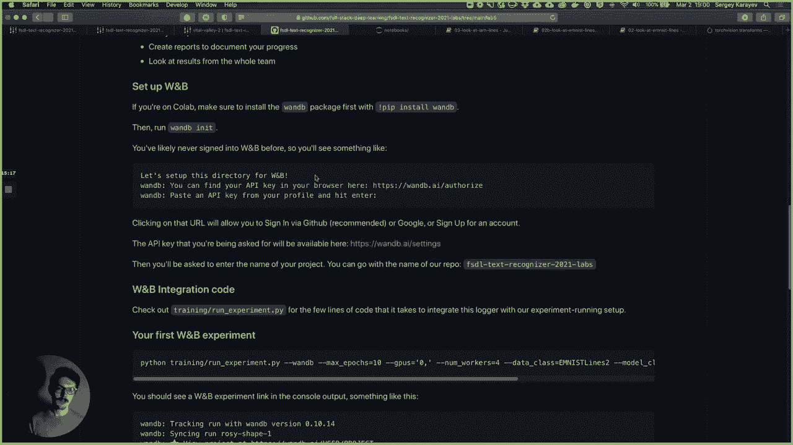

and then it will send you to wmb。ai，authorize，and when you get there of course you're。

not signed up for it so you'll have to，either log in via github which i think，is easiest to do。

or google or sign up for an account，uh the account's free this functionality，is is all free。

so feel free to just sign up for it or，just log in with github，and then go to settings。

an api key down here which you'll be。

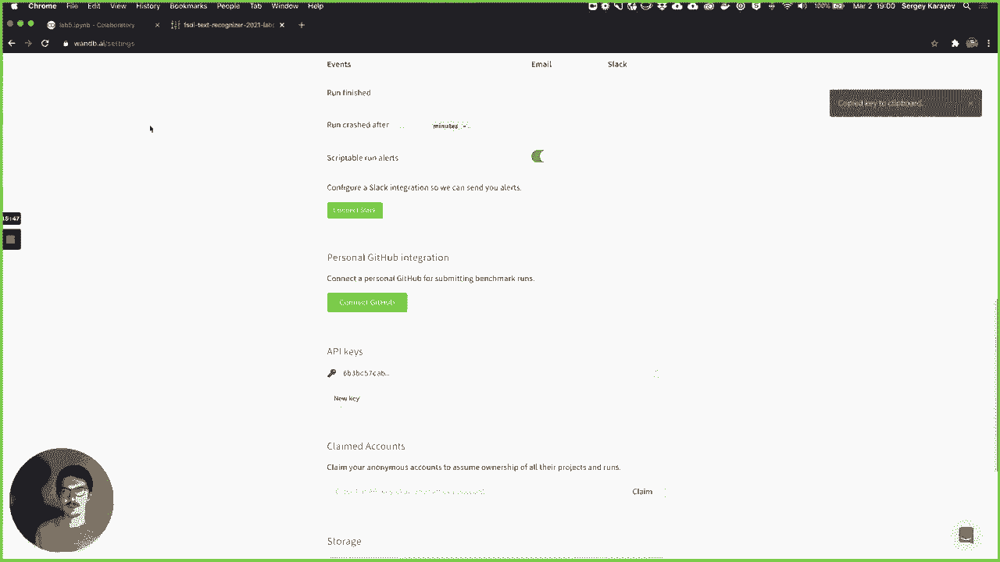

able to copy，and then paste into your colab，and that will set up your repository。

that that directory with wmb，and the next thing it'll ask you to do，is enter the name of the project。

and you can type really anything but you，might as well type the name of this repo。

which is fstltx recognizing 2021 labs，okay so now we're logged into wnb。

and we set up our directory with it，so what is the actual code that we。

should add or has been added for us，that's going to use wnb for logging。

so that new code is in run experiment。pi，so remember run experiment that pi is，our framework it。

reads you know stuff from the command，line it loads our datum。

and now we can pass a command line flag，dash dash wnb and if we do that it will。

replace the default tensorboard logger，with the w and b logger，and this is literally the only change。

that happens in order to use wnb，so that's quite nice we simply replace。

the logger and then we additionally and，this is actually optional。

but we have the logger watch the model，which will actually，keep track of all the gradients and be。

able to plot all the gradients，the magnitudes of all the gradients in，our model on w and b。

and we're also going to log all the，hyper parameters and for us。

all the hyper parameters are everything，that's on the command line。

right so that's in order to change some，kind of，thing in our code if we want to be able。

to search over different values of it，we make it a command line argument and。

then we call all of our command line，arguments hyper parameters。

so this is the extent of the integration，it's quite nice the next thing we。

want to do is just to be able to run an，experiment，so let's take this command which is。

python run experiment，with this new wnb flag we can just run，for a few epochs at first。

on this new data class that we have em，this lines two，with our old friend line cnn transformer。

and the transformer loss。

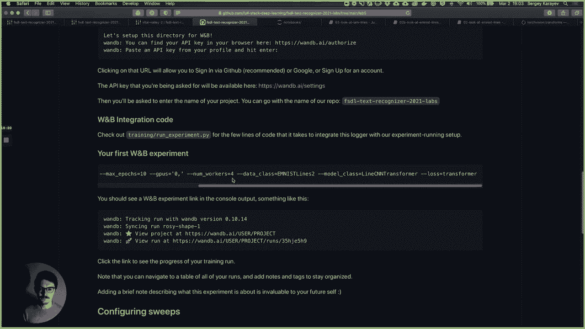

which will use the transformer lib model，our terminal or。

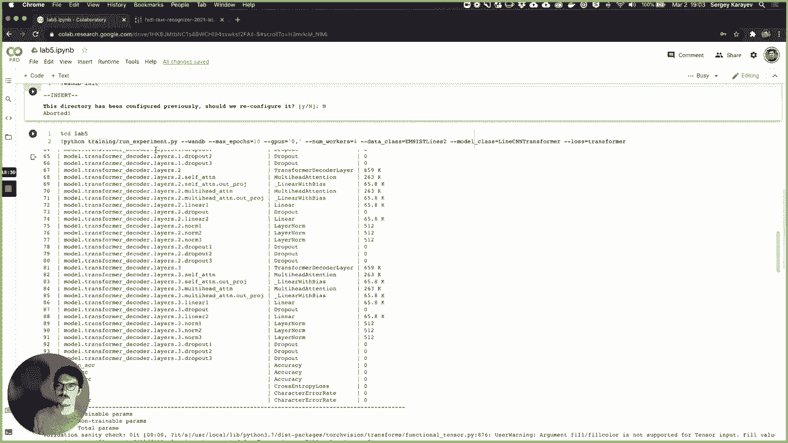

into our co-op remember to precede it，with an exclamation mark。

is just the standard the standard kind，of beginning of training，view we'll print the model and so on。

except now at first it'll say wnb you，know we're currently logged in。

and it'll link us to this project and，this specific run，and be able to see the configs。

all the hyper parameters like for，example comp dimension，over。

overwrote something on the command line，it would show up in this config。

the charts which will show up pretty，soon as we，get through our first epoch and then。

lastly this media which i'll talk about，in a second，so okay so the first epoch is now。

completed so we have one data point for，the training loss，the validation loss the validation。

character error rate and the epoch。

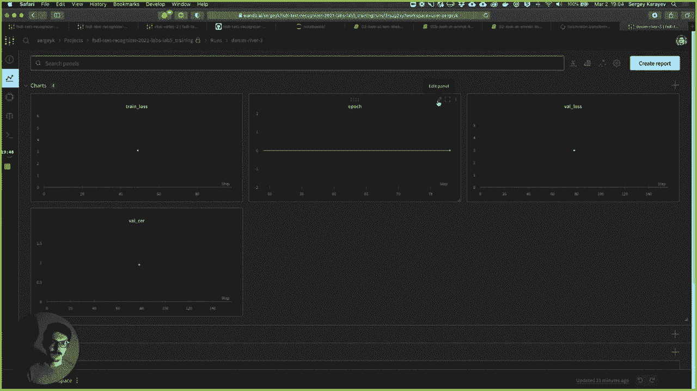

one thing i like to do is change this，epoch chart。

to be based on relative wall time，so that's nice for comparing multiple。

runs is like how long is each run，actually taking。

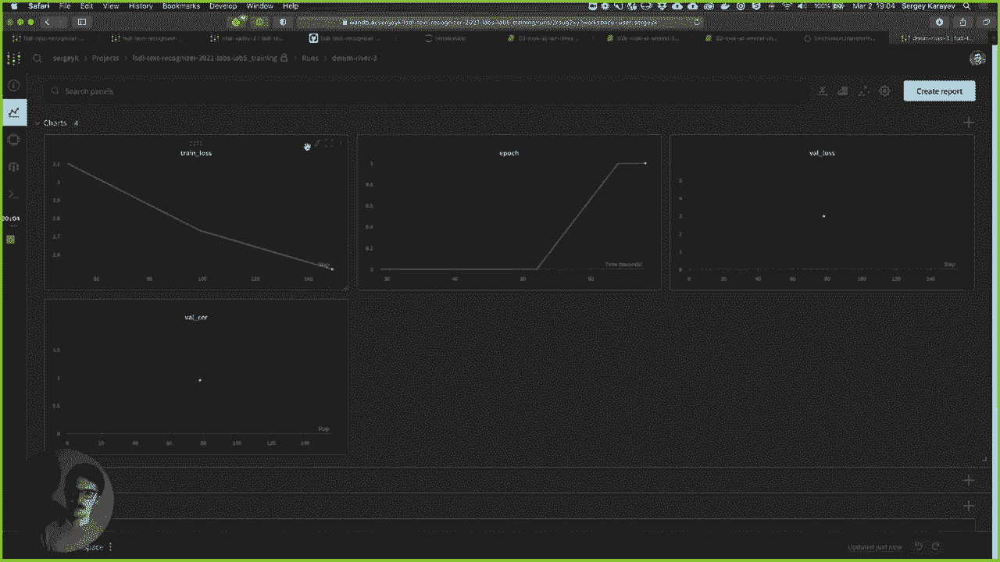

and then the training loss instead of，in terms of number of steps which is。

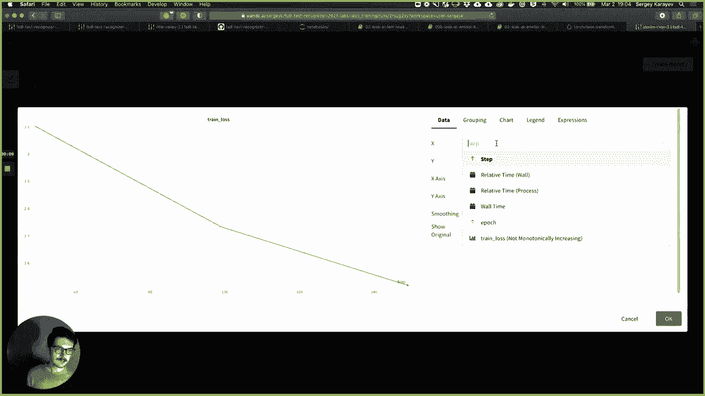

another word for batches i think it's，a little nicer to see it in terms of，number of epochs。

and then maybe i just want to arrange，them a tiny bit differently。

so i want to see training loss next to，validation loss，so i said we're logging the gradient。

magnitudes，for all of the layers in our model and，that's，kind of cool so we can see the brief。

distribution of，of of gradient magnitudes and what this，can let you see。

is gradient explosion and so there you，would see instead of like a blue you，know thin line。

you know everything would be kind of，uniformly colored，or gradient vanishing in which case you。

know everything would be set to，basically straight zero and there would。

be no distribution of magnitudes around，okay so now we're training i'm going to，switch to something。

that is already you know，i guess i think it's finished it's been。

running for a while and so this is kind，of what it can look like。

and we can see if there's multiple runs，yeah so in this，in this particular project i had three。

runs and one of them i just launched，it's running right now，that's why it has this green dot next to。

it，this one ran and finished and then this，one ran and finished，and we can compare them which is。

really helpful we can see the final test，character error rate and this is kind of，cool。

i want to talk about this media so if we，this run this experiment's running right，now。

you see something that's called，validation threat example，okay and then the image is still so that。

by and the prediction，is the stare and the the at，so that's not quite that nice but where。

is this coming from，so this is coming from，[Music]，in lab5，has in the validation step in the test。

step，now has this little bit of code，which is you know we we make the，prediction on。

our on on our batch here and then for，the first element of that batch。

we're going to actually turn that，prediction，into a string that we can read and then，log it。

using the wnblogger as a valprad example，helpful，because that's what is able to log that，ridge media。

and there's support on wnb for audio，also and for，different other types of just different。

formats of data，so as you can see this is really not you，know this says something truly amazing。

and the prediction is，still the sum the soul the sultan so，it's truly just garbage but，interestingly。

it's english language garbage right so，what what that's telling us，is that in this short time。

we've actually you know the transformer，part of our model，has actually learned how to produce text。

but it hasn't yet learned to actually，understand，the image just yet it's pretty remark。

remarkable that it's able to produce any，kind of text then if we look at，something that's。

been trained already let's look at the，other runs here，so this this orange one vital valley two。

this one gets，four percent test character air rate so，let's click into that。

yeah really nice you know training loss，going down pretty low，same with validation loss so let's see。

what it actually produces，as a as a validation prediction example。

so the image is something truly amazing，and the prediction is something truly，amazing。

which is pretty cool and we can step，through，so this is a mistake here i read for a，few moments and。

but the model read for afu，menendez and so but it's pretty cool。

because you can actually go back in time，and see how the model is getting better，as it trains。

and then of course after the testing set，the the test evaluation run completes we。

get the test crowd examples as well，so last thing i want to talk about in，weights and biases。

experiment management this is a cool，view right because you can compare，curves。

but this table view is also quite cool，because you can add notes and so in this。

table view the first thing to do is，click，this automatically show the most useful，columns button。

which will most the time show like all，the things that are different between。

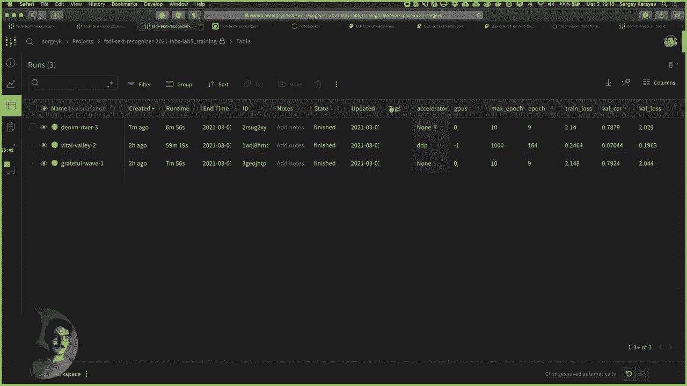

the runs and in this case actually，none of the hyper parameters are。

different but we can introduce them。

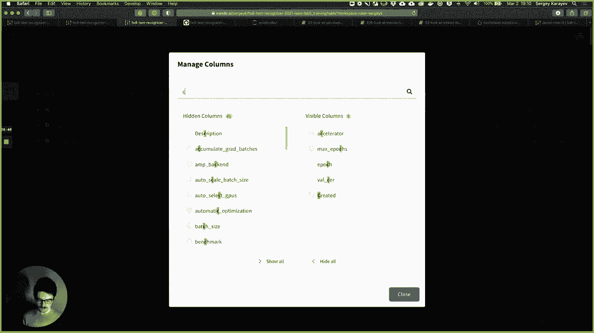

manually by just dragging from hidden to，visible columns，and then we can see what the what the。

hyper parameters are，and this this notes thing is really，is really helpful because as you do your。

experiments，right let's say first you you know you，sort by the creation date so this is the。

latest one，and so maybe something's different about，this run that you're trying to。

that you're trying to understand so you，can add a note and say，you know trying precision equals 16。

right and that'll be a note for yourself，that lets you see what you're actually，doing and that's。

quite helpful if you actually have a，real project going，because oftentimes you're changing the。

hyper parameters on the command line，but you're also changing the code and，it's those code changes。

that are really hard to track down later，so adding a little note。

and maybe even doing a git commit that's，going to be really key。

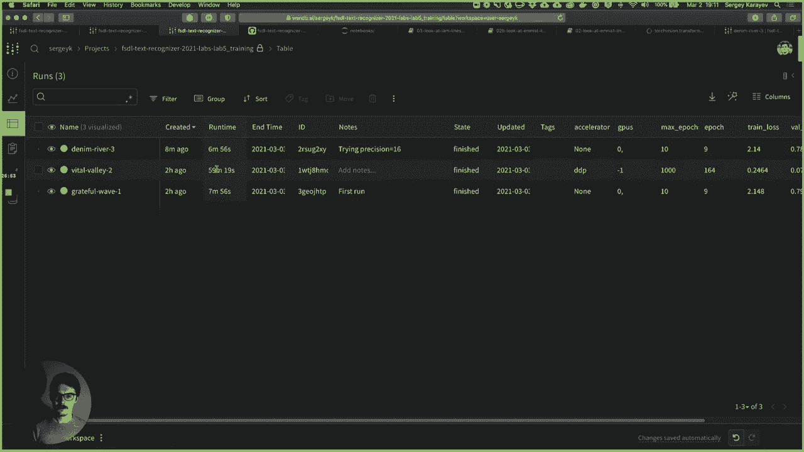

for knowing what the heck you did you，know tomorrow you know trying position，16。

that is one thing we can do now and，while，but on the command line if you just type。

precision equal 16，it'll run you know the same experiment，in mixed precision mode。

using native pi torch 16-bit support so，this can really speed up。

your experiments by lowering your memory，footprint so if you do precision 16。

you can now increase your batch size our，default is 128，but you know we can try increasing it，256。

so this is basically always worth，leaving on as a default，flat precision equal 16。 so the last。

thing i want to talk about，so we ran our first wnb experiment so，now let's say。

we got to a point where we're pretty，happy with like，our experiment like maybe we got。

something to uh converge but maybe it，took a long time，right or maybe it's not quite converged。

but it feels like，we're pretty close like if we just，changed maybe the learning rate or like。

the number of，layers it could actually converge and so，that's a good time for a hyperparameter。

search，now we've set you up with with，one sweep which is the word that weights，and biases uses。

for these hyperparameter optimization。

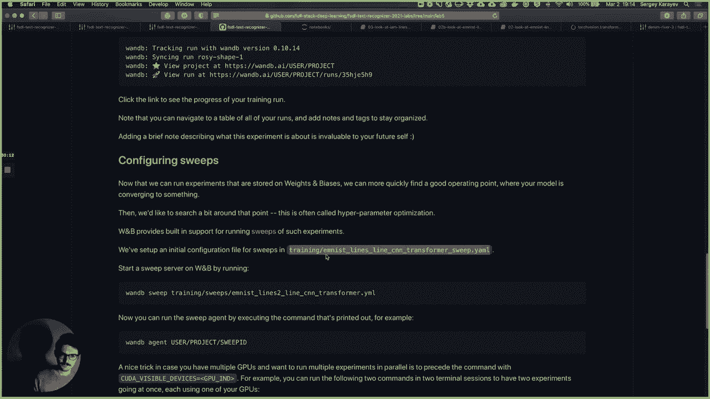

experiments so let's go ahead and take a，training suite okay，so it's em this lines two line cnn。

transformer。yml，so the important thing is we specify the，program that we want to run。

training run experiment the hyper，parameter optimization method。

which is can be one of three things it，could be grid，it could be random it could be bays so。

josh talked about all of those，let's go with random for now the metric。

that we want to optimize so in this case，we want to minimize the validation loss。

this is a really cool feature called um，early termination，using the hyperband algorithm so what。

it will do is if within the first，in this case 20 epochs an experiment。

is not better than an experiment that，already exists，then we can actually just terminate that。

experiment，so this is you know something you should，watch out for because let's say if you，use the。

a lower learning rate，you know you might have got to a point，in 20 epochs with a higher。

learning rate than in 60 epochs，with a slower learning rate so it's good，to be conservative here。

so maybe go with like 60 epochs for this，early termination，and then the list of parameters that we。

want to pass to the model，and if you don't want to change the，parameter you can just exclude it。

or just if you want to remember what it，is you can just give it a singular value。

like windows stride 8 but if you want to，range，a list，or you can if it's a float parameter for。

example，like a learning rate we could do you，know min，point zero zero zero one max point one。

and then it would randomly sample，but of course we want to include that，you know three，we'll。

we'll give it manually and in general i，think it's，i don't know for the stuff we're doing。

it's worth just typing that out just so，that you can kind of see。

everything that's going to be tried okay，so we're going to do 16-bit precision，training。

line scene on transformer in this lines，2 data set，and then we're going to randomly sample。

a setting of all of these parameters，right，to launch this sweep，wnb sweep，[Music]。

and then a path to the sweep which is，ms lines so if i just run that。

it will contact the wnb server and set，the server up with a sweep basically。

points that our agents can now call into，and ask for a set of parameters so the，next step is we。

have to launch an agent i have two gpus，on this machine，and there's a thing i like to do which。

using this cuda visible devices flag or，environmental variable。

i can only expose one gpu to the process，i'm about to run，so i'll run one agent。

and then get another terminal going，expose the second gpu and launch another，agent。

so now i have two w and b agents，and each one is calling in to wnb to get，a set of parameters。

and then starting its run and all of，these runs，are going to show up。

at that url that i was shown when i，started the sweep，can't seem to click on it so let's just。

go down here to sweeps so here's the，i have two runs well i have four runs。

going i don't know what's going on there，i should have two runs going maybe i。

accidentally launched them twice or，something，but in any case we have multiple agents。

running sweeps now，and they will all show up in，this place and a cool thing is。

this kind of view where as your runs，complete，they will terminate onto you know the。

metric you care about which maybe is，validation loss or maybe validation，character error rate。

and we want it to be low of course so we，can see like what is the setting of all。

these parameters that we care about，that's leading to the lowest uh。

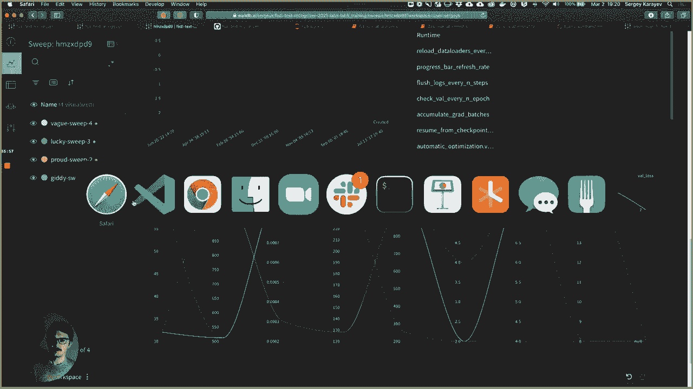

let me think if i'm missing anything you，can do this in collab too which is。

actually pretty cool so i created the，sweep and collab，and i ran the agent in co lab。

and it's happily running yeah and this。

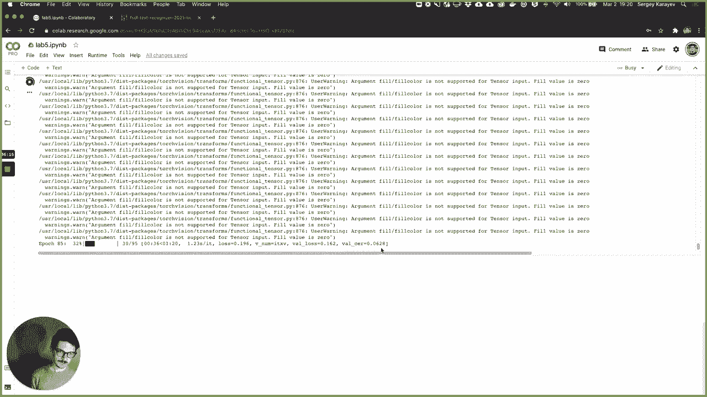

one's down to six percent，validation error i think that's pretty。

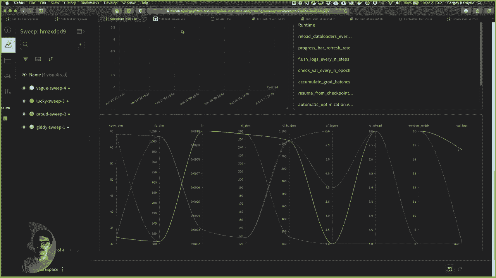

much it，the thing to try in in your，you know in the next week definitely try。

to run at least one experiment，logging to double to weights and biases，and the homework。

is to actually just upload a screenshot，of your weights and biases。

kind of table of runs you can try to，find a setting of hyper parameters。

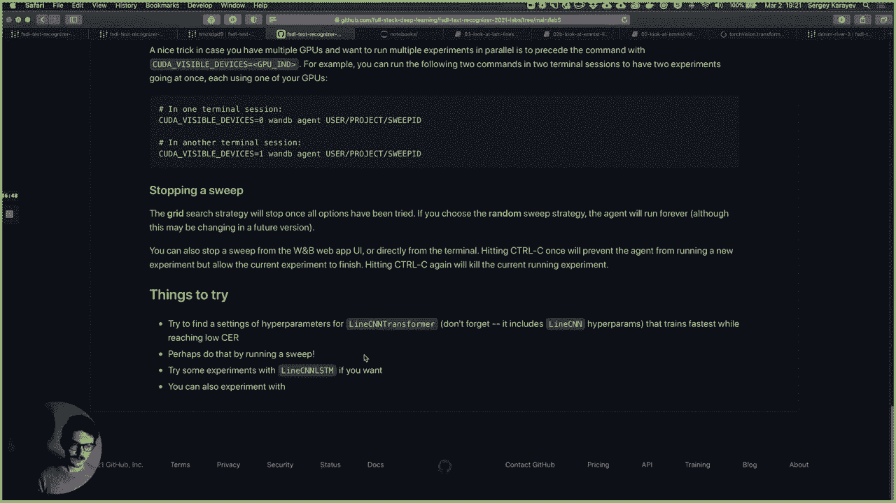

for the experiment we're running that，maybe trains fastest，ones。

are i want to get out of the sweep view，so these runs that we that we ran they，get to a low。

character air rate but it takes a while，right so if we flip to，time here it maybe takes。

you know something like 30 minutes to，crack 10 or so，i think you can actually do that in like。

10 minutes we just have to find the，right，settings and in this case it'll be。

something it'll be reducing the number，of parameters here so maybe。

fewer transformer layers or a smaller。

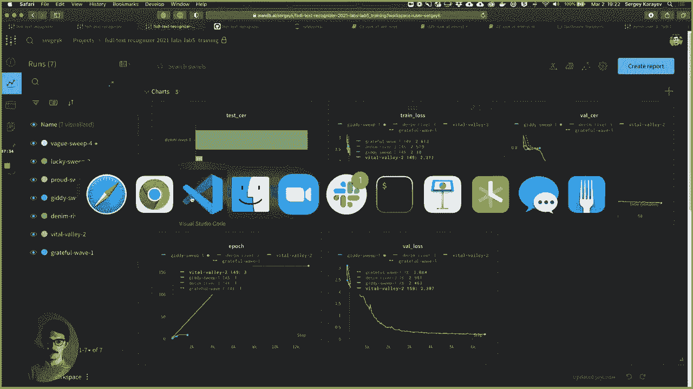

comp dimension，and you can try experimenting with vine，cnn lstm。

instead of line cn transformer if you，want you can try to run on iron lines。

you can try running a sweep and pretty，much you know anything you want to do。

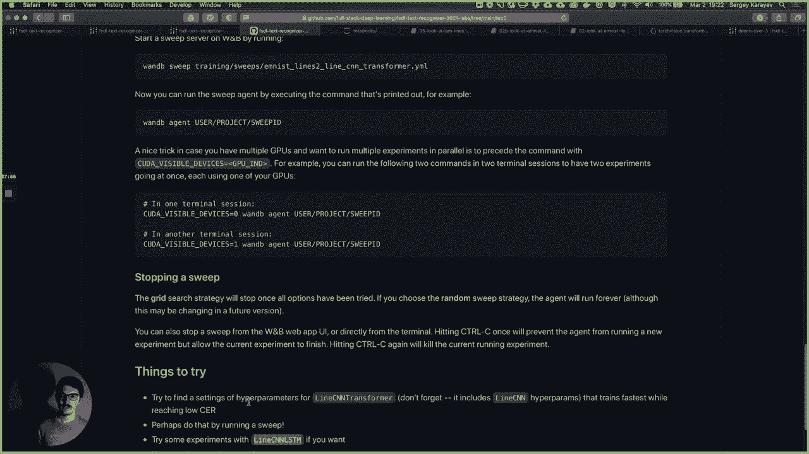