# 【双语字幕+资料下载】伯克利FSDL ｜ 全栈深度学习训练营(2021最新·完整版) - P14：L7- 深度神经网络调试与故障处理 - ShowMeAI - BV1iL411t7jE

okay welcome back so this week we're，going to talk about troubleshooting。

deep neural networks and just to place，you for a second，in where we are in kind of the life。

cycle of a machine learning project so，where we are，in the course so we talked a couple，setup。

we we also talked about infrastructure，and tooling，last week we haven't talked about data。

collection and labeling yet，but we will talk about that soon but you，know this this part of the。

course becomes relevant like once you've，collected your initial data set you've，labeled it。

and now you're moving on to you know，models，as you go and so you know why。

this is this is a class on like applied，machine learning in some sense right。

like putting deep learning models into，production so，why have a whole lecture on training and，this。

this xkcd comic kind of captures what it，feels like a lot of times to。

to actually build a machine learning，system right so you know。

you're you're pouring a big pile of data，around，and some ants just come out the other。

side and you know if the answers are，wrong then，you know just keep stirring and maybe。

the answers will will turn out better，and i think this kind of captures what。

it feels like a lot of times，to iterate on machine learning systems i，also like this tweet from。

andre which you know first it doesn't，even compile and then it doesn't link，then it says。

the seg faults and it gives the wrong，answer and then only after all that then。

maybe maybe it actually works and so the，the this i think captures。

a common sentiment that i that i hear，among practitioners even，really really top tier practitioners。

which is that you know it's it's，when i first started in the field i felt。

like i was doing something wrong because，i was spending eighty percent of my time。

or ninety percent of my time you know，debugging things and，tuning models and stuff like that but it。

turns out that that's you know even some，of the top，people in the field this is kind of how。

they spend their time as well and，the goal of this lecture is not to try，to eliminate。

the time that you're going to inevitably，but，hopefully to give you some strategies so。

it feels a little bit less like you're，you know like just spinning this this。

random pile of linear algebra and，waiting for better answers to come out。

okay so the the first thing i want to，talk about is i want to just give you，some intuition about why。

this is such a hard problem right why，are top practitioners spending so much，of their time，example。

this is a chart from the original resnet，paper，and you know suppose that you're trying。

to reproduce this，chart right this this this learning，curve，actually looks like this right so。

you know you're doing significantly，worse than，the model the paper is doing and you。

know and so the question is like，what do you do after that right so。

you've implemented the model it's not，doing as well as it does in the paper。

what's going on why is it not doing as，well and so the insight here about why。

troubleshooting is so hard is that，there's a bunch of different things。

actually that could be causing the same，different performance。

so you could have an implementation bug，and to make matters worse most。

deep learning bugs are actually，completely invisible，right so i once had a bug that looks。

something like this，right so you know my model just wasn't，training at all this is this is uh。

one of the snippets of code or a，caricature of one of the snippets of。

code that i was using to train the model，and there's a bug here。

okay so no no one else no no else knows，this bug either yeah so。

okay so so nathan got it the order is，random so it turns out that when you，call glob in python it。

the the ordering that it returns files，in is not deterministic，and so i i didn't realize this i had。

this bug my model wasn't learning，anything at all，and it took me like half a day or a day。

or something just to even find，that this is the place that i had but。

implementation bugs are not the only，possible source of the same error so it，choices。

and you know it it turns out in deep，learning oftentimes our models are，pretty sensitive to。

small differences and choices and hyper，parameters so this is kind of。

a cartoon chart about what can happen to，your model's performance if you choose。

different learning rates right so，you know the difference between a a good。

learning rate and a low learning rate，might not be that big but。

if you have a high learning rate or a，very high learning rate your model。

might learn like might not get to as，good an answer at all or，might actually just not learn anything。

like it might actually the signal might，go in the wrong direction and this is a，chart from。

another i think this is a follow-on to，the resnet paper talking about。

where they actually what like one of the，tricks that，made this paper work at all was the。

weight initialization and so the，the the difference between what was the。

standard weight initialization at the，time，and the weight initialization that they。

used in this paper was the difference，between，you know the model not learning anything，art。

on the tasks that they were working on，so models can be extremely sensitive to。

the small differences and choices of，hyper parameters that you might make。

another cause of possible performance is。

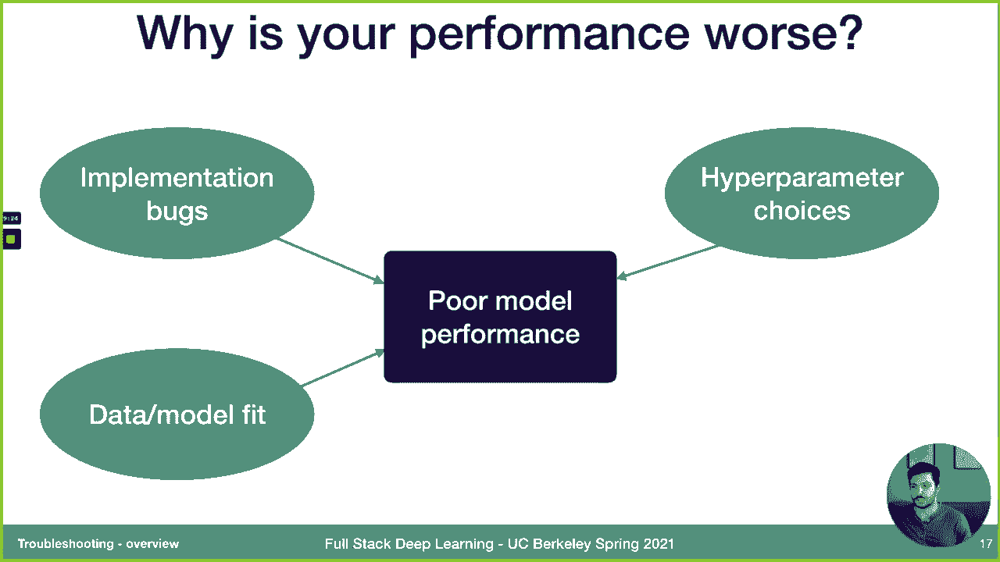

what i would call like data model fit so，maybe the data in the paper that you're。

trying to reproduce is imagenet。

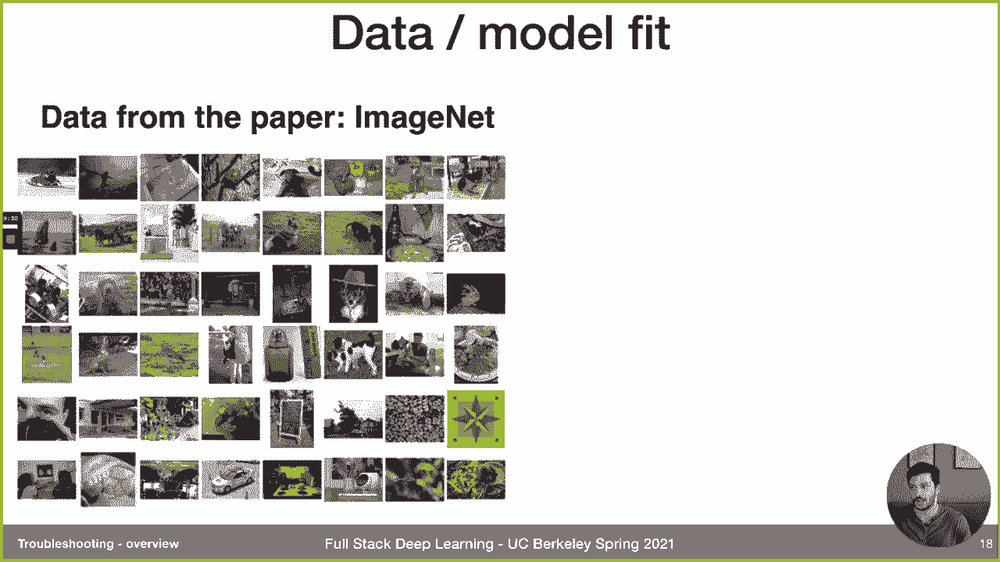

let's say and yours could be something，else like let's say it's self-driving，car images。

and if you're if you're re-implementing，the same model using a different data。

set than was used in the paper，then you know you it's reasonable to。

believe that your model should be，performed you know also perform well on，your data set but。

there's no guarantees of that and so，using data that's really different from，the data in the paper。

could be the cause of degradation and，performance。

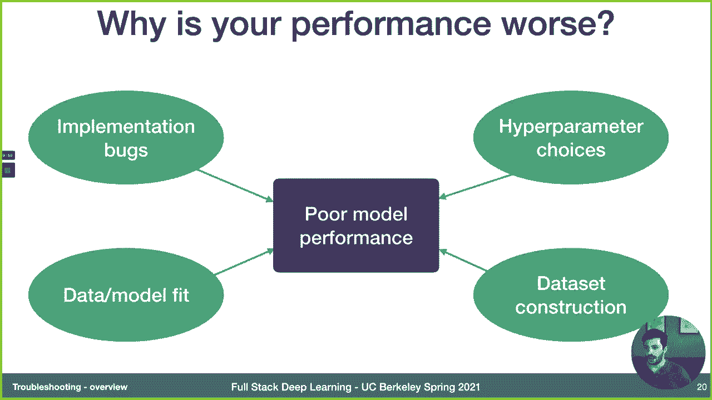

and then lastly the the way the data set，itself is constructed，can also cause degradations and。

performance and so this is，i think a pretty commonly shown chart at，this point but this is。

from from a talk that andre carpathi，gave not too long after he had。

taken over the reigns at a tesla and，after he had left，open ai and you know the the the insight。

here is that i guess the chart is a，little a little fuzzy in，in this picture but the inside is that。

you know when you're working on your phd，when you're working on research。

then you know the vast majority of your，time is spent thinking about，in。

industry in the real world it's actually，flipped like most of，your time is spent thinking about data。

sets and models and algorithms are，actually a small，portion of that i think actually even。

even this characterization that 25，of your time may be spent on models and。

algorithms is probably much lower in，places other than，different。

things that could cause you know data，set construction issues that affect，model performance so。

maybe you don't have enough data maybe，you have enough data but the classes are，that are。

dramatically underrepresented maybe your，labeling process itself could be noisy。

so you know your your labels could be，giving you incorrect labels。

your train and test set could be from，other，different data set construction errors，so to summarize。

why is it hard to troubleshoot the，well，it's hard to tell that you actually have，a bug to begin with。

and even if you have a bug even if you，know that you have a bug so you're lucky。

enough to know that you have a bug，there's a lot of different possible，sources of。

the same degradation and performance and，so it can be hard to to disambiguate。

which which cause is actually causing，that degradation and performance。

and then lastly models can be very，sensitive to small changes，in your hyper parameters and how your。

data sets are constructed and so，those those are sort of some of the main。

reasons why it's it's hard to，troubleshoot models once you're building，them。

and so the the bulk of what we're going，to talk about today is a strategy that。

you can use to overcome this，so strategy for for troubleshooting，neural networks。

and yeah i think that like maybe if，there's one takeaway，that you have from this is that i think。

there's like one key mindset that you，need to keep in mind，as you're as you're building your models。

that is going to be one of the biggest，sort of differences between being able。

to build models successfully or，or you know kind of getting stuck in the。

endless cycle of lots of bugs and，that's the mindset is pessimism okay。

so you know the key idea that i that i，that i advocate for in troubleshooting，models is you know。

since it can be really really hard to，disambiguate，what is the cause of this degradation。

and performance what is the cause of，to take，is we're going to start with something。

that's as simple as possible，and then we're gradually going to ramp。

up the complexity so that at each step，along the way，we're only increasing the complexity by。

a little bit and so if if performance，doesn't behave as well as we expect。

or the way that we expect then we can，isolate，that that small change that we made as，the。

degradation and performance or the the，unusual performance that we weren't，expecting。

and we can uh start our debugging there，okay so in a little bit more detail the。

strategy that we're going to talk，through is，you know starting starting very simple。

so choosing a simple model，simple data set and really paring down。

your problem to these to the essential，components of it，then you're going to implement that。

model that you chose and you're going to，debug your implementation once you've。

have an implementation that you're you，know reasonably certain is bug-free。

then you're going to evaluate your model，and you'll use the results of that。

evaluation to make a decision about what，to do next，so it could be you know improving the。

model or improving the data，or it could be tuning your hyper，parameters and and we'll talk about how。

to make that decision and what the，different ways that you can。

improve your models and tune your hyper，parameters are and then you're going to。

iterate on this process kind of looping，back to the implementation phase。

or the evaluation phase until you have a，model that meets，the requirements that you set out at the。

beginning of this exercise，so really just quickly just to summarize。

all the stuff that we're going to cover，starting simple you're going to choose，possible。

then when you're implementing and，debugging you're going to first get your，model to run。

then you're going to overfit a single，batch of data so just one batch a few，data points。

and then you're going to try to，reproduce the known results in。

evaluation we're going to the strategy，that we're going to take here is we're。

going to apply the bias variance，decomposition，and we're going to use the results of。

that to decide what to do next for hyper，parameter tuning the strategy that we'll。

recommend here is doing course defined，random searches，we'll talk about a couple of other。

strategies you can consider and then，finally if you're，improving your model and data the the。

recommend，are to simply make your model bigger if，you're under fitting。

and add data or add regularization if，you're，overfitting but we'll talk about other。

possible strategies as well，okay a few things that we are going to。

assume that you already have in place，before you start，going about this process the first is。

you need to have an initial test set so，use to，perform your model evaluation we'll also。

assume that you have a single metric to，improve on，so we talked a couple weeks ago about。

you're going to，you are going to work on improving at，any given time and then we're also going。

to assume that you have a baseline，right so some target performance that's。

based on you know maybe human level，performance or，some paper that you're trying to。

reproduce or a previous baseline or，maybe some requirements，and again we talked a couple weeks ago。

and so for for the the sake of example，today we're going to use。

this running example so we we're going，to use a running example of。

pedestrian classification so we're like，suppose that we're working on building a，self-driving car。

and as one component of that we're，training a model that takes。

as input an image a scene and and tries，to classify whether or not there's a，pedestrian。

in that image and let's say for the sake，of example that our goal。

here is going to be 99 classification，accuracy，okay so some of you are going to go work，and i。

i hope that you're aiming for higher。

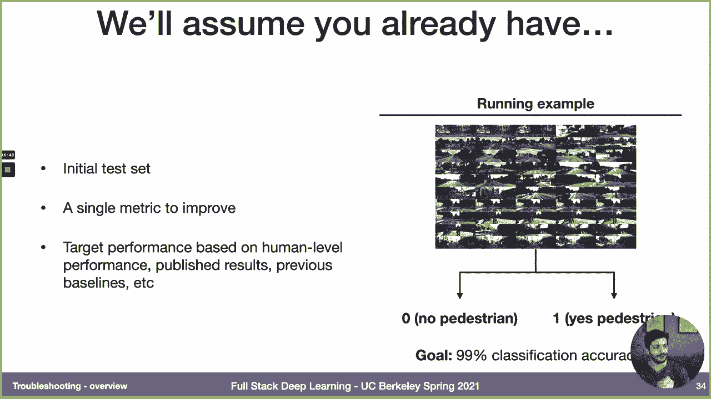

accuracy than this，but for the sake of our example let's，say that we're targeting 99。

so basically the rest of this lecture is，we're going to walk through this。

strategy and we're going to talk through。

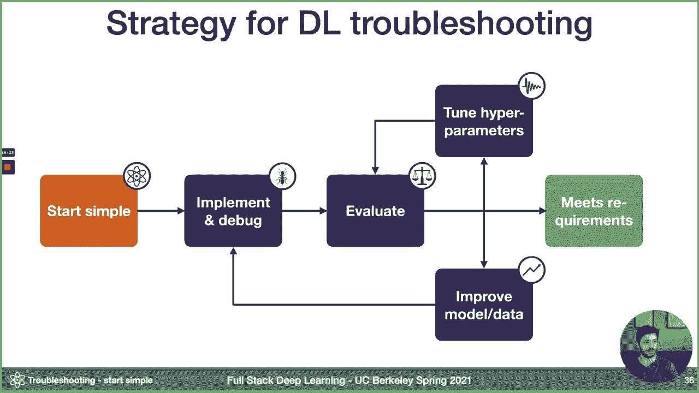

some some more details about how to，implement each of these steps。

all right so the steps that we're going，to talk about here are first we're going，to choose。

a simple model architecture and then，we're going to pick some sensible，defaults。

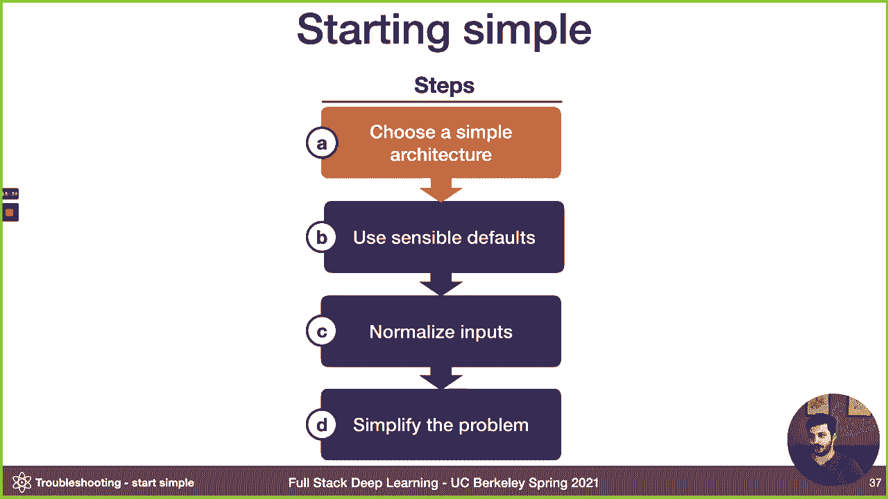

for that mall architecture then we'll，talk about normalizing inputs。

and then finally simplifying the problem，itself so i think like。

architecture selection is something that，causes people a lot of stress and worry。

when they especially when they start out，in deep learning and i think there's。

good reason for that there's，you know there's millions of papers out。

there and there's a lot of different，choices of architectures for different。

problems and sub-problems and there's，many trade-offs between them but the，out。

on a new machine learning project i，think，you know if if you're if you're working，there's。

some relatively like simple pragmatic，choices you can make for version zero。

you know your first attempt at solving，the problem，and so you know the way i'll break it。

down is based on the type of data that，you're working with，so if you're working with images then i。

the first，implementation that you do with a，lynette like architecture and then。

over time as you you know as you start，to improve，uh model performance and rule out bugs。

in different parts of your code base，then you can consider moving on to。

if you're if you're working on sequences，then i think like kind of the the，recommendation that。

that i typically make like at least as，of a couple years ago was to start with。

the lscm with a single hidden layer i，think maybe starting with the，transformer now。

could be an equally valid if not more，valid recommendation，although i think maybe a transformer is。

first time，and then as your project gets more，mature you should consider moving to a，transformer。

or a wavenet like model and then if your，data is anything else。

then for version zero i would recommend，starting with just a simple fully。

connected neural net with a single，hidden layer，and then as you get more sure then。

that's kind of when you need to pick，something problem dependent depending on。

exactly what you're working on，okay so you might say well this makes。

sense if i have just a single type of，data as input。

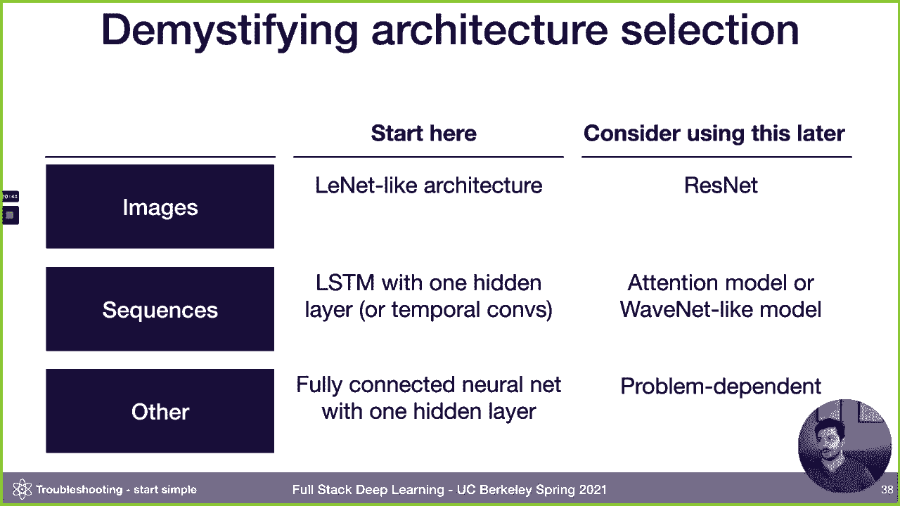

but what if you know in the real world，often times we have like。

multimodal data so how how should you，think about dealing with，multiple input modalities so say that。

you have a model that is taking，you know two like one or more images as，input as well as a sentence。

and it's trying to classify whether that，sentence accurately describes the images。

so the the model architecture that i'm，going to describe here as a baseline is。

first you map each of the individual，inputs down to a lower dimensional。

feature space using the architectures，that we described before so you might。

map each of the images through a small，comp net and you might map the sequence，through an lcm。

then you're going to take the output of，each of those models and flatten it。

concatenate each of those feature，vectors，and then pass the output of that through。

one or more fully connected layers，until you get to the output that you're。

trying to that you're trying to predict，yeah concatenate good catch and so this。

you know like very simple choice here，but can be a reasonably strong baseline，with。

multi-modal input simple to implement。

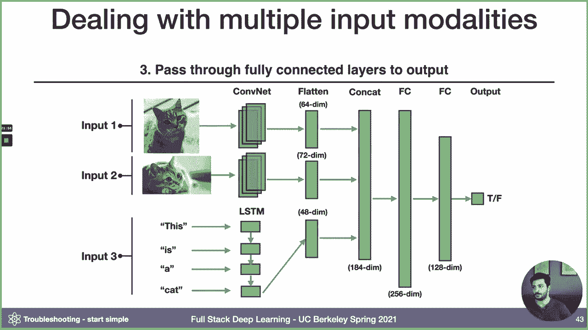

and relatively simple to debug，okay so we've chosen our simple model，architecture。

and the next thing that we're going to，do is we're going to pick some you know，sensible defaults。

for hyper parameters and things like。

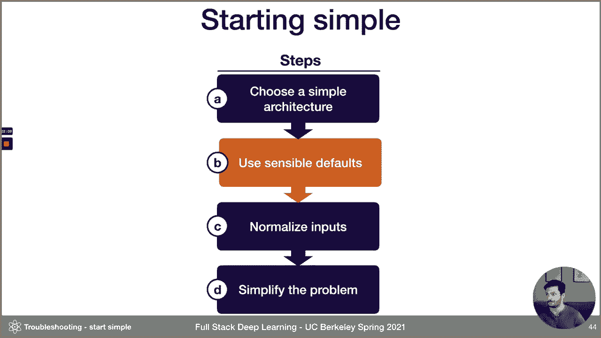

that before we start training，so here are some defaults that i，model。

i think it's best to start with adam，optimizer so some people recommend just，starting with。

like vanilla sgd i think it's i think，adam just like solves a lot of problems，with you for you so。

might as well use atom the this is the，learning rate i i like to use i think，this is。

also popularized by andre i think it's，in popular culture it's known as the。

the magic learning rate because it's，more often than not gets you pretty，close to。

the learning rate that you would have，picked if you had done some hyper。

parameter optimization for activations，i would start with value or 10h if。

you're using lcms these weight，initialization schemes，which i'll define on the next slide but。

i won't go into detail on，and then importantly i would recommend。

in the first implementation that you do，not starting with any regularization or，data normalization。

and the reason for that is that，regularization and data normalization。

things like batch norm and stuff like，that are a very very common source of，bugs。

and so i think you know until you know，that you need those things i would leave。

them out of your implementation，so you can so you can make sure that the。

rest of your implementation is bug-free，before you add something like batch。

normal this slide just has the，definitions of the，recommended initializers i won't cover。

this but you can，come back and look at it if you're，okay so we've chosen simple architecture。

sensible defaults，the next thing that is really important，to do even in the first implementation。

is to normalize your inputs，what does it mean to normalize your，inputs so for most data this is just。

subtracting the mean and dividing by the，variance you're probably doing this。

already for images it's fine to just，scale the values to something between 0，and 1 or negative 0。

5 and 0。5，one kind of gotcha here is that，you，and so i've had a lot of bugs where i。

like divide the the，values of the input image by 255 but，that was also happening somewhere else。

in my code，all of a sudden my input values are tiny，model learns really slowly so this is。

like one step that i，i think that you should like absolutely，never skip because。

it can make the difference between your，model learning normally and that like。

not learning anything at all anything at，all right so we've picked simple like。

simple defaults for our problem，but i think one other thing that's。

really worth considering when you're，starting out a new on a new problem is，actually。

trying to simplify the problem itself，and then gradually，adding back the complexity that you need。

in order to solve the problem that you，really want to solve，so a couple of examples of ways that you。

could do that you can start with a much，smaller training set for example。

so what this will allow you to do is，then，and it'll allow you to understand。

whether you know if your model's not，performing well in this data set if，that's because。

the dataset is really challenging or if，it's because there's a bug。

right so if your model if you can't get，your involved to perform well on a，smaller data set。

then you're not going to be able to get，it to perform well on the larger data。

set that you really care about，at least in terms of training error you，can also reduce the number of。

objects or classes that you're，considering you can，decrease the image size or the size of。

your inputs in some other way，or you could even consider using a，simpler data set altogether。

so you could create a synthetic training，set and we'll talk a little bit in labs，about。

okay so the way that we might approach，problem，is you know we're self-driving car。

companies so we actually have，millions and millions of training images。

but since we're just starting to work on，this pedestrian detection problem。

we'll start with a subset of 10 000 of，those images for training。

and um it's a little cut off here but a，thousand of them let's say for test。

we'll use a simple lynette architecture，since we're doing classification。

we'll use atom optima optimizer with the。

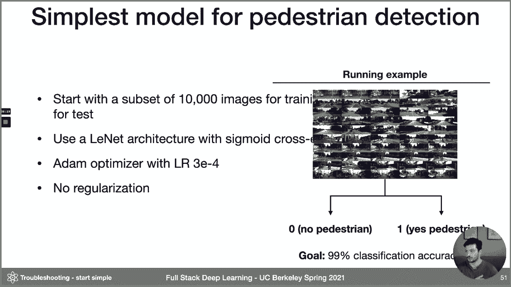

magic learning rate and we'll，leave all regularization out to start。

okay and so this is just a quick summary，of，some of the techniques that you might。

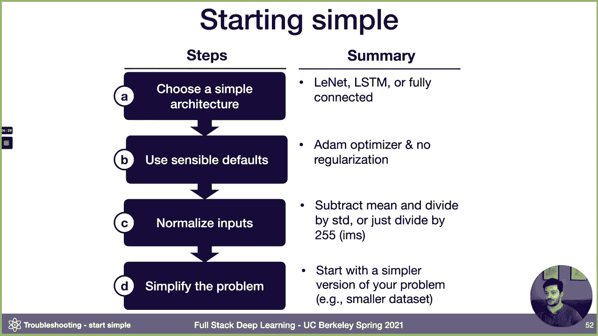

use to start with the simplest possible，version of the problem that you can，alright。

so you picked your simple architecture，and defaults，and the next thing that you're going to。

do is you're going to go and implement。

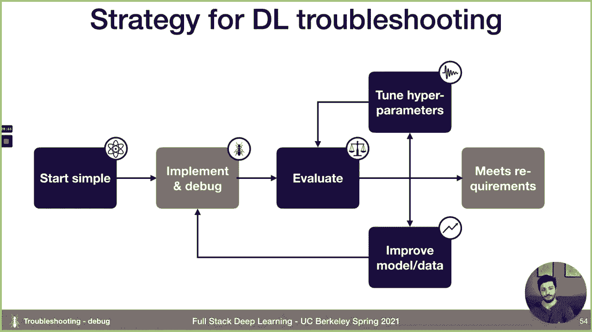

that model，all right so the steps we're going to，cover here are first you need to。

get your model to run it all which，sounds easy but it's，not always as easy as it sounds then。

you're going to over fit a single batch，of data，and once you can overfit a single batch。

of data then we're going to compare。

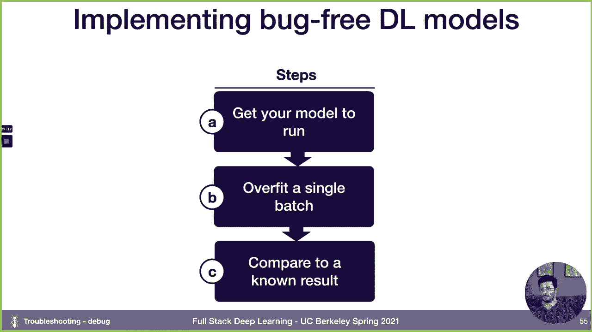

the results of your model to some known，all right so to just give you a quick。

preview of some of the stuff that we're，going to cover here i think in my，experience these are。

five of the most common bugs that tend，to come up when you're implementing a，deep learning model。

so one really common one is you have the，wrong shapes for your tensors。

so you know you you're trying to add，something that's like three by four。

together with something that's like，three by five，usually you're you're like usually this。

will fail loudly which makes it，relatively easy to debug but，it's also possible for it to fail。

silently particularly in tensorflow，where you'll have kind of accidental，broadcasting when you have。

shapes that are undefined and so this，can be a silent source of bugs it can be，very very painful to。

to find pre-processing inputs，incorrectly so forgetting to normalize，your inputs or。

over normalizing your inputs is pretty，common source of bugs，one other thing that's like really easy。

to do by accident is to have the，wrong input to your loss function so a。

lot of times the loss function will have，we'll expect，the just the raw logits of like from。

your model but you'll take the softmax，because，that's you know logically what you want。

the input to be and then you'll get bugs，because of that，forgetting to set up train mode for the。

net correctly this again often，comes up in batch norm and then various。

different sources of numerical，instability，which you know if you're implementing。

new types of models you'll，inevitably spend a lot of time debugging。

before we go into specific strategies，there's a few pieces of sort of general。

advice that i have when you're，implementing a new machine learning。

model so the first is to start with，as lightweight and implementation as you。

can so adding the minimum possible new，lines of code for for version one。

and so intuitively like the way to think，about this is that every line of code，that you write is。

like could possibly have some bugs in it，and so if you have fewer。

lines of code your debugging process is，to be，fewer places to look for the error and。

as a rule of thumb，i think trying to get your，implementation to something less than，200 lines。

for the first version is is generally a，good goal，and oftentimes like i would really try。

to get things to be less than 100 lines，and one other note here this doesn't。

count like tested infrastructure，components so if you have like，some infrastructure that you've been。

using for a lot of different models in，your code base then，those are fine like don't count those。

another piece of advice is generally try，can，so for example keras is great for，model。

same with pi torch lightning which we're，using in the labs，using the definitions of layers that are。

built into your library instead of，writing out the math yourself which you。

know can be tempting to do because，you're trying to make a，simple lightweight implementation but。

the the implementations of layers and，things like that，in these libraries have a lot of the。

kind of numerical gotchas already taken，and then lastly and this is maybe。

actually the most important thing is you，know a lot of times we're working with，massive data sets。

and so in order to deal with those，massive data sets，it's important to build kind of like。

complicated data pipelines，that sort of shuttle all the data from。

you know wherever it's stored to your，gpu in an efficient way but i would，highly highly recommend。

starting with a version of your data set，that you can load into memory。

when you start working on a problem and，then building those complicated data，pipelines。

later because data pipelines are almost，inevitable，source of bugs and and so you want to。

make sure that your model，implementation is working well before。

okay now let's talk through um the steps，here so the first thing that we're gonna。

do is we're gonna get the model to run，there's a few common issues that'll come，up here。

one is you might have a shape mismatch，or you might have a casting issue。

so you know your your model expects，floats and you're giving it hints。

and recommended resolution here is just，step through the model creation。

in you know in like your python model，implementation in a debugger。

and just like inspect the shape and，types of the outputs at each step。

until you get to the point where，something is happening that's wrong out，common。

source of bugs at this stage and so what，i like to do here is just。

look for all the the operations that are，going to be memory intensive。

so you know creating large tensors，loading large blocks of data into memory。

and just scale those back one by one，like try reducing the batch size try。

you know making those like the number of，channels smaller or something like that。

until you get down to something that can，actually run and then try to。

and then that will tell you where the，original like memory intensive operation，might have been。

and then many other things that can go，wrong here and so i recommend kind of a，standard。

software engineering debugging tool kit，which is basically like，googling stuff until you find a。

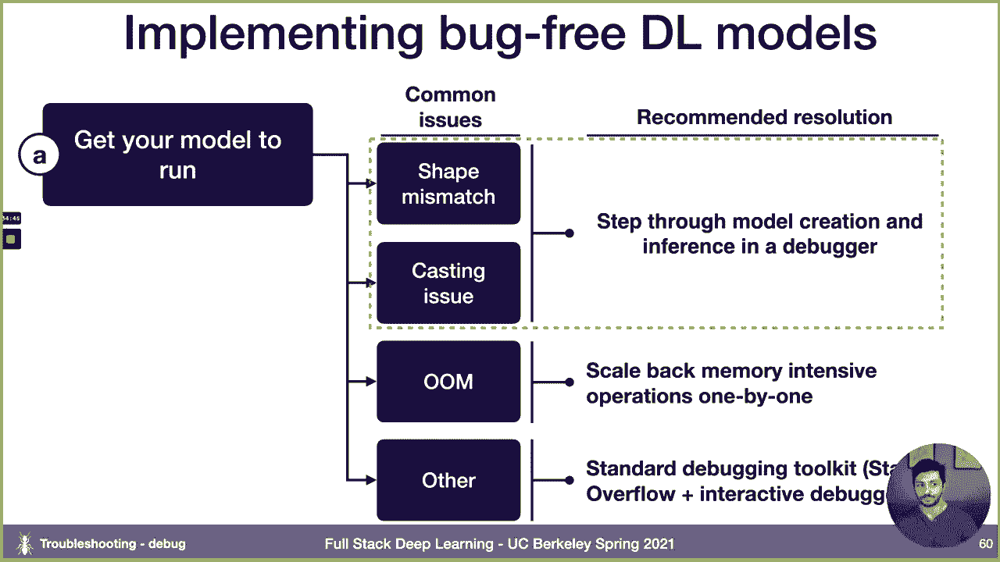

okay so zooming in on this process of，stepping through model creation and，inference in a debugger。

i think you know for for pytorch it's，relatively easy to do this。

in something like ipdb for tensorflow，at least like older version。

non-imperative version of tensorflow can，be trickier and，so i think like maybe none of you are，but。

if you ever end up using it one trick，you can use is you can，just step through the creation of the。

graph in the debugger another trick that，you can do is you can actually step into。

the training loop itself and like，evaluate tensors individually by，just doing sesh。

run in tensorflow and，then lastly there's a tensorflow，debugging tool that is worth taking a。

look at here if you，ever end up in the unfortunate position，of needing to do a lot of。

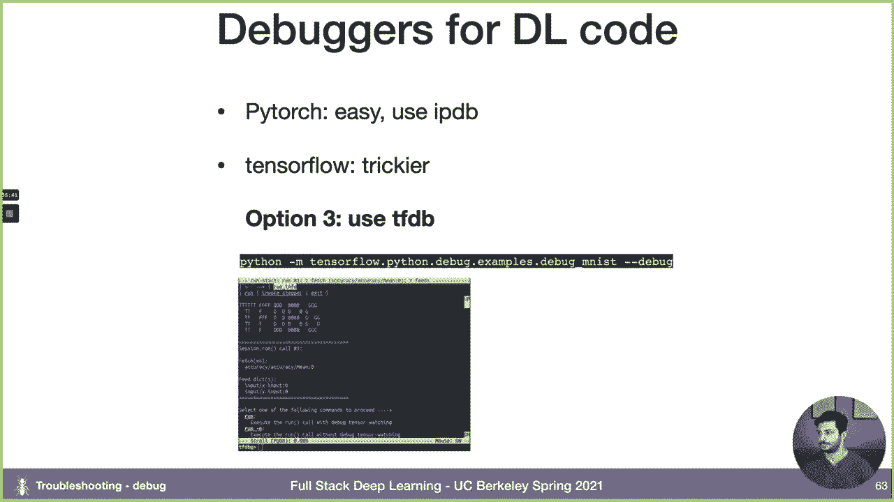

okay so to summarize you know first，thing that we're trying to do is。

get our model to run so we're dealing，with shape mismatches casting issues。

out of memory issues and then a whole，litany of other things that can go wrong。

all right so i cover a couple of other，like kind of more detailed。

sources of bugs in these slides like，diving into a little bit what can cause。

shape mismatch and casting issues and，things like that i'm not going to go。

through those in detail right now but，they're here for you if you want to take，a look later。

all right so we've implemented our model，and now it's actually running so。

we're done right like we're we we can，write the paper you know。

graduate and it's all good no of course，not like this，when you've got the ball to run that's。

actually like where your debugging，really starts and so the next thing that，i recommend doing is。

overfitting a single batch of data and，so what do i mean by this，well i mean like literally a single。

batch so you know two or four or eight，or 32 data points，and by overfitting i mean driving the。

loss arbitrarily close to zero，so you know if you get lost to go to。

some number that looks low to you，but then it kind of plateaus it can be。

tempting to say okay yeah we're，overfitting，a single batch of data but that doesn't。

actually count so，what you really need to be able to do is，like pick some number and then make sure。

that the loss can get，arbitrarily lower than that number so，arbitrarily close to zero。

so what are the things that go wrong，when you're over fitting a single batch，of data。

well instead of driving the arrow down，to zero in some cases the error will。

actually go up and so if if the，if the error goes up the most common。

thing is that you've flipped a sign，somewhere so maybe you've like you're。

optimizing the negative of your loss，function instead of your loss function。

but there's other possible sources of，that problem the error can also explode，so it can。

you know go down um for a while and then，all of a sudden shoot up。

and and then get arbitrarily high and so，if the error goes down and then up。

usually in my experience this is a，numerical issue and so you can check all，of your like。

like operations that could be causing a，numerical issue but it can also be。

caused by the learning rate，the air can oscillate so it can go down。

and then come back up and then go down，and then come up，in my experience this is often caused by。

corrupted data or labels so you know，your learning problem might actually be，impossible because。

for example your labels might be，shuffled because that's that's i think，the most common cause of。

error oscillation but it can also be，caused by a learning rate that's too，high。

and then lastly your error can plateau，so the error goes down down down until，you get to 0。1 or 0。01。

or something like that and then it，doesn't really get much lower after that。

and and so i think the thing i would try，here if you're getting a plateauing。

error is you can try to turn up the，learning rate a little bit and。

getting rid of regularization if you，didn't listen to my advice and you're，using。

regularization in your first，implementation and if that doesn't work。

then i would check you know i would like，kind of check very carefully your。

loss function itself like how you're，defining that how you're computing it，and your data pipeline。

because there could be bugs there as。

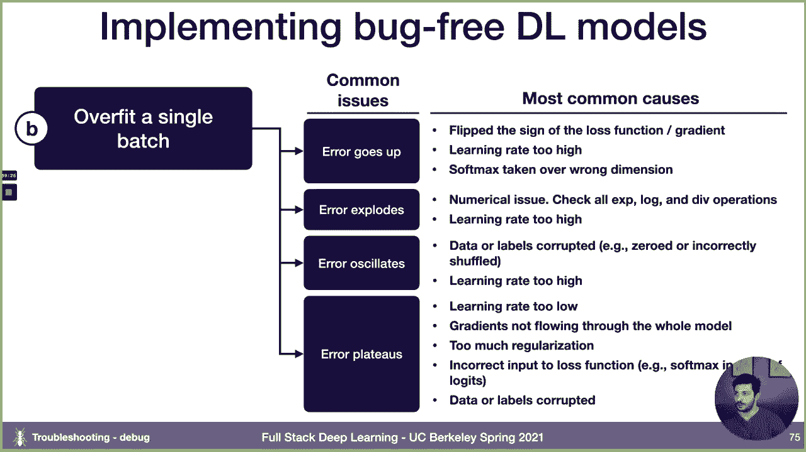

okay and this is just this all this in，all right so once we're able to over fit，a single batch then。

the next thing that we should do before，we start trying to make our model。

more complex or adding more data or，anything like that，is comparing the results that we're。

getting to some known result and this is，the last kind of sense check that we'll，use。

uh to convince ourselves that our model，is reasonably bug-free，before we move on so not all known。

results are created equal i'm going to，go through some possible known results。

that you can compare to kind of in order，of，what i think their usefulness is so i。

think the most useful thing if you can，find it，is you know some official implementation。

of the model that you're implementing，evaluated on a data set that's like。

yours and so the reason why this is so，useful is because，you can walk through both。

implementations line by line and ensure，that you have the same output。

and you can also make sure that you're，like the performance that you reach in，the end。

is on par with what you should expect，your model to do，on that data set if you can't evaluate。

the the official，model implementation on um your data set，or a data set that's like yours。

then you can try to like try comparing，to the implementation on a benchmark，data set like mnist。

and so this still lets you walk through，the code line by line but you know the。

results like the numbers that you're，getting on mnist don't really tell you，much about。

how well your model is actually doing，because pretty much everything does well，in mnist。

if there's no official implementation of，the model you can instead use an，unofficial。

implementation of the model with the，caveat that like i would be very very。

careful if you go down this path，because i found like that like the vast，majority of like random。

modeling implementations that you find，on github have，pretty serious bugs in them in fact like。

even some of the official，implementations of models，have bugs in them so just generally i。

would be i wouldn't trust other people's，deep learning code to too much unless。

it's kind of like a really well，established code base if you if there's。

no implementations available maybe the，paper just came out，you can look or maybe you made it up you。

can look at the results，from a paper without looking at the code，which will tell you whether your。

performance is roughly in line with what，you'd expect，but won't help you figure out what's。

wrong if it's if it's wrong，you can also look at the results of your。

model on some benchmark data set right，so you can look at，your model on how well your model。

performs on mnist and you know pretty，safe to say that if it's not getting，99。95 percent or 99。5。

let's say on endness then there's，probably some bug because you know。

generally everything that's doing，reasonably well，should be above 99 on mnist。

if you don't even have that then you can，look at results from a similar model on。

a similar data set or，if nothing else you should be looking at，super simple baselines like。

just the average of all of your outputs，or you know the result of。

running a linear regression on your data，set and this you know if you don't have。

access to anything else this is still，useful to do because you will catch bugs，this way there。

there there are examples like i've had，examples where，you know your model is actually doing。

worse than just randomly predicting or，just like predicting the mean of your。

of all the labels in your data set and，so at the very least this will tell you。

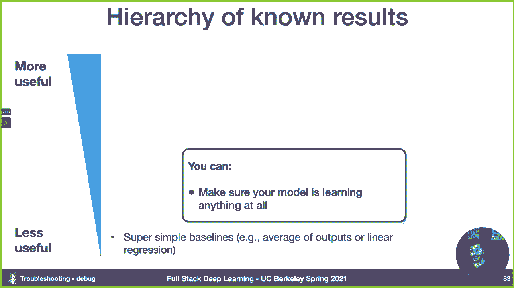

that your model is learning anything at，all right so to summer in in summary how。

should you think about implementing and，debugging your model once you've chosen。

your model architecture that you're，going to use，so the first thing you need to do is get。

it to run it all and some techniques you，can use here，are stepping through things in a。

debugger and watching out for，shape casting and out of memory errors。

once your model runs you need to overfit，a single batch，and so if you can't over fit a single。

batch that means you have a bug and，likely causes of bugs are corrupted data，or over regularization。

or maybe broadcasting errors silent，broadcasting errors，and then once your model can overfit a。

single batch then you want to compare to，a known result。

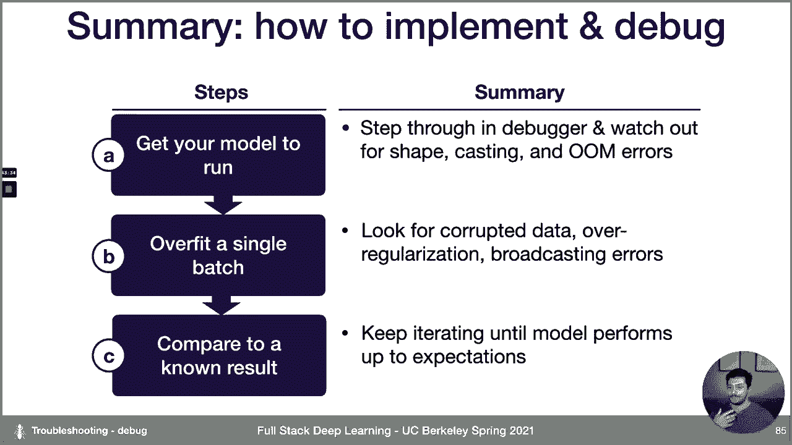

and keep iterating and looking for bugs，until your model performs，up to expectations go ahead yeah i。

wanted to ask so like you talked a lot，about like you know creating an ml。

product from scratch like i'm curious，you have any advice for people that are，like going in。

and starting with all and already，somewhat like developing our，developmental system。

yeah i think that's more or less what，like，how to iterate once you have some。

starting point but i would say you know，the same principles apply，you should like try to gradually。

increase complexity so if you're you，know if you have an idea for a new。

a new model architecture then you know，maybe just change that，and see how that how that changes。

performance rather than like changing，the model architecture，and also like changing the data set and。

changing the you know a bunch of other，things as well，or you can take that even one step。

further and like if you if you have an，idea for a new model architecture then。

don't make all the changes you want to，make all at once you know maybe。

if like one of the changes you want to，make is like switch out you know。

your your non-linearity for some like，fancy new，non-linearity from some paper that you。

read and you also want to like，add attention in a couple of places and。

you know add like one or two other，things as well，then like maybe just pick one of those。

to start and then try it and see if that，improves model performance。

before you go and implement like all，so there's a question in the chat uh，what is ipdb versus pgb。

i can answer it yeah can you answer it，yeah pdb is the python debugger，and then ipdb is the ipython。

python debugger so it's just a little，nicer it has like synthetic highlighting。

i think i've never used regular pdb，before，yeah i don't know why you would maybe if。

you're like running on someone else's，machine or something and you can't，install stuff。

yeah yeah ipdb is amazing，and how many epochs should you expect to，oh。

it could be a lot yeah i wouldn't，necessarily like worry too much about，the number of。

number of epochs because your epochs are，gonna be really fast with a single batch。

like they should be very very fast if，they're not very very fast then that。

could be some other source of bug but i，mean really i would i would expect this，to take like。

less than a minute probably a quick，i've had，ignorance but i kind of want to push。

back on the premise that we're fitting a，single batch is，that useful like i mean i guess for some。

reasons a，like if the batch is too big then，you won't be able to over you won't be。

able to draw the error rate down to zero，if your model is，small enough and i guess b if there's。

some problem with the data or like some，fundamental noise in the data that you，actually can't。

get then i'm not sure you'll be able to，draw it down to zero，anyway i'm just not sure what yeah the。

way i think about it is，let's say that you have 32 data points。

in your batch and you have 32 parameters，in your model then you should be able to，memorize the batch。

so if if you're using a really small，model then just make your batch。

smaller and i would say the reason why，this is useful is like。

more more an empirical observation than，anything else which is just that like。

most people i know who who do this，consistently frequently catch，you know。

and from personal experience whenever i，don't do it there's like a 20。

chance that i'll end up regretting it，later because i'll spend a day working，on something and。

thinking i have some really complicated，bug but then it turns out that i can't。

even overfit a single batch，so it's it's almost it's almost free to，do this like。

should take you like five minutes and if，it works then you can just be more。

do you recommend like visualizing your，data at least like like images in，particular i guess like。

do you recommend doing some of that，stuff before that was a method of。

debugging like doing visualization，before and after，just to see if like something at least。

make someone sense you mean if you're，generating images or something like that。

generating images or maybe generating，labels or bounding boxes you just want，like。

yeah that's hard to do it yeah，absolutely we'll talk more about like。

kind of a general method for that，in a bit but yeah i think you know。

inspecting your data before you get，started is a really good idea。

like just playing around with it trying，to label it yourself，and just generally getting a feel for。

what the distribution of data looks like，is。

so moving on to model evaluation，so the the tldr of evaluating your model，is that we're going。

to apply the bias variance decomposition，and we're going to use that to make，decisions about。

how we prioritize next steps that we，that we take in sort of model creation，or model。

like generally the process of making，your models better over time so to，review。

the bias variance decomposition so let's，say that we have some human level。

performance or some target performance，in general and then we have。

a loss curve like our training error，that's plotted in green here。

generally speaking your validation curve，will be another，learning curve that is hopefully above。

your training error，your test error will be yet another one，that's above your validation error。

and so the the bias variance，decomposition，breaks down your test error into。

different components so the first is，some what，you know the term of art is often，irreducible error。

which is you know some error that you，than，so if you have a really strong human。

baseline then you could say that that's，your irreducible error，and then you look at the difference。

between your irreducible error and your，training error，and that's a measure of avoidable bias。

right so how much your model is，underfitting to that training set and。

you can look at the difference between，your validation error and your training，error。

and that's a measure of variance so how，much you're，overfitting to your training set and。

then finally you can look at the，difference between your，test error and your validation error you。

know when when you do，infrequently evaluate your model on the，test set and that difference is a。

measure of，how much you're overfitting to the，so to summarize the bias variance。

decomposition says that，your test error can be broken down into，some irreducible error。

plus bias plus variance plus validation，set overfitting so one assumption that's。

baked into this is that，this all assumes that your training，validation and test set all come from。

the same data distribution，so what should you do if that's not the，case which it's not the case。

in a lot of real world machine learning，problems so for example。

like if you're working on self-driving，cars then you might have a situation，where。

most of your training data looks like，data，from daytime driving scenes but then in。

the real world you also have to deal，with data，that looks like on the right so let's。

say data that's that's at night，and the the strategy that i'll recommend。

here is to actually use two validation，sets，one that's sampled from your training。

distribution and then a second that's，sampled from your test distribution。

and i think it's really important to do，this even if you have very limited data。

from your test distribution because what，this allows you to do is，this。

bias variance decomposition so between，your test error and your training error。

instead of just having one validation，error curve instead you're gonna have。

two validation error curves one that，corresponds to，the training validation set the one the。

validation set you sampled from your，training distribution，and then the other that corresponds to。

and so the way that this affects your，additional，in addition to underfitting overfitting。

and validation set overfitting you also，have this other term which is the。

difference between your test valve error，and your train valve error，which is a proxy for how much。

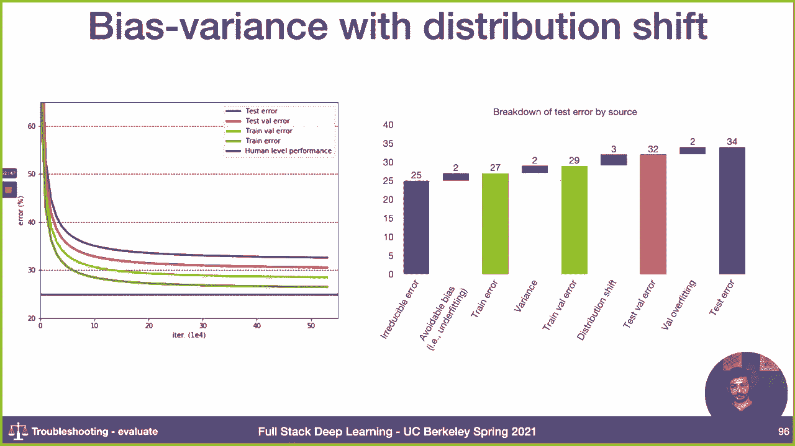

performance，so let's let's look at an example of of，this strategy so let's say that we。

you know train our first model our like，simple linette model on this pedestrian，classification。

task and these are the numbers that we，get so our goal performance was one。

and our training error is like really，bad it's 20 our validation error。

is even worse and our test error is not，too much worse than our validation error。

so this this difference between our，training performance and our goal，performance。

this this massive 19 difference tells us，that we're，pretty seriously under fitting our。

training distribution our training set，the difference，between our validation error and our。

training error tells us that we're，also overfitting at the same time which，is very possible to do。

with neural nets and then，the the difference between our test，error and our validation error is，that。

we're happy like we're happy with this，difference like we're good here and。

so the question here is like we are both，underfitting and we're overfitting。

so what do we actually do like how do we，decide what to work on next。

and that'll be what we cover in the next，section but for now just to summarize。

the the what i recommend doing here when，you're when you're deciding。

what to work on next in your model is，breaking down your performance。

into some irreducible error some bias，some variance some distribution shift。

and some validation set overfitting and，then you，the next thing that we're going to do is。

we're going to use those numbers to make，a decision about what to implement。

next in your model all right，so next we're going to talk about how to。

actually make improvements to your model。

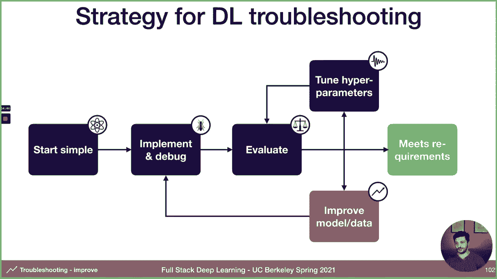

and your data，to try to improve model performance，and so the way that we're going to apply。

the bias variance decomposition to，prioritize，improvements is we're going to follow。

the the following set of steps，so the first thing that we're going to。

do is we're going to start by addressing，under fitting，so for both under fitting and。

overfitting we'll start with under，fitting，then once we've dealt with under fitting。

then we're going to move on to，overfitting，and then distribution shift and then。

handling overfitting to our validation，set by，rebalancing data sets if we need to。

so to start let's talk about how to，address underfitting so how how do we，reduce bias。

and here are some strategies that you，can use in order that i would。

recommend thinking about them so the，first thing the simplest thing。

and in many cases the thing that's most，likely to be successful is just。

make your model bigger right so add，layers use more units per layer。

and just increase the capacity of your，model，you can also consider reducing。

regularization so if your model is over，regularized then that might prevent you，from。

being able to to to get a tight fit to，your data set，you can do error analysis which is a。

process that we'll come back to，talk about in a few minutes you can。

choose a different model architecture so，you can，move from your current architecture to。

something that's closer to state of the，art and，re-implement that this can be a very。

effective strategy the reason why it's，so low，on this list is because it's it can be。

very time consuming and also can，introduce new bugs so it can，cause you to kind of take a few steps。

back in your process，you can also tune hyper parameters which，again can can give you。

big improve improvements in performance，if you've tried these other things。

and then lastly you can try you can，traditional，ml world adding features is maybe the。

first thing that you try but in the deep，learning paradigm，generally like philosophically people。

don't really think about adding features，you want to make you want to you want。

your model to learn the features but，the secret and the trick is that in the。

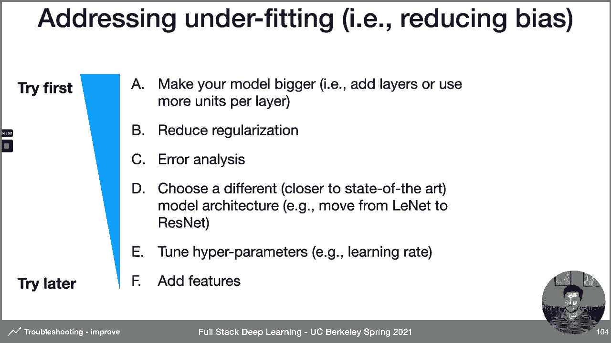

real world sometimes adding features，can really help all right so let's let's。

walk through an example here，so again our training error is much，worse than our goal performance so。

first thing that we might try would be，adding more layers to our component。

maybe that reduces our training error to，like let's say seven percent。

um still not good enough so we might，switch from a bigger confidence to a，resnet。

and that might reduce our training error，down to three percent and then we might。

tune the learning rate，and let's say that for the sake of，discussion here that that gets us down。

to our goal performance of one percent，training error，and so now the the gap between our。

training error，and our validation error has gotten even，bigger so the next thing that we're。

going to need to do is。

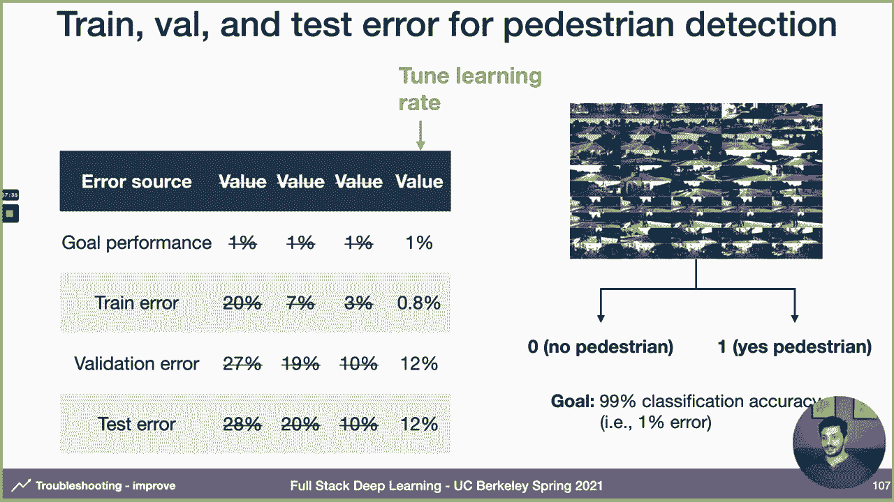

address the fact that we're now，so some strategies for addressing。

first thing that i would recommend do，doing if you can do it，or if it's relatively easy to do it is。

adding more training data so i think，this is the most principled way to。

reduce overfitting in the real world you，don't always have access to more，training data。

so there's a lot of other strategies，that you can try but you know if for。

example you're only working with a，subset of your data to begin with。

then before doing anything else that，would just make your data set a little。

you can also try adding normalization，like batch normal layer norm or data。

augmentation or regularization i think，normalization is usually the first thing。

that i try it's kind of like more of a，modern approach than，regularization and normalization often。

also has，the effects of reducing underfitting as，well so，you can do the same error analysis。

process that we'll talk about in a few，minutes，choosing a better model architecture can。

also help you reduce overfitting，in some cases same with tuning hyper。

parameters using early stopping which，some people，really recommend using i i've generally。

not found it to be，all that helpful part part of my toolkit，removing features or，would say。

i would put these last three things in，the like not recommended category。

and i think like early stopping might be，controversial in that category i think。

the fast ai folks for example recommend，using early stopping，as part of your regular toolkit but i。

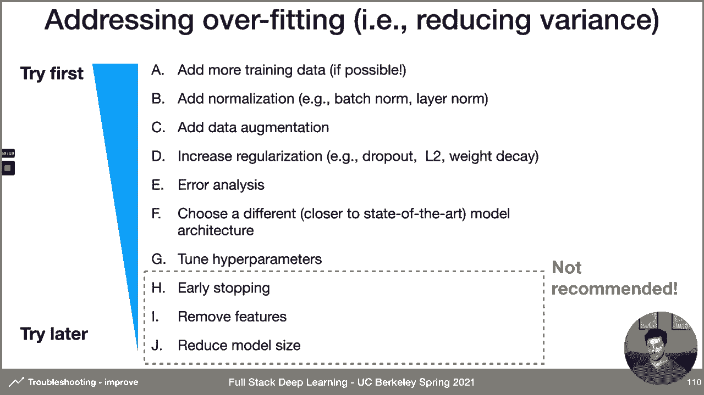

personally haven't found it to be that，okay so let's walk through our example。

again our training error is good our，validation error is，not good so let's try to reduce，overfitting。

so the next thing we might do is，remember we were using a subset of our，data。

to make the problem simpler to start so，let's actually increase the。

amount of data that we're using let's，say we'll increase it to 250 000 data，points then we might add。

a regularizer like weight decay we might，add some data augmentation。

and then you know now that we're now，that our validation error and our。

trading error are relatively close to，each other let's，but you know no longer close to our goal。

performance then we might go back and，tune our hyper parameters again in this。

case in this this time we might tune，more than just our learning rate and。

this you know could be the thing that。

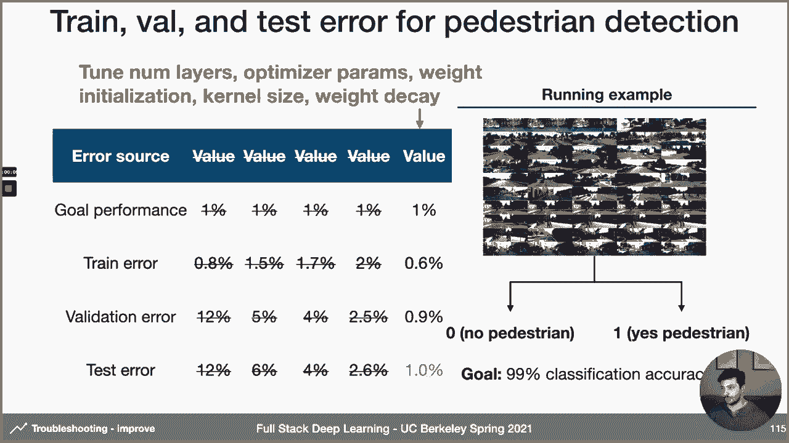

gets us down below our goal performance，okay so we have you know our validation，error is。

is down at the goal performance that we，originally wanted the next thing that。

we'll need to do is address，our any additional error that's caused，by distribution shift。

so if there's a difference between the，error on our training validation set。

and our test validation set then this is，the step at which we address that。

there's fewer things to try here which，is both good and bad，good because there's you know simpler to。

pick the one that you want to use，bad because it's just a harder problem，to deal with。

the first thing that i would do here is，i would i would look at the errors。

in your test validation set and i would，look at those errors manually。

almost one by one and then i would try，to reason about，what are the different causes of the。

errors that are in our，test validation set but not our trained。

validation set now go and actually try，to collect more data to try to。

compensate for that and i'll talk，i'll give a more detailed example of。

this in a second but when you can do，this i think this is the most principled，way。

to address distribution shift again not，always possible to go out and collect，more data。

so another thing that you can do is，instead of collecting more data to deal，with。

errors in your test validation set and，data，to deal with those errors and that can。

often get you pretty far，and then lastly you can try using domain，adaptation。

as as a way of dealing with the。

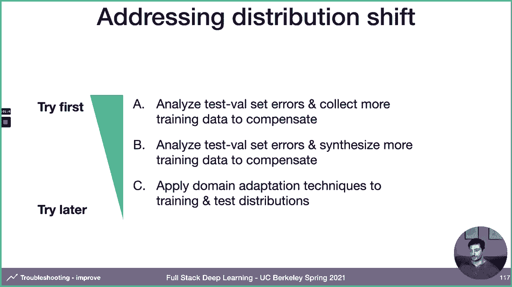

difference in the domains，so we talked about this idea of error。

analysis a few times let me give you a，more concrete example so suppose that，these are。

some of the errors that we're seeing in，our test validation set and。

in our train validation set and these，are errors where，you know there is actually a pedestrian。

in the image but we're not detecting it，so let's try to reason about。

what are possible causes of errors in。

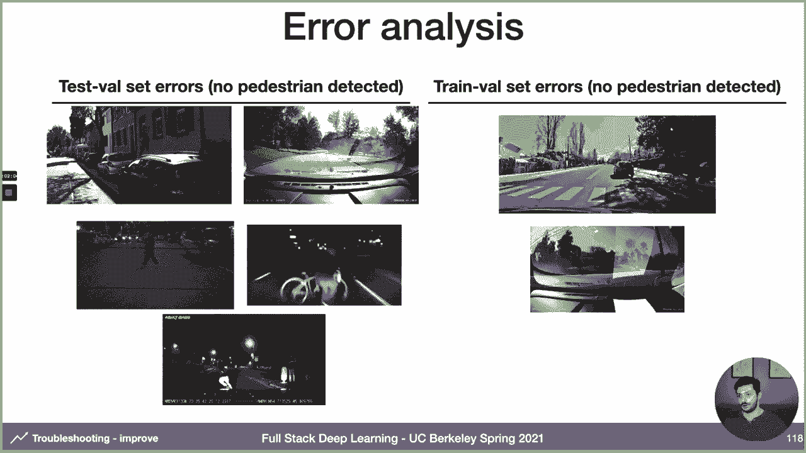

these data sets，so there's one category here that，appears in both data sets which is like。

i would say just really hard to see，pedestrians so i i mean i can barely see，pedestrians in those。

images myself at all there's a second，category of errors here which seems to，be related to。

there being reflections in the images，and that occurs in both data sets。

so that's maybe something else we could，deal with and then there's a third，category of errors that。

really only seems to appear in our test，validation set，which is images that occur at night。

right so darker images，and so this is maybe like one possible，cause of。

and so one way that you can like be a，little bit more systematic about how you。

do this error analysis process，is you can break down the you know you。

can look at a bunch of data manually and，you can break down the types of errors。

that you see and you can look at how，much they contribute to the overall。

error that you're seeing in your model，so in in our case，hard to see pedestrians like let's say。

that those are that's pretty rare both，in our our trading validation set and，our test validation set。

and so it's not a huge contributor to，our loss or to our error，and the potential solution here would。

really be like how do we deal with these，hard to see pedestrians。

i mean really the main way i can think，of is maybe we'd have to get better，sensors。

so this is not a huge contributor to，error and it would also be really hard，to fix。

so if i did this error analysis process，i would probably make this relatively，low priority。

at least to start out with the second，error type that we had，identified was reflections and so let's。

say that this is you know，a larger contributor to our training。

validation error and our test validation，error and there's more possible，solutions here so we could。

try to actually go out and collect more，data that has reflections in it。

and train on that data we could add，synthetic reflections to our training，sets so we could use a。

graphics engine of some kind to try to，doesn't have，it and train them all to perform well on。

that data，we could try to remove the reflections，using some computer vision。

pre-processing techniques，or we could use better sensors so，if i look at this category it's。

relatively large contributor to，error both on the train validation and，the test validation set。

and we have some ideas about how we，could deal with it without this really，expensive process of。

adding better sensors so i might give，this like a medium priority。

and then lastly we looked at this error，type of night time scenes。

so very small contributor to error in，our training validation set。

but let's say that we found a lot more，errors that were caused by this in our。

test validation set so this is，maybe one of our sources of the gap，between our training。

validation error and our test validation，error，and some ideas that we could try about。

how to how to deal with this，well we could actually go send our cars。

out at night and collect more data then，maybe that's actually really easy for us，to do maybe it's。

maybe it's not maybe that's harder for，whatever reason we could try。

and if it is we could try to create，synthetic data to deal with this。

so we could synthetically darken our，training images to make the daytime，images look more。

look more like nighttime images we could，try simulating nighttime data from，scratch。

or this would be a reasonable place to，try using domain adaptation techniques。

to deal with that gap and so if i was，running this air analysis process。

i would look at this and say this is a，big contributor of error to our test，validation score。

and there's a bunch of things that we，could try some of them might be really，easy。

to deal with it so i'll give this a high，priority and this is probably the thing。

that i would work on next，okay so let's let's drill in a little。

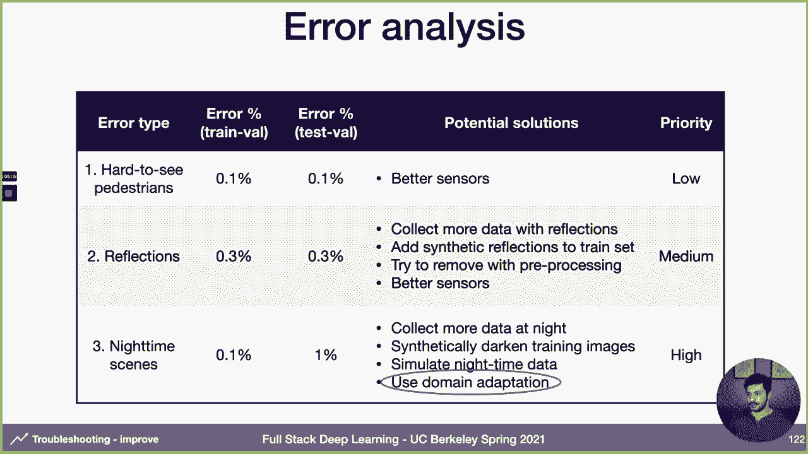

bit on this last thing domain adaptation，so what is domain adaptation so made。

adaptation is a class of techniques that，there's many there's many techniques。

that fall in this category but they，generally，try to train on some source distribution。

and then generalize to a target，distribution that you want to perform，well on。

using only unlabeled data from the，target distribution，or maybe some limited amount of labeled。

data from the target distribution，and so when should you actually consider。

using this if access to label data from，the test distribution，so the distribution that you want to。

perform well on ultimately，is limited but access to，relatively similar data is plentiful and。

maybe access to unlabeled data from the，test distribution is also，relatively accessible then you can。

consider using domain adaptation，techniques，there's a few different types of domain。

adaptation that you'll see，so there's supervised domain adaptation，where you have。

let's say some limited amount of data，from your target domain。

and so some examples here are as simple，as just like，fine-tuning a pre-trained model or，adding。

the data from your target distribution，to your training set but there's more。

complicated techniques here as well，and then there's unsupervised domain，adaptation where you have。

like let's say a lot of unlabeled data，from your target distribution but no，labels。

so here are some techniques that you，might see if you if you look into this。

and practically speaking i would say，that these supervised demand adaptation，techniques。

you know fine tuning being the most，common actually work really well and so。

this is the thing that's definitely，worth considering if you have。

plentiful data in one domain and then，limited labels in another domain。

the unsupervised main adaptation，techniques i think are kind of more。

in the research realm than they are，actually practical，for real world machine learning systems。

right now but it's a pretty active area，of research and so，this might no longer be true in a year。

okay so we've addressed our distribution，shifts，and the last thing that we need to do is。

consider rebalancing our data sets，so if our test validation score is，significantly better than our。

than our performance on our actual，holdout test distribution。

then that means that we at some point we，ran too many experiments and we overfit。

to our validation set，and so this happens a lot if you're，using a really small validation set。

or if you're doing a ton of，hyperparameter tuning，and the only thing really to know here。

is that you know if this does happen，when you period，periodically check your scores on your。

whole held out test set，then just recollect your validation data，or resample it from your。

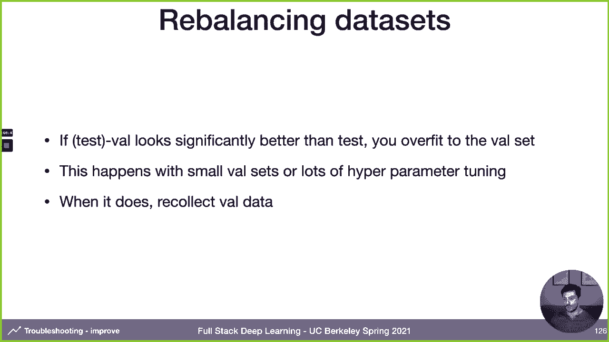

okay so we've talked about techniques。

for improving model performance all，right，next thing we're going to talk about is。

the very fun topic of。

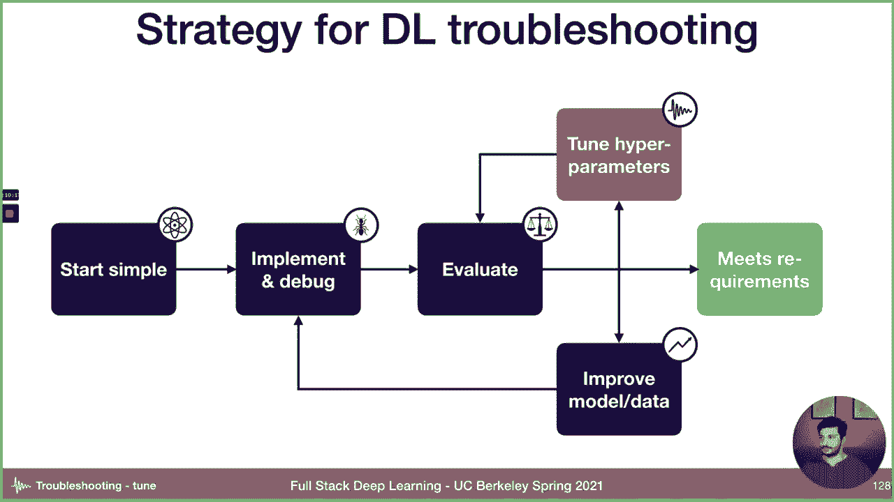

so so let's talk about like what hyper，parameters，we actually have available to us in this。

problem this，you know this very very simple toy，example that we're。

using throughout this lecture so our our，model architecture at this point is a，resnet。

so there's a few different things that，we could tune here we could choose the，number of layers。

we could pick a different weight，initialization scheme we could change，the kernel size。

or other kind of model specific，could，change the batch size we could change。

the learning rate we could change the，atom specific hyper parameters，regularization you know。

there's many different regularizers we，can choose and so i think like kind of，one of the。

core challenges in doing hybrid，parameter optimization is just，there's so many different things that。

you could tune how do you even pick，which hyper parameters you should be，optimizing so，like。

for better and for worse models tend to，be more sensitive to，some hyper parameters than they are to。

others so there's more bang for your，buck and，generally speaking in tuning some of。

your hyper parameters than than other，hyper parameters，unfortunately which hyper parameters。

your model is most sensitive to，depends on a lot of things including the。

choice of model the choice of data set，and the other hyper parameters that，you're tuning so。

that's the bad news the good news is，that there are certain rules of thumb，problem。

that you can use to think about like，okay which hyper parameters should i try，to tune first。

and so these are these are really like，only rules of thumb，they you know in general like you。

there's no substitute for building，intuition for your problem about。

which hyper parameters your your your，and then the last thing i'll note here。

is that when i when i i'm gonna have a，prioritized list of hyper parameters on，the right。

and the sensitivity that we talk about，here is relative to default values。

so if you're if you're using sensible，defaults already then，you know that gets you a large part of。

the way there for some hyper parameters，but if for example you're using like all。

zero weight initialization right，or vanilla sgd like something crazy then，changing。

to the defaults like choosing to this，changing to the standard defaults will。

okay so let's talk through some hyper，parameters so i think almost always the。

first thing that's worth tuning is the，learning rate generally，usually pretty sensitive to learning。

rate even if you're using something like，adam learning rate schedule can also be。

a good one to tune i think optimizer，choice beyond atom，can make a difference but in my。

experience it's usually not really worth，you're，trying to push the limits of your model。

performance you can try tuning other，optimizer parameters like beta 1 for，adam。

i think unless unless they're like，someone else tuned them，in a paper and they told you that it。

depends on this particular choice of，beta 1 then，you usually wouldn't really mess around。

with this too much i haven't found it to，be to make that big a difference。

although some people say that it makes a，big difference for some problems。

batch size i would say generally is not，really like a great thing to tune i。

would just generally pick，the biggest batch size that you can，while still fitting on your gpu。

weight initialization can be a way to，improve model performance，not always and not really the first。

thing that i would pick but，if you're having trouble getting into。

better performance then playing around，doing，picking a different loss function can。

have a big impact on model performance，tuning the depth of the model can，sometimes have an impact。

layer size is is you know increasing the，width of a layer can be a good one。

playing around with the kernel size and，other parameters of layers sometimes。

weight regularization sometimes and then，i would say，choice of non-linearity so like moving。

from values to，some other type of lose lose，cell use or anything like that。

okay so this is kind of some rules of，thumb that you can use to pick。

which hyper parameters you want to tune，next thing that we'll talk about is。

techniques you can use for actually，tuning them so the first thing that。

you'll probably end up trying is just，manual hyper parameter optimization so。

this is also maybe better known by its，its colloquial term which is graduate，student descent。

so how does manual hyper parameter，optimization work you know well the，first thing you do is。

try to like really think you know sit，and you stare at the paper and you think。

really hard about the algorithm，that you're implementing so okay so what。

does it mean if we have a higher，learning rate you know，generally speaking that'll mean that。

like our training will be faster but，it'll be less stable，and for every other hyperparameter。

that's part of your algorithm you'll，think really hard about what effect that。

should have and then you'll train and，to guess，right you'll use all this intuition that。

you built from studying math for，many many years and attending great，schools and all this stuff。

and you'll guess better hyper parameter，values and retrain and re-evaluate so。

i'm kind of poo pooing this a little bit，but this actually could be a really good，technique。

and in particular it can be a really，good technique because it can be easily。

combined with some of the other methods，that we'll talk about，so for example you'll often find。

yourself manually selecting ranges of，some，other optimization algorithm over and。

really one of the big differences here，is that，if your goal is like compute efficiency。

so get to the best possible performance，with the fewest，number of train runs which you know in。

in 2021 is generally not really the，right goal because computers becoming，cheaper and cheaper。

but in some cases it is like if you're，training a massive model for example，then this technique will。

usually have like the least compute，required to get to，a good result obviously the big。

disadvantages are that it requires you，to actually understand the algorithm。

pretty deeply to do it well，and it's very time consuming so this can，be a reasonable starting point。

but it's generally not recommended，the second thing that you'll probably。

try is doing a grid search and so the，way that this works is，you can imagine each of the hype。

parameters that you're tuning plotted，against each other on a grid。

and then you um uniformly sample points，on that grid，that you know for for each of the the。

hyper parameters you're optimizing，and then you'll run your training for，each point。

on that grid big advantage here is this，is just like really simple to implement。

and it can work reasonably well and the，results that you get，tend to be pretty interpretable so you。

know you're picking，learning rates and other hyper，parameters that are nice round even。

numbers that you would be happy to，report in a paper，so that's that can also be like a。

psychological advantage，disadvantage is that this is not very，efficient right so。

in order to make this work you need to，train on all of the different cross。

combinations of the hyper parameters，that you're tuning，so if you're tuning more than one or two。

hyper parameters then this，tends to be very inefficient，and then this often requires prior。

knowledge about parameters to get good，results right so，you need to choose the size of your grid。

like the min and max values for each of，the hyper parameters that you want to，search over。

and if you don't do a good job of，picking those values then，general thing that's slightly better to。

do than a grid search is to do a random，search，and so the way that this works is you。

still choose a range for each of the，hyper parameters，that you want to optimize but instead of。

sampling like all of the grid points，on that range instead you'll choose like。

n points that are sampled randomly，from that grid and so，you might think like okay why like why。

we do this like why would we expect this，to be better than grid and the reason is。

that empirically this，tends to produce better results than，grid search。

for the same number of runs and in fact，like sometimes，the it's significantly better results。

than grid search and it's still pretty，easy to implement，so disadvantage is that it's less。

interpretable right so you'll get，like these like weird looking numbers as。

the result of your optimization，matter，for anything but sometimes it's like。

nice to be able to say like oh yeah my，learning rate is，you know 10 to the negative three and，that's。

easy to communicate and easy to remember，and then again you know you still need。

to select these ranges so you still need，some prior knowledge about。

what values of parameters will get you，good results，one way to get around this this last。

disadvantage，is by doing instead of just a single，random search instead doing a course。

defined random search，so the way that this works is that you，start with like a really wide range of。

of parameters maybe they're even log，scaled，and then you run a bunch of training，runs。

and then you narrow in on the region of，the，the 10 best or the five best performing，runs。

and then you create a new grid around，those data points，and then you can keep doing this。

indefinitely and so the advantage of，this is that you can get really good，narrow。

narrow in on like very high performing，that，this is a really commonly used method。

maybe these days like automatic like，bayesian hyper parameter optimization，techniques are。

like potentially catching up to this but，this is an easy one to implement and do，in practice。

disadvantage is that it can be somewhat，manual so oftentimes there's a little。

bit of judgment that goes into，deciding like what's the exact range of。

of the parameters that i want to sample，when i，reduce the size of my grid but other。

than that this is like generally what i，would really recommend。

doing in practice the last thing to be，aware of，is bayesian hyper parameter optimization。

methods and so there's，a lot of kind of like conceptual surface。

area here so we won't really be able to，do this justice but，at a very high level the way that this。

works is you start with some prior，estimate of the parameter distributions。

and you maintain a probabilistic model，of the relationship between。

the hyper parameter values and model，performance and then you alternate，between。

training models with hyper parameter，values that，are aimed at maximizing some expected，improvements。

given this this this probabilistic model，that you're maintaining，and then using the results of your。

training run to update our probabilistic，model，so at a very high level that's the way。

that a lot of these algorithms work and，yeah here's here's a blog post that i。

recommend if you want to actually go，into more detail，about some bayesian hyper primary。

optimization methods，so big advantage of doing this is that，generally this is like the most。

efficient and hands-off way of choosing，hyper parameters you can get great，results doing this。

with very little manual effort，can be，sort of notoriously difficult to。

implement yourself from scratch，and it can there are off-the-shelf tools。

that help you with this but they can be，difficult to integrate with。

so generally speaking if you're working，on a new project and you're implementing。

things yourself i wouldn't recommend，starting here，but as your project gets more mature。

this can be a really good thing to，consider，and i think also like as libraries and。

like training infrastructure，that you use off the shelf gets more，mature a lot of these things are。

starting to have，these techniques built in which reduces，some of the，here。

okay so to summarize like we talked，about a lot of different ways，of optimizing hyper parameters。

recommendation here is，if you're just working on a project by。

yourself or like starting a new project，from scratch，i recommend using course to find random。

searches，great bang for buck you can get really，good performance you can inject as much。

grad student descent into this process，as you'd like to，and then as your project and your code。

base get more mature i would consider，using some of these bayesian hyper。

parameter optimization solutions，as you kind of narrow in on what exactly。

your models are going to look like and，you want to spend more compute to，optimize them okay so。

wrapping up what did we cover today，so we talked about troubleshooting，neural nets。

and debugging deep learning models and，the first thing that we。

observed is that one of the reasons that，this is so hard，is that for any given degradation and。

error that you might experience，there's many different competing sources，that。

that error or that degradation and，performance and so that's the，fundamental reason。

why debugging and troubleshooting deep，learning models is so difficult。

so we talked about a technique that we，you can use to try to。

as best you can train models that are as，bug-free as possible，and the technique that we that we。

followed is essentially to treat，model building as an iterative process，where you start。

with the simplest possible version of，your problem，and your model in your data set and then。

you gradually layer on complexity，one step at a time informed by your。

model evaluation process and your，judgment about what needs to be done，next。

so that at each step in that process you，can reevaluate and re-debug。

and you can isolate sources of error to，the extent that's possible。

and these are the techniques that we。

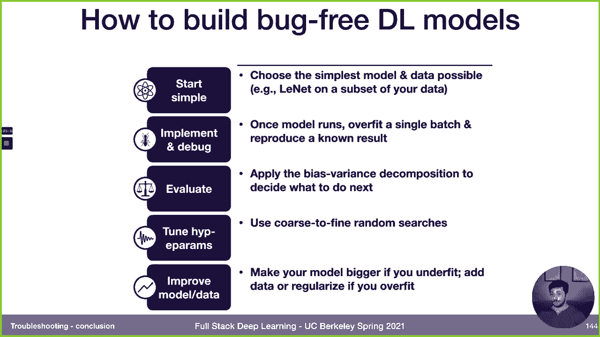

talked about in a little bit more detail，for how to go through that process。

okay last thing i'll leave you with is，there's a few resources i would。

recommend checking out if you want to go，deeper on this，andrew ing's book uh good book bad name。

there's a twitter thread and then，actually a follow-up blog post by andre，carpathi that covers。

some of his ideas on this and then i，also like this，this other blog post that's listed here。

so check these out if you want to learn。

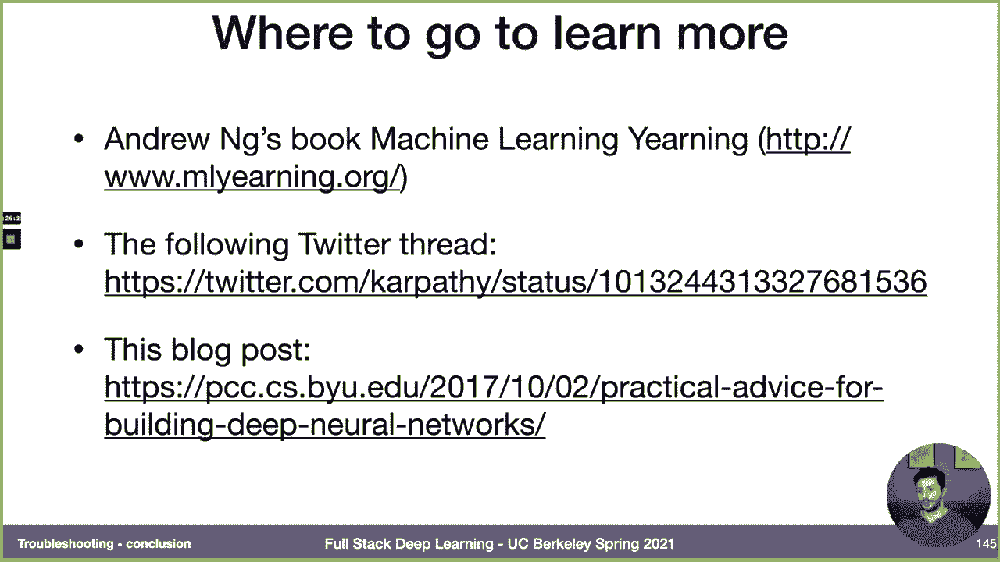

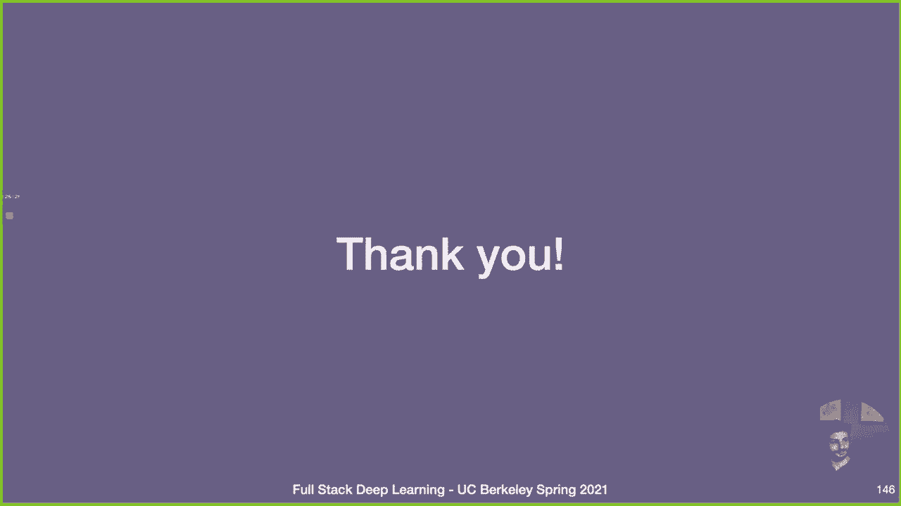