# 【双语字幕+资料下载】伯克利FSDL ｜ 全栈深度学习训练营(2021最新·完整版) - P15：L8- 数据管理 - ShowMeAI - BV1iL411t7jE

so today we're going to talk about data，and here's some motivational tweets one。

of the biggest failures they see in，junior，machine learning engineers complete lack。

of interest in building data sets，there's much you know so much to be。

learned in putting together a data set，here's a poll that someone put together，of data scientists。

uh a couple years ago so like most，people's most of their time is spent on。

cleaning data and moving data as a data，scientist，and then another kind of twitter data。

science person，matt kelsey said that for the last few，projects that they've been involved in，and not。

and you know when we think about what，data management，for deep learning specifically actually。

entails there might be a lot of，might have，just，somewhere on the file system log files。

maybe even spread across machines，records in a database，but at some point you got to get all。

that stuff over to，a local file system that's next to a gpu，right or many gpus。

and that's specifically because we're，doing deep deep learning that's。

you know one of the constraints we have，now the way you're going to get data。

over to that kind of trainable format is，different，for you know every single project every。

single company，it's going to be a unique path，so for example maybe you're training。

on imagenet right and all the images are，just s3 urls，and all you have to do is just download。

them over to the local file system，or maybe you have a bunch of text files，that you crawled yourself。

from some from somewhere and then you，want to use，you know spark to process them on some。

cluster that you have，and then have a data frame that you can，then look at。

and analyze for some you know for some，tasks and then select the subset then，get that subset over to。

a gpu or maybe，you're collecting logs and records from，your database，into a snowflake a data lake or。

warehouse，and then from that you'll process it and，get it over into trainable format。

so there's a lot of you know a lot of，different possibilities。

that we're not going to completely cover，in this lecture，and in fact we're going to talk a lot。

about you know the minutia，of data management but before we get，into that i wanted to cover some key。

points，and the number one key point is，we don't want to spend a lot of time，with our data set。

but we should spend you know 10 10 times，as much data，as much time as we want to on actually。

just becoming one with the data，you know let the data flow through you。

the second key point is that data is，often the best way to improve。

your overall machine learning project，performance so，instead of trying a new algorithm or，instead of。

trying a new architecture or instead of，kicking off kicking off a hyper，parameter search。

adding more data is is usually the best，way to improve performance，and in the absence of new data。

at least coming up with ways to augment，your existing data，your buck，[Music]。

and lastly we're going to talk a lot，about complex，pipelines and stuff like that and all，these terms。

and it's good to know them but it's also，good to keep it simple。

you know and not over complicate things，it's actually not that difficult like。

at the end of the day we're just trying，to get data into a form，that we can load onto a gpu it's not。

rocket science，it ends up taking a lot of our time but，we should try to keep it as simple as。

possible still，[Music]，so from the infrastructure lecture a，couple of weeks ago。

we we focused on the training and，evaluation part of the landscape。

and today we're going to focus on the，data part so that includes。

sources data lake warehouses processing，exploration labeling and versioning。

for most deep learning applications，we're going to need，a lot of proprietary data。

and there's some exceptions to this for，example reinforcement learning，gans maybe and then。

projects where the barrier to entry is，not necessarily a proprietary set of，data。

but a proprietary method of computing，right so it's either，you need you know thousands of gpus and。

millions of dollars and maybe some，know-how and how to how to run it which。

is what i think the case with gpt3 is，right like an open source effort to，replicate gpt3。

hasn't yet finished and it's been going，on for a few months and it'll probably。

take a few months longer，but for most other things we'll need a，proprietary。

data set now publicly available data，sets，are useful but there's no competitive。

advantage to them right anyone can get，the same public data set，and and get to the same level of。

performance that your model was able to，get to，but it's useful to you they're still。

useful to us because they serve as a as，doing，[Music]，so usually you know company or project。

will end up spending，money and and labeling time on labeling，their own data so an example would be。

to，do something for a financial application，real estate application agricultural，application。

you're probably going to need different，labels than than other people。

there's i don't even know if there's a，public data set there probably is but，it's small。

so most of the time you'll have to，purchase the data and then purchase，people's time。

and effort in labeling it，[Music]，data flywheel is an interesting concept。

where if you can get your model out，there in front of the users，but then develop your product。

in such a way that your users actually，contribute，good data back to you or clean your data。

even and and and，and fix up your model predictions then，that usually is called a data flywheel。

and it can enable really rapid，improvement after you get that v1。

model out there semi-supervised learning，is a very important idea that is in，vogue right now。

and and the idea is that you don't，necessarily need to spend。

money on labeling your data you can just，formulate the problem in such a way that。

the task is slightly different it might，be using a part of the data to predict a。

different part of the data，so for example for text you can predict。

future words from the past words so like，you complete the sentence basically。

or you can predict the beginning of the，sentence from，the end of the sentence or you can。

predict the middle word of a sentence，from the word surrounding it right or，you can ask。

do these two sentences occur in the same，paragraph in any corpus。

in my training data and so there's a，bunch of ways to formulate the problem。

that you don't actually need to label，anything you just use the data to，supervise itself。

and this can also apply to vision and in，fact，just a couple of days ago facebook ai。

research released this，this model called seer，which was trained on a billion random，images so not。

imagenet but just random images from the，internet image that，if you remember is a million labeled。

images，this is a billion random unlabeled，images，and yet training on this data set they。

were able to achieve state-of-the-art，accuracy on imagenet，top one prediction task and they。

released the library that they used，for the you know formulating the task，and。

it includes loss functions like，contrastive divergence loss，so it's worth taking a look at called uh。

vissel augmenting your training data，is something that is really just table，stakes you must。

you must do it at least revision models，so on the right here we have an example。

of you know one way you can，or some ways you can augment augment，data so the top row。

are images that are original and then，the bottom rows are different，augmentations of the images。

so you can mess with the contrast kind，of crop different parts of it，image。

blank out patches of the image pixelate，it rotate it share it you know we did a。

and every framework like tensorflow，pytorch they provide functions that help，you do this。

and it's done at the same time that the，are，augmenting your data set and then you。

feed the gpu with the augmented data，and you do these two things in parallel。

so so basically as the gpu trains，the cpu is generating training data。

for tabular data you could simulate，missing data by just，kind of blanking out some of the cells。

for text data i don't think they're good，techniques that are you know well。

established but you could replace words，of synonyms you could change the order，of some things。

for speech and video like temporal data，you could crop out portions of it you，could change the speed。

and kind of you know shrink and grow the，the timeline you can inject different，types of noise。

you can mask at different frequencies，that，we do for images，[Music]。

synthetic data is an interesting idea，that is often worth starting with but。

not often actually used in my experience，so we linked to a blog post here from，dropbox。

who created an ocr optical character，recognition pipeline，using a lot of synthetically generated。

images of words。

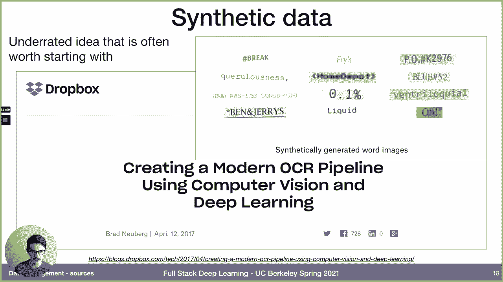

and then they use that for their kind of，processing documents that people store，in dropbox，[Music]。

and the synthetic data can actually get，pretty deep，so this is a project i found from andrew。

moffett on training ocr，on receipt images and the receipts are，actually rendered。

in some 3d engine like unreal engine or，something，and so it's actually a full you know 3d。

deformation，of the surface because people's receipts，are often crinkly。

you can simulate lighting conditions，like crazy shadows，so you know all the。

images on the right are are，synthetically，generated and yet you still have perfect。

ground truth data right because you know，exactly，how the deformation was done and so you。

know exactly what the label still is for，every single pixel in the image，[Music]。

and for driving and robotics this is i，think，more or less table stakes and uh is。

often called sim to real and it's。

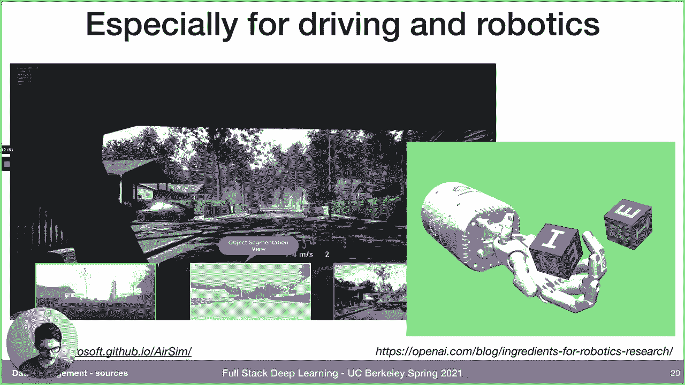

actually something that，josh tobin worked on if you want to chat。

with them about it so next up let's talk，about，blocks，file system object storage databases。

data lake slash data warehouses，what should go where and then how we can，learn more。

so the file system is really the，foundational layer of of storing，data and the unit。

that we like to think of is a file right，which can be a text file or a binary，file。

is not versioned there's no version，that's，done through the file system can be。

easily overridden or deleted，and this can really be just you plugging，in a hard drive。

and you know formatting and putting the，files you need on it，could be networked like the nfs。

system so the the same hard drive can be，accessed，from different machines can be，distributed。

like the hadoop file system stored and，you know accessed from multiple machines。

and actually stored over multiple，machines also，and the file system in general right is，to。

when it comes to storage，[Music]，and in fact it's really really fast now。

so on the here's two plots there's three，rows the sata hard drive sata ssd。

solid state drive and then the nf，nvme ssd which is the newest technology。

and on the left we see throughput so，that's like if you were to copy a file。

at what speed would actually be copied，and，the hard drive is the slowest right。

that's the actual spinning platter，like magnetic hard drives with a read，head and stuff like that。

so there's they're limited by the rate，at which the magnetic disc can spin。

and it's pretty slow right it's like 200，that，or it's megabytes per second and then。

the ssd drives are faster much much，better technology but it's pushing maybe，500，latest。

iteration of hard drive technology the，nvme，is much much faster right so it's。

pushing three gigabytes per second，and same with seek time so that's how。

long would it take you to find，to to to go to a file on disk，that you're not currently at and this。

makes sense when you think of like a，head reading a magnetic，disk right it actually has to seep to。

the location on disk，that contains the start of that file，it's very slow right it's like two。

milliseconds，slow，much faster on ssds and much much faster，what format should we store data in so。

for binary data like images，audio videos stuff like that，just files is usually what you would do。

so image files in a folder in many，folders，in tensorflow you have this tf record。

format which exists to in order to batch，binary files，so instead of let's say a million。

individual image files you would have，a thousand or maybe a hundred batch。

files and then each batch file contains，you know nicely formatted individual，files。

that makes sense if you're seeking with，you know，the the old school hard drives。

it doesn't seem that necessary with with，the latest really fast nvme drives。

for large as in like big data，you know tabular data or text data。

there's some choices so you could have，them as also just files and that's，perfectly fine。

just a bunch of text files but if you，have loaded files from different sources。

and you've loaded them into a data frame，and you want to store that。

so that next time you start in the，project you can kind of start from。

not from scratch but from some interim，format you have some choices you have，hdf5。

which is powerful but it's very bloated，in terms of its feature set，it's like hard it basically。

re-implements a file system in a lot of，ways，and it doesn't seem to be an active，development anymore。

meanwhile uh parquet is a widespread，format it comes from the hadoop and kind，of spark。

you know big data world and it's what i，would recommend right now for storing，this kind of data。

and then feather is the most recent，good option it's powered by an open。

source project called apache arrow，and it's kind of up and coming it's。

getting better you know every year very，active development，and apache aero aims to be。

basically like the interchange format，for data analytics，so it's a columnar data store that's。

memory mapped for really fast，operations on it even for data that，provide。

their own data set interfaces like data，loader for pytorch and，know。

try to use them as much as you can，because that's kind of like the。

officially sanctioned way to load data，and，i think the further you stray from that。

the likelier it is that you'll encounter，some cases where it's like。

next up from the file system is we have，object storage and so you can think of，this as an api。

over the file system so so amazon s3 is，the canonical example。

right we can get files we can put files，we can delete files，and we can think of these operations as。

basically rest，api calls and we don't actually worry，about，what physical disk the files are on we。

just know that，you know the file's on s3 i'll be able，to get it。

i'll be able to store it and the object，can be a text file it can be a binary，file。

and oftentimes it is a binary file，and the interesting thing about this is。

that you can build in versioning，and redundancy into the api right，so as you store a file。

the backend can just increment some，version number so instead of overwriting，your old file。

it can just store a v2 of that file，and it's definitely not as fast as just，reading files from local。

from some local drive but it's fast，enough，especially within the cloud right so if。

you're on the cloud，compute instance and you're accessing，files on s3，that's tends to be pretty fast。

and in fact this is a slide from i，believe databricks，recommending that people store。

your log files or whatever files they're，analyzing in，in the databricks environment on s3，versus。

configuring their own hdfs file system，to do it，and the reasons they give are s3s。

elastic right you can store like any，number of files on it，it's pretty cheap it's very highly。

available，it's like incredibly durable right it，doesn't lose data。

it can even have transactional rights，and so it's，quite nice the database。

is a word we use to refer to persistent，fast and scalable storage and retrieval。

of structured data that will be accessed，repeatedly，so what that means is so for example，logs。

are structured data because it's like，time stamp you know page uh that was，visited。

the rest verb like get or put，or whatever it's so structured data。

but it's not expected to be accessed，repeatedly it's it's a log。

right you store it just in case you need，it，but most of the time you don't need it，whereas。

in the database you wouldn't store logs，you would store things like，the username of of your user。

or the label of this image right stuff，that you expect that might change and。

you might need to look at repeatedly，so oltp is a term you might have heard。

online transaction processing so this，refers to，the kind of database we're talking about。

the mental model to have，is that the reason it's really fast is，because everything is。

actually just held in memory so there's，a running machine，with all the data in its memory，it。

has guarantees that it will persist to，disk and，it won't get lost and there's。

consistency guarantees like，it won't let two conflicting rights，through and so on。

but the reason is really fast is because，it's actually not，on like it's not seeking from disk most。

the time it's just in ram，and this is not for binary data right。

you should store references to binary，data in the database，so you store the url of something in s3。

and then you store the actual binary，image，in s3 postgres is the database that we，recommend。

most the time the reason for that is，it's a great sql database and it also，supports。

unstructured json and sqlite，is perfectly good for small projects and，it's in fact used by a lot of。

things you might have used like mobile，apps and stuff like that have a cq light。

back-end running you might have heard，nosql，and that was kind of a big thing in，2010s。

stuff like and there's a bunch of，them，and this mostly refers to storing。

unstructured json right so instead of，having a schema for your data a schema，being something like。

id is going to be an integer field name，is going to be a string field。

you know created that is going to be a，date stamp，and so on the nosql approach。

is to not have a schema but just，whatever you want to store，we'll just make a json document with。

that data and then just store it into，the no sql database，and then we'll be able to fetch it and。

it obviously isn't going to be as fast，at fetching data or analyzing data，it's。

obviously also might have some，consistency issues where like two，separate rights might go through。

that actually conflict with the，interpretation of the state of the world，is really。

very useful when you just need a simple，key value store so for a lot of projects。

you don't need a database，you just need like a persistent，dictionary and so redis is great。

there's the notion of a data warehouse，which is，some kind of aggregation of different，data sources。

structured in a single place for，analysis，also known as olap online analytical。

processing instead of oltp，online transaction processing right。

and another acronym you might have heard，is etl so that stands for extract，transform load。

and so the idea is you have all these，different data sources like，maybe logs in the cloud your。

transactional processing database，which is maybe postgres then maybe you。

just have a bunch of like flat text，files or something，and you're going to extract data from。

all of them transform it into some，common schema，and then load it up into the data。

warehouse and then from the warehouse，you can then have load the subset of，data you need。

and generate reports run kind of，analytical queries，the software for this stuff like。

bigquery from google，redshift from amazon snowflake，[Music]，and most of these solutions use sql as。

the interface to the data，so sql obviously is a very old language。

and and and some solutions like for，example data bricks，use data frames instead of sql so sql is。

the standard interface，for structured data，but in python，pandas is the main data frame solution。

and is usually what people reach for，when they need to kind of analyze，data using python。

so here on the right is a comparison，between sql，and data frame so let's say。

you want to select you know three，columns from some，data table called tips so you want to。

select total bill，tip smoker and time from tips，and then the first five results so you。

say select total build tip smoke，time from tips limit five that's what，sql looks like。

but with a data frame language like，pandas you have tips as an object。

and you select columns total build tip，smoker time，and then you say you know head five give。

me the first five results，and of course this gets more interesting。

when you start joining different data，sources，so grouping by different columns，counting。

aggregating things and so sql，like you know i prefer the data frame。

language in the first example where，we're just selecting columns，but i prefer sql actually in the。

second example where you now have to do，some analytical，grouping and stuff like that so if。

you've never used，sql and if you've never used，pandas our advice is to try to use both。

you know try to find a project，that gives you a chance to use sql try。

to find a project that gives you a，chance to use pandas，because to be a good data engineer data。

scientist or machine learning engineer，or even machine learning scientist i，think at some places。

you should really be fluent in sql，data lake is the idea that，kind of came out of the data warehouse。

and the idea is that，well we have all these sources like，databases logs。

and stuff like that and and the data，warehouse approach is we have to。

settle on a schema transform all these，data sources into that schema and then，store them。

but what if instead we did extract，load and then transform so we'll extract。

data from all these sources，load it into the data lake and then。

later we'll transform it into the format，we need for analysis，so let's just dump everything in um。

kind of into this lake and then later，we'll be able to，settle under transform of the raw data。

in the lake，and maybe load it into a data warehouse，or maybe just load into something that。

and the trend in the field is to kind of，do both，in the same suite so the data bricks。

lake house platform is both a warehouse，and a data lake and it's an open source。

project called delta lake which is quite，nice，where you can store all data structured，data。

semi-structured data like maybe logs and，then unstructured data like just like a。

bunch of text files that you crawled，from the internet，or even images right or even videos。

you store all of it in delta lake and，then later，your analytics engines and potentially。

even to machine learning engines so，that's kind of the data bricks vision。

and the vision of the field as a whole，so that was a lot but for now just think，about it this way。

if you have to store data if it's binary，data like an image，then store it as an object right to。

store it in s3，if it's metadata about that data right，if it's data about that binary data like。

a label，for an image or some user activity like，who uploaded this file and stuff like，that。

that goes into the transactional，database，if you need features from something。

which is not already in the database so，for example logs like how many times did。

a user log in and like look at this，image，then set up a data lake and dump，process。

to aggregate all the data，and then when you're ready to actually。

train using deep learning on that data，then copy everything you need onto the。

local file system you know next to the，gpu，on a drive that's as fast as you can，manage and that's。

there's a lot to this story this is kind，think，all of the field is really in flux right。

now and there's，no different on the data side as it is，on the training and evaluation side。

so there's a lot going on the reading，for this week is this article from。

from this vc about the emerging，architecture for data infrastructure and。

if you're truly interested in this stuff，then you know take some more courses。

like databases and you can also look at，this book called designing data，intensive applications。

so this is a really good book and a，common resource，for this kind of stuff so we've been。

alluding to like，some you know motivation so let's just，actually make it concrete。

so let's say we have to train a photo，popularity predictor every night。

because we're operating some website，that that would be useful for，so for each photo training data。

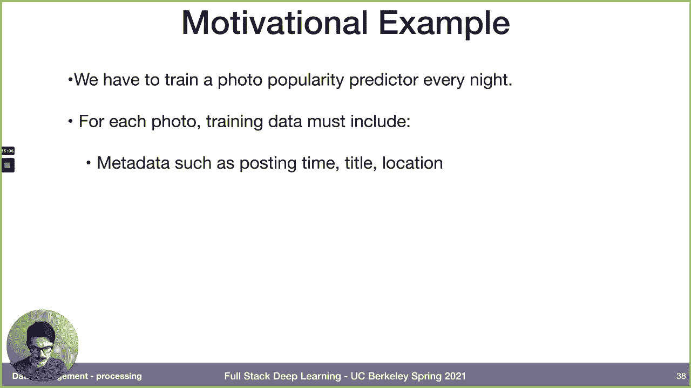

should have like when was it posted that，what title was it given。

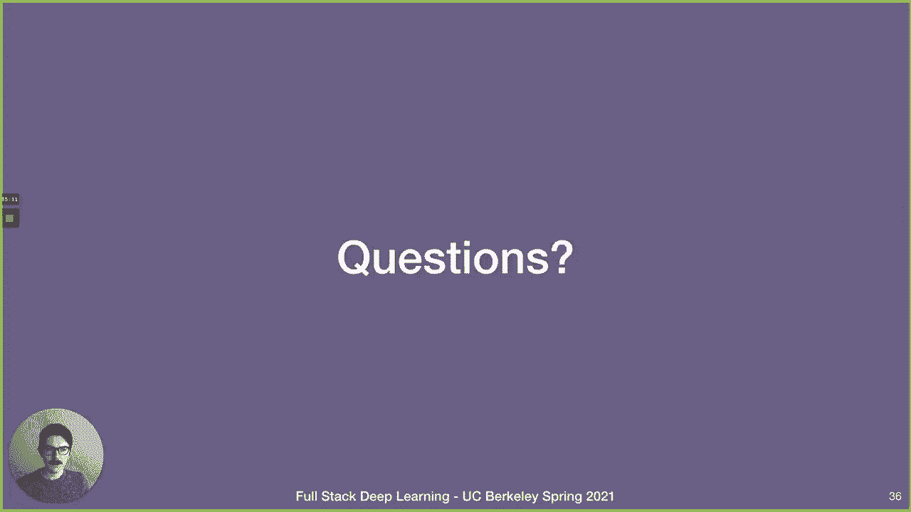

where was it posted from then maybe，oops then maybe something about the user。

that maybe is like how many times did，they log in today，right and then we actually have some。

machine learning models，that can identify what's in the image to，some extent。

so like what's the content of the image，and then maybe what's the style of the，image like。

is it happy or sad and stuff like that，so the metadata is going to be in our，database。

some of the features about the user we，probably actually need to compute from。

logs because they're not in our database，and then to see what's in the image。

we need to actually run some classifiers，classifier models，so there's a number of tasks that all。

have to finish before we can train，our model that will actually predict the。

and you know some tasks can be started，until other tasks are finished so like。

we can't start training the popularity，predictor until we've，finished running all the content style。

models，and also until we finished running our，log analysis stuff，and so on and um。

when a task finishes it should like kick，off things that depend on it right，because。

we don't want to have to keep managing，this process we just want to launch it。

and like recomputing something should，depend on the content of it。

not on some other stuff like the date，ideally，the dependencies we're talking about。

might not be you know simple files but，it could be the outputs of programs or。

like something in the database the work，that we're doing，is probably not only on one machine but。

it's over many different，machines and then we're not the only，ones you know training our predictor。

maybe other people are training，different things at the same time as，we're training hours。

so multiple things are happening all at，once，and the old kind of big data you know，flavor。

solutions to this are hadoop and，reduce，implementations where you have to，process in a bunch of。

data so you launch a bunch of different，tasks that each take a bit of the data。

and then that's mapping and then reduce，it you reduce，their outputs into a single output and。

and it should run on on commodity，hardware or like，this diverse hardware and there's like。

things you can do，about caching that really speed it up，that's kind of like what put spark on。

the map，that's a little bit outdated because it，assumes this like。

monumental or i guess monolithic you，know processing，environment and in the modern，environment。

like you can't for example run a machine，learning model，as part of running a spark job right。

unless that model itself is coded in，spark，or however that's done but if you just，have some like。

you know a pi torch model and then a，tensorflow model for something else。

and then you need to analyze logs for，something else it's all very different。

so the more modern things uh probably，begin with，and it lets you define a dag a direct。

direct the cyclical graph of jobs，where the jobs can be maybe sql。

operator operations or maybe actually，just python，program executions right or maybe just。

simple files，but it lets you define a dag out of like，disparate things。

and then run it and in order to run it，you need，a a manager the workflow manager this is。

often called，this is often called workflow processing，so the workflow manager has a cue of all。

the tasks that have to be done，they know about the dependencies between。

the tasks they know the workers that are，able to do the tasks and then they，manage tasks。

they assign tasks onto workers if things，fail they'll restart them。

apache beam is like one of these things，and tensorflow，data sets which so tensorflow。

the tensorflow team makes a lot of，different data sets available，through this tensorflow datasets。

interface and，they seem to use apache beam for this，kind of processing。

and it runs on google cloud data flow，which is，you know a cloud orchestrator。

so for example the t5 model the，transformer model that we discussed a，few weeks ago。

that was trained on something called the，colossal clean corpus which is like a，web crawl corpus。

that's seven terabytes in size，and before you can actually train on it，you need to process。

the raw you know crawl output into some，trainable form，i'm not totally sure why they didn't do。

that for us but they gave us the raw，form，and then you know gave us like scripts，to be able to。

process it and i think it requires you，know hundreds of workers，and still like 20 hours or so to to。

process，prefect is something that people use，instead of airflow increasingly。

same idea though it's a python framework，that makes it easier to like define，tasks。

the tasks can be code or like sql and，stuff like that，and then the prefect hosted solution。

will then orchestrate it for you so you，don't need to worry about like launching。

your own orchestrator，you just define the tasks push them over，to prefect。

and then prefect tells your own hardware，right what to。

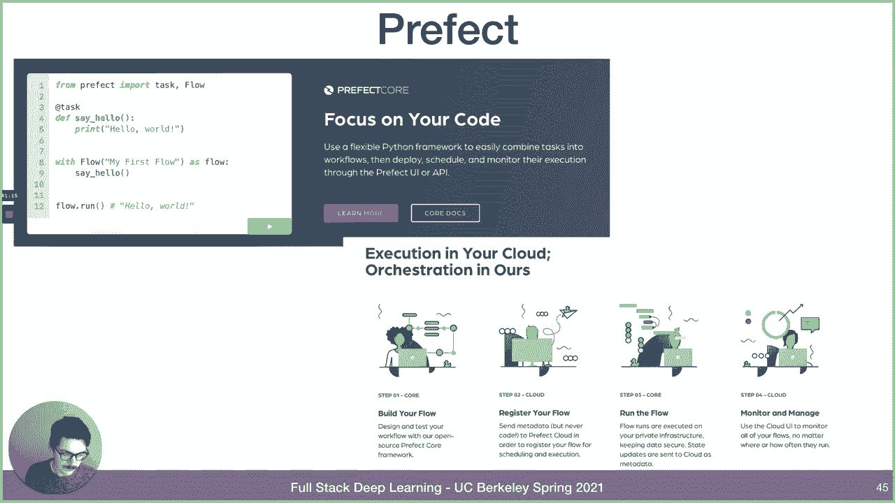

actually run on or what to what tasks to，actually execute，dbt is。

the ability to do stuff like this with，sql，right so instead of writing python code。

for a lot of this processing，could it could it be done if you just。

wrote sql so this is for people who are，comfortable with sql which a lot of data。

scientists often are，for data engineers this is kind of a，nice，solution so they call it analytics。

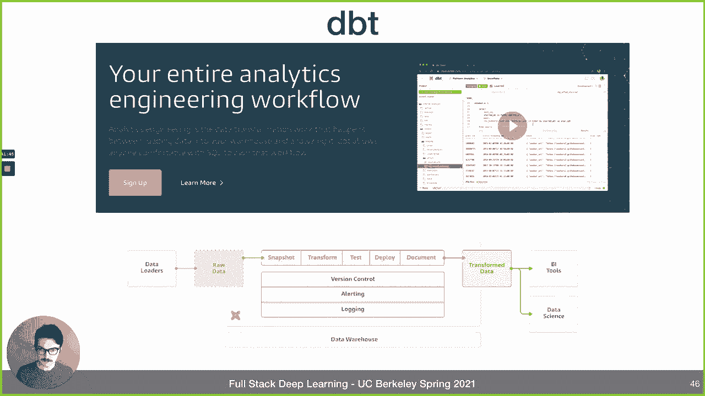

engineering，it's quite a nice idea daxter，is another data orchestrator that seems。

to be quite popular nowadays，works with a lot of tools test locally。

okay and then lastly we're going to jump，over into the deployment side。

and talk about this idea called the。

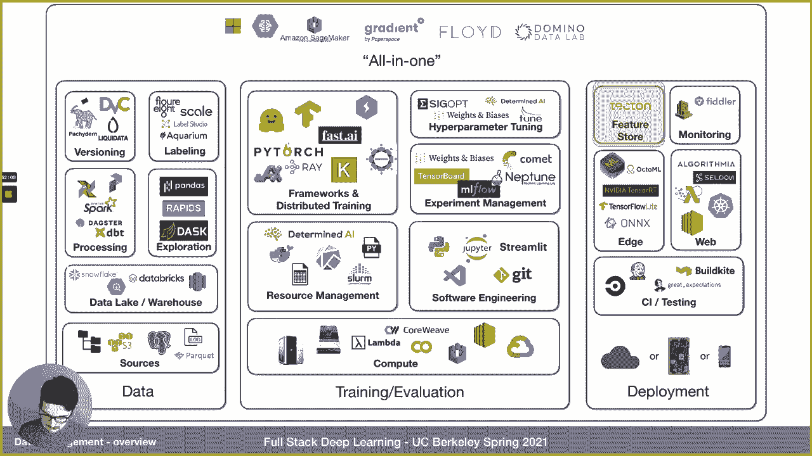

feature store，and so the idea of the feature store was，first popularized。

to my knowledge by uber when they，publicized their，their uh machine learning platform。

called michelangelo，of，you know some of what it has to do and，so it's divided into two。

two halves on top we have the online，processing，and on the bottom we have offline。

processing and so the idea there，is that to train your model，right is an offline task。

so we're going to take data from our，data lake，so this is uber so let's say we're。

trying to predict we're trying to train，a model，that will predict how to price a ride。

you know given a bunch of historical，data about，demand and ride lengths and the。

availability of drivers and so on，so all that stuff is in our data lake。

and that comes from a number of，databases and log files and and god。

knows what but it ended up in the data，lake right，so we're going to prep the data using。

maybe spark or sql and load it up，into the feature store，which is based on hive and then that。

feature store，can be used to give training data to，our training algorithm right and from。

that we'll put a model，in the model repo and then lastly when，the when the model is ready。

now we can actually deploy it in the，prediction service but in the prediction，service。

the data that's coming in for the model，to predict on，is not coming from the same flow right。

it's not coming from a data lake it's，not going through spark，it's not landing in hive it's actually。

going through a separate flow，which in this case is the kafka。

streaming streaming engine and goes into，the cassandra which is a different type。

of database feature store，and then from that to the trained model。

and the reason this is highlighted is，because this can lead to a lot of bugs。

right because these are two different，data processing pipelines，one is offline one is online but。

if we can unify as much of their logic，as possible，into this unified kind of feature store，then。

that would be much better right like we，don't have two separate code bases we。

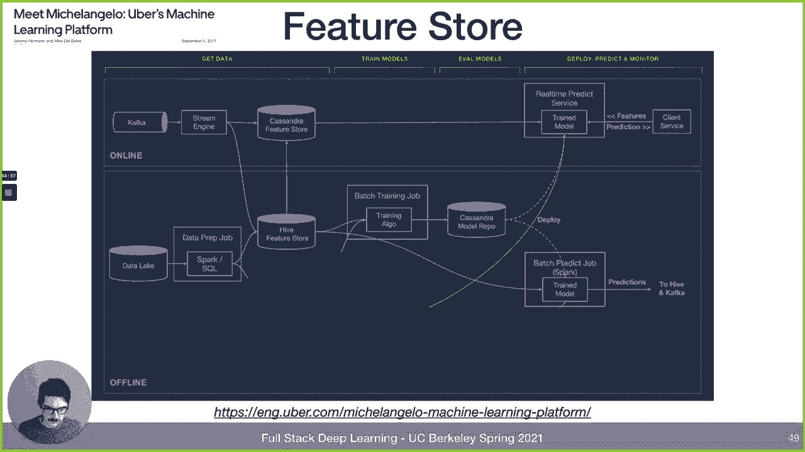

don't have two separate sources of bugs，and so on so a bunch of people from uber。

i believe started this company called，tecton which is the main。

feature store company and they give you，another little visualization right so。

you have real-time data and batch data。

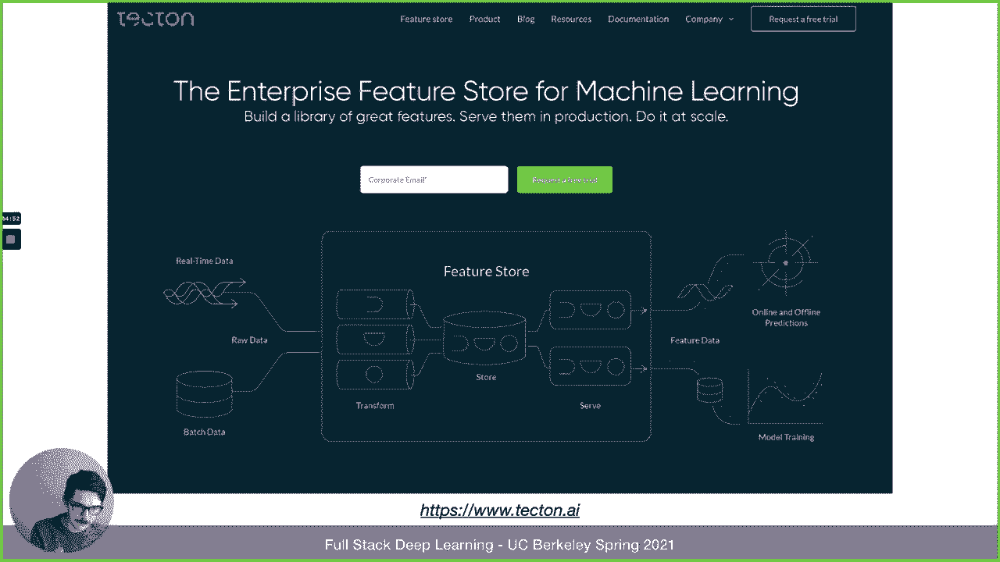

all going through the same transform，store and serve process，from the feature store for an open。

source alternative，take a look at feast，which you know implements the same type。

okay lastly as we talk about all this，stuff and i just mentioned hive and。

cassandra and all that stuff，i think the tendency is like it's。

overwhelming like there's too much stuff，and i think that's true and some of it，is over engineered。

so let's try to keep things simple and，and try not to over，engineer until you really know why you。

need to and as like a motivational，example，like not a serious you know do this。

example but as a motivational example，let's just take a look at the the tools。

that like every unix installation comes，with，okay so there's a blog post that was，pretty famous。

at the time called command line tools，can be 235 times faster than your hadoop，cluster。

hadoop was like the spark of its day in，2014。so the task was to analyze a bunch of i，think log files。

for the presence of some word and then，yeah just count up the number of times，this word appeared。

in like terra and like gigabytes or，maybe even terabytes of data，and it took 26 minutes on a hadoop。

installation，and with simple unix tools，like cat and grep and sword and like。

unique it took 70 seconds，so you just like in this case you catted，all the files。

pipe them over to the grab command pipe，the results of that over to sort。

pipe that to unique now what's，interesting about，about that that you might not realize is。

that all these pipes，are actually happening in parallel so，it's not the case。

that all of the cat command has to，finish，and then all the results are aggregated。

somewhere and then all of the results，are sent over to grep，it's not the case right as cat streams。

its results，they get straight into grep and grep，starts executing。

at the same time as cat is executing and，then as grep results come out。

they get into sort and that starts，executing so these are actually，happening。

like the os manages you know parallelism，here for us，and we can actually make it even faster。

by running it even more in parallel and，and kind of instead of using crep using。

awk which is i guess even more efficient，for this particular thing。

but x-args is another built-in unix，command that just has built-in，parallelism。

so if you need to do something a，thousand times and it's actually。

distributed over like a thousand cpu，cores，you can just say dash p 1000 and just，launch a thousand。

of this process with like no extra，complexity，so it's always worth looking at the。

tools you already have and just seeing，you know how you can make them work for，the task instead of。

it's like oh i heard about cassandra you，know for this thing i must that。

that must mean i have to use it right so，let me go download and figure it out。

but usually that's not the right，simple，let's talk about exploration so i hope。

you guys have all seen pandas，right it's really the workhorse of，python data science。

if you have not used it then definitely，recommend doing a few projects。

using pandas because it really is，the data science you know tool of choice。

and r has its own data frame，you know spark and and uh scala you know，they have their own data frame。

but the basic idea is that it's like an，object-oriented，data analysis interface，[Music]。

so i don't talk much about that because，i assume that most people know it。

so i just wanted to share a couple of，things that you may not know about。

so dasc for example is a project that，could speed up your pandas processing。

pretty dramatically if you're trying to，process，uh data that's too large to fit in your，memory。

right dask，is often a drop-in replacement so they，have their own data frame implementation。

that matches panda's interface but，parallelizes it you know paralyzes all，the operations。

such that you can actually load very，large amounts of data，and analyze them similarly。

a project called rapids has the same，approach except，scaling out data analysis specifically。

onto gpus，right so pandas is not gpu accelerated，but，the this rapids project aims to。

be basically a pandas replacement that，can，do data analytics on gpu which would be，much much faster。

so it's worth taking a look at i haven't，so next time next up let's talk about，data labeling。

we'll talk about user interfaces for it。

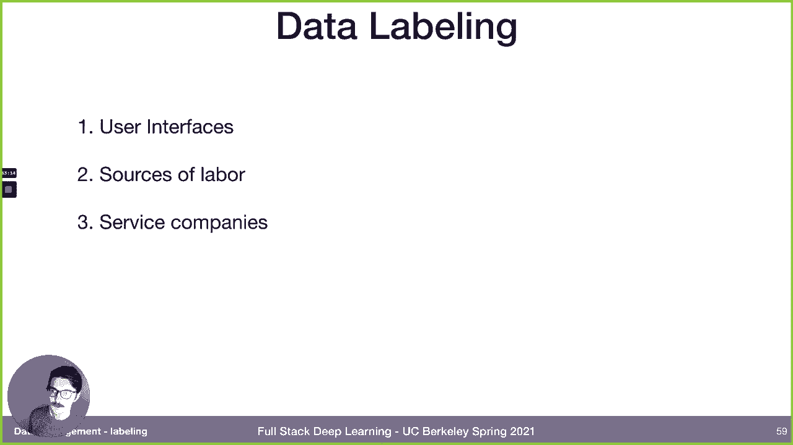

sources of labor，and kind of service companies，so there's a standard set of features。

for data labeling，you know you have bounding boxes，segmentations。

key points you know cuboids for like 3d，annotation，there's some some classes that you can。

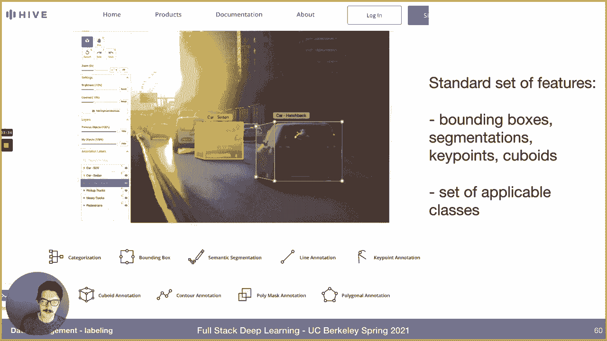

what's crucial is agreeing on what makes，a good annotation，so you know training the annotators is a。

large part of，of of doing an annotation project，so for example here's a motivational。

example i believe from cs231n，where you know reasonable people can can，disagree about。

exactly how to label the fox in，the first row like do we draw a little。

bit of space around the fox or do we，focus on，the face of the fox and certainly in the，second row。

where like your human mind naturally，just imagines the rest of the fox behind，the rock。

and you might annotate it that way and，it，or not depending on what kind of project。

you're actually doing and so it's worth，really annotating a lot of your own data，yourself first。

and writing up detailed guidelines with，edge cases like this，such that your annotations come out。

reliable，quality assurance of the annotations is，also key，people just aren't you know as。

conscientious across the board like some，will，have better annotation quality than。

other and where do you find people to，actually annotate，so the choices are you could hire your。

own annotators，and maybe promote like the most，conscientious ones to。

quality control the other people，so this is very secure right because you。

can have them sign whatever you need，once you hire them they can work you。

know 40 hours a week so it's pretty fast，and because they keep working on the。

same task you know less quality control，is needed，there's，overhead to to the administration you。

could crowdsource，labor so this is a mechanical turk，amazon mechanical turf。

where like people just all over the，world go on online and do little tasks。

for cheap and it is a lot cheaper and，it's more scalable because you can find。

like a thousand people to do your task，but you know it's not secure really and，then the。

quality isn't very high partially，because it's so cheap，so it makes a lot of sense to hire a。

data labeling company for a large，annotation project，because it really is like a separate。

software stack to what，we're using for training right it，requires temporary labor。

it requires quality assurance so，how do you find one to hire still have，to you know label。

a bunch of data yourself as like the，gold standard and just so that you。

understand and are able to write good，guidelines，then you know try different contenders。

try to get a work sample on your gold，standard sample，and compare it to how compare how they。

did to how you did，and then try to see you know what's the，price to。

quality ratio figure 8 is like the，probably the largest data labeling，company。

founded by the same people who found，that weights and biases funny enough，scale。ai is the。

really dominant you know new company，that does data labeling。

and they're sponsoring some prizes right，for the class，and there's a lot of others there's a。

crowded space there's label box，supervisedly there's a bunch more，right and。

full service data labeling you know is，always pretty，pricey and so maybe it's not exactly。

what you want but you still want to use，purpose-built software for annotation so。

there's there's choices，in the market for just the software，without the labor that comes with it。

and there's actually a free option，that's really good called label studio。

which is a open source you can run it，yourself，there is an enterprise edition for，hosting。

and it's actually what we're going to do，in lab is use label studio。

so you can define your own labeling，interface using this，config format which looks a lot like。

html code，and then you get the interface and you，can start labeling and it's very。

flexible like you can mix different，types of things，you can also implement different modules。

like you can there's a back-end module，that serves up data there's a front-end，module。

which we we you can define the interface，but it's also a machine learning。

module that for example can you know you，can do active learning。

so you might have a model running and，maybe pre-annotating，some of the examples so that what the。

human annotator sees is not just a blank，image but actually is already kind of。

annotated by a machine learning model。

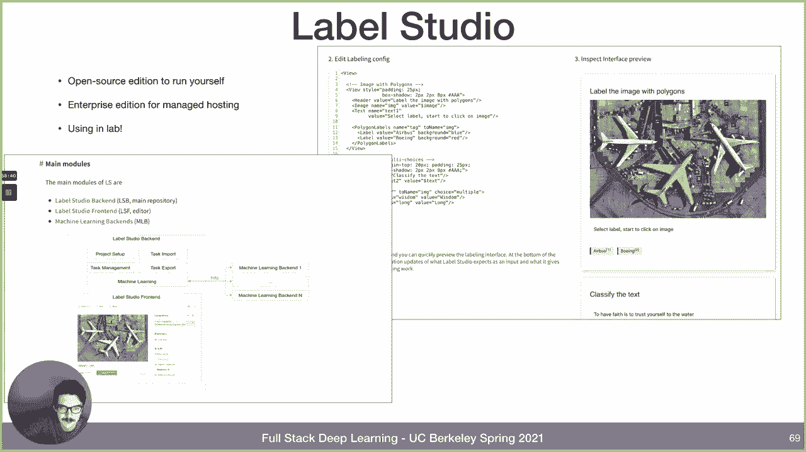

and then they just correct it if need be，[Music]，and there's an interface for looking at，of the。

task here is just get into grips with，like all your all of your data。

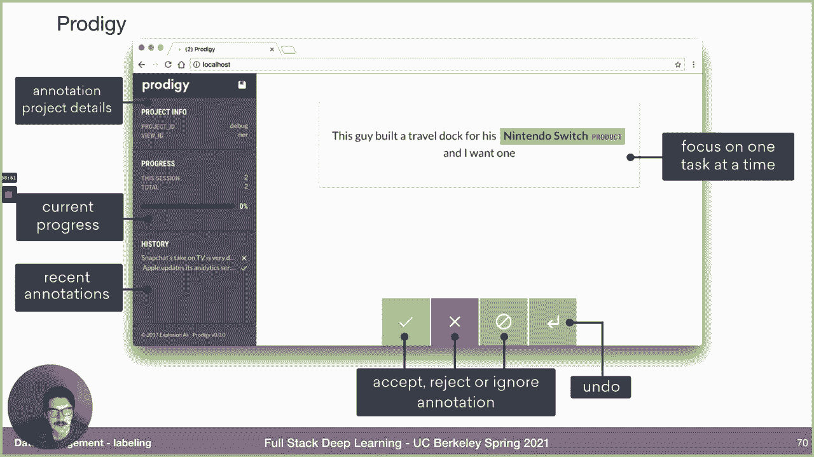

and aquarium is a recent company that，was founded，by a berkeley alum and it's they they。

build it as a machine learning data，management platform，so the idea is that really exploring。

your data set，is a big part of the task and so it's a，good tool for that。

and they call it kind of curating data，and then when you，find things that are difficult or。

mislabeled，plug，the data management tool into your，machine learning。

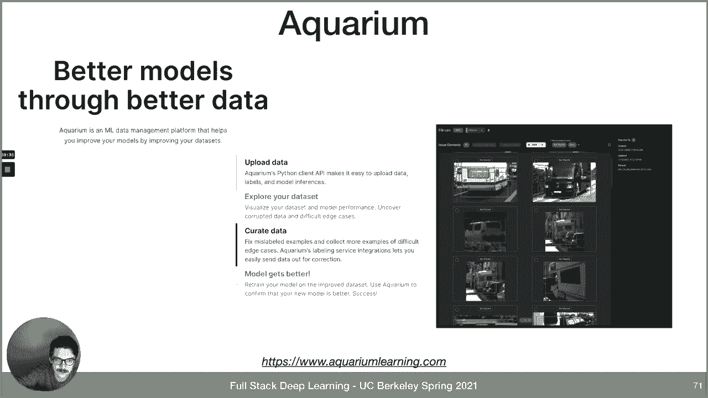

workflow cycle another really，interesting，vein of work here is in what's called，weak supervision。

and snorkel the snorkel project，is the is the dominant tool here it。

started out as an open source project，and you know there's still a version。

that's open source but recently it also，became a commercial platform，snorkel。ai the idea is that。

we can label a bunch of data somewhat，automatically，with heuristic functions so for example。

let's say you know you have a bunch of，reviews or something，of restaurants right and you want to。

train a classifier，of sentiment and，there's certain words that you can just。

kind of you know regex for，and if you find them it's probably a，good review like amazing and like。

awesome，you know food is awesome stuff like that，so you can think of all these heuristics。

and write a python function that just，says like if you know there's text。

food is awesome then it's a positive，review，and then via snorkel you can run that。

which will label a lot of your data，automatically，but give you like really powerful tools。

to uh correct that，and then it kind of tries to learn a，model side by side with your heuristics。

and the end result is that you're able，to go through a lot of data。

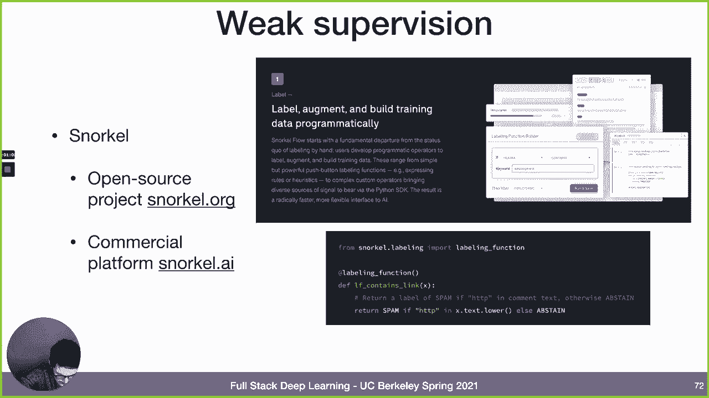

and focus on edge cases very quickly，instead of just going through in random，order。

the conclusions that we have are you，know if you can afford it just。

try not to spend time on labeling and，just outsource if you can to a full，service company。

if you can't afford that then at least，try to use some existing software。

and if you're hiring then don't try to，make crowdsourcing work just try to hire。

some part-time people on upwork or，something so lastly let's talk about，through。

so the the zeroth level right，is that your data just lives on the file，system or an s3。

and in like a database and so you train，on it，you have a model you deploy the model。

what's the problem，right well the problem is that your，deployment，really has to be versioned because。

you have to be able to like revert it，for example and，your code is versioned because。

that's good practice like a software，engineer we just know that we have the，version code。

but your machine learning model is，partly code but it's partly data。

and so if your code is version but your，model，is actually not versioned also and you。

won't be able to get back，to some previous level of performance，because。

you just keep overwriting your model and，you don't know what it's actually，trained on。

so the first level you might think is，well okay fine let's just snapshot，everything。

you know all the data that we're，training on just snapshot it archive it。

and that's the version and it actually，would work it can't get you back to past。

performance if you need to，it feels very hacky right because you，know it's。

that's what people used to do to code，actually before version control was，widespread。

right it's every release you would just，zip up all of your code。

you know store it somewhere just in case，there's a bug in the new release you'd。

be able to go back and try to figure it，out，and so it would be a lot better if we。

could version data just as easily as we，conversion code，so that would be level two right let's。

version data，as a mix of assets and code，so let's store files that are。

large in s3 in s3 they get a unique id，and then，as part of your code repository。

you could store let's say a json file，that points to these ids，and then maybe has some metadata like。

the label of of the image，so you don't have to store the image in，the repo you just store。

the metadata about it this metadata can，still get quite large，but we could actually just store it in。

our git repository，using git lfs which stands for large，file storage。

natively supported by github and i，believe in gitlab the major git。

hosts so if you just you know install，git lfs and you just track let's say，json files。

in git lfs then automatically as you，commit，the the the json files will get uploaded。

to s3 behind the scenes，they'll be automatically versioned and。

you don't have to think or do anything，different，other than what you're doing already。

this this totally works because the git，data set，right it fully defines the version of。

the data set so，let's try to go above that though，maybe our json file is just a terabyte。

big now so we can't actually，store it anymore so there are，specialized solutions for versioning，data。

i think we should avoid them until until，we can fully explain。

how on this specific project they would，improve things over get lfs。

and those solutions are dvc pachyderm，and quill，here's a helpful little diagram of some。

of these delta lake is actually worth，looking at also for this，but dvc is worth。

looking at a little more detail so it's，open source version control system for。

machine learning project，you，dvc add it just like you get at a code，file you dvc add。

a data file and then，when you process the data you say dvc，run and then the script that would。

process the data，and then the output name of the，processed file。

and so what that lets you do is that the，dvc，file，or you know processed。

or interim data file or even model that，came out of training，automatically for you right so it knows。

like，what what raw data files was this，particular model trained on，and it's able to recreate things。

intelligently it seems like a good，solution。

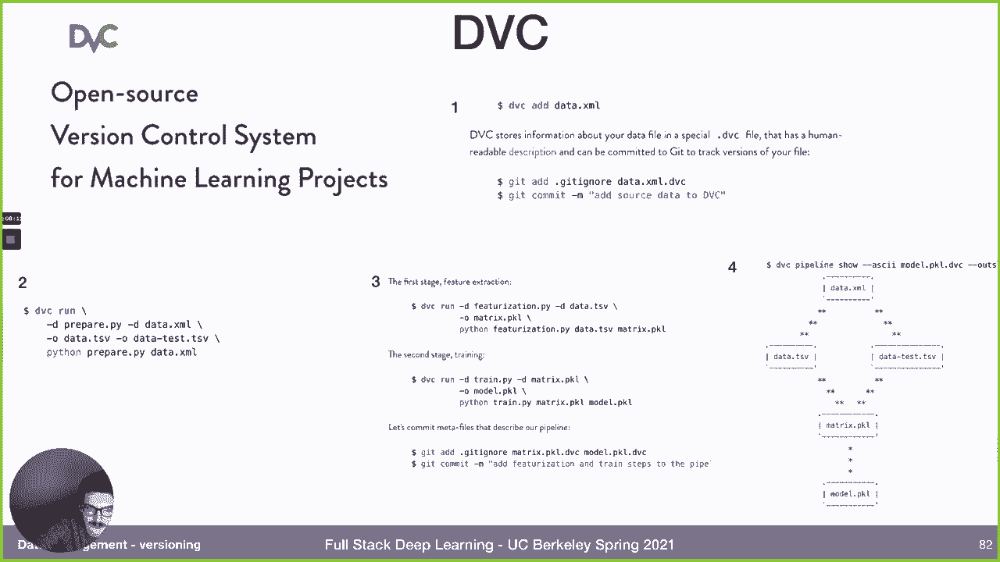

it says so definitely check it out if if，you have that need，if you have the need for versioning。

databases，then there's a project called dolt which，is quite interesting。

and so it's basically a git for for sql，so it makes it makes，it so one thing that git makes easy is。

merging right so like，two different people can be working on，the same file。

in parallel and then if they if there's，some kind of conflict。

they'll both try to commit and then when，one of them，you know one of them will have to。

resolve it and then git makes resolving，a conflict really easy。

and so similarly don't makes resolving，database conflicts really easy。

but it also has like a full sql。

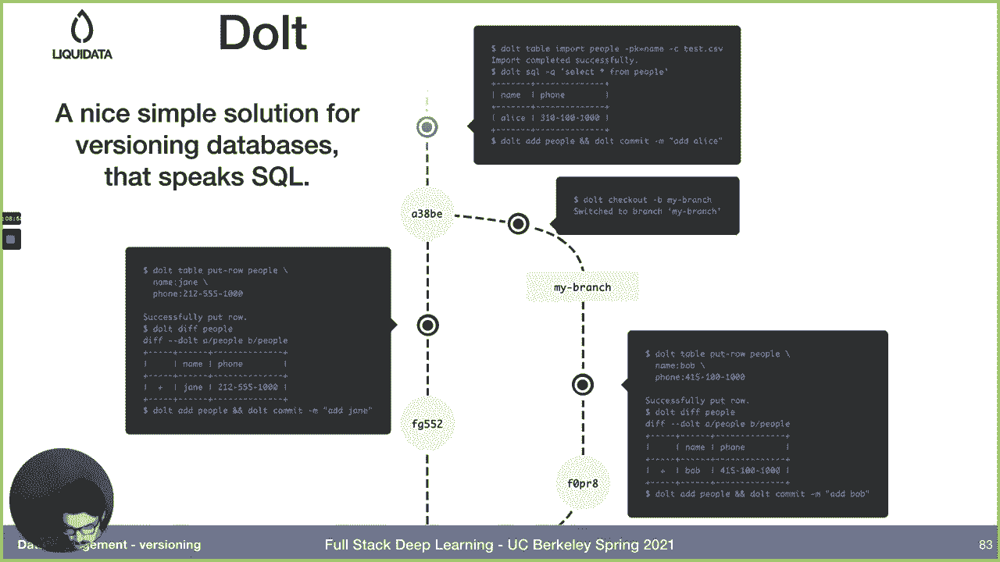

implementation so that，lets you kind of explore your data so，last thing i want to talk about。

is concerns about privacy，so like everything we've talked about so。

far kind of assume that we have access，to，you know unfettered access to the data。

and we can train on all of it，but a trend，is that people and companies don't。

necessarily want to share，data as freely as they used to and this，is particularly important。

in in some settings even today like，healthcare and i think will be more，important。

in a lot more settings in the future but，in healthcare for example。

you have very sensitive you know patient，data that，hospitals don't want to spend to some，third party。

for training the model on so federated，learning is this idea that you can train。

a global model using data that's on，local devices，and and the global model never actually。

has access to，all of the data so there's some amount，of，training that happens on the local。

device and then things are synced to the，this，that have to be solved and that's why。

it's a area of research right now like，you know it's expensive to send all。

these things back and forth the，different systems that the model has to。

be trained on now are very heterogeneous，and there's still some privacy concerns。

like are you actually able to，de-anonymize certain things just from，the model weights。

right so like yeah you never saw the，data but can you still get。

something about the data from just the，model weights that are sent to the，federated server。

similarly a research area called，sometimes called differential privacy，like，aggregated。

in such ways that you can't identify，individual sources of the data，[Music]。

and another topic that's interesting is，maybe learning on encrypted data。

so could the data be encrypted at the，source and then stand for training。

and and you can actually train but you，can't decrypt it，these three things are are i would say。

research areas right now i'm not aware，of like really good tools。

that make it possible to do these things，but it's just something to you know keep，in mind and maybe。

and maybe you're interested and for。

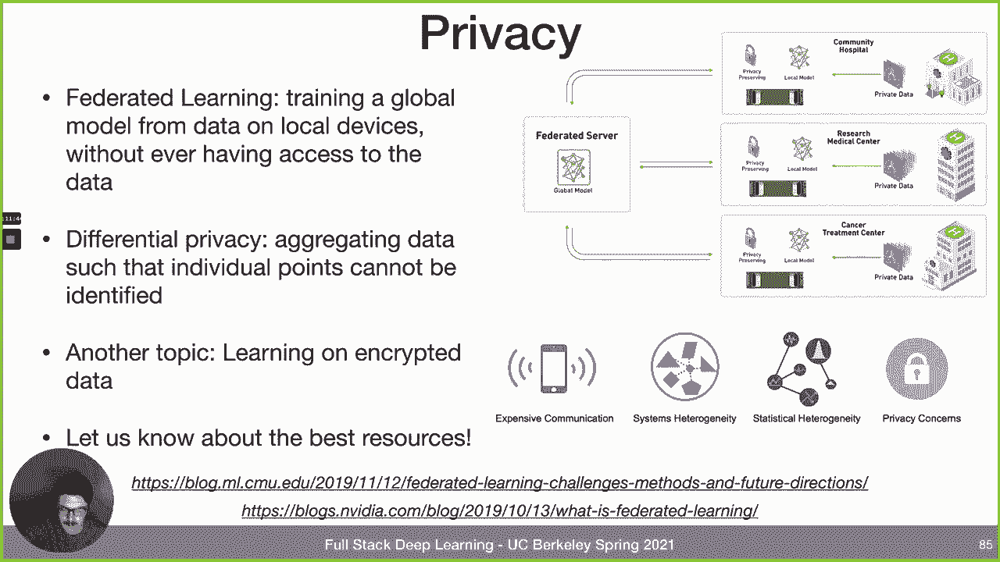

and if you know if you know really good，resources about it then just let us know。

and slack about them。

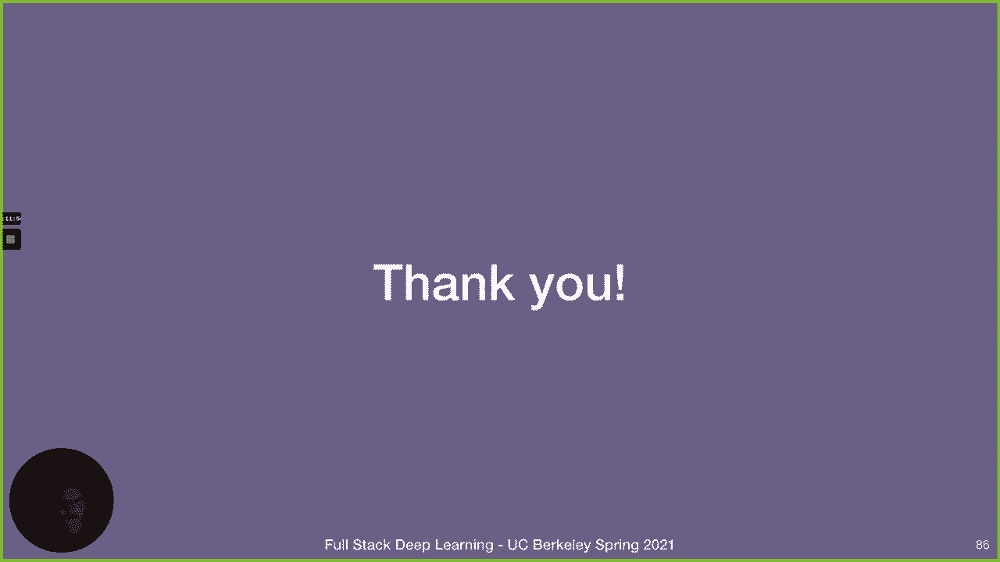

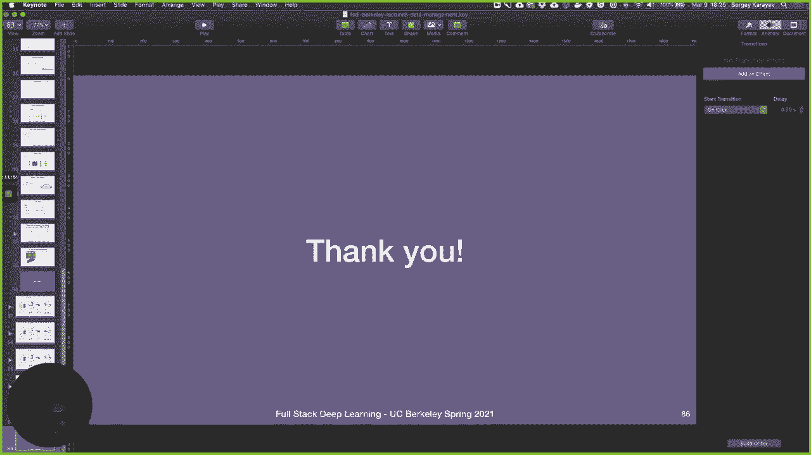