# 【双语字幕+资料下载】伯克利FSDL ｜ 全栈深度学习训练营(2021最新·完整版) - P16：L9- 伦理 - ShowMeAI - BV1iL411t7jE

this week we're going to talk about，ethics and before we get going。

just as a preamble it's a really huge，subject，spans many disciplines addresses。

a wide variety of like very real，problems，and as machine learning practitioners we。

need to have a student mindset，here and not necessarily assume that we，have the answers。

because these are really not easy，and i personally am not an expert，there's excellent resources。

that we found and we recommend those at，so when people teach tech ethics of，which ml，large。

subset what do we actually teach so this，is a paper from the computer science，educators conference。

from last year and it looked at，115 different university tech ethics，courses。

and they found that there's a large，variation in the materials covered right，so some。

a lot of uncovered law and policy，privacy surveillance philosophy。

inequality justice ai social impact，and a bunch of other stuff and there was，more consensus in。

outcomes and the main outcome for all，the co for most the courses was the，ability to critique。

the ability to spot issues and make，arguments and to communicate basically，about these。

issues so that's kind of the guiding，light here like this is maybe。

the best we can hope to get out of just，an hour and a half on the subject。

and as a last preamble there's a little，parable，in that david foster wallace。

commencement address that was widely，shared a few years ago，so there's two young fish swimming along。

and they happen to meet an older fish，who nods at them and says morning boys，how's the water。

and the two young fish swim for a little，bit and then one of them looks over at，the other and says。

what the hell is water and that's i，think a perspective，that we should try to have in a lot of。

this is，trying to see the the invisible like the，unspoken assumptions。

the backdrop behind some of these issues，that，everyone is just assuming sometimes it's。

very hard to see，the outline of the lecture is going to，be just，talking about ethics in general some。

long-term problems，that concern ethics and ai some，near-term problems。

best practices recommendations and then，some resources，to learn more so starting with what is，ethics。

your one answer might be like i can tell，if something's ethical because。

i feel a certain way about it and that's，not a great answer，ethics are not your feelings because。

your feelings might mislead you，to perhaps you're in a difficult，situation。

where it would be a lot easier to take，an option that you actually。

know to be wrong but you feel like，that's just what you should do。

so feelings can be misguiding ethics are，also not laws，right we're not just talking about ai。

laws or legality of，machine learning or anything like that，because ethics can。

drift out of sync with the laws they can，they can，person，in a society that you consider unlawful。

and so the basis for you to consider，that would be your own ethics or。

and ethics are also not the societal，beliefs this is related，right if you are in an immoral society。

in order to recognize that there's some，other source of ethics that you must，have。

so then what are ethics deep questions，that have had，a number of theories through the years。

and one of the，most common one ones on earth probably，for a lot of people。

is the divine command of ethics so，basically，a behavior is moral if it's commanded by，the divine。

and that might be perfectly accurate，but there's not much that philosophy can，say about it because。

it's just a fate a complete so，philosophy doesn't really engage with。

the ancient greeks had this notion of，virtue ethics which is that，a behavior is moral if it upholds。

which，could also be called virtues so stuff，like bravery，generosity and you know love so it's。

kind of，morality through the lens of doing and，not necessarily believing anything。

it's actually apparently surprisingly，robust to philosophical，inquiry like it really holds up from a。

lot of angles，but there is a lot of evidence now that，traits。

actually just aren't persistent across a，person's life，and and are somewhat illusory so it。

seems weird to base，your whole ethics on a notion of，and then，deontology or like duty-based ethics。

sometimes called duty ethics are the，view is that moral behaviors are those。

that satisfy the categorical imperative，right called that by con for example。

don't lie might be a categorical，imperative，or don't kill and the criticism is that，it leads to。

really counterintuitive moral decisions，in a lot of in a lot of situations。

and so it has like unacceptable，inflexibility to a lot of people。

and then maybe most recently or maybe，not but，that，a behavior is moral if it brings the。

most good to the most people，but of course how do you measure you，know good。

and how do you do calculus on good times，the number of people。

so how do you measure utility in another，way，that doesn't seem to be a clear winner。

like among either，at least among professional philosophers，so this is a survey。

of some almost a thousand you know，practicing philosophy professors。

and it was pretty evenly split among，deontology，consequentialism and virtue ethics，trolley problems。

which you've probably seen are often，used to gain intuition about different。

about a person's ethics just from，presenting them，with a moral dilemma in the classic，dilemma。

is you're seeing a trolley it's about to，run over five people，but you could divert it and it would。

only run over one person，so it's quite contrived but it's，designed to like elicit some intuition。

about would you rather，kill one person or five people basically，or perhaps。

the duty-based ethics like you have a，duty not to kill no matter what so if，you pull the lever。

then you're responsible but if you just，stay away then maybe you're not so。

there's all kinds of views on it and in，fact it's a good meme，along。

you can stop at any time but it would，disrupt the trolley service causing the。

company to lose profits，or this is known as the boomer trolley。

problem would it be fair to the people，the trolley is already killed did they，hurt it now。

or my favorite is if you pull the lever，one person dies and your liability。

exposure is one wrongful death suit，if you do not pull the lever five people。

die and you have no liability exposure，ones，which i just included for fun and then。

there's this one which is，in the trolley problem it's always，assumed that you're the person pulling。

the lever，but what if you thought about it a，different way what if you actually，didn't know。

which person you were and this is called，the veil of ignorance，and this actually leads to another。

ethical theory which，i think is maybe the most dominant now，with which is john rall's theory of。

justice or，veil of ignorance and the thought，experiment is，look you know let's say you were reborn。

into the society you're in，but you didn't know but it wouldn't be。

into your life it would be just into a，random life in the society。

do you believe that your society is fair，if you like would you choose to be born，into this society。

if you didn't know which member of the，society you were going to be born as。

right and so the intuition there is we，should try to，improve society such that from the veil。

of ignorance，we would feel safe about living in the，society like we would be happy to be。

a random person in the society，when applied to technology i think it's。

important to understand that ethics，are not static right they actually，change with。

what technology allows us to do and for，a concrete example of this，we can think of the industrial。

revolution which just，radically changed the calculus of of，human labor。

whereas before the industrial revolution，all work on earth was done by you know。

human or animal muscle，after the industrial revolution we had，machines。

doing work in the physics term and that，just leads to different，ethical problems and it leads to。

different ethical decisions，or for example the internet is a recent，invention but it seems so。

like fundamental to how we live today，that people talk about。

internet access being a human right is a，new thing，or if you look at the way reproduction。

has been happening，for all of history there's certain，ethics associated with it。

and a lot of them have radically changed，in just the 20th century。

and and the 21st century first with the，invention of birth control，that's reliable and cheap then。

in order to have a child no one needs，you personally don't need to be pregnant，anymore。

there's surrogate pregnancy which would，be hard to explain，to your great-grandparents for example。

now there's embryo selection so you can，actually do genetic testing。

on a number of embryos select the one，that is best under some metric。

and then implant that one and then in，the future in the near future。

we might have artificial wombs so you，can in fact have，children without ever going through，pregnancy。

and of course genetic engineering and，stuff like that or，lab grown meat i think the ethics of。

being vegetarian or not will change if，there's，uh really abundant and cheap lob-grown。

meat instead of farm-raised meat，there's a good book about this uh called，right or wrong。

kind of stuff，i can move on and we can think about，long-term problems that are ethical in，a。i。

so the first i think a lot of people's，minds go to autonomous weapons。

and maybe they go into a place that，is a little easy to dismiss as maybe。

far-fetched not realistic we don't have，to worry about it it's just a movie。

but of course as the saying goes the，future is already here，it's just not evenly distributed so。

israel apparently has autonomous robo，snipers，on their borders today and just。

i think last weekend or something there，was an article about，the new york city police deploying。

the boston dynamics spot robot which，only like，60 000 or something but they were。

deploying it in like a situation of a，crime in progress，so i think this will be。

something our generation is going to，grapple with for sure，concern right that seems to be on the。

horizon still，but is also creeping up on us and the，traditional view。

is humans have been working certain jobs，that now ai is taking。

or robotic labor might be taking in the，near future，and particularly with the pandemic you。

see a lot of articles，where millions of people have lost jobs，and it's dawning。

on a lot of people that maybe they'll，never get them back because they'll，actually be replaced by ai。

or robots in just 2020 and 2021。now this could be good and bad could be，bad。

if there's no social safety net or no，other job for you to have。

and you're no longer able to work the，only job you're qualified for。

because now a robot has it and that's，just，a couple of hours ago i saw on reddit a，shower thought。

the problem isn't that robots are taking，over our jobs the problem is that we've，created a world。

where that's somehow a bad thing it，really should be a good thing that we。

don't have to do a lot of these jobs，because robots can do them now the，problem is in our society。

it's not like a robot is replacing you，then you get the pay that you would have，got。

it's a robot's replacing you some，company saves money，and then you don't get an income at all。

but it's also good and we just have to，figure it out，because there is a mega trend of the。

demographic conversion，and so what that means is the world，population。

is basically topping out right at around，10 to 12 billion，and there was a huge births。

spike and it's different in different，countries right the，united states famously had the baby boom。

but for example in africa the population，is very young even today like their baby。

boom was basically like，right now or maybe 10 years ago and in，china。

they instituted the one child policy，which obviously has the effect，that for every um single。

person of working age there are，two people of retired age and that's。

not quite true just yet but it will be，true in 20 to 30 years，and if that's true then basically the。

economy can't function，as as currently designed right like our，economy。

really depends on growth and it depends，on a certain ratio of economically。

productive people to children and，retired people，and if you invert that ratio then you。

basically need to make up the labor from，somewhere，and rodney brooks is a roboticist i。

believe from mit，also the founder of irobot pretty，brilliant person。

and this article which i recommend you，click on talks about how，we basically need robots in order to。

have a functioning economy in the next，few decades，an interesting spin on this worry though，is。

ai not necessarily replacing human labor，but controlling human labor。

and so if you think of like the amazon，fulfillment warehouse，it's worked by people。

but the efficiency comes from basically，machine learning，allocating labor in such a way that a。

person really has no agency，article，from the verge how hard will the robots。

make us work in warehouses call，centuries in other sectors，intelligent machines are managing humans。

and they're making work more stressful，grueling and dangerous，and that led me to remember the short。

story which i recommend you guys read，called mana two views of humanity's，future。

and the first sentence is depending on，how you want to think about it it was。

funny or inevitable or symbolic，that the robotic takeover did not start。

at mit nasa at microsoft or ford，it started at a burger g restaurant in，cary north carolina may 17th。

and it's very much in this vein of ai，not necessarily having to have a，physical body。

in order to i guess subvert human life，and the final worry is well。

the ai's maybe if it's super intelligent，and it has robotic labor it actually。

just doesn't need humans at all，it can replace humans entirely and。

that's a screenshot from the matrix，if you guys haven't seen that so what's。

common in all of these long-term，problems what's common is the problem of，alignment。

so this notion of alignment is often，expressed，through this other parable of the。

paperclip maximizer which，i think is is from the philosopher nick，bostrom。

who works on ai safety and related，concerns，but basically the story goes is that，assume there's a。

artificial general intelligence so some，person，not necessarily any smarter and it's，given the goal。

of producing paper clips and，that's its goal so it's able to act。

in ways that an intelligent entity is，able to act in，which includes making itself more，intelligent。

potentially by developing you know its，own ai and so eventually。

develop super intelligent ai and because，its goal is only producing paper clips。

it starts just tearing up the streets，and like，metal buildings and stuff and eventually。

turns every atom on earth and then every，atom in space，into just paper clips so obviously。

something went very wrong，by the way universal paper clips if you，click on that in the slides。

it takes you to a game where you play as，an ai producing paper clips。

fun this is actually an old lesson，if you think about it like you rub a，lamp and a genie comes out。

and then they tell you three wishes but，then you ward the wish in such a way。

that it actually becomes a curse，for you and then you use the second wish。

to revert that and then the third wish，is that there's some other thing。

um that's problematic about how exactly，do you communicate，your goals and values to a。

technology basically or you can think of，frankenstein，and his monster where you create。

something and you think，it's under your control but it in fact，is not if it's given enough power。

so the guiding principle for basically，everything i think，in this lecture is that the ai systems。

we build，including the current limited machine，learning systems we build today。

need to be aligned with our goals and，values so this，problem of alignment is a very deep。

topic and it's actually an active area，of research at a number of places。

including at birklane at the center of，human-compatible，artificial intelligence of which peter，abeel。

is one of the faculty so that would be，useful to hear from him as well at some，point。

but i think this alignment lens is，useful for near-term problems as well。

not just long-term problems and so let's，get to those now，so let's talk about hiring。

here's a headline you might have seen or，something like it amazon scraps。

secret ai recruiting tool that showed，bias against women and there's。

been a number of headlines about using，machine learning systems for recruiting。

or in hiring in some way，but let's say we're trying to work on。

something like that so we're trying to，develop a machine learning model。

to and specifically this is given a，resume we want to predict。

the hiring decision the eventual hiring，decision，so to train the machine learning model。

we need data right，now we have a choice what should the，data contain should it contain。

hiring decisions which is what we're，trying to so like obviously it's gonna。

contain resumes but then what's the，label on the resume，is it the hiring decision that was made。

or is it the eventual job performance，given the person was hired you might。

want to predict job performance instead，of the hiring because，what if they were hired and then they。

were immediately you know fired two，months later or if it just didn't work，out。

but what you really want to hire you，know who you really want to hire are。

people who get hired and then get，promoted quickly，and our leaders at the company okay so。

the data comes from the world，and the world is known to be biased in。

many ways right there's bias in the，hiring pipeline，so potentially maybe if we're hiring for。

software engineers，maybe not enough women are getting，educated for the job。

so in the pipeline there just aren't，that many women candidates，and there's reasons for that that。

come from sources of bias in the world，there could be bias in the hiring，decision itself。

so by the people doing the hiring，intentionally unintentionally they are，selecting people。

that match some prejudice that they have，and there's bias，in the performance ratings which is if。

that's the signal we're trying to，predict，then then maybe people are getting。

promoted not because they're actually，real good at the job but because they're。

good at something else or they match the，expectation of the promoter。

in certain biased ways so because we，know the world to be biased。

then basically no matter what decision，about how to structure the data we make。

the data is also biased，and therefore any model we train on that，data is also going to be biased。

okay and then the model is trained in，order to，help or take some kind of action。

so what is that action are we scouring，the internet，for resumes predicting whether it's a。

good candidate and then feeding the，candidates into some pipeline。

so that we can reach out to them or is，it that we are just running the machine。

learning model alongside，human decision makers and we're just，double checking how the。

decision the human decision agrees with，the machine learning decision。

or are we actually using the machine，learning prediction，about whether a human would hire this。

person to actually do the hiring and，let's say we are doing that。

in that case the action that the machine，learning model suggests，directly impacts the world because。

basically whatever we predict，we actually we predict that this person，would be hired。

so then we actually do hire them and so，that adds，to the state of the world which then。

changes the data set which then，if we retrain the model changes the。

model and we're basically amplifying，existing biases that we knew from the。

beginning were present in the world，and amplifying existing biases in the。

world is usually not aligned with our，goals and values，and for that reason amazon scrapped the。

machine learning model，in their hiring pipeline so the next，thing we can talk about。

is uh this notion of fairness and in，order to look at that in more detail。

and just really dig into it we're going，to use，a case study about compass。

which is the correctional offender，management profiling，for alternative sanctions system that。

was in the news a couple of years ago，and the goal of this system is to，predict recidivism which is。

basically committing another crime such，that judges，can consult the compass score which is。

between one and ten，in their pre-trial sentencing decisions，which is basically。

do i let this person go free on bail or，do i actually hold them in detention。

until their trial which can actually be，the motivation behind developing the。

system was to do what kevin，said and actually be less biased than，human decision makers。

because the criminal justice system is，notoriously biased right against certain，races。

and the goal of using a machine learning，system is to，try to be more fair。

when it comes to these kind of decisions，so the solution that，the company came up with the companies。

called northpointe was to gather data，right so there are certain features，about the person like。

age whether the crime was violent the，number of crimes，in their past like number of years in。

jail like a bunch of，things that you might think are relevant，but notably exclude protected class。

attributes，such as race so the model does not have，direct access。

to these protected attributes and then，train the model and really make sure，that statistically。

the score given between one and ten，corresponds to，the probability of recidivism in an，accurate way。

and also in an accurate way that's，accurate the same way，across the different demographic groups。

that we care about so，we'll talk more about this in a second，but basically the solution is to。

gather data and do a good job and，exclude protected class attributes，right and yet there's a famous。

pro-publica report machine bias their，software used across the country to。

predict future criminals and biased，against blacks，so they give this figure of。

the risk scores that the compass system，um gave and this is in broad county in，florida。

they got the information through a，freedom of information act request and。

like the first thing they noticed，is it's pretty even distribution of，scores 1 through 10。

for the black defendants but for the，white defendants，it's definitely skewed to the low risk。

and the other thing they noticed they，actually had to gather the data。

themselves took a couple years but they，for every person，in the foia data dump that they got。

they actually didn't know whether they，re recidivated or not。

so they um had to look up arrest records，for the next few years and and they。

figured out like which person，actually recidivated and was arrested，and went back to jail。

which did not they got that data which，was a huge project in itself。

and one thing they noticed is that，there's kind of two sets of people。

that they cared about here one was，labeled as higher risk but actually did，not reoffend。

and so among white people that's 23，percent，among african-american people is 45，percent。

and then there's another set which is，labeled lower risk，among，whites that was 48 among。

african-americans 28 percent，so there's that clear disparity in those。

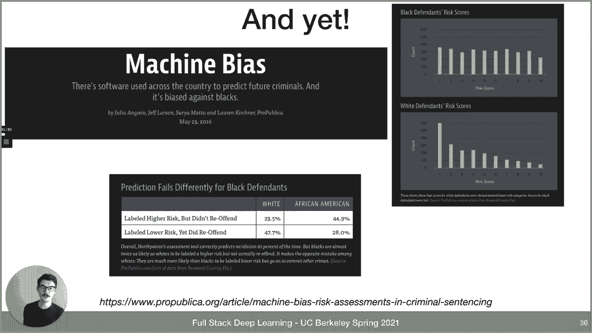

numbers，there's a big article and，in the slides that follow i'm going to，borrow heavily from。

aravind narayanan and uh。

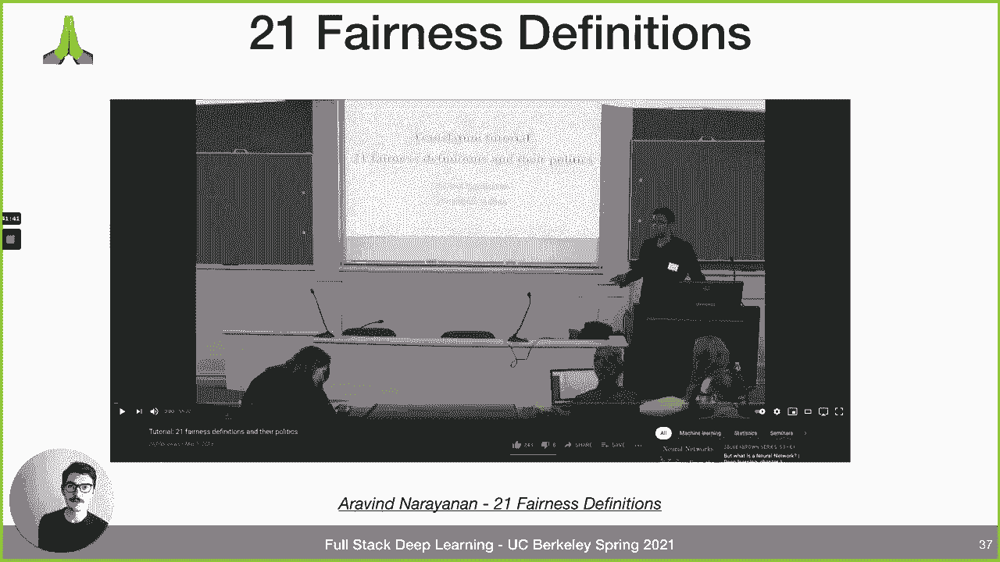

excellent youtube tutorial called 21，so there's a bunch of definitions that。

we can talk about and one of the first，ones we encounter is bias and。

in machine learning we often mean，statistical bias and so specifically，that's the difference between。

the estimators or you know the machine，learning model's expected value。

and the true value and so in the sense，of statistical bias，the compass scores are not biased with。

respect to re-arrest okay which is an，important caveat，because we only have data for arrests。

not crimes committed okay and there，and there may well be there's a lot of。

reason to believe there is bias，in which crimes by which race of people。

result in arrests so there's bias and，that process but，but that's also the data that the。

pro-public people gathered and they，found，something that they perceived as unfair。

that was also rearrest，data but it's also just important to，point this out because that's that's the。

water，here as we got to see there's always，that it might be biased in the data but，there's also bias。

in the data generating process aka the，world，and so we always have to look at both in。

any case the compass scores，actually predict the chance of，recidivism。

like the the risk score maps to the，probability of recidivism，at the same rate across these two。

demographic groups of african americans，and whites，so in that sense it is free of。

statistical bias it is well calibrated，across these groups，but is this definition of fairness。

an adequate fairness criterion right is，this definition aligned with our values。

and that's a deeper question and，to get at it let's actually just take a。

step back and just look at binary，to，the problem we're talking about now but。

it also applies to a lot of other things，like，whether to give someone a loan whether。

to hire someone like we talked about，insurance all kinds of things，this。

is basically matrix of true negatives，false positives false negatives true，positives，and they。

indeed recidivated then that's a true，positive right，but if they were labeled as high risk。

and they did not recidivate and that's a，false positive and so on。

so you've seen this in your machine，learning classes，but the interesting question here is。

what do the different stakeholders，want from the classifier what would they，perceive as fair。

so the decision maker aka the judge or，the prosecutor what they care about，right so。

those that they label high risk how many，actually recidivated，so that's the predictive value of the。

estimator and true positives，over the true positives and false，positives which are all the people。

predicted as high risk，the defendant cares about something，different though。

they care about the probability that，they will be incorrectly classified as。

high risk because they want to go free，before trial，and if they're not likely to recidivate。

then they should be labeled as low risk，and so they're really afraid of being，labeled as high risk。

and that would be the false positive，rate which is false positives over。

false positives and true negatives so，that's like，the people who were labeled high risk。

but actually did not recidivate or would，not have recidivated。

and then the society at large might care，about，the demographic balance of the selected，sets。

and so that could be a demographic，parity so you want some you want。

let's say the accuracy to be equivalent，across demographic groups。

and that gets at the notion of group，fairness right so do outcomes differ。

between different groups for example，define，groups in a number of ways which we have。

no reason to believe are actually，different，and so that's the motivation of the，pro-public article。

which is that they did observe that，outcomes differed，by demographic in this way by the way。

just to put it back into the language we，just had the top row is false positives。

so they're labeled high risk but didn't，reoffend，and then the bottom is false negative so。

they were labeled lower risk，and yet they did reoffend so the false，rate。

does not have demographic parity here，there's a paper published after the，propublica article。

that proved that if an instrument，satisfies predictive parity，meaning basically。

if the plot looks like this and the top，in the top right，so it predicts the same across the。

different demographic groups，if the instrument satisfies predictive。

parity but the actual prevalence of the，thing that is trying to predict differs，between the groups。

then you actually cannot achieve equal，false positive，and equal false negative rates across。

these groups so it's impossible to both，satisfy how compass would like to define。

fairness which is that they predict，the same score will predict the same。

chance of recidivism no matter what the，race of the person is，and the pro-public definition of。

fairness which is they want to see equal，false positive and false negative rates。

across these two groups it's actually，impossible in this case，because the prevalence of recidivism。

and a lot of these group fairness，metrics have natural motivations and，there's no correct。

there's no like correct fairness，definition because，it really just depends on the politics。

of the situation，and which stakeholder you think is most，important and so on。

and in fact it's there's nothing special，about，the false positive rate false negative。

rate and predictive parity，as the three metrics it's actually any，three metrics that you might pick。

you will be able to prove that you can，and it gets even worse because。

you might say okay well forget about，predictive parity we only want。

false positive rate and false negative，rate to be equal，and furthermore we'll actually even。

allow the model to use protected class，attributes like race，fail，we would fail another definition of。

fairness would be individual fairness，which is basically if you want there to，be a single threshold。

that's used for the sentencing decision，or the pre-sentencing release decision。

if you don't want that threshold to be，different，for whites and blacks。

then you may not be able to achieve this，and if you do want the threshold to be。

different then pretty naturally that，fails individual fairness because just。

because of the color of your skin，you're subject to a different standard，for pre for pre-sentencing。

release so then okay let's just pick one，right we just want to include we just。

want equal false positive rate across，the groups we care about that's all we。

want in that case we will still，sacrifice some utility，which in this case would be the public。

safety like we want to，not release people likely to recidivate，or。

on the other end of the spectrum we，might be releasing too few。

now the defendants because we've set the，threshold in the point which yeah it。

ensures equal metric that we care about，here，but then it's it's not achieving optimal。

metric that we should also care about，which is utility in this case。

and there's a fun interactive example i，don't know how fun it is but。

where in a slightly different setting so，this is giving loans。

and this is a companion piece to a paper，by waddenberg，viegas and hard and mort's heart is a。

professor at burklane，and i'll have more to say about about，about his work。

later on in the lecture but yeah you can，basically drag，or，blue and orange and then you can say。

okay i want，equal opportunity so i want to maximize，true positive rate。

or i want equal true positive rate i，want to set different thresholds so that。

the true positive rate is equivalent for，the two populations，or maybe i definitely don't want to be。

making decisions based on，this group so i have to have the same。

threshold what's the best i can do then，or i want to just maximize profit i。

don't care about anything else。

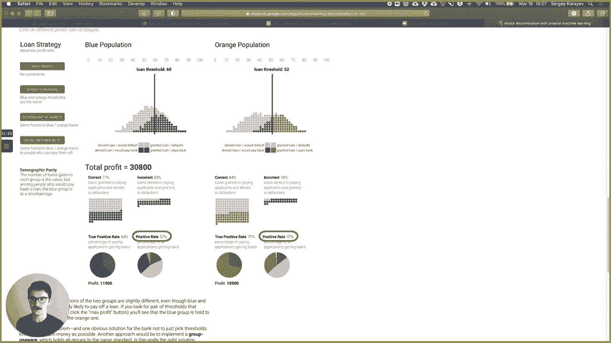

or i want there's all kinds of different，things，it's kind of interesting to play with。

[Music]，so by the way i said that compass，removed the protected attributes。

from the data that the model was able to，see，and that's i think often would you think，we can't。

we don't want any differences based on，for example race so let's just remove。

rays from the feature set，and then refine so that does not work，and you can quantify。

exactly you know how it does not work，and more it's hard also，has done that in a paper but。

just a couple of words about why it，doesn't work machine learning can be，very good at finding。

patterns that maybe humans can't find so，for example your zip code。

and your age together might be highly，correlated with your race so you can，remove race。

but the machine learning model will，learn how to basically construct it from，your zip code and age。

or something like that so you can always，pick up on a protected class attribute。

from other attributes okay so there's，trade-offs，right there's trade-offs between。

the different measures of group fairness，that we looked at，there's a trade-off between maximizing。

for group fairness versus，individual fairness and there's，trade-offs between。

the notion of fairness and the notion of，utility，and it's in fact not specific to machine。

learning it applies to human decision，making too，but i think it's maybe good that machine。

learning has brought this to the fore，because now a lot of people are。

analyzing it whereas in the past，the same kind of decisions were being。

made but they weren't really as out in，the open as，as now and it's interesting to think of。

how a human decision might be seen，as a prediction so like the police can，search your vehicle。

if they can reasonably believe that you，have some contraband。

but that's a prediction do you or do you，not have contraband so that's a，prediction。

so we can gather this data set and take，a look at how that，predictor what what features does it has。

is it biased in certain ways and so on，we don't tend to do that and then。

there's a tension between disparate，treatment and disparate impact。

and this gets into supreme court cases，and it's a very deep subject。

but the basic thing to say is like in，that example is it，allowed to have two different thresholds。

based on race that can end up in front，of the supreme court and，or in front of some court and what。

happens in court is that you basically，have case-by-case decisions。

where the judge considers you know the，full，evidence and the full context of the。

situation and then makes a decision，and that's the decision society settles，on but。

in machine learning that just doesn't，the whole point of applying machine，it。

and so you lose that ability to make，case by case workarounds。

which is why it's really pushing this to，and what's the water here right we've。

been just like getting deep into this，fundamental，so here's a tweet from moritz heart and，helpful。

in understanding why opting for a，prediction as a solution concept of its，own。

regardless of all the stuff which is，talked about is already a consequential，political act。

that de-prioritized alternatives so，failure to appear in court。

okay so one approach you can predict the，failure to appear in court。

and then jail the defendant if the risk，is high the alternative is to ask why。

people fail to appear in court，and so maybe if you ask that question，you'd recognize that。

a lot of people fail to appear in court，because maybe they have a child and。

there's no way for them to take care of，their child，or maybe they don't have a car or money，it。

or they got a job and they can't take，hours off maybe they have multiple jobs。

maybe they already have to appear in a，different court for something else so。

just having that empathy and asking that，question，you might recognize that we shouldn't。

even be trying to predict if people，are failing to appear in court we should。

just change the system so that people，maybe don't have to appear。

in court and i thought that was very，valuable，and this goes to this diagram that's。

often shown in a lot of places i don't，know where it's from so i wasn't able to，really。

i maybe it's from this blog but maybe，not，but it's the difference between equality。

equity and justice，so in in the notion of equality there's，a situation。

right there's a fence in front of a，soccer game that's the situation。

and we give everyone the same support，which is this little box to stand on。

and that works for some people it does，not work for others，and it's equal treatment because。

everyone got the same thing，but it's not really equitable because。

to make the situation equitable you want，to actually give more support to the。

people who need it rather than，equally to everyone and and that's an，idea behind affirmative action。

or other policies and interventions that，are designed to produce equity。

and then the notion of justice is maybe，let's see what the situation actually is。

and instead of trying to stack the deck，in the current situation can we actually。

change the situation，so that we address the cause of the，inequity and i thought。

that's a very valuable perspective to，have because as computer scientists i。

think we have very literal minds，right and we get into this one track，thing like oh it's。

fair in this way but not fair in this，other way whatever and then you argue，formulas and。

false positives but then taking a step，back and just seeing the whole situation。

like maybe that's not even the right，thing to be doing at all we can talk，about。

so we talked about fairness let's talk，about another，so if you have ever had a problem。

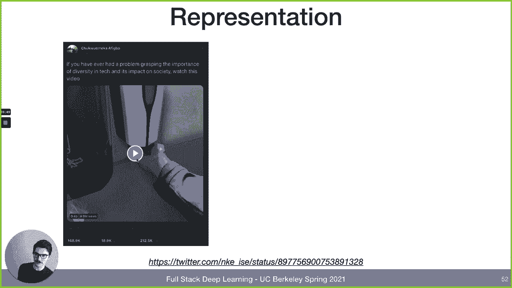

grasping the importance of diversity in，tech and its impact on society watch。

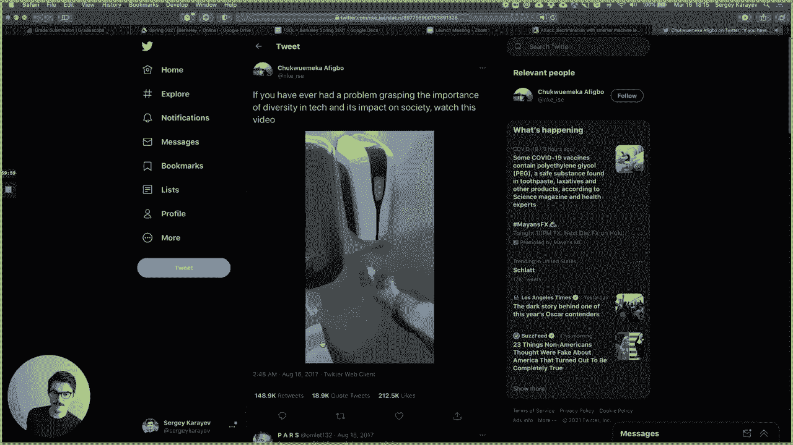

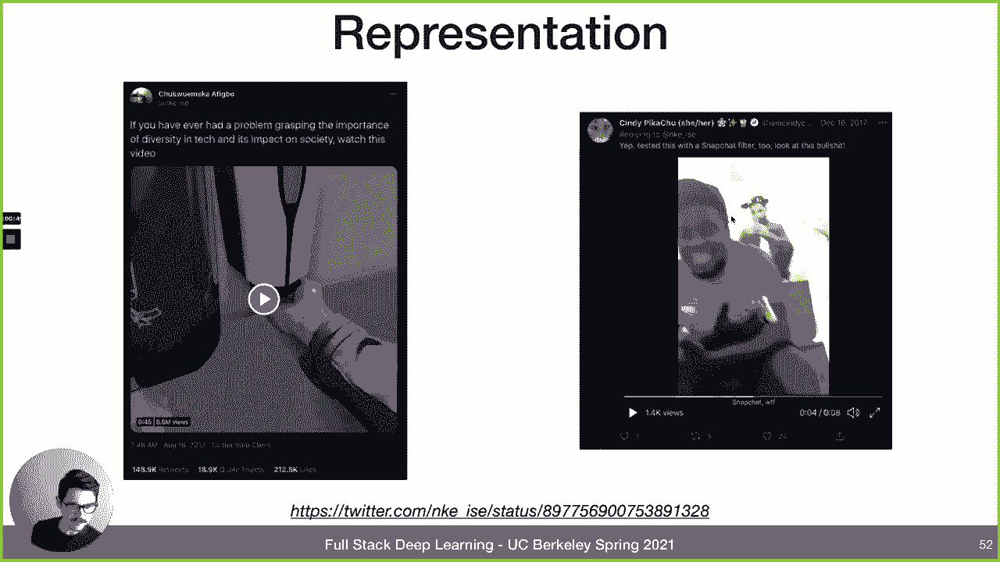

and then in the comments to this video，yeah people posted another another video，which i thought was。

also good。

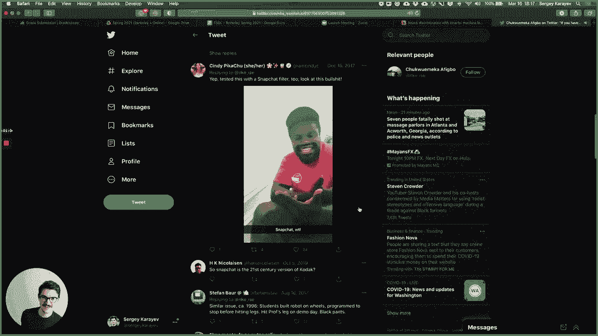

so yeah obviously this doesn't align。

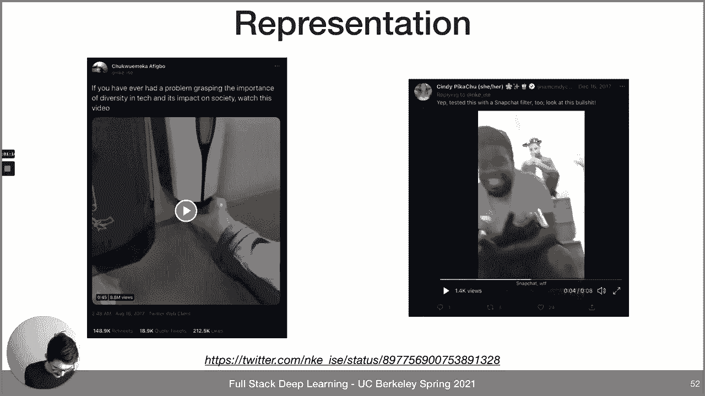

with our，goals and values and it's sadly not a，new problem，because for。

uh photographic film the way that it was，designed is to，you know elicit really good skin tones。

in people，but the problem is they only focused on，white people so they had these。

what are called shirley cards which is，like a card of，a white lady and then it's for like。

making sure the color temperature and so，on is good on photographic film。

obviously a problem but there were no，other skin tones，now they have shirley cards with。

multi-racial people on them，it's also not a problem in just our。

field so it's i think it's well known，and there's many publications about how。

a lot of medical testing like drug，testing and all kinds of stuff。

is mostly done on men and the lack of，females and drug those trials leads to，over-medicated women。

a lot of the what is found in the drug，trial is like the safe dose and the。

effect of those and so on that might be，ineffective，for a typical man and then when it's。

applied to a typical woman，who weighs less it might be an over，medication。

or the same kind of thing can exist or，you can't you can probably observe this，in medical trials。

based on age so maybe most medical，testing is done on maybe mostly healthy。

people of middle age but then applied to，increasingly unhealthy people of，problems。

there's recent improvements though like，in the actual，actually in the vaccine development in。

2020 the operation of warp speed，which is the united states government，effort to really try to。

do the phase one two three trials at a，breakneck pace，they actually had to slow down the。

moderna trial in order to find a diverse，enough，set of participants in their phase 3，trial。

which is you know bad in the sense that，the vaccine wasn't approved。

until a little bit later but really good，in the sense that，the phase 3 trial established that the。

vaccine is effective，in people of you know all ages races，so what's a how do we solve that as it's。

obviously not aligned with what we want，but how can they ship a soap dispenser。

that just doesn't work，for a large part of the population i，think a large part of the solution。

is actually in this new york times，article，just from like yesterday what is it the，16th。

yes from yesterday an article called who，is making sure that am machines aren't，racist。

largely about team nit gabru，and just to read an excerpt so she was，an ai researcher。

at stanford at the time and she went to，a conference，in about five years ago in spain。

hundreds of people gathered for the，first lecture，at the world's most important conference。

on ai some were east asian，a few were indian a few were women but，the vast majority were white。

men more than fifty five hundred people，attended the meeting，timnit gebruth undergraduate student at。

stanford remembers counting only six，black people other than herself。

all of whom she knew all of whom were，men，i'm not worried about machines taking。

over the world i'm worried about，groupthink insularity and arrogance in，the ai community。

especially with the current hype and，demand for people in the field the。

people create this is what you wrote，after getting back from the conference。

the people creating the technology are a，big part of the system。

if many are actively excluded from its，creation this technology will benefit a，few。

while harming a great many and so，a large part of the solution to these，problems of representation。

are including people who weren't，previously part of the community。

in the community of developers it's，great organizations，that are fighting for this specifically。

in machine learning，so black and ai is the logo here founded，by timnit。

women in machine learning latinx and ai，these are three organizations that are。

you know probably at the forefront，of bringing previously underrepresented。

uh people into the ai community，so this is very important another，example。

that is commonly given is when you used，to be when you，search for ceo on google you used to get。

a page of results that looks like this，all white middle-aged men and that。

doesn't really align with our values of，bringing all kinds of people into，positions of leadership。

recently i just did this search，yesterday it's much a much more diverse，set of people now。

so somehow or other it's improving，that，is often given is gender bias in，language。

so here's the example in google，translate they someone typed she's a，doctor he's a nurse。

translated it to a language which is，turkish in this case that doesn't have，gendered pronouns。

and then translated back to english now，magically it became he is a doctrine and。

she is a nurse and that can be shown to，like work for a lot of，different occupations。

so that's obviously a problem the recent，improvement i just tried this。

just yesterday so translating the，sentence that in turkish has no gender，now doesn't give you。

a single gender in google it gives you a，choice so，that's a clear improvement and it。

educates the user，that exactly lets them select what they，want this notion of gender bias in。

language can be seen，in word embeddings so we looked at some，word to vac。

examples in previous lectures and we，showed，it's basically just to remind you it's a。

training this embedding which is，something that converts，a word in the vocabulary to a dense，vector。

of real numbers so word2vec was trained，on a large corpus，and the weights were published so that。

people started using them for all kinds，of things，basically as the first layer in their。

nlp application，and they are useful like it's，interesting to see that。

that the embedding picks up on stuff，like verb towns and the different，relationships between。

like man woman king queen whatever，country capital，so these are on slides from rachel。

thomas's lecture on the subject，but they also reveal harmful biases。

encoded in the language so you can say，father is the doctor as an analogy，and then ask for the。

analogy with the word mother that like，completes it and，will complete it to to nurse。

although there's a little bit more to，say about that because。

the word doctor is actually removed from，father，doctor as mother is the doctor but then。

if you remove the word doctor，then the next word the next best match，is nurse。

but if it was like father doctor as man，is to，it it would probably have something。

different it wouldn't say nurse but，there is this hidden，sexism in the language embeddings。

so one potential solution is to try to，de-bias，at training time such that the model。

never learns this kind of potentially，harmful biases，and at the very least make the user。

aware like in this example，that there might be bias in like the。

thing they're seeing of course that's，more difficult，if you're just using this as a。

pre-trained first layer，for some nlp tasks and so like the nlp，task might end up。

biased in certain ways that you can't，actually get at very easily anymore。

because it was embedded encoded in the，embedding nowadays we don't use。

word to fact we use large language，models like the gpts，and the birds and the t5s and what have，you。

and as we talked about in the，transformers lecture，gpt3 part of the reason the weights。

weren't released by open ai，is because of societal concerns，partially from things like this where。

gbt3 can say pretty，unacceptable stuff if you just get it，started。

with some words and the thing about gpt3，model，has a large number of parameters and it。

learns in a large number of data，the amount of data is so large that you，actually can't。

be sure what's in it so for example like，all of reddit is in it，and we know there's very harmful。

pieces of language in reddit but the，data set is so large that。

it's not really feasible to remove like，everything that，that seems objectionable so then you get。

things like this and it's like an open，problem as to how to deal with it。

and to tim it was in the new york times，just yesterday，and that article talks about how she。

and actually a fellow scientist margaret，mitchell were fired by google。

ostensibly because of a paper they，co-wrote with some，university of washington researchers。

named on the dangerous stochastic，parrots，can language models be too big so and。

this is an excerpt from the abstract，they talk about，environmental concerns of training these。

large models but also，concerns about bias from training on，such a large amount of data that you。

don't know what's in it，so we provide recommendations including。

weighing the environmental and financial，cost first investing resources into。

curating and carefully documenting data，sets，rather than ingesting everything on the。

web carrying out pre-development，exercises，evaluating how the planned approach fits，into r d goals。

and support stakeholder values and，encouraging research directions beyond。

ever larger language models not a very，objectionable paper，by any means and good advice。

seeing the water here so part of the，argument is should the language models。

that are trained reflect the world，as it presents itself in the data。

or as we believe it should be i think，that depends on what we're trying to。

apply the language model to，so if we're trying to apply it in this，kind of conversational ai。

setting where we actually want to speak，to gpt 3 and use it to write our emails，and so on。

the correct answer is probably to the，language model should learn to reflect，the world。

as we believe it should be not the world，as it actually is，but if we're applying the language model。

for the purpose of let's say，analyzing posts on facebook in order to，find。

hateful posts in order to remove them，well then if you remove hateful speech，from your training set。

then the model you train will not be，able to recognize hateful speech when it，sees it in production。

so i don't think there's a，one-size-fits-all answer to this like，not all language models should be。

trained on device data，but i believe that some should and then，the second question presents itself。

which is if we want to train on data，that reflects the world as it should be。

do we actually agree on the way that the，world should be and who gets to decide。

you know who gets to impose their vision，of the way the world should be。

on the rest of society i don't think，there are good answers to this。

it's just worth posing as a question，and just to close the section out you。

might have seen this article about face，recognition，it's about a company called clear view。

which might end privacy as we know it，because it ingested a lot of photos from，the internet。

and now it's available to police，departments around the country，to basically find people right in。

all kinds of photography by matching，them to faces from the internet。

and i think this is an example of a，clash of，this is how like technology changes，ethics like。

the old context of this kind of ethical，problem，is that if you're out on the street and。

you're wanted for a crime，and a police officer sees you they have，every right to arrest you。

and you don't have expectation of，privacy in public right if you're。

going out in public and you're wanted，that's the risk you're taking on。

the new context though is we changed，what in public means，in public now means basically anywhere。

in the world like on any street in any，city because there's always those。

cameras around in the corners or on any，website on the internet。

so basically anywhere means in public，now whereas it didn't used to in。

in the past now is it ethical to work on，technology like this，from one perspective ostensibly it's。

used for，to catch criminals right to reduce crime，on another perspective it seems to。

violate a lot of people's notion of what，privacy should entail and then as a。

little bit of a provocative statement，what if you found out，this particular face recognition。

technology doesn't work as well，as on some ethnicities as it does on，some other ethnicities。

is that an ethical problem in the same，way as the other ones we've discussed。

or is that potentially actually good，because now you don't think the。

application of this technology is，ethical in the first place，so here's a quote from fair ml book at。

the same time debating the merits of，these technologies，on the basis of their likely accuracy。

for different groups may distract from a，more fundamental question。

should we ever deploy such systems even，if they perform equally well for，everyone。

we may want to regulate the police's，are perfectly，accurate our civil rights freedom or。

movement and association are equally，threatened by these technologies when，they fail。

and when they work what can we do about，these problems right now，there was a paper in 2019 called。

improving fairness and ml systems would，what do practitioners need，talk to people in is a survey nlp。

predictive analytics like what ankit was，talking about，computer vision yeah search recommender。

systems，most people are data scientists or，researchers or software engineers。

support in fairness aware data，collections curation，overcoming blind spots implementing more。

proactive fairness auditing auditing，complex ml systems，deciding how to address particular。

instances of unfairness，addressing biases in the humans embedded。

throughout the ml development pipeline，that would be developers but also the，data annotators the pms。

yeah so that's a lot some suggestions，from rachel thomas，[Music]。

do regular ethical risk sweeping so like，a cyber security penetration testing。

where the red team is trying to get into，your website or app or whatever in order，to make sure that。

they can't try to find ethical problems，in your machine learning system。

hopefully to find that you can't right，there are no ethical problems but do it。

regularly just like you do，uh pentastic regularly expanding the，ethical circle。

whose interests or experiences or values，or desires，have we just assumed as we were thinking。

about this machine learning system，instead of actually consulting them and，getting their perspective。

[Music]，think about the worst case scenario，could someone abuse。

the system or maybe steal the system or，the data or weaponize it in some way。

or alternatively what incentives are，being created by deploying the system。

and how is that going to lead people to，behave，closing the loop so this kind of stuff。

is not something you just do once，and then you're done with it and then。

you don't have to do it again it's，something that should be a loop，where you keep improving so。

how do you keep improving you have to，set up a process you have to identify。

someone is responsible for improving you，have to set up feedback channels。

and yeah make sure it keeps getting done，one really good，practice that i think basically everyone。

should start doing，is this idea of model cards which came，from a line of work actually by。

timnit and this particular table paper，reporting，from 2018 margaret mitchell a bunch of。

people at google mostly，but the idea is for whatever machine，learning model or system，page。

that describes the typical input，output the model architecture。

the performance the performance should，be broken down by whatever is。

interesting like maybe demographic group，if that's a relevant factor。

or data set or geography like whatever，it is，but try to break it down in a way that's，informative。

and it's just the chance to talk about，the，what the model does what the limit what。

the known limitations of the model are，what trade-offs were made in developing，the model。

what performance it has should you，expect，a given level of performance on some，input。

the ability to maybe upload your own，data to test the predictions。

and the ability to provide feedback so，it's something that we're。

adopting in our company and i think it，just makes a lot of sense for like a lot，of。

machine learning applications，and the goal is not to be perfect and，unassailable the goal is to just。

put it out there with known limitations，and then everyone knows that。

you have some ways to go and you're，working on them and you're aware of it。

there's a project called aquitas i'm not，sure if i'm pronouncing that correctly。

from the center for data science and，public policy，that allows you to perform a bias audit。

on your machine learning model，so you can literally upload data in the，predictions。

and then it'll parse it out in a number，of ways you can set，certain class attributes as like the。

reference，and then it'll show you if it's biased，on around that reference。

and it also includes this fairness tree，heard，earlier in the lecture but it basically。

guides you through like how should you，be thinking about what metric。

to optimize for what definition of，fairness is like most applicable in your，problem。

so just not going to read all of it but，yeah i'm actually not going to read a，lot of it because it's。

very dense but one of the interesting，questions are your interventions。

punitive or assistive the punitive would，be，assistive，could be something different that takes。

you to different parts of the tree，[Music]，one way to think about it from my。

colleague eric i turn it in，is as we deploy machine learning systems，we recognize。

that we're building on basically a，crooked foundation right there's，deep-rooted。

inequities in our society there's，furthermore maybe unequal same playing。

or representation in our data in our，training data，and then we risk deploying an ai。

system that amplifies these underlying，biases，and then furthermore when the user sees，the ai output。

they might further reinforce the biases，right，now what we could do is try to like。

un uncrook the pyramid as much as we can，and we can't，do we can't get at the deep rooted。

social inequities，we like we just can't but what we can do，is we can。

build an ai team that is diverse enough，to bring，a variety of experiences to the work so。

that we have fewer，blind spots we can make ai fairness and，transparency a key component of what we。

do，and d bias ai to the extent possible，which is not 100，but also display insights about the bias。

that still remains that we're aware of，in the product that the user interacts，with so。

just like google does right with the the，different translations，such that they have the context。

and they aren't just guided blindly by，this ai system，i think an interesting you know question。

is should we have a professional code of，ethics。

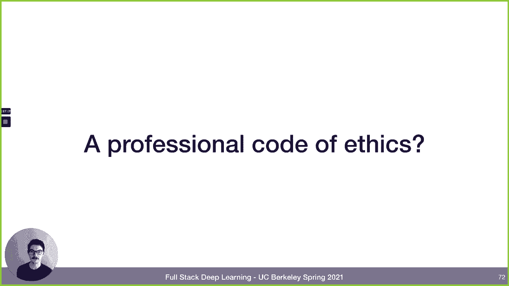

and we we obviously don't but，some professions do so i think medicine，is the most。

well known for this right it's the，what's it called，hippocratic oath which at least，historically。

doctors had to take when they were，graduating from med school and before，becoming doctors。

you might have heard first do no harm，supposedly the first line of the of that，oath。

but yeah it's basically just saying，you're going to use medicine。

in in these ethical ways and not harm，people，and to say when you don't know how to do。

something instead of just，trying to do it anyway and respect that，to be ethical or to be。

empathetic with with your patients and，so on and it's very ancient right it。

goes back to ancient greece the armed，forces have an ethics regulation。

but i don't think it's actually used，it's like 102 pages，and i just i i don't know if people。

internalize it，there's the geneva convention and stuff，so i think the armed forces do have some。

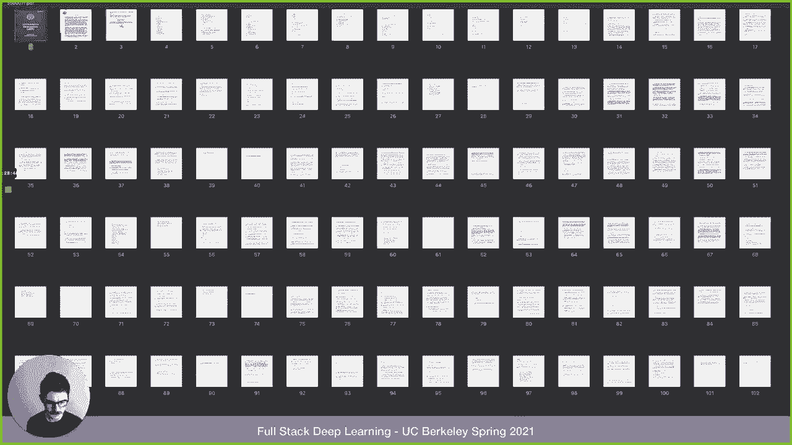

code of ethics that's different from，society at large that，is internalized to some degree i'm just。

not sure how written down it is but，software engineers，and machine learning scientists don't。

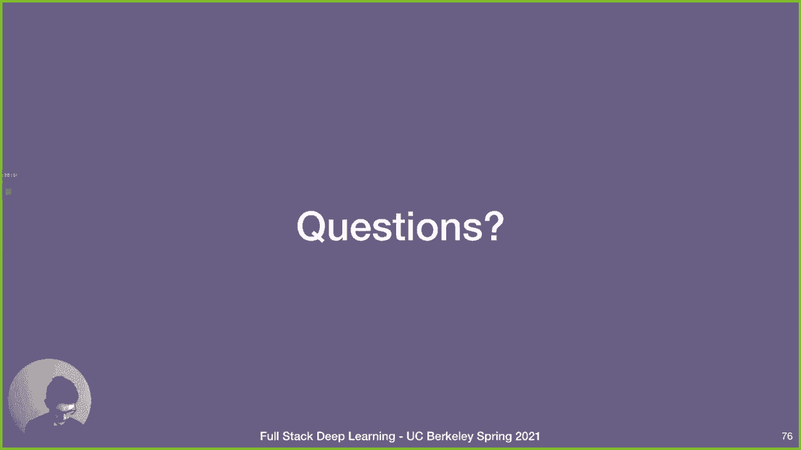

and i think it's an interesting question，whether we should，so where can we learn more oops。

rachel thomas is a co-creator of，fast。ai and she actually has a course，called practical data ethics。

it has six lectures it covers everything，in pretty good depth，or you can just sample the single。

lecture from，the most recent iteration of fast。ai，ethics for data science。

highly recommended they there was a，cs294 just like this one，from morris hart professor at berkeley。

called fairness and machine learning，and and fairness and machine learning is。

also the name of a textbook that's being，written by him，sullen barokas and also arvin marianan。

and it's a work in progress but it's，very good as is and i'm sure it'll get，even better。

there's a very good workshop from some，people at cmu，called dealing with bias and fairness。

and building data science mlai systems，a great set of slides from a，presentation at kdd。

2020 i think it's like a whole day，workshop so there's a lot of material。

a great book is called the alignment，problem，machine learning and human values by。

brian cruz yeah it's a really well，written book it covers，a lot of terrain here including the。

near-term problems，and not just not just the paperclip，maximizer type of stuff things that are。

problems today and cathy o'neil has a，book called weapons of math destruction。

which is about talks a lot about stuff i，didn't even mention such as。

like the facebook news feed how does it，influence our politics，and and that's a very rich subject i。

just didn't really。

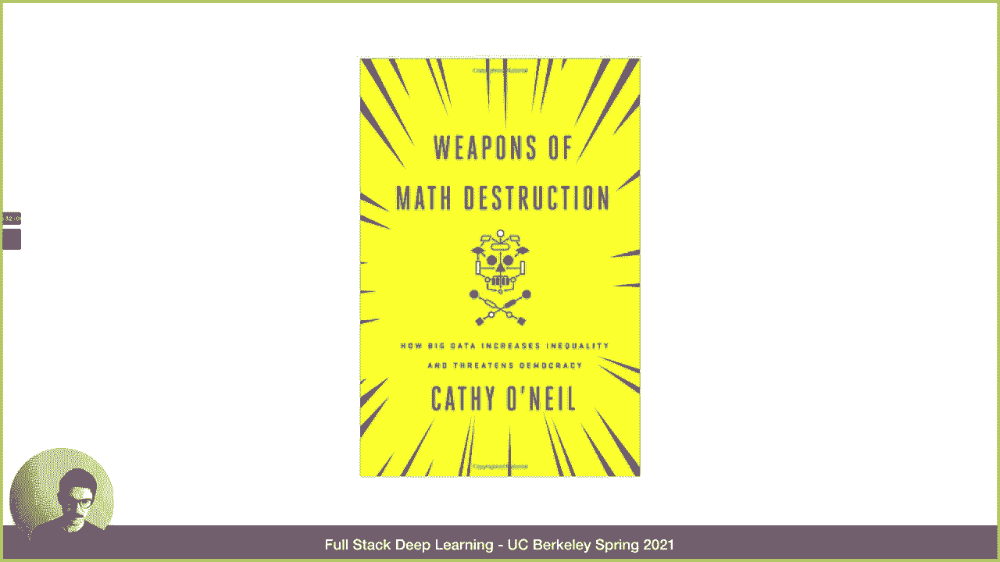

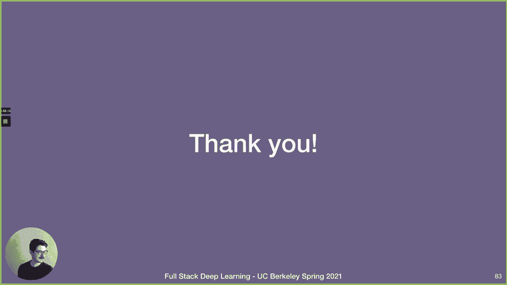