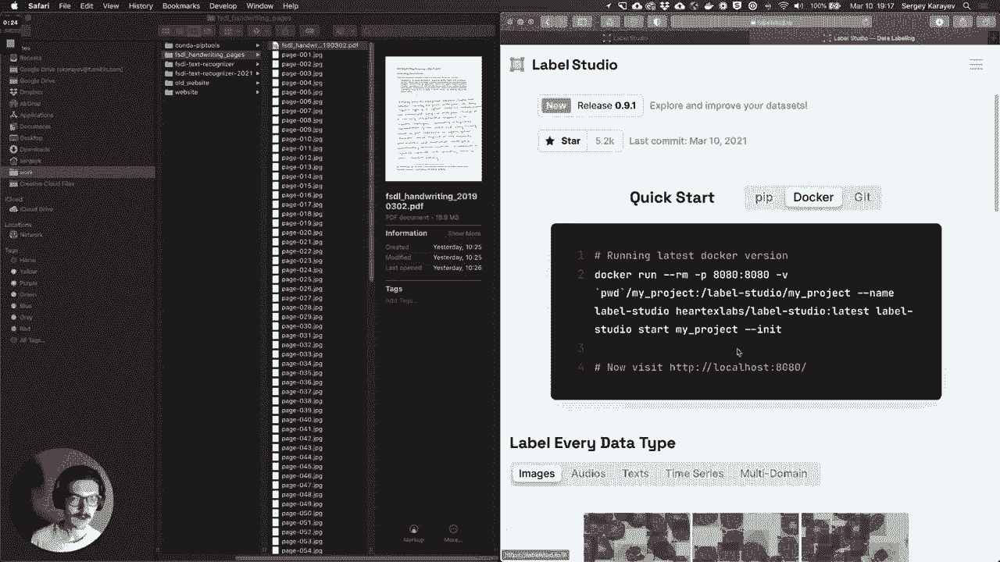
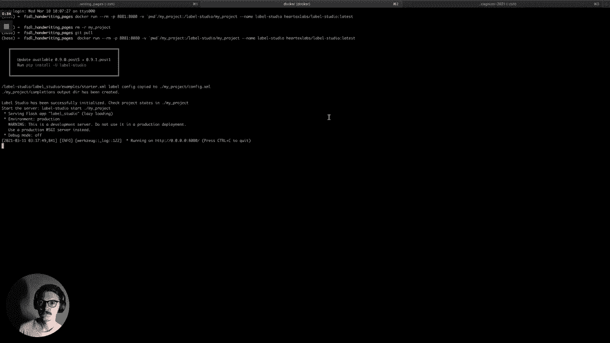
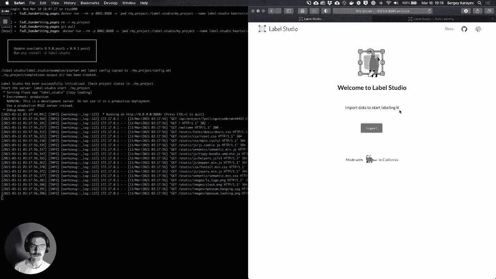
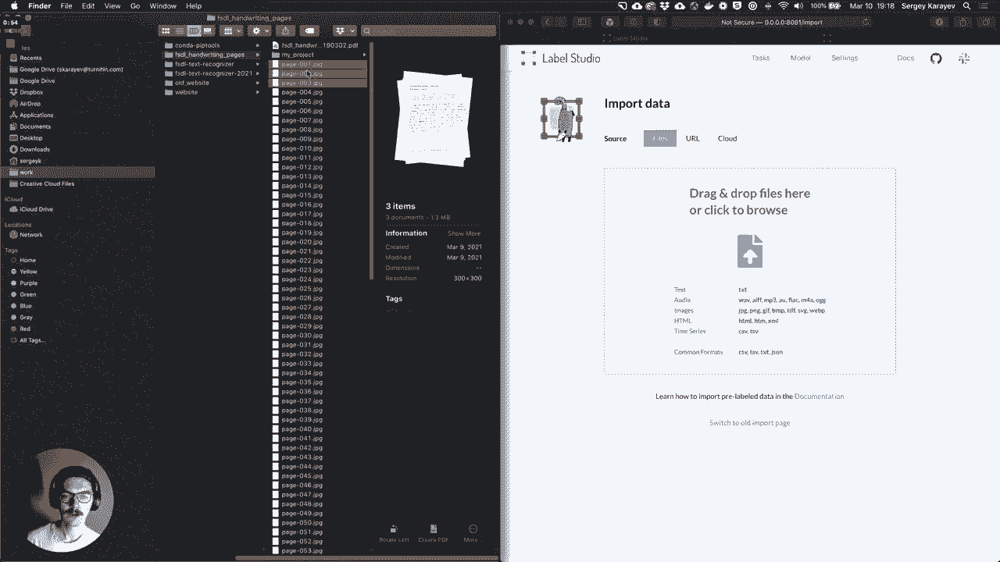
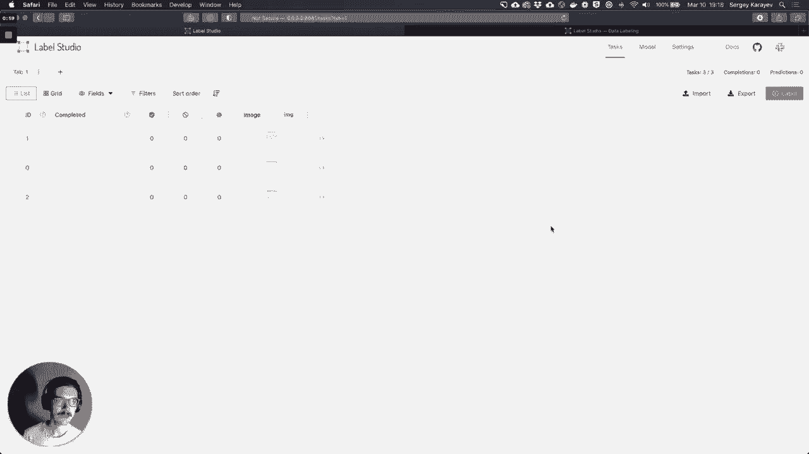
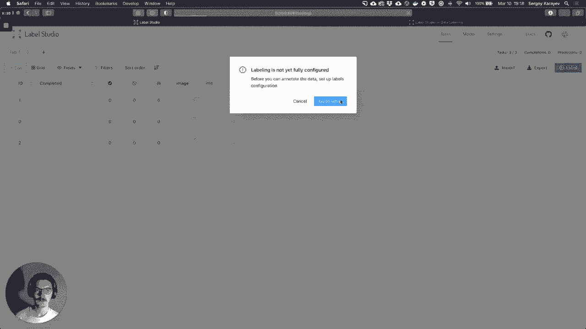
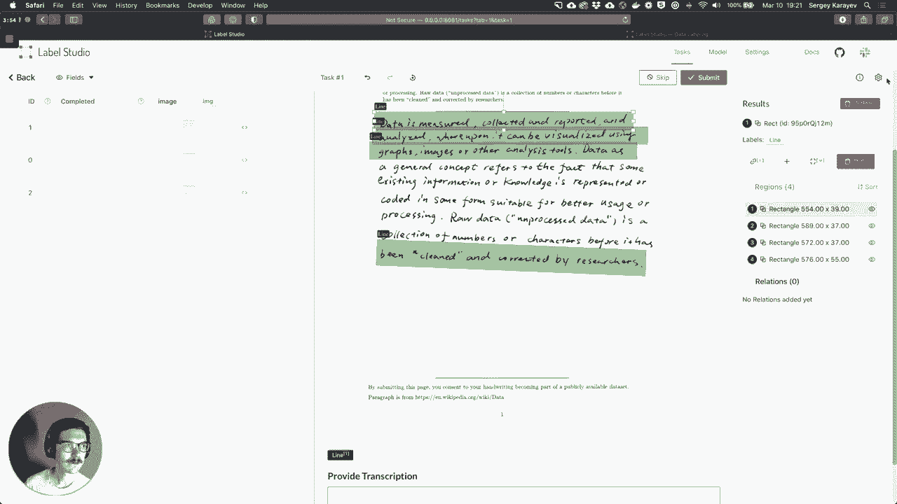
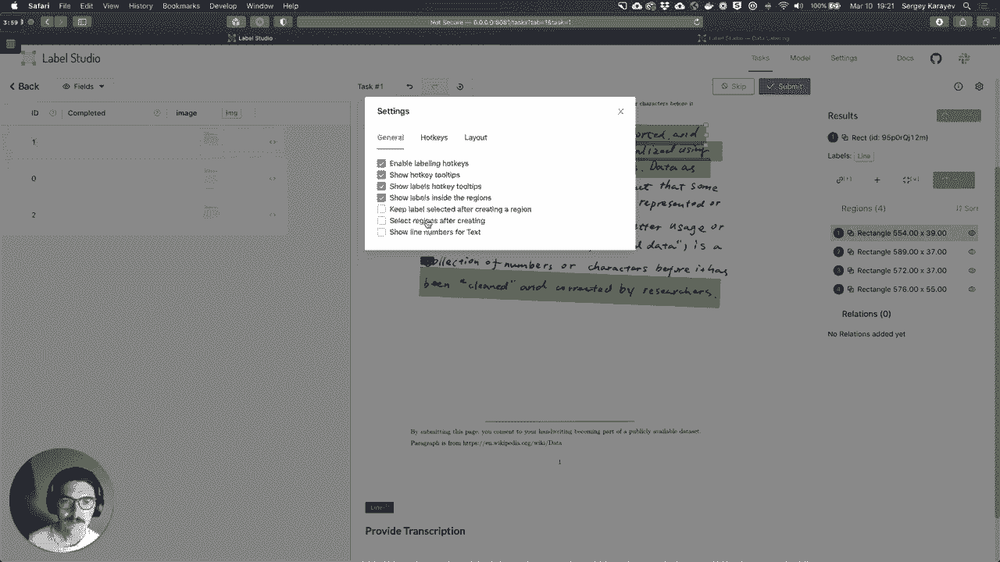
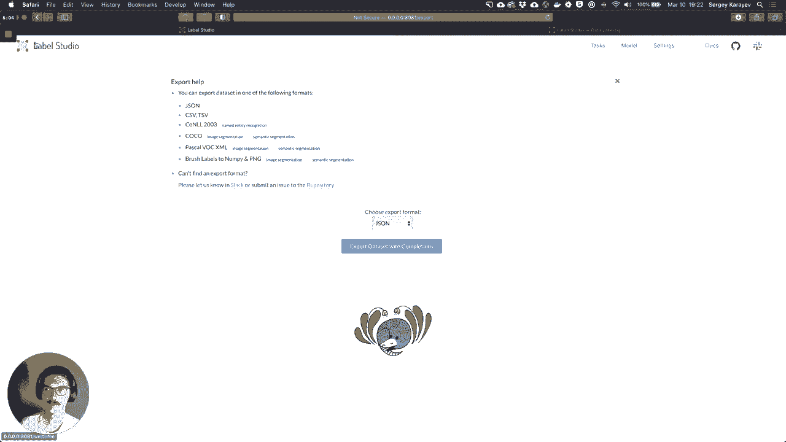

# 【双语字幕+资料下载】伯克利FSDL ｜ 全栈深度学习训练营(2021最新·完整版) - P17：【Lab6】数据标记 - ShowMeAI - BV1iL411t7jE

hello in lab 7 we'll be labeling，some of these fsdl handwriting，images we gathered them spring 2019。

and our goal is to annotate each line of，writing we're going to be using。

label studio and open source data，labeling tool，it's based on python so you can install，it using pip。

i'm going to install it using docker and。

okay so it's launching and if i go to，[Music]。

and welcome to label studio and the，first thing to do of course is to import，some data。

so for you you will download some of，some images from。

s3 for me i already have them downloaded，so i'll just track them over and。

import and，i could start labeling except my，labeling is not。

configured yet so let's set up the，configuration for labeling。

so label box is or sorry label studio is，very，uh configurable and it's configurable in。

this kind of html，or a react like language，so i used a couple of。

basic templates to get something that's，going to be pretty close，to what we need the first。

basic template is object detection for，which，we can annotate different sorts of，classes。

this uh transcription per region of，audio，so here i can select a region of audio。

and then with a speaker so maybe speaker，one is here，speaker two is here and then i can click。

on a speaker，and then annotate what they said，but i don't have an audio i have an。

image so what we're going to do is we're，just going to，copy this go back to the object，detection。

there's only one object category really，that we have which is a line，right and then for。

each line we want an annotation，so we'll just change this to image and。

that should work so we can make a line，and then if we click on the line we can。

type some text out and have it，so i'm reasonably happy with this，interface let's just save it。

and now we can start annotating right，so to annotate we have our，labels and it looks like they have。

keyboard shortcuts so if i press one on，my keyboard，and then drag it out i'll make a line。

and i can do that for every line，now we have some choices，uh in how we want to do annotations for。

example，this line is a little slanted i could，drag a rectangle around it。

or i could actually rotate the rect，the rectangle and make make sure it kind。

of matches the slope of the line，so you'll have to think about what you。

want to do or you can actually instead，of a rectangle you can，switch to a polygon based annotation。

or maybe there's something else that we，haven't even thought of yet。

and then when i click on a rectangle i，have the transcription，so this is rectangle one it's。

highlighted here。

the label to be displayed let's see，yeah one is this one so to transcribe it。

data is measured collected，and reported and okay，looking at that now every now and then。

you'll encounter some characters that，you can't quite read，and you'll just have to think about what。

you should do should you，transcribe your best guess should you，have a special token that says。

unreadable if there's a typo，should you actually correct you know the，spelling error。

if you can't read something should you，actually go to the source text。

that you know to be handwritten or，should you annotate it as unreadable。

so you'll have to fully annotate and，then submit them，and then when you're done export the。

