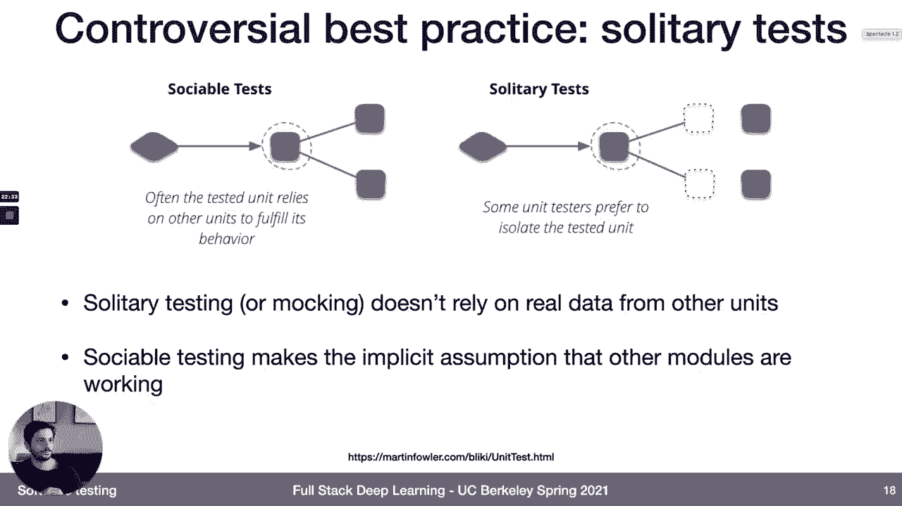
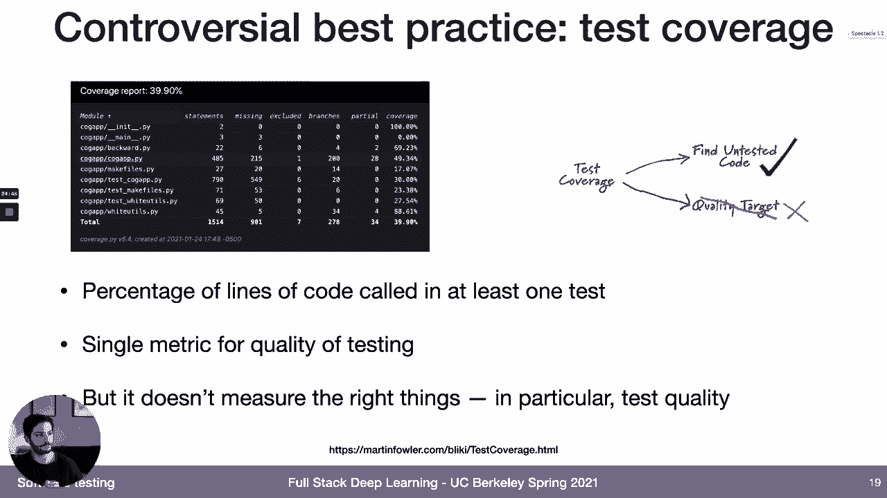
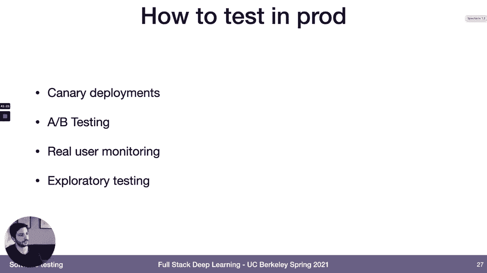
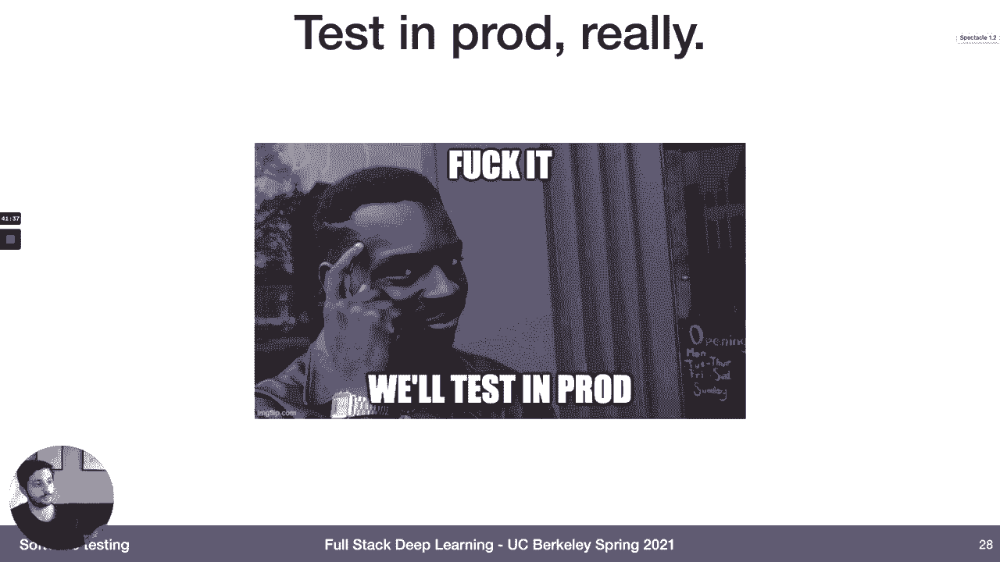
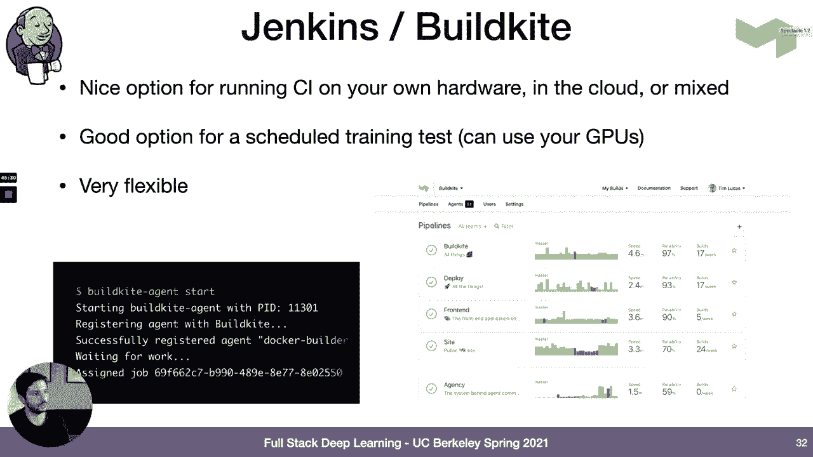
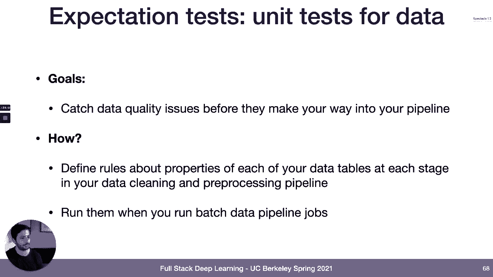
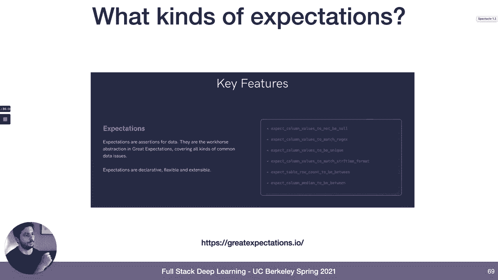
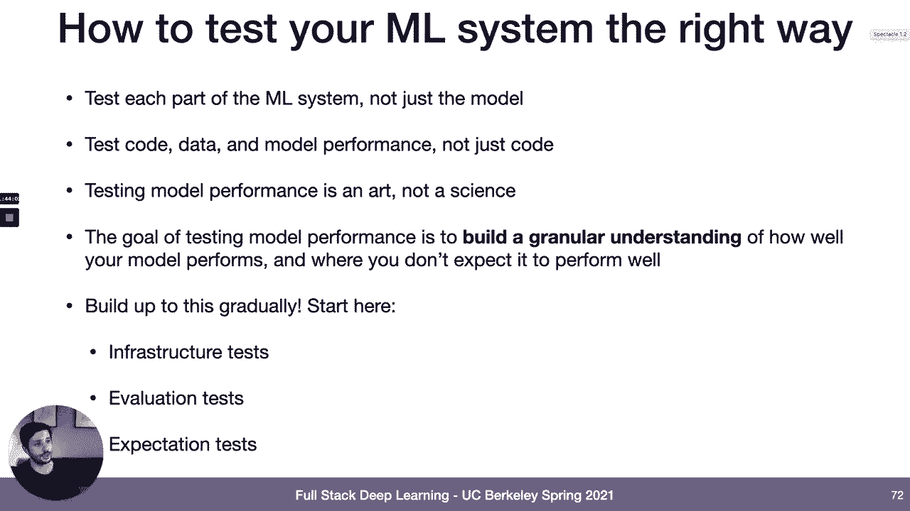

# P19：L10A- 机器学习测试 - ShowMeAI - BV1iL411t7jE

welcome back everyone hope that you all，had a good spring break。

and didn't just work on your research，the entire time so today we're going to。

talk about what happens next after，the troubleshooting lecture right so。

let's say that you've got a model you've，trained it，accuracy or whatever metric that you're。

optimizing is below your threshold，and so now you're starting the process。

of thinking about how should we actually，start putting this model into production。

so the first question that you need to，do，before you actually deploy the model。

which is what we'll talk about next week，is you need to figure out how you're。

going to test that thing how are you，going to know，whether the model is really performing。

well enough in order to go into，production so that's what we'll talk，about today，just by。

contrasting a little bit the way that，you'll feel once your test score gets。

below your target performance between，when you're in school doing research。

and when you're like out building a，machine learning system in the real，world so。

in school you finally run that，experiment and your，your validation score looks really good。

you beat state of the art you've beat，previous performance and so，next step is one go party。

two write the paper three graduate，four go work at google and five go buy a，lamborghini。

so you're done right you beat soda，you're gonna get that job，everything is good now let's contrast。

that with what happens when your test，scores blow your target performance in。

the real world so the first thing is，you're gonna have a boss，and that boss is gonna say how do we。

know we can actually trust this model，you also have potentially some users。

hopefully you'll have some users and，those users are going to say be saying。

the same thing and maybe if you're in a，regulated industry that the government，joe biden。

will be will be saying that as well and，eventually i think，once you start to get an understanding。

of like what all can go wrong，once your test scores blow your target，performance hopefully your。

your conscience will be telling you the，same thing，so what's wrong with the black box right。

so maybe the black box doesn't get such，a bad rap，maybe maybe mystical holistic prophecies。

are actually not so bad，so to answer that question let's dive in，a little bit and understand。

what it means when we have a good test，at performance right so what are the。

assumptions that are underlying and so，if your test set performance is good。

then what that means is that，if your test data and your production，data the data that your model is。

actually going to see in the real world，come from the same distribution。

then in expectation the performance，of your model on all of the evaluation。

metrics that you ran it on offline，will be the same in production as it is。

in your testing environment so let's，little bit，so in the real world the distribution。

that you train your model on，doesn't always match the offline，distribution。

or the the production distribution and，match，right so you could have data drifts you，could have。

some sort of data shift you could have，or you could even have malicious users。

that are trying to attack your model and，make the distribution of data go into，that model。

intentionally look different than what，the model was evaluated on。

expected performance so saying that the，performance of your model in expectation。

is going to be as good in the real world，doesn't always tell the full story。

so for example if you're working in a，long tail data distribution，order to。

evaluate the model offline might not，actually tell you that much about the，tails。

and so if you care about the tails of，that distribution your test。

set score could still be misleading and，on top of that if you，are evaluating your model just with a。

set，then that doesn't mean that your model，is actually performing well against。

all the subsets of data that might be，important so all the slices of data。

where you might care about model，performance this only actually tells you。

about the performance of your machine，learning model，but in the real world you're not。

actually just building a machine，learning model you're building an entire，machine learning system。

and so there's other things that can go，wrong with the machine learning system。

that don't have anything to do with the，model，and then finally this only tells you。

about performance on the metrics that，you're evaluating on，and in the real world you're probably。

not actually optimizing the thing that，you really care about deep down。

and so there might be some mismatch，between the metrics that you're，evaluating。

let's say accuracy and the ones that you，really care about like，maybe user engagement or uh revenue。

growth or something like that how about，is this really，i i picked this quote from a。

conversation that i had，with a machine learning engineer from，autonomous vehicle company who。

i don't want to name because i don't，this，quote to be public but i've heard the。

sentiment from a few folks that，the single biggest thing holding back。

the entire autonomous vehicle industry，according to this person is that even if，work。

on the roads no one would know that and，the reason is that，no one like no one actually knows。

exactly how we would evaluate that model，properly in order to decide that this。

model that this car is ready to go into，production so evaluation。

is is one thing that might be holding，that entire field back，and i think that there's a similar。

sentiment to lesser degrees in other，so what are we going to talk about today。

we're going to introduce some，some concepts and methods so we won't be。

able to go to a ton of detail about a，lot of these things but。

hopefully they'll give you a high-level，understanding of what's out there。

and how you might think about applying，it and the methods that we'll introduce，will help you，level。

than beyond just one metric how well，your model is really performing become，more confident in。

your ability your model's ability to，perform well in a production setting。

and then really understand the，performance envelope of your model。

right so where you should expect it to，perform well what type of data you。

should expect it to perform well on，and where you shouldn't expect it to。

perform well so those are really the，goals of the，things that we're talking about in this。

okay so quick outline of the topics that，we're going to cover first。

we're going to since we're talking about，testing in the context of machine，learning。

the first thing that we're going to do，is we're going to talk about testing in。

the context of software engineering more，generally，then we'll talk about specific practices。

for testing machine learning systems，and how those differ from testing other，software systems。

and then we'll talk about explainable，and interpretable ai and so these are。

we'll define these terms but these are，ways of trying to understand。

why models are making predictions that，they're making and we'll talk about the。

relationship between these techniques，and testing，and and then finally there's time we'll。

have a little discussion on what，actually happens in the real world like。

what are common things to go wrong，so starting with software testing。

let's say let's talk about a few things，in software testing so first we'll talk。

about different types of tests then，we'll talk about some best practices。

and some some controversial breath best，practices um then we'll talk about one。

practice in particular called testing，and production that is，i think gaining in popularity and is。

important to understand in the context，of machine learning，and lastly we'll talk about continuous。

integration and continuous deployment，systems which are you can view those as。

a way to operationalize tests that you，so what types of tests should we。

i would define three sort of basic types，of software tests，so you have unit tests and the goal of。

unit tests，is to test the functionality of a single，piece of code。

so it could be an assertion or a claim，that you make，on a single line of code or a single。

function or a single class，but really aimed at testing that unit of，code in isolation。

then there's integration tests the goal，of integration tests is，if you're only testing units of code。

individually，then there might be things that break，when you combine those together so the。

goal of integration tests is to，put one or more units together and test。

how those components work together，and then finally there's end-to-end。

tests and so the point of end-to-end，tests is that you really want to see how。

your system works when it's，all put together and in a perfect world。

you test that on realistic inputs from a，real user，and and make sure that the entire system。

works together when it's tested in that，so these are the three core types of。

software tests there's many other types，of tests that you might see。

and i won't really get into all of these，here but testing is like a pretty pretty，broad field。

and so it's there are other types of，tests that you'll encounter。

okay so we've talked about kind of three，basic types of tests。

next thing that i want to talk about is，what are some best practices for writing，tests and。

testing software effectively testing，best practice is that，generally speaking you want to try to。

automate your tests so i think，in a long time ago when people thought。

about testing software the way that they，thought about it was like。

user testing right you actually you，actually build your software system。

you deploy it and then you like try to，have a user click through it and。

try different things and those users can，catch bugs that way and that's how you，test。

your software system a lot of companies，actually still do that they employ like，professional testers。

whose job it is to do essentially just，to，aim for more automated test suite and so。

what that means is，you have tests where you or it's，possible to run them by themselves。

without a user like logging and clicking，on a bunch of stuff and so these are。

typically run from a ci cd system which，we'll talk about in a little bit but the。

goal really of automated testing is that，you should your testing system should。

spit out like a single answer，as to whether your whether your system，passes the tests。

or whether it doesn't pass the test，there should be no ambiguity or very，little ambiguity as to。

whether your system performed up to，standards on the tests that are being，run。

second best practice in testing software，systems so it's，it becomes as your code base gets bigger。

and bigger you tend to add more and more，you're，unit testing all or most of the。

functions or classes that you're writing，then the number of tests that you write，is going to grow。

in proportion to the size of your code，base and what that means is that as your。

project gets bigger and bigger，you're going to be running more and more。

tests and so if those tests are，unreliable，so if they let's say randomly fail one。

out of every time 10 times that you run，them or one out of every 100 times that。

you run them or if they're slow，right so if testing starts to get up，from seconds to。

minutes to hours or if the tests，themselves are untested then that's as，your code base grows。

and as your project grows that's going，to start to create problems。

right so if your tests are unreliable，for example 10，of the time that you run this test it。

randomly fails then，people will start ignoring them and so，that that test can lose its value if the。

tests are slow，then that means that you won't want to，run them frequently during development。

and so testing will become this add-on，process，to your development process that you。

like only do at the end，when it's like absolutely necessary in a。

perfect world your tests can run fast，and they can actually help you develop，faster because。

as you add functionality you can run，rerun your tests and then just be more。

confident that you didn't break anything，and then if you're not code reviewing。

your tests themselves then，like tests are just code so the tests。

are going to end up having bugs in them，and then you're going to have。

buggy tests and that can be worse than，having no tests at all，[Music]。

another best practice that i think is，like pretty unambiguously a good thing，working。

on teams especially teams of more than，just a couple people，is having a team norm that when you that。

you actually have to run your tests，and those tests have to pass as like。

part of your github continuous，integration suite or，whatever ci that you're doing before you。

merge new code into the main branch so，this is just a forcing function。

a team norm that says we trust you to，run tests on your own，but we're also gonna have a record that。

all tests pass before this new code was，merged and，so this is just a good way of making。

sure that everyone's always doing this，and，also can be helpful for kind of，regulatory concerns。

if you're if you're running your own，another good practice to do when you're。

testing your software is in terms of，thinking about when you should add tests。

so when you're writing new code like，building new features that's one good，time to add tests。

like you want to test this new feature，to make sure that it works the way that。

you expect it to work and，also really to make sure that like when，one of your co-workers。

is is adding some other feature they，don't actually break the feature that，you broke。

but another good time to add tests is，when you find production bugs。

so if you if you notice that oh our，users，like when they click on this link。

they're getting to a bad state on our，website then，you know don't just go in and fix that。

bug but also create a test，out of that bug and that can help make，sure that for trickier bugs。

that you fix someone doesn't go in and，accidentally reintroduce those bugs。

another testing best practice that is，maybe somewhat more controversial but i。

think is still like pretty pretty，reasonable like universal recommendation。

is to follow what google calls the，testing pyramid，and so what the testing pyramid says is。

that the relationship between the number，of tests you write in each of our three，main categories。

so unit tests that test single unit of，functionality of the code，different。

components of the code are integrated to，end tests which tests the entire。

functionality of the system，you should be writing a lot more unit。

tests than you are integration tests，and a lot more integration tests than。

you are intent so in some ways this is，actually counter-intuitive right because。

end-to-end tests are the things that，test like the full functionality of your，system。

so why wouldn't you want a lot of，end-to-end tests right why wouldn't you。

want a lot of tests that like，run real user behavior through your，entire system。

and then spin out a result of whether，the system is doing the right thing or。

not it's not that you don't want，end-to-end tests，but compared to end end tests you the。

advantages that unit tests have，are that they can be run a lot faster，right so you don't have to。

necessarily like compile and build your，entire application in order to run。

the unit tests they're more reliable，so there's a lot of stuff that can go。

wrong in your entire application that，could cause an end-to-end test to fail，other than just。

the new feature or the new code that you，changed like for example。

the data that you're inputting could get，corrupted，and i think probably to me the most key。

reason is that they're better at，isolating failures so if your end-to-end。

test fails if your application doesn't，do the right thing when。

user clicks on this button then how do，you know how do you diagnose that。

how do you actually know what to do，about that how do you know what the，cause of that failure was。

then tests are written so that they，point you exactly at，the cause of failure when that test。

fails so it'll point you，at exactly the class or the function or，even the line of code。

that caused that failure and so you can，have a much more targeted debugging，process。

so it's not to say that you shouldn't，write end-to-end tests and。

tests can still be very valuable but the，the rule of thumb the like rough split，that that，split。

so 70 of the tests that you write being，unit tests，twenty percent integration tests and ten，percent。

okay so that's a quick overview of some，of the kind of uncontroversial best。

practices about software testing，next i'm going to talk about a few。

things that i think are pretty good，general recommendations but are somewhat。

so one controversial best practice for，testing for unit testing。

software systems is to do solitary tests，so the difference between so the。

distinction here is between，a solitary unit test and a sociable unit，test and。

a sociable unit test is where that unit，test relies on some other unit。

in order to fulfill its behavior so，you're still testing，the functionality of one unit but you。

rely on another unit，doing the correct thing in order to test，it so for example if you're。

unit testing some of your data loading，code a sociable unit test for that data，loading code。

might rely on the database so it might，rely on some data already being，populated in that database。

or if you're if you're doing a sociable，test for like part of your，pre-processing pipeline。

you like let's say that there's multiple，steps in the pre-processing pipeline。

you might rely on the output of the，first step being correct in order to，test the second step。

on the other hand solitary unit tests，are tests where you're like very，principled。

about making sure that this component is，being tested completely in isolation。

of all the other components in the，system and so these are often like。

called called mocks or like mocking，tests because you often create fake data。

to go into that to go to that unit in，order to test the like basic，functionality。

of that unit and so a lot of people，prefer，writing solitaire unit tests because，they really isolate。

like what it is that you're testing on，the other hand there's some stuff that's。

really difficult to test，one，universal recommendation here i think it，depends a lot on preference of。

how you like to write tests and how the，team that you're working with likes to。

sergey do you have a preference between，these styles of unit testing i think it，kind of depends。

on the project i don't think there's，like a one-sixth fits all，but in general i prefer integration。

okay another controversial best practice，that i think is，has some big problems with it but is。

still pretty commonly used in practice，is the concept of test coverage and so。

the idea of test coverage is，you you get a test coverage score for，your code base and what the test。

coverage score tells you is，what percentage of lines of code in your，one test。

and so the reason why why test coverage，is useful is because it gives you a。

single metric that can give you some，sense of，the quality of your testing suite the。

issue with test coverage is that it，about，just because you have all it's like very。

easy to write a testing suite that calls，all of your lines of code。

but doesn't actually like test them in，any meaningful way it doesn't test the。

right things about them so，it so code coverage doesn't tell you。

anything about the quality of the test，so i think code coverage is something。

that you'll see a lot in like open，them，potentially companies that you work at i，think it's。

not necessarily a bad idea to look at，code coverage when you're thinking about。

the testing strategy for，for your code base but it's if you do，want to look at it it's important to。

think about what test coverage is，actually measuring right which is。

it's helping you find parts of your code，that aren't tested right now。

and that's really what it's useful for，but the failure mode here is like，mistaking。

a lot of like open source libraries for，example will have a proud sort of badge。

on their github repo that says，100 code coverage and so i think that，like sometimes。

tar like chasing code coverage can be，can be an excuse for not。

actually like thinking about what things，you really need to test in your code。

okay one more controversial best，practice that's i think，is maybe more useful as an idea than a。

thing that like people actually do that，much in practice，although some people do actually follow。

this in practice is the idea of，test driven development so the way that。

test driven development works，in principle is that you want to create。

your tests before you write your code，and so what that allows you to do is it。

allows you as the author of the code，or maybe even not the author of the code，but someone who。

works with the author of the code the，manager or someone else on the team。

or the user of the code before you，actually sit down and start figuring out。

how to implement the features，you write tests as a specification for。

what you want the functionality of that，code to be，so if you want the code to do to be able，to like。

average numbers or something then you，would write some tests that。

where like you would feel like okay if，the code passes these tests。

no matter what's in the code then i，believe that it can average numbers and。

so you write those tests before you，and then the，what the test driven methodology tells。

you you should do next，is once you have the test then you um，should go back and run all you run your。

entire test suite right，and so in a perfect world what happens，is all of your old tests still pass。

but your new test fails because you，actually haven't written the code to。

satisfy that test and then what you do，is you start writing the code。

and so you you iterate on like adding，minimal，new sets of code to your code base to。

get closer to passing the test，and as you do that you iterate on on，running that test。

that the one that you added the one，that's failing until you get to the，point where that test passes。

and then in order to complete the，project what you do is you then would。

rerun the rest of your tests to make，the process，of adding that new code and then you're。

done like refactor your code in any way，that you want to，and that's the code that you're going to。

use，so i put this under the category of，controversial best practices because。

i think i i don't think there's like too，many people that really religiously，tests。

but it is a useful tool to have in your，toolkit，if if you're figuring if you're having。

trouble figuring out like where to get，started in，implementing something or if you know。

that the change you're going to make is，being is going to be really complicated。

and so you want to take things，more slowly and so this is for me。

something that i'll like i'll use every，once in a while，if if i feel like it or if the situation。

seems to call for it all right the next，thing i want to talk about is。

a another kind of idea in testing，software systems，that is distinct from the types of tests，which is。

offline tests but is is gaining momentum，and is particularly relevant for machine。

learning systems and that's testing and，production so i think when a lot of，people hear。

testing in production this is what they，have in mind it's like this this yellow。

attitude of whatever we don't need to，really worry about how，our system works we're just going to。

figure it out when it's in prod and so i，think testing and production has a bad。

reputation but i want to try to defend，testing and production a little bit here。

the traditional view right so the this，view of testing and production。

i would summarize as like the whole，point of testing，is to prevent shipping software that has。

bugs in it into production，okay so therefore like by definition，you have to do your testing online。

before your system goes into production，that's where you test，however there's a couple of caveats to。

that so one is that，when people do like meta surveys of，software engineering practices one thing。

that they often find，is that automated offline testing the，type of testing that we've been。

that we've been talking about so far is，pretty ineffective and。

on top of that right like the types of，systems that we，that that like modern software。

engineering organizations often deploy，to production these days，which are these kind of like larger。

service oriented or micro service，oriented distributed systems，are particularly hard to test because。

the interactions between the components，can get pretty tricky，and because the system itself can be。

difficult to reason about，so the case for testing and production，is that。

no matter what you do no matter how well，you test your stuff offline，bugs are inevitable and so the。

philosophy of testing production is that，you might as well set up your system in。

such a way that your users can help you，find those bugs and so this is a。

twitter like quote from a twitter thread，that i liked on this which is that。

if you're if you have enough scale so if，you have enough scale that the bugs，actually come up。

and you have sufficiently advanced，monitoring so you can actually find the。

bugs and detect them when they do happen，then a realistic strategy might be to。

like write your code push into，production and and just take a look at，the error rates。

like no maybe even no other testing，other than that and if something in。

another part of your app breaks then，it'll really quickly become apparent in。

those error rates and so you can just，roll that right back，and just bring your old version of your。

code back into production while you work，on a fix，and so essentially what this is doing is。

you're letting your monitoring system，or your observability system play the。

role that like a testing suite，or a continuous integration suite play，in the traditional view of。

software testing so i my personal take，on this is that you probably don't want。

to take this to the extreme，right like you should probably doing be，doing some testing of your code。

offline to catch obvious bugs to catch，simple mistakes，catch whatever bugs you really can catch。

offline but as systems become more and，more complicated，testing and production might become an。

inevitability and i think that's，particularly true for machine learning，systems。

so how to actually test in production，there's a few strategies here。

you can do a canary deployment which，just means，don't roll out the new version of your。

software to all of your users right away，because if there's maybe there's some。

really obvious bug and you don't want，every single one of your users to。

have a bad experience because of that，but instead just roll it out to。

a small percentage of your users one，percent of your users，and and then just monitor those users。

separately and see what，see if their behavior or their error，rate is any different。

than the rest of your users you can make，this more formal，you can run a like more principled。

statistical test if you have particular，metrics that you know that you care，about。

by running an a b test between the，different versions of the code。

the old version that's currently running，and the new version that you're trying。

to test one strategy that can be really，effective is，to look at the actual behavior of your。

real users so to rather than just，looking at things in aggregate。

like only looking at click-through rates，for a certain link or something like，that。

try to follow the journey that an actual，user takes through your app。

and look at a couple of those in order，to build a sense of，how users are experiencing the changed。

version of this app，and that kind of points to a philosophy，that is a little bit different。

here between testing between how most，people recommend testing in production。

and how the typical view of offline，software testing works，and that's that testing and production。

often ends up becoming，not something that you really try to，fully automate but instead something。

that involves，a little bit of exploration so you might，about，how your users experience your。

application about how，your application is performing against，certain metrics and rather than just。

setting thresholds for all those things，and having an automatic criteria for。

whether you're at your test pass or not，you might actually do a little bit more。

exploration you might look at individual，users，you might dive down in some metrics and。

try to see what's going on so，there's a bit of a different philosophy。

there that i wanted to point out because，there's some carryover between that and，how。

i think you should approach testing。

so conclusion on testing in production，is maybe it sounds like a crazy idea，when you first hear it。

but as systems become more complex and，as your infrastructure becomes more。

have，in your bag and potentially an，inevitability okay last thing i want to。

talk about on traditional software，testing is，ci cd and so cicd is。

like really one way to think about it is，this is how you you're doing automated。

software testing this is，this is one way to automate tests that。

you run so there's some software as a，service providers，quickly，cicd systems are essentially systems。

that hook into your code repo，trigger，some action to be to take place so for。

example when you push new code，or when you merge new code into a branch。

or when you submit a pull request，then ci cd platforms take care of taking，off a job。

that is responsible for building like，packaging up your code and。

building it into a package from scratch，running all of your tests。

producing a report that tells you how，well your model，how well your code did on your tests and。

then gatekeeping，whether your tests can actually whether，your new code can actually make it to。

the next stage so whether it can get，merged into your main branch for example。

so there's a bunch of software as，service providers that help with this。

they integrate with your code repository，typically you'll kick off a job on push。

or on on pull request，and tactically often times the way that，you'll describe these jobs is。

there'll be commands like just shell，commands that you run inside of a docker。

container and these tools，provide like nice convenience features。

for storing results for later review，caching results that you know that。

so that you can run things more quickly，next time and things like that。

most of the software as a service，providers maybe all of them，maybe all the like fully managed ones。

don't have gpus available so that's one，caveat to be aware for machine learning。

but some of them do have free plans，and so i think the kind of default。

recommendation here is if you're just，getting started with this then。

if you're using github out already then，github actions is，just really easy to integrate and so i。

would maybe start there，there's another option to be aware of。

jenkins and build kite so these are more，more manual options you can run them on，your own hardware。

you can run them on your own cloud or，something in between，you can there's a lot more flexibility。

about the types of jobs that you can run，through these systems if you have gpus。

you can use them and they're very，flexible，the trade-off is that they are quite a。

lot harder to set up，and they don't take care of as much of，this stuff for you。

so typically like when i would see a，team switching over to a jenkins or a，bulk kite is when you've。

gotten frustrated enough with github，actions or，circle ci or one of the sas providers。

with the limitations of those that，it's worth putting like some serious。

engineering effort into rolling your own，cicd pipeline，so we've covered we've given kind of an。

overview of，software testing in general and now the，the part that's more relevant to this。

course which is how do these things，apply，when you're the software system that you，are testing。

is in fact a machine learning system so，believe，is a machine learning systems are just。

software right they're programs that run，on a computer so，maybe we can just test them exactly like。

we test software and i think，it's a that's a productive philosophy in。

the sense that many of the lessons，from software testing have analogous。

counterparts in the machine learning，testing world but，there are some core differences between。

traditional software systems and machine，learning systems，that add some complexity that applies in。

particular to testing machine learning，systems，so some examples typically your software。

system consists of a bunch of code，and so there's you can test the code but。

machine learning systems are really a，way of combining code and data。

into a compiled program and so there's，this addition of data so that begs the，question of like。

how do we test the data software is，typically written by humans。

to solve a particular problem so that，means that the humans that are writing，the software have。

are going to have good intuitions about，how the software works what types of，it。

and and what are the likely edge cases，that it might face，machine learning systems um are only。

specified by humans in the sense that，humans specify like some proxy metric。

that they want an optimizer，to compile the data down into and so，they're。

the the people who are building the，models are not likely to have。

necessarily good intuitions about what，needs to be tested in those models。

software is prone to loud failures so，typically when your approach。

when your program fails you'll get an，error a bug，a log statement somewhere when your。

machine learning system fails，it can fail silently so you can just，have a degradation in performance。

that doesn't trigger any errors doesn't，trigger any any bugs，and that degradation and performance。

could be caused by lots of different，and then lastly software systems in the。

abstract tend to be relatively static，so in principle is not true at all in。

practice but in principle like you could，just write your code once。

and then it should just work forever，again in practice it doesn't really work，that way because。

your dependencies change and the web，changes and all the stuff changes from，under you。

but in principle maybe you could do that，but machine learning systems that's。

almost always impossible，because the inputs that are going to。

that system the data that is going that，changes，for most real-world data distributions。

so it's another layer of complexity that，we have to contend with。

and because of those differences i think，there's some common mistakes that teams。

make when they test machine learning one，is，thinking of your machine learning system，as just a model。

and and just testing that model rather，system，itself and i'll come back to this in a，couple minutes。

[Music]，another mistake is not testing the data，so，in traditional software we test code，test data。

at all and so a lot of teams don't do it，in reality it's equally important to。

test the data as it is to test the code，not real like another mistake that i see。

a lot is not trying to build a，granular understanding of the，performance of the model before。

deploying，so looking at your model's performance，and saying yeah our validation score。

is below our threshold so this model，seems good enough let's ship it。

in reality it's like building confidence，in a model is an exercise of。

trying to build a granular understanding，of where the model performs well and。

where it doesn't perform well so that，you can put guardrails around it in。

another common mistake is not is like，not really，closing the loop and thinking about what。

is what the relationship is between，the metrics that we're optimizing in。

this model and the metrics that we're，actually trying to drive as a business。

so a lot of team a lot of times machine，learning teams will get siloed and。

they'll think oh my job is to make this，model as accurate as possible and they。

won't really go back and test，okay the hypothesis was that an accurate，model would。

do x right drive click through rate or，do some other thing and so not closing。

the loop and understanding，does improving our accuracy actually。

improve the metric that we care about，is another state that i see a lot。

relying too much on automated testing so，again our intuition for traditional，software is that。

most of your testing should be automated，if not all of it and，in machine learning i think that the。

reality is if you have a system，that where you need to spend a lot of。

time testing it it's not always clear，how to write good automated tests for it。

and so a lot of times concepts like，exploring the data，exploring the model's performance and。

testing in production become，particularly important，for machine learning systems and then。

lastly testing and production i think is，like particularly important in machine，learning。

and is is one thing that i think，you almost certainly should be doing and。

the core reason for that is that，okay so let's let's focus in on this，to。

so what do we mean when we say that you，need to test the entire machine learning。

system not just the model，so here's the system diagram of how you。

can think of your entire production，machine learning system right so。

in the middle somewhere here is your，machine learning model this is like。

the artifact that's created by your，training process it's the thing that you，know takes in。

inputs and produces predictions but that，machine learning，model exists in the context of a larger。

system that is，the thing that you're actually deploying，into production and what that larger。

system does，is it consists of a few different，systems one is a training system。

and the job of the trading system is to，take code and data as an input produce a。

trained model's output the machine，learning model，is then passed into a prediction system。

the goal of the prediction system is to，it basically wraps the model and it，takes data in。

it preprocesses that data it loads the，model loads the weights，constructs the model calls like，model。

predict on the data，post processes the output and returns it，that's the prediction system this。

wrapper around，the kind of the model itself，once you have a prediction system that's。

actually deployed into production as a，serving system，and the job of the serving system is to。

take in requests from users，scale up and down to meet the traffic，demands。

and produce predictions back to those，loop，both，the inputs that the model is seeing。

predictions that it's producing，and any additional feedback from users，business metrics。

or potentially labelers before saving，those，back to the offline world then there's a，labeling system。

and what the labeling system does is it，takes your your raw data that you've，seen in production。

helps you get input from labelers，provide labels，for that data then that data is stored。

somewhere in a storage and，pre-processing system that，preprocesses the data and passes it back。

into the trading system，so this is one way to think about the，entire the entire system the entire。

machine learning system，that you're building as as opposed to，just the model that you're building。

and so one way to think about how to，test machine learning systems the right，way is。

to think about the tests that you can，system，and across the borders of those。

components first let's talk about，unit tests for your training system so。

so the goal of infrastructure tests is，really just like you want to try to。

avoid bugs in your training pipeline，so it's really easy when you're you're。

implementing a new model architecture，or you're changing the way that your。

training loop works or you're working on，some other part of your code base to，introduce bugs to。

training pipelines potentially not the，one that you're even working on and so。

how do we do this how do we prevent，just，unit test or training code like you，it。

make sure that functions make sure you，can construct those classes do the right，thing another。

common practice that's i think a really，good idea to do here is to add single，batch or。

single epoch tests and what these do is，they make sure that，for all the training jobs that you care。

about so all the models that you might，want to train as part of your system。

it's part of your machine learning code，base let's just make sure that we can，that we can run。

even like a single gradient step of，training on a small data set。

or maybe a single epoch of training on a，small data set and，what this will help you catch is just。

code，just like overfitting a single batch，would help when you're。

in the kind of model building and model，and then how should you actually use。

these tests the nice thing is that these，run，quickly they're designed to test，your code base。

so one way that you can use these is，just running them frequently during，development。

so if you're making a lot of changes to，your training code just run these。

periodically and this will help make，sure that you're not introducing bugs。

anywhere that you're not intending to so，the next category of tests i want to，talk about is。

what i would consider like integration，tests between your data system。

so this is an integration test right so，it's meant to test，how well your data system and your。

training system function together，so what are we actually aiming to do。

here i think one way to think about the，goal of these tests，is really what you're trying to do is。

you're trying to make sure that your，training jobs are reproducible common。

cause of bugs and machine learning，systems，and one that we actually faced a lot at，openai which is。

when we started getting serious about，testing to begin with is you're。

you're working on some tasks you're，building a lot of models you're able to，solve one of those tasks。

that's great and then you come back a，month later and，you've made some progress on another。

task but all of a sudden you can't，train your model on that previous task。

anymore like it just doesn't work，and then you have a problem right。

because if you've made a lot of changes，to your code base it's going to go。

it's going to take you a long time to，actually，caused that problem and to go back and。

fix it and that's time that you could，have spent，building more models shipping more。

features so we want to make sure that，we're able to reproduce our training。

runs so that we're not preventing，ourselves from，making progress in the future so how do。

we do this easiest way to make sure that，your training runs are reproducible is。

just to reproduce them you can pull a，fixed data set，and just train your model on it or if it。

takes too long to train your，full model it takes days to train your，run。

like just train it as for as long as you，can train in four or six hours or。

overnight and that'll often times get，you，pretty close to proxy for how well the。

full training run would work，and then once you've run that training。

run then you want to just check to make，sure that，your model performance on that new train。

model is consistent with，the like the reference right like the，model the performance that you had。

another thing you can consider doing，here is instead of pulling a fixed。

data set which is typically what i would，do so every time you run this test you。

grab the same data you could also，consider doing this with a sliding，window of data。

so if you have new data coming in every，week or every month，days ago。

to run this training run so this will，test something slightly different。

because you're also because the output，of that test also depends on the。

quality of the data that's going in so，maybe you can think of that more as an，integration test。

rather or more as an n10 test rather，than an integration test，so that's another thing that is worth。

experimenting with，and then tactically like how should you，actually run these。

um i think these don't need to be run，frequently they don't need to be run。

um every single time you make a change，or even every single time you merge new。

code into your code base，because they're slow and so you don't。

really want to slow down iteration speed，so i think the best practice here is。

run these types of tests periodically，and i think the ideal thing is just to，run them nightly。

so if something if you wake up in the，morning and one of your models in your，code base。

didn't reach the performance that you，expected then you knew that then you。

know that like one of the commits that，you made the previous day。

is the thing that broke your ability to，train that model now，you could also run it more infrequently。

if for example if you're not touching，okay so that's that's tests of the。

training system and tests of how this，training system works together with the，data system。

so the next thing that we're going to，test is the prediction system itself。

and so remember the prediction system is，a the code that wraps，um this trained model artifact that。

knows how to load that model，knows how to pre-process data call the，model to make predictions。

and um post process the predictions to，whatever form they're gonna end up。

taking and so unit tests of the，prediction system，are called functionality tests so。

functionality tests，unit code unit tests for your prediction。

code and the goal here is to like really，avoid regressions，in the code itself that makes up your。

prediction infrastructure，right so you're not trying to catch like。

issues that are caused by let's say you，trained a new model，and that new model is worse in some way。

we'll have different tests for that，what these tests are trying to help you。

do is for a fixed model let's，make sure that there's no changes in the。

code around the model that would cause，worse performance，how do we do that one thing that we can。

do is we can just unit test our，prediction code like we would any other，code。

but a specific thing that we can do for，machine learning code is we can we can，actually call these。

this prediction code on a few key，examples，where we feel like we we know what the。

predictions of the model should be and，you can just have this can be a test。

that can run really quickly and you can，run it in your development loop just。

like you do your infrastructure unit，all right next category of tests that。

we're going to talk about are，integration tests between your training，system and your prediction。

system so these are tests that are meant，to to，evaluate how good a job your training，system did。

at producing a new model that performs，well when it's placed in the context of。

your prediction system，so really what these tests are trying to。

do is they're trying to make sure that，the new model the train is like ready to，be。

the bulk of i think what is unique about，testing machine learning systems how do。

you go about doing this，we'll go into more details about some of，to。

evaluate your model on all of the，metrics，all the data sets and all the slices of。

data that you care about，and you want to compare that performance，that evaluation。

between your old model and your baseline，and then you want to try to understand。

the performance envelope of your model，which at a high level means。

you want to understand where your model，is going to perform well and where it's。

not going to perform well what types of，data might cause your model not perform，well。

and operationally when do you want to，run these tests you want to run these。

tests whenever you have a new candidate，model like a new model that you're，thinking about。

okay is this should i put this model，into production or not，so the important thing to know about。

evaluation tests is that this is more，than just your validation score。

right so in particular you want to look，at not only just your，your kind of your loss or whatever the。

main metric that you're optimizing is，but you want to look at all the metrics。

that you care about and so where，might those metrics come from there。

could be a bunch of different metrics，that are associated with your model so。

instead of just accuracy you might also，look at，precision and recall and other model，metrics。

there's behavioral tests robustness，tests，privacy and fairness tests and。

simulation tests those are some of the，other categories and i'll talk a little。

bit more about each of these，so first what are behavioral tests the，that。

when you test your model in a fixed data，set that tells you like okay an。

aggregate how well is the model doing，but what it doesn't tell you is does the。

model have the behavior that you would，expect it to have does it，in particular does it treat。

perturbations of the data，in the way that we intuitively expect，that the model should treat those。

perturbations，so there's different types of behavioral，tests one。

is called an invariance test and so what，you test in，an invariance test is you assert that。

when you change an input，that shouldn't affect the output so for，example like。

if you're if you're doing nlp then the，sentiment，so the example here on the right under，category b。

is testing sentiment and，the the invariance that you're trying to。

test is that if you change the city or，the like the location，that of a tweet that's like about an。

airline that shouldn't change the，sentiment so，like someone's saying oh i had this。

terrible experience，in chicago should have the same，sentiment as，someone saying i had this terrible。

experience in，barcelona that's an invariance test，there's directional tests so category c。

on the right and what directional tests，input，i expect it to change the output of the。

model and i expect it to change the，output of the model in this particular，way。

so for example if you take a really，negative word and you make it really。

positive then you might expect that the，sentiment，classifier that you're using would flip。

its assessment of that sentiment from，negative to positive，[Music]，and then third category is called。

minimum functionality tests，to，test whether certain inputs and outputs，that you know。

what result that they should have when，they're combined together actually have。

that result the example they use here is，if you write a sentence like，i negation followed by a。

negation like can't or didn't or won't，followed by a positive verb。

recommend or like something like that，followed by the thing，then there are certain rules that you。

should expect those sentences to follow，about whether the sentiment is positive，or negative。

so you can generate data that follows，those rules and tests whether。

and test whether the the model follows，them or not，so behavioral testing metrics this is。

actually a relatively new idea，it's mostly used in nlp right now and it，was proposed in this。

this paper that's linked below and so，this is not something that you'll see a。

ton in practice but is a pretty，promising idea，in nlp in particular that is worth。

knowing that if you're working in that，all right next talk about robustness。

metrics so the goal here is to，understand the performance envelope of，your model and so we mentioned。

that what we mean by understanding the，performance envelope of the model is，that。

you're trying to build some sense of，where you expect the model to do well。

and where you expect it to fail so one，thing that you might study in this，category is。

things like feature importance feature，importance doesn't necessarily tell you。

how good your model is a good model，could place a lot of weight on one，feature。

but it does tell you that if the value，of that feature is outside of what you。

expect then you probably shouldn't，expect your model to perform well。

sensitivity to staleness is another like，commonly recommended test to run in this，category。

so the way that you test this is you，would train a model on data from。

a long time ago and then you would test，it on windows of data，moving forward in time and you would。

plot the curve of how the performance of，the model degrades，as the data gets more and more stale so。

you have a you have an understanding of，on average for this particular type of。

data how long does it take this model to，become stale，and that can be a useful input to。

deciding whether your model's stale when，it's in production，[Music]。

another category of things that i think，you'd really want to measure in，principle if you could。

is sensitivity to data drift data，datadrift means，like that your the data that you're。

seeing in production comes from a，different distribution than，what you saw in training and in a。

perfect world i think what you'd be able，to do is，you'd be able to just measure the。

sensitivity to different types of drifts，and then when you detect those drifts if。

you detect them in production，then that will give you a good sense of，perform。

in the presence of those drifts in the，real world this is a tricky thing to。

measure right now but i think is like，underrated，and i think more tests will start to。

take this on this characteristic in the，future，and then one more category of tests that。

you can run here is sensitivity between，the performance of your model say on an，metrics。

you can build them up you can build a，mapping between like different model，performance numbers like。

how accurate was my model and then how，much did this impact，the the business metric that you really。

care about so that in in production，when your like accuracy dips by a。

certain amount how scary should that be，in the prediction of the business metric，in the future。

[Music]，okay and so this is this is i think not，something that you'll see a ton in，practice。

feature importance is pretty widely used，in a lot of types of models。

sensitivity to staleness is a common，recommendation from like the systems。

papers from google and other places that，describe how they do testing。

but i think is not really actually that，this，is a form of testing that's going to。

become more important as we build better，another category of metrics that you can。

test is privacy and fairness metrics a，couple of resources i'll point you to，here one is。

the fairness indicators work from google，another is，this sort of definition of different。

fairness definitions，paper that i link on the right and one，thing that you should probably do if。

you're if you're worried about your，model biasing against，different subsets of your users or。

different classes，different genders is make sure that，you're picking some metrics。

that will allow you to try to，distinguish whether your model is，in fact biased against those classes。

[Music]，and then the last category of metrics，that i'll point out is。

simulation tests and so the goal here is，if your model affects the world in some，way。

right so if you're building a，self-driving car the the，action that your self-driving car takes。

affects the behavior of the other cars，and the other people around it。

recommender systems the recommendation，that you make affects the behavior of。

your users and the types of movies that，they'll like in the future。

if you have a system like that where，you're not in a static world and。

the predictions that your model makes，changes the data that it'll get in the，future。

then simulating the the world and using，that as a form of test is a good idea if。

you can do it the main usage of this in，practice is in autonomous vehicles and，robotics。

so this is a pretty important category，test that's run on autonomous vehicle，systems。

when you push a new version of your，computer vision system for instance。

you'll run a full simulation test，that will have some scenarios it'll。

render those scenarios run your computer，vision model on the rendered scenarios。

take the output of that computer vision，model pass it to your control system。

and drive the car in the simulation and，just see what happens the caveat with。

simulation tests is that these are，really hard to do well，because you need a model of the world。

and how the world works which，generally we don't have and you also，gonna。

you're gonna evaluate these simulations，on and things like that so。

i think this is an important category of，tasks of tests to know about。

if you're working in robotics in，particular i think，there's like in my mind the other maybe。

potential use case of this is，recommender systems but it's a lot less。

clear how you might apply it there but，maybe it's maybe maybe you all will come。

okay coming back to this concept of，evaluation tests so we talked about。

metrics that you'll use to evaluate the，about is，that you shouldn't one thing that you。

should try to do is instead of just，evaluating those metrics on，your entire data set in aggregate so。

just saying we have one score for，accuracy one score for，f1 whatever you should also try to。

evaluate those metrics on multiple，slices of that data，so what is a slice of of your data in。

the abstract a slice of your data is any，kind of mapping of an individual data，point to a category。

so a few examples one，example of a slice could be the value of，the country feature。

right so united states mexico canada，england so a slice of your data would be。

all the data points that have that，particular value for that category，feature。

another example of a slice could be if，you have a more continuous feature a，numerical feature。

bucketing that numerical value into，different intervals，so ages between 0 and 18 between 18 and。

but in general this can also be like，arbitrary other，functions and it could even be another。

machine learning model so，for example like you might actually。

train a classifier that tries to detect，something that，you think is like an interesting。

category to break out your model，performance along，and run that a lot and then run that to。

to slicer data，and evaluate the performance of your，um yeah so。

the way that you use slices is basically，like when you run your model evaluation。

for any slices that you have you'll also，you'll also break out that that metric。

along the slices so you'll instead of，just knowing accuracy，you also know accuracy for for country。

equals usa you'll know accuracy for，country equals canada，accuracy for country equals mexico etc。

so this is a way of like，understanding when we look at an，aggregate number for accuracy。

what does that actually mean where is it，which subsets of the data is it。

performing well on which substance of，the data is it not performing one really。

natural question i think to ask about，slices is like，how should we actually like how do we。

know what slices to use what slices，should we actually even pick slices can。

be pretty arbitrary there's a couple of，tools that，are out there that can help you identify。

slices so if you have，a model you evaluated on some data set，they can help you find slices of your。

data that have different performance，so one is one is the what-if tool which，is a google。

ml tool and basically this is just like，you to，filter the results of your model slice。

by different metrics，look at the results in nice charts and，just play around with the data and。

try to find places where the performance，looks weird，there's also some research in the。

direction of automatically surfacing，slices that have poor performance。

so there's this paper that proposes a，system called slice finder。

which essentially has a clever way of，computing your metrics，across all pop all possible slices for。

certain types of data and certain，definitions of slices，and then surfacing to you the ones where。

the performance is the worst，so in some applications it could be。

helpful to try to use a tool like that，caveat always being with these types of。

tools that is you have a，multiple hypothesis testing problem。

right so if you're if you are evaluating，tons and tons of different slices。

then the likelihood is you're eventually，going to find one that has worse。

okay so we've talked about not just，looking at a single metric but looking，at multiple metrics。

we've talked about slicing your data in，different ways to try to。

have a more granular understanding of，the performance of those metrics and how。

they're distributed across your data，and then the the last thing that i want。

one of the last things i want to mention，here is，that is the data sets themselves in when。

you're when you're working on a system，when you're like prototyping a system。

building it out over time or when you're，working on a system in academia you。

typically have a single evaluate like a，single validation set。

and a single test set and those are the，source of truth for the performance of，your model。

in in like in this evaluation phase i，recommend，like potentially adding more data sets。

to your evaluation，when it makes sense to so the reason for，that is that。

i think as a matter of principle your，main validation set or your main test。

set should mirror your test distribution，like your production distribution as。

closely as possible and that's because，you need some way of getting like。

a proxy for how well you're actually，going to expect your model to perform on。

the data that sees in the real world，now the challenge with that is that。

oftentimes in real world machine，learning systems，we're not just using data that's sampled。

from our test to test，distribution you might have some domain，shifts or you might have。

other reasons why you're training or，evaluating your model on some other data。

other than just the production data that，you've seen so for example。

let's say that you are facing a specific，edge case in your machine learning，system so。

you find out that your the example i，always use is your self-driving car。

just isn't really doing that well on，left-hand turns in the rain at night。

so one thing that you might do is you，might like actually go out and collect a。

specific data set for that particular，education that you can use to train the，model on。

and evaluate it once it's trained one，reason to add a new data set to your，evaluation suite would be。

if you've collected a specific data set，that doesn't come from your real，distribution。

but measures a particular edge case or a，particular category that you really care，about。

another reason to add a new data set is，if your like data your production data。

actually just comes from a bunch of，different data modalities，so if you're if you're evaluating your。

system on，two geographies san francisco and miami，english and french，and you expect there to be some。

difference in how well the model might，perform，or the type the distribution of data。

that comes from those geographies or，those languages，then it could be a good idea to have。

different evaluation sets for each of，those so you can break out the，performance。

and then finally if you when you augment，your training data set with data that's。

not found in production so，if you're building a synthetic data set，you might want to have a separate。

evaluation set，that is just synthetic data or if arriva，you buy a rival self-driving car company。

and you integrate all of their data into，your training pipeline but that data。

doesn't actually look exactly like，the production data that your cars see。

it still might be helpful training data，but you should create a separate。

evaluation set for it rather than，all right so what does this actually。

look like when you run it so what is it，about what is a，report that's produced by an evaluation。

system look like so what the report，of the data，sets that you care about and those。

reports are broken out break out each of，your metrics along the。

in this case along the y ac along the，kind of horizontal axis。

against each of the slices that you that，you have specified for that data set。

in this case we're measuring accuracy，precision and recall we have two data。

sets our main evaluation set in our nyc，user's evaluation set，and we're evaluating those metrics on。

different slices，for for each of the two data sets which，is also okay。

so so one challenge here is that you，just have a bunch of numbers。

right there's many metrics here and it's，it could be really common。

for some of these metrics to go up and，others to go down，and so how should you actually decide。

whether like when you get a report like，and this can actually be really tricky。

but at a very high level，there's two comparisons that you want to。

make or at least two comparisons that，you want to make，one is that you'll want to compare the。

new model to the previous model，so to see if this new model is in fact。

better than the previous model，and then the second thing is that you'll。

want to compare it to a fixed older，version of the model，so a model from some point in the past。

that just stays static，for a long time even if you roll out a，bunch of new versions of of models。

so the reason why you want to do that is，that you when you're，deciding whether your new evaluation。

passes，for the new model you're like it's，generally it's not always going to be。

reasonable to say that，you have to be you have to have an，improvement across all metrics。

and all slices of your data because，there's going to be some noise。

sometimes some of those subsets will go，down sometimes will go up。

especially slices that have small amount，variance，in the value of your metrics on those，data sets。

and so you'll want to set thresholds for，each of the metrics and slices that you，care about。

but many of those metrics aside from，about，the threshold might look something like。

i don't want to degrade my i don't want，my model's performance to degrade。

by more than a certain amount the risk，that that exposes you to。

is that if if you have a threshold on a，particular metric and a particular slice。

that says okay never degrade more than，two percent，then if you trade a bunch of models and。

every single time you train a new model，and you degrade by two percent。

then even though you're passing your，tests the model is actually getting much。

worse over time so the way to alleviate，that is through this，mechanism of having a fixed older model。

that you always compare performance to，and having some threshold there as well，another thing。

another comparison that you might draw，is setting thresholds on the difference。

be in performance between slices so if，you have if you have a slice that's，users below the age of 18。

and a slice that's at users above the，age of 18 depending on your problem。

you might care about there being like，some equity or some fairness。

between the the performance of your，model in those two slices，and so one thing you might do is set a。

threshold on the difference in，performance，of a single model between the two slices，all right。

so next thing we're going to talk about，is integration tests between your。

prediction system and your serving，system，the goal of shadow tests is you you。

really the high level goal is you want，to try to catch production bugs before，they hit users。

so in machine learning systems you know，in all systems but in machine learning，systems in particular。

in practice there are like some，categories of bugs that are really hard，to catch。

until until you are actually using the，real production system。

so some of the types of things that you，might want to try to catch are。

detecting bugs in the production，deployment maybe the code path that。

you're using to actually build the，production model，maybe there's some bug there you want to。

make sure that you catch that before，users see that bug you might want to，detect inconsistencies。

between the offline model and the online，model so，really common source of bugs in。

production machine learning systems is，for in many companies the model itself。

the model that you're building using，whatever，needs to get deployed in a production。

environment that relies on using some，other language，so in many companies there's a。

translation step between your training，pipeline and between your like offline。

trained model and your online production，model could be in the model itself。

but maybe the more common thing is in，the preprocessing pipeline where you，might like。

the the way that the actual code that's，used to find those features might might。

be different code and so inconsistencies，can crop up as a result of that。

and so one really good health check to，run is just is my，is like actual production model。

producing the same predictions on a，fixed set of data as，the model that i have running on my。

and then lastly another goal here is you，can detect issues that。

don't appear on the data that you have，offline for some reason but do appear。

when you start to look at like real，production data，and so how can you actually approach。

doing this this requires some like，pretty significant infrastructure to do。

but you but like typically the way，companies will approach this is，they'll run the new model in the。

production system but alongside the，previous version of the model。

and don't return the predictions of the，new model to the users。

just collect them somewhere where they，can be analyzed，and then once you've collected that data。

to be analyzed then you just，you take a look at it and you look for，any consistencies between。

how the current production models is，predicting and how the new candidate。

production model is predicting，or between the offline version of the。

model and the production version of the，okay so that's tests that you'll run as。

you're getting ready to，take a model that you've tested offline，and deployed into production。

and so the next category of tests that，we'll talk about is，tests that are meant to evaluate the。

serving system itself，so i'll broadly group these into the，category of a b tests。

the goal of a b tests is to test you've，already tested like，when you ran your shadow test how what。

is the distribution of predictions，that the model is making in the。

production system like how well is the，model doing in the abstract in the，production system。

but what a b tests are meant to do is to，test how your users，and how the rest of your system will。

actually react to the predictions that，really to，better understand how well the。

predictions that the new model is making，how those affect users and business。

metrics how do you do this，one starting point is you can what's，called canary the model。

which means that instead of instead of，sending all the traffic。

to the new model right away instead you，can send like tiny fraction of the。

traffic like let's say one percent，or 10 to the new model and unlike in，shadow testing。

you do actually return the predictions，to the users but you analyze those two，cohorts separately。

and see if there's anything weird going，on with the，the new production model you can also。

do something a little bit more，statistically principled and like，actually run a real。

a b test and that's something that is，pretty common to do for machine learning，systems as well。

so again this is this is like a pretty，powerful way to test your systems。

and catch bugs that you might have，missed but it does require like pretty。

significant infrastructure and so it's，typically not what you do in the。

earliest stages of a project one other，thing to to note on testing and，production is that。

another way that you should also，continue to test your model in，production over time。

as opposed to when you first deploy it，is by monitoring that model。

and seeing how the data that's going，into it and the performance that it's，producing change。

and we'll cover that in the next lecture，[Music]，but next we're going to talk about tests。

of the labeling system itself so how do，we unit test our labeling system so the。

goal of these labeling tests is，we want to machine learning models are。

garbage and garbage out right so if you，have bad labels，you're gonna end up producing bad models。

and so the goal here is to really try to，catch poor quality labels before they，craft your model。

how can we think about doing this one，thing we can do is like。

actually put some process around making，sure that people who are the people。

themselves doing the labeling，are meeting some standard of training。

and certification so those people have，documentation that they're reading。

and they have a consistent way that，that's，in some sense one test that we can run。

to make sure that our labeling system，doesn't degrade，another common thing to do is instead of。

just trusting the labels that each，labeler produces，you can aggregate labels so if you have。

you can have three people label the same，data point，and if if if not all three of them agree。

or if at least two of them don't agree，you can throw that data point out or。

send it back to be relabeled，if you're aggregating labels you can use。

that to assign labelers a score，like a trust score so if they're。

frequently like the third labeler that，is not actually the one that。

got the label then maybe you assign less，weight to their labels going forward but。

i think like maybe the most common thing，to really do in practice is。

to just spot check the labels pretty，frequently so，when new batches of labels come in just。

look at a hundred，or a thousand data points and just make，sure that you would have labeled things。

the same way that the labelers did，no real way to avoid this one one thing。

you could do to make it more efficient，is you can target，which which data points you spot check。

so a simple way to do that is，you run a previous version of your model，on the new labels。

and then you look you the ones that you，inspect are the ones where。

the model has the biggest disagreement，with what the labeler said the label，should be。

and so if your model is already fairly，accurate then that can point out places，where you have。

all right and the last component of the，system that we'll talk about testing is。

the data storage and pre-processing，system itself and so the type of tests。

that we'll cover here are called，expectation tests，so the tagline of expectation tests is。

unit tests for data，and the goal is you want to catch data，quality issues and catch bad data。

before it makes its way into your，training pipeline because once you've。

trained your model on bad data，then it's unlikely that model is going。

to perform well in the real world，how do you actually go about doing this。

the typical way that people define，expectation tests is that you define。

rules and thresholds and those rules and，thresholds describe properties。

of your data tables and you define those，rules，at each stage of your data cleaning and。

pre-processing pipeline，so at each sort of pre-processing step，the output of that step is。

like a new version of the data table and，then you'll have some rules and some，thresholds。

that apply to the output of that step，you'll run those rules and thresholds，and。

you'll you'll fail if if the thresholds，are not met，and typically you'll run these like。

every single time you run your batch。

processing your batch data pipeline，processing jobs，there's an open source library that is。

gaining a lot of popularity for，doing these types of data expectation。

tests it's called great expectations，and yeah pretty apt name and the the，types of things that。

great expectations allows you to define，so the types of assertions。

are more or less like kind of hard rules，on things，like that your data should satisfy so，for example。

for a particular data table you might，know that okay，i really i really know that i shouldn't。

have any null values in this column，so that's an assertion that you can，columns。

they can be a little bit more fuzzy than，that right so you could say okay。

i think that all the values in this，column should be unique so this is a，unique id。

if we have duplicate values here then，could be，in addition to properties of each。

individual data point it could be，properties of the whole table it's。

the whole table you might expect that if，let's say that you're the table is an。

input to a machine learning training job，then，maybe you should fail out if the data。

set is too small because that means that，your training job wouldn't have。

produced the right thing anyway，but it could also be statistics about，the values of the columns so。

for example you can test that the mean，of the call a numerical column is within，a certain range。

you can test that the range of values is，not outside of a certain range。

or the median is between two values，so these are kinds of expectations that。

you can set so the types of checks that，you can run，next question you might ask is like how。

do we actually set the thresholds for，these checks so like，how do we know if if we really can't。

tolerate any null values，or how do we know what's the maximum，expect。

this column to have so，typically the way this is done right now。

is pretty manually right so users will，go in and specify，things that they know should be true。

about the the data set and you can，define these things iteratively over。

time add more rules as you go，[Music]，another approach you could take is to。

profile the data set and so what that，does is it computes a bunch of。

statistics about the data set what，how many values of each type are in each。

column if the column is numerical，what are the statistics of the data in，that column。

things like that and then you can set，thresholds based on that profile。

so you might for example say that okay i，know i know that the range of data in，this table is。

like between zero and one and so i'm，just going to set that as my expectation。

going forward anytime that data comes in，if that data is not between zero and one。

then i'm going to throw an alert and so，that can that can work okay but。

oftentimes that produces like，unnecessary alerts because the，statistical properties of these data。

sets just vary，and better approach here is to do both，right so maybe you generate a profile。

from a data set that you know is good，and then you go in and manually tweak。

some of those thresholds that you don't，really trust，from the statistical profile and then，get。

more alerts you go in and tweak the，okay so that's expectation tests and so，now we've covered。

unit testing each of the components of，the machine learning deployment pipeline。

and integration testing many of them as，well，so next thing i want to talk about is。

actually operationalizing these tests so，running them，in your production environment what are。

the challenges that are going to come up，so one is organizational i think in the。

software engineering world testing is，like pretty established methodology and。

most software engineers that are not，super contrarian all share the belief，that like testing is good。

and we should be doing testing and we，should have organizational practices。

that like help make sure that we're，writing tests and writing good tests。

data science teams are not always that，way so，because of how the field evolved this is。

not something that a lot of machine，learning and data science teams are used，to doing。

and so there can be some organizational，friction，to adopting tests of your machine，learning system。

there's some infrastructure challenges，as well so a lot of the ci cd platforms。

especially the sas platforms that we，talked about，are not particularly well tailored to。

these types of jobs，these machine learning model evaluation，jobs that we talked about so for one。

most of the sas platforms don't support，gpus，two there isn't really there aren't。

really like great integrations，um or primitives for data i o so if you，wanna load a big data set。

into your continuous integration，pipeline not always like a super。

easy way to do that but some of the more，manual ones like jenkins。

you can if you put enough effort into it，you can configure it to。

do all this stuff just fine it just ends，up being a bigger infrastructure lift。

tooling i think is still a big challenge，here，so particularly in like the finer um，details。

of evaluating comparing model，performance finding slices that have。

different performance telling at a very，granular level how the performance of。

two models differs what down all the way，down to the individual data point level。

there's a couple of tools for this like，slice finder and the what-if tool that，we mentioned。

but i think better tools are still，and then lastly and we've alluded to。

this a little bit is decision-making，aspect of it，when，your test performance across all these。

metrics and slices and data sets that，you're evaluating，is really good enough to go into，that like。

all machine learning teams will have to，grapple with and，hopefully as your infrastructure gets。

more mature and you can test more in，production，then this will become less of a concern。

so to conclude what are，like how do we boil this down to，recommendations what is the right way to。

test machine learning systems，so one kind of takeaway here is that。

you really like when you think about in，principle how you should test。

your machine learning system you should，really be thinking about testing。

each part of the broader machine，learning system not just the model，itself。

right the the thing that you're building，is a machine learning team is。

the machine that builds the model right，not just the model and so you need to。

test all the components，in addition to testing code you should，also be thinking about testing data。

potentially using expectation tests，and testing model performance using，evaluation tests。

so it's not enough to just test the code，another takeaway here i think is。

which is maybe an unsatisfying one is，that i think testing model performance。

right so doing evaluation testing，at this point is still more of an art。

and science so there's unless you know，exactly what you're looking for in model，performance。

you're gonna have to spend some time，like poking around the results of your，model evaluation。

and building an intuitive sense of，whether you think the model performs as。

well as you would expect a production，model to perform and，i think like maybe a a parallel to that。

is that when you the goal of testing，model performance，really should be to build that。

understanding to build that，understanding of，the performance envelope of your model。

right what parts of the data space，do you expect that model to perform well。

on and where do you expect it not to，perform well because，the reason why that becomes important is。

because you can make that use that to，model，into production but also because it can。

help you prioritize things to improve，about the model，and potentially help you put guardrails。

around that model in production then，lastly like maybe，the one like another practical。

recommendation here is this i i give you，a lot of，ideas of different ways that you can。

think about testing your machine，learning system，that doesn't mean that you need to like。

try to implement all these from the，beginning，or use or even ever use all of them。

potentially and so the approach that i，would recommend，to take here as you're building out the。

testing for your machine learning system，is similar to the approach of building。

the machine learning system to begin，with which is to，build up gradually and i think the most。

sensible starting points here are，the，the code um that is used to train your。

models testing to make sure that，short versions of your training runs are。

able to overfit a single batch，this is really easy to implement and，will catch a lot of bugs。

even before you start deploying your，model into production so that's i think。

why it's maybe one of the first things，to do，evaluation tests this is a little bit。

harder to do because it involves this，tricky question of what metrics and。

slices do we want to evaluate on，but is really important because。

aggregate performance does not tell the，whole story，so this is this is another thing that i。

would start doing relatively early in，the life cycle of your production，machine learning system。

and then finally expectation tests i，think now there's good libraries out。

there to help you with this，and expectation tests can catch a lot of。

bugs so i think it's it's another like，relatively low hanging fruit when you're。

building out the tests for，your machine learning system so i'm，gonna next thing i'm talking about is。

explainability sergey are you doing a，lab today i was going to but。

it's getting late i think i'll just it's，live on github。

i think i'll record a video maybe。