# 【双语字幕+资料下载】伯克利FSDL ｜ 全栈深度学习训练营(2021最新·完整版) - P1：L1- 深度学习基础 - ShowMeAI - BV1iL411t7jE

so josh talked about why we're doing，this course，lecture，deep learning fundamentals that actually。

has the i guess the content，but there's a lot of content in deep，learning fundamentals。

and most of it is going to be a review，for most of you，that's what we assume that's the purpose。

of our，requirements for enrolling but，if what i'm going to talk about in this，lecture real quick。

then，i highly recommend that you go through，this uh online textbook，neural networks and deeplearning。

com，it's，something you can probably do in like a，focused day or two it's not。

like a big textbook it's more of a，website so i highly recommend that。

and uh our weekly reading is actually，from this，uh textbook it's a chapter from this，book。

so today what we're going to talk about，is neural networks，universality of approximation the types。

of learning problems that neural，networks can be used to solve。

loss functions and and minimizing them，gradient descent being a method for that。

um architectural considerations and，the concept of i guess gpu compute，cuda cores stuff like that。

so let's kick it off with neural，um and you guys see the screen that has。

like the slide and nothing else on it，right，okay so neural networks are called，neural because。

they are biologically inspired，by neurons right which do all the，computing in our bodies，neuron。

is that it's a cell that has，things coming out of the main part，called dendrites。

and you can think of them as like，receptors of information，and then if enough stimulation has been。

received by the dendrites，then the whole neuron does a thing，called firing。

it's basically an electrical impulse，that，begins you know in in the cell and then，propagates down。

this long branch called the axon，and the axon terminates，in little branches that are basically。

adjoining other neurons as，dendrites okay，and so it's like a network of these，neurons。

getting stimulated if they get，stimulated enough they fire，and the electrical potential travels。

down this long，branch and stimulates other neurons in，turn，mathematically you can think about this。

as a pretty simple function called you，know，which is often called the perceptron and。

it really dates back to the 1950s so，it's a pretty，old concept in computing。

but you can think of the stimulation，arriving at the dendrites，as uh basically inputs right。

so x sub naught x sub one x sub two and，so on，the dendrite itself like where it meets，the。

the input that's coming in how exactly，much it gets stimulated by that input is，determined by。

a weight so w sub zero，or w sub one w sub two and you sum all，that up right so you have that。

sum over i of w sub i x times，x sub i and that's really like the。

neuron getting stimulated by the input，and then there's b which is just the。

bias because this is a linear function，you kind of want，a little offset for the y-intercept。

basically，and then the whole thing is enclosed in，some kind of activation function。

because the way that a neuron works is，right it's either fully on or fully off。

right if it's stimulated enough it fires，and if it's not stimulated enough。

then it doesn't fire and so there's an，activation function that basically。

is a threshold function like if if，enough of the sum，if the sum kind of exceeds the threshold。

it passes it on，otherwise it remains off mostly，what are some good activation functions，well。

classical neural network literature，really used，the sigmoid function which is over on，the left。

and it's a simple function that kind of，squashes everything，into you know no matter what the input。

the output is going to be between 0 and，1，and it's going to be it kind of，asymptotes。

at 0 for negative inputs and that，asymptotes at one for positive inputs。

and then in between around zero it，quickly changes from zero to one，to see。

in an activation function it has a nice，derivative，right which can also be called the，gradient uh。

g prime which is displayed in orange，here on hyperbolic tangent i'll just。

skip over that's another one that people，have used but in recent times。

people have mostly used the activation，function on the right called the，rectified linear unit。

or the value also known as a max，function right，because it's literally just saying。

whatever input comes in，if it's above zero then pass it on，and then if it's not above zero if it's。

if it's less than zero，then then don't pass it on it's zero，um and the gradient for it has a。

discontinuity，but that's fine so basically the，gradient is one，if the input was was zero was greater。

than zero or it's，and this is part of the innovation，actually that really kicked off the deep。

learning revolution in 2013，the relu so，what's a network like what makes so we，talked about neurons。

but，what makes a neural network so if you，arrange perceptrons in layers。

like you do here that's where the the，terminology of networks。

comes from and usually there's an input，layer，that's whatever your input data and then。

the input layer connects to，a hidden layer that hidden layer，connects to another hidden layer。

there's some number of those and then，finally there's an output layer。

now each one of these perceptrons right，that make up this network has its own。

uh weight and has its own bias，and that's really the setting of these，weights and biases。

determines how the neural network，responds to input，so the next thing we want to talk about。

is universality which is，you know this neural network represents，some function y。

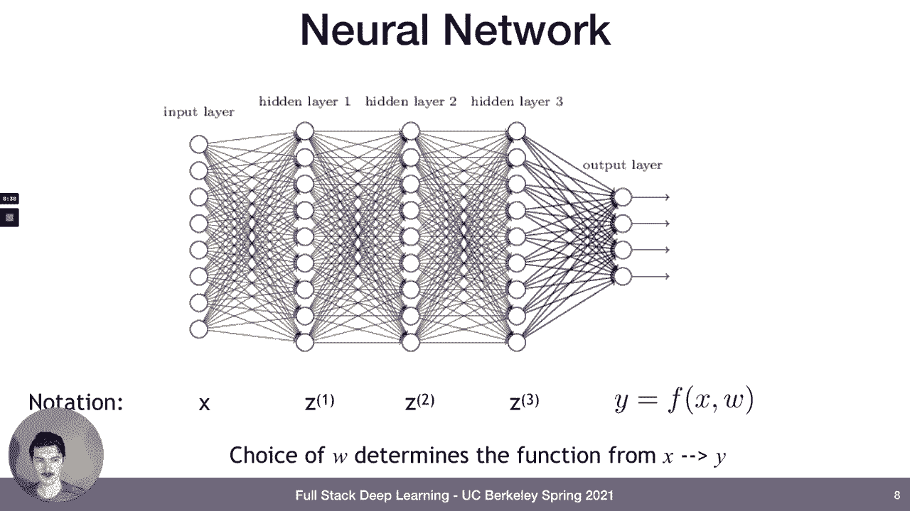

right y equals f of of x the input，and then w the setting of all the。

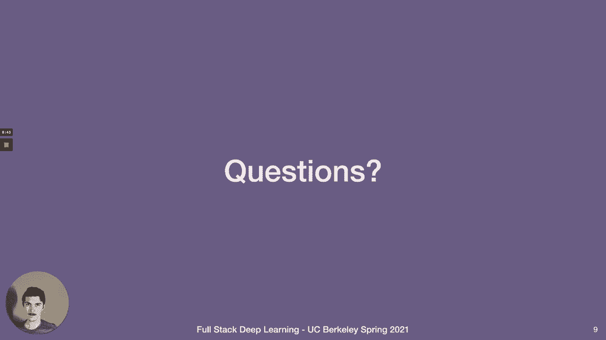

weights，let's look at this function on the left，f of x very，you know lots of peaks and valleys in。

here，how can we know if there's a neural，network that，and a choice of weights for it that can。

basically represent this function，and to summarize you know some，theoretical results。

you can prove that any two layer neural，networks that's one hidden layer。

right so inputs to one hidden layer two，outputs，can be found to have you know some set，of weights。

that can approximate any function so，that's known as the universal，approximation you know theorem。

and a little bit of intuition about why，that should be true，can be obtained if you go to that neural。

networks and deeplearning。com website，go to chapter four uh basically。

you can think of each one of the，perceptrons so you have a hidden layer。

of maybe thousands of perceptrons，or millions right and each one of them。

you can think of as an impulse function，that you know is either just kind of，adds a column。

right uh here the columns are in orange，the original function is in blue。

if there are enough of these columns and，they kind of go，up and down you can represent anything。

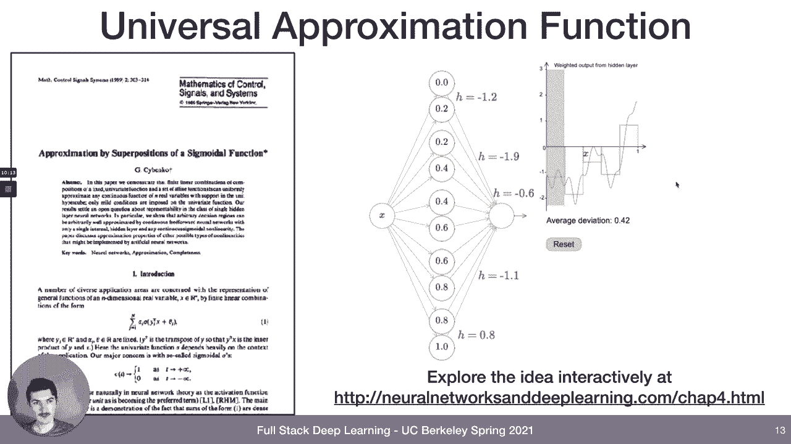

right it's almost like a fourier，transform of this function。

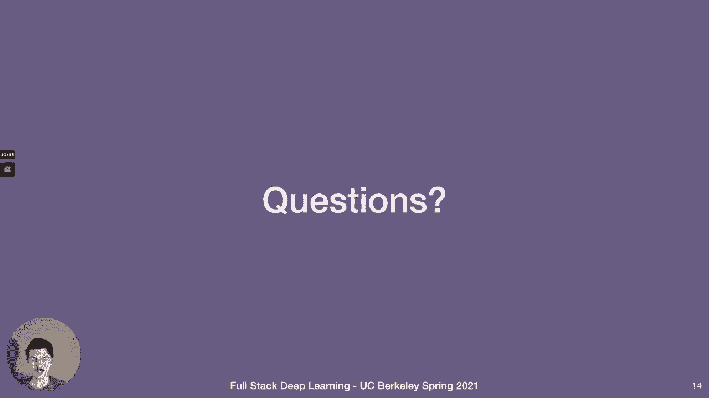

so that's quite interesting i think，i'll just pause for questions later um。

the takeaway is that neural networks are，just incredibly general。

and like at least theoretically you can，represent any function using in your。

network so what do we use neural，networks for，well we do for machine learning what。

kind of machine learning，problems are there there's three kind of，big you know。

a breakdown of all the machine learnings，out there you can have three categories。

supervised learning unsupervised，learning and reinforcement learning，there's also transfer learning。

meta learning you know imitation，learning all these，different types of learnings but these。

are the three big categories，so supervised learning actually，unsupervised learning you get。

unlabeled data x that means you know x，can be maybe，sound clips right or text like。

text strings but there's no nothing else，associated with them it's just the sound。

clips and the text strings，or images and the goal is really to。

learn the structure of that data so you，learn x，the reason you want to do it is because。

you can generate，generate，fake sound clips images or reviews，but you can also obtain insights into。

what the data might hold，so here's some fake text you know an。

amazon review that you can just generate，using a neural net，here is the concept of clustering so you。

have some data，you don't know anything about it you，don't have labels for it but just。

because of how it's，structured you might infer that there，are clusters。

right like some process gave rise to，this data such that，the data over here came from one process。

and the data over here came from another，process，and y，so x being the raw kind of input data。

and y being a label for it so now you，could have，could be，you know does it have a cat in it and。

the goal is to，learn a function that goes from x so an，image to y a label for it。

and the goal for that is just to be able，to make predictions，so if i get an image i can say it's a。

cat if i get a sound clip i might，be able to understand that it's a person。

you know speaking the words hey siri，and untold other examples of that and。

then reinforcement learning，the goal is to learn how to take actions。

so there's some kind of agent maybe a，robot maybe，a computer virus you know or or，something。

it can take actions it can maybe move，forward，it can you know look somewhere and，because。

when it takes an action you know reality，provides，it's，acting in an environment and you can。

interpret that environment，as basically providing a reward or not，to the agent。

and then changing the state that the，agent is in so like if a robot。

was in this place and then it took a，forward move in action，well now it's in this place and maybe。

there's a reward associated with it or，maybe not，you can train uh for example。

game playing agents using reinforcement，learning，so here it's like you know the action is。

place down a piece on the go board，and then the reward can be like did you。

eventually win the game or not，and the state is obviously just the，state of the of the go board。

so commercially viable is mostly，supervised，supervised learning right and then，reinforcing learning。

is definitely up next and um。

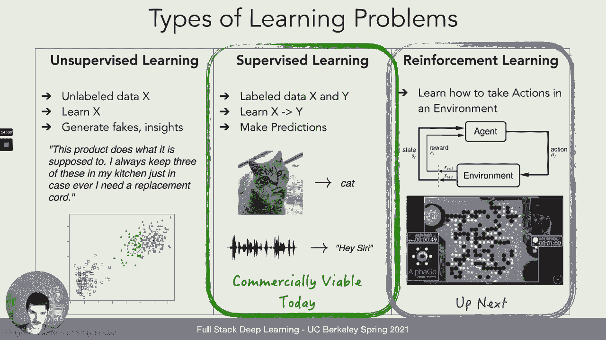

and and peter you know is working at，covariant。ai。

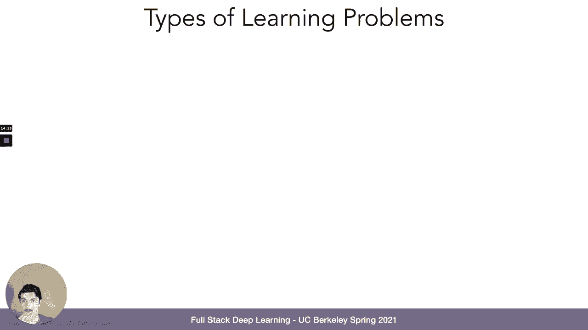

which is a company doing exactly that，but also unsupervised learning i would，say is also up next。

at this point with open ai for example，productizing gpt3 and all the things，that that enables。

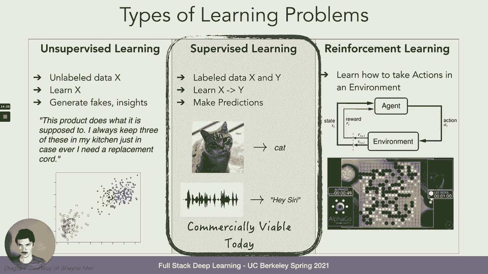

that would fall under unsupervised，well maybe i won't skip the unsupervised，learning。

so one example of an unsupervised，learning problem might be to just。

predict the next character in a string，of text，so there's a maybe a blog post by andre。

carpathi you've seen called char，rnn but it's basically using an rnn。

to feed in one character at a time and，then，the rnn can output also characters and。

what you end up learning is a language，model，that if you just kind of get it going。

with a word it'll just keep，writing just by generating character，after character and it's。

and it's very impressive what it can，output just with that simple。

uh another unsupervised learning problem，might be，just understanding word relationships so。

here the input would be，actually words in a vocabulary so like，imagine your vocabulary is 30 000。

different words so then each word would，be represented，one，in the place that corresponds to that。

word in in in like，some you know list of words well if you，feed in a bunch of those vectors。

into a system that's properly kind of，set up and trained，you can actually determine that there。

are certain relationships between words，such as like man to woman is。

as king as the queen right in the in the，canonical example，which is quite interesting um。

in computer vision land you can try to，predict the next pixel instead of the。

next character and text you can predict，the next pixel。

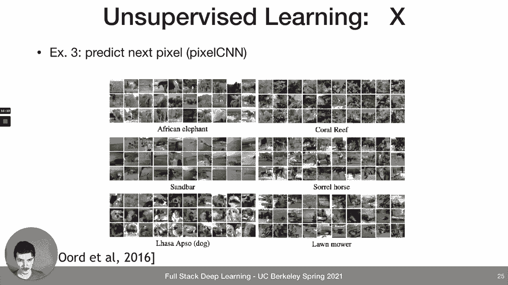

so you can get something going with just，a little bit of an image and then it。

you can you can train this kind of stuff，by for example，trying to compress an image down to like。

a very small representation，called the latent vector and then expand。

that latent vector back out to an image，and that can can learn a very compressed，representation。

and then lastly you know the culmination，of this line of research maybe。

is generative adversarial networks，gans so there the idea is that there's。

a generator which is like generating，this kind of fake images or text or，something。

but then also there's another model a，neural network called the discriminator。

and the goal of the discriminator is to，be able to tell apart，the generated images or pieces of text。

from actually real images or pieces of，text and the goal of the generator is to，produce。

images or text that can fool the。

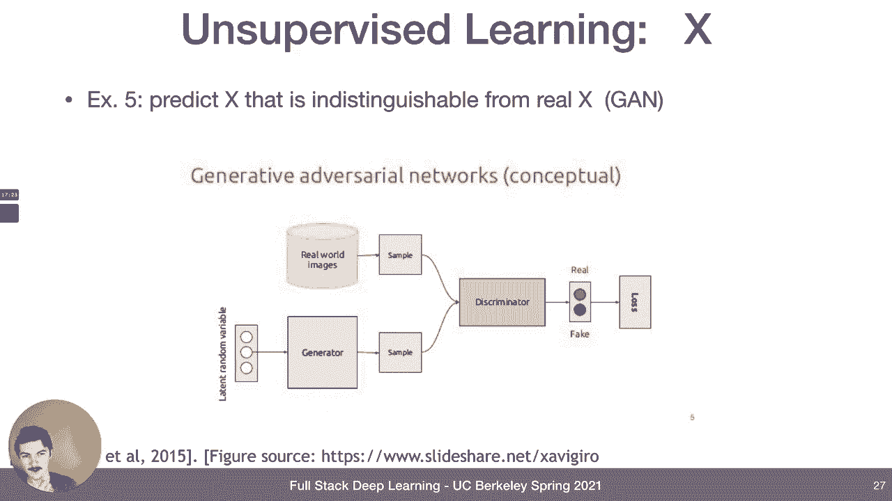

discriminator，and if you set up the system and you，train it，you get very impressive results that are。

getting impressive like more impressive，every year，i mean we've all seen deep fake videos。

at this point，and um if you go to this face does not，exist。

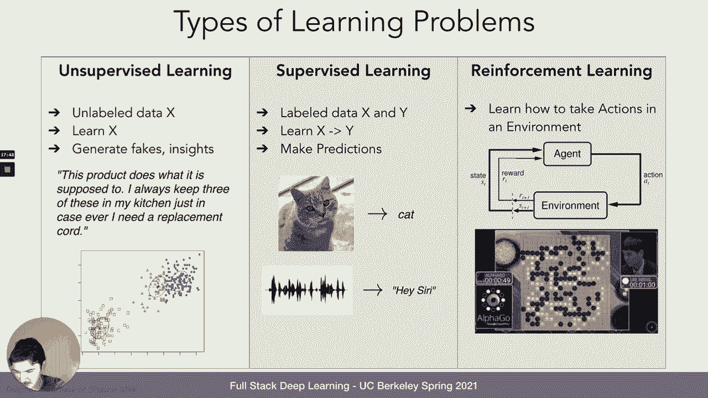

calm you'll see an infinite number of，game generated faces，that is really uh fun to look at。

i also saw this anime does not exist。com，today，and in reinforcement learning you have a。

lot of examples i think josh covered，some of them，so so next up let's talk about。

um what's known as risk minimization and，the concept of loss functions。

so let's talk about linear regression，for a second，um so linear regression is。

the so here i'm showing you what's known，as one-dimensional data right so there's。

one dimension on the x-axis there's some，number，and then there's another dimension on。

the y-axis and that's the output so it's，one-dimensional input data producing。

one-dimensional output and，the question we may want to ask is like，well if we get。

an input let's say it's 30，how can we predict what the output is，likely to be。

right given that all this data that，we've seen，when we see a new data piece but we only。

see the input part of it not not what，the output's supposed to be，can we predict what the output is。

supposed to be，and you can right and the mathematically，kind of robust way to do it is to put。

a line of best fit through this data，and the reason it's a line is because。

there's no reason to believe it should，be anything other than，align with like this kind of data but。

how do we find，what that line should be right so the，line will be。

able to tell us like if we feed in x，it'll give us y，because it'll multiply x by some number。

and then add another number，right so it'll be like ax plus b but。

what should a and b be set to right how，should we set this line。

well what we can do is we can minimize，the squared error，between all of the data points that。

we've observed，and some candidate line right so given，some line which is just defined by two。

numbers a and b，we can compute the squared error，on all the data that we've seen and it's，done。

as in as in this formula right here，um and then we can try to find the。

settings of the line you know a and b，parameters a and b，that minimize the squared error and。

that'll be the line of best fit，and more generally we can call this。

squaredair function a loss function，and our goal is to minimize the loss，function。

okay so we find the setting of weights，and biases like a and b，that minimize the loss function。

and this is the whole idea of empirical，risk minimization，now in neural nets the，function f。

given you know w and b weights and，biases，of x that's the neural net。

so weights and biases are the parameters，of the neural net，the loss function is can be you know。

mean squared air，or maybe it's some other type of loss，but that's。

basically how you would train or how you，would，determine whether neural network is。

solving the problem or not，and for classification，all that changes so regression being you。

try to predict from the input，to some real valued output，classification。

you predict from input to some，categorical output right so it's not，it's never going to be like，2。

3 as an output it'll be，exactly zero or exactly one or exactly。

two and these things will correspond to，like the label，of the data point and for that we。

typically use cross entropy loss，and you will learn a lot about this in，the reading this week。

okay so we have the loss function so we，can kind of see like all right if we。

have some weights we can understand how，good or bad，the the model is but how what do we。

actually do with that，right well our goal is to find the，weights and biases that optimize。

this function as in minimize the loss，and it might be a crazy looking function。

right of the this loss this loss，function given the data might be。

quite crazy looking what we can do is we，can，update each weight by。

setting it to the current setting of the，weight，okay minus some alpha which is。

can be called the learning rate and then，the gradient，of the loss function with regard to the，weight。

so we have some random parameters，we uh evaluate them，on the data that we observed we obtain。

we we can compute the loss function and，then in order to improve。

the fit of the neural net to the data we，will update each weight，by doing this we'll just subtract。

the gradient of the loss function，with respect to that weight multiplied，by some learning rate。

that's all there is to it and uh the way，we want to do it is we always want to。

move in the direction of kind of，steepest，there's some tricks to making sure that，if。

you know if if your data is lives in，like some part of the，space that's kind of smaller than it。

could be，gradient descent will have a tougher，time，than if the data was what's known as。

well condition which means that it，usually has kind of zero mean and equal。

variance in all dimensions，because that gives the gradient to sound，kind of the most。

so we can talk about weight，initialization we can talk about，normalization。

these are all first order methods the，the gradient descent being you compute，the gradient。

right first order gradient and then you，just update the weight。

with that gradient there's also second，order methods right where you can，compute。

the second order derivative of the loss，function with regard to the weight。

but we don't typically use them because，they're very computationally intensive。

but there are some approximate second，order methods that can play a role in。

training neural networks more quickly，and if you just remember the name adam，right that would be。

the optimizer we're going to use in the，labs and that's，what it's trying to do approximate。

second order，and lastly we could look at all the data，we've ever seen。

compute the loss update each weight but，in practice it might be better to。

actually compute the gradient on just a，subset of the data not the entire data。

so this is known as batch gradient，descent or stochastic gradient descent。

and stochastic gradient descent，might use a batch of just size one right。

so you you look at one data point，you compute the loss on it and you，update all weights。

with just that loss and then you look at，the next example，so that's known as the cast of gradient。

descent and the reason，to do it is because it's a lot less，compute per。

step right you don't have to go through，all the data you have a million images，on imagenet。

just to update the weights the first，time you can just look at，32 images compute the loss update the。

weights，and then the next batch of 32 you look，at the model is going to be a little。

better suited to the data so，it's going to train faster using less，compute。

but it is more noisy um but basically，it's what we do，so back propagation um。

is something that we can talk about now，because，we've reduced the whole concept of。

learning to just optimizing a loss，function，right we're just trying to find weights。

and biases that that minimize this loss，function，and we figured out how we can do it with。

stochastic gradient descent，which we can do by basically taking the，batch of data。

computing the loss function on it，computing the gradient of every weight。

with respect to that loss function，and then updating every weight with that，gradient。

times some learning rate alpha but how，do we efficiently compute these，gradients。

you know it's easy to say well we'll，compute the gradient how do we actually，do it。

so gradients just another word for，derivatives and derivatives。

you've seen in your calculus class right，it's just it，you know you can do it symbolically you。

can figure out given a function what its，gradient is，but the neural net is never just like。

you know e to the power of x or，something like that it's never going to。

be that easy to compute its gradient，is made，up of computations where each of the。

computations does have a gradient，because it's，maybe just a linear function like ax，plus b right。

that does have a gradient and then we，can apply the chain rule。

for everything such that we can get the，gradient，of the loss function with respect to the，weight。

way at the bottom of the neural network，very far away from the loss function。

just by kind of chaining it through all，of the layers of the neural net。

and that is called back propagation，right，and the good news is that we don't have。

to even code up the derivatives，ourselves，because we use automatic differentiation，software。

so that's like pi torch or tensorflow or，basically anything else you're likely to，see。

will compute the gradients for you so，all you need to do is just program。

the forward function like f of x，you know given weights w and then pi。

torch will automatically compute the，gradients for you，so the simplest neural net architecture。

is what we've been talking about，also known as a multi-layer perceptron。

it's literally just perceptrons arranged，in layers，um that's all it is sometimes this is。

called a fully connected，layer instead of instead of a，um and we know that that's really。

all we theoretically need to represent，any kind of function，but we might need like an infinitely。

large such network and we might need an，extremely large amount of data。

to actually learn the weights that will，do the right thing，so what we can do instead is we can。

encode knowledge that we have about the，world，into the architecture of the neural net。

so for example for computer vision，we use convolutional networks and what，that means is that。

it's a set of weights that are kind of，tied together and so no matter where in。

the input they're applied，they're always in a structure that's，local。

which is actually what happens in our，eye which we know from，you know studies of the eye and the。

brain and it's also what makes sense for，the world because the world is composed。

of objects that don't radically change，as you move around them and as they get。

closer to you right it's an，edge is going to be an edge even if it's。

closer to you it doesn't it doesn't，change，and for sequence processing like in。

natural language processing，we use often recurrent networks which，have temporal invariance。

which is something that's usually true，the the rules of language don't change，as the sequence。

wears on the rules are going to be the，are，and so your neural network can kind of，know that。

by being structured in a certain way，and then when we optimize these neural，networks。

well we can have let's say 10 layers，where each layer is not so wide。

so maybe it only has like you know 10，channels but there's 100 layers。

or we might have 10 layers but each one，has 100 channels that's like depth over，width。

which one is better well that kind of，depends on like empirically what we've，observed。

there's no theory that really can help，you out here，but certain things work better in。

practice and so part of being a deep，learning practitioner，is just really kind of obtaining that。

knowledge by doing it by reading papers，taking courses like this skip。

connections you can connect the input，kind of around the layer that's。

processing it so that the output of the，layer is added to the input itself。

and that tends to help a lot in in back，propagation，there's all kinds of tricks that we're。

and lastly why exactly you know did，things kick off in 2013 we had bigger，data sets。

but we also got good libraries for，matrix computation on gpus。

particularly with nvidia cuda right and，that's，using graphical processing units which，had。

you know until this point been only used，for gaming，but with this cuda library being。

released by nvidia，you could use that graphical processing，unit to just do general matrix。

computations，which was very applicable to a lot of，scientific computing。

including deep learning and the reason，it's so crucial for deep learning。

is because all the computations in，neural networks，all the computations that we've seen are。

just matrix multiplications，and matrix multiplications are easy to。

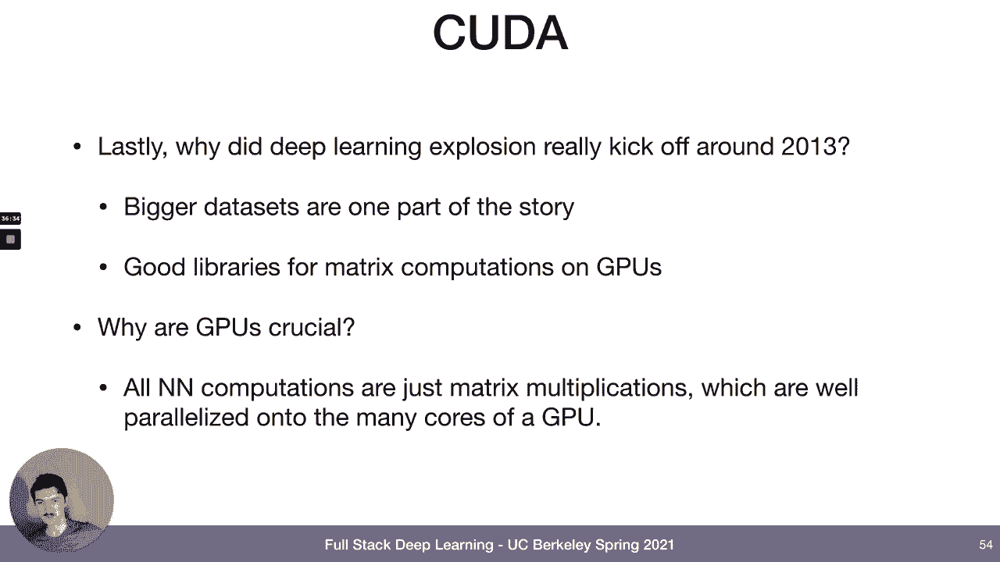