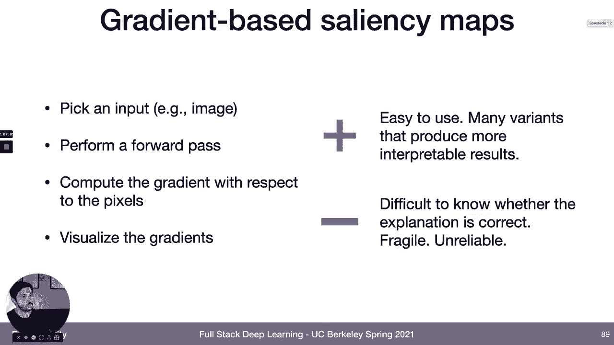
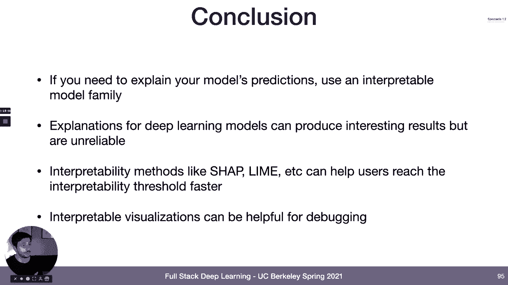

# 【双语字幕+资料下载】伯克利FSDL ｜ 全栈深度学习训练营(2021最新·完整版) - P20：L10B- 机器学习可解释性 - ShowMeAI - BV1iL411t7jE

maybe i'll just power through them next，thing i'm going to talk about is。

explainable and interpretable ai okay so，this is，maybe a buzzword that many of you have。

heard so one thing we're going to talk，about is，what does this even really mean so i'm。

going to propose some definitions，caveat here is that these are not really。

like industry standard definitions，as far as i can tell the terms，explainability and。

interpretability are often used very，loosely and are often used。

interchangeably that being said i think，that there's，like actually a real distinction that。

can be made between different types of，interpretability and explainability and。

some of the other concepts that we've，been talking about and so，i'm going to use some definitions to。

help like make that conversation a，little bit clearer the first definition。

which is actually which is very much not，industry standard this is just one that。

i came up with when i was making this，lecture is idea of domain predictability。

and so what i mean by domain，predictability is the degree to which，it's possible to。

tell when you get a new data point or，when you get some new data points。

whether that data is outside of the，circle of competence of your model。

how knowable is it what data your model，will perform well on，or where it might where there's very。

good chances it won't perform well next，definition，is interpretability and so when i say。

interpretability what i，mean is the degree to which we as a，human can。

predict what result the model will have，on this data so it's about how well can。

i end like how good a model do i have in，my head，of what this model is doing can i。

predict whether like what it's going to，do on this data，and then the third definition is。

explainability and so when i say，explainability what i'm going to mean is。

the degree to which a human can，understand not only predict，what the model would do on this data but。

also understand the cause，of the decision that the model is going，about is。

i'm going to give a very high level，overview of some of the different，categories。

of techniques that that you can use，to try to make or that have been，proposed to try to make models。

explainable or interpretable，in the literature and we'll talk a，little bit for each of them。

as which of those definitions they，correspond to and so the categories that。

we're going to talk about are，using interpretable families of models。

so using families that are inherently，interpretable distilling complex models，down into。

simpler ones that are interpretable，understanding the contribution that。

individual features or feature values，make to the prediction understanding。

the contribution and then understanding，the contribution that individual data。

okay so using interpretable families and，models so，some interpretable families of models。

are linear regression logistic，regression，more generalized linear models and。

decision trees right so these are，interpretable families of models because。

if you understand the math of how these，models work then it's pretty easy to。

understand like why they made a certain，decision for a linear regression for a。

logistic regression model you're，multiplying a weight matrix by vector，and so you can understand the。

contribution to the to the output of the，different feature values and。

weights and then that's your explanation，that's literally how the model。

made the decision so the big benefit of，these types of models is that。

they're both interpretable and they're，in some sense like actually truly，explainable。

with the caveat that they're really only，explainable to the right user so if you。

have studied linear regression，and you have a regression model and that，model makes prediction。

you can understand the cause of why the，prediction was，like a certain thing if you're giving if。

you're giving that as an explanation to，to a user that is non-technical for。

example that might not actually be a，big disadvantage of these categories and。

models is that they tend not to be very，class，you'll notice that there's no deep。

learning models in this category one，thing that you might ask is what about。

attention isn't attention，interpretable because one thing that you。

can do is you can you can visualize the，attention map，so you can look at like for each output。

that the model is producing whether it's，text or or something else，let's actually just visualize the。

attention weights on the input data，and maybe that's our explanation for why。

the model made the prediction so，the nice thing about this is i think，this is actually like pretty。

this，i think this is this can be a very，helpful tool for，building intuition about why a model，makes。

like what kinds of predictions a model，is going to make on certain types of。

data big drawback here is that，i think using this as uh，as a way to get explainability so。

understanding of why certain predictions，are made，is a trap that a lot of people。

will fall into so the reason why，attention maps do not produce，explanations is because。

so a couple reasons one is they're not，complete explanations，right so in the example we looked at。

before let's look at the，the kind of top middle image example，where we have a dog。

that is standing on a hardwood floor and，you look at the attention map that that，corresponds to。

it's the dog first of all the dog's not，actually standing so，there's something going on there it's。

not quite right and then second of all，it's the attention map is like pointing，mostly to the dog。

so i i think i get why it says a dog but，it doesn't really，and then i see how there's a little bit。

of like a lighter area on the hardwood，floor so i could see why there's a，hardwood floor but。

i have no idea why it says it's standing，and i have no idea why。

you know why there's like some weights，like，cloth fabric of the couch that the dog。

is lying under so one issue with using，attention for explainability is that。

it does not produce complete，explanations another problem with using，attention for。

explainability is that the explanations，that it does produce，are not reliable there's a a paper that。

explored among other things like whether，these types of attention，maps change under like。

different types of evidence that you're，trying to ask them all to explain，and。

so for example like in this image of a，siberian husky，they asked the model to explain what is。

the evidence for，this animal being a husky or what is，this animal what is the evidence for。

this being a flute and the model had，almost exactly the same attention maps。

right so attention maps just show you，what the model is looking at that is not，the same thing as。

why it's making the decision it's making，them so i think a lot of people really。

complete these like in popular，and，so this is a pet peeve of mine attention。

maps are not explanations so we talked，about interpretable families and models。

next thing that next category of，techniques that is worth looking at is。

instead of just starting with a simple，model and training that and using the。

interpretation that comes alongside that，let's start with a complicated model。

that solves the task that we want to，solve，and then let's distill it down to an。

interpretable one that we can use，to create interpretations and so the。

main category of techniques here，is centers around surrogate models so。

the idea behind surrogate models is that，you have once you train the model that。

is actually going to do your prediction，task，then you take the data it was trained on，and you train。

a another model a simpler more simpler，typically，what you'll do is instead of training。

the model to predict the actual labels，which would just be the same as like。

training an interpretable model from，scratch，instead you'll train the interpretable。

model to predict the，predictions of the model that you，actually care about so you'll train a。

model that maps，inputs to predictions，of another model and then when it comes。

time to interpret the model's，predictions，you will use the surrogate's。

interpretation as a proxy for trying to，understand the underlying model nice。

thing about this technique，maybe the main nice thing i can find to。

say about it is that it's very easy to，use it's very general，works for any model you can just fit a。

surrogate model to it big question mark，here in my mind is，if your circuit is really good like why。

don't you just use that，right why don't you just use that as，your model and if it's not very good。

right if the surrogate doesn't do a very，good job of accurately predicting。

the predictions that your underlying，model made，then why should you trust its。

interpretations at all and then on top，of that like，maybe in a more existential way if your。

aim is for explainability not，interpretability，then how do we know you know if our goal。

is to understand why a decision was made，how do we know that the simpler model。

makes the decision in the same way that，another category of surrogate models，is。

local circuit models and the most common，technique here is called lime。

the way that these work is that instead，of trying to explain the model globally。

instead what you do is you pick a data，point and you say i want to create a。

local explanation around this data point，and the way that you create that local。

explanation is you you take that data，point and you perturb it around。

in the input space you you sample values，from around the value of that input data，point。

and then you run your prediction model，on all those perturbed data points。

and then you fit a surrogate model a，simple model linear model or a decision，tree。

to the mapping between those perturbed，data points and，the prediction that your original model。

so this kind of makes more sense，conceptually to me than than trying to，train a global。

surrogate model because it's at least，reasonable to believe that。

you're around in the neighborhood around，some data point，that your surrogate model should do，well。

as your global model does right because，your global model is trying to solve a，much harder task。

than the surrogate model is trying to，solve this technique i think is like。

pretty widely used in practice，from what i've seen like for folks that。

are doing interpretability it seems to，be one of the most common ones。

and one of the other nice things is that，it works for almost every data type so。

there's extensions of this，for text data and image data as well and，that'll get you nice。

maps that show you like what parts of，the data like that explain。

the challenge with lime is that it can，be really hard to define these。

perturbations so how do you sample data，points from around，your original data point like what is。

the right neighborhood what's the right，distribution and then，in practice there's some research。

showing that the explanations that are，produced，by these these circuit models are pretty，unstable。

so if you make small changes to the，input conditions it can，produce big changes to the explanations。

and as a result of that they can also be，pretty easily manipulated。

so if someone knows that you're using，the explanations to make a decision it's。

not that hard for them to choose the，input conditions，to produce the explanation that they。

want but that's local circuit model，slime，okay so we talked about interpretable。

families and models we talked about，distilling models down to interpretable。

models next kind of category of，techniques and there's a lot in this，category。

is trying to understand the contribution，that your input features make。

to the production of the to producing，the prediction，so one way that you can do this is。

through data visualization so there's a，couple of types of plots。

that people use here one is a partial，dependence plot where you。

you look at the values of a particular，feature，and then you kind of correlate those。

against the output values，of your prediction function and so you。

can see okay where how much does the，prediction function change as i change，this one input feature。

where does it change what is the what，does that function look like。

and then there's another visualization，that is some will commonly use called，individual conditional。

expectation which is doing a similar，thing which is like looking at the。

how the value of a particular feature，corresponds，to the probability or like the result of。

the model's prediction，but instead it's doing this kind of like，messy looking visualization where。

it produces one line for each data point，individually so you can。

start to get a sense of the distribution，of how these things evolve。

in terms of more like numerical ways to，evaluate the importance of features。

one common one is permutation future，importance，the way that this works it's pretty。

simple you pick a feature that you want，to measure the importance of，and then you basically。

apply a permutation to that in your data，set so you randomize the order of that。

feature in your data set，and then you evaluate your model on the。

original data set with the order of that，particular feature randomized。

and you see how much that degrades the，performance this is another technique。

that's really easy to use and，relatively widely used in practice it。

can give you decent proxies for like how，important different features are。

challenges with it are it doesn't really，work very well for high dimensional data。

so if you're working with images you，probably don't really care too much。

about the individual feature importance，of a particular pixel。

in your image and it also doesn't really，capture the dependence between features。

but it is a useful tool to have in the，there's a more principled approach to to，trying to。

explain the importance of an individual，feature to the model's predictions。

called shop and so i'm not going to，cover this in detail today but。

the the very very high level explanation，for what shap does，is that you're trying to measure how。

much，the presence of this feature so think，about this in the case of binary。

classification like whether this feature，is one or zero how much does that affect。

the value of the classifier，independent of what other features are，present so。

you're controlling for the values of all，the other features and then you're，testing。

how much a change in this feature，affects the performance of the model the，nice things about this。

method is that it also works for a，variety of data there's extensions for，image data。

text data it's pretty mathematically，principled you get you get，feature importances that are like。

normalized and，add up to one which is nice the，disadvantage is that it's pretty tricky。

to implement and，still doesn't it's still really more of，an interpretability tool than anything。

else but this is another like pretty，widely used，interpretability technique in practice。

saliency maps are another common way of，evaluating feature importance one of the。

most common tech uh classes of，saliency maps is gradient based saliency，maps。

the way that these work at a very high，level is you pick some input like for。

particularly particular input value say，you pick a particular image。

you perform a forward pass of your model，and then you take the gradient of that。

output with respect to the pixels，and visualize that gradient so what，you're measuring is。

is how much does a unit change in the，value of each of my pixels。

affect the prediction that the model，makes and that's where you're computing。

nice thing about this is it's easy to，use there's many variants that produce。

like more interpretable results more，principled results，a lot of techniques in this category。

pretty widely used，at least in the research world the，challenge here is i think similar to the。

challenge with，using attention as a as an explanation，right which is that how do you actually，know。

whether this is the correct explanation，what is the correspondence between this，explanation and。

the actual way that my model is making，predictions and on top of that it's，changes。

okay so that's a very quick kind of，lightning overview of some of the main，categories。

of interpretability and explainability。

techniques there's，a good book on this online that i will，link to at the end of the slides。

so zooming out a little bit we talked a，little bit about different definitions，of。

interpretability or explainability or，just reliability of models，then we talked about some of the。

techniques just give you a very quick，flavor of what are some of the，techniques out there to make。

models interpretable or explainable oh，sorry one more class of techniques。

that's worth mentioning which is，trying to understand the contribution，instead of features。

to the prediction instead understand the，contribution of individual data points，to the prediction。

so what are the important data points to，to this model or to this，even to this prediction itself two。

classes of techniques here that i'm not，going to go into detail on because。

they're not commonly used yet as far as，i can tell in deep learning but are more。

common in traditional ml，one is prototypes and criticisms where，points，which。

are at a very high level like clusters，that explain，a lot of the variants of the data set。

and then criticisms which are data，points that are not very well explained。

by the prototypes so that's one category，of techniques that，is used in machine learning maybe not a。

ton of it yet in deep learning and then，influential instances so essentially。

like looking for data points，where if they were removed from the data。

set it would cause a big change in the，classifier that ends up getting created。

those are other just like categories，explainability techniques that are worth。

knowing about in the abstract if they，okay but getting back to the point i was。

making i think the high level question，that i always ask myself with these。

techniques is is explainability really，the right goal，when people say explainable ai we're。

trying to do we're trying to build，models that are interpretable or，explainable。

why is that and like how does that map，to the actual techniques that we should。

choose so there's a few different，reasons why you might want your。

model to be explainable right so one is，that in some industries uh the，regulators。

the regulators just say your model needs，to be explainable，and so i think the the rational response。

to that is what do you mean by that what，does it really mean for a model to be，explainable。

um not sure anyone really has a great，answer to this but i think maybe the。

pragmatic response is you should，probably do some explainability to。

make sure that you're in compliance with，the regulators another reason why people。

give for wanting explainability is，because they say，my users want want explainability right。

like they want to trust them all as，predictions and so they need。

us to be able to explain why the model，is making the predictions that it's。

making so a couple of things to think，about here，one is is it the the model doesn't，really exist。

in isolation when it's interacting with，users good product design，can alleviate some need for。

explainability by，helping helping have guardrails around，that。

users are more likely to trust the ones，simple as，if you're if you're like if you're。

working with doctors let's say like just，allowing them to override the，predictions a design。

choice like that in your product could，make it a lot neces less necessary to。

have really good explanations of the，decision the model is making，[Music]。

another consideration here is coming，back to the discussion that we had，earlier so。

how often are your users going to be，interacting with the model so i think，when people like。

think about the need for explainability，so we really need，to be able to understand why the model。

made the prediction that it made，i think the place where users actually，really need that。

is when like they're interacting with，the model very infrequently。

so if you're like if there's a model，that is like making a big decision，or not。

or for a mortgage or not and that mod，that decision decisions being made by a，machine learning model。

that decision has a big impact on the，user and the user doesn't doesn't get to。

play around with that model and，understand，why it makes certain predictions then。

being able to have a good explanation a，reliable explanation for why that，prediction was made。

could be really important on the other，hand if，you're in a situation where your users。

are going to be interacting with your，models a lot，so you know if it's a recommender system。

or if it's，something along those lines then i would，just ask yourself the question of。

maybe what we really should be going，here for here is like，good interpretability techniques so like。

good techniques to help，our users build intuition about what，types of things the model does well and。

doesn't do well，and at the extreme if like your model is，really only going to be used or。

primarily going to be interacted with by，like machine learning developers who are。

going to interact with the model a ton，another reason that people give for。

needing explainability is that i don't，know if i should trust my model like how。

do i decide whether i'm really confident，enough in this model to deploy into。

production and here i think is like，where i take，issue with the use of the term。

explainability or like the goal of，having of having models that are。

explainable are predictable because i，think what you really want here。

is domain predictability right if you're，an engineer building a system deciding。

whether to deploy into production，the question that you really want an，answer to is am i confident。

that i have a good performance envelope，around this model，right where if something goes wrong in。

the inputs to the model or to the data，that the model is consuming。

then i want to know i don't want there，to be，i want there to be as few like unknown。

unknowns there as possible so i think in，my mind that's a separate goal。

then having been really trying to，explain the model's predictions or have。

interpretable understanding of the，model's performance that being said。

some of the visualizations that are，created in the interpretability。

literature could be helpful for building，for creating domain predictability or。

even just for debugging when things go，wrong so that doesn't mean that this is，not a useful field。

if you're in the category of trying to，create domain predictability。

one other question i want to touch on is，models，and the conclusion that i've come to。

here as a non-expert in this field but，someone who has been trying to pay。

attention to it for the past couple，years is，not really right none of the known，methods。

that we have for explaining or even，interpreting the predictions that models，make。

are really that faithful to the original，model performance，or at least not faithful to the original。

model performance in a reliable way like，it's very easy to use these techniques。

to cherry pick examples of oh，i see saliency maps that show me that，when it。

predicts that this is a ball in a field，but that doesn't necessarily mean that。

those saliency maps are going to be，useful for every single prediction that。

the model is making and on top of that，i guess related to that is that these。

explanation methods tend to be pretty，unreliable right so they tend to be a，little bit fragile。

sensitive to inputs and things like that，and they really don't as i alluded to，before they。

don't in general like fully explain the，model's decisions，so even if you have a faithful。

interpretation that is reliable，oftentimes that visualization like that。

saliency map or that attention map，only tells you part of the story of why。

the model made the decision that it made，so the conclusion that i have reached。

and you all should read some of the，links that we have，decision。

is that explainability is not really a，realistic goal，for deep learning systems right now。

in you know mid-2021 i think there's a，lot that we can do to make。

deep learning systems more interpretable，and that might be a worthy goal。

if that is something that contributes to，the project that you're trying to create。

and so the in conclusion like what i，would say about explainability and，interpretability is。

if you really need if you genuinely need，to explain your model's predictions if。

you genuinely need to understand，why model predicted things in a certain，way then。

really the only answer is right now is，to use，families of models that are interpreted。

to begin with so linear models，decision trees things like that and。

you can try to explain deep learning，models you can even train a model。

on the weights of a deep learning model，to output an，explanation sentence there's like all。

kinds of things that you can try here，and those can produce really cool。

results and has a really interesting，research direction，but it's quite unreliable and not ready。

for production，if the goal is true explainability in my，opinion。

interpretability methods like shap and，lime in particular，seem to be the ones that are used most。

in production one thing that those i，think those are really useful for and。

where i would strongly consider using，them in a production system is。

in helping the users of your models make，quicker get to their threshold of。

interpretability that they need to，trust them all as predictions faster。

those visualizations can help them，build intuition about model performance。

and on top of that like that's none of，this i'm somewhat skeptical of。

the the value of this field as applied，to deep learning in particular。

but none of that is to say that that，these visualizations，are not useful in fact i think many of。

the visualizations that are created here，can be useful for things like debugging。

and like prioritizing where to improve，model performance i'm just not sure that。

they're really ready to produce。

like accurate explanations of model。

