# P21：【Lab8】测试与持续集成 - ShowMeAI - BV1iL411t7jE

hey everyone we're doing lab 8 today，testing and continuous integration we're，going to add linting。

add prediction system tests add an，evaluation test，and add a training system test set up，continuous。

integration we're going to run all these，tests every time we push。

to our repo we'll use circle ci for that，in order to follow along please get，pulled。

if you are on your own system then don't，forget to activate the environment。

and then make pip tools the reason to do，this is to upgrade the。

packages um we've upgraded the versions，of some packages，so this will get you the latest versions。

finally going to lab eight，okay so there's some new files and uh，just as an overview。

um we have in the top level repo we have，a circle ci，config and then the lab a directory that。

we're in right now，we have some files that specify linting，some files that specify functionality。

some files that specify，evaluation some files that specify，infrastructure tests。

we'll go through them in sequence so，first linting，this refers to checking code files for。

style documentation，and some basic bugs using static，analysis，and this is really necessary if you're。

working in a multi-developer code base，because，otherwise people are going to be arguing。

about different，code style like conventions might differ，between people。

and there's certain bugs that are just，easily caught using static analysis that。

you would otherwise only find in runtime，so well worth setting up。

we have a file that kind of sets it all，up for us tasks，slash lint if we look at that。

it's a shell script bash script，that runs safety pyland，pi code style pi doc style my pi bandit。

shell check，if either one of them fails，except for safety then the whole。

linting will fail if they all pass then，it says linking past。

okay what do they all do so safety scans，python package，dependencies for security，vulnerabilities。

pyland does static analysis，for kind of like some bugs but also for，style。

pi code style is only about style it，somewhat overlaps with pyland but it has，some guidelines that。

pylon doesn't check for so we might as，well have it，pi dog style looks at doc strings the。

documentation of your functions and，classes and，modules pie，is probably the most interesting because。

it uses the，static type hints and does，type checking so if you call a function。

that expects for example，that，as a as an error um，bandit find some common security。

vulnerabilities in python like using，eval，and then shellcheck does linting for，bash scripts。

by the way when you when you write bash，script i like this guide that i linked，to。

because it's usually not a skill that，that that we bring to the table as data。

scientists but it's very useful，so these lenders are configured in，several files。

most notably dot pylon rc，setup cfg we can take a look at what，they look like。

they are in the lab a directory，there is just kind of specifies the max，line length。

what messages we want to disable some，and lastly we actually can also use an，automated。

formatter it's called black and this，will when you apply it to，to uh your python files and you can。

actually set up your code editor，to automatically apply it every time you，save it will。

perform a bunch of changes that make，things，look very uniform across different。

developers so for example，it'll replace single quotes with double，quotes。

you know usually it will enforce line，length limits，it will you know indent。

over long method calls and so on in the，in a very，specific way so。

it's pylon compatible so it's worth，using。

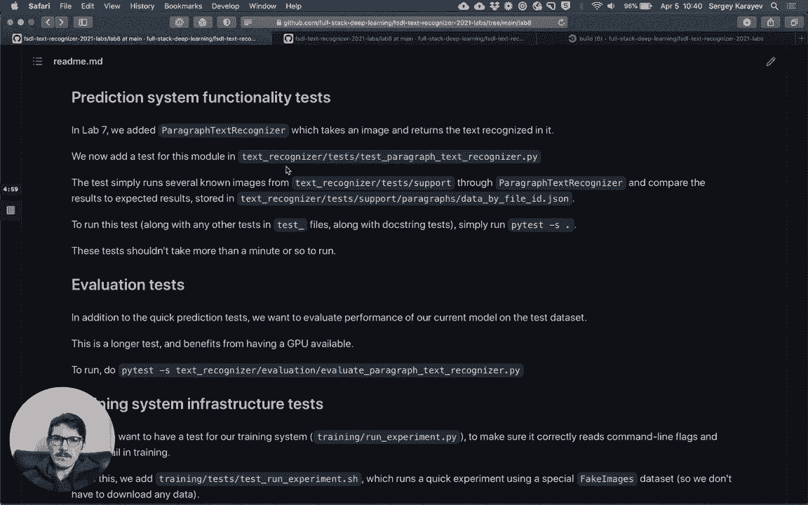

okay so that's linting the next thing i，want to talk about，is system functionality test and it's。

actually worth。

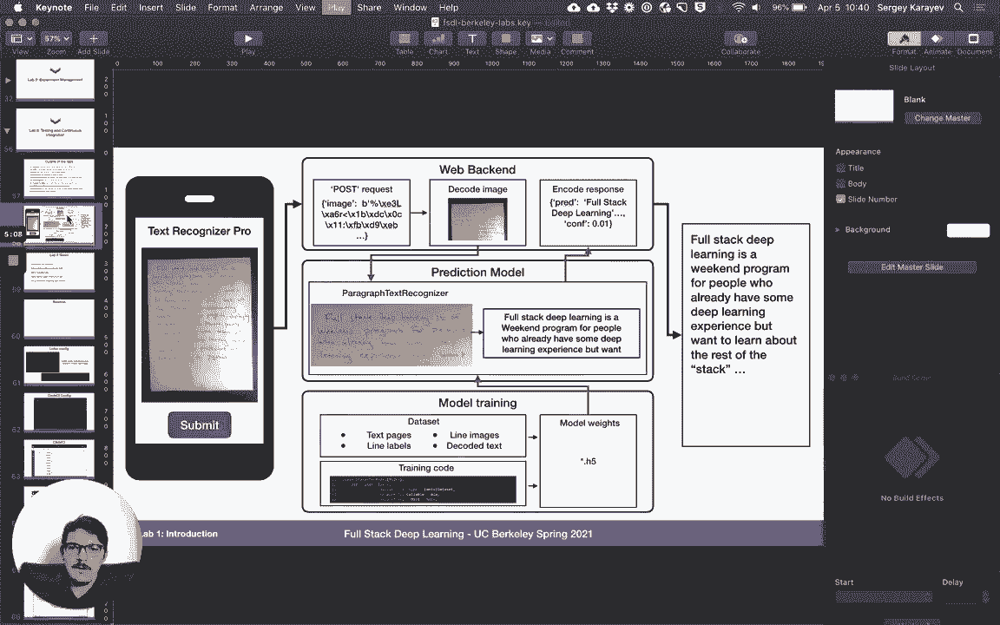

taking a look at what we are doing，so remember we have we're developing，this basically。

application where you take a picture of，um，some amount of handwriting and it，returns。

the text that's in it and we have，modules within our code base。

a module for model training the actual，prediction model，and then the web back the web back end。

and there's going to be tests for。

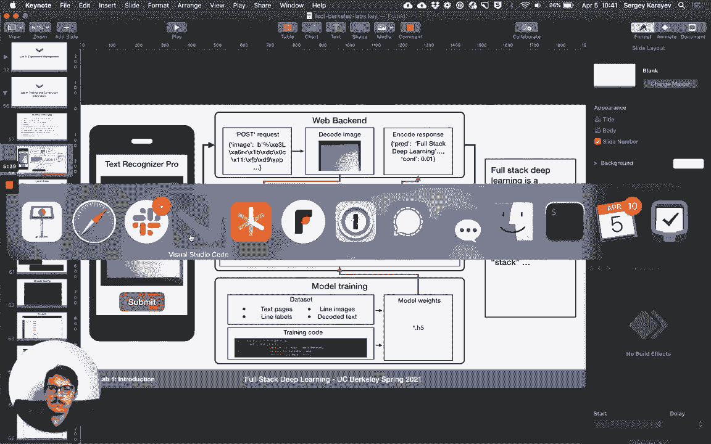

so in lab 7 the previous lab we added，paragraph text recognizer which takes an。

image and then returns the text，within it and so in this lab we're going。

to add a test for this module，and the test is going to go in text，recognizer。

test test paragraph text recognizer，the first thing we do is we disable cuda。

so we don't use gpu and testing，you can use gpu and testing but then it。

might interfere with the training，and uh your production is likely not to，be on the gpu so it's。

just i like to do this and then here's，the test，so we basically have some support files。

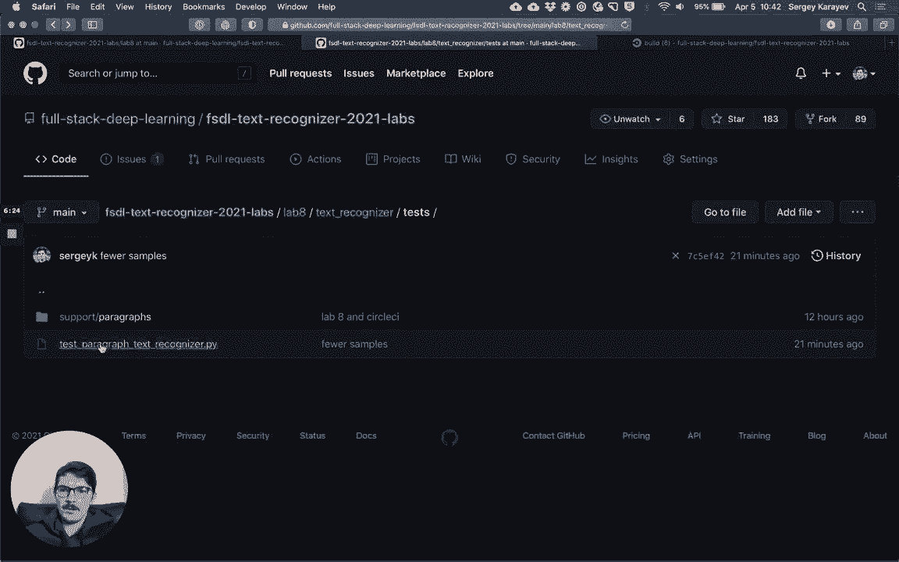

which are in。

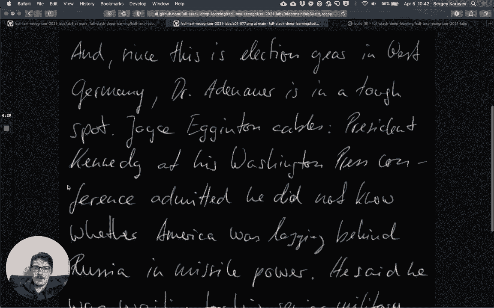

the support section which are just，images the images that we might expect，to get。

in production use case and this is，actually from the im data set。

and then we have a json file that for，each image specifies，what the ground truth text is and kind。

of like the error rate that we expect，and that's all the test does is it，basically just。

runs those support files through，the paragraph recognizer and then。

checks that the predicted text matches，what we expect at the。

the character error rate matches what we，expect，and then also reports how long it took，okay。

and the goal for these tests is they，shouldn't take more than a minute。

you know or a few to run so that we can，run them pretty frequently。

this is in text recognizer evaluation，so it's evaluate paragraph text。

recognizer so this one is longer so we，actually do want to use the gpu for it。

because we're going to evaluate our，paragraph text recognizer，which if you remember like loads our。

trained weights and the trained config，on the i am paragraph test data set。

and at the end it'll report the，character error rate，and the time taken and it'll assert that。

the character error rate is less than，what we expect，and the time taken is less than what we。

expect and，um right now our model is expected to be，like 17 percent。

character error rate so we hope to get，no less than，and that this test is pretty simple we。

just load the data set，we load the paragraph text recognizer，which is a。

pythora's lightning model as you，remember and so we can use the pythorac，lightning trainer。

lastly we want a training system test we，call them infrastructure tests。

and this is in training slash test slash，test run experiment，let's go ahead and find that training。

here's our run experiment and now we，have a test for it，and what this does is it actually runs。

the python command line，and it just runs on this new data set，called fake image data。

data module which just，so that we don't have to download um，real data and spend time doing it this。

data set just serves up kind of like，synthetic images，we train a confnet we give it some。

parameters so that，tests for the understanding of，parameters here。

and we just train for some number of，epochs，and we just see that this finishes，successfully。

it's really not checking for correctness，it's just checking that we're able to，train。

because some bugs you might introduce，some bugs that actually make your，training system like not。

train this just checks for that we can，improve this by making sure that it，actually trains。

some kind of high accuracy model on this，data，but you can do that at home if you want，to。

okay and lastly we set up，this to run continuously every time we，push code。

upstream to our github repo we're going，to use circleci，to set this up we're going to fork。

the repository so when we're in this，repository，we can click this fork button and that。

will let us fork it to，our own account um and then。

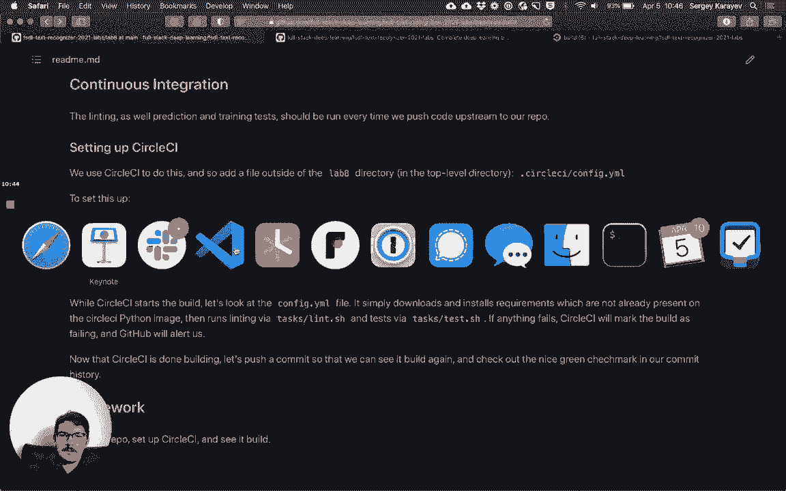

we can log into circle ci i have some，screenshots of that so let's look that。

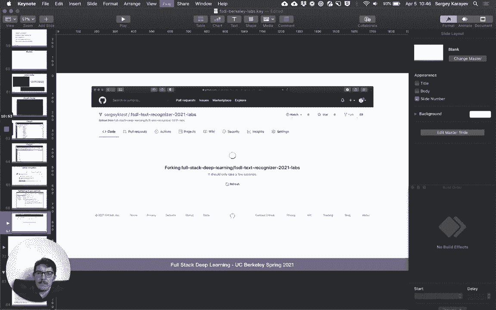

so here i'm forking the the repo，to my own you know test account。

then when i log into circle ci i just，log in with github，so you use authorized circle ci to kind。

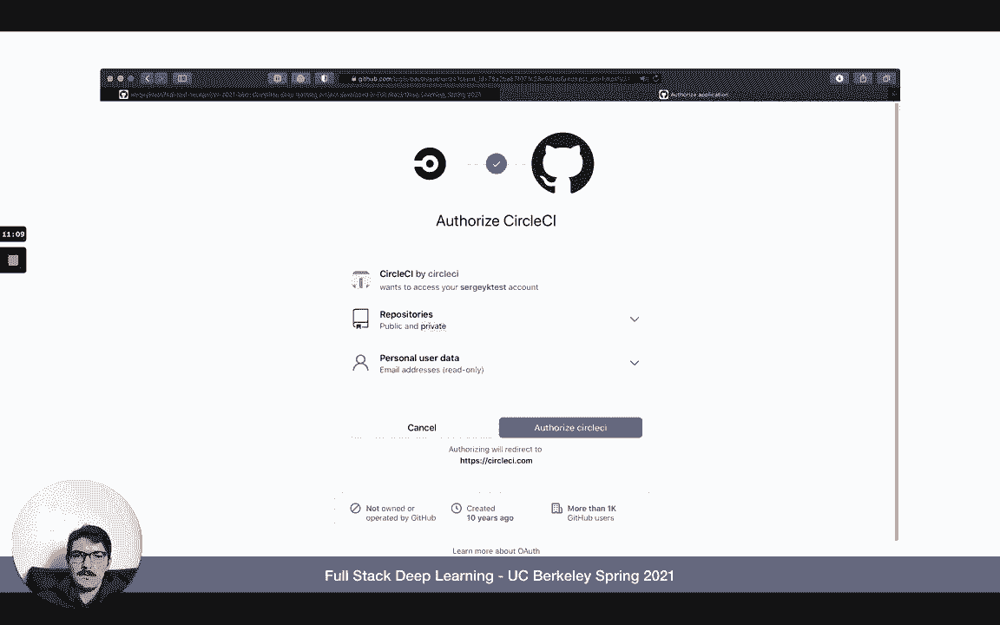

of look at your repos，and then i select the my fork of of the，labs repo。

it detects the circle ci config file so。

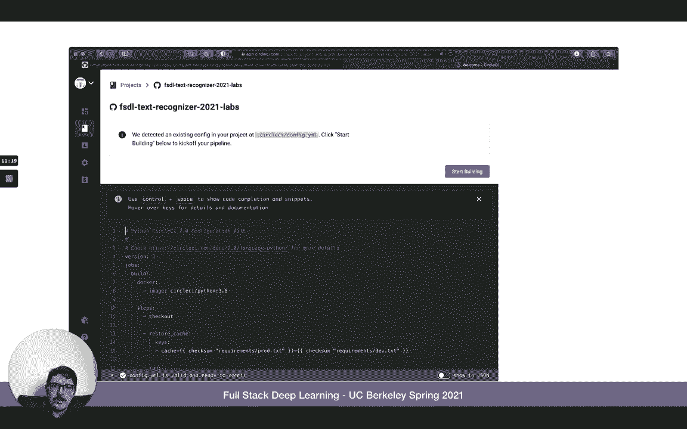

i can just，click start building and when i click，that，it uh starts building it so it。

says it's running this build and then at，the end，hopefully it finishes and gives us。

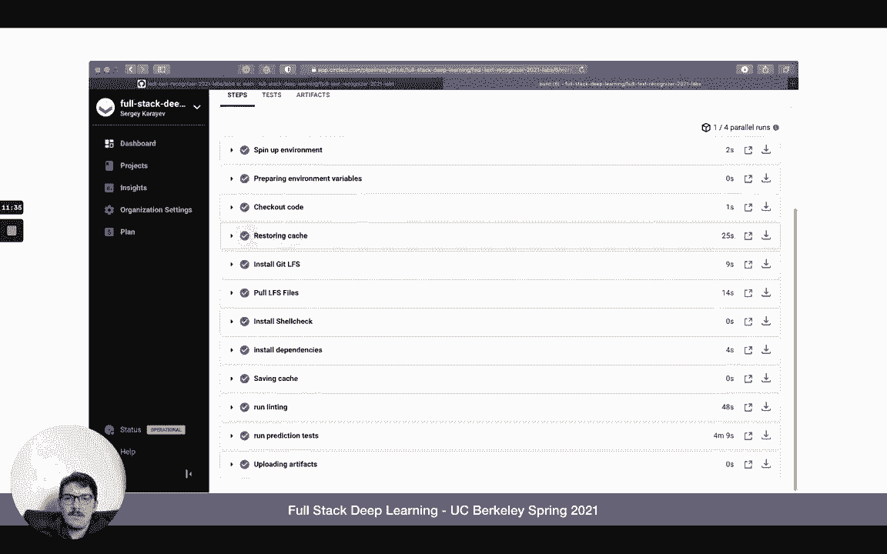

a clean slate of all green check marks，and this will also show up。

as a green check mark and then if we，break something it might show up，as a red cross and that。

lets us know that um ci failed and if we，open a pull request we also have a nice。

kind of github integration that shows，you，so to see what circle c is actually。

doing let's look at config yaml，within，so it's using a docker image，for python 3。

6 that's our version，it installs git lfs because we use that，pools to get lfs files。

install shell check which we use for，some part of our linting installs our。

exact requirement versions and then，first runs linting and then runs the，test。

and both of these run so even if one，fails the other one still runs。

and this lets us like if linting failed，it's still useful to。

to run the test just to see if they pass，or not，so it's pretty simple that's all it。

really takes to set up continuous，integration，we don't run the evaluation test in in。

circle ci because，circleci doesn't have gpus unfortunately，and it would take too long without it。

the homework is to fork the repo set up，circle ci。

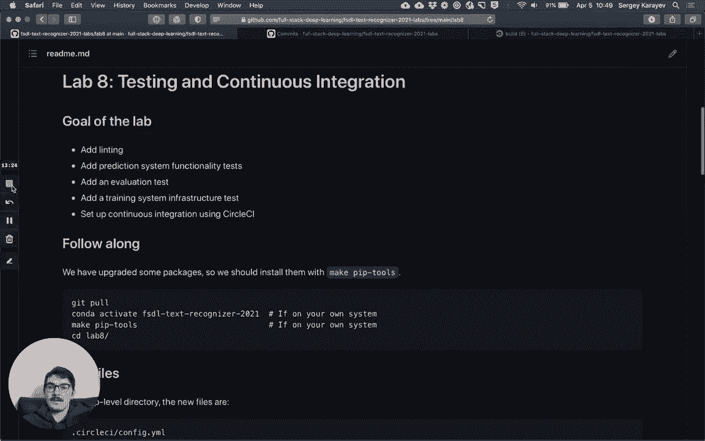