# P22：L11A- 部署 ML 模型 - ShowMeAI - BV1iL411t7jE

this week we're going to talk about，deploying and monitoring models for most。

of the class so far we've been talking，about，basically getting up to the point where。

you have a model that you're confident，enough to deploy into production and so。

this week we're going to talk about，how do you actually deploy it into。

production and what do you do with it，once it's there like how do you maintain。

it and make sure it stays healthy little，motivation，i think machine learning models in。

production are great you can scale up，and down to meet the demands of users。

they can deliver thousands of，per second，unlike these models that we train in。

notebooks which only work if you，actually run the cells in the right，order but i think。

most data scientists most machine，to build，production machine learning systems and。

so part of the goal of this lecture is，to give you a flavor of，the types of ways that you might。

actually go about deploying your model，so two topics today，really essentially two separate lectures。

the first one is，deployment and then the second is on，monitoring so。

what do you do with the model once it's，in production but first we'll talk about。

deployment one way to conceptualize，different sort of approaches to。

deploying your machine learning model，is to think about where in the overall。

architecture of your application，the machine learning model should be，deployed this is a cartoon of。

what your web application might look，like there might be some client that the，user has。

and that is running locally for them it，could be a web browser it could be。

some other device and it connects to a，server where your code is running。

and that server interacts with the，out，and render it in a certain way and show。

it to the user and the first kind of，paradigm for deploying a machine，is。

why don't we just run them all offline，dump the results in a database and then。

run the rest of our web application，normally and this is called batch，prediction。

so the way that this works is you'll，periodically run your model on new data，that's coming in。

cache the results in a database and so，you might think that this is，over simplification but this can。

actually work and is used relatively，commonly in production，when the universe of inputs is，have。

one prediction per user per day if，you're if you're making a recommendation，where you can just。

run it offline and cache it and return，it to the user if they query it。

so some really nice things about batch，implement，doesn't really require you to change。

your application code very much if at，all，and it's relatively low latency to the。

user because even if your model is slow，the predictions are cached and so it's。

as fast as a database lookup，but batch prediction is pretty limiting，so it doesn't scale。

to more complex input types right if you，don't if you can't just，and，users are not getting the most。

up-to-date predictions so their，predictions are always stale，by the amount of time that it takes you。

to recache，the outputs of the model and when those，predictions。

become stale right when they don't get，when there's a bug or something that。

causes them not to get updated，frequently enough it can be really hard，to detect this。

and it's very easy for users to start，getting old predictions so the next。

thing that you might think about is okay，if we're not going to just。

cache the predictions of the model to，store them in a database。

we might just deploy our model as part，of our existing web service。

um so we'll put the model in the web，service the way this works is you'll，package up your model。

using whatever packaging format that，your deep learning library or your，machine learning。

library typically takes and then you'll，include that in the deployed web server。

so you'll either literally copy the，weights into the web server or。

you'll store the weights in some file，storage like s3 and then download。

download them on the web server when it，it'll，actually load that model and call the。

model to make predictions this is a，pretty simple thing to do，it's nice because it reuses your。

existing infrastructure so you don't，have to think about okay how do i spin。

up my own services for my model or，anything like that，but there's some pretty heavy drawbacks。

to doing it this way which is why it's，not the most common pattern for most，machine learning systems。

the first is that oftentimes like the，web server itself is written by maybe a。

different part of your team，in a different language so maybe you，let's say。

and the web server might be built in，like node or something like that。

and so you then there's a translation，step that's needed in a lot of machine。

learning applications the，server code and the model code or the，same。

rate so maybe for example let's say you，don't really update your。

your web server all that often but maybe，you need to retrain your model every。

hour or every day or something like that，would actually require you to redeploy。

your entire web server using this model，if you have big models this can really。

start into eat into the resources that，you allocate to your web server。

machine learning models are often very，expensive to run，and in many cases the hardware that we。

choose for our web servers is not，optimized for your model so most，concrete example is。

if you want to run your model on gpus，you're probably not already using gpus。

on your web server and but i think the，most fundamental limitation of this，method is that。

the you when you put the model inside，the web server you have to scale the web，server and。

the model the same way so if as your，traffic scales up，you can your only option is to create。

new copies of the web server，and new copies of the model in order to。

scale horizontally to meet that demand，but in reality your web service and。

your model might have very different，scaling properties，and so more common pattern here is to is。

to do what we'll talk about next so the，next thing that you might think of is。

instead of actually packaging up the，model and putting it inside of our。

existing web service let's deploy the，model separately as its own service。

and and then our web server or even the，client can talk to that model，directly and this i think。

is more or less the most common pattern，for deploying machine learning models，today，is。

you run your model as its own web server，and the back end or the client itself。

interacts with it by making requests to，the model service and receiving，responses back。

so it's almost as if you have your own，little app that just is responsible for。

taking care of the model，nice things about this are it's more，dependable than the model in-service。

pattern because if you have a bug in，your model if your model nands out or。

something it's less likely to actually，crash your web app or like memory leaks。

or things like that that can go wrong，with machine learning models，it's easier to scale or it's more。

scalable rather because，you can pick hardware and horizontal，bit，that is tailored towards your model。

rather than tailored towards your entire，web application，and it's more flexible in some sense。

because if you have one model that's，used in multiple different applications。

or multiple different parts of your，application，they can all interact with the same。

service you can update that service，once and all of the other parts of your。

app that are interacting with it，will automatically have the latest。

drawbacks of this pattern so it can add，latency right you have an extra an extra，kind of call。

sometimes across the network in order to，access your model，so really low latency is what you're。

going for this is probably not the best，pattern，it adds some infrastructure complexity。

because there's now a new，service that you have to deploy and，maintain and manage the interactions。

with，but i think the biggest thing is，especially for a lot of machine learning，folks is。

the consequence of doing this is now，you're on the hook for running your own，model service。

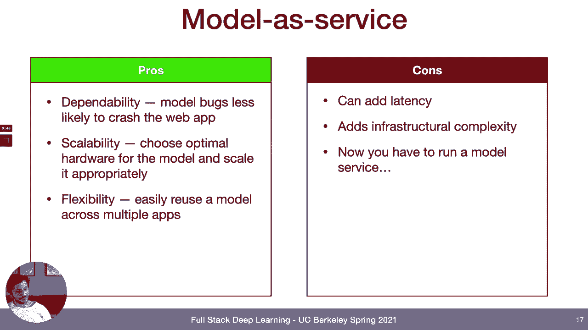

and so let's talk about some ways that，all right so a few things we're going to。

cover in in this model service，topic first we'll talk about rest apis。

just what does that mean what are those，i will talk about dependency management。

for your web for your model service，we'll talk about performance。

optimization so how to make this run，fast and and with high，throughput we'll talk about horizontal。

scaling so how to scale up and down to，meet demand，we'll talk about deployment and then。

we'll also cover a few of the managed，options that are out there。

if you look at all this and you're like，this is too much for me to deal with，starting with rest apis。

so what is a rest api at a very high，level it's a way of，serving predictions in response to http。

requests that are，formatted in a canonical way rest is not，the only sort of standard for。

this for request response protocols but，it's probably the most commonly used one。

in practice and it's the one that we，mostly recommend using and we'll use in。

the labs there's alternatives out there，like grpc which is used pretty heavily。

in tensorflow and within google which，you'll see as well，and then graphql is the other thing that。

you'll see is the new hotness in web，services but，is i think like maybe less relevant for。

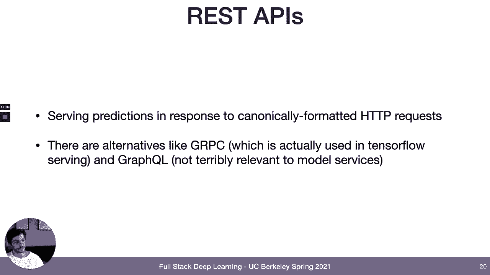

so this is what it could look like to，call your model as a rest api curl is a，just。

post some data to this url and you might，have a url，it's on a。

it's not a real url if in case anyone's，trying it，it's just uh what it could look like and。

then you'll send it some data and then，the response that you'll get back is。

some json that contains the prediction，of the model，so one thing you might be wondering is。

like why did i format the data this way，is there a standard way of formatting。

data that's going to go into a machine。

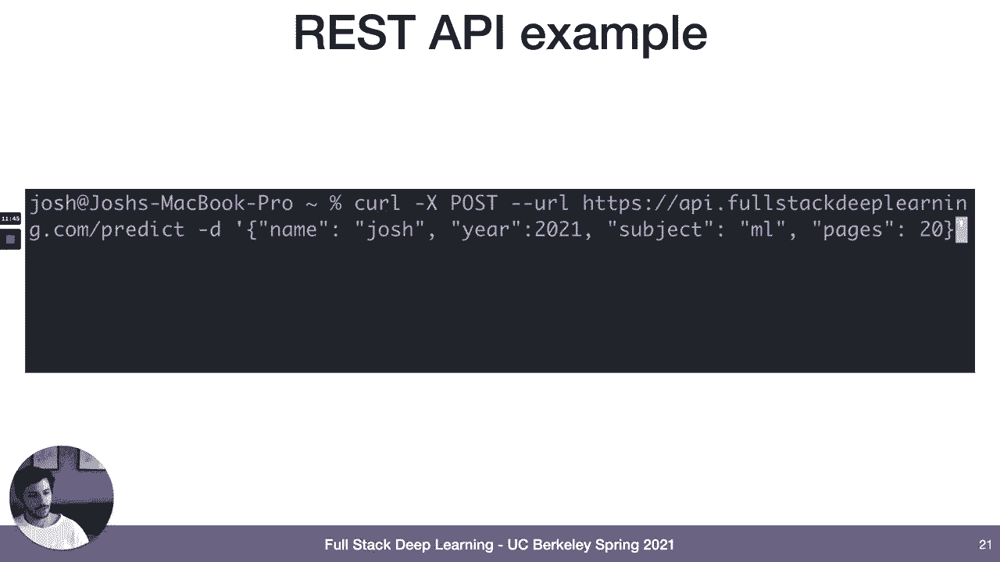

learning model the answer is sadly，not yet there's no real standard these，are screenshots from。

the rest apis of google cloud azure，and aws's machine learning offerings and，they all。

accept different formats so i think one，thing that i would love to see。

in the field is a standard to emerge，around，like what does a standard sort of rest，api request。

and response look like to a model，service but unfortunately we're not，there yet。

so the the recommendation i would make，here is pick something that makes sense，to you or maybe。

just pick one of these three formats and，go with that but there's no real。

standard to fall back on yet next thing，we're going to talk about is dependency，management。

so how do you actually get stuff into，your model servers，so model predictions depend on a few，code。

that contains the logic for for serving，up the prediction，you need the weights of the model and。

then you also need any code dependencies，that are required in order to run。

the code that you wrote locally and all，those need to be present，on your web server so for。

model weights and dependencies this is a，an easier problem like you can。

or sorry for code and model weights this，is an easier problem，like in principle you can just copy。

these things on your onto your web，server in whatever way，that you're normally deploying code onto。

your web server for model weights，since they're very large oftentimes。

you'll write a script that just，downloads the model weights when the web。

server gets spun up so that they're，present on the local machine，but dependency management can be。

trickier so dependencies can cause a lot，of trouble because，when they become inconsistent that can。

actually affect the behavior of your，model，and dependencies can be notoriously hard。

to update even if the version of，tensorflow that you're running changes。

that can change the way that your model，behaves and and if you're if you're。

trying to manage dependencies yourself，on your server，then you're going to run into all kinds。

of problems where let's say that you，want to deploy a new version of the。

model it requires you to bump your，tensorflow version，and then all of a sudden that new。

version of the model doesn't work and，you want to roll it back how do you。

actually do that without without，actually breaking any of those，dependencies so。

dependency management on servers can be，pretty hard and there's kind of two。

high-level strategies that you can，follow to make this a little bit easier。

one is you can destroy constrain the，dependencies for your model。

so you can just make a decision up front，that says here are the decision the。

dependencies that we're going to，allow to be part of our web service and。

we're rarely if i were going to change，them and then the second。

is you can use containers so we'll talk，a little bit about each of these。

strategies so if you want to。

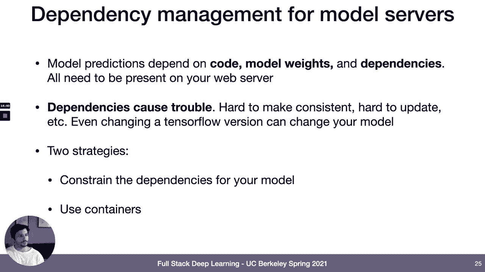

constrain the dependencies that your，model has one way that you can do that。

is you can use a standard format for，your neural net so the closest thing to，an open standard。

for for what a saved neural net looks，like is this thing called onyx。

and so onyx is basically like a way of，representing your neural net the premise。

is that you should be able to define，your network in any language。

and then run it consistently anywhere so，the idea is that like，you you should be able to write your。

model in keras or tensorflow and then if，your version of tensorflow changes，that's okay。

because you're going to compile this，model down to to this standardized onyx，format。

and then your web service will know how，to doesn't need to know about tensorflow。

it just needs to know how to take it on，a service，or an onyx like compressed file and then。

run that file，the reality is that this kind of open，exchange format is like a little bit。

tricky to get to work，right now like current state in 2021，and i think the core reason for that is。

because all of these libraries that，it's depending on or it's converting。

from change really quickly themselves，so there's often bugs in the translation，layer。

and then the other tricky thing here is，that in a lot of cases。

in your machine learning use case you'll，have some um，code that's important to defining the。

prediction that，is not part of your actual neural net，definition so it's not part of your like。

pi torture tensorflow code，so it could be like a feature，transformation for example so。

that doesn't really get captured by，something like onyx and so you still run，into this。

dependency version issue unless you use，like kind of a very constrained subset，of。

pi torch or tensorflow or whatever other，machine learning library that you're。

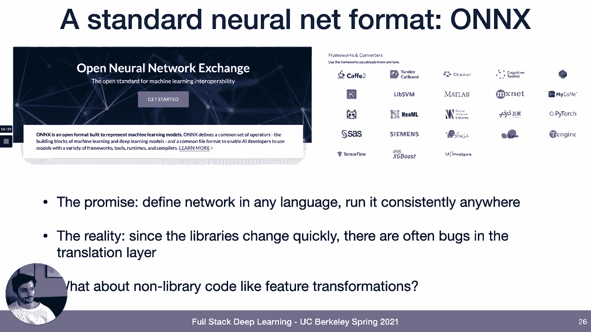

so a more kind of robust way of dealing，with the dependency issue，is to use a container service like。

docker，and so we'll give like a very high level，overview of what docker is and why it's，useful。

so the things we'll cover are we'll，cover how does docker differ from a。

typical like virtual machine that you，might have seen in，some intro cs class and then we'll talk。

about docker files，and layer based images which are the，nice syntax that docker has for。

defining these lightweight virtual，machines we'll talk about the ecosystem。

and docker hub and then we'll touch。

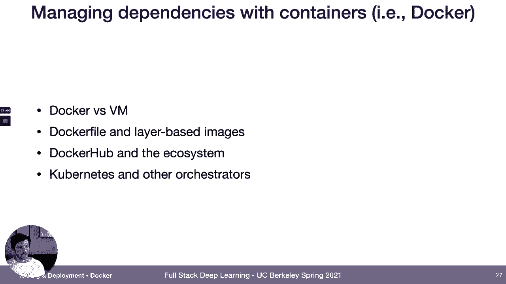

quickly on，or like container orchestration and what，that means this chart shows the。

difference in architecture，between a typical virtual machine and a，container。

like a docker container and so the core，difference is that the。

docker con containers themselves don't，contain a copy of the operating system。

instead the copy of the operating system，is contained within the docker engine，itself。

and so that means that these containers，are much more lightweight like they're。

just like smaller easier to pass around，easy to spin up etc and so because of。

that the kind of like the kind of，standard pattern for using docker，containers。

is that when companies start adopting，like，everything in a docker container you。

might have a separate container for，every single discrete task that you're，if you have。

a machine learning model that's going to，become a model service that might have。

its own docker container，and then if you have a database that，might be in its own docker container。

if you have a web app that might be it's，in its own docker container。

and so the pattern is to give like every，component of your other product。

its own docker container and then have，those docker containers talk to one，another。

and so again like docker being，lightweight is what facilitates that，being possible。

so in an example web app there might be，four containers the web server the，database。

you might also have a separate container，for a job queue where you're gonna，enqueue all the。

like tasks that need to happen and then，a separate container for the worker。

so that's conceptually what a docker，container is it's a very lightweight。

virtual machine and in practice the way，it's used is that you'll have。

docker containers that you spin up for，every component of your infrastructure，in many cases。

and those things will all be running on，your infrastructure talking to each，other。

they'll each kind of manage their own，dependencies and so if one part of your，app has。

one version of tensorflow and another，part of your app has another version of。

tensorflow then that's totally okay，because the code that's contained in the，each other。

it just needs to know about its own its，own dependencies and then the protocol。

that it uses for talking to the other，containers，so how do you actually define what goes。

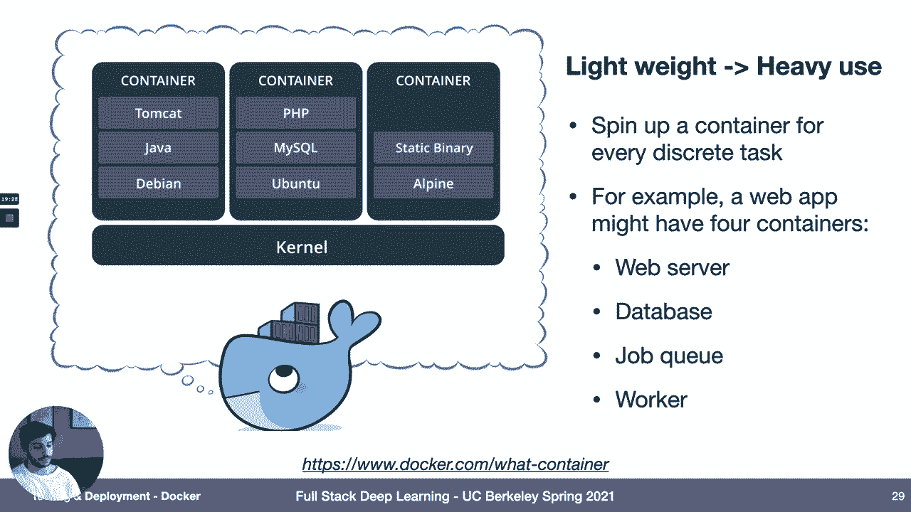

in one of these containers like how do，you actually do dependency management in，a container。

so in docker there's a thing called a，docker file and a docker file is，basically like docker's。

specific format for how you define these，containers docker file looks something，like this。

so in this one you're you're building on，top of an official python runtime so the。

python the this first line is from，python，2。7 dash slim you're setting a working，directory。

your you're pip installing some stuff，you're exposing a port，you're setting some environment。

variables and then you're running a，command inside of that container，environment。

that's what this docker file says at a，very high level and so the way that you，might use this。

is you might interact with a thing，called a docker registry，so what a docker registry is it's kind。

of like the equivalence of github，forget so instead of storing all of your，in。

those those images inside of a inside of，your docker registry。

and then like when you want to actually，then，run them and so when you pull them down。

and run them you have this you're，guaranteed to have this like，reproducible environment。

that has all the same dependencies that，you left it with and，no changes that you made in other parts。

of your environment can break it，the other thing that people the other。

thing that people like a lot about，docker is that there's a really strong。

ecosystem associated with it it's，relatively easy to find，images for kind of more or less。

different like whatever different tasks，that you want to work with，so there's like pre-built images。

specifically for data science or for，machine learning，for tensorflow for pi torch and then。

since you have this this system of，docker files，that allows you to extend existing，images。

to import from existing images and add，them，it's pretty easy to extend those things。

so if you find like a base tensorflow，image and you want to add some other，python package。

you can just import from that base，package，and then save it back to the docker hub。

and it's pretty easy to do this with，private images as well，this is just a chart of a number of。

polls of docker images，over time and so dockers for the past，few years has been on this exponential。

growth path of adoption，in the machine learning or in the，software world more generally and it's。

next thing i want to talk about is，container orchestration so what is。

container orchestration again if our，like web application is，built of these of all these different。

containers each of which has its own，dependencies，and its own like application logic and。

then we said they're all going to talk，to each other，to make up our application then what。

container orchestration is，it's basically like the logic that tells，you how to。

take these containers and distribute，them onto your actual，machines or virtual machines and then。

have them all talk to each other and，coordinate to solve the tasks that。

they're aiming to solve together，the the kind of like emerging standard，here or maybe。

at this point it's like fair to call it，v standard is called kubernetes and so，this is。

the the like most popular container，orchestration tool，but there's also offerings from the。

cloud providers and then there's，an easier to use container orchestration，tool from docker itself。

called docker compose which is a good，thing to get started with。

if you're just learning about this stuff，but kubernetes will come up again later。

in the lecture because，it's been adopted pretty fervently by，some corners of the machine learning。

ecosystem，so a lot of the tools that we'll talk，about are built on top of this container。

orchestration framework called，kubernetes so we talked about dependency，management and rest apis。

next thing we're going to talk about is，once you have your model service let's。

say running in a docker container，as a web server how are you actually。

going to make this thing run faster，first thing that we'll talk about is。

like how to make it or mostly what we'll，talk about here is how to make it run，faster on。

even just a single machine so there's，some kind of core questions to ask here。

or like some core techniques that you，can follow，one is do you want to run inference on a，gpu or not。

so usually in deep learning at least，we're training our models and gpus but。

that doesn't necessarily mean that we're，going to do inference on gpus。

then we'll talk about concurrency how to，run multiple copies of your model。

at the same time on the same host we'll，talk about model distillation。

talk about quantization caching which is，another performance technique。

batching sharing the gpu and then we'll，talk about some libraries that。

all right so the first question is you，trained your model on gpu does that mean。

that you should run inference on gpu，so there's some pros to running。

inference on gpu one thing is it's，probably the same hardware you trained。

on that can be nice because，it can avoid trickiness of potentially。

translating your model to different，then，as your model gets really big and if。

you're willing to tune the batch size，that goes into the gpu，then usually this is like the way you。

can get the highest possible throughput，and in some cases the highest cost。

the highest possible like throughput per，dollar but that's not always the case。

big cons of using gpu for inference is，that it's more complex to set up。

and in practice it's often more，expensive i think，using gpus for inference is still not，say。

and in the labs we're going to do，next thing we'll talk about is。

concurrency so if you're not going to，run your，your model on gpu where you're taking。

advantage of like batching things up and，making them parallel。

then you still want to take advantage of，the parallelism that's inherent。

on the machine that you're running your，model on so，you like maybe you have many cpus or。

maybe many cpu cores，that you can actually run the model on，so what this means is instead of just。

running a single copy of your model on，the machine，you'll instead run many copies of the。

model on the machine，each of which takes advantage of its own，cpu or cpu core。

or like group of cpus or cpu cores and，the way this will work is that like。

you'll as requests come into your，cue，and then one of the one of the copies of。

the model will grab it，make the prediction on it and then。

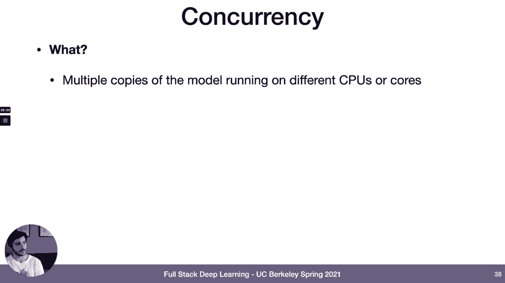

return it back to the user and so how do，you actually make this work in practice。

for machine learning in particular，one kind of thing to be careful about is。

thread tuning so this is also a great，blog post by，serve，like an enormous amount of traffic on。

their platform and one of the kind of，gotchas that they pointed out was。

make sure that each copy of your model，is using really like the minimum number，of。

threads that it really needs to use so。

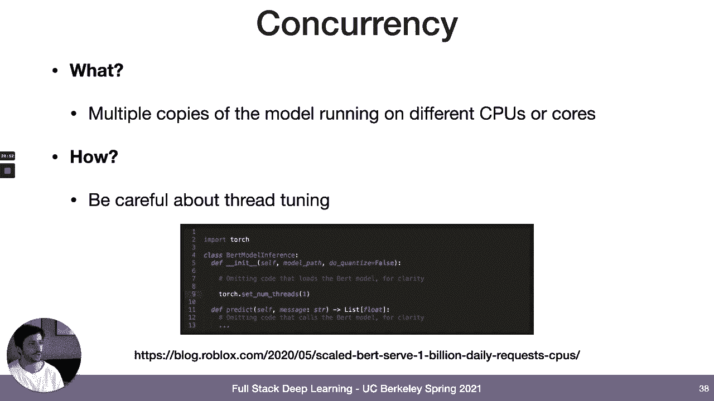

that it's not hogging those threads，so that's concurrency next thing we'll。

talk about is model distillation，what is model distillation it's。

basically a category of techniques that，revolves around taking your larger。

machine learning model the one that you，trained the one that，is the one that you think is performing。

really well and training a smaller model，not on your original task but instead to。

imitate the behavior of the larger model，and in practice this can be a way to get。

relatively similar performance out of a，much smaller model，there's several techniques for this this。

blog post below is a pretty good，overview of the different techniques you。

can try i would say the reputation of，these techniques is that they're pretty，finicky to do。

consistently and like robustly in，practice so you might be able to get。

work to work once but if you're training，your model a lot of different times and。

you need to be able to，have it work consistently then adding，this model distillation step can add。

some risk to that，and so it's from what i've seen，relatively infrequently used in practice。

with the exception of pre-trained，distilled models，so for a lot of the categories of models。

that you might want to grab a，pre-trained model for，there are there's research that's gone，without。

losing too much performance so，the，bert family of models is a good example。

of this and so these are a great option，if you want if you care about getting。

more like higher performance out of your，system and you're willing to trade off a。

little bit of accuracy，or a little bit of like model，another way that you can reduce the size。

and like increase the，speed of your models and throughput of，your models is to use quantization what。

is quantization，normally when you're running a forward，pass on your neural network you have。

all of the weights encoded as let's say，32-bit floats，and you basically do all this matrix，thing。

as an output so the observation that's，made in quantization is that maybe we，actually don't need。

all that precision for those for those，model weights，and those model activations like maybe。

we can get away for，some of those weights if not all of them，using a，like a more compact numerical。

representation and so typically，you'll um compress a lot of the weights，integers。

instead of 32-pit floating point numbers，so there the again just like in。

distillation there are some trade-offs，here with accuracy，generally when you distill a model it。

makes it or when you quantize a model，will make it，a little bit less accurate or a little。

bit less performant along the metrics，that you，care about most of the like the main，consider。

using like pytorch and tensorflow lite，which we'll talk about a little bit。

have ways of doing quantization that are，built in，and one thing to be aware of if you're，that。

there is a class of techniques called，quantization aware training。

where you take the fact that you're，going to quantize the weights into。

account when you run your training，procedure，and these can be ways of reducing the。

amount of accuracy，or the amount of model performance that，you're going to lose when you quantize。

so that's quantization the next，performance optimization technique to be，aware of is caching。

so what is caching for a lot of machine，learning models，the the distribution of inputs that you。

get into that model is not uniform，right there's some inputs that you see。

more frequently than others，and so caching takes advantage of this。

fact and instead of always calling the，model on，every single input no matter what。

instead it'll cache，the frequently used inputs to the model，and before。

calling the model it'll first check the，cache and so if you're，if it's one of the frequently used or。

model，then instead of actually needing to run，your expensive neural net。

you'll instead just pull the result from，the cache and it'll be faster for your，users in those cases。

[Music]，how does this caching technique can get，like really fancy this is a rabbit hole。

that you can go down into at some point，if you're ever interested。

but there's a basic way to do this in，python using funk tools and so there's a。

there's some like built-in methods in，the like python func tools。

library for caching that can allow you，to build a cache and that's that's。

one way you can do it is just build，cache in memory using，for your。

another technique that can increase the，make your models more efficient and，higher throughput to run。

is batching the inputs before they go，into the model typically with a lot of，machine learning models。

you'll get higher throughput when you do，prediction in parallel right like neural。

nets are built to run in parallel and，this is，especially true if you're doing。

inference on a gpu in fact batching is，doing，inference on a gpu so how do you，you have a。

you don't necessarily have a batch of，requests that comes into your model。

and you want a batch of outputs that are，coming back what you the。

maybe a more realistic scenario is that，you have a stream of inputs coming in。

that are coming from requests from users，and so you need to take your library。

needs to take care of caching，on the back end and then breaking up。

those batch predictions and sending them，back to the right users。

so at a very high level the way this，works is you'll collect predictions。

that come in until you have whatever，constitutes a batch，for your system and then you'll run your。

model on that batch，and return each of those predictions to，the users that requested them there's。

quite a bit of tuning that needs to，so，you need to tune the batch size itself。

to trade off between throughput and，latency for the users right if your，batch size is too large then。

you know the first user that makes，wait，until all of the other until enough。

other users have have put in，their requests before they actually get，their prediction back so it can。

introduce a lot of latency，and to get around this a lot of times。

what you need to do is you'll need to，have a shortcut，where in addition to like building up to。

a fixed size batch or like a，desired batch size so if your latency。

gets too long you'll just return the，prediction you'll you know run the。

prediction and return to the users，anyway so there's quite a bit of tuning。

that's required to make this work well，but if you're doing gpu inference this。

is pretty essential to get like kind of，and yeah the last caveat here is this is。

maybe as it's clear from the description，so，you probably don't want to have to。

implement this yourself and we'll talk，in a second about libraries that。

implement batching and some of the other，performance optimization techniques。

that you can use if you're hosting your，another category of performance。

optimizations that i think is，interesting，to consider not really very widely used。

in practice yet but hopefully will be，widely used in practice soon。

is sharing a jeep a single gpu between，multiple models，if you're tuning your batch size and it。

turns out that like in order to get，reasonable latency for your users you。

need to use a batch size that doesn't，use up the entire gpu，then one thing that you might wonder is。

are we just going to under utilize the，gpu or is it possible to actually maybe，share that gpu。

between multiple models or as while，you're waiting for，requests to accumulate and you're not。

actually using the gpu to make a，prediction，maybe that gpu can be used to run。

how does this work yeah this is，something that you unless you're like。

really focused on this as a project this，is probably not something that you'll，implement on your own。

but it's worth being aware of as a，technique because it's something that。

some of the model serving libraries are，starting to support out of the box。

and i think will be like hopefully part，of next generation of model serving，tools。

so talked about out of the box model，serving libraries a couple of times。

there's canonical ones for both，pi torch and tensorflow there's。

tensorflow serving and torch serve and，so these both，take care of a lot of the kind of more。

complex batching and，and things like that that we talked，about in so far in this section。

and they're open source and so if you're，if you do want to do gpu inference。

with your models if that's important for，you to do then would recommend like。

building off of one of these libraries，rather than trying to implement it all。

yourself couple others to be aware of，actually，has a new ish model serving library。

which seems pretty promising，and then nvidia has one as well that is。

like more tailored to nvidia gpus but，has some of the kind of fancier，primitives。

like gpu sharing that we talked about so，that's performance optimization if。

you're running like a single host，to serve requests for your model next，thing we'll talk about is。

what it what happens if you have too，much traffic in order，for like your single host to be able to。

return predictions fast enough so the，next thing that we'll talk about is。

horizontal scaling which means if you，have too much traffic for a single，machine。

let's make multiple copies of our model，server，and let's split traffic among those，multiple machines。

how do we do this at a very high level，you'll just duplicate your s。

your service your your prediction，service，and then you'll use something like a。

load balancer to split traffic，and send traffic to the appropriate copy，of your service。

in practice there's i would say two，commonly used methods for how to do this。

one is so you can do this like just in，your aws account or whatever with。

using primitives that your that your，cloud provider provides，but in the machine learning world it。

seems like it's more common to if you're，going to manage this yourself to use a。

container orchestration，toolkit like kubernetes as we talked，about a little bit before to to do this。

or there's another option which is，instead of managing these servers，yourself。

to use a serverless option like aws，lambda，so i'll talk a little bit about each of。

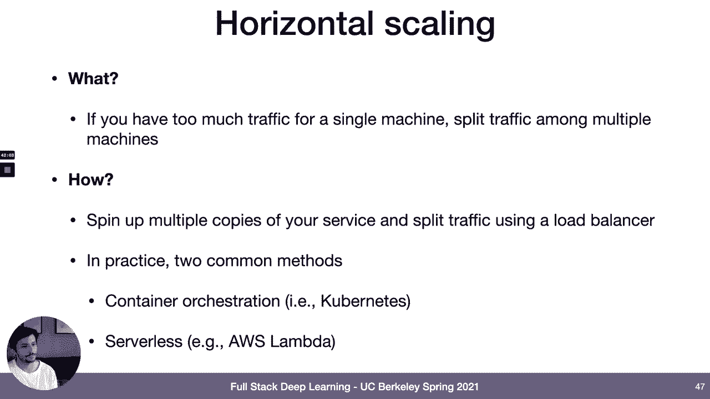

all right so if you're if you're doing，the if you're going the container，orchestration route。

one way to think about this is that if，you look at the the third。

column here this is what it might look，like to deploy a single container you。

get you somehow get your container onto，your onto your web app，or onto your sorry onto your hardware。

and then that container takes care of，and fielding the requests and returning。

the responses to the user，what this looks like in a container，orchestration paradigm is that。

you have your docker container your，docker containers work together and are。

coordinated by this tool called，kubernetes，and kubernetes is going to take care of。

things like providing a single，service for you to send requests to and，then dividing up traffic。

that gets sent to that service to the，different actual。

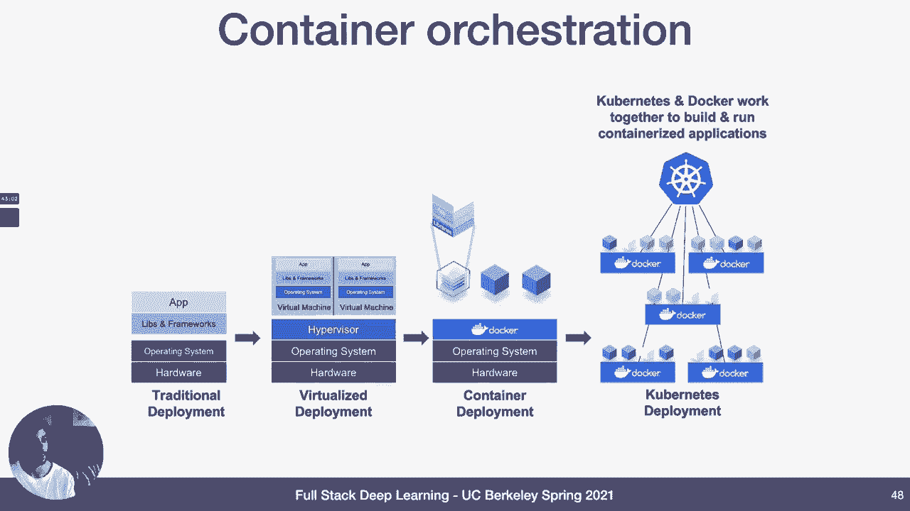

like physical or like virtual copies of，the container that are running on your。

infrastructure this can be，you can build a system like this，yourself on top of kubernetes if you。

want to and many companies do that，but there's also some frameworks that。

are emerging that kind of take care of，handling a lot of this infrastructure。

out of the box if you already have a，kubernetes cluster running so，the two i would point to here are。

there's one called kf serving which is，part of the，the kubeflow package which is a popular。

kubernetes native，machine learning like infrastructure in，a box solution and then the other is。

called the other kind of like，commonly referred to one is called，selden and so if you're。

if you find yourself in a position，trying to implement a，model serving stack on top of kubernetes。

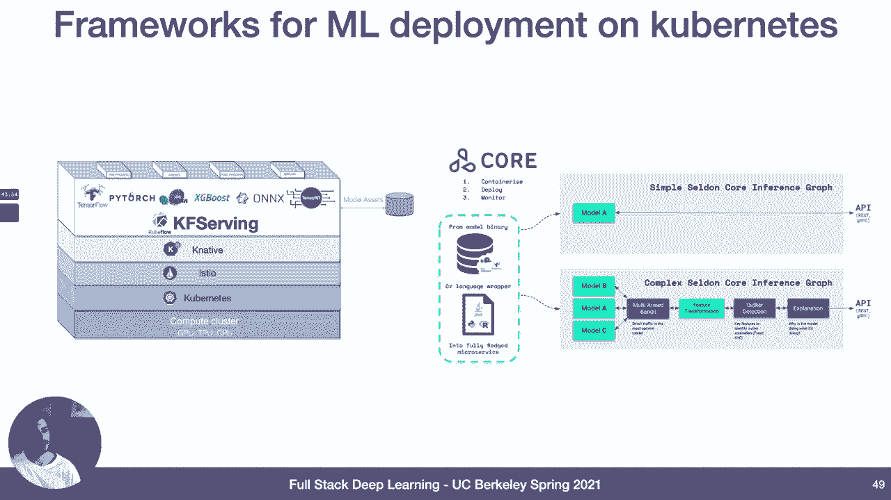

then it's worth taking a look at these，open source options，all right the other approach that is。

relatively common to scaling your model，service horizontally，is like just not dealing with the the。

scaling at all，by using a serverless function，so the way this works is that you take。

your application code and all the，dependencies，and then you can pat and you package。

that up and traditionally for for a，serverless function like aws lambda。

you always had to do that via zip files，which is like really annoying but，containers。

so you can just write your docker，container like you would anyways and。

have the entry point like a web service，that gets run，inside of that container and then a。

service provided by your cloud provider，so aws lambda，or google cloud functions or azure。

functions manages everything else for，you，so they they take care of like actually。

running that container on some physical，hardware somewhere，scaling it up and down to meet demand。

load balancing etc，and one of the really nice things about，this is that you actually only pay for。

all the，all the instead of paying for your，server no matter what no matter like。

whether it's getting any requests or，whether it's totally saturated。

instead you're just paying per request，and so for workloads where you have like。

spiky traffic like you have more traffic，in the morning or like occasionally。

you'll get a huge burst of traffic，this can be a much more cost-effective。

and so the like the galaxy brain idea，here is your servers，your servers can't actually go down if。

you don't have any servers，so think about that next time your your。

servers go down and and you're wondering，what you did wrong，of course there are actually servers。

running under the hood here so it is，still possible for，servers to go down generally speaking。

these types of managed services are，so some drawbacks to this approach the，deploy。

tends to be limited it's uh it's pretty，big now i can't remember what the actual。

numbers are but like for most like，smaller model or like reasonable size，models you'll be fine here。

but if you're trying to run like the，latest massive gpt3 model or something。

then you might run into issues，with the size of your deployment package，only。

and have limited execution time so you，can't have single，function call run for an arbitrarily。

long time it'll，time out eventually which is fine，typically for doing like machine。

learning model inference but，can be or model prediction but it can be。

it can be challenging to like build，these things into pipelines of models。

and there's like little or no state，management that happens here。

if you want to do something like caching，it can be very difficult to do that。

in a paradigm like lambda or another，serverless function paradigm and there's，actually。

that is focused on building a，serverless platform that has some state，management capabilities。

so this probably won't be true forever，but for now like，if you want to store state in your。

lambdas there's only limited ways to do，that，and then lastly i think there's like。

limited deployment tooling so the，deployment tooling here is getting，better but。

when we talk about other things that you，might want to have in your model，deployment。

process just know that a lot of those。

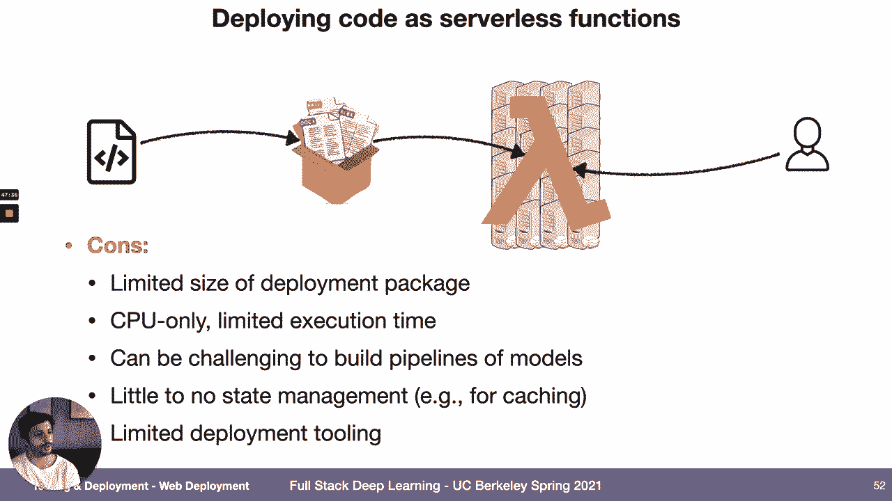

aren't present in lambda or are like，relatively hard to do in lambda so situ。

to situate us we talked about what is，this thing what is a rest api。

we talked about like how to manage，dependencies on your server we talked，about how to make。

machine learning models run fast on your，web server we talked about how to。

a couple of different strategies for，scaling them horizontally next thing。

we're going to talk about is，the process of deploying models so like。

the operational side of deployment，so model deployment you know if if model。

serving so what we've been talking about，so far is，how you actually turn a model into。

something that can respond to requests，deployment i would define as the process，of how to roll out。

manage and update these services right，let's say that you do train a new，version of your model。

and you want to you think that new，version of the model is ready to go into，production。

how do you actually move from the，existing service that's in production to。

the new service that's in production how，do you what are some best practices for，actually doing this。

things that you probably want to have in，your deployment process are。

you want to have the ability to roll，saying，at this moment in time all of the。

traffic in my production system is going，to go to the new model。

ideally you want to be able to say okay，first i'm just going to send one percent。

of the traffic to the new model，and i'm going to send 10 and then 50 and。

if things still look good then i'll，eventually send all the traffic over to。

the new model you also probably want to，have the ability to roll back instantly。

so if you do detect some change in the，new version of the model that you've，deployed。

you want to basically just be able to，have a flag that says okay let's switch。

right back to the old version of our，model and then on top of that you。

probably want to be able to deploy，pipelines and models so，rather than just having a single model。

that exists in a vacuum，has to do all of its own pre-processing。

and stuff by itself in a perfect world，you want to have you want to be able to。

deploy two models that are or the input，of one is the output of the other and。

we're not going to talk about ways to，pretty，there's a lot of challenging。

infrastructure considerations that go，into this，but the hope here is that if you're。

using one of these，existing deployment libraries like the，about，then。

hopefully your deployment library will，take care of this for you。

so this is probably isn't something that，you'll find yourself really implementing，from scratch。

but it's something to to look for if you，are choosing，all right and then the last thing that。

we're going to talk about is if you，yours，like yourself at all like you don't want。

to deal with containers um you don't，want to deal with，horizontal scaling performance。

optimization any of these things，then what should you do luckily there's。

some managed options there for you，so the cloud providers all have one。

there's google has one amazon has one i，believe microsoft has one too。

that basically allow you to package up，your model in a predefined way turn it。

into an api and then there's a couple of，startups that are offering this too one。

is called algorithmia which is，there's，a newer one called cortex which is。

actually founded by berkeley alums，which is also worth checking out and the，big drawback here is。

i don't know about pricing for the，startup options but for the cloud，provider options。

these tend to be very expensive and so，you're really paying a premium for，[Music]。

okay we did we did a dive into this，particular pattern for deploying models。

which is building a model service，first，takeaway is if you decide to do，inference on a cpu。

then you can one thing you can get away，with especially early on in your project。

is like when you don't have a huge，amount of volume is just scaling。

that service by launching you can either，scale that service by launching more。

servers or you can go serverless，and i think like a the baseline，recommendation is。

serverless makes a lot of things easy，for you if you want to pick the same。

default then it's probably to use，something like lambda or some other。

serverless option and in slightly more，detail if you can get away with cpu。

inference you don't need inference for，on gpus and if you have not a huge。

volume of traffic to your model or，the traffic that you have to your model。

is high volume but it's very spiky，then serverless probably makes more。

if you're doing gpu inference then the，takeaway is that，you really should be using one of these。

like serving tools like tensorflow，serving or nvidia triton or。

torch serve it's going to save you a lot，of time and take care of a lot of the，batching。

and potentially gpu sharing for you，[Music]，and then lastly i think it's it's also。

worth keeping an eye on startups in this，space particularly if you're interested。

in doing gpu inference so like，requests for startups actually is making，gpu inference as easy as。

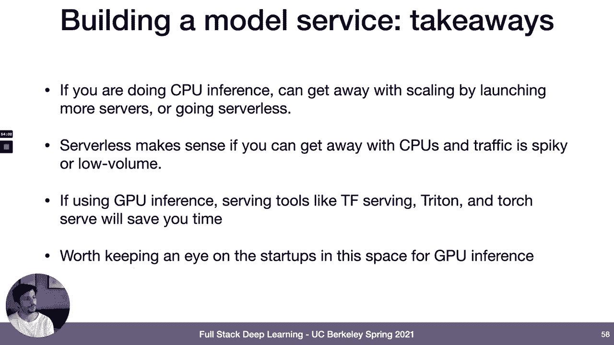

as like doing cpu inference on lambda，all right last deployment pattern that。

we'll talk about today is，putting the model inside of the client。

itself so this is called edge prediction，and this is a pretty deep topic we don't。

we're not really going to do it justice，in this class but，just want to point you to some resources。

that you can go to to look to learn more，about this if you're interested so the，way this works is。

you send the weights of the model itself，to the edge device，so to the browser or to the to。

the user's phone or to like your robot，or whatever your edge device，client。

loads the model and interacts with it，directly，there's some really good things about。

this pattern it's the lowest latency way，that you can deploy models。

so if you're a very latency sensitive，application this is basically the way to。

go it doesn't require an internet，connection，so you can run this on like a gpu on a。

robot in the middle of the desert with，no interconnect internet connection。

and then there's a big data privacy，data security benefit to this as well。

because the user's data doesn't actually，need to leave their device。

in order to have predictions called on，it，but there's some pretty strong drawbacks。

to this method as well often on，the client there are very limited，hardware resources available。

particularly for like true edge devices，but also even in the browser。

the frameworks that are used for，deploying models this way are less，full-featured than。

your typical your sort of full version，of tensorflow and pytorch。

and so you can be constrained in the，model choices that you make。

and translating from one to the other，can be a little bit painful。

it's really difficult to update models，so if you you know ship some model，weights over to。

a client device and um you need to，change them，then that can be a tricky thing to。

figure out how to do and then it can be，really hard to tell to debug and tell，when things go wrong。

right because you're putting this model，on someone else's device and。

you don't necessarily have the ability，to get data back as to how well the。

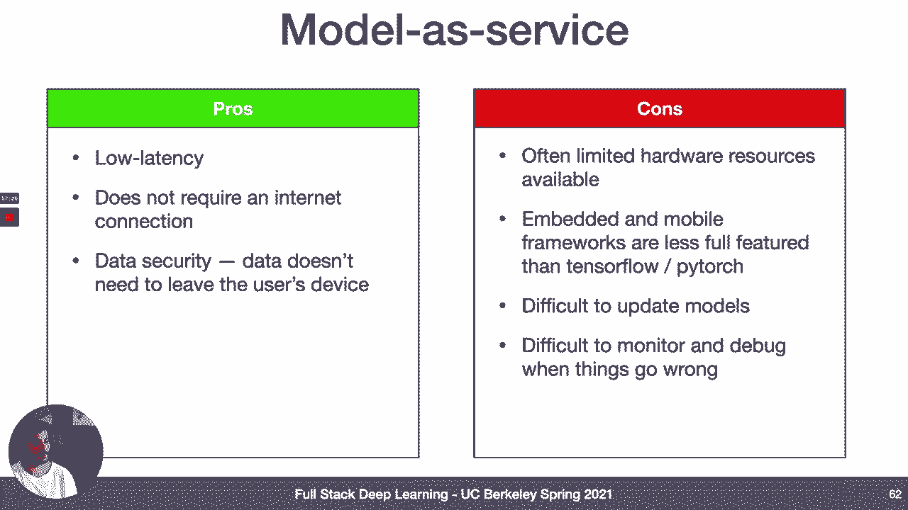

next thing we'll talk about is just a，very high level cover some of the tools，that you can。

use for edge deployment just so you're，aware of them i would say maybe the most，commonly used。

framework for this in practice is uh，tensor rt，and well actually i don't know if that's。

fair but this is uh this is nvidia's，like the nvidia kind of oriented，framework and so this is。

meant to help you optimize your models，for to do inference on nvidia devices，like both they're like。

bigger gpus but also they're more like，edge-oriented gpus so this is used，pretty commonly in like。

robotics and stuff where you actually，have a gpu or something gpu-like on。

the client device apache tvm is a pretty，cool library and，the promise of tvm is that like you're。

supposed to be able to take，models that are written in any different，framework。

and then compile them down into，something that's meant to be run，in any run time this is a pretty。

powerful tool if you have，if you're writing models in lots of。

different libraries and you need them to，be able to run，in different environments like maybe。

both on a phone，and on a gpu or like on different types，if you're deploying tensorflow models to。

mobile devices and also some edge，devices the go-to way to do this is。

called tensorflow lite and so this will，help you compile your tensorflow model，down。

to something that can say run on your。

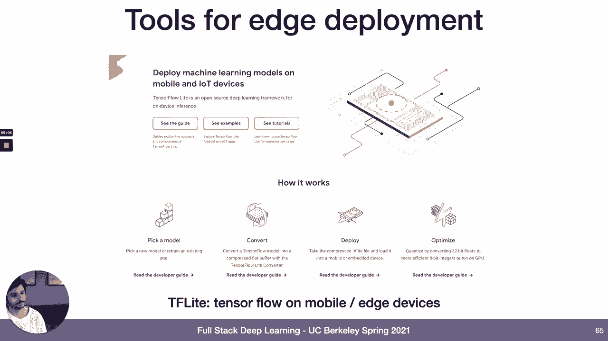

there's also a kind of alternative of，this for pytorch called pytorch mobile，which is。

oriented on toward getting your pytorch。

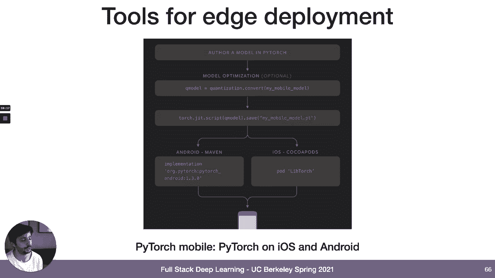

model toward your ios or android device，[Music]，and then lastly if you're not using an，nvidia device。

and you you know don't want to use tvm，for some reason，and you're not using an iphone or an。

android device then like，javascript is a pretty portable way a，pretty portable。

way of running code on different devices，for example you can run javascript，directly in the browser。

and so there's also i think like the，sort of most ubiquitous tool for this，is uh tensorflow。

js which is a way of，running tensorflow code in javascript in，your browser。

it's actually relatively full featured，like you can also train models in the，browser。

using tensorflow。js but i think it's，like probably the more common use case，is for um converting。

your model into something that you can，just like ship out as part of your web。

service and have it run locally in the，the，the different like frameworks for。

running machine learning models on，ml，which is apple oriented only works for，inference。

there's ml kit which is google kind of，android，oriented and you can you can upload。

tensorflow late models to this，and then there's also this tool called。

fritz which is supposed to work for both，like gonna be like a universal input for，both。

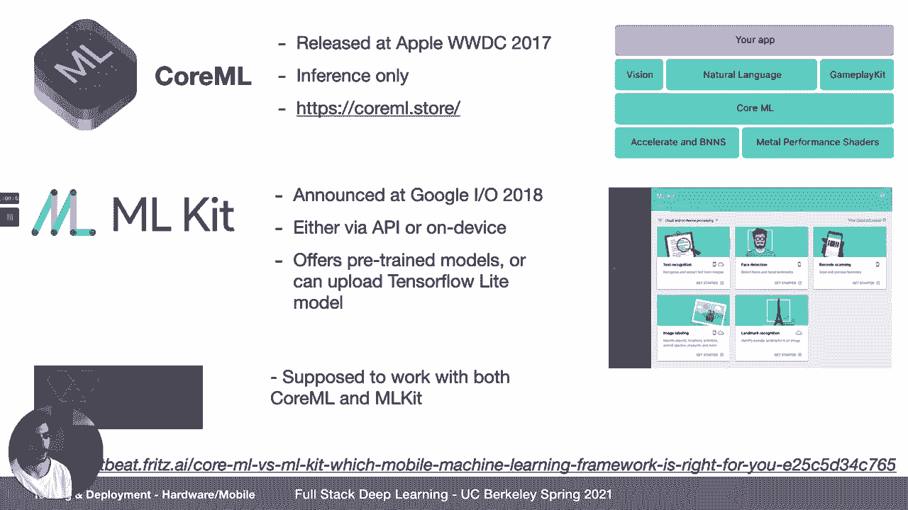

ml kit and core ml i haven't actually，tried this but the promise is to build，something more general。

so the other thing that you might need，to do if you're deploying if you're。

doing like client deployment or edge，deployment，is make your models themselves more，efficient。

so one way to do this is to use the same，quantization and distillation techniques。

that we talked about before but i think，like a pretty essential part of the。

toolkit if you're going to be doing this，is to，pick mobile-friendly or edge-friendly。

model architectures there's a couple of，like prominent examples of this one is。

called like maybe the original or，the first one of the first really。

successful ones is called mobilenet and，the way it works is it replaces a lot of。

like full convolutions with depth-wise，convolutions and one deconvolutions。

to reduce the overall number of，parameters in the model，and this is a chart that shows on the。

x-axis the total number of operations，that are present in the model on the，y-axis the。

like top one accuracy for imagenet and，uh green is mobile net is like all the。

different variants of mobile net with，different like compressions。

and so you can see it's like pretty good，trade-off between，having a relatively small number of。

operations like quite a bit smaller than，alex net，much much smaller than something like。

vgg but still achieving like comparable，if not better performance。

and so i think that's like probably the，core of why this has been such a popular。

model architecture because it's it you，know falls in the right quadrant of that。

in the nlp world there's also distilbert，is like a commonly used smaller model。

there which i think i mentioned before，and it's worth that's worth checking out。

this case study if you want to know a，little bit more about，how some of these model distillation。

things can work in practice but yeah，they were able to get it down to half。

the number of parameters with 95，performance which is a pretty good。

okay so that was like a lightning，overview of some of the tools to be。

aware of if you find yourself deploying，models on edge next thing i want to talk。

about is just what are some mindsets，that you can adopt or like that maybe。

you need to change if this is，the way that you're going to be，deploying your models in the end so i。

want to talk to a few folks，that i know who i've i haven't done edge，deployment myself so i went in。

and talked to a few folks i know in the，self-driving car world and the like。

mobile deep learning world and ask them，um some questions about what they have。

found to be effective in practice，for actually making these projects work。

and so some takeaways to share from，those conversations，i think like the typical recommendation。

that we tend to make，when you're training deep learning，models is consider model performance，first。

and then like speed，and inference speed and latency and，things like that later。

because generally speaking like if you，can get a model that has your target，performance then。

if you are not hardware constrained in，the way that you deploy that model。

there's different ways that you can go，about actually making that model as。

efficient as it needs to be to run in，your environment if you're going to be。

deploying your model on edge，on a phone or on in the browser or on a，like a robot that has。

access to only a small gpu let's say，then one mindset that，like practitioners have found essential。

is to choose，the architecture like the search space，that you use for your model architecture。

with the target hardware in mind so rule，of thumb that i heard from folks is that。

you can make up a factor of，conservatively like a factor of two and。

in some cases maybe up to a factor of 10，through some of these like optimization。

techniques that we talked about like，distalization，quantization or distillation，quantization。

other tricks but you're generally not，going to get much more than that so if。

you're not already in the ballpark of，the size of the model that you need in，good。

then getting it there can be really，painful，one thing that you can do and so like。

how do you actually find this like，a couple of folks i talk to describe a。

process for choosing your initial，architecture that involves，basically doing a literature review and。

two，like a version of this two by two matrix，for your particular problem where on one。

access you plot performance，and on the other axis you plot the size，of of the model。

or maybe like the latency or some other，to，that you need to meet for your for your。

for the model that's going to run on the，client device，and then trying to choose models that。

so once you have that initial target，architecture in mind when you're。

iterating like when you're trying to，come up with ways to improve your model。

architecture or improve the data or，anything like that，then generally speaking what folks will，do is。

they'll just treat the the initial model，architecture and the performance of that，model architecture。

the latency throughput and things like，that as baselines，locally so you can when you run when you。

evaluate your model you can also，evaluate the latency of your model。

just on whatever gpu you're using or，even on your laptop，and then compare the relative。

performance of the new version of the，model from your，experimentation to the baseline that。

works well，on your client device or your edge，device and if you follow a technique，like that then。

there's some risk that there will be，performance degradations。

that are present on the actual hardware，that you're going to be evaluating on，but are not present。

on your laptop or your your cloud，provider，but generally from what i've heard from。

folks the risk of that is relatively，small a reasonable iteration pattern is，like。

start with a model that i know works，well iterate on it evaluate it locally。

and make sure that my latency throughput，and model size，aren't too far off from that model that。

device，another kind of mindset that i think is，pretty key if you're gonna make this。

work well is to treat，tuning for that model for that edge，device as。

an additional risk in your deployment，cycle and test，accordingly so once you're out of that。

experimentation mindset and you're，moving into testing，it's really important to make sure that。

you are adequately，testing your new model on all of the，hardware that it might run on or like。

as good a sample as you can get of the，hardware it might run on because there。

are bugs that can get introduced in the，model compilation process。

that both affect like the the sort of，performance characteristics of the model。

or like the system performance，characteristics of the model but also。

ones that affect like the accuracy of，the model and the，model performance characteristics so。

it's important to re-run your tests，after your model has been compiled down。

to whatever device or whatever form it's，going to run on，yeah and like a particularly important。

model，models on production hardware before you，and then the last piece of advice that。

would share here which is，similar to a question that we had，earlier is since these models can be。

since machine learning models in general，can be finicky it's a good idea to try。

to build fallback mechanisms into the，application，in case the model fails or it's running。

too slowly so having some sort of like，baseline，thing that you know is gonna work and，prediction。

good practice in general for building，machine learning systems but can be，particularly。

important for edge systems right because，if you let's say you're building a robot，or something。

and all of a sudden you get you hit some，like，10 times longer to make a prediction。

then you know that could crash the car，which would be really bad。

but if you have a fallback option which，says like oh prompt the user to take，over。

and keep the steering wheel straight and，apply brakes hopefully that's not，actually the。

fallback option that self-driving folks，are using something along those lines。

then that can greatly reduce the risk of，like things going wrong with your，machine learning model。

all right so to to wrap up this kind of，last deployment paradigm that we're。

going to talk about i'd say my overall，recommendation here is。

web deployment is just easier so i would，really only think about，edge deployment if you're sure you。

really need to，at this point second recommendation is，in terms of thinking about the tooling。

landscape there's a lot of stuff out，there，but i think like the high level。

framework for a high level，decision framework for choosing which，software framework to use could be。

but just try to match the like hardware，that you're going to be deploying on。

and the corresponding mobile framework，so if you're going to be。

deploying on nvidia devices tensor rt，can work well if you're going to be，deploying an apple。

use something that's compatible with，core ml and one thing you could try。

is instead of following that advice just，use apache tvm，and i think still early like relatively。

early days for that project it's pretty，much for project，but not like super ubiquitous yet in。

production from what i can tell，but sometimes there's a performance。

trade-off where it's not quite as fast，as using the library that's optimized。

for whatever specific hardware you，are really targeting but it just，generally does a pretty good job。

and especially if you're targeting，this can，make your potentially make your life a。

and then lastly last piece of advice is，unlike when you're doing。

like web deployment targeted machine，learning，you should probably think really。

seriously about your hardware，constraints at the beginning of。

your project and constrain the space of，model iteration that you do accordingly，from。

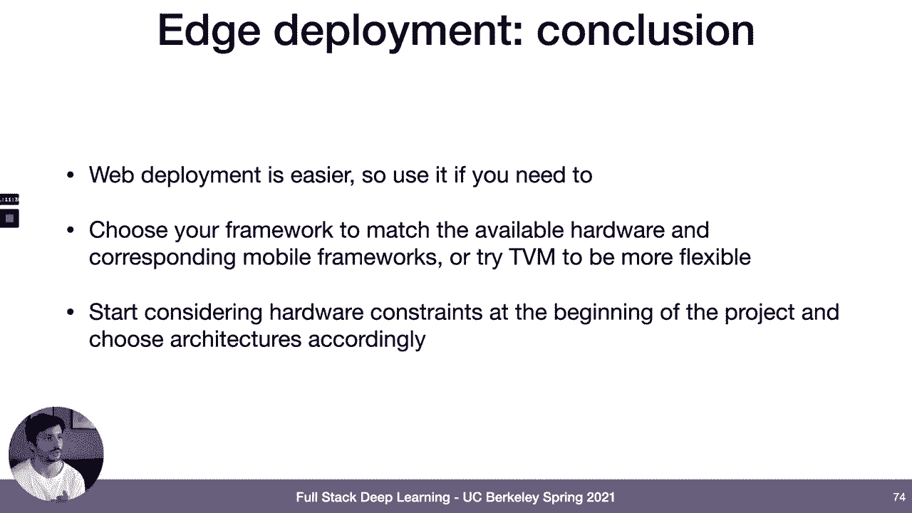